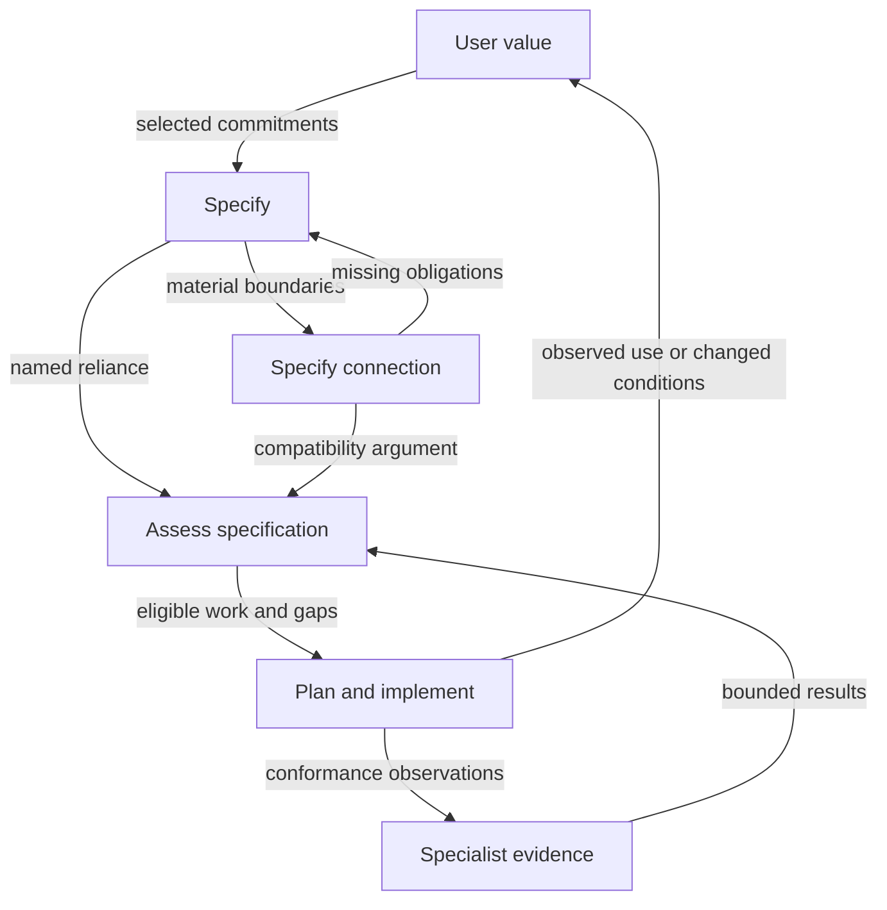

# How user value, specification and delivery fit together

26 September 2026 · Analysis of [draft PR #250](https://github.com/EngraphCode/open-curriculum-ecosystem/pull/250)

The PR combines **an authored user-value skill**, **an owner-ratified specification skill architecture awaiting implementation**, and **the integration and evidence needed to assess both honestly**. These have different maturity and authority. The useful connection is a shared account of what a consumer can accomplish, what provision they may rely on, what realises that provision, and what evidence supports each claim.

The elements are conceptually compatible. The principal risk is treating their compatibility, discoverability or authored fixtures as proof that the methods work. At the ratification snapshot `52a377a25463019d848ffa3e910ffd94b74b5957`, the eight user-value adapters have been added and all reported CI checks passed. Its broadened revision still lacks executed evaluation evidence in the PR. The three specification skills are ratified delivery requirements but remain absent as canonical skill files. Complete implementation and evals are required for acceptance; this remains an unfinished draft.

The analysis recommends preserving a clear division: `user-value` owns usefulness and its relationship to provision; proposed specification procedures own precise obligations, connections and scoped assessment; `plan` owns implementation sequencing. Shared evidence and authority distinctions cross all three without making them a mandatory waterfall.

## 1. Scope, source boundary and method

The inspected starting PR head is `81d61b420404bb2626850779003d372ec6944d4c`, with ten changed paths. The updated framework was then committed as `ee3be9197955022b59a1b94ae4bf49f0d365ed31`, adding one research document. That committed snapshot is the target of this additional analysis. This report is the twelfth changed path when added to the same PR. A commit is an immutable source anchor; it does not imply merge or adoption.

Coverage includes every new substantive file and the altered hunks of existing planning, discovery and permission surfaces, plus the framework's new §13 and Appendix D in the context of retained D2. Existing unrelated contents of the repository are not claimed as comprehensively audited. The PR description and CI output supply delivery-state evidence, not conceptual authority.

The method used planning's distinction between definition and delivery, metacognition, concept exploration, reason, proportionality, and the Parallax framing/synthesis/audit contracts. These were manually applied at standard depth in a bounded same-context analysis. Existing frames and sources were inspected before synthesis; there was no new participant research, field evaluation or runtime execution.

The live question is whether the combined change offers a coherent, proportionate route from use value to specification and delivery, and what a successor must preserve or verify. The original authorisation was to analyse and publish the documents in this draft PR. The later owner ratification now requires implementation and evaluation of the whole family in the same PR, as recorded in §9. It does not authorise merging or changing product commitments.

Stop condition: every changed element has an explicit role and relationship; material overlaps and gaps have a disposition; source and evidence limits are preserved; the successor has a concrete reading and verification route. Exhaustive review of all OCE practice or every possible application is outside that boundary.

## 2. Original changed-element map and ratification update

Paths are relative to the repository. Links for the original ten paths are pinned to the inspected value-work head. File count is a scope check, not a measure of conceptual completeness.

| Element | Role and main relationships | Status and limit |
| --- | --- | --- |
| [`planning/user-value/SKILL-CANONICAL.md`](https://github.com/EngraphCode/open-curriculum-ecosystem/blob/81d61b420404bb2626850779003d372ec6944d4c/.agent/skills/planning/user-value/SKILL-CANONICAL.md) | Owns admission and the method connecting usefulness, consumers, provision and evidence; loads selected references and hands selected work to planning | Authored canonical procedure; no claim of installed availability or revised-version effectiveness |
| [`references/value-model.md`](https://github.com/EngraphCode/open-curriculum-ecosystem/blob/81d61b420404bb2626850779003d372ec6944d4c/.agent/skills/planning/user-value/references/value-model.md) | Defines entities, typed relationships and separate knowledge, delivery and authority distinctions; constrains interpretations in the procedure and examples | Reference semantics, explicitly the skill's synthesis rather than a GDS-mandated ontology |
| [`references/journeys-and-stories.md`](https://github.com/EngraphCode/open-curriculum-ecosystem/blob/81d61b420404bb2626850779003d372ec6944d4c/.agent/skills/planning/user-value/references/journeys-and-stories.md) | Specialises the method for human experience, story slicing, recovery and migration; reads the levels reference for other consumers | Optional view, not a prerequisite for every API or component |
| [`references/levels-and-implementation.md`](https://github.com/EngraphCode/open-curriculum-ecosystem/blob/81d61b420404bb2626850779003d372ec6944d4c/.agent/skills/planning/user-value/references/levels-and-implementation.md) | Generalises beyond service design; distinguishes refinement, conformance, enablement and contribution; exposes composition with a queue/scheduler example | Guards the broadened scope and prevents an invented human-impact chain |
| [`evals/evals.json`](https://github.com/EngraphCode/open-curriculum-ecosystem/blob/81d61b420404bb2626850779003d372ec6944d4c/.agent/skills/planning/user-value/evals/evals.json) | Seven tasks and assertions challenge the procedure's substantive outputs, including a negative-routing case | Authored test intentions; no stored outputs or execution results for the broadened revision |
| [`evals/trigger-validation.json`](https://github.com/EngraphCode/open-curriculum-ecosystem/blob/81d61b420404bb2626850779003d372ec6944d4c/.agent/skills/planning/user-value/evals/trigger-validation.json) | Ten queries test whether the name/description should admit or route away a request | Six positive and four negative examples; routing evidence must come from execution |
| [`planning/plan/SKILL-CANONICAL.md`](https://github.com/EngraphCode/open-curriculum-ecosystem/blob/81d61b420404bb2626850779003d372ec6944d4c/.agent/skills/planning/plan/SKILL-CANONICAL.md) | Adds a conditional route to value definition when usefulness, needs or delivery boundaries remain unresolved | Preserves direct implementation planning for settled work; no blanket prerequisite |
| [`.agent/skills/README.md`](https://github.com/EngraphCode/open-curriculum-ecosystem/blob/81d61b420404bb2626850779003d372ec6944d4c/.agent/skills/README.md) | Makes the method discoverable and locates it in the Practice audience | Navigation and audience boundary; not evidence of host availability |
| [`.claude/settings.json`](https://github.com/EngraphCode/open-curriculum-ecosystem/blob/81d61b420404bb2626850779003d372ec6944d4c/.claude/settings.json) | Adds the bare and argument-taking `oak-user-value` permission entries | Host configuration for invocation; does not create the skill, authorise all external actions or certify its outputs |
| [`user-value-method-review-2026-09-26.md`](https://github.com/EngraphCode/open-curriculum-ecosystem/blob/81d61b420404bb2626850779003d372ec6944d4c/.agent/research/user-value-method-review-2026-09-26.md) | Records naming/scope corrections, framing, historical exercises and execution handoff | Provenance and limits; two earlier exercises do not validate the broader revision |
| [`comprehensive-specification-framework-2026-09-26.md`](https://github.com/EngraphCode/open-curriculum-ecosystem/blob/codex/user-value-across-levels/.agent/research/comprehensive-specification-framework-2026-09-26.md) | General framework, six applications, proposed `specify`, `specify-connection`, `assess-specification`, their contracts and evaluation route | D3/document revision 3; proposal only; reuses `user-value` and existing cognition/engineering methods |
| This report | Relates the entire changed set, distinguishes semantic and operational dependencies, and records unresolved reliance | Bounded interpretation of pinned inputs; not a new skill, rule, gate or acceptance authority |

The original PR contains no separate service-value implementation alongside user-value. The current canonical name and references use `user-value`; the earlier names survive only in historical explanation. At the original snapshot, specification-skill paths were documentary designs. They are now required implementation deliverables; their absence is an acceptance gap, not an adapter-generation error.

**Updated inventory:** the ratification snapshot has 20 changed paths. The additional eight are `SKILL.md`, `references/value-model.md`, `references/journeys-and-stories.md` and `references/levels-and-implementation.md` under each of `.agents/skills/oak-user-value/` and `.claude/skills/oak-user-value/`. They project the existing canonical source and three references, supplying the generated files required for host discovery and invocation. Actual host availability still requires verification; these projections add no new conceptual responsibilities. The generator commit is `52a377a25463019d848ffa3e910ffd94b74b5957`. The map and CI failure below retain their earlier pinned evidence; this update supersedes their delivery status.

## 3. Conceptual relationship map

The diagram shows responsibilities and conditional handoffs. It is not a sequence that every task must traverse. All three specification operations currently exist only in the framework.

The diagram's proposed nodes are identified by the surrounding text rather than by installed invocation syntax. Evidence also bears directly on value claims; that relationship is discussed below rather than making this one diagram a complete graph.

Four logically distinct networks overlap:

1. **Value and provision:** a consumer's purpose, needs or opportunity hypotheses relate to capabilities and bounded commitments.
2. **Specification and realisation:** obligations relate to implementations and their conformance evidence.
3. **Composition and reliance:** providers and consumers exchange guarantees, meaning, effects and authority under conditions.
4. **Evidence and decision:** observations support or challenge particular claims; authorised people decide whether the residual uncertainty permits a stated use.

A path through all four networks is not a causal proof. A correct queue may enable a scheduler without preventing starvation; a working scheduling service may help people without improving population outcomes. Each additional inference has its own conditions and evidence.

## 4. Ownership, overlap and seams

The distinction is not “user-value does why, specification does what, planning does how”. Each needs some purpose, mechanism and evidence to be intelligible. The useful boundary is which decision or artifact each owns.

| Shared concern | User-value contribution | Specification contribution | Handoff obligation |
| --- | --- | --- | --- |
| Consumer and purpose | Establish usefulness, context, burden and uncertainty | Preserve the selected rationale and bound the subject's responsibility | Same consumer/context IDs; unknown downstream uses remain unknown |
| Commitment | Identify responsibility offered and its limits of control | Make behaviour, meaning, conditions, failure and permitted variation assessable | A hypothesis cannot become an adopted guarantee during refinement |
| Capability and implementation | Explain what provision enables and what might realise it | Record exact obligations and conformance scope | Preserve many-to-many relationships and alternatives |
| Journey or usage | Expose contextual activity, barriers and recovery | Specify consequential states, effects and interfaces without replacing experience | Only partial translation; retain human agency and tacit work |
| Composition | Ask whether provision can actually be used | Examine required/supplied guarantees and additional interaction obligations | Both endpoints and versions, feasible assumptions, failure and compatibility |
| Evidence | Distinguish demand, acceptance, experienced value and impact | Match evidence to each obligation or reliance; track freshness | Exact claim, source, method, scope, result and unproven remainder |
| Readiness | Identify candidate slices and unresolved definitions | Judge specification adequacy for a named use | Neither substitutes for project acceptance, deployment or risk authority |
| Change | Reopen value when context or observed use changes | Trace changed obligations through affected consumers and evidence | Preserve prior revisions and explicit correspondence |

There is deliberate overlap in meaning, not a need for duplicate source definitions. The value model should remain the home for value/experience constructs; the proposed common specification reference should own obligation/profile/lifecycle detail. Parallax owns general epistemic bridge and crosswalk methods. Domain schemas and code remain in their existing authoritative homes.

Two concrete seams deserve priority in future implementation:

- **Value-to-specification:** a “people can reschedule” proposition must retain availability, support and context assumptions when translated into transaction and confirmation obligations. Passing those obligations cannot close the reduced-missed-appointments claim.
- **Specification-to-plan:** a readiness assessment supplies interpretable work and gaps, not ratification. A delivery plan must still record its actual authority, dependencies and proof obligations under the existing estate.

`user-value` already asks whether parts compose. The proposed connection skill adds a focused procedure for analysing that question when it is the task itself. It should not take ownership of the entire value method or be invoked for every trivial link.

## 5. Altitudes, dimensions and perspectives

The broadening from service-value to user-value is substantive: it changes the admissible subjects and representations. It does not establish one universal ladder from primitives to public value.

| Dimension | Distinctions visible in this PR | Consequence for use |
| --- | --- | --- |
| Subject/granularity | Primitive, component, API, tool, product, service, exploratory project | Choose the actual consumer and relevant obligations; human stories are not universal |
| Organisational reach | Local team, dependent provider, partner host, public-service system | Mapping a dependency does not grant authority over it |
| Time | One call, a journey, repeated use, maintenance, later outcomes | Evidence about immediate success does not establish durability or long-term effects |
| Population | Named consumer, observed participants, excluded people, broader population | Keep reach and distribution separate from aggregate completion |
| Knowledge | Assumption, observed finding, design choice, adopted obligation, assessed result | Formatting and workflow progression must not silently strengthen claims |
| Authority | Define, implement, operate, access, amend, accept and challenge | Invocation permission and evidence confidence are neither substitutes nor synonyms |
| Representation | Narrative, map, contract, schema, executable test, formal argument | Translation can lose meaning; greater formality is not automatic adequacy |
| Maturity | Authored, generated, available, exercised, assessed, adopted | These are distinct states; the PR currently stops before several of them |

Five analysis frames were applied, with shared-source dependence:

| Frame | Unit and perspective | What it makes visible | Discriminating observation |
| --- | --- | --- | --- |
| F1 consumer usefulness | A situated human or technical use | Burden, exclusions, opportunity and unknown application contexts | A conforming artifact cannot be used by its intended consumer |
| F2 contract and composition | Obligation and boundary from engineering/provider viewpoints | Semantic loss, infeasible assumptions, missing interaction behaviour | Local tests pass while the composed workflow fails |
| F3 knowledge and authority | Claim, evidence and decision from evaluator/affected-party viewpoints | Version mismatch, overclaiming, unauthorised acceptance | A hypothetical need becomes “validated” after a handoff |
| F4 capability distribution | Canonical source, generated adapter, host configuration and invocation | Why authoring, discoverability, permission and availability differ | Canonical exists and permission is granted, but the host lacks its adapter |
| F5 minimum-method counterframe | A task and its total author/reviewer effort | Duplication and ceremony introduced by the framework itself | Existing methods produce equal or better results at lower effort |

F1–F3 concern the system being designed; F4 concerns distribution of the methods used to design it; F5 concerns whether those methods are worth their cost. Collapsing those perspectives would confuse a skill's success with the success of a service produced using it.

## 6. Material bridges and crosswalks

Each record belongs to inquiry revision 1, synthesis pass R3, and the pinned source set above. Support is documentary unless an actual CI observation is identified.

| ID | Connection | Conditions, information loss and status |
| --- | --- | --- |
| BR1 | Local conformance → usable composition | Feasible caller obligations, preserved semantics and integrated behaviour are required. Local evidence omits the environment and other parties. The source examples expose the risk; no general empirical guarantee is established |
| BR2 | Usable episode → sustained/population benefit | Requires reach, persistence, context, costs and distributional/causal evidence. Aggregation loses individual variation. No outcome evidence in this PR; inference remains open |
| BR3 | Authored skill → discoverable and invocable capability | Requires generated projection, reference availability and host routing/permission. CI provides direct adverse evidence: eight user-value projection files are absent at the inspected head |
| BR4 | Authored evaluation fixtures → demonstrated method quality | Requires actual outputs, correct version, credible scoring and comparison. Fixture text alone contains no observation. Two historical exercises cannot establish the revised skill's quality |
| BR5 | Coherent framework proposal → better specification practice | Requires unfamiliar-task performance and acceptable maintenance cost. Author walkthroughs lose field variation. This is the main untested hypothesis |
| CW1 | Value constructs → specification claims | Partial, asymmetric, many-to-many; preserves intended use and conditions, adds precise obligations, does not preserve every experiential meaning or prove benefit |
| CW2 | Specification assessment → plan input | Conditional; preserves gaps and proof obligations, cannot transfer adoption or execution authority automatically |
| CW3 | Canonical method → generated platform adapter | Intended mechanical projection; source content and local references must remain available. A permission entry is outside this transformation and cannot substitute for it |
| CW4 | Framework profiles → installed skill procedures | Many-to-many proposed mapping; profiles are subject concerns, procedures are operations. One skill per profile is not warranted |
| CW5 | Historical draft evaluation → broader revision evaluation | Unavailable as direct validation. Historical results can suggest cases and risks; their verdict does not transfer to changed scope, names, routing or semantics |

BR3 has a current concrete failure; BR4 and BR5 have missing evidence rather than demonstrated ineffectiveness. Preserving that distinction matters: missing evaluation is not proof the method is bad, and a promising document is not proof it is good.

## 7. What the evaluation files cover

| Case | Principal relationship challenged | What a successful output still would not prove |
| --- | --- | --- |
| 1: council backlog | Feature/need/target distinction, correspondence and back-office burden | Real resident needs or actual approval outcomes |
| 2: creative learning | Offered value, legitimate unfinished endings and host responsibility | Learning, joy or deployed host behaviour |
| 3: settled priority queue | Negative routing and proportionality | Correct queue implementation; the fixture checks route selection |
| 4: rescheduling claims | Acceptance/demo evidence versus access and causal outcomes | Real reduction in missed appointments |
| 5: self-booking and carers | Distinct journeys, missing emotion evidence and provider authority | Population prevalence or transport improvements |
| 6: reusable queue | Technical consumer, contract/capability/use and unknown application | Scheduler fairness or value in every application |
| 7: curriculum mapping | Schema validity versus semantic composition and teacher use | Better learning or an implemented mapping fix |

The trigger file separately tests admission from short requests. A method can produce a good answer when explicitly invoked yet fail to trigger, or trigger correctly and produce a poor answer. These are separate evaluation questions. Case 3 overlaps a negative trigger deliberately: it checks whether an explicitly presented task is routed appropriately, while the trigger fixture concerns initial selection.

The fixtures are not a controlled benchmark. They have no executed revised-version outputs, baseline comparison or demonstrated scoring reliability in the inspected PR. The two historical exercises are reported by the earlier method-review document; their raw transcripts were not independently inspected in this analysis.

Future specification-skill evaluation needs additional cases beyond the value fixtures: stale evidence after revision, circular assumptions, individually valid but jointly incompatible contracts, authority transfer, a valid tiny specification, and scoped-readiness judgement. These are proposed cases in the framework, not additional completed checks.

## 8. Findings, conflicts and dispositions

| ID | Evidence and consequence | Disposition and next action |
| --- | --- | --- |
| R1: missing generated projections | CI job `static-checks`, ID 108405839480, fails at `pnpm skills:check` and lists eight missing user-value files across `.claude/skills/` and `.agents/skills/`. This prevents a complete distribution claim | Resolved at ratification snapshot: generator commit adds the eight files and CI passes. Recheck generation after remaining skill changes |
| R2: revised-method evidence gap | Seven cases/ten triggers are authored; the method review explicitly limits earlier exercise results to the service-focused draft | Keep effectiveness provisional. Execute the broadened revision and retain exact versions, outputs and scored limitations |
| R3: overlapping semantic territory | Both user-value and the framework describe contracts, composition and evidence | Resolved in the proposal by explicit ownership and pointers. Test handoff fidelity; do not copy definitions into three new skills |
| R4: proposed family may be too heavy | No comparative evidence establishes three operations outperform existing skills plus reference | Preserve the reference-only baseline and test the ratified family. Adverse results warrant an explicit owner scope decision; they do not permit silent omission of a required skill |
| R5: broad name could be misread | The selected name is user-value, but the body includes technical consumers and separates affected people | Source is coherent. Preserve that definition in generated descriptions, examples and successor documentation; do not re-narrow it to human-service journeys |
| R6: “ready” could imply excess authority | Value slices, specification readiness, plan ratification and release acceptance concern different objects and powers | The framework explicitly separates them. Future implementations must preserve scope and authority in outputs |
| R7: public research sources are not all bundled | Framework examples draw on named Clef project research, while public readers receive only the self-contained proposal | Citation boundary is explicit and substantive examples are included. This report does not claim independent revalidation of those project sources |
| R8: two distribution copies can diverge | Owner requested documents in both the research collection and PR | This delivery uses identical document revisions/content. Later changes must identify the changed revision and reconcile the counterpart; neither copy creates a separate adoption decision |

Severity is high for relying on availability or effectiveness despite R1/R2, medium for future routing/duplication failures in R3–R6, and contextual for provenance/maintenance in R7/R8. Confidence is high in the directly inspected states and text distinctions; low in any claim about future comparative performance. The cheapest resolving actions are named in the table. No finding requires editing the user-value method merely to conform it to the framework proposal.

These are not all conflicts of fact. R3 is an ownership/design question; R4 an empirical cost/benefit question; R6 an authority distinction. More wording cannot resolve the missing observations in R2 or R4.

## 9. Coherent adoption and completion path

For the existing PR, a successor should read the canonical user-value skill, select the relevant references, read its method review, then the framework's §13 and Appendix D, and finally this relationship analysis. The general framework's earlier sections remain the conceptual reference.

The owner ratified all three specification skills on 26 September 2026 and explicitly required proper skill creation and evals as acceptance criteria for this PR. The earlier option to complete user-value while leaving specification skills to a separate commission is superseded.

The binding completion contract is [framework Appendix E](https://github.com/EngraphCode/open-curriculum-ecosystem/blob/codex/user-value-across-levels/.agent/research/comprehensive-specification-framework-2026-09-26.md#appendix-e-owner-ratification-and-pr-acceptance--26-september-2026). It requires complete canonical implementations of `user-value`, `specify`, `specify-connection` and `assess-specification`, shared references, generated adapters, discovery/permission integration, and evals for every new or materially changed skill—including `plan`. Existing generated user-value adapters are complete at the ratification snapshot; this does not close the remaining criteria.

A successor must execute the per-skill cases and cross-skill handoff/revision exercise, retain versioned outputs and grading evidence, compare against a baseline, review actual outputs, resolve critical failures, and verify required checks on the final head. The current tree contains user-value fixtures but no new specification skill directories or plan eval suite. Earlier exercises and green repository checks do not substitute for these evaluations.

The framework's §13 and Appendix E define the capabilities and completion sequence. Preserve the existing audience boundary: these are Practice authoring skills, not learner-facing pedagogical skills. Clef supplies a demanding case; the service, engineering, data and exploratory-project scope remains general.

The ratification changes implementation scope and acceptance authority. It supplies no new empirical evidence, no approval to merge, and no permission to infer that a resulting product is valuable because its specification passed an assessment.

## 10. Review, epistemic profile and return

The framework D3 received a separate-context focused document review using code-expert gateway, documentation-accuracy and prose-clarity concerns in one pass. The reviewer inspected the supplied D2 and PR sources and reported no material findings for provisional inclusion. It did not validate historical research, runtime behaviour, installation or full repository doctrine compliance. This report's synthesis is same-context and shares those sources; the reviewer is not counted as independent empirical corroboration.

The same reviewer subsequently checked this relationship report against the supplied source snapshots and framework, finding no material semantic or handoff defect. A minor diagram-description mismatch was corrected. That review shares sources and prior framework context; it did not independently verify the CI log, remote publication or document-copy correspondence.

| Dimension | Current warrant | What remains unknown |
| --- | --- | --- |
| Source traceability | Exact original head, file inventory, framework commit/blob and CI job are identified | Later branch changes require a new comparison |
| Conceptual consistency | Direct text comparison supports the separation of value, obligation, evidence and delivery | Whether unfamiliar users apply it consistently |
| Operational availability | Concrete evidence of missing projections at the starting head | Final generated estate and host discovery |
| Method effectiveness | Historical exercises on a narrower draft; authored revised fixtures | Revised-method performance and baseline advantage |
| Generality | Technical, service, data and discovery examples are represented | Transfer across actual projects and teams |
| Cost and maintainability | Explicit minimal-method counterframe and shared ownership | Measured effort, duplication and drift over time |

Audit disposition: **qualified**. Epistemic status: **provisional**. The combined PR has a coherent design story and an explicit unfinished operational state. It is suitable for discussion and successor completion, not a declaration of merge readiness or demonstrated efficacy.

The world-return contract is a proposal for the next authorised evaluator, not an assignment: before first evaluation, name the evaluator, case set, comparison and effort budget; observe routing and output defects at task scope; inspect affected consumer interpretation and revision propagation; retain adverse results. Reopen immediately for fabricated evidence/authority or a critical semantic loss. Reconsider the family shape when repeated misrouting, duplicated records or baseline-equivalent quality at higher effort appears. Do not infer organisation-wide benefit from a handful of authored task outcomes.

Learning signal `VALUE-SPEC-REL-01`: the same idea—useful reliance under conditions—appears in value definition, specification and evaluation, but its artifact and authority change at each boundary. The design response is shared identity and explicit handoffs, not a compulsory hierarchy. This is a provisional synthesis from this one change set. It warrants focused trials, not automatic amendment of standing OCE doctrine.

## Appendix. Reproducible source ledger

The original ten-file inventory was obtained from the PR's changed-files endpoint and inspected at `81d61b420404bb2626850779003d372ec6944d4c`. The framework-only commit adds precisely one path and preserves the original ten-file content.

| Path | Git blob SHA |
| --- | --- |
| `.agent/research/user-value-method-review-2026-09-26.md` | `bbe1e61e2e7fc26fcc0c3e45eabefc8db42814d7` |
| `.agent/skills/README.md` | `2baa8ab94fc0e037a27a454774587d58a1ae9ea9` |
| `.agent/skills/planning/plan/SKILL-CANONICAL.md` | `cddedc8a03c1c9c0f8423800b6d7e09417925692` |
| `.agent/skills/planning/user-value/SKILL-CANONICAL.md` | `f5f0b38dcd0334d7d5621726e22de7c28eac6c8f` |
| `.agent/skills/planning/user-value/evals/evals.json` | `2f81e653d3a57ffc46345495eaecdeadfd9bffbe` |
| `.agent/skills/planning/user-value/evals/trigger-validation.json` | `d5189f7edb8014f47c991e126cafbe65781c00ce` |
| `.agent/skills/planning/user-value/references/journeys-and-stories.md` | `a2bcca1bb941e0a5ae6a63ebdb9b343d72978b8c` |
| `.agent/skills/planning/user-value/references/levels-and-implementation.md` | `1e9d9e80d2e160d660434a34e38699020d825f2a` |
| `.agent/skills/planning/user-value/references/value-model.md` | `318ff374315c8663b3463d07ef5ab541653ea490` |
| `.claude/settings.json` | `183927fe6df3fbb74740151e3786d60ad8df9630` |
| `.agent/research/comprehensive-specification-framework-2026-09-26.md` | `dea0ebdf5230122dd903c3ed32b77844620c2b35` |

The framework source commit is `ee3be9197955022b59a1b94ae4bf49f0d365ed31`; its repository content was compared exactly with the revised document before this analysis. This report does not include its own eventual commit identifier because that would require changing the content being identified. The enclosing commit supplies that provenance.

CI observation: [static-checks job 108405839480](https://github.com/EngraphCode/open-curriculum-ecosystem/actions/runs/36242564949/job/108405839480), log inspected 26 September 2026. The failure states “Missing projection files” and names the four user-value files for each of the two adapter directories. Other jobs were still running during that observation; no final-head green claim is made here. A later delivery message or PR state may report newer checks without rewriting this dated observation.

Revision 2 ratification check: PR #250 remained open and draft at head `52a377a25463019d848ffa3e910ffd94b74b5957`; the changed-files inventory contained 20 paths. [Required CI run 36266753360](https://github.com/EngraphCode/open-curriculum-ecosystem/actions/runs/36266753360), including `run-quality-gates`, had succeeded. This later observation resolves the earlier missing-projection state but does not establish eval completion or predict checks for subsequent heads. The owner instruction in the 26 September conversation is the authority for the revised acceptance scope; the [evaluation guide](https://agentskills.io/skill-creation/evaluating-skills) informs the method, not the owner's scope decision.

Concurrent intake update: `f41ad8e789babdb0d772b4af88b7803ebe0dfd67` subsequently refined user-value and its references, regenerated adapters, added research/report index entries and moved this report to `.agent/reports/user-value/`. These edits are preserved. Its intake record says the seven cases and ten triggers were not run because no fixture runner exists. A missing runner does not waive the owner's eval requirement: use a suitable harness or clean-session execution with retained, reviewable evidence. Evaluation must target the revised skill. This amendment does not re-audit all semantic edits in that intake commit; its CI state is recorded in the PR rather than inferred from the earlier green head.
