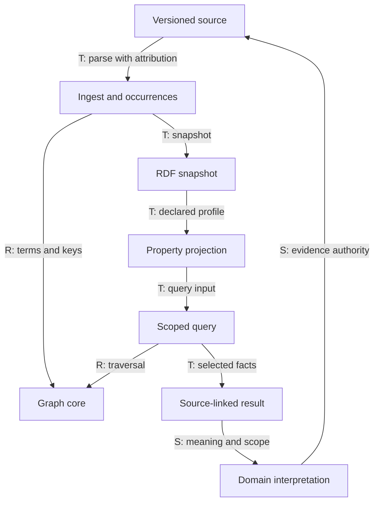
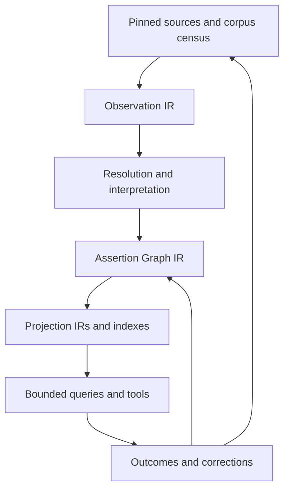

# OCE audit and engineering findings

**Purpose:** let an OCE implementer choose existing capabilities, concrete extensions and the evidence needed to compose them into useful tuition and wider public infrastructure. The estate supplies substantial curriculum access, processing, retrieval, design, source review and operational machinery. The principal tuition additions connect reviewed subject-specific pedagogy, an executable accessible episode and an evaluation instrument. The three should be developed as one useful slice.

**Evidence standing:** this is reconstruction of dated investigations, not a new repository audit. Main Engraph implementation/probe pin: `31e76a7237ee7aecb8adfca96e73b2d83b25be39` (6 September 2026). The inquiry's later head `92d4854b4465238ecca8e7858527b98a3ea08853` changed eight documentary/planning files; source and skill inputs were unchanged. A later plan and ignore-configuration delta is recorded in Appendix J. Historical Oak, Castr and component snapshots have their own pins and must not be projected into this Engraph baseline.

## How to use this document

1. Read the existing-estate account and priority map to identify the reuse or addition.
2. Use the complete C01–C24 register for semantic laws, carriers, consumers, dependencies, placement and proof/reconsideration conditions. These are 24 responsibilities, not a request for 24 packages.
3. Inspect the source observations and recorded P1–P11 evidence before making stronger API or performance claims.
4. Use the detailed technical appendices for graph queries, contract compilation, ORCA, interface portability, identity, observability and platform decisions. These are wider reusable research directions; their presence does not commission them for the first POC.
5. Follow [13](13-oce-work-programme-and-integration.md) for practical work, [07](07-capabilities-bridges-and-proof.md) for cross-level proofs and [04](04-poc-requirements-and-evaluation.md) for educational evaluation.

Oak's complete high-quality curriculum comes through its API and bulk downloads. OCE is Jim's available engineering estate with other consumers as well as tuition. Its source review, model-facing guidance and developer cognition are valuable carriers; reviewed PCK and the operational teaching policy have their own educational authority.

## Dated evidence and source coverage

| Investigation | Pin/denominator and method | What it establishes |
|---|---|---|
| 5 September historical capability assessment, SRC-0020 | Engraph `05ee4f0929ae49a4689a65bc439fa84a61d5ae49`; recursive tree 12,662 entries; 32 manifests under apps/demos/packages | Bounded source/dependency and selected consumer inspection; no full tests, deployments or participant study |
| 5 September revised enablement assessment, F17/SRC-0047 | Same Engraph pin; query construction, EEF load and corpus structural checks executed; CI record inspected | Four retrieval branches and filters for one input; unique node identifiers and resolved edges; source composition, not deployed relevance or learning effect |
| 6 September workspace audit, F18/SRC-0027 v3 | Engraph `31e76a…`; 33 pnpm workspaces, including agent-tools; 43 census subjects, 36 classified and 7 excluded | Manifests, exports, representative implementation chains and real consumers across estate; tests/builds not rerun |
| 6 September contracts inquiry, F19/SRC-0028 rev2 | Same source pin; 20 loaded source/data hashes; eleven source-level probes | Specific positive controls, counterexamples and a bounded synthetic storage comparison; package exports/builds bypassed |
| 6 September impact inquiry, F20/SRC-0031 inquiry rev3/filev2 | Same pin, rechecked load-bearing code/consumers and current plans | Reasoned POC priority and new composition contracts; no runtime composition or educational effects established |

The different 32/33/43 counts have different denominators. Source existence, public exports, test consumer, production-source consumer, installed package, deployed operation, educational effect and independent adoption retain separate status.

## 3. What the implementation audit establishes

### 3.1 Coverage and method

The configured estate contains **33 package workspaces: 10 core, 8 libraries, 4 SDKs, 6 design packages, 2 applications, 2 demos and agent-tools**. The committed census has **43 subjects: 36 classified and 7 exclusions**. Its broader denominator also includes the root, public plugin, runtime-only scripts and engineering/harness surfaces. Appendix A accounts for every package and those additional subjects.

For each package, the audit read the manifest and public export surface, representative implementation chains and actual source consumers. Focused whole-estate searches checked candidate foundations. An exported placeholder, a declared dependency, a test consumer and a product runtime consumer are recorded distinctly. The audit also followed API/bulk data into generated contracts, indexes, graph views and MCP registration.

The source investigation completed a static implementation audit. Dependencies were unavailable in its checkout, so test definitions were inspected but tests, builds, hosted endpoints and authenticated cloud flows were not rerun. The findings establish source implementation and wiring; they do not establish current deployment behaviour or educational effectiveness.

### 3.2 External curriculum content and OCE's processing responsibilities

| Stage | Current implementation | Responsibility |
|---|---|---|
| Source | Oak API and bulk-download service | Supplies curriculum lessons, units, quizzes, assets and associated source data |
| Contract generation | `oak-sdk-codegen`, `openapi-zod-client-adapter` | Builds types, validators and tool contracts from the Oak API schema; composes bulk schemas with bulk-specific templates |
| Direct access | `oak-curriculum-sdk`; HTTP MCP and hub consumers | Authenticated API calls, validation, typed failures, URLs and tool composition |
| Acquisition and preparation | Search CLI download, freshness, bulk/API adapters and optional Redis cache | Downloads external bundles, validates and filters records, supplements them with API data, produces index documents |
| Derived stores and artefacts | Elasticsearch indexes; generated vocabulary and curriculum graph JSON | Retains transformed/searchable representations, with source-specific transformation semantics |
| Retrieval and delivery | `oak-search-sdk`, `graph-corpus-sdk`, curriculum MCP tools, hub pages | Searches indexes, queries bounded views and returns material to consumers |

The downloaded bulk source JSON is gitignored. Tracked schema caches, manifests and generated graph/vocabulary JSON are technical and derived artefacts. The hub's committed **Creating lessons at Oak** course is local professional-training material, distinct from the pupil curriculum supplied by Oak. [Source acquisition and serving evidence](#source-acquisition-serving-and-curriculum-semantics).

### 3.3 Current capabilities and concrete reuse

| Capability today | Current carriers and consumption | Use in the tuition service |
|---|---|---|
| Typed curriculum access | Codegen and curriculum SDK consumed by HTTP MCP, CLI and hub | Use the API client and validated source contracts; preserve external source ownership |
| Search and index operations | Search SDK consumed by HTTP MCP and CLI; hub uses its retrieval surface | Retrieve suitable source material; reuse index lifecycle and extract app-local ingestion where needed |
| Graph structures and corpus views | Graph-core and graph-corpus SDK used by curriculum tool implementations | Reuse graph mechanics and source-supported views; give pedagogical relationships their own validated semantics |
| Interface and activity foundations | Design CSS/tokens/theme machinery used by apps/demos; hub-local activity components | Extract accessible controls and create tuition response/feedback representations |
| Runtime operations | Configuration, Result, logging, tracing, Sentry, PostHog, HTTP auth and lifecycle code | Compose new service operations with explicit tuition event and access policies |
| Knowledge review and provenance | Agent-tools current-source registry, token anchors, generated review workspace and validators | Build pedagogy claim/profile authoring, review, release and source traceability |
| Skills and delivery | Engineering cognition skills, cross-platform adapter generator, public curriculum plugin | Use engineering reasoning to build and review the service; adapt delivery mechanisms for separately authored pedagogy guidance |
| Technical evaluation | Retrieval evaluation, MCP conformance, corpus judgments, fidelity-review | Reuse run/evidence mechanics; add tuition-specific quality, accessibility and learning evaluation |

The MCP-content review workspace at `docs/governance/model-behaviour-content/` is a real generated documentary workspace, with CI consumers. Its current-source projection contains **728 items: 676 available and 52 retired**. Its content models authority, revision, source availability and reachability. That is a concrete foundation for knowledge governance, even though it is not a pnpm package. [Knowledge machinery](#knowledge-skills-and-engineering-plans).

### 3.4 Boundaries that materially affect implementation choices

- **MCP runtime:** the HTTP app creates a new server/transport per request with `sessionIdGenerator: undefined`. Its browser widget renders an orientation shell. Model reasoning comes from a host; no runtime LLM generation call was found in the audited app/demo implementations. New model orchestration and durable learning sessions are required.
- **Activity and design code:** the hub provides real interactions, but `oak-design-react` currently exports theme/motion store adapters only. The identities tier has a README and prepared anatomy, with zero identity-pack workspaces. Build actual tuition components and an identity pack using these foundations.
- **Graph ingestion/projection:** graph-ingest implements JSON-LD-compatible and Turtle parsing plus source-path helpers. Its root and five other parser entrypoints are placeholders. Graph-project has implemented projection/traversal, but neither package had a non-test product consumer. They are available implementation seeds with specific format and attribution limits.
- **Prerequisite semantics:** the generator currently labels adjacent year-sorted thread units `prerequisiteFor`, including an arbitrary within-year tie-break. The corresponding tool remains live in source registration; its removal plan remains a sketch. Use source-supported relationships and reviewed subject-profile requirements for tuition progression. These generated edges must not become authoritative mastery dependencies.
- **EEF corpus:** the fixed snapshot, typed accessors and evidence envelopes are implemented. EEF tool/resource registration is dormant; the snapshot metadata records pending source/acquisition/refresh clarification. Use this as a concrete evidence-adapter starting point, with source-specific provenance resolved for any released pack.
- **Durable service state:** Elasticsearch index lifecycle, Redis API caches, analytics queues and engineering file records exist. A transactional learner/episode store, associated migrations and application durable job/outbox implementation were not found in the reviewed production estate. Those are new service infrastructure responsibilities.
- **Distribution:** source reuse inside OCE is established. Independent installed-package consumption and universal automated publishing are separate work addressed by current publishing/extraction plans.

These are specific implementation facts used to choose reuse, extraction and new work. They are not an overall judgement of OCE against a service it was not built to provide.

| ID | Most impactful remaining capability | What OCE supplies now | Work still needed | Primary altitude and scale |
|---|---|---|---|---|
| **G1** | Warranted subject/PCK profiles | Curriculum material and contextual fields, EEF corpus/accessors, guidance and review machinery | Reviewed applicability, diagnostic alternatives, representations, permitted moves and assessment crosswalks for a bounded profile | Knowledge/domain; concept → episode → subject |
| **G2** | Executable tuition episode and model orchestration | API/search/MCP tools, typed failures, tracing, app patterns | Explicit pedagogical policy, episode transitions, model adapter, response interpretation, bounded output and actual exposure capture | Domain/application; turn → episode → sequence |
| **G3** | Evaluation of tuition quality and durable learning | Retrieval metrics, technical conformance and evidence tooling | Subject-quality cases/rubrics, versioned runs, meaningful comparator, independent unaided and delayed outcomes | Evaluation/service; event → participant → follow-up |
| **G4** | Accessible disciplinary activities and representations | Hub-local interactive blocks, keyboard/focus patterns, design foundations | Task-specific response capture, maths/text/diagram interactions, equivalent modes, meaningful corrections and exposure events | Experience/application; action → complete journey |
| **G5** | Minimal durable educational records and resource authority | OAuth/token verification, caches, analytics and logging | Authoritative attempts/exposures, concurrency and resumability, role/resource rules, retention/correction/export/deletion | Domain/infrastructure; event → session → selective continuity |
| **G6** | Effective educator and learner control | Curriculum browse/guidance and general authenticated tools | Goal/sequence assignment, preview, evidence inspection, correction, pause, intervention and human-support workflows | Service/organisation; lesson → teaching sequence |
| **G7** | End-to-end provenance, release identity and operability | Content registry/anchors, generated review pages, telemetry and delivery tooling | One run/release record binding knowledge, policy, model, interface, exposure and evaluation; controlled change and recovery | Cross-cutting; source revision → run → service version |


The profile, episode and evaluation form the first coupled priority; G4 access applies from first design. G5 retained records and G6 working human authority become critical with actual participant operation; G7 binds the exact release to actual exposure and outcomes. A host or independent evaluator may supply part of the capability if its inspectable contract satisfies the obligation. Bench runs can use reproducible files. Retained participant records need appropriate transactional custody; work beyond a request needs durable execution. The state-free service remains a legitimate baseline.

The EEF `evidenceForMove` accessor selects explicit strand IDs and phase/key-stage/priority axes; it does not map an observed learner response to a validated teaching action. Its evidence envelope omits `data_version` and `last_updated` though the corpus exports them elsewhere: a run must bind the snapshot explicitly. Existing retrieval MRR/NDCG/precision/recall, telemetry and visual triage provide useful mechanisms with different constructs from learning. A complete validated profile, policy, prompt/model/tool/interface/safeguard release and actual help exposure must join independently owned assessment identity and missingness.

## 4. New workspaces for the tuition service

The following is a concrete first decomposition for building the service. Names are proposed engineering names. The responsibilities are needed; repository placement and whether a closely related pair shares a physical workspace are implementation choices. Knowledge packs, runtime libraries, applications and plugin delivery surfaces retain different ownership and release needs.

| Proposed workspace | Responsibility and actual engineering work | Starting point in OCE |
|---|---|---|
| `tuition-contracts` | Versioned activity, response, episode, observation, assessment and feedback schemas; stable domain IDs; typed errors and events; explicit source/profile references | Result and schema generation/validation patterns; hub block schema. Oak API types remain supplied by the curriculum SDK |
| `pedagogy-content` | Source register; pedagogical claims with context, applicability, limits and citations; review decisions; versioned releases; machine-readable and human-review projections | MCP-content registry/projection/anchor machinery, corpus workflows, EEF corpus/accessor precedent and public curriculum guidance |
| `subject-profiles` | Subject/context-specific representations, misconceptions, diagnostic tasks, rubrics, teaching moves, sequencing constraints and accessibility alternatives; compatibility with episode/activity contracts | External Oak content and source facts, curriculum-principles resources, generated vocabulary and source-supported graph views. Profiles can become independently released data packs |
| `tuition-engine` | Learning-episode state machine; response interpretation; choosing practice, feedback and hints; applying profiles; model/tool orchestration; uncertainty handling; human review/escalation events | Existing Result, dependency injection, retrieval, tracing and strict schema practices. The pedagogical policy and learning state transitions are new |
| `learner-records` | Durable observations, attempts and episode state; distinguish observation from assessment and inference; relationships/access grants; retention, correction, export and deletion; resumable read models | New domain contracts over transactional persistence. Existing telemetry and cache mechanisms supply operational patterns only |
| `learning-activities-react` | Accessible response capture and feedback; extract quiz/ordering/reveal controls; add free response and the subject's required mathematical, textual or diagrammatic representations; emit typed events | Hub's 18-block model and six interactive forms, course navigation/focus management, design CSS and theme store |
| `tuition-evaluation` | Versioned cases, runs and observations; grounding/policy/feedback checks; accessibility and failure cases; educator review; delayed/transfer outcome protocols and analysis | Retrieval/conformance/corpus/fidelity evidence mechanics. Educational criteria, fixtures and study results are new |
| `tuition-web` | Learner entry/resume and learning journeys; identity and access composition; human support/review pages; preferences; delivery and operations integration | Hub/Next composition patterns, API/search SDKs, design infrastructure and HTTP operational patterns |
| `tuition-worker` | Host durable background activity: evaluation, knowledge refresh/projection, export/deletion and other work that must survive a web request | New worker application using the jobs and persistence libraries below; existing CLI/telemetry shutdown practices |
| `tuition-experience-lab` | Representative journeys, activity states, keyboard/accessibility alternatives and visual evidence; share fixtures with evaluation | Existing showcase and fidelity-review; a development/demo workspace with actual tuition components |

Add a **tuition identity data pack** to carry its visual assets, semantic overrides and licences. Add a **pedagogy plugin/skill delivery surface** for intended educator or assistant consumers, composing the reviewed knowledge releases. The plugin is a distribution workspace rather than automatically a pnpm member. Neither these product guidance skills nor OCE's engineering cognition skills replace the tuition engine's explicit teaching policy.

The knowledge-infrastructure report motivates separate subject knowledge, pedagogical content knowledge, generic teaching guidance and enacted decisions. The education evidence report motivates separate immediate performance, durable learning and transfer. These distinctions are represented in the proposed content/profile, engine, records and evaluation contracts; they are not converted into a flat feature list. [Educational sources](#educational-sources-supplied-for-this-audit).

## Foundations above elementary operations

### 5.2 Reusable adapters and operational services

| Boundary | Existing OCE contribution and disposition | Required contract and dependencies | First consumers and stage |
|---|---|---|---|
| **Service persistence** | Existing cache, search and local-record patterns inform a **new transactional service boundary**; adopt maintained database/query/migration tools | Transactions, concurrency conflicts, atomic idempotency and outbox writes, migration and recovery; consumes record contracts and domain schemas, with access decisions enforced at the operation boundary | Retained attempt/exposure records and resumable episodes in G5; required when the experiment relies on retained participant state |
| **Durable work** | Operational queues and lifecycle leases provide patterns; **new managed queue/workflow integration** | Enqueue, execution/status, retries, cancellation and delivery records; composes async/time, work envelopes and persistence; dispatch intent/outbox writes join the owning transaction where required, with delivery and reconciliation following the committed intent | Evaluation jobs, ingestion and exports when they cross request lifetimes; introduced with the first such workflow |
| **Model runtime** | Curriculum tools, HTTP lifecycle and observability are reusable inputs; **new provider adapter** using a maintained model SDK | Provider calls, progressive output, schema validation, controlled tool execution, cancellation, budgets and trace linkage; consumes time/async, schema adapters and access decisions | G2 episode execution and G3 comparison harness from the first runnable model experiment |
| **Resource access** | HTTP token/resource validation supplies an **extraction seed plus new service policy binding** | Verified actor/action/resource decisions, explicit reasons and policy versions; consumes identity-provider evidence and domain relationship/state information | Educator assignment/review, learner records and exports in G5/G6; exercised with synthetic actors at bench and real relationships at participant use |
| **Schema adapters** | Agent-tools schema-to-Result parsing supplies an **extraction seed** | Apply a supplied schema and return typed success/failure through existing Result; portable schema-building helpers where consumers require them. Domain schemas own strictness, payload meaning and version changes | Profile/fixture loading, model-output validation and record boundaries from bench stage |
| **Artefact I/O** | Downloaders, dataset writers and checked publication supply **extraction seeds plus new bundle semantics** | Validated manifests, bounded/backpressure-aware transfers, digest validation, atomic single-file replacement and complete bundle publication; consumes schemas, canonical identity, source/record descriptors and async control, with filesystem/object-store adapters | Reviewed profile releases, fixtures and evaluation bundles in G1/G3/G7 from bench stage; remote distribution and exports as hosting requires |
| **Cache, signing and privacy adapters** | CLI cache, signed-download functions and purpose-scoped HMAC pseudonyms supply **consumer-driven extraction opportunities** | Separate contracts for versioned/namespaced caching, scoped expiring capabilities and purpose-specific pseudonyms; compose identity, time and provider/key bindings, with purpose and access rules supplied by the domain | Curriculum retrieval reuse, controlled asset/export delivery and scoped telemetry; each is extracted when its concrete consumer needs it |

F18 §5.2 identifies these carriers. The [schema parser][R39], [checked publication][R40], [cache wrapper][R41], [pseudonym implementation][R42] and [signed-download functions][R43] provide direct implementation anchors. Artefact I/O also draws on [bounded atomic single-file publication][R44], the [bulk downloader][R45] and the [dataset writer][R46]. Existing implementations are seeds for the proposed shared contracts; their present guarantees determine the extension work.

**Artefact identity and delivery have separate acceptance conditions.** A digest identifies bytes. A source reference identifies their origin and revision. A publisher must establish that every required member of a release is present and validated, and a consumer must identify the complete version it loaded. For multi-file or object-store publication, stage and validate the bundle, then expose a complete release through the host's publication mechanism. The current checked publisher stages files and supports rollback; the complete-release contract adds the consumer-visible consistency required by this use. Native streams, filesystem operations and managed object storage provide the transport mechanisms.

The schema adapter applies the strictness expressed by its supplied schema. Resource-access policy governs permission to perform an operation. Pseudonyms scope identifiers to a declared purpose. These properties receive separate evidence during review. Transactional persistence owns the authoritative educational record; caching and telemetry use their own derived representations and retention rules.

### 5.3 Consequential interactions and evidence

The following are proposed composition contracts. Their acceptance observations connect the low-level work to the service and evaluation claims.

| Intended result | Responsibilities that compose | Observation that demonstrates the contract |
|---|---|---|
| **Reproducible profile and evaluation input** | Canonical identity + source references + schema adapters + artefact I/O + run manifest | The consumer records a validated, complete release identity; a partial, mixed-version or digest-mismatched bundle fails before use |
| **A controlled model activity** | Time/async + model adapter + domain output schemas + tool access policy + tuition episode transitions | Cancellation and budgets propagate through calls and cleanup; invalid output cannot advance the episode; selected, delivered and acknowledged learner-facing output are recorded distinctly |
| **Reliable work after a committed change** | Record contracts + transactional persistence/idempotency + outbox + durable execution | A committed operation carries its dispatch intent; repeated requests and deliveries have controlled effects; retries and reconciliation retain correlation to the original operation |
| **Accountable retained records and exports** | Identity evidence + actor/action/resource policy + persistence + optional scoped signing and pseudonyms | Each operation applies the relevant relationship and policy version; record access, export delivery and correction/deletion responsibilities can be traced through their owning services |
| **A valid exposure-to-outcome link** | Activity capture + tuition record schemas + release/run identity + durable custody + evaluator interface | Evaluation can determine the task/version and help actually presented, later learner action, assessment identity and missingness. Display acknowledgement is operational evidence; learner engagement and understanding require their own observations |

These observations guide contract and composition verification. They also make scope decisions concrete: bench runs can exercise complete bundles and synthetic records, while retained participant state and work beyond request lifetimes activate the corresponding durable mechanisms.

The [reliable-atoms programme][R29] is a sketch dated **17 August 2026**, carrying explicit owner direction on small, strict modules, misuse examples, contract and performance proof. The five boundaries in §5.1 provide initial POC-driven register candidates within that broader programme. The [survey-machinery deconstruction plan][R30] contributes construct-level extraction evidence. Each candidate's register entry should retain its carrier, public contract, first consumers, dependencies, bounds, failure behaviour and meaningful verification, with plan correspondence in §6.

OCE already supplies substantial RDF/graph-view and traversal mechanics. The POC can reuse these where its profile, source-reference or retrieval contracts call for them. The census target inventory places graph-project consolidation within graph-ingest; package ownership belongs to that existing architecture work. [Graph public API][R31], [ingest exports][R32], [census target][R33].

## Core inquiry: authority and subsequent documentation

### Authority ledger

| Source and standing at the pin | Consequence for this inquiry |
|---|---|
| [Current plan index][s-plans] | A new plan is born sketch until fully stamped. Predecessor planning corpora are conserved evidence, not present baselines. A retained `active` directory name cannot promote an old queue. |
| [Toolkit re-architecture][s-toolkit], ratified, with incorporated Atlas changes | Adopt-first foundation reasoning, toolkit/product responsibilities and liveness apply. A package can have an explicit incubation warrant; bounded absence of a product import is not automatic retirement authority. |
| [Atlas foundation charter][s-atlas], later specific owner direction | For standard concepts, one embedded instance is sufficient admission evidence; the concept’s canonical contract matters more than literal extraction of its incumbent helper. The earlier two-consumer test remains useful consolidation evidence, not a universal veto. |
| [Reliable atoms][s-atoms], strategic sketch carrying owner direction | Small strict fundamental modules, register/conformance support and an exemplar are supported ambitions. No finished atom catalogue, tracked atom register or completed conformance tranche was found. This report’s register is inquiry output, not the programme’s ratified register. |
| [Shared extraction pilot][s-pilot], ratified | A complete factor/test/document/migrate slice is a precedent. Workflow-stage scaffolding belongs at library level; `utf16-order` is queued separately. The pilot’s two-consuming-workflow migration contract is not erased by standard-concept admission. |
| [Survey deconstruction][s-survey] and [TypeScript estate review][s-review], ratified | Survey evidence is beneficial to atoms, not blocking. The review directory contains contracts/calibration/handoff material; the complete extraction/evidence/manifest/report/proposals output family described by the plan was not found. Specification is not completion. |
| [ADR-173][s-adr173] and [ADR-179][s-adr179], accepted/amended | Plural graphs, real consumer operations and transport-free graph data/functions guide design. Intended topology is separate from implemented inventory. The June amendment supersedes imaginary stub-operation and numbered adapter-activation sequencing. |
| [Conserved graph-stack plan][s-old-graph] and [graph-library research][s-graph-research] | Retain provenance, representation, validation/enhancement, performance and GraphDocument reconsideration questions. Do not restore their whole delivery queue or assume their illustrative models are coherent implemented contracts. |
| [Honest curriculum structure][s-honest], [claim removal][s-removal], [true views][s-true-views], [upstream exposure][s-upstream], current sketches | These distinguish source fidelity, semantic claim repair, useful source-supported views and possible upstream requests. They are proposals available for subsequent delivery scoping. |
| [Merged Engraph owner context][s-owner], 5 September | Oak application extraction is top priority in the Oak fork, not necessarily Engraph. The earlier toolkit programme sequence does not make this inquiry or tuition delivery wait for that extraction. F18’s then-pending documentation was merged during this inquiry; the delta below distinguishes merged continuity from the untracked/proposed work it describes. |

### Final-refresh delta: current head advanced during the inquiry

The final GitHub branch read and local fetch resolved [head `92d4854b4465238ecca8e7858527b98a3ea08853`][latest], which merges PR #56. The comparison from the probe pin changes **eight documentation, planning, continuity and design-review files**. A direct diff of `packages`, `apps`, `agent-tools` and `.agent/skills` is empty. All twenty probe-input hashes also match the original pinned Git objects. The probes remain evidence for unchanged source; no runtime rerun was needed merely because documentation merged.

| New authority/context | Effect on these recommendations |
|---|---|
| [Code-scanning alerts-to-zero][s-scanning-latest], **new sketch** serving reliable-atoms | Add adjacent contract questions: JSON data encoding versus target-language source-literal encoding; trusted executable acquisition; purpose-specific random/hash policies. The node is not a delivered cure or ratified catalogue. Its alert census is a record in that plan, not independently re-queried here. |
| Code-emission proposal versus C03 | Existing [Zod generator][s-zodgen] and [MCP type generator][s-build-zod] embed JSON-stringified values in emitted code. This supports a separate **target-language/context encoding contract**, not a finding of vulnerability from JSON alone. First proof: parse and roundtrip representative literals, including separators, in the actual target/compiler context. Keep with generator owner unless an identical independent law earns extraction; do not change canonical artefact bytes as a side effect. Exact flagged alert site was not independently resolved. |
| Trusted-executable proposal | [Trusted git][s-trusted-git] and [trusted gh][s-trusted-gh] use fixed-directory policies; [pnpm acquisition][s-pnpm-path] has environment-derived absolute candidates. These are existing runtime adapters with different admitted authorities. A pure path-value check is distinct from resolving/executing a program. Route any shared adapter through the new sketch and its governing policy; no universal allowlist atom or new workstream is selected here. |
| Random/hash proposals versus C05/C12 | Preserve deterministic seed/replay behaviour in [orchestration jitter][s-jitter]; randomness acquisition is an effectful boundary. [Trace-ID derivation][s-trace-id] has a fixed-width observability purpose distinct from content identity and secrets. The sketch proposes changes at selected sites; it does not redefine all jitter or hash contracts. Revisit those specific consumers if implementing the proposal. |
| Incoming rate control versus SDK spacing | [ADR-219][s-adr219] places incoming MCP abuse/volumetric control at the edge. It does not refute or repair outbound SDK request-spacing behaviour. I4/C13 concern the latter; they do not propose forbidden in-process server abuse middleware. |
| [Merged owner/visitor continuity][s-owner-latest] and adapter-prefix ratification | Engraph has no Linear workflow; plan lifecycles follow standing rules without invented owner gates; the prefix mechanism is to preserve current configuration/output. Visitor/EEF projection notes are now merged records, but describe untracked lane nodes and proposed work, not delivered packages. These facts change source standing, not graph implementation inventory. |

The final recommendation incorporates this delta without broadening into an alert-remediation or Practice-transfer project. Future implementation should refresh current authority again; the report deliberately preserves its executed evidence pin.

The source's protected frames examined laws/mechanisms, meaning/provenance, execution/resources, responsibility/change, consumer journeys and adoption/minimal ownership. They shared sources, brief and model lineage. Their useful contribution is different failure questions; agreement does not create empirical independence.

## 3. Current and proposed capability map

| Carrier | Implemented and observed source composition | Useful disposition |
|---|---|---|
| `packages/core/graph-core` | Structural RDF terms, mutable array DatasetCore, JSON-LD/RDF canonicalisation adapters, vocabulary, fixed-scope GraphView. Corpus SDK uses graph views. | **Repair/finish** term keys, snapshot/validation contracts and measured storage choices in the existing owner. Continue adopted JSON-LD/canonicalisation machinery. Further physical splitting needs a change/dependency case. |
| `packages/libs/graph-ingest` | JSON-LD-compatible and Turtle parsers, source-path subpath. Root and other parser barrels reserve capabilities. No non-test product import located in the bounded apps/packages/agent-tools search. | **Repair/finish** attribution in one consuming slice. Give reserved parsers a real consumer before implementation. An incubation warrant is a valid alternative to either invented liveness or deletion. |
| `packages/libs/graph-project` | Bounded RDF/property projection and property-graph operations. No non-test product import located in the same search. | **Finish** a supported profile, explicit losses/rejection and a real consumer. Retain existing multivalue fidelity. |
| `packages/sdks/graph-corpus-sdk` | Direct generated curriculum JSON and direct EEF snapshot views; curriculum operations flow into SDK MCP handlers. | **Reuse/repair** semantic views. Keep source/domain interpretation here or with generated source authority. Do not force all data through RDF. |
| Proposed `graph-enhance`, `graph-validate` | Intended responsibilities in accepted architecture and conserved design; no implemented workspaces at the pin. | **Create selectively** when one slice needs a concrete mapping and constraint report. Validation consumes plain enhancement data; no callback cycle into transformation. |
| GraphDocument/GraphNode/GraphEdge historical model | Research sketch, including property bags and separately stored derived state; current GraphView’s GraphEdge does not establish that the historical trio exists. | **Reshape/trial** an ergonomic typed composition façade. Derive through existing representations; remove superseded surfaces if promoted. |
| Agent-tools deterministic/anchor/schema/publication modules | Real source modules, with mixed non-test and test-only demand. Private tooling manifest has no library exports/main/types. | **Reuse locally; selectively extract** explicit laws or libraries. Source-loading is not an independently usable package proof. |
| Logger/SDK/application execution carriers | Monotonic measurements, retry/rate-limit, caches, leases and publication exist with different policies and owners. | **Repair the consuming carrier; separate** pure arithmetic from runtime/provider/domain responsibility. |

Inventory and manifest evidence: [graph-core manifest][s-core-package], [ingest manifest][s-ingest-package], [project manifest][s-project-package], [corpus manifest][s-corpus-package], [tooling manifest][s-tools-package]. All four graph workspaces are private at this pin. A dist export declaration is not proof of a successful built or packed import. External consumers and deployed instances were not enumerated.

### Source → export → consumer traces

| Trace | Evidence ceiling and consequence |
|---|---|
| Bulk generator/schema → generated graph-corpus subpath → `graph-corpus-sdk` view → curriculum SDK handler → app served-surface configuration | Actual source composition. Generated authority stays in SDK codegen; narrowing semantics requires the whole trace, including descriptions. No deployed call was observed. [Generator][s-generator], [corpus loader][s-corpus-load], [handler][s-handler], [served configuration][s-served]. |
| EEF snapshot → EEF GraphView/evidence accessor → SDK registry → dormant app setting | Accessor and interpretation material exist, but registration is dormant in the app. Exact strand lookup and curated nonexhaustive context have different completeness meanings. Do not turn this into a released knowledge-review system or silently refresh its source. [EEF graph][s-eef-graph], [EEF evidence][s-eef-evidence], [served configuration][s-served]. |
| `compareUtf16`/`lengthFrame` → identity, manifest, validation and fingerprint modules | Many real internal uses, not necessarily independent consumer owners. Supports an embedded standard-concept candidate; public package usability remains open. [Ordering][s-order], [framing][s-frame], [identity hashing][s-identity]. |
| `serialiseCanonicalJson` → `publishRawExtraction` → integration and smoke callers | Implementation and test definitions exist; no non-test transitive product invocation located. Do not claim a delivered artefact pipeline from these callers. [Encoder][s-json], [single-file publisher][s-publication]. |
| `publishCurrentSourceArtifacts` → `validate-current-source` → CLI scripts | Actual tooling consumer, staging and rollback semantics. Separate from the previous publisher. [Current-source publisher][s-current-publish], [CLI orchestrator][s-current-validate], [tooling manifest][s-tools-package]. |
| `parseWithSchema` → corpus analysis, restatement audit, refounding, MCP conformance and merge-bot | Reuse across tooling purposes; Zod-specific adapter and schema-owned output. It neither imposes strict schemas nor catches every user callback exception. [Schema parser][s-parse]. |
| Logger timers → public root exports → HTTP authentication/correlation/bootstrap imports | Public source composition and real caller demand. Wall timestamps, measured elapsed time and close-once lifecycle remain distinct. [Timing][s-timing]. |
| Retry/config/rate-limit → BaseApiClient → public client factories | Existing SDK carrier; P6 exercises the source runner with fake fetch. Repair policy integration here before exporting broader guarantees. [Retry][s-retry], [BaseApiClient][s-base-client]. |

## 4. Five contrasting consumer journeys

| Journey and current/proposed standing | Contract interactions and first convincing demonstration |
|---|---|
| **J1 — Oak source to bounded curriculum view.** Current source path, semantic repair proposed. | Validate external schema at authority; retain source revision; generate honest membership/placement/prose records; query a declared selected corpus; serve qualified meaning. Use one real bulk fixture as the first demonstration, then cover all current served/guidance/normative claim surfaces and the recurrence guard in I1. Completion requires removal of the fabricated relationship/view/tool, not just a changed label. Mechanical field tracing and curriculum meaning review are separate proofs. |
| **J2 — JSON-LD/Turtle to attributable graph result.** Parsers/projections implemented; full product slice proposed. | Source identity/revision → parser-aware occurrences → structurally keyed RDF snapshot → explicit projection profile → bounded query with source links. Demonstrate a repeated fact in two source occurrences, one unavailable location, and an excluded graph/term form. Every occurrence survives; unsupported scope is rejected or reported as loss. |
| **J3 — Reviewed knowledge claim to cited evidence.** Project design, not existing end-to-end delivery. | A domain-owned claim points to source snapshots, scope/conditions and review decision; a versioned transformation builds an artefact/manifest; a query returns the selected evidence and citation. Content hash does not identify the claim’s truth or review authority. Demonstrate one changed source and one superseded review without silently changing a previously cited revision. EEF’s accessor offers useful evidence-envelope patterns, not the full review/release system. |
| **J4 — Tooling record/anchor/publication to reusable contract.** Existing internal consumers; extraction proposed. | Preserve exact encoder profile; distinguish raw byte identity from NFC/escape-normalised token offsets; frame byte fields unambiguously; publish under an explicit storage contract. Demonstrate a public import in a real consumer and replay one encoding/normaliser change. Keep version recipes and audit semantics at their owner. |
| **J5 — Tuition observation/evaluation to durable service boundary.** Proposed service-owned slice. | A record distinguishes observation, action, derived hypothesis and evaluation outcome, referencing source/profile/policy/schema revisions as applicable. Storage owns transaction/idempotency and, if needed, transactional outbox semantics. Logging/cache/lease helpers do not establish authoritative persistence. Demonstrate a duplicate submission, a profile revision and an amended observation without conflating them or overwriting the evidence used for evaluation. |

J3/J5 are deliberately contrasting design probes, not a commitment to one representation or a universal event envelope. Retention, permissions, review authority and evaluation interpretation remain service/profile decisions. A new graph/core dependency is justified only where its semantics are actually used.

## 5. Contract and workspace register

Each row is a semantic responsibility, not a requested workspace. **Core candidate** means domain-free law with a small dependency budget; **library** means reusable orchestration, format/provider adaptation or cohesive graph machinery; **corpus/service** means interpretation and domain authority. A subpath/module can remain in its current package until an independent ownership/release case exists. Dependencies here describe necessary semantics/mechanisms, not a universal delivery sequence.

### Deterministic data, records and source references

| ID / F18 input | Current carrier; semantic law | Consumer, dependencies and proposed placement/disposition | Proof and removal/reconsideration condition |
|---|---|---|---|
| **C01 / canonical-data** UTF-16 order | [Tooling comparator][s-order]. Total JS string code-unit order; no locale collation or Unicode normalisation. | Tooling serializer, manifests and graph-text sorting. Native comparisons; **reuse/extract** smallest core concept module or subpath; queued exemplar candidate. | Antisymmetry, transitivity, equality and Unicode boundary/misuse cases; public consuming proof. Drop standalone wrapper if it contributes neither an adopted law/proof nor useful discovery. One embedded instance can meet later standard-concept admission. |
| **C02 / canonical-data** byte order | [Identity hashing][s-identity] uses UTF-8 byte order for implementation paths. | Identity recipe; native byte comparison/runtime adapter. **Retain** separately from C01; extract only its exact byte-comparison law if needed. | Non-ASCII cases must distinguish code-unit and encoded-byte ordering. Do not substitute comparators inside a persisted digest recipe without a version transition. |
| **C03 / canonical-data** strict JSON profile | [Encoder][s-json]: finite/plain JSON, UTF-16-sorted keys, array order, two-space indentation and final newline; rejects cycles, sparse/unsupported values. | Test/smoke publication demand found; Result/type helpers and tooling error coupling. **Finish/reshape** versioned pure codec before optional core promotion. | Exact bytes/admission fixtures, stable input ownership, structured failure and input/work/depth budget if promised. P4 exposes getters and post-render size checking. Keep existing profile identity or version a changed format; do not call it JCS. |
| **C04 / canonical-data** length framing | [Framing][s-frame]: unsigned 64-bit big-endian byte length plus exact bytes. | Identity/fingerprint/digest recipes. Native DataView/Buffer mechanism; **reuse/extract** small core module if its explicit law adds value. | Unambiguous tuple encoding and cross-runtime parity. P5 returns aliased bytes: choose documented borrow lifetime or snapshot. Keep local implementation if a package costs more than its proof/ownership benefit. |
| **C05 / canonical-data + record-contracts** identity recipes | [Hashing][s-identity] and graph-node/edge identity compose domains, versions, paths and framed bytes. | Tooling artefacts and graph identities; C02/C04 plus adopted crypto adapter. **Keep composition with semantic owner**; share mechanism only. | Distinguish byte artefact, RDF equivalence class, domain entity and occurrence identities. Prove source/profile change behaviour and allowed Unicode encoding domain. Reopen when new inputs require changed identity; no universal entity-ID atom. |
| **C06 / source-reference** source/revision/occurrence values | SourceMap and current-source model partly encode these concerns. One statement can have many occurrences. | Graph ingestion, knowledge evidence, tooling citations, proposed service references. **Create small shared values only where laws match**; revision/occurrence semantics stay explicit. | Two documents and repeated positions survive dedup; source IDs include required authority/scope. If only field names overlap across domains, retain separate records with explicit adapters. |
| **C07 / source-reference** selector grammars and quality | [Source-path][s-key] includes JSON Pointer; [token anchors][s-anchor] use normalised text; Turtle is heuristic. | Format/tooling consumers. **Reuse/adopt** grammar-specific codecs; pointer module can be core; parser/normaliser/location adapters remain libraries. | Roundtrip escapes (P8), Unicode and empty segments; revision-bound coordinates; exact/approximate/unavailable attribution. Raw byte, source line and normalised JS offset spaces must not be implicitly converted. Keep token algorithm with its normaliser. |
| **C08 / record-contracts** schema-to-Result adapters | [Zod helper][s-parse]; separate Ajv schema compiler. Schema determines strictness, transformations and output. | Multiple tooling purposes. Existing Result/Zod/Ajv; **reuse/finish library adapters**, not a new universal schema core. | Inferred transformed output, structured issues, thrown callback policy and version mismatch. Reject promotion if consumers must cast a caller-chosen generic into evidence of schema correctness. Preserve provider-specific contracts where different. |
| **C09 / record-contracts** manifests and domain records | Corpus metadata, tooling extraction records, proposed enhancement/review/service records. | Graph/corpus/service owners; C05–C08 where shared. **Reuse primitives; create owner-specific schemas**. | Schema, source, transformation and artefact revisions are separate axes; an occurrence is not a review decision or causal finding. Split a proposed common envelope when unrelated flags/fields or domain dependencies accumulate. |
| **C10 / canonical-data + record-contracts** publication | [Single-file publisher][s-publication] and [current-source publisher][s-current-publish] promise different visibility/recovery. | First test/smoke; second real CLI. Filesystem/store adapter plus manifest/identity. **Complete/adopt library or storage-native transaction**. | Single rename visibility, crash durability, concurrent ownership and multi-file transaction tested separately. Staging/rollback can expose mixed versions; do not label it a bundle transaction. Remove generic façade if it hides store guarantees. |

### Time, effects, graphs and algorithms

| ID / F18 input | Current carrier; semantic law | Consumer, dependencies and proposed placement/disposition | Proof and removal/reconsideration condition |
|---|---|---|---|
| **C11 / time** clocks/durations/deadlines | [Logger timing][s-timing], SDK timing, cache TTLs and leases use different clock/unit domains. | Logger/public app, SDK and job owners. Native clocks; **reuse** adapters, consider checked duration/arithmetic core modules. Freshness stays domain policy. | Wall instant ≠ monotonic elapsed; seconds/days/ms validated at boundary; finite values and skew. Remeasure-on-end timer ≠ close-once phase. No new workspace solely for renaming Date/performance. |
| **C12 / async-control + time** scheduling/wait/retry | [Config][s-retry-config] arithmetic and [runner][s-retry] effectful fetch/wait. | Real SDK clients; C11, injected randomness/clock as needed, native cancellable waits and HTTP adapter. **Repair in place**, then consider pure policy and effectful runner separately. | Abort before/during wait yields no later attempt; per-status/global limits agree; replay/error/resource semantics explicit. P6 fails broader cancellation/per-status claims. Narrow rather than generalise if consumers need different retry policy. |
| **C13 / async-control** concurrency/bounded accumulation | Rate-limit runner and GraphView frontier/result work expose potential needs. | Actual concurrent client or graph worker only. Native queue/Map/Set/chunk/worker; **finish locally/adopt**, no automatic generic pool/deque. | Maximum active work, spacing/reservation, cancellation and overflow must be explicit. Static concurrent spacing concern needs a deterministic scheduling probe. Depth or output bytes alone do not establish CPU/memory bounds. |
| **C14 / async-control** cache/single-flight | [Search SDK-cache wrappers][s-cache] distinguish successful, negative and failed store results; no single-flight guarantee found. | Application/SDK adapter; store TTL and domain invalidation. **Retain policies**, extract mechanism only for matched contracts. | Same-key concurrent misses, cancellation ownership and failed store semantics. A hit/TTL is not proof of source currency. Do not promote transcript-negative or invisible-store-error policies into core. |
| **C15 / async-control** lifecycle/leases | [Search lifecycle lease][s-lease] and [fidelity run lease][s-run-lease] have distinct liveness/ownership models. | SDK/CLI/workflow, store OCC or filesystem IO. **Keep/adapt owners**, adopt storage coordination for strict jobs. | Search deliberately permits successful execution despite renewal failure; not strict exclusion. Strict ownership needs fencing/conditional release and in-flight cleanup. A pure lease judgement does not prove interprocess atomicity. |
| **C16 / canonical-data + graph** RDF structural key/set | [Terms][s-term], [dataset][s-dataset], [ingest keys][s-key]. Within admitted RDF domain, `equals(a,b) iff key(a)=key(b)`. | Ingest source map, dataset/indexes; RDF fields and blank-node scope. **Repair in graph-core**, share key with ingest; **compare native/adopted storage**. | All equality fields, graph names, nested supported terms, equal distinct objects, duplicates. P1 collision blocks key-based source/index reuse until fixed. Key equality is not blank-node canonical equivalence or cross-source entity resolution. |
| **C17 / graph** immutable read snapshot/indexes | Mutable DatasetCore plus fixed-input [GraphView][s-view]; POJO terms and caller arrays retained. | Graph/corpus consumers. Structural identity/adjacency; **finish ownership in current graph package**. | Snapshot resists external mutation or mutation/update/rebuild protocol is enforced. P2 violates precondition; harden boundary only to needed ownership level. Do not bolt persistent indexes onto mutable external objects without invalidation. |
| **C18 / graph** reachability/query scope | GraphView outgoing BFS, roots included, induced edges among members; full input-edge filtering per result. | Selected corpus views. Native adjacency Map/Set/frontier arrays; **reuse/finish locally**. | Finite integer depth, missing roots, cycles/selfloops/disconnection, deterministic declared order. P11 breadth can exceed hop bound. Complete declared scope, intentional window, resource failure and partial+frontier require distinct outcomes. |
| **C19 / graph** cycle/SCC/topological algorithms | Current bounded BFS needs no DAG assumption; broader operations remain candidate requirements. | Only a consumer with a specified directed-graph question. **Adopt or add module when demanded**; no workspace justified yet. | Cyclic graphs valid; SCC/visited reachability can handle cycles; topological order requires acyclicity and tie/order contract. A curriculum ordering is not pedagogical necessity. Defer until an operation and workload discriminate candidates. |
| **C20 / source-reference + graph** attributable ingest | [JSON-LD parser][s-jsonld-ingest], [Turtle parser][s-turtle], source map. | First source-linked graph consumer proposed; adopted parsers + C06/C07/C16/C17. **Repair/finish graph-ingest**. | Many occurrences and honest precision survive parse/dedup; bnode scope and canonicalisation mapping explicit. JSON-LD root pointer is document attribution, not precise per-fact attribution. Narrow advertised profile if exact locations cannot be supplied. |
| **C21 / graph** projection/loss profile | [To-property][s-project], [from-property][s-project-back]. Supported default-graph subset differs from full RDF. | Proposed property-query consumer; graph-core terms and explicit identity conversion. **Finish graph-project**. | Roundtrip over supported scope including repeated literals; named graphs/TripleTerms and ignored edge properties rejected or reported. P7 excludes two of three quads. Avoid a new model merely concealing these losses. |
| **C22 / record-contracts + graph** enhancement/validation | Planned graph libraries; conserved enhancement record/validation data seam. | One J2 transform/constraint first; C06/C09/C16 and schema adapters where needed. **Create selectively** above core. | Input/output identity, transform version, source/justification and typed findings. Shape validity ≠ semantic truth. Validation consumes data without callbacks into enhancement. Defer empty packages and placeholder operation menus. |
| **C23 / graph** GraphDocument ergonomics | Conserved model plus current RDF Dataset, property graph and GraphView. | J2 and contrasting direct J1/EEF sketches; composition above underlying libraries. **Trial/reshape** façade; defer workspace. | Compare imports, public types, invalidation and conversions against direct functions. Promote only if it removes duplicated ownership/surfaces without upward dependencies or forced RDF. Otherwise retain explicit APIs. |
| **C24 / graph + records** curriculum/knowledge/service meaning | Generated corpus and domain views; J3/J5 proposed owners. | Source/curriculum/knowledge/service consumers; selected primitives only. **Repair or create at domain owner**. | Source→claim mapping and human interpretation review, scope/revision/citation, authoritative persistence where needed. Domain policy leakage into a generic core returns those fields/rules to their owner. |

C14/C15 are mainly negative boundary evidence: they explain why a universal async package would overpromise. The inquiry does not recommend implementing a general cache, distributed lock, queue or event-store programme. Existing Result, platform collections, cryptographic implementations and adopted graph standards machinery remain reuse defaults.

## 6. Interactions, dependencies and representation crosswalk

The diagram shows the proposed attributable-graph composition, not a claim that every arrow is delivered. Labels distinguish runtime import (**R**), data transformation (**T**) and semantic reliance (**S**). Delivery dependencies follow in a separate table.



The last semantic edge expresses justification, not an execution cycle. Enhancement, validation and a possible façade sit at composition seams as required; they do not make core import ingestion, projection, transport or domain policy. J1’s generated typed-JSON path remains separate.

| Edge | Kind and strength | Consequence |
|---|---|---|
| Graph-ingest/project → graph-core | Runtime dependency, current | Own RDF term/key laws once; preserve downward dependency. |
| Source occurrence → RDF statement → property projection | Data transformation, partial/many-to-one | Dedup must retain occurrence multiplicity; projection can lose graph/term distinctions. Carry selected scope and losses explicitly. |
| Source field/citation → relationship interpretation | Semantic reliance, partial | Location evidence cannot mechanically establish predicate meaning. Source-supported adjacency cannot become prerequisite truth by renaming or citation. |
| C16 key repair → key-index/source-map replacement | Delivery dependency, **blocking** | Colliding keys cannot underwrite correctness or performance claims. |
| C17 ownership → persistent derived index/digest guarantee | Delivery dependency, **blocking for that guarantee** | Borrowed mutable input requires ownership/invalidation; no general requirement to freeze the whole estate. |
| Current curriculum repair → all atoms / RDF completion | **No blocking edge** | J1 already has its own generator/view/handler path. |
| Atoms exemplar ↔ working graph/tooling slice | Delivery benefit, **beneficial** | Concept law and real consumer expose different errors; neither needs the whole other programme. |
| Adoption benchmark → chosen storage replacement | Delivery dependency, **blocking only for replacement claim** | Correctness repairs and domain work proceed while comparison is unresolved. |
| Survey deconstruction → candidate register | Delivery benefit, **beneficial** | Useful coverage evidence, not a prerequisite to one observed construct. |
| Oak app extraction → Engraph inquiry/service slice | No established global blocking edge | Preserve fork-specific priorities and actual compatibility dependencies. |

| Crosswalk ID | Mapping and retained/lost distinctions |
|---|---|
| **CW1 — F18 → register → workspace** | Many-to-many and partial: canonical-data→C01–C05/C10/C16; source-reference→C06/C07/C20; record-contracts→C05/C08–C10/C22/C24; time→C11/C12; async-control→C12–C15. Semantic identity is retained; build/release/owner clocks need separate evidence. The mapping does not yield a package count. |
| **CW2 — RDF ↔ property graph ↔ GraphView ↔ sequence** | RDF/property mapping is reversible only for the declared supported subset. GraphView uses caller-labelled IDs/edges and a different scope. Ordered corpus placements can repeat and carry order absent from attribute-less graph edges. No lossless universal crosswalk is established. |
| **CW3 — source ID ↔ selector ↔ fact ↔ citation** | Source/revision identity and selector locate an occurrence; several occurrences may support one statement. Normalised token offsets do not invert to raw byte offsets without a mapping. A citation preserves source routing, not automatic semantic justification. |
| **CW4 — record families** | Schema/source/transform/artefact revision references can be shared asymmetrically. Enhancement, observation, interpretation, review and evaluation records retain different authority and meaning. No universal envelope is warranted by shared field names. |
| **CW5 — plan standing ↔ capability delivery** | Direct translation is unavailable. Ratification, source existence, import composition, executed probes, built imports and deployed behaviour are separate evidence classes. |

## 7. Executed observations and their limits

Companions: [original runner](assets/oce-core-graphs-atoms-probes-2026-09-06.mjs) and [recorded results](assets/oce-core-graphs-atoms-probe-results-2026-09-06.json), preserved unchanged; no rerun was performed during reconstruction. The runner asserts the repository HEAD, source-loads unchanged TypeScript through Node erasure with explicit aliases, records loaded-file SHA-256 values and uses only standard runtime libraries. It runs against a local checkout and performs no network fetches. Assertions capture observed counterexamples as well as positive controls; success means the recorded observation reproduced, not that the current implementation passes a desired future contract.

Environment: Node **24.19.0**, Linux x64, AMD EPYC 9V74 host, 9 visible CPUs, approximately 23.1 GB reported memory. Node’s experimental TypeScript-erasure warning was not suppressed. The alias/source hook bypasses package exports, declarations and normal builds: this is **source-level runtime evidence**, not a package build, typecheck, packed import, vendor conformance suite or deployed result. No production source was modified.

| Probe; basis/pass | Input/procedure → recorded output | Warrant and characteristic error/limit |
|---|---|---|
| **P1; B1/B2, M3** | Two quads differing only in literal direction → unequal, dataset size 2, equal source key, source-map size 1. | Concrete mismatch between equality and provenance key. Synthetic accepted POJO values; does not show a real corpus occurrence or complete RDF vendor support. |
| **P2; B3/B4, M3** | Create view, append an edge to caller array, compare retained versus newly built view → old reachable nodes a/b; fresh a/b/c. | Fixed-input assumption is consequential. Deliberately outside documented ownership precondition; not a demonstrated failure for compliant callers. |
| **P3; B1/B3, M3** | Direct depth NaN, 0.5, Infinity, −1, 0 → first two accepted, Infinity/negative rejected, zero retains root. | Add finite-integer admission if promised. No HTTP/schema boundary was exercised, so do not claim remote acceptance. |
| **P4; B1/B3, M3** | Reordered objects encode equally; NaN/undefined/bigint/sparse/cyclic cases reject; getter changes bytes; 4,099-byte rendering rejected against cap 8. | Positive strict-profile controls plus mutable/accessor boundary. Cap proves accepted output size only; allocation/work already occurred. No unbounded/deep stress test was run. |
| **P5; B1/B3, M3** | Frame Uint8Array then mutate it → same reference and changed framed bytes. | Borrowed view, not immutable snapshot. Correctness depends on the chosen lifetime/ownership law. |
| **P6; B3/B5, M3** | Fake fetch: pre-aborted request; separately 503 with status limit 0 and global retries 2 → three attempts in each case, terminal AbortError in abort case. | Reproduces runner policy integration. Zero network calls. No body replay, real transport cleanup, rate-limit concurrency or mid-computation cancellation proof. |
| **P7; B1/B2/B5, M3** | Ordinary, named-graph and TripleTerm quads through property projection/back → ordinary retained, other two absent; return keys only nodes/edges. | Confirms excluded information and lack of machine-readable loss result. Exclusion is documented; repair is an explicit scope/result contract, not a claim that every projection must be lossless. |
| **P8; B1/B2, M3** | JSON Pointer segments with `/`, `~`, empty string and non-BMP Unicode roundtrip; malformed escape rejects. | Selected codec controls. Does not prove source-location accuracy or normalised-to-raw coordinate conversion. |
| **P9; B1/B3/B6, M3** | Repeated unique-chain Dataset build/match-all versus native Map structural-tuple candidate. | Isolates repeated scan cost. Candidate lacks full replacement conformance; synthetic, small, single-environment scaling. See below. |
| **P10; B3/B5, M3** | Parse/hash pinned generated corpus and count arrays/types/selfloops. | Current data shape, not generator execution or relationship validity. Source revision remains July, despite September inquiry. |
| **P11; B1/B3/B5, M3** | Cycle/selfloop/parallel edges, disconnected/missing root, and 1,000-leaf star. | Traversal terminates on cyclic fixture, retains expected induced edges; missing root is typed error; depth 1 returns 1,001 nodes. Hops do not bound breadth, result bytes or CPU. |


Run the companion with Node 24.19.0 against a separate checkout at the exact probe SHA:

```bash
node assets/oce-core-graphs-atoms-probes-2026-09-06.mjs /absolute/path/to/pinned-oce-checkout > probe-results-rerun.json
```

The runner rejects a different HEAD. Compare its recorded source hashes with the saved outputs; the report’s twenty source/data hashes were checked against Git blobs at the pin. A repaired implementation needs a newly framed probe revision rather than quietly changing this observation record.

### Storage scaling: discriminating, not a product benchmark

P9 uses prebuilt unique-chain quads at four sizes, warms both construction paths, takes five repetitions and alternates which construction runs first (three baseline-first, two candidate-first at each size). The baseline invokes actual `createDataset`/`match`; the candidate uses native Map with a tagged structural tuple key. Both receive the same fixture objects. The candidate is a control for eliminating repeated scans, not an implementation of all DatasetCore operations or RDF canonical equivalence.

| Unique quads | Dataset construction median ms | Dataset match-all median ms | Native Map construction median ms |
|---:|---:|---:|---:|
| 250 | 2.83 | 3.18 | 0.16 |
| 500 | 11.58 | 12.22 | 0.25 |
| 1,000 | 44.24 | 44.06 | 0.51 |
| 2,000 | 174.55 | 171.70 | 1.09 |

The roughly fourfold baseline growth on doubling is consistent with the inspected algorithm. `match` costs a scan plus construction of its result: approximately O(n + k²) under constant-bounded term comparison, where k is the match count. Term/key size adds its own cost. P9 does not exercise mixed add/delete, selective queries, serialisation, parser/canonicaliser work, index invalidation or a complete service request. Reported Map heap deltas contain allocator/GC noise; there is no retained-memory comparison or general memory conclusion. Raw samples are in the result JSON; these medians are descriptive, with no confidence interval or universal performance threshold asserted.

P10’s real generated corpus is **25,026,134 bytes**, version **1.4.0**, sourceVersion **2026-07-27T07:48:39.755Z**, generatedAt **2026-07-27T11:38:19.806Z**. It has **36,283 nodes** and **67,923 edges**. The current prerequisite-labelled subset has **1,834 unit nodes / 3,027 edges**, including **243 selfloops**. These are facts about generated labels, not validated educational relationships. A selected GraphView does not traverse every imported corpus node; conversely a small selected query does not erase the cost of loading the full generated artefact. [Generated data][s-data].

### Adoption comparison to run only if replacing a mechanism

Use current DatasetCore as control, native keyed storage as the simple owned option, and **N3.Store** as the first external RDF candidate because N3 is already an ingestion dependency. Continue current jsonld/rdf-canonize adoption. The fetched N3 maintainer documentation/source describes store/index machinery, but does not establish compatibility with OCE’s locked 2.2.0; the selected version’s term/API behaviour must be checked. OCE TripleTerm and the documented N3 nested Quad representation need an explicit adapter and conformance fixtures. [N3 maintainer documentation](https://github.com/rdfjs/N3.js), [store source documentation](https://rdf.js.org/N3.js/docs/N3Store.html).

**Graphology** is a conditional property-graph algorithm candidate. Its documented string-coerced keys, ordering and thrown-error conventions have adaptation costs. Its BFS callback control does not supply service cancellation. DAG operations require their stated acyclic preconditions; do not apply a DAG-specific helper to unconstrained graphs. A small existing bounded BFS has not earned this dependency solely by resembling a library operation. [Design choices](https://graphology.github.io/design-choices.html), [traversal](https://graphology.github.io/standard-library/traversal.html), [DAG operations](https://graphology.github.io/standard-library/dag.html).

Compare identical admitted terms, duplicate/equality rules, mutation ownership, result ordering and errors before timing. Then include build/cold query/repeated local query/full query/update/rebuild/serialisation, retained memory and one actual pipeline boundary. Use real selected corpus shape alongside synthetic scaling and high-degree/dense fixtures. Select a candidate only if it passes required semantics and either meets a declared workload budget the baseline fails, or removes meaningful owned machinery at acceptable total cost. If curves overlap and adapters add responsibility, keep the simpler current/native option. No arbitrary speed multiplier is a universal promotion gate.

The existing pretty JSON profile differs from [RFC 8785 JCS](https://www.rfc-editor.org/rfc/rfc8785), which specifies its own whitespace, ordering, Unicode and admission rules. Adopting JCS requires selecting/versioning a different byte contract, not relabelling existing bytes. RDF canonicalisation is another equivalence contract, already delegated to a vendor; it is not the source-key operation. Verify the installed adapter’s supported terms against its declared [RDF canonicalisation profile](https://www.w3.org/TR/rdf-canon/) before stronger roundtrip claims. [JSON Pointer](https://www.rfc-editor.org/rfc/rfc6901) is a selector grammar, not source identity. [Node cancellable promise timers](https://nodejs.org/api/timers.html) provide a waiting mechanism, not interruption of arbitrary synchronous CPU work.

### Bridge claims that constrain the recommendation

| ID | Cross-scale claim, mechanism and assumptions | Preserved/lost meaning, support and defeater |
|---|---|---|
| **BC1 — law → reusable module → package** | A canonical concept plus an embedded instance can justify a candidate; exports, declarations, runtime dependencies and consuming proof establish usable packaging. | Source law is preserved, resolver/runtime assumptions may not be. Source traces support candidates; packed usability untested. Fails if consumer must import source/private paths or reproduce local build assumptions. |
| **BC2 — atom correctness → composition reliability** | Shared laws reduce repeated interpretation only when the runner/store preserves ownership, lifecycle and errors. | Local law says nothing alone about cancellation, transactionality or semantic truth. P5/P6 and lease/publication source contracts limit this bridge. Fails when migration adds unowned effects or coordinated policy fixes. |
| **BC3 — algorithm complexity → pipeline benefit** | Indexed storage removes scans when keys/updates preserve semantics and build/memory cost fit the actual workload. | P9 supports a mechanism-level bottleneck; parsing, loading, conversion, invalidation and publication remain outside measurement. Reopen if end-to-end benefit vanishes or memory becomes limiting. |
| **BC4 — canonical bytes → identity** | Versioned encoding/framing/domain fields plus a hash can identify an artefact under that recipe; RDF canonicalisation can identify its admitted representation-equivalence class. | Does not retain source occurrences, process history, domain entity identity or truth. P4/P5 expose input ownership; bnode mapping remains unresolved. Fails on unsupported terms, changed profile or distinct admitted values encoding alike. |
| **BC5 — source location → justified relationship** | A selector proves where evidence can be checked; a source-aware interpretation establishes what claim is warranted. | Translation is partial, not mechanical. Current prerequisite derivation is the concrete counterexample. A correctly cited but unsupported predicate defeats the claim and blocks that semantic surface. |
| **BC6 — bounded query → complete useful response** | Fixed graph, direction and finite depth can define exhaustive reachability; selection/window/resource contracts then define result meaning. | Complete for a selected technical scope is not complete domain knowledge. P11 and EEF/window patterns demonstrate distinct bounds. Fails if a resource-truncated result appears as ordinary complete success. |
| **BC7 — engineering fidelity → service/learning value** | Source-supported, durable, inspectable machinery enables a service to test its intended value. | No local probe establishes tuition efficacy or fairness across subjects/users. J3/J5 preserve evaluation authority above core. Only subsequent appropriately designed service evidence can support those outcomes. |

### Alternatives assessed on separate dimensions

| Alternative | Correctness / semantics | Performance / usability | Evolutionary cost and decision |
|---|---|---|---|
| **Complete existing packages in place** | Strong default for proven local defects; existing semantic owners visible. | Least migration; measured storage still open. | Prefer unless a responsibility/dependency change demands separation. A repair does not require extraction. |
| **Atom-first programme before graph delivery** | Strong concept discipline; weak bridge from local proofs to source/domain meaning. | No demonstrated end-to-end gain; delays consuming evidence. | Reject as a universal gate. Retain one independently specified exemplar and proof support. |
| **Working graph slice plus selective atoms** | Addresses concrete source/key/loss contracts while using canonical laws to check caller bias. | Usability/evolution benefit plausible, not executed yet. | Recommended reversible direction; fail or narrow it if the first slice adds conversions or shared-policy coupling. |
| **Adopt complete RDF storage/graph algorithm machinery** | Could reduce owned correctness surface; adapter conformance unresolved. | Useful speed/memory benefit unmeasured; Graphology conversion cost material. | N3 comparison warranted; migration not selected. Keep native/simple option if adoption adds more semantics than it removes. |
| **Universal GraphDocument/record envelope** | Could centralise revision/occurrence ownership, but risks competing models and hidden losses. | Ergonomic benefit unproven; may force unnecessary RDF conversion. | Trial a façade in one slice and a contrasting direct consumer. Reject literal historical sketch or new workspace absent removal/simplification evidence. |

### Conflict and dependence ledger

| Conflict | Evidence-supported resolution or preserved uncertainty |
|---|---|
| Standard concept versus “two consumers first” | Later specific Atlas charter changes admission for standard concepts. The extraction pilot retains its own migration obligations. B1 cannot preserve an incidental API merely because it exists; B5 cannot veto every standard atom for lacking a second product. |
| Rich provenance versus simple fast query | Keep immutable statement/occurrence authority and derive selected views. Do not carry every annotation into every result; report scope/loss explicitly. Exact representation and fast query are separate claims until a slice measures both. |
| Mutable Dataset versus stable derived indexes | Both can be legitimate. Choose snapshot boundary for persistent read structures, or a revisioned mutation owner. P2 establishes the cost of the current precondition, not a mandate to freeze every dataset. |
| RDF completeness versus useful property/sequence views | Preserve distinct representations with admitted subsets. P7’s loss is acceptable only when the contract exposes selected scope or loss. Existing multivalue support must not regress in a “repair.” |
| Atom-first excellence versus working-consumer discovery | Canonical law and consumer composition are complementary tests. One exemplar can run beside repairs. Whole survey/atom/Oak extraction programmes have no automatic blocking edge. |
| Smaller owned implementation versus adopted dependency | Native Map control, N3 candidate and current implementation remain live until equal-conformance/full-cost comparison. Source dependency availability and primary docs establish relevance, not compatibility or speed. |
| Source fidelity versus educational meaning | No technical crosswalk resolves this alone. Generator/consumer meaning review is required; a field citation or DAG does not establish prerequisite knowledge. |
| Apparent corroboration across F18, branches and plans | Shared repository, project context and model family create correlation. F18 is a prior audit; plans are intent; test files are definitions; executed observations have narrower warrants. No vote count or doubled source count is used. |

Support is **strong for the observed source/key/retry counterexamples and responsibility distinctions**, **bounded for synthetic storage scaling**, and **provisional for adoption, new-workspace usability and future change-cost reduction**. Semantic claim repair is supported by source/generator mismatch and current planning direction; this inquiry does not substitute for the first source/curriculum reviewer’s acceptance. Educational/service outcome effectiveness was not measured.

## 9. Concrete useful increments and return conditions

These are independently useful delivery recommendations, with named verification roles rather than invented assignments to people. Thresholds specify observables wherever meaningful. The first consumer/probe completion is the review event; no scheduled task is required.

| Increment | First implementation/consumer and verification owner | Acceptance; failure consequence; revisit |
|---|---|---|
| **I1 — Remove unsupported curriculum claims** | Generator maintainer, serving/documentation maintainers and curriculum/source reviewer. Follow current sketch: prose/guidance removal → serving-chain removal → generator narrowing/regeneration and recurrence guard. One real fixture is the first demonstration, not the completion boundary. | **Zero unsupported prerequisite assertions** across all current served tools/resources/guidance and normative docs, established by refreshed vocabulary inventory plus content review; preserve accurate dated history. Remove the fabricated derivation, union/stats members, dependent view/tool and tests; do not rename/repoint them. Existing integrity/type/served gates pass. Add a recomputing source-field-citation validator proved by rejection of an uncited edge type, and the same-change ADR-086 semantic-review invariant. Citation proves legibility only. Failure blocks the affected surface; replacements remain separate true-view deliveries. Review after each green ordered slice and full coverage at completion. No atoms/RDF programme gate. |
| **I2 — Repair keys and occurrence provenance** | Graph/ingest maintainer with source-aware consumer reviewer; C16/C20 using direction, graph names, nested admitted terms and duplicate occurrences. | **Zero equality/key collisions** over conformance fixtures; every required occurrence retained; precision explicit. Failure blocks index/source-map promotion and narrows admitted term/format profile. Review before first index migration and after parser/term-profile changes. |
| **I3 — Make current view ownership and scope explicit** | Graph maintainer plus current corpus consumer; C17/C18 with P2/P3/P11-style fixtures. | Finite integer bounds, chosen enforced ownership, correct complete declared-scope reference result. Any resource cap yields typed failure or explicit partial+frontier. Mixed revisions or silent truncation force snapshot/rebuild/API change. Review at first migrated consumer and workload growth. |
| **I4 — Repair SDK retry lifecycle** | SDK maintainer; real public client integration with injected transport/timer. | Pre-abort causes **zero attempts**; abort during wait causes **zero subsequent attempts**; status 503 limit 0 adds **zero retries**; resources follow declared cleanup/replay law. Add deterministic concurrent rate-limit test if spacing is promised. Failure keeps repair at carrier and blocks broader reusable-runner claims. Review at first client integration. |
| **I5 — One reliable-atom exemplar** | Foundation maintainer and consuming tooling author; C01 UTF-16 order is already queued; C04 framing is an alternative if its contract offers more value. | Canonical concept/adopt-first decision, laws, misuse/type proof, declared dependency/runtime budget, documented public API and real consuming import. If promoted to workspace, built/packed proof succeeds without repo-private paths. No second-consumer veto for standard concept; pilot-specific migration duties remain. If public API is caller-specific or coordination rises, keep module/redraw boundary. Review at first import and first realistic law/profile change. |
| **I6 — Compare storage choices** | Graph/performance maintainer; current/native/N3 same admitted fixtures and representative selected pipeline. | Semantics gate passes; declared workload/memory budget met or meaningful owned machinery removed with acceptable total cost. Report construction, queries, updates/rebuild, memory and pipeline effect. A failed adapter blocks that candidate only; overlapping curves favour simpler ownership. Review before replacement and on dependency/workload drift. Depends on correct key/ownership law for the chosen option. |
| **I7 — Deliver attributable ingest and projection** | Ingest/project maintainers plus one source-aware J2 consumer; two occurrences of one fact, unsupported form and missing precise location. | All required occurrences/revisions retained; loss/rejection profile explicit; source-linked result usable. Compare direct functions with façade: fewer redundant types/conversions/authorities, no upward imports. Failure narrows format/profile or rejects GraphDocument; it does not trigger every reserved parser. Review at first consuming slice. |
| **I8 — Add only the needed enhancement/validation seam** | Graph semantic/schema reviewer; one J2 transform and one concrete constraint. | Versioned input/output mapping and plain typed validation data; source-linked failures; no enhancement callback cycle. A shape-valid false assertion must still fail semantic review. Empty/stub surface or domain flags reshape/defer workspace. Review when first transformation/constraint is delivered. Conditional on actual slice need. |
| **I9 — Prove a domain record and durable boundary** | Knowledge/service schema owner, storage maintainer and evaluator; one J3 or J5 record journey. | Source/profile/schema/transform identities remain distinguishable; replayed submission obeys explicit idempotency; prior cited/evaluation evidence remains attributable after revision. Store-native transaction proof where claimed. If common fields hide conflicting authority/retention, split records and keep shared values only. Review at first durable consumer and profile/source revision. Does not wait for a full knowledge commons. |

The [claim-removal sketch][s-removal] is the detailed I1 source: its ordered small slices and recurrence guard matter to safe completion. The mechanical validator must recompute source-field membership and reject an uncited edge; it must not merely pin absence of a string. The semantic invariant belongs in a dated [ADR-086][s-adr086] amendment and human review. Replacement sequence/prose views are separate work, not compatibility aliases for the retired claim.

I1/I3/I4/I5 can proceed independently. I2 gates the repaired attributable/indexed claims it supports. I6 gates storage replacement, not all graph delivery. I7 informs C23 and selective extraction; I8 is conditional rather than a package-filling requirement. I9 chooses the next concrete service/knowledge boundary and can reuse existing libraries without the full atom programme. The ratified workflow-scaffolding pilot remains a separate library-level delivery that can use its existing two-consumer contract.

### Remaining questions with the cheapest resolving observation

| Question | Current status and cheapest observation | Consequence |
|---|---|---|
| Can current Turtle attribution point to a comment? | Static hypothesis: parse `@base <https://example.test/> .`, then `<a> <p> <b> .`, then a comment containing `:a`; inspect returned line. Vendor parser was not installed/executed in this inquiry. | If heuristic hits comment line, label approximate/unavailable or replace with token-aware mapping before claiming exact location. |
| Do occurrence links survive blank-node canonicalisation? | Current canonicalisation returns reconstructed dataset/bytes/hash without source-map rebinding. Run one parse→canonicalise→source lookup with renamed bnodes. | Preserve original occurrence identity and mapping, or constrain citation to original representation. Do not use canonical keys as if they were original source IDs. |
| What RDF profile does the installed adapter really roundtrip? | Types include directional literals/TripleTerm, but reconstruction/vendor paths need proof. Run one of each plus bnode relabelling through installed canonicaliser. | Narrow supported profile or fix adapter; type union alone cannot support an RDF 1.2 end-to-end claim. |
| Does rate limiting promise concurrent minimum spacing? | Static shared-timestamp sequencing suggests a burst. Use two concurrent calls and controllable timer/clock after first request. | Implement reservation/serial scheduling if promised; otherwise narrow contract. P6 did not test this. |
| Are arbitrary schema callbacks total under Result? | Helper does not catch every callback throw. One throwing Zod transform and transformed-output type fixture. | Specify structured adapter exception policy if promoted; do not imply every schema parse is total/strict. |
| Are graph identity inputs injectively UTF-8 encoded? | Static validation may admit ill-formed UTF-16. Compare otherwise equal graph-node identities containing two different lone surrogates. | Reject ill-formed domain inputs or define identity on encoded values and version policy. Framing alone cannot fix encoding collisions. |
| Does cooperative cancellation bound CPU work? | No worker/chunk cancellation probe run. Choose an actual heavy parse/canonicalisation/query consumer and abort at a chunk/worker boundary. | Use chunk checkpoints or worker termination only where the consumer needs it; an AbortSignal parameter alone is not a bound. |
| Does publication meet bundle/crash/concurrent guarantees? | Existing single-file rename and multi-file rollback are different. Trace first replacement visibility, fail second, and test store-specific recovery/OCC only for the claimed guarantee. | Adopt store-native transaction/manifest-pointer swap if atomic bundle visibility is needed; retain narrower publisher otherwise. |
| Does extraction reduce change cost and ship? | No full build, packed import, declarations/typecheck or realistic migrated consumer performed. Choose I5 public import plus one law/schema/profile change replay. | Keep/reshape module if dependency/API/migration costs exceed its explicit benefit. No package-count decision until this evidence exists. |
| Does a richer algorithm or GraphDocument help? | No concrete rank/explain/compare/SCC consumer or façade proof yet. Two short consumer implementations: direct J2 functions and façade; add a real algorithm question only when needed. | Defer unused algorithms and workspace; promote only demonstrated simplification or required capability. |

## Existing programme correspondence

## 6. Correspondence with OCE's current workspace plans

| Current plan or instrument | Status/evidence at the audit pin | Concrete relation to this service work |
|---|---|---|
| Workspace classification census | Ratified; committed 43-subject classification and instruments | Supplies current carrier identities and generic/mixed/Oak-leaf evidence. This audit adds actual capabilities, implementations and consumers |
| Toolkit re-architecture | Ratified strategic plan | Supports thin products, dependency direction, adopt-first foundations and separate change lifecycles. New tuition packages are concrete consumers of generic/curriculum machinery |
| Oak curriculum MCP extraction | Ratified design/instrumentation plan; D0a design and D0b instruments still todos | Supplies SDK/codegen/search/graph/telemetry decomposition precedents. Its design and repository gates belong to the Oak extraction lane |
| Toolkit publish mechanism | Ratified; automated publishing is planned | Required work for an independent packaged-consumption route; do not assume current source imports prove registry installation |
| Reliable atoms | Sketch carrying explicit owner direction | Direct home for the five low-level proposals and extraction evidence in this audit |
| Survey machinery deconstruction | Current delivery node | Additional construct-level evidence for extracting core primitives from existing tooling |
| Innovation Kit and capability architecture definition | Sketches; dated estate evidence from 30 August | Useful prompts for persistence, identity, jobs, storage and composition. The present audit independently checked current implementation |
| MCP guidance pipeline/serving plans | Ratified | Precedents for strict ingestion, source/version metadata, reviewable release differences and separate expert/engineering change clocks |
| Historical workspace reorganisation and 34→66 target | Superseded/archive | Historical candidate ideas only; not the current target workspace count |

The extraction design's five consumer/change classes—generic toolkit, curriculum toolkit, MCP-family toolkit, Oak organisation packs and products—help place future responsibilities. They are different from today's directory tiers. For example, a package in `packages/core` can still contain Oak-specific configuration; a generic primitive can currently live in `agent-tools`.

| Existing carrier | Existing decomposition direction | Tuition correspondence |
|---|---|---|
| Curriculum SDK | Client/config/validation versus Oak-generated API/tool contracts and product guidance | Reuse client now; keep provider access below pedagogical decisions |
| Codegen/search-contracts | Generic generation transforms versus source schema/generated output and assurance inventory | Extract shared code generation/validation where useful; give tuition schemas their own authority |
| Search SDK and CLI | Retrieval/admin/ingestion mechanics versus Oak document mappings, source adapters and product shell | Consume search directly; extract ingestion/cache/evaluation components into reusable boundaries used by service or workers |
| Graph corpus and graph packages | Generic graph substrate versus source-specific corpus surfaces | Reuse structures; introduce reviewed pedagogical/profile semantics without reclassifying inferred source relationships |
| Telemetry packages | Generic mechanism versus organisation taxonomy/privacy policy versus product events | Reuse instrumentation; define tuition operational events and separate authoritative learning records |
| Design and hub demo | Framework/identity separation; current design first cut largely stays whole | Extract actual hub activities; add tuition representations, identity and experience fixtures |
| Agent-tools knowledge machinery | Mixed operational code with reusable deterministic, source and workflow mechanisms | Extract atoms and adapters; use them in new pedagogy authoring/review and tuition evaluation workspaces |

### Current Engraph direction and pending documentation

Merged owner context records Engraph-specific exploration of how-to-teach skills and states that Oak application extraction is not automatically Engraph's priority. The separately inspected pending branch `docs/owner-rulings-2026-09-06` develops a possible separate-repository **ecosystem visitor** arrangement hosted by OCE's engineering Practice.

At that source observation, the pending branch changed documentation/continuity records rather than runtime packages, and its EEF Markdown projection and visitor-checkout sketches were untracked. Appendix J records their later ratification and merge in PR57; the EEF implementation was still not delivered by that delta. It also records consideration of a Practice exporter, not an implemented exporter. This supports considering tuition/pedagogy workspaces in a separate product repository that composes OCE. It does not alter the functional requirements above. [Pending owner context](#separately-inspected-pending-context).

## Appendix A — complete workspace and consumer catalogue at the main pin

All paths are relative to the audited repository. Workspace links below are pinned to the audited commit. Consumer paths identify representative real imports, configuration uses or test-only uses; they are not inferred from dependency declarations alone. The tables retain implementation limits that affect reuse.

### A1. Core and operational libraries — 14 packages

| Workspace / package | Implemented purpose and public contract | Verified consumer path and dependencies | Constraints relevant to wider use |
|---|---|---|---|
| [packages/core/result](https://github.com/EngraphCode/open-curriculum-ecosystem/tree/31e76a7237ee7aecb8adfca96e73b2d83b25be39/packages/core/result) / `@oaknational/result` | `Result<T,E>`, `Ok`, `Err`; `ok`, `err`, guards, `map`, `flatMap`, `mapErr`, `collect`, exhaustiveness guard and unwrapping. Implemented in `src/index.ts`, `src/result-type.ts`, `src/unwrapping.ts`. | Real imports include HTTP `build-scripts/sentry-build-plugin.ts`, search CLI `src/runtime-config.ts`, graph-core `src/graph-view/create-graph-view.ts`, search SDK `src/observability/zero-hit-telemetry.ts`, many agent-tool implementations. No runtime dependencies. | Immediately reusable. It supplies explicit error representation/composition, not exception-free execution: unwrapping deliberately throws. There is no reason to build a second result/error utility package. |
| [packages/core/type-helpers](https://github.com/EngraphCode/open-curriculum-ecosystem/tree/31e76a7237ee7aecb8adfca96e73b2d83b25be39/packages/core/type-helpers) / `@oaknational/type-helpers` | Typed `Object` key/value/entry access plus typed get/set/membership helpers. Actual loops/guards in `src/index.ts`. | HTTP `src/env.ts`, `src/served-surface/filter-guidance-content.ts`; graph-core `src/vocab/registry.ts`; observability JSON/redaction; search-contracts `src/field-inventory.ts`; search SDK admin; agent-tools `src/typescript-estate/canonical-json.ts`. No runtime dependencies. | Small reusable helpers for own enumerable string keys; not a general schema/codec or domain identity library. Use directly. |
| [packages/core/safe-path](https://github.com/EngraphCode/open-curriculum-ecosystem/tree/31e76a7237ee7aecb8adfca96e73b2d83b25be39/packages/core/safe-path) / `@oaknational/safe-path` | `assertPathWithinBase(candidate, base, options)` resolves both via realpath and rejects traversal/symlink escape and sibling-prefix confusion. `src/index.ts`. | CLI `scripts/analyze-elser-failures.ts`; agent-tools `src/typescript-estate/atomic-publication-node.ts`, `src/core/flag-path-resolve.ts`, CI/bootstrap/refounding consumers. Node built-ins only. | Node/filesystem specific; requires realpath-resolvable paths and throws for invalid/unresolvable paths. It is a point-in-time containment guard, not a race-proof filesystem sandbox. Useful for ingestion/authoring/build tools rather than browser code. |
| [packages/core/env](https://github.com/EngraphCode/open-curriculum-ecosystem/tree/31e76a7237ee7aecb8adfca96e73b2d83b25be39/packages/core/env) / `@oaknational/env` | Composable Zod env schemas: Oak API key, Elasticsearch, bulk data, logging, build/Vercel and observability. `src/index.ts`, `src/schemas/index.ts`; shared root package version. | HTTP `src/env.ts`, `src/env-product-analytics.ts`; CLI `src/env.ts`; build-metadata `src/runtime-metadata.ts`. Depends on `observability`, Zod. | Mixed generic settings and Oak/search/MCP/deployment configuration. Reuse relevant schemas; new tuition settings belong in new app/service configuration, with generic schema pieces extractable. Current exports retain legacy Sentry schema alongside orthogonal observability axes. |
| [packages/core/build-metadata](https://github.com/EngraphCode/open-curriculum-ecosystem/tree/31e76a7237ee7aecb8adfca96e73b2d83b25be39/packages/core/build-metadata) / `@oaknational/build-metadata` | Pure application-version, git-SHA, hostname and release/build-identity resolution; semver parsing/comparison and build-info serialization. `src/index.ts`, `src/release.ts`, `src/runtime-metadata.ts`, `src/semver.ts`. | HTTP `esbuild.config.ts`, `build-scripts/sentry-build-plugin.ts`; CLI `src/runtime-config-support.ts`; PostHog contracts; Sentry `src/config-resolution.ts`. Depends on env, result, semver. | Reusable release machinery, with explicit Vercel/Sentry and branch/environment policy in its contracts. It versions application builds, not pedagogical profiles, persisted records or event schemas. |
| [packages/core/observability](https://github.com/EngraphCode/open-curriculum-ecosystem/tree/31e76a7237ee7aecb8adfca96e73b2d83b25be39/packages/core/observability) / `@oaknational/observability` | Provider-neutral redaction, JSON sanitisation, active-span wrappers, sink registry and product analytics interfaces. `src/index.ts`, `src/span-context.ts`, `src/json-sanitisation.ts`, `src/product-analytics.ts`. | HTTP handlers and analytics composition; CLI observability; logger, PostHog, Sentry; search SDK `src/retrieval/search-sequences.ts`; codegen logging. Depends on result, type-helpers, OpenTelemetry API. | Existing useful tracing/privacy foundation. Public analytics event is currently the closed `mcp_resource_read` shape; it is not a generic learning-event ledger. Sanitisation deliberately changes unsafe/unserialisable values for telemetry: do not use it as authoritative data validation or canonical serialization. |
| [packages/core/graph-core](https://github.com/EngraphCode/open-curriculum-ecosystem/tree/31e76a7237ee7aecb8adfca96e73b2d83b25be39/packages/core/graph-core) / `@oaknational/graph-core` | RDF/JS terms/data factory/dataset; JSON-LD 1.1 processing; RDFC-1.0 canonical N-Quads plus SHA-256; vocab registry; typed bounded graph views. Multiple subpath exports in manifest and `src/index.ts`. | `graph-ingest/src/{normalize-rdfjs.ts,turtle/index.ts}`; `graph-project/src/projection/from-property-graph.ts`; `graph-corpus-sdk/src/curriculum/prior-knowledge-view.ts` and EEF graph construction. Depends on result, type-helpers, jsonld, rdf-canonize. | Real general graph machinery. Dataset is in-memory mutable set with linear scans (`src/dataset/index.ts`); graph view builds indices for bounded BFS. Canonicalisation uses Node crypto and is RDF-specific (`src/canon/canonicalize.ts`), not arbitrary JSON canonicalisation. JSON-LD processor rejects remote context retrieval. No graph database or proof that a particular curricular relation is pedagogically correct. |
| [packages/core/openapi-zod-client-adapter](https://github.com/EngraphCode/open-curriculum-ecosystem/tree/31e76a7237ee7aecb8adfca96e73b2d83b25be39/packages/core/openapi-zod-client-adapter) / `@oaknational/openapi-zod-client-adapter` | Adapter around OpenAPI schema generation; endpoint helpers and controlled Zod v3→v4 emitted-code transformation. `src/index.ts`, `src/generate-zod-schemas.ts`, `src/get-endpoint-definitions.ts`. | Direct real consumer `packages/sdks/oak-sdk-codegen/code-generation/adapter/index.ts`. Runtime dependency openapi-zod-client, peer openapi3-ts. | Node/build-time adapter, suitable for other OpenAPI services. Strict object emission and upstream-template resolution are deliberate version-sensitive policies. It does not provide arbitrary domain schemas or a runtime tuition protocol. |
| [packages/core/oak-eslint](https://github.com/EngraphCode/open-curriculum-ecosystem/tree/31e76a7237ee7aecb8adfca96e73b2d83b25be39/packages/core/oak-eslint) / `@oaknational/eslint-plugin-standards` | ESLint plugin, strict/recommended/React/Next configs, architectural boundary factories, I/O/test/observability/vendor-import rules. `src/index.ts`, `src/plugin.ts`, `src/rules/boundary.ts`. | Real configuration imports from both apps, all major core/lib/SDK/design families and `agent-tools/eslint.config.ts`. Depends on ESLint ecosystem; peer ESLint 10 and TypeScript 6. | Development-time assurance. Contains current Oak workspace/topology rules; new workspaces need deliberate inventory/config incorporation. It enforces declared architecture, not educational correctness. |
| [packages/core/workspace-config](https://github.com/EngraphCode/open-curriculum-ecosystem/tree/31e76a7237ee7aecb8adfca96e73b2d83b25be39/packages/core/workspace-config) / `@oaknational/workspace-config` | Vitest/unit/e2e bases, network-disallow setup and tsup app/lib/SDK configuration factories. Public subpaths `vitest`, `vitest-e2e`, `tsup`, `no-network-setup`. | Real `vitest.config.ts` / `tsup.config.ts` imports throughout estate, HTTP e2e config, search CLI build config, agent-tools Vitest configs. Peers tsup/Vitest. | Ready to use for new workspaces. Development tooling with distinct app/SDK/lib build defaults. Test globs intentionally omit script directories. No application runtime functionality. |
| [packages/libs/env-resolution](https://github.com/EngraphCode/open-curriculum-ecosystem/tree/31e76a7237ee7aecb8adfca96e73b2d83b25be39/packages/libs/env-resolution) / `@oaknational/env-resolution` | Generic Zod-driven env-file discovery, loading, precedence, validation and structured diagnostics. `resolveEnv` with `envFiles:'discover'` or `'none'`; root discovery/type exports. `src/resolve-env.ts`, `src/env-file-layers.ts`. | HTTP `src/runtime-config-support.ts`, `src/runtime-config.ts`, configured build runner; CLI `src/runtime-config.ts`, `src/runtime-config-support.ts`. Runtime dotenv and Zod. | Useful generic composition input; Node filesystem loader. Explicit no-file mode supports platform-injected settings. Output is Result-shaped with additional warnings, not a learner configuration/policy store. |
| [packages/libs/logger](https://github.com/EngraphCode/open-curriculum-ecosystem/tree/31e76a7237ee7aecb8adfca96e73b2d83b25be39/packages/libs/logger) / `@oaknational/logger` | Multi-sink structured OTel-format `UnifiedLogger`, redaction/context/error normalization, Express middleware, duration/phased timing; `/node` adds stdout and file sinks. `src/index.ts`, `src/node.ts`, `src/unified-logger.ts`, `src/timing.ts`. | Both HTTP and CLI runtime/logging; search SDK observability; curriculum SDK `src/client/oak-base-client.ts`; codegen logger; Sentry sink runtime. Depends on observability/type-helpers, optional Express peer. | Already serves generic structured logging. Timing functions use global `performance.now()` directly; no reusable wall/monotonic clock interface. Sink exceptions are isolated. Node file I/O stays on `/node`; root API includes Express integration. |
| [packages/libs/posthog-node](https://github.com/EngraphCode/open-curriculum-ecosystem/tree/31e76a7237ee7aecb8adfca96e73b2d83b25be39/packages/libs/posthog-node) / `@oaknational/posthog-node` | Process-owned analytics runtime with closed sink/transport observer/close capabilities; destination/purpose/environment/key-version-scoped HMAC pseudonyms and deletion projections. `src/index.ts`, `src/product-analytics-runtime.ts`, `src/actor-pseudonym.ts`. | HTTP `src/compose-product-analytics-runtime.ts`, `src/env-product-analytics.ts`, `src/product-analytics-config.ts`. Depends on PostHog Node/MCP, MCP SDK, build metadata, observability, result. | Implemented privacy-constrained adapter, not merely a plan. Current event policies and pseudonym domain explicitly target Oak MCP; future tuition event allowlists/identity purpose need distinct contracts. In-memory vendor queue/retry/flush is telemetry delivery, not durable learning records/jobs. HMAC deletion projector derives IDs; it does not itself erase arbitrary service data. |
| [packages/libs/sentry-node](https://github.com/EngraphCode/open-curriculum-ecosystem/tree/31e76a7237ee7aecb8adfca96e73b2d83b25be39/packages/libs/sentry-node) / `@oaknational/sentry-node` | Sentry configuration/release resolution, fixture store, live/off/fixture runtime, log sink and bounded flush/close, scoped capture/redaction/fingerprinting. `src/index.ts`, `src/runtime.ts`, `src/runtime-sdk.ts`, `src/runtime-redaction.ts`. | CLI `src/observability/cli-observability.ts`; HTTP `src/observability/http-sentry-config.ts`, configured build/deploy validation. Depends on Sentry Node, build metadata, logger, observability, result, type-helpers. | Existing diagnostic adapter with real app consumers. Node-specific, currently tied to existing release/environment contracts. Diagnostic events and fixture support are not independent evaluation of learning or an audit ledger. |

### A2. Curriculum, search and graphs — 8 packages

| Workspace | Purpose and public exports | Named actual consumers | Current limitations and tuition use |
|---|---|---|---|
| [packages/sdks/oak-sdk-codegen](https://github.com/EngraphCode/open-curriculum-ecosystem/tree/31e76a7237ee7aecb8adfca96e73b2d83b25be39/packages/sdks/oak-sdk-codegen) — `@oaknational/sdk-codegen` | Generation and generated runtime contracts. Declared exports: root, `api-schema`, `mcp-tools`, `search`, `zod`, `bulk`, `vocab`, `vocab-data`, `graph-corpus`, `query-parser`, `observability`, `admin`, `widget-constants`, `synonyms`. API types/guards/status maps; generated Zod; typed tool descriptors/executors/stubs; search documents/mappings/contracts; bulk readers/extractors/generators; derived vocab/graph data. | Curriculum SDK (`src/client/oak-base-client.ts`, validation and MCP execution); graph corpus SDK (`src/curriculum/graph-corpus.ts` and projections); search SDK (`src/retrieval/create-retrieval-service.ts`, lifecycle, observability); CLI bulk adapters and indexing; search-contracts field inventory. | Not a curriculum store. It is currently a large mixed generation/runtime surface, with Node filesystem work in `bulk`. The OpenAPI schema drives API contracts; bulk schemas are generated by composing API schemas and explicit bulk-specific templates. Reuse typed access/contracts and Oak adapter machinery. New pedagogy/learner/activity schemas should have their own domain authority, not be falsely derived from the Oak OpenAPI schema. |
| [packages/sdks/oak-curriculum-sdk](https://github.com/EngraphCode/open-curriculum-ecosystem/tree/31e76a7237ee7aecb8adfca96e73b2d83b25be39/packages/sdks/oak-curriculum-sdk) — `@oaknational/curriculum-sdk` | Oak API runtime client plus validation, response augmentation, URL helpers and MCP composition. Exports root; `client`/`client/*`; `config`/`config/*`; `types`/`types/*`; `mcp`/`mcp/*`; `validation`/`validation/*`; `public/search` (and `.js` alias); `public/mcp-tools` (and alias); `elasticsearch` (and alias). Root factories include `createOakClient`, `createOakPathBasedClient`, `createOakBaseClient`; `public/mcp-tools` includes generated and universal tools, resources and search-retrieval interface. | HTTP MCP `src/handlers.ts`, `src/resource-registrations.ts`, tool wiring; CLI `src/adapters/oak-adapter.ts`, SDK API methods and cache wrappers. Graph-corpus SDK is consumed through aggregated misconception/keyword/thread/prior-knowledge/EEF tool modules. | Works against external Oak API, with explicit API key, fixed Oak API URL, request interval middleware and fetch retry. Current retry wrapper only uses global `maxRetries`, despite exposed per-status retry limits. Universal tool/resource inventories are broader than the HTTP app's live surface. Reuse API and domain retrieval directly in a tuition app; add dedicated tuition domain/runtime packages instead of expanding this into a universal learning SDK. |
| [packages/sdks/oak-search-sdk](https://github.com/EngraphCode/open-curriculum-ecosystem/tree/31e76a7237ee7aecb8adfca96e73b2d83b25be39/packages/sdks/oak-search-sdk) — `@oaknational/oak-search-sdk` | Elasticsearch-backed retrieval, admin and observability. Exports root, `read`, `admin`; factory `createSearchSdk`, `createSearchRetrieval`; retrieval `searchLessons`, `searchUnits`, `searchSequences`, `searchThreads`, `suggest`, `fetchSequenceFacets`; four-way hybrid RRF builders; index resolvers; lifecycle `stage`, promote, versioned ingest, rollback, alias validation; telemetry. | HTTP MCP `src/search-retrieval-factory.ts` calls `createSearchRetrieval`; CLI `src/cli/search/handlers.ts` calls retrieval methods; CLI admin and `src/lib/indexing/run-versioned-ingest.ts` call admin/lifecycle; `evaluation/analysis/create-evaluation-search-sdk.ts` creates the same retrieval service. | Oak document fields and Elasticsearch backend are built into the contracts. `read` means no admin exports, not read-only behaviour: it includes observability that can persist events. Retrieval relevance is not pedagogical efficacy. Reuse Oak retrieval/index lifecycle; a separate pedagogical-source retrieval/profile layer is needed for other knowledge sources. |
| [packages/sdks/graph-corpus-sdk](https://github.com/EngraphCode/open-curriculum-ecosystem/tree/31e76a7237ee7aecb8adfca96e73b2d83b25be39/packages/sdks/graph-corpus-sdk) — `@oaknational/graph-corpus-sdk` | Typed transport-independent corpus adapters. Root exports `GraphView` and `Result` types. `curriculum` exports generated graph corpus and bounded prior-knowledge, misconception, thread progression and keyword views. `eef-strands` exports strand ids/lookups, raw axis vocabulary and related edges, metadata, `eefStrandGraph`, `inspectStrand`, `evidenceForMove`, headline projection. | Ten actual imports in curriculum SDK MCP modules including `aggregated-misconception-graph.ts`, `aggregated-keyword-graph.ts`, `aggregated-thread-progressions.ts`, `aggregated-prior-knowledge-graph.ts`, `aggregated-eef-evidence.ts` and interpretation resource. | Curriculum and EEF domains share this carrier but have distinct provenance and semantics. Existing prerequisite view is invalid as pedagogical prerequisite evidence; legitimate misconception, keyword, membership and year facts are separately reusable. EEF tool/resource are dormant at HTTP registration. This is a usable corpus-adapter precedent, not a complete pedagogy registry. |
| [packages/libs/search-contracts](https://github.com/EngraphCode/open-curriculum-ecosystem/tree/31e76a7237ee7aecb8adfca96e73b2d83b25be39/packages/libs/search-contracts) — `@oaknational/search-contracts` | Single root export: field groups/semantics/index families, `SEARCH_FIELD_INVENTORY`, `createFieldInventory`, ingestion/retrieval stage enums and `STAGE_CONTRACT_MATRIX`. Inventory derives from Oak generated search schemas; stage matrix records producer/consumer ownership routes. | Actual consumers are assurance tests: search SDK `src/retrieval/search-field-integrity.{unit,integration}.test.ts`; CLI `src/lib/indexing/stage-contract-matrix.integration.test.ts` and `builder-field-integrity.integration.test.ts`. No non-test runtime import found. | Genuine assurance machinery, not runtime search or data-pipeline execution. Matrix owner paths are declarative documentation tested for integrity, not evidence every field traversed a live pipeline. Reuse pattern for tuition evidence/field conservation; keep domain field inventories distinct. |
| [packages/libs/graph-ingest](https://github.com/EngraphCode/open-curriculum-ecosystem/tree/31e76a7237ee7aecb8adfca96e73b2d83b25be39/packages/libs/graph-ingest) — `@oaknational/graph-ingest` | Declared root and subpaths: `strict-jsonld`, `jsonld-compatible`, `plain-json-tree`, `records`, `node-edge-list`, `custom-mapping`, `turtle`, `source-path`. Actual implementations: `parseJsonLdCompatible`, `parseTurtle`; `jsonPointer`, segment parsing/serialisation, canonical `quadKey`, source map types. Root and five other parser entrypoints are `export {}` reservations. | No non-test application/package import found. Parser and source-path tests are present. Dependencies are graph-core, result, jsonld and n3. | JSON-LD parser maps every quad to the root JSON Pointer, not the precise source field. Turtle parser uses subject-string line correlation; columns are always null and ambiguous lines can be null. Input is fully materialised. Reuse implemented modes where warranted; extend precise source mapping and other formats for pedagogical-source ingestion rather than assuming those features exist. |
| [packages/libs/graph-project](https://github.com/EngraphCode/open-curriculum-ecosystem/tree/31e76a7237ee7aecb8adfca96e73b2d83b25be39/packages/libs/graph-project) — `@oaknational/graph-project` | Root and subpaths `property-graph`, `projection`, `adjacency`; typed node/edge/property graph; `toPropertyGraph`, `fromPropertyGraph`; `incoming`, `outgoing`, `neighbours`. | No non-test application/package consumer import found. Examples inside its own docs are not consumers. Implementations and tests exist. | Projection admits default-graph facts, skips named graphs and TripleTerm objects; edge property arrays are currently empty. Adjacency scans the materialised edge array. Reuse for scoped graph visualisation/analysis, not as a graph database or lossless projection of arbitrary RDF. |
| [apps/oak-search-cli](https://github.com/EngraphCode/open-curriculum-ecosystem/tree/31e76a7237ee7aecb8adfca96e73b2d83b25be39/apps/oak-search-cli) — `@oaknational/search-cli` | Application, no package exports and no manifest `bin` field. Actual entrypoint is `bin/oaksearch.ts`, invoked by package scripts through tsx. Commander CLI search/admin/eval/observe commands plus ingestion scripts, bulk download machinery, API supplementation/cache, ground-truth generation and evaluation operations. | Human/operator/CI CLI command entry; internal application composition. `bulk:download` invokes `bin/oaksearch.ts admin download`; `src/cli/admin/admin-orchestration-commands.ts` dispatches to `scripts/download-bulk.ts`. HTTP MCP consumes the extracted search SDK rather than importing the CLI. | Significant reusable ingestion/cache/evaluation code is app-local. Bulk parsing currently reads each whole file and accumulates all parsed files in memory. The downloader streams network bytes but ignores writable backpressure in its manual loop. A production tuition service needs its own app/workspaces; reuse or extract these mechanisms with explicit runtime/deployment requirements. |

### A3. Applications, design and fidelity — 10 packages plus the prepared identities tier

| Workspace or tier | Manifest / public surface | Implemented responsibility and actual consumer paths | Relevance to tuition |
|---|---|---|---|
| [apps/oak-curriculum-mcp-streamable-http](https://github.com/EngraphCode/open-curriculum-ecosystem/tree/31e76a7237ee7aecb8adfca96e73b2d83b25be39/apps/oak-curriculum-mcp-streamable-http) — `@oaknational/oak-curriculum-mcp-streamable-http` | Private Express 5 / Node 24 app; `dist/server.js`; MCP SDK/ext-apps, Clerk, curriculum/search SDKs, Sentry/PostHog adapters, result/logger/env packages | `src/server.ts` composes runtime; `application.ts` establishes middleware; `app/core-endpoints.ts` builds retrieval, signed asset proxy and per-request server; `handlers.ts` binds generated tools and resources. `served-surface.ts` records 37 live + 3 dormant universal tools, 1 live app-local tool, 6 live + 4 dormant resources. This is source registration inventory, not a fresh deployed server observation. | Reuse curriculum tools, resource delivery, search and production HTTP practices. Create tuition-specific app/domain runtime; do not infer it already exists from MCP naming. |
| [demos/oak-curriculum-hub](https://github.com/EngraphCode/open-curriculum-ecosystem/tree/31e76a7237ee7aecb8adfca96e73b2d83b25be39/demos/oak-curriculum-hub) — `@oaknational/oak-curriculum-hub` | Private Next 16 / React 19 app; search route and curriculum/content/standards/course pages; curriculum SDK, search SDK, design-system and theme-store dependencies | `lib/search-client.ts` binds Elasticsearch to `createRetrievalService` from `/read`; `lib/search-core.ts` runs lesson/unit/thread retrieval and maps safe URLs; `app/api/search/route.ts` composes `lib/search-handler.ts`; `lib/curriculum.ts` calls API summary/quiz/assets in parallel; `/lesson/[slug]` renders those results. `/course` renders validated local professional-training export through block components and course player. | Starting implementation for accessible activities, multi-result search views, curriculum adapter wiring, progressive enhancement and data-to-view contracts. Existing activity state remains client-local and ephemeral. |
| [demos/oak-design-showcase](https://github.com/EngraphCode/open-curriculum-ecosystem/tree/31e76a7237ee7aecb8adfca96e73b2d83b25be39/demos/oak-design-showcase) — `@oaknational/oak-design-showcase` | Private Next/React app; design-kit and theme-store dependencies; fidelity-review development dependency | `app/globals.css` imports design kit; theme controls use `oakThemeStore`; `app/tokens/token-source.ts` imports DTCG exports. Identity switchboard, white-labelling and composition pages exercise themes/identities; tools run visual capture, token/asset checks, contrast, geometry and accessibility probes. | Reuse design proving environment and add tuition component/representation specimens. It is a design engineering environment, not an education runtime. |
| [packages/design/design-tokens-core](https://github.com/EngraphCode/open-curriculum-ecosystem/tree/31e76a7237ee7aecb8adfca96e73b2d83b25be39/packages/design/design-tokens-core) — `@oaknational/design-tokens-core` | Private, root JS/types export; `result` and Zod dependencies | `src/index.ts`: DTCG token walking, tier-reference validation, flattening/CSS emission; contrast colour resolution and AA/AAA/non-text checks; theme overlay/root/colour-literal validation. `oak-design-tokens/src/build-css.ts`, `terminal-theme.ts`, consistency and contrast modules are real consumers. CSS-variable emission currently hardcodes the `--oak-` prefix, so the source is largely reusable but not entirely brand-parameterised. | Existing low-level token and contrast machinery. Reuse/extend; do not list generic contrast calculation as missing. |
| [packages/design/oak-design-tokens](https://github.com/EngraphCode/open-curriculum-ecosystem/tree/31e76a7237ee7aecb8adfca96e73b2d83b25be39/packages/design/oak-design-tokens) — `@oaknational/oak-design-tokens` | Private; `./index.css`, `./terminal-theme` exports; core token/result dependencies | `src/build.ts` emits CSS and contrast reports and validates both local token trees and design-system DTCG pairings. `widget/src/index.css` imports generated CSS. `oak-design-ink/src/theme.tsx` consumes terminal-theme projection. | Existing theme token channel. A tuition identity/theme can use semantic roles and add required representation tokens. |
| [packages/design/oak-design-system](https://github.com/EngraphCode/open-curriculum-ecosystem/tree/31e76a7237ee7aecb8adfca96e73b2d83b25be39/packages/design/oak-design-system) — `@oaknational/oak-design-system` | Private; `styles.css`, constituent CSS, `brand.css`, `oak-theme.js`, font/asset/DTCG wildcard exports | Framework-neutral classes for controls, fields, banners, quiz answer styling, native dialog/details, tables, skeleton/empty states, layout/prose/skip-link; local fonts/assets; print cascade; runtime explicit/OS theme and motion selection. Demos import CSS/theme/DTCG; HTTP build copies kit assets and widget imports wordmark. Compiled React specimens are not exports. | Foundation for tuition UI and reusable presentation. Product-specific math, response composition, manipulatives, assessment interaction and learning navigation must be built above it. |
| [packages/design/oak-design-react](https://github.com/EngraphCode/open-curriculum-ecosystem/tree/31e76a7237ee7aecb8adfca96e73b2d83b25be39/packages/design/oak-design-react) — `@oaknational/oak-design-react` | Private; root export only; no runtime or peer dependencies | `src/index.ts` exports `createOakThemeStore`, `oakThemeStore`, `IDENTITY_DEFAULT` and theme/motion types. Store is shaped for callers' `useSyncExternalStore`, uses injected `window.oakTheme` runtime and notification set. Hub `ThemeSwitcher`/`LearningFramework` and showcase controls consume it. | Existing React integration seam for theme/motion preferences. Visual React binding/activity packages are new work. |
| [packages/design/oak-design-ink](https://github.com/EngraphCode/open-curriculum-ecosystem/tree/31e76a7237ee7aecb8adfca96e73b2d83b25be39/packages/design/oak-design-ink) — `@oaknational/oak-design-ink` | Private; root JS/types; token dependency; Ink and React peers | Exports `CommandFooter`, `EmptyState`, `KeyHint`, `OakText`, `Panel`, `PaneTitle`, `StatusBadge`, provider/hook. Implementation and primitive tests exist; repository-wide source search found no consumer import outside this package. | Available terminal presentation for developer/operator CLIs. Do not claim an existing app consumer. |
| [packages/design/oak-design-assets](https://github.com/EngraphCode/open-curriculum-ecosystem/tree/31e76a7237ee7aecb8adfca96e73b2d83b25be39/packages/design/oak-design-assets) — `@oaknational/oak-design-assets` | Private data-only package; `./assets/*` export; no scripts/dependencies | Brand raster artwork. HTTP `build-scripts/copy-oak-ds.ts` resolves package asset path and copies brand assets into app output; landing-page refs use copied assets. | Existing asset packaging pattern; tuition-owned visual assets can be a separate identity/asset pack. |
| [packages/design/identities](https://github.com/EngraphCode/open-curriculum-ecosystem/tree/31e76a7237ee7aecb8adfca96e73b2d83b25be39/packages/design/identities) | No package.json at tier and zero child pack directories at audit pin | README specifies no executable source/scripts, validated manifest/CSS/assets/licences, workspace glob and validator. Existing showcase identity mapping is Oak/PDS/creature (creature maps to evidence label emc2); these are not installed identity-pack workspaces. | Clear prepared home/pattern for a new tuition identity pack once corresponding consuming machinery is supplied. Do not equate preparatory anatomy with a built pack loader. |
| [packages/libs/fidelity-review](https://github.com/EngraphCode/open-curriculum-ecosystem/tree/31e76a7237ee7aecb8adfca96e73b2d83b25be39/packages/libs/fidelity-review) — `@oaknational/fidelity-review` | Private; Exported subpaths: support, dev-server, static-path-guard, capture-flags, register, pairing-schema, capture-manifest, capture-settle, orchestrator, visual-stats, png-codec, visual-calibration, visual-correlation | `orchestrator.ts` composes evidence-cohort validation, PNG diffs, report generation and guaranteed process teardown. `register.ts` validates human disposition register; capture manifest/session/lease modules keep evidence coherent. `visual-stats.ts` provides robust local luma-difference attention maps; calibration/correlation refine null comparisons. Both demo tool suites import these public paths. | Reuse for tuition visual/interaction evidence capture. Visual difference is triage: code explicitly keeps acceptance a human judgement; this is not learning-outcome or model-quality evaluation. |

### A4. Agent-tools and the ten additional census subjects

| Subject | Current role and implementation evidence | Audit disposition |
|---|---|---|
| [agent-tools](https://github.com/EngraphCode/open-curriculum-ecosystem/tree/31e76a7237ee7aecb8adfca96e73b2d83b25be39/agent-tools) | Private TypeScript operational workspace, no public `exports` field; root package scripts, git hooks and CI invoke its CLIs. Depends on existing Result, safe-path and type-helper packages; owns coordination, corpus analysis, validators, census, content review and workflow machinery. | Real implemented and internally consumed engineering capability; a mixed workspace with separable generic primitives and Oak-specific modules. |
| [.](https://github.com/EngraphCode/open-curriculum-ecosystem/tree/31e76a7237ee7aecb8adfca96e73b2d83b25be39/.) | Private root orchestration package; pnpm topology, Turbo, package scripts, licence declarations, CI and docs. `repo-validators:check`, `skills:check` and `skills:generate` consume agent-tools. | Composition root, not a general-purpose library. |
| [plugins/oak-open-curriculum](https://github.com/EngraphCode/open-curriculum-ecosystem/tree/31e76a7237ee7aecb8adfca96e73b2d83b25be39/plugins/oak-open-curriculum) | Manifest version 0.1.0, `.mcp.json` pointing to `https://mcp.thenational.academy/mcp`; 3 skill directories and 2 workflow skills and 2 specialist agent instructions. No pnpm membership. | Implemented product distribution surface; installation/adoption and current remote service operation not tested by this audit. |
| [runtime-only-scripts](https://github.com/EngraphCode/open-curriculum-ecosystem/tree/31e76a7237ee7aecb8adfca96e73b2d83b25be39/runtime-only-scripts) | `validate-package-manager-version.mjs` and typed `.d.mts` sibling, dependency-free Node pre-install check. Agent-tools owns unit/lifecycle smoke definitions. | Implemented narrowly scoped bootstrap surface, reusable as existing tooling rather than a tuition-domain package. |
| [.agent](https://github.com/EngraphCode/open-curriculum-ecosystem/tree/31e76a7237ee7aecb8adfca96e73b2d83b25be39/.agent) | Canonical directives, skills, PDRs, plans, reports, governance and continuity; 61 tracked `SKILL-CANONICAL.md` files at this pin. Public under-the-hood orientation is the explicit product-facing exception, served by app code. | Important engineering knowledge asset; excluded from the code-workspace classification axis. |
| [.agents](https://github.com/EngraphCode/open-curriculum-ecosystem/tree/31e76a7237ee7aecb8adfca96e73b2d83b25be39/.agents) | Third-party skills plus generated cross-tool Practice stubs; generator markers distinguish owned projections from vendor entries. | Development/runtime-agent capability supply, not evidence that corresponding product packages exist. |
| [.agents/skills/clerk-nextjs-patterns/templates/nextjs-basic-auth](https://github.com/EngraphCode/open-curriculum-ecosystem/tree/31e76a7237ee7aecb8adfca96e73b2d83b25be39/.agents/skills/clerk-nextjs-patterns/templates/nextjs-basic-auth) | Vendored template manifest `clerk-nextjs` depends on Next/React/Clerk; not in pnpm membership. | Template precedent only; not an OCE identity or learner-account implementation. |
| [.claude](https://github.com/EngraphCode/open-curriculum-ecosystem/tree/31e76a7237ee7aecb8adfca96e73b2d83b25be39/.claude) | Thin rule/skill/role adapters and hook/settings activation; skills generator emits pointers plus supporting files. | Harness activation, not product capability. |
| [.codex](https://github.com/EngraphCode/open-curriculum-ecosystem/tree/31e76a7237ee7aecb8adfca96e73b2d83b25be39/.codex) | Config and per-role adapters; README states canonical content remains `.agent`; generated skills activate through `.agents`. | Harness activation, not product capability. |
| [.cursor](https://github.com/EngraphCode/open-curriculum-ecosystem/tree/31e76a7237ee7aecb8adfca96e73b2d83b25be39/.cursor) | Frontmatter-wrapped pointers to canonical rules, settings, MCP/hooks and statusline configuration. | Harness activation, not product capability. |
| [.husky](https://github.com/EngraphCode/open-curriculum-ecosystem/tree/31e76a7237ee7aecb8adfca96e73b2d83b25be39/.husky) | Real pre-commit/pre-push shell wiring runs validators, build/type-check/lint/test, depcruise and further repository gates. | Internal quality enforcement, not a tutoring runtime service. |

## Appendix B — earlier options, useful contrasts and changes of emphasis

The 5 September historical assessment proposed a portfolio: source/PCK workbench, move bench, accessible non-generative practice comparator, representation/accessibility lab, educator-mediated rehearsal, optional adult/synthetic agentic-chat demonstrator and a portable profile/assurance pack. Its preferred workbench/bench pair was explicitly required to feed a real practice slice. The strongest challenge remains useful: elaborate metadata and expert scoring can postpone the actual instructional question. Narrow or remove workbench functions that neither change an expert decision, expose a material failure nor produce a consumable profile. A simple practice slice can be the better first instrument.

Four enduring alternatives remain available: task-centred practice with generation introduced where useful; educator/researcher-first workbench; a clean downstream service consuming OCE; and independently useful shared knowledge/assurance components. They concern sequencing, interaction or ownership, not the settled commitment to build the tuition POC. Direct SDK and MCP are separately useful adapters; rules, model-selected reviewed moves and bounded generation deserve controlled comparison; structured records suffice before a graph has a concrete query; retained observations do not require persistent inferred learner state.

Historical concerns were scoped: source debug logging could receive learner free text if integration passed it through as a search query; this was an integration hazard to test, not observed pupil leakage. A minimised retrieval request and inspection of actual sink configuration are the proposed proof. A non-generative or human fallback cannot authorise access to restricted source content. A no-derived-state service still needs appropriate exposure and independent-outcome linkage for longitudinal evaluation.

F17's revised direction proposed a pedagogy workspace with canonical source records and three conversational skills (elicit/interpret; explain/respond; self-regulation), thin skill/resource delivery adapters and a small discoverable catalogue that actually loads guidance at the right moment. `packages/sdks/pedagogy-sdk/` and `plugins/tuition-pedagogy/` were proposed locations, not implementation. Existing Practice generation discovered `.agent/skills/`, so a domain package needed an explicit packaging adapter. Source acquisition/refresh could later become a separate evidence workspace if independently consumed; modules in one workspace preserved that option. The initial contrast was the same model plus Oak tools with and without explicit pedagogy resources, examining conversation quality before later learner effects. Full pedagogical source content is in [02](02-education-and-teaching-knowledge.md); these delivery choices are retained without selecting one package boundary over F18's later richer decomposition.

Older plan priority and source wording are historical. The later Engraph owner direction separates Oak application extraction priority from Engraph's tuition work. The specific Year 9 proportional-reasoning and four-week study are proposals. The later C01–C24 analysis refines five coarse core-boundary labels; it does not erase their useful candidate responsibilities.

## Source links for the principal audits

### Principal audit source basis

F18 independently inspected implementation rather than merely repeating earlier OCE assessments. F17 and F18 remain separate dated witnesses; this reconstruction preserves both and their shared-source dependence. The three attached research reports supply the educational and service context. They do not establish present repository implementation.

<a id="source-acquisition"></a>
### Source acquisition, serving and curriculum semantics

- [Bulk downloader](https://github.com/EngraphCode/open-curriculum-ecosystem/blob/31e76a7237ee7aecb8adfca96e73b2d83b25be39/apps/oak-search-cli/scripts/download-bulk.ts), [bulk freshness validation](https://github.com/EngraphCode/open-curriculum-ecosystem/blob/31e76a7237ee7aecb8adfca96e73b2d83b25be39/apps/oak-search-cli/src/cli/shared/bulk-freshness.ts), [bulk reader](https://github.com/EngraphCode/open-curriculum-ecosystem/blob/31e76a7237ee7aecb8adfca96e73b2d83b25be39/packages/sdks/oak-sdk-codegen/src/bulk/reader.ts), [bulk ingestion](https://github.com/EngraphCode/open-curriculum-ecosystem/blob/31e76a7237ee7aecb8adfca96e73b2d83b25be39/apps/oak-search-cli/src/lib/indexing/bulk-ingestion.ts).
- [Curriculum API client](https://github.com/EngraphCode/open-curriculum-ecosystem/blob/31e76a7237ee7aecb8adfca96e73b2d83b25be39/packages/sdks/oak-curriculum-sdk/src/client/oak-base-client.ts), [hub API material retrieval](https://github.com/EngraphCode/open-curriculum-ecosystem/blob/31e76a7237ee7aecb8adfca96e73b2d83b25be39/demos/oak-curriculum-hub/lib/curriculum.ts), [shared search retrieval](https://github.com/EngraphCode/open-curriculum-ecosystem/blob/31e76a7237ee7aecb8adfca96e73b2d83b25be39/packages/sdks/oak-search-sdk/src/retrieval/create-retrieval-service.ts), [HTTP search binding](https://github.com/EngraphCode/open-curriculum-ecosystem/blob/31e76a7237ee7aecb8adfca96e73b2d83b25be39/apps/oak-curriculum-mcp-streamable-http/src/search-retrieval-factory.ts).
- [Graph edge generation](https://github.com/EngraphCode/open-curriculum-ecosystem/blob/31e76a7237ee7aecb8adfca96e73b2d83b25be39/packages/sdks/oak-sdk-codegen/src/bulk/generators/graph-corpus-edges.ts), [sequence ordering](https://github.com/EngraphCode/open-curriculum-ecosystem/blob/31e76a7237ee7aecb8adfca96e73b2d83b25be39/packages/sdks/oak-sdk-codegen/src/bulk/generators/graph-corpus-sequences.ts), [current served-surface classification](https://github.com/EngraphCode/open-curriculum-ecosystem/blob/31e76a7237ee7aecb8adfca96e73b2d83b25be39/apps/oak-curriculum-mcp-streamable-http/src/served-surface/served-surface.ts), [prerequisite claim removal sketch](https://github.com/EngraphCode/open-curriculum-ecosystem/blob/31e76a7237ee7aecb8adfca96e73b2d83b25be39/.agent/plans/delivery/prerequisite-claim-removal.plan.md).
- [EEF snapshot and provenance metadata](https://github.com/EngraphCode/open-curriculum-ecosystem/blob/31e76a7237ee7aecb8adfca96e73b2d83b25be39/packages/sdks/graph-corpus-sdk/src/eef-strands/eef-toolkit.external-data.ts), [EEF evidence implementation](https://github.com/EngraphCode/open-curriculum-ecosystem/blob/31e76a7237ee7aecb8adfca96e73b2d83b25be39/packages/sdks/graph-corpus-sdk/src/eef-strands/eef-evidence.ts), [graph-ingest exports](https://github.com/EngraphCode/open-curriculum-ecosystem/blob/31e76a7237ee7aecb8adfca96e73b2d83b25be39/packages/libs/graph-ingest/package.json).

### Runtime, activities and core extraction seeds

- [HTTP composition and transport](https://github.com/EngraphCode/open-curriculum-ecosystem/blob/31e76a7237ee7aecb8adfca96e73b2d83b25be39/apps/oak-curriculum-mcp-streamable-http/src/app/core-endpoints.ts), [request lifecycle](https://github.com/EngraphCode/open-curriculum-ecosystem/blob/31e76a7237ee7aecb8adfca96e73b2d83b25be39/apps/oak-curriculum-mcp-streamable-http/src/mcp-handler.ts), [widget](https://github.com/EngraphCode/open-curriculum-ecosystem/blob/31e76a7237ee7aecb8adfca96e73b2d83b25be39/apps/oak-curriculum-mcp-streamable-http/widget/src/App.tsx).
- [Activity schema](https://github.com/EngraphCode/open-curriculum-ecosystem/blob/31e76a7237ee7aecb8adfca96e73b2d83b25be39/demos/oak-curriculum-hub/lib/blocks/schema.ts), [quiz interaction](https://github.com/EngraphCode/open-curriculum-ecosystem/blob/31e76a7237ee7aecb8adfca96e73b2d83b25be39/demos/oak-curriculum-hub/components/blocks/QuizBlockView.tsx), [course player](https://github.com/EngraphCode/open-curriculum-ecosystem/blob/31e76a7237ee7aecb8adfca96e73b2d83b25be39/demos/oak-curriculum-hub/components/course/CoursePlayerContext.tsx), [theme-store public API](https://github.com/EngraphCode/open-curriculum-ecosystem/blob/31e76a7237ee7aecb8adfca96e73b2d83b25be39/packages/design/oak-design-react/src/index.ts), [identity tier](https://github.com/EngraphCode/open-curriculum-ecosystem/blob/31e76a7237ee7aecb8adfca96e73b2d83b25be39/packages/design/identities/README.md).
- [SDK retry](https://github.com/EngraphCode/open-curriculum-ecosystem/blob/31e76a7237ee7aecb8adfca96e73b2d83b25be39/packages/sdks/oak-curriculum-sdk/src/client/middleware/retry.ts), [asset cancellation](https://github.com/EngraphCode/open-curriculum-ecosystem/blob/31e76a7237ee7aecb8adfca96e73b2d83b25be39/apps/oak-curriculum-mcp-streamable-http/src/asset-download/asset-proxy.ts), [logger time helpers](https://github.com/EngraphCode/open-curriculum-ecosystem/blob/31e76a7237ee7aecb8adfca96e73b2d83b25be39/packages/libs/logger/src/timing.ts).
- [Deterministic JSON](https://github.com/EngraphCode/open-curriculum-ecosystem/blob/31e76a7237ee7aecb8adfca96e73b2d83b25be39/agent-tools/src/typescript-estate/canonical-json.ts), [length framing](https://github.com/EngraphCode/open-curriculum-ecosystem/blob/31e76a7237ee7aecb8adfca96e73b2d83b25be39/agent-tools/src/typescript-estate/length-framing.ts), [identity hashing](https://github.com/EngraphCode/open-curriculum-ecosystem/blob/31e76a7237ee7aecb8adfca96e73b2d83b25be39/agent-tools/src/typescript-estate/identity-hashing.ts), [source anchors](https://github.com/EngraphCode/open-curriculum-ecosystem/blob/31e76a7237ee7aecb8adfca96e73b2d83b25be39/agent-tools/src/mcp-content-current-source/item-anchor-evidence.ts), [schema-to-Result adapter](https://github.com/EngraphCode/open-curriculum-ecosystem/blob/31e76a7237ee7aecb8adfca96e73b2d83b25be39/agent-tools/src/core/schema-parse.ts), [checked artefact publication](https://github.com/EngraphCode/open-curriculum-ecosystem/blob/31e76a7237ee7aecb8adfca96e73b2d83b25be39/agent-tools/src/mcp-content-current-source/publish-artifacts.ts).
- [Existing analytics contracts](https://github.com/EngraphCode/open-curriculum-ecosystem/blob/31e76a7237ee7aecb8adfca96e73b2d83b25be39/packages/core/observability/src/product-analytics.ts), [purpose-scoped pseudonyms](https://github.com/EngraphCode/open-curriculum-ecosystem/blob/31e76a7237ee7aecb8adfca96e73b2d83b25be39/packages/libs/posthog-node/src/actor-pseudonym.ts), [search lifecycle lease](https://github.com/EngraphCode/open-curriculum-ecosystem/blob/31e76a7237ee7aecb8adfca96e73b2d83b25be39/packages/sdks/oak-search-sdk/src/admin/lifecycle-lease-infra-shared.ts), [CLI cache implementation](https://github.com/EngraphCode/open-curriculum-ecosystem/blob/31e76a7237ee7aecb8adfca96e73b2d83b25be39/apps/oak-search-cli/src/adapters/sdk-cache/cache-wrapper-internals.ts).

<a id="knowledge-machinery"></a>
### Knowledge, skills and engineering plans

- [Current content projection](https://github.com/EngraphCode/open-curriculum-ecosystem/blob/31e76a7237ee7aecb8adfca96e73b2d83b25be39/.agent/reports/mcp-agent-facing-content-audit/current-source.json), [review workspace builder](https://github.com/EngraphCode/open-curriculum-ecosystem/blob/31e76a7237ee7aecb8adfca96e73b2d83b25be39/agent-tools/src/mcp-content-workspace/build-content-workspace.ts), [reviewer-facing workspace](https://github.com/EngraphCode/open-curriculum-ecosystem/tree/31e76a7237ee7aecb8adfca96e73b2d83b25be39/docs/governance/model-behaviour-content), [skill adapter generator](https://github.com/EngraphCode/open-curriculum-ecosystem/blob/31e76a7237ee7aecb8adfca96e73b2d83b25be39/agent-tools/src/skills-adapter-generate/generator.ts), [public curriculum plugin](https://github.com/EngraphCode/open-curriculum-ecosystem/tree/31e76a7237ee7aecb8adfca96e73b2d83b25be39/plugins/oak-open-curriculum).
- [Metacognition skill](https://github.com/EngraphCode/open-curriculum-ecosystem/blob/31e76a7237ee7aecb8adfca96e73b2d83b25be39/.agent/skills/cognition/metacognition/SKILL-CANONICAL.md), [reasoning skill](https://github.com/EngraphCode/open-curriculum-ecosystem/blob/31e76a7237ee7aecb8adfca96e73b2d83b25be39/.agent/skills/cognition/reason/SKILL-CANONICAL.md), [proportionality skill](https://github.com/EngraphCode/open-curriculum-ecosystem/blob/31e76a7237ee7aecb8adfca96e73b2d83b25be39/.agent/skills/cognition/proportionality/SKILL-CANONICAL.md). Applied here to separate observations, interpretation and decisions, check category errors, and replace unnecessary caution with concrete work.
- [Configured workspace inventory](https://github.com/EngraphCode/open-curriculum-ecosystem/blob/31e76a7237ee7aecb8adfca96e73b2d83b25be39/pnpm-workspace.yaml), [census plan](https://github.com/EngraphCode/open-curriculum-ecosystem/blob/31e76a7237ee7aecb8adfca96e73b2d83b25be39/.agent/plans/delivery/workspace-classification-census.plan.md), [toolkit re-architecture](https://github.com/EngraphCode/open-curriculum-ecosystem/blob/31e76a7237ee7aecb8adfca96e73b2d83b25be39/.agent/plans/strategic/toolkit-re-architecture.plan.md), [extraction plan](https://github.com/EngraphCode/open-curriculum-ecosystem/blob/31e76a7237ee7aecb8adfca96e73b2d83b25be39/.agent/plans/delivery/oak-open-curriculum-mcp-extraction.plan.md), [publishing plan](https://github.com/EngraphCode/open-curriculum-ecosystem/blob/31e76a7237ee7aecb8adfca96e73b2d83b25be39/.agent/plans/delivery/toolkit-publish-mechanism.plan.md).
- [Reliable atoms](https://github.com/EngraphCode/open-curriculum-ecosystem/blob/31e76a7237ee7aecb8adfca96e73b2d83b25be39/.agent/plans/strategic/reliable-atoms-programme.plan.md), [survey machinery deconstruction](https://github.com/EngraphCode/open-curriculum-ecosystem/blob/31e76a7237ee7aecb8adfca96e73b2d83b25be39/.agent/plans/delivery/survey-machinery-deconstruction.plan.md), [Innovation Kit](https://github.com/EngraphCode/open-curriculum-ecosystem/blob/31e76a7237ee7aecb8adfca96e73b2d83b25be39/.agent/plans/strategic/innovation-kit.plan.md), [guidance pipeline](https://github.com/EngraphCode/open-curriculum-ecosystem/blob/31e76a7237ee7aecb8adfca96e73b2d83b25be39/.agent/plans/delivery/mcp-102-guidance-pipeline.plan.md), [guidance serving architecture](https://github.com/EngraphCode/open-curriculum-ecosystem/blob/31e76a7237ee7aecb8adfca96e73b2d83b25be39/.agent/plans/delivery/mcp-121-guidance-serving-architecture.plan.md).

<a id="pending-context"></a>
### Separately inspected pending context

- [Merged Engraph owner continuity](https://github.com/EngraphCode/open-curriculum-ecosystem/blob/31e76a7237ee7aecb8adfca96e73b2d83b25be39/.agent/memory/active/napkin.md).
- [Pending owner continuity at 63826483](https://github.com/EngraphCode/open-curriculum-ecosystem/blob/63826483bee93dc39ecae29ceb2c834212edc9be/.agent/memory/active/napkin.md). This is the documentation branch, not the runtime baseline.

<a id="educational-sources"></a>
### Educational sources supplied for this audit

- **F01:** `uk-public-service-ai-tutoring-poc-deep-research-report-2026-09-05.md` — service responsibilities, intended outcomes, bounded POC and evaluation/service obligations. Read the current user instructions as the governing direction for this engineering work.
- **F02:** `what-good-education-looks-like-evidence-and-research-landscape-2026-09-04.md` — distinctions among curriculum, pedagogy, assessment, immediate performance, retention, transfer and inclusion.
- **F03:** `teaching-learning-knowledge-infrastructure-report-2026-09-05.md` — subject knowledge, pedagogical content knowledge, generic pedagogy, provenance, claim/context models and the distinction between knowledge and enacted teaching decisions.

These filenames retain their existing source identities. “Tuition service” is the current service framing throughout this report.


[repo]: https://github.com/EngraphCode/open-curriculum-ecosystem/tree/31e76a7237ee7aecb8adfca96e73b2d83b25be39
[s-term]: https://github.com/EngraphCode/open-curriculum-ecosystem/blob/31e76a7237ee7aecb8adfca96e73b2d83b25be39/packages/core/graph-core/src/term/index.ts
[s-key]: https://github.com/EngraphCode/open-curriculum-ecosystem/blob/31e76a7237ee7aecb8adfca96e73b2d83b25be39/packages/libs/graph-ingest/src/source-path/index.ts
[s-generator]: https://github.com/EngraphCode/open-curriculum-ecosystem/blob/31e76a7237ee7aecb8adfca96e73b2d83b25be39/packages/sdks/oak-sdk-codegen/src/bulk/generators/graph-corpus-edges.ts
[s-prior]: https://github.com/EngraphCode/open-curriculum-ecosystem/blob/31e76a7237ee7aecb8adfca96e73b2d83b25be39/packages/sdks/graph-corpus-sdk/src/curriculum/prior-knowledge-view.ts
[s-handler]: https://github.com/EngraphCode/open-curriculum-ecosystem/blob/31e76a7237ee7aecb8adfca96e73b2d83b25be39/packages/sdks/oak-curriculum-sdk/src/mcp/aggregated-prior-knowledge-graph.ts
[s-removal]: https://github.com/EngraphCode/open-curriculum-ecosystem/blob/31e76a7237ee7aecb8adfca96e73b2d83b25be39/.agent/plans/delivery/prerequisite-claim-removal.plan.md
[s-view]: https://github.com/EngraphCode/open-curriculum-ecosystem/blob/31e76a7237ee7aecb8adfca96e73b2d83b25be39/packages/core/graph-core/src/graph-view/create-graph-view.ts
[s-project]: https://github.com/EngraphCode/open-curriculum-ecosystem/blob/31e76a7237ee7aecb8adfca96e73b2d83b25be39/packages/libs/graph-project/src/projection/to-property-graph.ts
[s-project-back]: https://github.com/EngraphCode/open-curriculum-ecosystem/blob/31e76a7237ee7aecb8adfca96e73b2d83b25be39/packages/libs/graph-project/src/projection/from-property-graph.ts
[s-dataset]: https://github.com/EngraphCode/open-curriculum-ecosystem/blob/31e76a7237ee7aecb8adfca96e73b2d83b25be39/packages/core/graph-core/src/dataset/index.ts
[s-retry]: https://github.com/EngraphCode/open-curriculum-ecosystem/blob/31e76a7237ee7aecb8adfca96e73b2d83b25be39/packages/sdks/oak-curriculum-sdk/src/client/middleware/retry.ts
[s-retry-config]: https://github.com/EngraphCode/open-curriculum-ecosystem/blob/31e76a7237ee7aecb8adfca96e73b2d83b25be39/packages/sdks/oak-curriculum-sdk/src/config/retry-config.ts
[s-foundation]: https://github.com/EngraphCode/open-curriculum-ecosystem/blob/31e76a7237ee7aecb8adfca96e73b2d83b25be39/.agent/reports/typescript-estate-consolidation-review/foundational-building-blocks-frame.md
[s-atoms]: https://github.com/EngraphCode/open-curriculum-ecosystem/blob/31e76a7237ee7aecb8adfca96e73b2d83b25be39/.agent/plans/strategic/reliable-atoms-programme.plan.md
[s-atlas]: https://github.com/EngraphCode/open-curriculum-ecosystem/blob/31e76a7237ee7aecb8adfca96e73b2d83b25be39/.agent/reports/repo-architecture/oak-toolkit-atlas.html
[s-toolkit]: https://github.com/EngraphCode/open-curriculum-ecosystem/blob/31e76a7237ee7aecb8adfca96e73b2d83b25be39/.agent/plans/strategic/toolkit-re-architecture.plan.md
[s-plans]: https://github.com/EngraphCode/open-curriculum-ecosystem/blob/31e76a7237ee7aecb8adfca96e73b2d83b25be39/.agent/plans/README.md
[s-pilot]: https://github.com/EngraphCode/open-curriculum-ecosystem/blob/31e76a7237ee7aecb8adfca96e73b2d83b25be39/.agent/plans/delivery/shared-construct-extraction-pilot.plan.md
[s-survey]: https://github.com/EngraphCode/open-curriculum-ecosystem/blob/31e76a7237ee7aecb8adfca96e73b2d83b25be39/.agent/plans/delivery/survey-machinery-deconstruction.plan.md
[s-review]: https://github.com/EngraphCode/open-curriculum-ecosystem/blob/31e76a7237ee7aecb8adfca96e73b2d83b25be39/.agent/plans/delivery/typescript-estate-consolidation-review.plan.md
[s-adr173]: https://github.com/EngraphCode/open-curriculum-ecosystem/blob/31e76a7237ee7aecb8adfca96e73b2d83b25be39/docs/architecture/architectural-decisions/173-graph-stack-topology.md
[s-adr179]: https://github.com/EngraphCode/open-curriculum-ecosystem/blob/31e76a7237ee7aecb8adfca96e73b2d83b25be39/docs/architecture/architectural-decisions/179-transport-agnostic-graph-substrate.md
[s-old-graph]: https://github.com/EngraphCode/open-curriculum-ecosystem/blob/31e76a7237ee7aecb8adfca96e73b2d83b25be39/.agent/plans-backlog-2026-07/connecting-oak-resources/knowledge-graph-integration/active/graph-stack.plan.md
[s-graph-research]: https://github.com/EngraphCode/open-curriculum-ecosystem/blob/31e76a7237ee7aecb8adfca96e73b2d83b25be39/.agent/research/graph-library.research.md
[s-honest]: https://github.com/EngraphCode/open-curriculum-ecosystem/blob/31e76a7237ee7aecb8adfca96e73b2d83b25be39/.agent/plans/strategic/honest-curriculum-structure.plan.md
[s-true-views]: https://github.com/EngraphCode/open-curriculum-ecosystem/blob/31e76a7237ee7aecb8adfca96e73b2d83b25be39/.agent/plans/delivery/curriculum-structure-true-views.plan.md
[s-upstream]: https://github.com/EngraphCode/open-curriculum-ecosystem/blob/31e76a7237ee7aecb8adfca96e73b2d83b25be39/.agent/plans/delivery/upstream-curriculum-data-exposure.plan.md
[s-owner]: https://github.com/EngraphCode/open-curriculum-ecosystem/blob/31e76a7237ee7aecb8adfca96e73b2d83b25be39/.agent/memory/active/napkin.md
[s-core-package]: https://github.com/EngraphCode/open-curriculum-ecosystem/blob/31e76a7237ee7aecb8adfca96e73b2d83b25be39/packages/core/graph-core/package.json
[s-ingest-package]: https://github.com/EngraphCode/open-curriculum-ecosystem/blob/31e76a7237ee7aecb8adfca96e73b2d83b25be39/packages/libs/graph-ingest/package.json
[s-project-package]: https://github.com/EngraphCode/open-curriculum-ecosystem/blob/31e76a7237ee7aecb8adfca96e73b2d83b25be39/packages/libs/graph-project/package.json
[s-corpus-package]: https://github.com/EngraphCode/open-curriculum-ecosystem/blob/31e76a7237ee7aecb8adfca96e73b2d83b25be39/packages/sdks/graph-corpus-sdk/package.json
[s-tools-package]: https://github.com/EngraphCode/open-curriculum-ecosystem/blob/31e76a7237ee7aecb8adfca96e73b2d83b25be39/agent-tools/package.json
[s-corpus-load]: https://github.com/EngraphCode/open-curriculum-ecosystem/blob/31e76a7237ee7aecb8adfca96e73b2d83b25be39/packages/sdks/graph-corpus-sdk/src/curriculum/graph-corpus.ts
[s-served]: https://github.com/EngraphCode/open-curriculum-ecosystem/blob/31e76a7237ee7aecb8adfca96e73b2d83b25be39/apps/oak-curriculum-mcp-streamable-http/src/served-surface/served-surface.ts
[s-eef-graph]: https://github.com/EngraphCode/open-curriculum-ecosystem/blob/31e76a7237ee7aecb8adfca96e73b2d83b25be39/packages/sdks/graph-corpus-sdk/src/eef-strands/eef-graph.ts
[s-eef-evidence]: https://github.com/EngraphCode/open-curriculum-ecosystem/blob/31e76a7237ee7aecb8adfca96e73b2d83b25be39/packages/sdks/graph-corpus-sdk/src/eef-strands/eef-evidence.ts
[s-order]: https://github.com/EngraphCode/open-curriculum-ecosystem/blob/31e76a7237ee7aecb8adfca96e73b2d83b25be39/agent-tools/src/typescript-estate/utf16-order.ts
[s-frame]: https://github.com/EngraphCode/open-curriculum-ecosystem/blob/31e76a7237ee7aecb8adfca96e73b2d83b25be39/agent-tools/src/typescript-estate/length-framing.ts
[s-identity]: https://github.com/EngraphCode/open-curriculum-ecosystem/blob/31e76a7237ee7aecb8adfca96e73b2d83b25be39/agent-tools/src/typescript-estate/identity-hashing.ts
[s-json]: https://github.com/EngraphCode/open-curriculum-ecosystem/blob/31e76a7237ee7aecb8adfca96e73b2d83b25be39/agent-tools/src/typescript-estate/canonical-json.ts
[s-publication]: https://github.com/EngraphCode/open-curriculum-ecosystem/blob/31e76a7237ee7aecb8adfca96e73b2d83b25be39/agent-tools/src/typescript-estate/atomic-publication.ts
[s-current-publish]: https://github.com/EngraphCode/open-curriculum-ecosystem/blob/31e76a7237ee7aecb8adfca96e73b2d83b25be39/agent-tools/src/mcp-content-current-source/publish-artifacts.ts
[s-current-validate]: https://github.com/EngraphCode/open-curriculum-ecosystem/blob/31e76a7237ee7aecb8adfca96e73b2d83b25be39/agent-tools/src/mcp-content-current-source/validate-current-source.ts
[s-parse]: https://github.com/EngraphCode/open-curriculum-ecosystem/blob/31e76a7237ee7aecb8adfca96e73b2d83b25be39/agent-tools/src/core/schema-parse.ts
[s-timing]: https://github.com/EngraphCode/open-curriculum-ecosystem/blob/31e76a7237ee7aecb8adfca96e73b2d83b25be39/packages/libs/logger/src/timing.ts
[s-base-client]: https://github.com/EngraphCode/open-curriculum-ecosystem/blob/31e76a7237ee7aecb8adfca96e73b2d83b25be39/packages/sdks/oak-curriculum-sdk/src/client/oak-base-client.ts
[s-anchor]: https://github.com/EngraphCode/open-curriculum-ecosystem/blob/31e76a7237ee7aecb8adfca96e73b2d83b25be39/agent-tools/src/mcp-content-current-source/item-anchor-evidence.ts
[s-jsonld-ingest]: https://github.com/EngraphCode/open-curriculum-ecosystem/blob/31e76a7237ee7aecb8adfca96e73b2d83b25be39/packages/libs/graph-ingest/src/jsonld-compatible/index.ts
[s-turtle]: https://github.com/EngraphCode/open-curriculum-ecosystem/blob/31e76a7237ee7aecb8adfca96e73b2d83b25be39/packages/libs/graph-ingest/src/turtle/index.ts
[s-data]: https://github.com/EngraphCode/open-curriculum-ecosystem/blob/31e76a7237ee7aecb8adfca96e73b2d83b25be39/packages/sdks/oak-sdk-codegen/src/generated/vocab/graph-corpus/data.json
[s-cache]: https://github.com/EngraphCode/open-curriculum-ecosystem/blob/31e76a7237ee7aecb8adfca96e73b2d83b25be39/apps/oak-search-cli/src/adapters/sdk-cache/cache-wrapper.ts
[s-lease]: https://github.com/EngraphCode/open-curriculum-ecosystem/blob/31e76a7237ee7aecb8adfca96e73b2d83b25be39/packages/sdks/oak-search-sdk/src/admin/lifecycle-lease.ts
[s-run-lease]: https://github.com/EngraphCode/open-curriculum-ecosystem/blob/31e76a7237ee7aecb8adfca96e73b2d83b25be39/packages/libs/fidelity-review/src/run-lease.ts
[s-adr086]: https://github.com/EngraphCode/open-curriculum-ecosystem/blob/31e76a7237ee7aecb8adfca96e73b2d83b25be39/docs/architecture/architectural-decisions/086-vocab-gen-graph-export-pattern.md
[s-adr219]: https://github.com/EngraphCode/open-curriculum-ecosystem/blob/31e76a7237ee7aecb8adfca96e73b2d83b25be39/docs/architecture/architectural-decisions/219-rate-limiting-is-an-edge-concern.md
[s-zodgen]: https://github.com/EngraphCode/open-curriculum-ecosystem/blob/31e76a7237ee7aecb8adfca96e73b2d83b25be39/packages/sdks/oak-sdk-codegen/code-generation/zodgen-core.ts
[s-build-zod]: https://github.com/EngraphCode/open-curriculum-ecosystem/blob/31e76a7237ee7aecb8adfca96e73b2d83b25be39/packages/sdks/oak-sdk-codegen/code-generation/typegen/mcp-tools/parts/build-zod-type.ts
[s-trusted-git]: https://github.com/EngraphCode/open-curriculum-ecosystem/blob/31e76a7237ee7aecb8adfca96e73b2d83b25be39/agent-tools/src/core/trusted-git.ts
[s-trusted-gh]: https://github.com/EngraphCode/open-curriculum-ecosystem/blob/31e76a7237ee7aecb8adfca96e73b2d83b25be39/agent-tools/src/core/trusted-gh.ts
[s-pnpm-path]: https://github.com/EngraphCode/open-curriculum-ecosystem/blob/31e76a7237ee7aecb8adfca96e73b2d83b25be39/agent-tools/src/spawn/pnpm-path.ts
[s-jitter]: https://github.com/EngraphCode/open-curriculum-ecosystem/blob/31e76a7237ee7aecb8adfca96e73b2d83b25be39/agent-tools/src/corpus-analysis/run-orchestration.ts
[s-trace-id]: https://github.com/EngraphCode/open-curriculum-ecosystem/blob/31e76a7237ee7aecb8adfca96e73b2d83b25be39/packages/libs/logger/src/otel-format.ts
[latest]: https://github.com/EngraphCode/open-curriculum-ecosystem/tree/92d4854b4465238ecca8e7858527b98a3ea08853
[s-scanning-latest]: https://github.com/EngraphCode/open-curriculum-ecosystem/blob/92d4854b4465238ecca8e7858527b98a3ea08853/.agent/plans/delivery/code-scanning-alerts-to-zero.plan.md
[s-owner-latest]: https://github.com/EngraphCode/open-curriculum-ecosystem/blob/92d4854b4465238ecca8e7858527b98a3ea08853/.agent/memory/active/napkin.md

[R01]: https://github.com/EngraphCode/open-curriculum-ecosystem/blob/31e76a7237ee7aecb8adfca96e73b2d83b25be39/demos/oak-curriculum-hub/lib/curriculum.ts
[R02]: https://github.com/EngraphCode/open-curriculum-ecosystem/blob/31e76a7237ee7aecb8adfca96e73b2d83b25be39/packages/sdks/graph-corpus-sdk/src/eef-strands/eef-evidence.ts
[R04]: https://github.com/EngraphCode/open-curriculum-ecosystem/blob/31e76a7237ee7aecb8adfca96e73b2d83b25be39/.agent/skills/cognition/parallax/references/family/multi-scale-model.md
[R05]: https://github.com/EngraphCode/open-curriculum-ecosystem/blob/31e76a7237ee7aecb8adfca96e73b2d83b25be39/packages/sdks/graph-corpus-sdk/src/eef-strands/eef-toolkit.external-data.ts
[R06]: https://github.com/EngraphCode/open-curriculum-ecosystem/blob/31e76a7237ee7aecb8adfca96e73b2d83b25be39/apps/oak-curriculum-mcp-streamable-http/src/served-surface/served-surface.ts
[R07]: https://github.com/EngraphCode/open-curriculum-ecosystem/blob/31e76a7237ee7aecb8adfca96e73b2d83b25be39/.agent/plans/delivery/mcp-102-guidance-pipeline.plan.md
[R08]: https://github.com/EngraphCode/open-curriculum-ecosystem/blob/31e76a7237ee7aecb8adfca96e73b2d83b25be39/.agent/plans/delivery/mcp-121-guidance-serving-architecture.plan.md
[R09]: https://github.com/EngraphCode/open-curriculum-ecosystem/blob/31e76a7237ee7aecb8adfca96e73b2d83b25be39/.agent/memory/active/napkin.md
[R10]: https://github.com/EngraphCode/open-curriculum-ecosystem/blob/31e76a7237ee7aecb8adfca96e73b2d83b25be39/apps/oak-curriculum-mcp-streamable-http/src/app/core-endpoints.ts
[R11]: https://github.com/EngraphCode/open-curriculum-ecosystem/blob/31e76a7237ee7aecb8adfca96e73b2d83b25be39/apps/oak-curriculum-mcp-streamable-http/widget/src/App.tsx
[R12]: https://github.com/EngraphCode/open-curriculum-ecosystem/blob/31e76a7237ee7aecb8adfca96e73b2d83b25be39/apps/oak-search-cli/src/lib/search-quality/metrics.ts
[R13]: https://github.com/EngraphCode/open-curriculum-ecosystem/blob/31e76a7237ee7aecb8adfca96e73b2d83b25be39/packages/core/observability/src/product-analytics.ts
[R14]: https://github.com/EngraphCode/open-curriculum-ecosystem/blob/31e76a7237ee7aecb8adfca96e73b2d83b25be39/demos/oak-curriculum-hub/lib/blocks/schema.ts
[R15]: https://github.com/EngraphCode/open-curriculum-ecosystem/blob/31e76a7237ee7aecb8adfca96e73b2d83b25be39/demos/oak-curriculum-hub/components/blocks/QuizBlockView.tsx
[R16]: https://github.com/EngraphCode/open-curriculum-ecosystem/blob/31e76a7237ee7aecb8adfca96e73b2d83b25be39/demos/oak-curriculum-hub/components/course/CoursePlayerContext.tsx
[R17]: https://github.com/EngraphCode/open-curriculum-ecosystem/blob/31e76a7237ee7aecb8adfca96e73b2d83b25be39/packages/design/oak-design-react/src/index.ts
[R18]: https://github.com/EngraphCode/open-curriculum-ecosystem/blob/31e76a7237ee7aecb8adfca96e73b2d83b25be39/apps/oak-curriculum-mcp-streamable-http/src/auth/mcp-auth/mcp-auth.ts
[R24]: https://github.com/EngraphCode/open-curriculum-ecosystem/blob/31e76a7237ee7aecb8adfca96e73b2d83b25be39/agent-tools/src/mcp-content-workspace/build-content-workspace.ts
[R25]: https://github.com/EngraphCode/open-curriculum-ecosystem/blob/31e76a7237ee7aecb8adfca96e73b2d83b25be39/agent-tools/src/mcp-content-current-source/item-anchor-evidence.ts
[R26]: https://github.com/EngraphCode/open-curriculum-ecosystem/blob/31e76a7237ee7aecb8adfca96e73b2d83b25be39/packages/libs/logger/src/timing.ts
[R27]: https://github.com/EngraphCode/open-curriculum-ecosystem/blob/31e76a7237ee7aecb8adfca96e73b2d83b25be39/packages/sdks/oak-curriculum-sdk/src/client/middleware/retry.ts
[R28]: https://github.com/EngraphCode/open-curriculum-ecosystem/blob/31e76a7237ee7aecb8adfca96e73b2d83b25be39/agent-tools/src/typescript-estate/canonical-json.ts
[R29]: https://github.com/EngraphCode/open-curriculum-ecosystem/blob/31e76a7237ee7aecb8adfca96e73b2d83b25be39/.agent/plans/strategic/reliable-atoms-programme.plan.md
[R30]: https://github.com/EngraphCode/open-curriculum-ecosystem/blob/31e76a7237ee7aecb8adfca96e73b2d83b25be39/.agent/plans/delivery/survey-machinery-deconstruction.plan.md
[R31]: https://github.com/EngraphCode/open-curriculum-ecosystem/blob/31e76a7237ee7aecb8adfca96e73b2d83b25be39/packages/core/graph-core/package.json
[R32]: https://github.com/EngraphCode/open-curriculum-ecosystem/blob/31e76a7237ee7aecb8adfca96e73b2d83b25be39/packages/libs/graph-ingest/package.json
[R33]: https://github.com/EngraphCode/open-curriculum-ecosystem/blob/31e76a7237ee7aecb8adfca96e73b2d83b25be39/.agent/reports/workspace-classification-census/target-inventory.json
[R34]: https://github.com/EngraphCode/open-curriculum-ecosystem/blob/31e76a7237ee7aecb8adfca96e73b2d83b25be39/.agent/plans/strategic/toolkit-re-architecture.plan.md
[R35]: https://github.com/EngraphCode/open-curriculum-ecosystem/blob/31e76a7237ee7aecb8adfca96e73b2d83b25be39/.agent/plans/delivery/toolkit-publish-mechanism.plan.md
[R36]: https://github.com/EngraphCode/open-curriculum-ecosystem/blob/31e76a7237ee7aecb8adfca96e73b2d83b25be39/.agent/plans/delivery/innovation-kit-capability-architecture-definition.plan.md
[R37]: https://github.com/EngraphCode/open-curriculum-ecosystem/blob/31e76a7237ee7aecb8adfca96e73b2d83b25be39/packages/libs/graph-project/src/projection/to-property-graph.ts
[R38]: https://github.com/EngraphCode/open-curriculum-ecosystem/blob/31e76a7237ee7aecb8adfca96e73b2d83b25be39/packages/libs/graph-project/src/projection/from-property-graph.ts
[R39]: https://github.com/EngraphCode/open-curriculum-ecosystem/blob/31e76a7237ee7aecb8adfca96e73b2d83b25be39/agent-tools/src/core/schema-parse.ts
[R40]: https://github.com/EngraphCode/open-curriculum-ecosystem/blob/31e76a7237ee7aecb8adfca96e73b2d83b25be39/agent-tools/src/mcp-content-current-source/publish-artifacts.ts
[R41]: https://github.com/EngraphCode/open-curriculum-ecosystem/blob/31e76a7237ee7aecb8adfca96e73b2d83b25be39/apps/oak-search-cli/src/adapters/sdk-cache/cache-wrapper.ts
[R42]: https://github.com/EngraphCode/open-curriculum-ecosystem/blob/31e76a7237ee7aecb8adfca96e73b2d83b25be39/packages/libs/posthog-node/src/actor-pseudonym.ts
[R43]: https://github.com/EngraphCode/open-curriculum-ecosystem/blob/31e76a7237ee7aecb8adfca96e73b2d83b25be39/packages/sdks/oak-curriculum-sdk/src/mcp/aggregated-asset-download/download-token.ts
[R44]: https://github.com/EngraphCode/open-curriculum-ecosystem/blob/31e76a7237ee7aecb8adfca96e73b2d83b25be39/agent-tools/src/typescript-estate/atomic-publication.ts
[R45]: https://github.com/EngraphCode/open-curriculum-ecosystem/blob/31e76a7237ee7aecb8adfca96e73b2d83b25be39/apps/oak-search-cli/scripts/download-bulk.ts
[R46]: https://github.com/EngraphCode/open-curriculum-ecosystem/blob/31e76a7237ee7aecb8adfca96e73b2d83b25be39/packages/sdks/oak-sdk-codegen/src/bulk/generators/write-json-dataset.ts

## Appendix C — graph suite, repository understanding and Practice exchange

**Source standing:** the 20 August 2026 *OCE Graph Tools: Target End State and Delivery Roadmap* (EXT-SRC-0052) and *Immediate Fixes and Near-Term Completion Work* (EXT-SRC-0053) are proposed programmes at Oak repository baseline `1173c1adf252eab2dbe7d95f2494139f51504243`. Their normative language below describes the proposed supported suite; it is not ratification or a statement of current delivery. The 6 September C01–C24 analysis above supplies later, narrower consumer-led dispositions. In particular no full algorithm, memory, AST, graph-platform or package programme is a prerequisite for tuition. The selected technical contracts below retain exact useful fields and counterexamples without importing the old delivery queue as current authority.

### Architectural rationale and historical capability distinctions

The related 20 August analysis and improvement proposals (EXT-SRC-0054 and EXT-SRC-0051) distinguish three interacting systems: curriculum/product engineering; host-local `agent-tools`; portable Practice behaviour. The graph substrate does not own Practice, host implementation does not define portable doctrine, and a derived view does not replace authored meaning. Practice's memotype is the portable behavioural contract; a phenotype is its language/host-specific tools, schemas, state and hooks. At that source date, advanced Practice implementations existed in at least three repositories including Python, and mechanisms had already travelled between them. This is actual cross-stack propagation evidence, not evidence that every capability is equally portable or beneficial.

The historical agent-tools snapshot contained 1,338 files/~7MB across more than forty domains; Practice Core 152 files/~2.05MB, including140 decision records/~1.75MB and a~144KB changelog. These are source-reported dated sizes, not present inventory or a package-splitting criterion. Nineteen scripts ran source or rebuilt on invocation; some were research/generation commands rather than hot coordination commands, so `tsx` alone did not establish a build-isolation violation. The useful proposed command contract classifies hot operation, validator, generator, research extractor, migration, renderer or development utility; built/source execution; live/pinned/external/input-only reads; authoritative/evidential/derived/advisory/ephemeral output; Practice contract; supported surface; state migration; failure/concurrency semantics.

The curriculum graph-tool redesign arose after multi-megabyte whole-corpus outputs were cut or ranked into structurally misleading fragments despite green engineering gates. Its useful properties are anchored canonical IDs, semantic scope, completeness inside that scope, re-anchorable frontiers, deterministic domain facts, thin transports and equivalent text/structured outputs for differing clients. Search resolves candidate anchors; graph queries answer the exact declared question. These source-reported design lessons survive even where the historical curriculum predicate itself has a separately recorded semantic defect.

The estate knowledge proposal has four named strata: ontology, portable Practice, host repository and operator overlays. References run from specific to at-least-as-general strata; public truth must remain valid and unchanged by unentitled overlays. Files are authoritative, derived confidence cannot change authored lifecycle, and public cold rebuild must work without private material. A useful first slice links a small ADR/PDR set, concepts, one capability's implementation/registration/tests/probe and one supersession/correction chain. Stable IDs survive moves; deleting/rebuilding projections changes no authored content. Stop expanding if it does not improve accuracy, speed or auditability compared with source navigation, `rg`, language services and existing manifests/search.

### Formal graph contracts and representation profiles

The following retained contract sections are source-specific design detail. Their identifiers name different semantic objects, not an obligation to allocate a physical store to each. `MUST`/`SHOULD` mean requirements within the proposed suite once adopted, never authority over unrelated OCE consumers.

### G3. The three intermediate representations

The target suite MUST preserve three logical representations with different
semantics and retention rules.



#### G3.1 Observation IR

The Observation IR records what a producer encountered. It is immutable,
occurrence-preserving, source-exact where the source permits, and free of
unrecorded global interpretation.

An observation MUST contain:

- <code>ObservationId</code>;
- source artifact identity and source revision;
- exact source location or an explicit reason precision is unavailable;
- producer identity and version;
- observation kind;
- raw or losslessly encoded observed payload;
- observation/event time where applicable;
- extraction time;
- corpus and census membership;
- parse or confidence status;
- sensitivity and entitlement classification;
- coverage or failure context; and
- optional identity hints, never an unmarked final resolution.

An illustrative shape is:

```typescript
interface ObservationRecord<TPayload extends ObservationPayload> {
  readonly id: ObservationId;
  readonly source: SourceReference;
  readonly location: SourceLocation;
  readonly producer: ProducerReference;
  readonly kind: ObservationKind;
  readonly payload: TPayload;
  readonly observedAt: Timestamp | null;
  readonly extractedAt: Timestamp;
  readonly corpus: CorpusReference;
  readonly status: 'observed' | 'ambiguous' | 'unresolved' | 'rejected';
  readonly sensitivity: SensitivityClass;
}
```

Observation payloads SHOULD be discriminated by source family: RDF quad
occurrence, file, syntax node, symbol declaration, import occurrence, manifest
entry, build edge, generated-artifact relationship, runtime registration,
decision relation, concept mention, external-system record, task episode, or
outcome.

An observation MUST NOT be mutated to express a later correction. A correction
creates another observation linked to the original.

#### G3.2 Assertion Graph IR

The Assertion Graph IR records identity-resolved statements with evidence,
interpretation, authority, lifecycle, and time. RDF quads are the semantic
statement form; governance-bearing statements have first-class assertion or
relationship records.

An assertion MUST contain:

- an <code>AssertionId</code> for this governed assertion record;
- statement content and <code>StatementKey</code>;
- zero or more <code>ReifierId</code> values when the source model contains
  first-class resources that reify the proposition;
- <code>RelationDefinitionId</code>;
- one or more supporting <code>ObservationId</code> values, or an authored
  source assertion;
- epistemic kind;
- authority and decision rights;
- authored lifecycle status separately from computed confidence;
- valid time and record time where applicable;
- source home and graph name;
- supersession, correction, or retraction links;
- scope, sensitivity, and entitlement;
- derivation or interpretation producer; and
- unresolved or dissent evidence that must travel with the assertion.

Illustrative shape:

```typescript
interface AssertionRecord {
  readonly id: AssertionId;
  readonly statementKey: StatementKey;
  readonly statement: Quad;
  readonly reifierIds: readonly ReifierId[];
  readonly relationDefinitionId: RelationDefinitionId;
  readonly evidence: NonEmptyReadonlyArray<ObservationId>;
  readonly epistemicKind:
    | 'authored'
    | 'observed'
    | 'deterministic-derivation'
    | 'inference'
    | 'ambiguity'
    | 'external-claim';
  readonly authority: AuthorityReference;
  readonly authoredStatus: AuthoredLifecycleStatus;
  readonly computedConfidence: ComputedConfidence | null;
  readonly validTime: TimeInterval | null;
  readonly recordedAt: Timestamp;
  readonly graph: NamedGraphId;
  readonly supersedes: readonly AssertionId[];
  readonly correctedBy: readonly AssertionId[];
}
```

A reifier MUST NOT be assumed to identify exactly one assertion. One reifier
may reify several propositions, several reifiers may reify the same
proposition, and a triple term may exist without the proposition being asserted
in the containing graph. The assertion record and RDF reifier resource are
therefore related but distinct identities.

The Assertion Graph IR is not required to force every operational graph into a
single ontology. It standardises the envelope around domain assertions while
allowing domain vocabularies and constraints.

#### G3.3 Projection IR

A Projection IR is a disposable, rebuildable view optimised for a consumer or
query family. Property graphs, adjacency indexes, search documents, task
packets, rendered reports, capability matrices, and algorithm outputs are
projections.

Every projection generation MUST carry:

- <code>ProjectionId</code> and projection profile/version;
- <code>GenerationId</code>;
- all input generation IDs and source revisions;
- schema and tool versions;
- selection and transformation plan;
- loss report;
- ordering contract;
- counts and coverage;
- unresolved and rejected inputs;
- canonical content hash;
- creation time;
- retention/expiry policy; and
- an explicit statement that authority remains with named sources.

Projected node and edge identifiers MUST be scoped to the projection
generation unless a source-level identity is intentionally carried through.

### G4. Identity model

#### G4.1 Identity types

| Identity | Meaning | Stability | Creation rule | Must not be used as |
| --- | --- | --- | --- | --- |
| <code>EntityId</code> | Enduring identity of a document, concept, code entity, corpus entity, capability, or event entity | Survives path and label changes where the entity persists | Persisted random IRI for authored enduring entities; domain-governed stable IRI for external/corpus entities; deterministic ID only where semantics guarantee it | Statement occurrence or projected edge identity |
| <code>StatementKey</code> | Content identity of a canonical statement, normally the canonical quad plus canonicalisation/version domain | Stable while statement content and graph name are identical | Domain-separated hash of canonical statement bytes | Evidence occurrence, authority, or relationship lifecycle |
| <code>ObservationId</code> | Identity of one producer encountering one source occurrence | Immutable | Domain-separated hash or persistent event ID over source identity, source revision, exact location/ordinal, producer, and producer version | Consolidated relation identity |
| <code>AssertionId</code> | Identity of one governed assertion record linking statement content to evidence, authority, lifecycle, and time | Immutable as a historical assertion; a correction or changed authority creates a linked assertion | Persisted ID for authored assertions or a versioned deterministic ID for fully reproducible derived assertions | Triple-term identity, source occurrence, or reifier-resource identity |
| <code>ReifierId</code> | Identity of a first-class resource related to one or more propositions, such as a statement, belief, situation, event, or relationship entity | Stable across projections; authored IDs persist through lifecycle | Persisted random IRI for authored resources; domain-governed external identity where one exists | Assertion occurrence, bare statement-content identity, or a unique edge-property bag |
| <code>RelationDefinitionId</code> | Identity of the semantic contract for a relation | Versioned and ontology-governed | Stable IRI persisted in a relation-definition registry/ontology | A display label or extractor producer string |
| <code>ProjectedEdgeId</code> | Identity of an edge instance inside one projection | Disposable and profile-scoped | Hash of projection profile/version, generation, source assertion/reifier identities, and parallel-edge ordinal | Cross-generation authority or authored reference |

Additional required identities are <code>SourceArtifactId</code>,
<code>CorpusId</code>, <code>GenerationId</code>, <code>ProjectionId</code>,
<code>ProducerId</code>, <code>AuthorityId</code>, and
<code>ConstraintId</code>.

All hashed identities MUST use:

- an explicit algorithm;
- domain separation;
- length framing or another collision-safe tuple encoding;
- a schema/version tag;
- canonical ordering;
- collision detection; and
- test vectors.

#### G4.2 Statement identity is not occurrence identity

Two source locations may assert the same quad. They have one
<code>StatementKey</code> and two <code>ObservationId</code> values. If each
source assertion has an independently correctable lifecycle, they have two
<code>AssertionId</code> values. They have distinct <code>ReifierId</code> values
only when the source semantics provide distinct reifying resources.

Dataset set semantics may deduplicate the bare quad. It MUST NOT erase the
observation, assertion, or reifier records.

#### G4.3 Relationship identity and edge-as-node

Any relationship requiring one or more of the following MUST have a
first-class assertion record and, where the relationship or event has enduring
identity, a first-class relationship/reifier entity:

- parallel occurrences between the same endpoints;
- provenance or evidence;
- confidence or ambiguity;
- valid time;
- authored lifecycle;
- correction or supersession;
- role-bearing participants;
- edge properties;
- independent access control; or
- a relationship to another relationship.

The stable RDF 1.1-compatible representation MAY use an explicit relationship
record:

```text
relationship:r1
  type                 RelationshipAssertion
  source               entity:a
  relationDefinition   relation:p
  target               entity:b
  evidence             observation:o17
  validFrom            2026-08-20
```

An RDF 1.2 profile MAY express a statement term and connect one or more
reifiers to it. A reifier MAY also relate to more than one statement term. The
two profiles MUST round-trip through an explicit relationship model without
forcing this many-to-many relation into one edge-property bag. A TripleTerm
alone identifies a triple value; it does not establish that the triple is
asserted, identify a source occurrence, or confer lifecycle.

#### G4.4 Relation definitions

A relation label is insufficient. Every relation used for reasoning,
traversal, aggregation, or impact analysis MUST resolve to a
<code>RelationDefinitionId</code> whose definition includes:

- canonical IRI and version;
- display labels;
- permitted endpoint classes;
- direction and optional inverse;
- symmetry, transitivity, reflexivity, and acyclicity expectations;
- cardinality and parallel-edge policy;
- temporal semantics;
- evidence and authority requirements;
- whether the relation is authored, observed, or derivable;
- aggregation and deduplication policy;
- allowed graph homes/strata;
- traversal defaults;
- projection/lowering rules; and
- validation constraints.

For example, an evidence-supported prerequisite, a lexical adjacency, and a
position in one projected sequence MUST NOT share one relation definition merely
because all can be displayed as “before”.

#### G4.5 Moves, renames, aliases, and external alignment

Persisted authored identity MUST be independent of file path. A path change
updates a location assertion, not entity identity.

External identity alignment MUST preserve:

- both original identities;
- match strength and relation definition;
- who asserted the match;
- evidence and time;
- home and authority;
- reversibility; and
- disagreement.

Alignment SHOULD use evidence-carrying match relations rather than destructive
merge. Cross-instance alignments MUST live in their own named graph/home as
required by PDR-134.

### G5. Capability profiles

The suite MUST support several graph profiles because no one representation
preserves all useful semantics.

| Profile | Primary purpose | Required strengths | Expected loss or limits |
| --- | --- | --- | --- |
| RDF Dataset profile | Canonical semantic statements, named graphs, vocabulary interoperability, literals, canonicalisation | Quads, graph names, stable IRIs, reifiers, statement keys, JSON-LD/RDF wire adapters, mount/strip | RDF Dataset set semantics does not preserve assertion occurrences without separate records |
| Property-graph profile | Ergonomic node/edge APIs, UI, bounded traversal, developer tools | First-class edge IDs, labels, node and edge properties, parallel edges, explicit source mappings | Named-graph, literal, datatype, statement, and hyperedge semantics may be lowered; every loss must be reported |
| Directed multigraph profile | Dependency, build, import, generation, registration, concept, and evidence networks with parallel relations | Multiple edges between the same endpoints, typed direction, edge identity, evidence, status, time | Rich RDF literal/ontology semantics may be outside the profile |
| Hypergraph / n-ary profile | Events, activities, transformations, decisions, experiments, generation, and relationships with participant roles | First-class relation/event node, ordered or role-labelled participants, provenance, time, constraints | Most graph algorithms require an explicit incidence or bipartite projection |

#### G5.1 RDF Dataset profile

The RDF profile MUST:

- preserve named graph identity;
- preserve literal datatype, language, and direction supported by the declared
  standards profile;
- support blank-node scoping safely across corpus mounts;
- support first-class relationship/reifier records;
- canonicalise and hash deterministically;
- parse and emit every supported term form;
- declare the stable wire profile separately from the internal model;
- preserve source observation links outside bare Dataset set semantics; and
- validate ontology and shape constraints.

The current TripleTerm type/factory is not sufficient. End-to-end support
requires ingestion, normalisation, canonicalisation, reconstruction,
relationship projection, validation, and export contract tests.

#### G5.2 Property-graph profile

The property-graph profile MUST:

- give every projected edge a <code>ProjectedEdgeId</code>;
- preserve parallel edges;
- populate edge properties where the source relation carries them;
- preserve links back to reifiers, statements, and observations;
- declare handling of named graphs;
- distinguish labels from ordinary type assertions;
- preserve target-only and isolated nodes under an explicit rule;
- record unsupported terms and lowering choices; and
- provide an inverse only for the declared reversible subset.

The profile MUST return a <code>ProjectionLossReport</code>. Ignoring a quad
because it is out of scope MAY be valid; doing so silently is not.

#### G5.3 Directed multigraph profile

Repository topology and many curriculum relations are naturally directed
multigraphs. This profile MUST preserve:

- edge kind and relation definition;
- edge identity;
- producer;
- evidence occurrences;
- observed, ambiguous, unresolved, or inferred status;
- occurrence count without losing occurrence links;
- validity interval;
- ordering evidence where order matters; and
- self-loop policy.

Self-loops MUST be either semantically permitted and evidenced or rejected by a
relation-specific validator. They MUST NOT survive merely because the generic
graph container allows them.

#### G5.4 Hypergraph / n-ary profile

An event with several inputs and outputs, a build action, a decision with
alternatives and participants, or an experiment with treatment, comparator,
assumptions, and outcome is not faithfully represented by one unlabeled binary
edge.

The canonical representation SHOULD model the relationship as an entity with
role-labelled participant edges. A derived incidence graph MAY represent the
hypergraph for algorithms. That projection MUST retain:

- hyperedge identity;
- participant role;
- ordering where significant;
- evidence;
- time;
- authority; and
- a reversible mapping to the canonical relationship entity.

### G6. Corpus acquisition, census, and extraction

#### G6.1 Corpus contract

Every extraction begins with a corpus contract. It MUST record:

- corpus ID and purpose;
- root sources and source revisions;
- included and excluded path patterns or provider scopes;
- file/media/language types;
- generated, vendor, fixture, archive, private, and operator-overlay policy;
- symlink and submodule policy;
- size/resource limits;
- parser/extractor selection;
- expected denominator;
- security and sensitivity classification;
- failure handling;
- freshness policy; and
- owner/reviewer route.

The census MUST be produced before semantic filtering. It MUST report:

- total candidates;
- included, excluded, unreadable, unsupported, rejected, and parsed counts;
- byte and file-type distributions;
- unknown extensions or source classes;
- duplicate content;
- source revisions;
- elapsed/cost data; and
- a canonical coverage digest.

“No finding” is meaningful only relative to this denominator.

#### G6.2 Extraction adapter protocol

An extraction adapter MUST be deterministic for fixed source bytes,
configuration, and producer version. It MUST emit:

- observations;
- source locations;
- adapter warnings and errors;
- coverage and unsupported constructs;
- adapter version and configuration hash;
- resource use; and
- an explicit partial/failure result rather than a silently smaller graph.

The suite SHOULD provide adapters for:

- strict JSON-LD;
- JSON-LD-compatible JSON;
- Turtle and other declared RDF serialisations;
- plain JSON trees;
- record arrays and foreign-key-like relationships;
- node-edge lists;
- custom path-to-entity/relation mappings;
- Markdown frontmatter and document links;
- source text, CST, AST, symbols, imports, exports, calls, types, control,
  dataflow, and effects;
- package/workspace manifests;
- build and generation declarations;
- Git tree, blob, history, ownership, and change observations;
- runtime tool/resource/route registration;
- test, schema, and contract relationships;
- external system records through scoped adapters; and
- operational event and outcome records.

These are separate adapters over one protocol. “Arbitrary graph extraction”
MUST NOT be implemented as one heuristic parser that silently invents
semantics.

#### G6.3 Source locations and evidence multiplicity

Source locations MUST include source artifact identity and revision, not merely
a JSON pointer or line. The location union SHOULD cover:

- JSON Pointer and optional JSONPath selector;
- text byte/UTF-16 line-column range with encoding;
- syntax-tree node range and parser identity;
- Git object ID and path;
- manifest field path;
- external record ID plus provider snapshot/cursor; and
- unavailable precision with a reason.

The evidence index MUST map one statement to zero or more observations and one
observation to zero or more interpreted assertions. A
<code>Map&lt;StatementKey, SourceLocation&gt;</code> is insufficient because it
cannot preserve repeated occurrences.

#### G6.4 Resolution

Resolution MUST be a distinct stage after extraction. It MUST emit one of:

- resolved;
- ambiguous with candidates;
- unresolved;
- conflicting;
- intentionally opaque external name; or
- rejected with reason.

Resolution MUST preserve the original reference text and location. It MUST NOT
select the first candidate without recording the decision rule and ambiguity.

Resolvers SHOULD cover:

- relative and absolute file paths;
- module specifiers and package exports;
- generated source/output relationships;
- symbol and declaration identity;
- slugs and corpus IDs;
- frontmatter IDs and Markdown links;
- aliases and supersession;
- external public IRIs; and
- private operator bindings mounted under entitlement.

### G7. Mapping and transformation algebra

#### G7.1 Why an algebra is required

Ad hoc extractors combine parsing, identity, semantic mapping, aggregation,
validation, and rendering in one function. That prevents evidence audit,
inverse testing, loss accounting, and reuse. The target suite MUST expose a
small set of composable, typed operations.

#### G7.2 Required operations

| Operation | Input → output | Normative requirement |
| --- | --- | --- |
| <code>census</code> | sources → corpus manifest | Preserve denominator and exclusions |
| <code>parse</code> | source bytes/value → syntax/raw observations | No global semantic claims |
| <code>observe</code> | parsed construct → occurrence record | Assign ObservationId and precise evidence |
| <code>mint</code> | authored creation or deterministic rule → EntityId/AssertionId/ReifierId | Record mint policy and persist authored IDs |
| <code>resolve</code> | identity hint/reference → resolution result | Preserve ambiguity and unresolved state |
| <code>mapRelation</code> | observed relation → RelationDefinitionId | Record mapping rule/version and confidence |
| <code>assert</code> | resolved observations → assertion records | Bind evidence, authority, time, and epistemic kind |
| <code>annotate</code> | assertion → reifier metadata | Never mutate observation history |
| <code>filter</code> | graph/records → subset | Declare predicate and omitted counts |
| <code>mapTerms</code> | terms → terms | Record exact rewrite and inverse/loss |
| <code>join</code> | named datasets/views → aligned result | Declare key, epochs, cardinality, unresolved rows, and authority |
| <code>mount</code> | entitled named graphs → working dataset | Enforce stratum and union constraints |
| <code>strip</code> | dataset → allowed graph homes | Prove noninterference and remaining validity |
| <code>construct</code> | query bindings → derived assertions | Mark deterministic derivation and lineage |
| <code>infer</code> | assertions + rules → inferred projection | Never enter authored authority silently |
| <code>aggregate</code> | occurrences/assertions → aggregate | Preserve members, policy, and multiplicity |
| <code>deduplicate</code> | records → equivalence classes | Preserve evidence-carrying equivalence; do not destroy source IDs |
| <code>project</code> | canonical graph → consumer profile | Return ProjectionManifest and loss report |
| <code>materialise</code> | projection → indexed generation | Atomic, reproducible, versioned |
| <code>diff</code> | generation A × B → change graph | Distinguish source, interpretation, and projection changes |

#### G7.3 Transformation records

Every nontrivial transformation MUST produce a record containing:

- transformation ID and version;
- input generation IDs;
- parameters/configuration hash;
- output generation ID;
- operator sequence;
- rule or relation definitions used;
- mappings from input observations/assertions to output assertions;
- warnings, ambiguity, and loss;
- validator results;
- deterministic hash; and
- whether an inverse exists for the declared subset.

Custom mappings MUST be versioned data or named code with a stable producer ID.
They MUST NOT be an untraceable callback.

#### G7.4 Aggregation rules

Aggregation MUST be relation-specific. A relation definition decides whether:

- duplicate statement content is one semantic assertion with many observations;
- parallel relationships remain separate;
- evidence paths combine;
- order or source context changes identity;
- confidence combines, and by what justified model;
- conflicting assertions coexist;
- self-loops are legal;
- transitive closure is permitted; and
- provenance may be summarised.

Endpoint equality alone MUST NOT decide semantic deduplication.

### G8. Loading, generation, persistence, and export

#### G8.1 Source authority and derived persistence

ADR-221 correctly rejects a triplestore service as the authority for the
Practice knowledge estate. That does not prohibit derived persistence.

The suite MUST distinguish:

- authoritative source files or provider snapshots;
- canonical generated dataset;
- observation/evidence store;
- assertion generation;
- indexes;
- projections;
- caches; and
- active-generation pointer.

Only the first category owns authored truth. The other categories MUST be
deletable and rebuildable.

#### G8.2 Generation layout

A generated graph product SHOULD use an atomic generation layout equivalent to:

```text
graph-product/
  generations/
    <generation-id>/
      manifest.json
      observations.*
      assertions.*
      canonical.nq
      validation-report.json
      loss-report.json
      indexes/
      projections/
  current
```

The exact format is an implementation decision. The invariants are:

- write a complete candidate generation outside the current path;
- validate before publication;
- publish atomically;
- never expose a half-generation;
- retain or identify a last-known-good generation;
- record source, schema, ontology, mapping, algorithm, and tool versions;
- canonicalise and hash content;
- expose generation health; and
- make cleanup retention explicit.

#### G8.3 Loading and mounting

Loaders MUST:

- verify manifest and content hashes;
- validate schema/version;
- protect against path escape and symlink substitution;
- preserve blank-node scope or relabel safely when combining datasets;
- reject incompatible ontology/profile versions unless an explicit adapter
  exists;
- mount only entitled graph homes;
- run home-local and union-scoped constraints at the right boundary;
- report partial/unavailable homes; and
- return the working epoch identifier.

#### G8.4 Persistence profiles

The suite SHOULD support:

1. **In-memory DatasetCore** for small, pure operations and tests.
2. **Canonical file generation** for code-reviewable deterministic snapshots.
3. **Indexed local generation** for repository and Practice queries.
4. **External read-model adapters** for scale or search, behind a storage port.

An external store MUST remain replaceable. Store-specific IDs, query dialects,
or consistency assumptions MUST NOT leak into canonical identity.

#### G8.5 Export

Required export profiles are:

- canonical N-Quads or another declared canonical RDF representation;
- JSON-LD 1.1 stable wire profile;
- RDF 1.2 profile when the standards tripwire and end-to-end tests permit it;
- property-graph JSON with a loss report;
- multigraph node/edge records with evidence;
- hypergraph relationship/entity records;
- adjacency/index formats for bounded local use;
- machine-readable query/result envelopes; and
- human-readable reports that link every claim to machine data and sources.

Export MUST NOT imply that every profile is lossless. Round-trip tests MUST be
scoped to the profile's declared reversible subset.

#### G8.6 Incremental generation

Incremental generation MAY land only after:

- dependency keys and invalidation rules are explicit;
- deletion, rename, mapping-version, ontology-version, and correction cases are
  tested;
- incremental output equals a cold build byte-for-byte or under an explicitly
  documented canonical equivalence;
- failed increments cannot replace the current generation; and
- periodic cold rebuilds detect drift.

### G9. Indexes, query algebra, traversal, and algorithms

#### G9.1 Required indexes

The indexed suite SHOULD provide:

- SPOG and useful RDF permutation indexes;
- entity and alias index;
- type and predicate index;
- outgoing and incoming relation index;
- AssertionId, ReifierId, and StatementKey index;
- observation/evidence and source-location index;
- relation-definition index;
- authority, lifecycle, and eligibility index;
- valid-time and record-time index;
- supersession/correction/derivation reverse index;
- generation and projection lineage index;
- concept label and exact-text anchor index;
- package/module/symbol/path index; and
- search-anchor bridge with epoch metadata.

Indexes are projections. They MUST be rebuildable and MUST report their source
generation.

#### G9.2 Exact query algebra

The base query API MUST support:

- entity lookup by stable ID and alias;
- exact statement/quad pattern match;
- assertions by assertion ID, reifier, statement, source, evidence, relation,
  authority, lifecycle, and time;
- incoming, outgoing, and neighbour relations;
- type and predicate lookup;
- bounded reachability;
- path enumeration under explicit limits;
- shortest path under a declared cost model;
- selected-node induced subgraph;
- traversal tree;
- edge cut/frontier;
- unresolved, ambiguous, conflicting, and rejected observations;
- current-authority and supersession chain;
- generation diff;
- evidence/derivation explanation;
- dependency and impact query;
- temporal snapshot/as-of query; and
- projection lineage.

Natural-language interfaces MAY translate a request to this algebra, but MUST
show or log the exact query. Heuristic retrieval proposes candidates; exact
queries and source inspection establish the answer.

#### G9.3 Traversal semantics

A traversal request MUST declare:

- roots;
- edge relation definitions;
- incoming/outgoing/both direction;
- maximum depth;
- maximum paths or semantic window;
- node and edge filters;
- cycle policy;
- validity time;
- authority/eligibility filter;
- graph homes and entitlement;
- return kind: tree, paths, frontier, edge cut, or induced subgraph; and
- continuation/resource policy.

The current GraphView operation may remain as a small primitive, but the
complete suite needs named operations rather than one overloaded “subgraph”.

#### G9.4 Algorithms

The suite SHOULD add algorithms only for named consumers and acceptance tests.
The useful initial set is:

- reachability and path explanation;
- weak and strong connected components;
- cycle and self-loop detection;
- topological ordering and cycle witness;
- transitive reduction for eligible acyclic relation definitions;
- orphan and unreachable node detection;
- dominator or critical-path analysis where build/runtime semantics justify it;
- generation diff and temporal change classification;
- dependency impact and reverse lineage;
- contradiction and projection-consistency checks;
- abandoned-intent, unplanned-activity, and orphan-entity queries over the PROV
  spine; and
- hypergraph incidence projection.

Centrality, community detection, clustering, embeddings, and anomaly scoring
MAY be added as advisory analytics. Their results MUST carry algorithm,
parameters, graph epoch, exclusions, and known bias. They MUST NOT be described
as architectural importance or authority.

#### G9.5 Query result envelope

Every consequential query SHOULD return:

```typescript
interface GraphAnswer<TAnswer> {
  readonly answer: TAnswer;
  readonly query: NormalisedGraphQuery;
  readonly generationId: GenerationId;
  readonly sourceRevisions: readonly SourceRevision[];
  readonly authority: readonly AuthoritySummary[];
  readonly evidenceKinds: readonly EpistemicKind[];
  readonly coverage: CoverageReport;
  readonly unresolved: readonly ResolutionIssue[];
  readonly loss: ProjectionLossReport;
  readonly freshness: FreshnessReport;
  readonly selectedCount: number | null;
  readonly returnedCount: number;
  readonly omittedCount: number | null;
  readonly completeWithinScope: boolean;
  readonly continuation: ContinuationToken | null;
}
```

The text rendering MUST summarise this structured envelope rather than invent a
second answer.

### G10. Validation and governance

Validation MUST be layered because syntax, graph meaning, evidence, authority,
time, privacy, projection, and activation fail differently.

| Gate | Questions | Example failures |
| --- | --- | --- |
| Corpus/census | Did the extractor inspect the declared denominator? | Unsupported files silently omitted |
| Raw shape | Does source input satisfy its declared schema or parser grammar? | Invalid frontmatter, malformed manifest |
| Observation | Are IDs, source revisions, locations, producers, and occurrence multiplicity valid? | Duplicate ObservationId collision |
| Identity/resolution | Are stable IDs legal and references honestly resolved? | First-match resolution, missing supersession target |
| Assertion | Does every governance-bearing relation have evidence, relation definition, authority, home, and time? | Bare edge carrying confidence |
| Semantic/SHACL-class | Do domain statements satisfy ontology and constraints? | Illegal endpoint type, forbidden self-loop |
| Temporal | Are validity, correction, review, activation, and supersession intervals coherent? | Successor valid before source exists |
| Authority/lifecycle | Is status authored by an allowed authority and separate from computed confidence? | Popularity promotes a concept |
| Stratum/entitlement | Do edges obey the direction law and mounts pass noninterference? | Public graph resolves into private overlay |
| Generation | Is output deterministic, canonical, complete, and atomically publishable? | Same sources produce different hash |
| Projection | Is the profile's loss declared and reversible subset tested? | Named graphs silently dropped |
| Query | Are bounds, completeness, direction, epoch, and continuation truthful? | Truncated result marked complete |
| Activation | Is the capability actually installed, registered, served, and exercised? | README says live; probe fails |
| Outcome | Did the capability improve the intended task or decision against a baseline? | Tool use counted as success |

#### G10.1 Severity and repair

Validation reports MUST use the PDR-050 portable severity vocabulary:

- **blocking** for deterministic structural defects;
- **review-required** for ambiguity or semantic judgement; and
- **informational** for preserved historical/contextual evidence.

Repair actions MUST be classified as:

- **deterministic**;
- **manual-with-provenance**; or
- **forbidden**.

A repair command MUST NOT choose semantic identity, authority, deletion,
correction, or concept ratification without the legitimate decision-maker.

#### G10.2 Security

Parsers and repository extractors MUST treat source as untrusted:

- no arbitrary source execution;
- bounded parse and traversal resources;
- path containment;
- symlink and archive-bomb protection;
- remote-context policy;
- credential and secret redaction at observation boundaries;
- content minimisation;
- provider/API scope enforcement;
- entitlement-aware queries and exports; and
- audit of external writes.

Read-only analysis does not authorise publication to external systems.

### Historical safety and feature-completeness findings

These are source-backed findings recorded at the **20 August pin**; they were not rerun during reconstruction and are distinct from the eleven September probes. Before implementing a repair, inspect the current affected boundary. The retained negative cases identify the exact contract to prove.

| Proposal | Recorded mechanism/affected source | Useful repair contract, proof and dependency |
|---|---|---|
| P0.1 JSON-LD resolver boundary | Guarded graph-core processor installed a rejecting loader, but compatible ingester called `toRDF` with only N-Quads format; syntactic root scanning could miss imported/scoped contexts. | Every JSON-LD runtime call supplies explicit policy; default deny. Optional resolver maps exact IRI to pinned local bytes with no network, count/byte/nesting/recursion budgets and metadata. Root/array/scoped/imported contexts must fail with `RemoteContextResolutionDenied` and no default-loader/fetch/DNS/socket reach. Local allowlisted context records IRI/hash/bytes/resolver ID. N-Quads serialization is not RDFC canonicalisation. |
| P0.2 honest RDF/JS boundary | Internal terms lacked instance `equals`; Quad lacked Term `value`/unionmembership; no Variable; required blank-node label; missing literal overloads and `variable/fromTerm/fromQuad`; null graph handling differed. | Keep explicitly named internal model and add pinned RDF/JS adapter, or make a separately justified internal conversion. Prove official structural types without casts and runtime Term/Quad(empty value)/factory/iterator/DatasetCore semantics, generated blank-node uniqueness, literals and null/default graphs. Adapter spec version differs from dataset feature profile; RDF1.2 extension rejects at RDF1.1 boundary. |
| P0.3 direction closure | Literal type admitted ltr/rtl but factory, vendor normalizer, source key and canonical reconstruction omitted it. | Validate language/direction/datatype combinations; retain direction in identity; profile preflight preserves or returns `UnsupportedDirectionalLiteral`; a named lowering retains original plus per-observation loss. Opposite directions must remain distinct through every advertised path. |
| P0.4 evidence multiplicity | Singleton `Map<quadKey,SourceLocation>` overwrote repeated equal statements; labels lacked source scope and direction. | Parse occurrences before dataset dedup. StatementKey→ordered nonempty ObservationIds and ID→Observation; source revision, locator, exact/container/document/unknown precision, parser/version and activity/derivation. Same statement/two lines or files retains both; re-ingest deterministic; source change changes occurrence identity; correction adds linked evidence. A lossy legacy view must explicitly refuse multiplicity. |
| P0.5 triple/reifier closure | Internal TripleTerm accepted more than normalizer/canon/codec/projection could preserve. | Define grammar/positions/nesting, reifier as resource and many-to-many reifies relation. Preserve TripleTerm, AssertionId, ReifierId, ObservationId and metadata separately. Quoted existence does not assert base triple. Matrix preserve/lower/reject for every stage; tests cover multiple reifiers per proposition and one reifier for several propositions, unasserted/nested terms and metadata collisions. |
| P0.6 projection loss | Named graphs/TripleTerms dropped, possible source-node creation before edge omission, reverse path ignored edge properties. | `ProjectionResult`: value, source/target profile, LossManifest/counts, generation and projection/config identity. Proposed strict default gives no partial value; accepted-loss mode names codes. Codes: `NamedGraphMembershipDropped`, `TripleTermUnsupported`, `ReifierIdentityUnsupported`, `DirectionalLiteralUnsupported`, `EdgePropertiesIgnored`, `BlankNodeScopeChanged`, `DuplicateOccurrenceCollapsed`, `UnsupportedTermPosition`. Counts reconcile, no ghost nodes, reverse properties reject until encoded. Consumer decides acceptability. |
| P0.7 canonicalisation profile/resources | RDFC1.0 returned bytes/hash/reconstructed dataset without feature preflight or work/resource contract. | Profile `rdf11-rdfc-1.0`; refuse unsupported TripleTerm/direction before vendor call. Bound quads, blanknodes, related degree, serialized bytes, workfactor and deadline; abort where enforcement is actually available. Official positive/negative/named-graph suite, isomorphic reordering and profile-separated identity. Raw canonical-byte SHA256 remains for external comparison; profile-bound component identity adds version/domain. No partial output/hash on failure. A signal/deadline alone cannot interrupt synchronous work; enforce at actual worker/checkpoint boundary. |
| P0.8 source scope | Identical blank labels in separate parses can merge on union; projection removes named scope. | Assign SourceScopeId per invocation, deterministically alpha-rename or pair scope/local label; reject unscoped union. StatementKey/observations retain graph scope. Same triple/default versus namedgraph distinct; source path alone is not sufficient durable scope. |
| P0.9 view containment | Hop depth left roots/breadth/edges/work/bytes unbounded; cached indexes retained external containers. | Enforce chosen immutable snapshot or generation handle; finite roots/depth/visited/edges/work limits; typed `QueryLimitExceeded` with limit/config/observed lowerbound/generation and no incomplete payload. Response adapter owns exact serialized bytes; deterministic structural bounds complement clocks. The later P2 mutation probe deliberately violated the existing fixed-input precondition. |

### Concrete completion seams and acceptance

| Seam | Operational fields and acceptance |
|---|---|
| RDF/JS adapter | Pin Data Model/DataFactory/DatasetCore independently of feature profile; zero-ambient-I/O conversions; capability probes; official types and external parser/consumer. Generated corpus compares cardinality/equality/scope with a reference. |
| Scope operations | `mount(dataset,graphName,sourceScope)`; `stripGraph` only under accepted scopechange; `unionScoped`; `selectGraphs`; optional skolemize/unskolemize with reserved namespace and reversible manifest. Return scope map/count/loss/derivation. Preserve original occurrence locators; collision tests include blank graph names and source IRI collisions. |
| Codec contract | ID/version, media/syntax profile, input/output feature profiles, baseIRI, resolver and scope policies, byte/statement/nesting budgets, result/observations/precision/loss/implementation. Historical proposed order N-Quads1.1,TriG1.1,Turtle1.1serializer,JSON-LD1.1safeconversion,N-Triples default-graph subset. Choose formats by present consumers; only implemented profiles advertised. Test parse–serialize–parse isomorphism, relative/baseIRIs, Unicode/escape/datatype/language/blank/emptygraph cases and early unsupported rejection. |
| Property validation | Edge ID distinct from statement/assertion/reifier/observation. Stable codes for duplicate node/edge, hashcollision/inconsistentpayload, danglingendpoint, invalid/nonserializableproperty, undeclaredmultiplicitycollapse, missingscope, loss-countmismatch. Fake-hash collision must compare full payload; evidence references avoid copying full observations onto every edge. |
| SHACL adapter | Pin data generation; shapes contenthash/home; optional ontologyhash; implementation/version; asserted-only inference regime; budgets. Retain standard ValidationReport dataset and typed summary with focusnode,path,sourceshape,constraintcomponent,severity,value,messages,graphscope. Conforming,warning,violation,malformedshape,unsupported,timeout and crash differ. Gate accepted severity does not rewrite report. Source JSONSchema and graph SHACL validate distinct objects. |
| Generation identity | Manifest contains source repo/ref/tree/blobs/selection; codec/parser/resolver/runtime/config; dataset profile/count/canonicalhash/artifacthash; evidencehash/observations/precisioncounts; scope; coverage/exclusion/loss/warning/unknowns; ontology/shapepins; validationhash/gate; projection/index input/outputprofiles/hashes; buildstatus/predecessor/cold-or-incremental/equivalence; minimal security/purpose classification. Identity core excludes time/outputpath/activation metadata. Changing source/parser/shape/ontology/profile/lossacceptance/config changes ID. |
| Exact traversal | Serializable query: generation, roots,depth,direction,outgoing/incoming/both; relation and graphscope filters; supported node filters; traversal versus presentation filter distinction; traverse-matching-only; witness/traversed/induced result semantics; ordering and finite budget. Answer includes deterministic shortest witness per member with root/tie ordering, re-anchorable depth frontier with source/relation/direction/outsideID/reason, counts and generation. Apply security before traversal so frontier cannot leak. Resource exhaustion refuses; depth/LIMIT requested as query semantics can define complete scope. |
| Indexed queries | Differential all-null/concrete SPOG tests, scan-oracle adjacency, full structural equality after hash lookup, reload hash/generation consistency. QueryEnvelope: generation/profile/version,allowedhomes,resultshape,semanticlimits/order,operationalbudget,purpose/context,featurerequirements,evidenceexpansion. Optional maintained SPARQL1.1adapter only for consumer-required enforceable subset; reject SERVICE,LOAD,updates and ambientI/O before evaluation. Native API remains; no bespoke query parser in core. |

### P2.3 Publish immutable generation bundles atomically

**Problem**

There is no shared load/persist adapter for graph artifacts. Independent writes could expose a new dataset with an old evidence index, projection, or validation report. Existing TypeScript-estate publication demonstrates useful single-artifact atomicity, but graph serving needs bundle-level consistency and a last-good activation boundary.

**Source evidence**

- **agent-tools/src/typescript-estate/atomic-publication.ts:31-179** implements staged single-file publication.
- **agent-tools/src/typescript-estate/atomic-publication-model.ts** defines its port.
- **agent-tools/src/typescript-estate/document-model.ts:11-115** records pinned snapshot and coverage data.
- **docs/architecture/architectural-decisions/221-estate-knowledge-graph.md:109-141** rejects an authoritative triplestore and retains files as authority.

**Proposed change**

Create a GraphGenerationStore port and a filesystem adapter first.

A generation directory contains immutable, content-addressed artifacts:

1. GenerationManifest;
2. asserted dataset in the chosen lossless internal persistence profile;
3. ObservationStore and EvidenceIndex;
4. source-scope and blank-node mapping;
5. coverage, exclusion, loss, warning, and unknown ledgers;
6. canonical bytes and hash metadata where supported;
7. shapes and ontology pins or immutable references;
8. SHACL report and gate decision;
9. property projections and their validation/loss manifests;
10. query indexes and checksums;
11. build log summary and exact tool/config/runtime identities.

Publication protocol:

1. Resolve and pin the source ref before reading.
2. Build into a new staging directory on the target filesystem.
3. Write artifacts under final content-addressed names.
4. Verify hashes, internal references, counts, profiles, validation, and security/purpose policy.
5. Fsync or use the platform's documented durability boundary where required.
6. Atomically rename the complete generation directory.
7. Atomically replace a small current pointer only after all checks pass.
8. Retain the previous pointer as last-good.
9. Readers resolve the pointer once, open the manifest, and verify every artifact against it. They never follow current again mid-query.

The port should support:

- stage;
- verify;
- activate;
- resolveCurrent;
- openGeneration;
- listGenerations;
- retire according to retention policy;
- recover from abandoned staging;
- report last-good.

**Cold versus incremental rule**

Cold extraction is the semantic oracle. Do not activate incremental build mode until:

- an incremental generation normalizes to the same asserted dataset, evidence set, coverage ledger, loss ledger, validation result, and supported projections as a cold build from the same pinned snapshot;
- differences caused only by operational metadata are excluded from the identity core;
- deletion, rename, parser-version change, shape change, and dependency invalidation cases pass.

Any equivalence failure falls back to cold build and marks the incremental path non-activatable.

**Tests and definition of done**

- Kill-process tests at every publication step leave current pointing to either the old complete generation or the new complete generation, never a mixture.
- Corrupt, missing, extra, or hash-mismatched artifacts prevent activation.
- A reader holding Generation A continues to read A after current changes to B.
- Failed validation preserves last-good and records the failed BuildId without activating it.
- Concurrent publishers serialize activation or use compare-and-swap on the expected prior GenerationId.
- Cold rebuild reproducibility holds across clean work directories.
- Incremental equivalence covers add, modify, delete, rename, configuration change, parser change, and shape change.
- Retention never deletes current, last-good, an in-use leased generation, or a generation required by an audit reference.

**Dependencies and risks**

- Depends on P1.3 through P1.6 and P2.2.
- A filesystem adapter is sufficient first. Do not introduce a database merely to obtain transactions that immutable directories plus an atomic pointer already provide.
- Cross-filesystem rename is not atomic; staging must be on the target filesystem.
- Artifact formats need migration readers or a rebuild policy before schema versions change.

### Repository observatory and governed intervention

### G12. Repository self-understanding

The repository observatory is a composition of exact capabilities, not one
opaque “intelligence” feature.

#### G12.1 Required capability families

1. **Corpus census and topology**
   Files, packages, workspaces, languages, generated/vendor/archive classes,
   public/private homes, and coverage.

2. **Source and symbol structure**
   Imports, exports, declarations, calls, types, control/data/effect relations,
   schemas, configurations, and tests.

3. **Build, generation, and runtime topology**
   Scripts, project references, generator inputs/outputs, filesystem reads and
   writes, registration, routes, tools, resources, and deployment surfaces.

4. **Capability and activation**
   Behavioural contract, implementation, adapter, registration, tests,
   executable probes, and outcomes.

5. **Authority and lifecycle**
   Decisions, plans, PDRs, ADRs, current/superseded relationships, source
   owners, and review gates.

6. **Evidence and ignorance**
   Evidence paths, unresolved edges, unsupported constructs, missing probes,
   stale snapshots, and known blind spots.

7. **Decision-to-reality traceability**
   Decision or concept → plan → capability contract → source implementation →
   generated adapter → registration → test → runtime probe → outcome.

8. **Contradiction and projection consistency**
   Docs/code, schema/generated data, declared/activated surfaces,
   source/projection, and public/private invariants.

9. **Temporal archaeology**
   When a concept, capability, relation, or authority appeared, moved, changed,
   propagated, or left descendants.

10. **Task-context compilation**
    Small, expiring packets containing exact current authority, relevant source,
    live state, unknowns, evidence budget, and continuations.

11. **Active inquiry**
    Generate the next discriminating probe when evidence is absent or
    contradictory; retain negative answers and ceilings.

12. **Counterfactual impact**
    What could be affected if a decision, provider, type, package, relation, or
    capability changes, with assumptions and missing-edge risk.

13. **Cross-repository alignment and structural analysis**
    Compare typed structures, concepts, mechanisms, authority, outcomes, and
    absences under aligned schemas and explicit corpus coverage.

#### G12.2 Repository graph layers

The observatory SHOULD expose separate, joinable layers:

- file and path graph;
- package/workspace graph;
- source import/export/call/type graph;
- build/generation graph;
- runtime registration and delivery graph;
- test/contract graph;
- decision/concept/plan graph;
- ownership and review graph;
- Git temporal/change graph;
- capability/activation graph; and
- outcome graph.

Each layer has its own relation definitions and evidence. A task view federates
only the layers needed.

#### G12.3 TypeScript estate completion

The existing TypeScript-estate work provides strong low-level prior art:
pinned Git snapshots, secure reads, coverage digests, typed identities,
occurrence aggregation, evidence paths, ambiguity, validators, canonical JSON,
and atomic publication.

The target implementation MUST:

- add the missing production extraction runtime;
- preserve raw occurrences before aggregation;
- connect file, package, module, build, generation, filesystem, and runtime
  edges;
- emit the shared observation/assertion envelopes;
- publish a deterministic generation;
- wire a reproducible CLI;
- expose exact queries rather than only reports;
- generate reports/proposals from data, never hand-maintain parallel facts;
- record unsupported TypeScript/JavaScript constructs;
- validate fresh-checkout activation; and
- keep review-specific graph vocabulary separate from universal substrate
  semantics.

#### G12.4 Answer product

The observatory's strongest output is an answer envelope, not a global
visualisation. Visual maps MAY aid navigation, but every visible edge MUST be
traceable to relation definition, evidence, source epoch, and loss.

### G13. AST analysis and governed source intervention

#### G13.1 Separation of concerns

Repository graphing and code transformation share evidence and identity, but a
source-changing system has additional obligations. The graph suite MAY propose
candidates. It MUST NOT make a source rewrite authoritative or safe by itself.

#### G13.2 Analysis pipeline

The read-only analysis pipeline SHOULD be:

```text
source bytes, tokens, and concrete syntax
  → parsed AST
  → typed symbols and resolution
  → control-flow, data-flow, and effect observations
  → module, build, generation, runtime, test, history, ownership, and decision graphs
  → repeated-shape and semantic-pattern candidates
  → abstraction-fitness analysis
  → ranked candidates with uncertainty, evidence, and negative controls
```

The analysis MUST distinguish:

- textual duplication;
- syntax-shape repetition;
- type/schema-shape repetition;
- semantic equivalence;
- deliberately different behaviour;
- generated repetition;
- test fixtures;
- boundary adapters;
- compatibility surfaces;
- performance-specialised variants; and
- accidental architecture duplication.

#### G13.3 Concrete syntax and round-trip fidelity

A plain AST generally does not preserve comments, formatting, directives,
trivia, and all source-map details. The intervention system MUST therefore use
a concrete-syntax-preserving representation or minimal source patches.

Before any semantic rewrite, a no-op round trip over the declared source subset
MUST demonstrate:

- byte equality, or a predeclared formatter-equivalent contract;
- comment and directive preservation;
- source-map preservation where required;
- stable generated boundaries;
- unchanged diagnostics;
- unchanged public exports; and
- deterministic output.

#### G13.4 Abstraction-fitness model

A candidate abstraction SHOULD be evaluated against:

- semantic equivalence confidence;
- variation dimensions and future change axes;
- coupling introduced;
- ownership boundaries;
- readability and local reasoning;
- testability;
- public API and generated-code constraints;
- change history and co-change evidence;
- runtime/performance effects;
- migration blast radius;
- rollback cost; and
- deliberate duplication controls.

Repeated shape is evidence for inquiry, not proof that one abstraction is
better.

#### G13.5 Intervention pipeline

Only after the read-only phase beats simple baselines MAY a governed
intervention pipeline land:

```text
candidate
  → explicit transformation plan
  → affected-source and contract set
  → owner/reviewer approval
  → minimal patch in an isolated worktree
  → format, type, lint, unit, integration, contract, behaviour, performance,
    bundle, generated-output, and source-map verification
  → human review
  → outcome observation
  → retain, revise, revert, or reject
```

Every intervention MUST have:

- transformation and tool version;
- source commit;
- preconditions;
- exact affected entities;
- expected effect and falsifier;
- generated-source policy;
- verification plan;
- rollback;
- result diff;
- test/outcome evidence; and
- final disposition.

Autonomous broad refactoring is a non-goal for the initial programme.

### G14. Search and graph composition

Search and graph queries solve different problems.

- Search proposes candidate documents/entities from text and vector evidence.
- Graph queries traverse exact typed relationships.
- Authority queries inspect source, status, time, and decision rights.

The search index MUST remain a projection. A relationship included in search
MUST carry:

- relation definition;
- graph generation;
- source revision;
- evidence/authority summary;
- validity/freshness;
- projection version; and
- expansion/explanation metadata.

A search-to-graph join MUST reject or disclose epoch mismatch. Graph expansion
used in ranking MUST be explainable and evaluated against non-graph baselines.
Search MUST NOT duplicate graph truth without a version and invalidation
contract.

### G15. Interfaces and activation

#### G15.1 Interface boundaries

The target boundaries are:

- substrate packages export pure types and functions;
- domain SDKs expose typed views and query operations;
- agent-tools owns repository/Practice CLI transport;
- curriculum SDK/app owns curriculum MCP transport;
- search-side packages own search augmentation;
- HTTP/UI adapters live with their consumer applications; and
- no substrate workspace imports MCP, HTTP, process, or product-specific
  transport types.

#### G15.2 SDK

The SDK MUST expose exact typed operations, manifests, and result envelopes.
Operations MUST be real and tested or absent. Soft “not implemented” results
are prohibited.

#### G15.3 CLI

The CLI is the reproducibility and automation surface. It SHOULD support:

- census;
- extract;
- resolve;
- build;
- validate;
- query;
- explain;
- diff;
- project/export;
- probe activation; and
- render report.

Every command MUST accept or resolve an explicit source ref/generation, produce
machine-readable output, use deterministic exit codes, and avoid hidden
external writes.

#### G15.4 MCP and HTTP

Graph tools MUST remain anchored, bounded, complete within declared scope, and
navigable under ADR-195. Transport handlers MUST be thin parse/dispatch/render
layers.

Structured output is canonical. Compatibility text MUST be a faithful summary
or serialisation of the same payload, not a second independently authored
answer. Tool schemas MUST derive from real post-build payload types.

Every tool MUST declare output size/depth/member budgets and continuation
semantics. Tool activation MUST be verified in each supported client/runtime
class where response rendering differs.

#### G15.5 Activation ledger

The suite MUST generate a capability ledger from sources and executable probes.
It SHOULD model:

| State | Evidence |
| --- | --- |
| proposed | Proposal or research source; no authority implied |
| accepted | Owning ADR/PDR/plan ratification |
| implemented | Source module and tests |
| packaged | Built/exported artifact |
| installed | Present in target host |
| registered | Bound into dispatcher/server/router |
| served | Discoverable through the live interface |
| exercised | Successful bounded probe at a source revision |
| effective | Outcome evidence supports intended benefit |
| dormant | Implemented/installed but deliberately not served |
| failed/stale | Probe expired or failed |

The ledger MUST include owner, source revision, implementation revision,
consumers, transports, probe, last success, limitations, and next action. A
fresh-checkout/host probe is the final activation gate.

### G16. Logical module boundaries

The target preserves ADR-173 and ADR-179's framework/consumer split. Any new
workspace requires the normal architectural decision; this table describes
logical ownership, not permission to create packages without review.

| Logical module | Owns | Must not own |
| --- | --- | --- |
| <code>graph-core</code> | Pure RDF terms/quads/dataset, canonicalisation, stable identity scalar contracts, relation/assertion value contracts, minimal exact match and graph-view interfaces, mount/strip value operations | File/network I/O, domain ontology content, MCP/CLI/HTTP, repository extraction, product ranking |
| <code>graph-ingest</code> | Corpus/source reference types, Observation IR, source locations, parser/extractor adapter protocol, generic JSON/RDF/record/node-edge/frontmatter adapters | Oak domain mapping, authority decisions, transport |
| <code>graph-enhance</code> | Stable IRI utilities, relation mapping, resolution/alignment, assertion construction, enhancement/transformation records | Silent inference, domain ratification, transport |
| <code>graph-validate</code> | Schema, SHACL-class, order/stratum, evidence, temporal, projection, and generation validation framework | Domain constraint content that belongs in an SDK, semantic repair by fiat |
| <code>graph-project</code> | Property/multigraph/hypergraph projections, loss manifests, indexes, exact query algebra, traversal and algorithms, serialisation profiles | Canonical authored truth, consumer-specific colours/layouts, transport |
| <code>graph-corpus-sdk</code> | Curriculum/external education corpus adapters, domain relation definitions and views, cross-corpus joins | Generic parsing duplicated from ingest, MCP handlers |
| <code>graph-knowledge-sdk</code> | Practice knowledge ontology/constraints, concept and lifecycle operations, rebuild logic, current-authority and lineage views, human projections | Oak repo wiring, private operator overlays, graph substrate duplication |
| <code>agent-graphs/practice-graph</code> | OCE corpus wiring, graph homes, public clone build, repo-specific constraint content and generated artefacts | Generic graph mechanisms |
| <code>agent-tools</code> | Repository census/extractors, TypeScript-estate orchestration, CLI, atomic publication, activation probes, AST analysis/intervention after gates | Becoming the canonical knowledge store or importing consumer SDK internals across forbidden boundaries |
| Search-side adapter | Versioned graph-to-search projection, epoch-safe relationship retrieval and evaluation | Canonical graph authority |
| Consumer apps/SDK transports | MCP, HTTP, UI and client-specific rendering | Traversal, resolution, or domain reasoning duplicated from graph layers |
| <code>graph-future</code> | Tripwire-gated standards adapters | Pre-emptive draft-standard dependency in stable paths |

#### G16.1 Small core versus complete suite

The following are correct small-core non-goals but mandatory complete-suite
responsibilities elsewhere:

| Not required in small core | Required somewhere in complete suite |
| --- | --- |
| File/network loading | Corpus acquisition and consumer-side loaders |
| Persistent database | Deterministic generated snapshots, indexes, and optional store adapters |
| CLI/MCP/HTTP | Reproducible CLI and thin domain transports |
| Every parser | Adapter protocol and the adapters required by consumers |
| Full graph algorithm catalogue | Named algorithms required by accepted use cases |
| Domain ontology | Relation-definition framework plus domain-owned definitions |
| Authority decisions | Authority representation, validation, and owner-controlled transitions |
| Search/relevance | Search projection with graph epoch and explanation |
| Source rewriting | Separate governed intervention system |

### G17. Outcomes and metrics

The graph programme MUST be evaluated against simpler baselines such as direct
source navigation, <code>rg</code>, language services, current search, existing
curriculum tools, and a short task-specific instruction. Internal use,
generation success, schema completeness, or graph regularity is not an outcome.

#### G17.1 Substrate quality

- corpus denominator and parse coverage;
- unsupported/rejected/unresolved rates;
- exact source-location coverage;
- duplicate occurrence preservation;
- identity collision rate;
- deterministic cold-rebuild equality;
- incremental/cold equivalence;
- validation defect detection;
- projection loss by category;
- store/index rebuild time and cost;
- query latency and memory;
- answer completeness and continuation correctness; and
- stale generation detection latency.

#### G17.2 Query and observatory value

- answer precision and recall on a curated ground truth;
- correct abstention on unsupported questions;
- source/authority attribution accuracy;
- stale-authority intrusion;
- contradiction and missing-edge discovery;
- time and context required to verify an answer;
- task restart/handoff accuracy;
- impact-query precision and missed-dependent rate;
- false “implemented/active” claims;
- activation drift detection latency; and
- human correction rate.

#### G17.3 Memory and authority

- risk-weighted withdrawal latency;
- descendant reconciliation coverage;
- unresolved correction obligations;
- anti-resurrection failures;
- false retirement or false suppression;
- successful historical recovery;
- protected dissent/hazard retention;
- intention closure rate;
- review/expiry completion;
- stale active-context burden; and
- net attention/cost saved after maintenance.

#### G17.4 Code analysis and intervention

- no-op round-trip fidelity;
- candidate precision/recall;
- deliberate-duplication rejection;
- maintainer agreement and uncertainty calibration;
- changed lines/files and blast radius;
- type/test/contract/regression results;
- performance and bundle effects;
- readability/local reasoning assessment;
- post-change defect or reversion rate;
- delayed outcome; and
- cost versus direct review.

#### G17.5 Capability and product outcomes

- successful task completion;
- decision quality or reduced material uncertainty;
- recurrence reduction;
- teacher/developer/maintainer benefit under the relevant product boundary;
- context/token/time reduction without evidence loss;
- adoption friction and portability;
- operator burden; and
- negative or delayed effects.

Every experiment MUST predeclare population, comparator, expected effect,
falsifier, review date, decision rights, and stop condition.

### Proposed sequencing, alternatives and remaining decisions

The old roadmap proceeded contract/baseline → occurrence evidence → assertion/identity/validation → projection/query/generation → small Practice knowledge slice → repository observatory → correction/forgetting → read-only AST → separately authorised intervention → conditional federation/optimisation. It is retained as a dependency argument, not a mandatory contemporary queue. September evidence removes false global blockers: direct curriculum views, attributable graph work and one standard atom can progress independently where their own dependencies permit.

The immediate-fixes plan split21 suggested PRs: resolver barrier; profile vocabulary; RDF/JS boundary; direction; scoped evidence; triple/reifier contract; loss; canonicalisation; scope/view budgets; adaptercompletion; mounts; codecs; propertyvalidation; SHACL; generationmanifest; indexes; traversal; store; readqueryadapter; TypeScriptestateactivation; cold/incrementalequivalence. This decomposition prevents one PR mixing standards contract, storage migration and user activation. Exact PR numbers are proposal locators, not created work.

The TypeScript-estate activation proposal composes capture, pinned-blob reads, classification, analysis, validation and publication into a real production runtime; registers unified CLI/help and package script; resolves moving refs once; leaves dirty worktrees irrelevant; emits machine stdout/diagnostic stderr; distinguishes invalidCLI,ref,extraction,validation,publication and policy exit states; demonstrates two-clean-directory determinism and an actual bounded query consumer. On-demand execution precedes a CI trigger justified by runtime and decision value. September source findings still distinguish constituent modules from delivered extraction output.

Open decisions remain module homes for observation/assertion; operational RDF1.2 profile; stable reifier/relationship mapping; relation-definition authority; persisted versus deterministic assertion/reifier minting; canonical formats/migration; query/storage adapter homes; authority partial-order representation; required temporal clocks; retention/erasure owner; first justified hypergraph use; AST/CST fidelity technology; intervention authority; incremental threshold; portable exchange versioning; and outcome privacy/ownership. Each belongs to its affected implementation or domain decision. The capability proof model in07 and state duties in06 make these questions usable without requiring a universal graph.

### Practice distribution and learning are different loops

The improvement proposals retain a four-part option: immutable versioned Practice release (Core,manifest,schemas,semanticfixtures,lineage,optionalcapabilities); host-native materialiser; repository-owned phenotype and learning; evidence-bearing exchange/adoption. Distribution is release→resolve→materialise→validate→upgrade. Learning is experience→capture→localevaluation→exchange→comparison→ratification→laterrelease. Native npm/Python installers may consume a package-manager-neutral release; neither Node nor one implementation becomes universal. Agent-readable files remain visible and provenance-marked; upgrades show semantic diffs and preserve unresolved local changes. Capability contracts/fixtures/reference mechanisms can travel without distributing all OCE tooling.

Cross-phenotype comparison distinguishes absent,inapplicable,equivalent,productivealternative and conformancefailure; fixtures test identity continuity,collisions,handoff/restart,graduation/supersession,missinghooks,public/private boundaries,rebuild and unknownextension retention. Any instance can originate a candidate; receiving adoption remains authored. Packaging fails if learning requires editing dependencies, upgrades erase local knowledge, content becomes invisible, exchange requires central merge, or evidence automatically ratifies doctrine. Core growth must earn comprehension cost: invariant versus optional capability versus local learning, existing concept fit, useful retirement and expected effect/falsifier.

Useful external outcomes include correct architecture understanding time, impact recall/falsepositives, collision reduction,recovery,staleclaim reduction,transfer between independent phenotypes and reviewer auditability/contextcost. Compare with simple existing tools; preserve negative/delayed/non-use effects. Internal green gates, centrality, recurrence and usage alone cannot establish benefit or authority.

### Graph source references

[ADR-041]: https://github.com/oaknational/oak-open-curriculum-ecosystem/blob/1173c1adf252eab2dbe7d95f2494139f51504243/docs/architecture/architectural-decisions/041-workspace-structure-option-a.md
[ADR-173]: https://github.com/oaknational/oak-open-curriculum-ecosystem/blob/1173c1adf252eab2dbe7d95f2494139f51504243/docs/architecture/architectural-decisions/173-graph-stack-topology.md
[ADR-179]: https://github.com/oaknational/oak-open-curriculum-ecosystem/blob/1173c1adf252eab2dbe7d95f2494139f51504243/docs/architecture/architectural-decisions/179-transport-agnostic-graph-substrate.md
[ADR-195]: https://github.com/oaknational/oak-open-curriculum-ecosystem/blob/1173c1adf252eab2dbe7d95f2494139f51504243/docs/architecture/architectural-decisions/195-graph-tools-first-class-tool-category.md
[ADR-196]: https://github.com/oaknational/oak-open-curriculum-ecosystem/blob/1173c1adf252eab2dbe7d95f2494139f51504243/docs/architecture/architectural-decisions/196-graph-substrate-migration-one-unit-per-tool.md
[ADR-221]: https://github.com/oaknational/oak-open-curriculum-ecosystem/blob/1173c1adf252eab2dbe7d95f2494139f51504243/docs/architecture/architectural-decisions/221-estate-knowledge-graph.md
[PDR-050]: https://github.com/oaknational/oak-open-curriculum-ecosystem/blob/1173c1adf252eab2dbe7d95f2494139f51504243/.agent/practice-core/decision-records/PDR-050-state-memory-substrate-contracts.md
[PDR-094]: https://github.com/oaknational/oak-open-curriculum-ecosystem/blob/1173c1adf252eab2dbe7d95f2494139f51504243/.agent/practice-core/decision-records/PDR-094-coordination-event-rotation-is-class-tiered-archive-not-delete.md
[PDR-119]: https://github.com/oaknational/oak-open-curriculum-ecosystem/blob/1173c1adf252eab2dbe7d95f2494139f51504243/.agent/practice-core/decision-records/PDR-119-agent-memory-as-an-event-graph-with-renderers.md
[PDR-130]: https://github.com/oaknational/oak-open-curriculum-ecosystem/blob/1173c1adf252eab2dbe7d95f2494139f51504243/.agent/practice-core/decision-records/PDR-130-two-speed-learning.md
[PDR-134]: https://github.com/oaknational/oak-open-curriculum-ecosystem/blob/1173c1adf252eab2dbe7d95f2494139f51504243/.agent/practice-core/decision-records/PDR-134-knowledge-strata-carriers-and-the-concept-layer.md
[MEMORY]: https://github.com/oaknational/oak-open-curriculum-ecosystem/blob/1173c1adf252eab2dbe7d95f2494139f51504243/.agent/memory/README.md
[OUTCOMES]: https://github.com/oaknational/oak-open-curriculum-ecosystem/blob/1173c1adf252eab2dbe7d95f2494139f51504243/.agent/plans/strategic/outcome-informed-practice-learning.plan.md
[GF-OCE]: https://github.com/oaknational/oak-open-curriculum-ecosystem/blob/1173c1adf252eab2dbe7d95f2494139f51504243/.agent/reports/agentic-engineering/governed-forgetting-and-temporally-governed-authority-2026-08-02.md
[GF-FOUNDATION]: https://github.com/oaknational/oak-open-curriculum-ecosystem/blob/1173c1adf252eab2dbe7d95f2494139f51504243/.agent/reports/cognitive-structure/governed-forgetting-research-foundational-research-report-and-programme.md
[AUTH-TRANSITION]: https://github.com/oaknational/oak-open-curriculum-ecosystem/blob/1173c1adf252eab2dbe7d95f2494139f51504243/.agent/reports/agentic-engineering/authority-transition-capability-proposals-and-experimental-design-2026-08-02.md
[GRAPH-CORE-README]: https://github.com/oaknational/oak-open-curriculum-ecosystem/blob/1173c1adf252eab2dbe7d95f2494139f51504243/packages/core/graph-core/README.md
[GRAPH-TERM]: https://github.com/oaknational/oak-open-curriculum-ecosystem/blob/1173c1adf252eab2dbe7d95f2494139f51504243/packages/core/graph-core/src/term/index.ts
[GRAPH-DATASET]: https://github.com/oaknational/oak-open-curriculum-ecosystem/blob/1173c1adf252eab2dbe7d95f2494139f51504243/packages/core/graph-core/src/dataset/index.ts
[GRAPH-VIEW]: https://github.com/oaknational/oak-open-curriculum-ecosystem/blob/1173c1adf252eab2dbe7d95f2494139f51504243/packages/core/graph-core/src/graph-view/create-graph-view.ts
[GRAPH-CANON]: https://github.com/oaknational/oak-open-curriculum-ecosystem/blob/1173c1adf252eab2dbe7d95f2494139f51504243/packages/core/graph-core/src/canon/canonicalize.ts
[GRAPH-INGEST-README]: https://github.com/oaknational/oak-open-curriculum-ecosystem/blob/1173c1adf252eab2dbe7d95f2494139f51504243/packages/libs/graph-ingest/README.md
[GRAPH-INGEST-JSONLD]: https://github.com/oaknational/oak-open-curriculum-ecosystem/blob/1173c1adf252eab2dbe7d95f2494139f51504243/packages/libs/graph-ingest/src/jsonld-compatible/index.ts
[GRAPH-INGEST-TURTLE]: https://github.com/oaknational/oak-open-curriculum-ecosystem/blob/1173c1adf252eab2dbe7d95f2494139f51504243/packages/libs/graph-ingest/src/turtle/index.ts
[GRAPH-SOURCE-MAP]: https://github.com/oaknational/oak-open-curriculum-ecosystem/blob/1173c1adf252eab2dbe7d95f2494139f51504243/packages/libs/graph-ingest/src/source-path/index.ts
[GRAPH-PROJECT-README]: https://github.com/oaknational/oak-open-curriculum-ecosystem/blob/1173c1adf252eab2dbe7d95f2494139f51504243/packages/libs/graph-project/README.md
[GRAPH-PROJECT-FORWARD]: https://github.com/oaknational/oak-open-curriculum-ecosystem/blob/1173c1adf252eab2dbe7d95f2494139f51504243/packages/libs/graph-project/src/projection/to-property-graph.ts
[GRAPH-PROJECT-REVERSE]: https://github.com/oaknational/oak-open-curriculum-ecosystem/blob/1173c1adf252eab2dbe7d95f2494139f51504243/packages/libs/graph-project/src/projection/from-property-graph.ts
[GRAPH-ADJACENCY]: https://github.com/oaknational/oak-open-curriculum-ecosystem/blob/1173c1adf252eab2dbe7d95f2494139f51504243/packages/libs/graph-project/src/adjacency/index.ts
[CURRICULUM-CORPUS]: https://github.com/oaknational/oak-open-curriculum-ecosystem/blob/1173c1adf252eab2dbe7d95f2494139f51504243/packages/sdks/oak-sdk-codegen/src/generated/vocab/graph-corpus/data.json
[CURRICULUM-VIEWS]: https://github.com/oaknational/oak-open-curriculum-ecosystem/tree/1173c1adf252eab2dbe7d95f2494139f51504243/packages/sdks/graph-corpus-sdk/src/curriculum
[CURRICULUM-SERVED]: https://github.com/oaknational/oak-open-curriculum-ecosystem/blob/1173c1adf252eab2dbe7d95f2494139f51504243/apps/oak-curriculum-mcp-streamable-http/src/served-surface/served-surface.ts
[TS-ESTATE]: https://github.com/oaknational/oak-open-curriculum-ecosystem/tree/1173c1adf252eab2dbe7d95f2494139f51504243/agent-tools/src/typescript-estate
[TS-ESTATE-REPORT]: https://github.com/oaknational/oak-open-curriculum-ecosystem/blob/1173c1adf252eab2dbe7d95f2494139f51504243/.agent/reports/typescript-estate-consolidation-review/README.md
[WORKSPACE-CENSUS]: https://github.com/oaknational/oak-open-curriculum-ecosystem/tree/1173c1adf252eab2dbe7d95f2494139f51504243/agent-tools/src/workspace-census
[SEARCH-CONTRACTS]: https://github.com/oaknational/oak-open-curriculum-ecosystem/blob/1173c1adf252eab2dbe7d95f2494139f51504243/packages/libs/search-contracts/README.md
[SEARCH-ARCH]: https://github.com/oaknational/oak-open-curriculum-ecosystem/blob/1173c1adf252eab2dbe7d95f2494139f51504243/docs/agent-guidance/semantic-search-architecture.md
[RDFJS-DATA-MODEL]: https://rdf.js.org/data-model-spec/
[RDFJS-DATASET]: https://rdf.js.org/dataset-spec/
[RDF12-CONCEPTS]: https://www.w3.org/TR/rdf12-concepts/
[RDFC10]: https://www.w3.org/TR/rdf-canon/
[SHACL10]: https://www.w3.org/TR/shacl/


## Appendix D. ORCA: resource authoring, projection and representational evidence

**Sources and standing.** EXT-SRC-0067, *Research proposal: open curriculum-resource authoring, representation and multi-format publishing* (captured as “Pasted markdown.md”), commissioned research and exploration, not implementation. EXT-SRC-0072, *Open curriculum-resource authoring, representation and multi-format publishing: global research synthesis and architectural proposal* (ORCA Pass 1), and EXT-SRC-0073, *…a wide second research foray* (ORCA Pass 2), are captured research proposals. They establish a useful adjacent opportunity, not an adopted tuition architecture, implemented compiler, universal curriculum standard, or funded programme. Their external technology observations are dated evidence from those studies, not a new verification in this reconstruction. The source catalogue below preserves direct reading routes.

### D1. Why this adjacent programme matters

ORCA asks how curriculum experts can author structured resources and publish excellent print/PDF, worksheets, decks, responsive interactive web, teacher/pupil editions, office derivatives, accessible equivalents and machine views. It is explicitly a precursor through empirical evidence to future universal curriculum/pedagogy standards. Its local schema is **not intended to grow into that universal standard**. Resource documents, teaching material and curriculum structure are distinct concerns; a resource should reference curriculum identities rather than own the curriculum ontology.

OCE, Aila, Resource Adapter and other Oak systems are natural experiments. For each distinction ask what caused it, what became easy or difficult, what is semantic or accidental UI/export pressure, what needs identity/order/context/provenance, what is duplicated or irrecoverable, and what survives independent consumers. Contradictions must remain visible. This also keeps tuition from turning one working lesson schema into a universal account of teaching.

The studies refine the initial “semantic versus presentation” binary. Their strongest hypothesis is an authoritative semantic substrate with separately modelled author intent, optional medium-specific authored overlays, and target-specific projection plans. Machine readability is principally a property of the authoritative structured source; search chunks, embeddings and model context are derived views. Accessibility is partly generation and partly authored judgement: good extended image descriptions, mathematics alternatives and culturally appropriate adaptations cannot be assumed to appear through rendering. Editing is itself a projection, and editable office output does not imply reversible edits.

The programme includes drafts, review, approval, publication, revisions, comments, concurrency, structured diff, fork/adaptation, archival and deprecation, but these are lifecycle concerns around content. Its exploration covers professional print composition, deck pacing, web interaction, specialist content, rights, localisation, import, build reproducibility, extension trust, assessment disclosure, archival independence and accessibility of the authoring tool itself. It should not collapse into selecting an editor library, an ontology, a PDF engine or an LLM-friendly schema.

### D2. Evidence from existing Oak representations

Aila's pedagogical learning outcomes, prior knowledge, key learning points, misconceptions, keywords, cycles, checks, practice, feedback and quizzes coexist with `spokenExplanation`, `accompanyingSlideDetails`, `imagePrompt` and `slideText`. These are different pressures in a working product. Its DOC preparation maps arrays into numbered slots: up to three cycle outcomes, three misconceptions, five keywords, four key-learning points, six starter and six exit questions, and two checks per cycle. A seven-keyword resource facing a five-keyword template requires an explicit choice to omit, reflow, expand, reject or change template. Template capacity should not silently become pedagogical truth. The completed lesson schema's three-to-four key-learning-point constraint is a further documented example. Derivative glossaries, comprehension activities and quizzes select different meaningful portions of a lesson as generation context.

Resource Adapter distinguishes adaptation/head, transformation request, ordered input documents, execution attempts/retries, model invocations, generated documents, suggested transformations and exported artefacts. Generated origin references its producing attempt; input usage is distinct from origin; deleting provenance-bearing records is constrained. The versioned content envelope is separate from this operational history. Suggestions target `target_block_id` within JSON without a relational foreign key, exposing the need for stable addressability below a whole document. Its persisted invocation request/response records also create retention concerns separate from resource provenance.

OCE's source/revision/occurrence and fact/projection/inference/assertion distinctions preserve context until a particular consumer can justify loss. Design-system primitive, semantic-role and component tokens, media templates and white-label profiles are evidence for downstream design configuration. They do not justify raw institutional styling in authored source. Oak ontology/Atomic Concepts may supply linked identities without becoming the resource document model.

### D3. Candidate source, identity and intent contracts

An editor-independent, versioned semantic document with typed references is the strongest candidate in the studies, with JSON a mechanism hypothesis. An ordered tree serves authored reading/editing order; reference resolution can form a DAG for reuse; separate graphs express cross-resource relationships, annotations, curriculum alignment and lineage. A pure graph makes normal text editing unnecessarily difficult; a pure tree cannot naturally express reuse and relationships. No single physical representation must own all of these.

A bounded resource package contains a manifest (resource/revision/profile/extension/language/metadata identities), ordered structured content, stable addressable semantic units, assets (media type, hashes, intrinsic metadata, rights and accessible alternatives), references, audience/disclosure and other authored intent, and named projection overlays. Transformation attempts, jobs, comments, approval state and generated files remain outside the content tree. The whole resource aggregate may relate these independent records without making all of them part of an interchange document.

Separate continuing resource identity, immutable authored revision, editorial branch/head, publication release, asset revision, extension/schema version, renderer version and artefact version. Reuse references identity plus revision/version constraint; a deliberate copy receives a new identity with derivation provenance. Stable IDs belong to units independently referenced, transformed, reviewed, reused, cited or projected—sections, figures, questions, worked examples, activities and specialist objects. Ordinary inline runs can retain editor-local addressing; assigning all of them public durable identity remains an unproven and potentially costly choice.

Intent has five distinct classes:

| Class | Examples | Candidate home |
|---|---|---|
| Semantic meaning | warning, definition, answer, quotation, teacher-only, worked-example step | Authored content/typed semantics |
| Cross-medium affordance | initially concealed answer, sequential steps, conceptual group, figure plus caption, supplementary material | Portable authored intent |
| Soft projection preference | keep example together, image beside explanation, new presentation beat | Scoped constraints, with reported relaxation |
| Medium-specific authored intent | reveal grouping, speaker notes, answer-space size, web interaction variant | Named medium/profile overlay |
| Direct styling | raw colour, font size, component name, slide/page coordinates | Design profile or target plan |

A semantic distinction earns its place when omitting it makes a meaningful downstream authoring, transformation, accessibility or projection outcome impossible or ambiguous. Pass 1 proposed a deliberately strong *local governance hypothesis*: a core type appears in two independent resource classes, changes three different projections or authoring constraints, cannot use an existing type plus metadata without material loss, has an institution-independent explanation and accessible fallback, and survives a counterexample review. These numerical thresholds are not standards or general OCE admission law; Pass 2 keeps multiple models open and recommends testing rather than declaring a winner.

### D4. Projection planning, correspondence and loss

A shared validation/normalisation and reference-resolution stage should feed independent print, presentation, web and office planners. Each constructs its own intermediate representation before a renderer emits an artefact and a target validator checks it. This is a compiler hypothesis, not proof that every target needs an additional abstraction.

Print plans may express flows, keep groups, page preferences, repeated table headers, footnotes, floats and running information. Presentation plans may express scenes, beats/reveals, speaker notes, display content, pupil prompts and correspondence to source. A worked example can be compactly grouped in print, staged over five reveal beats in a deck, and expanded step by step on the web. An approved narrative must be persistable; a generic renderer cannot infer pedagogically correct pacing from geometry alone.

Every split, combine, reorder, omit or summarise operation should create a correspondence record: output-element identity, source unit identities/revisions, named transformation, losses and projection profile. For example slide 17 can explicitly combine nodes A and B under a pupil-presentation profile and declare omission of the full worked solution. This trace supports debugging, accessible alternatives, regression analysis, source explanations and limited re-import. Fidelity is multidimensional: intentional withholding of an answer until a later beat can preserve teaching intent better than displaying every field simultaneously.

#### A first projection-loss matrix

This matrix describes the **desired information-accounting test**, not current implementation behaviour:

| Information | Semantic source | Print/PDF | Lesson deck | Web | DOCX | Plausibly recoverable from export? |
|---|---|---|---|---|---|---|
| Paragraph text | authoritative | preserve | may split/reorder | preserve | preserve | Usually |
| Heading hierarchy | explicit | preserve as tags + typography | transform to scene hierarchy | preserve | map to named styles | Partly |
| Worked-example identity | explicit | preserve grouping | preserve across multiple beats | preserve component | perhaps style/group | Weak from generic DOCX |
| Worked-example step boundaries | explicit | preserve | possibly one per reveal | preserve | preserve where practical | Variable |
| “Initially concealed” answer | affordance intent | flatten or move to answers | reveal later | interactive reveal | flatten | No |
| Teacher-only status | explicit audience policy | omit or teacher edition | speaker note / teacher deck | access-controlled view | depends on profile | No if omitted |
| Alt description | explicit | place into tagged-PDF semantics | propagate to image metadata where supported | `alt`/extended description | map to office alt text | Often, but tool dependent |
| Curriculum alignment | external reference | metadata/appendix if useful | probably omit visually | machine metadata | custom/metadata only | Poor |
| Source attribution | explicit | preserve | compact attribution | preserve | preserve | Usually |
| Design token | **absent from semantic source** | supplied by profile | supplied by profile | supplied by profile | mapped to named styles | N/A |
| Slide reveal grouping | optional presentation overlay | irrelevant | preserve | perhaps reuse if meaningful | irrelevant | Only from presentation source |
| Provenance graph | external lifecycle data | optional metadata | optional metadata | API/metadata | optional metadata | Not from ordinary content |
| Extension fallback event | build report | N/A | N/A | N/A | N/A | Build record only |

The key insight is that **loss is not automatically failure**.

Omitting teacher notes from a pupil worksheet is intended loss.

Flattening an interactive answer reveal into “Question … Answer …” in an accessible print edition may be intended transformation.

Dropping the answer entirely without declaring that loss would be a defect.

### D5. Interchange, specialist payloads and extension conformance

The following table preserves the studies' boundary assignments. The authority is each standard's own domain; none is proposed as the universal internal source.

#### Standards should compose by domain

The brief names a long list of standards; the key architectural question is not “which one wins?” but “at which seam is each authoritative?”

| Standard or ecosystem | What it is excellent for | Appropriate architectural role | What it should not become |
|---|---|---|---|
| HTML + CSS | Accessible, semantic web representation | Primary web projection; intermediate for some print workflows | Canonical editor/domain model |
| EPUB 3 | Packaged, structured, semantically enriched web publications; EPUB 3.3 is the W3C recommendation line and accessibility is separately specified.  | Downloadable accessible publication projection | Internal collaboration model |
| PDF/UA | Accessibility requirements for tagged PDF.  | Conformance target for print/PDF output | Semantic source or editable format |
| OOXML / ODF | Rich editable office-document packages; ODF 1.4 became an OASIS Standard in 2025.  | Editable derivative/export and possibly controlled import | Canonical authoring representation |
| QTI | Interoperable assessment items/tests and results structures; QTI 3 brings modern HTML/accessibility and interaction support.  | Export/import profile for compatible assessment subtrees | General resource model |
| Common Cartridge | LMS/package interchange combining learning materials and standards such as QTI/LTI.  | Distribution/package gateway to LMS ecosystems | Canonical package for every internal concern |
| LTI | Secure tool/platform integration using modern web security protocols.  | Runtime/tool integration boundary | Content representation |
| OneRoster | Roster/course/resource allocation interchange, rather than the resource content itself.  | Institutional systems integration | Resource document semantics |
| JSON-LD / RDF | Identifiers and graph relationships in web-compatible data.  | Relationship and machine-readable projection | Ordered rich-text editing substrate |
| Web Annotation | External annotation bodies, targets and selectors.  | Comments, review, feedback, external annotation | Main document tree |
| PROV-O | Entity/activity/agent provenance.  | Interoperable provenance export/mapping | Operational transformation database |
| MathML Core | Web mathematics representation intended for interoperable browser implementation.  | Accessible web maths output | Authoring UI by itself |
| MusicXML | Open interchange/archive representation for digital sheet music.  | Native specialist payload within music extension | General-purpose document model |
| SVG | Structured, scalable vector graphics integrated with the web platform.  | Diagrams/graphics when vector semantics matter | All diagrams' authoring abstraction |
| WebVTT | Time-aligned captions, subtitles, descriptions and metadata; current W3C work continues to evolve.  | Caption/transcript timing representation | General media metadata model |

The principle is **standards composition rather than standards conquest**.

CASE supplies an additional external identity/alignment boundary for standards, competencies and learning outcomes. LRMI/Schema.org discovery terms include educationalAlignment, educationalLevel, educationalUse, learningResourceType, teaches, assesses and timeRequired; broad resource types can map to local vocabularies through SKOS. Dublin Core supplies identifier/source/rights/language/relation/provenance metadata in RDF or other stores. QTI's item interactions, scoring, response processing, results, accommodation and disclosure semantics go beyond a generic question/answer block. Common Cartridge packages content and integration links; LTI launches/connects tools; OneRoster manages institutional roster/enrolment/grade interchange.

Specialist content retains its native/structured source, accessible name, extended description, fallbacks, downloadable source and renderer capabilities. MathML or a mathematical AST may coexist with human-friendly equation input; MusicXML preserves notation/playback semantics; SVG retains appropriate vector structure; WebVTT preserves timed tracks; QTI carries assessment semantics. Science/chemistry, maps, timelines, code, poetry, language switching and RTL must remain in the stress corpus. “Opaque but contractual specialist submodel” is a hypothesis: if routine layout/editing requires deep internals, the evidence should say so.

Extensions require qualified identity and version/compatibility; structural schema; human semantic definition and semantic validation; base/generalised type; authoring adapter; required accessibility data; portable textual/structural fallback; projection capabilities; loss declaration; migration functions; valid/invalid/fallback/edge fixtures; and trust/security declarations. A bounded profile activates a versioned subset. Unknown extensions either generalise safely, use an explicitly adequate accessible fallback with reported degradation, or fail a must-understand projection clearly. Silent omission of meaningful content is not acceptable. EPUB's separate publication/reading-system conformance and fallback chains are useful precedent; MusicXML's distinction between absent information and unsupported encoding warns against treating omission as proof of absence.

H5P demonstrates versioned library packages and `semantics.json` driving editor fields/content validation, as well as a working interactive extension ecosystem. It also makes accessibility a per-content-type responsibility. Interoperating with compatible H5P content can be preferable to rebuilding its ecosystem, but package support alone proves neither accessible behaviour nor cross-medium fidelity. DITA generalisation, TEI ODD's coupled schema/documentation, JATS/DocBook profiles and Pandoc's reader/AST/filter/writer architecture are design evidence, not schemas to import wholesale. Pressbooks, Quarto, OpenStax and DAISY/EPUB supply further publishing and accessibility comparators; textbook/chapter assumptions need explicit challenge.

### D6. Authoring, print quality, security and realistic round-tripping

The editor adapter should translate between durable semantic revisions and accessible author interactions. ProseMirror/Tiptap, Portable Text, Slate, Lexical and CKEditor are candidates with different constraints; no choice is settled. Structural invalidity can be prevented while softer quality guidance stays distinct. Authoring must support disabled curriculum experts as well as help all authors supply accessible outputs: keyboard editing, previews, templates, image-purpose prompts, table headers, language runs and non-colour information. ATAG therefore complements WCAG. A Yjs/CRDT layer may supply collaboration while periodic validated canonical revisions remain editor-independent.

Professional print is its own engineering domain. CSS Paged Media/Fragmentation specifies page boxes, margins, running content, break controls, widows and orphans but leaves layout choices to implementations. A browser route is neither assumed sufficient nor dismissed. Compare Chromium, Paged.js, Vivliostyle, WeasyPrint, Prince and a Typst route using the same demanding content or print IR. Measure pagination, typography, keeps, large tables/repeated headers, footnotes, figures, cross-references, RTL, maths, fonts, tag tree, reading order, alternatives, PDF/UA target validation, output size/performance, determinism and licensing/deployment. A tag tree or successful PDF creation does not establish accessible output. PDF/UA does not alone cover every contrast, colour or cognitive-accessibility concern. Historical claims about particular engine releases remain dated source observations.

Canonical package export/import should be exact. PDF re-import is extraction with explicit loss. DOCX/PPTX/ODF are editable derivatives with application-specific semantics, not general reversible views. A controlled reconciliation flow embeds source IDs where possible, imports edits, matches semantic units, proposes patches, reports ambiguity/loss/conflicts and requires review before incorporation. It treats a derivative edit as a fork/adaptation. No automatic source overwrite is warranted merely because office output is editable.

Rights attach to fragments/assets as well as resources and can change permitted projection, adaptation and distribution. Localisation changes direction, line breaks, pagination, examples, imagery, number/date conventions and appropriateness; it may require overlays or derived revisions, not string substitution. Builds should bind source, profiles, extensions, assets/fonts, renderer versions, hashes and loss/validation evidence. Active extensions are executable content: distinguish them from passive schema extensions, sandbox, control network access, sanitise HTML/SVG, bound asset/archive expansion and pin dependencies. Learner records should not enter an open resource package; accounts, review actors, collaboration cursors and analytics belong in controlled lifecycle services. Current state/rights duties are specified in06, not inferred from these historical product suggestions.

### D7. Competing architectures and falsifying experiments

#### Architectural approaches

| Approach | Strengths | Weaknesses / likely failure | Current view |
|---|---|---|---|
| **Editor document is canonical** — e.g. directly persist ProseMirror/Portable-Text-like data | Simple; excellent editing integration; fewer conversions | Editor concerns can leak into open contract; migrations tied to editor ecosystem; relational semantics awkward | Good POC baseline, weak default production assumption |
| **Domain resource AST + editor adapters + projection IRs** | Strong separation; editor replacement possible; explicit projection/loss boundaries; testable compilers | More code and transformations; potential “architecture astronautics” if AST grows too abstract | **Strongest hypothesis; validate experimentally** |
| **XML structured-authoring family** — DITA/DocBook/TEI-inspired | Mature validation, namespaces, profiles, transformations, mixed content | Web-editor ergonomics and TypeScript ecosystem less direct; easy to inherit inappropriate publishing-domain complexity | Valuable control architecture, probably not default UX representation |
| **Block-first extensible JSON** | Very approachable; good plugin ecosystem; easy JSON Schema/tooling | Encourages every concept to become a block; relationships/provenance may become ad hoc | Likely useful serialisation style if constrained |
| **Graph-native resource model** | Excellent relationships/reuse/knowledge queries | Poor fit for ordinary ordered document editing; graph identity complexity infects prose | Use graph views around documents, not as default document representation |
| **HTML-first canonical representation** | Native web semantics; enormous ecosystem; print/EPUB friendliness | Domain semantics depend on conventions/custom attributes; difficult invariants; presentation contamination risk | Excellent projection/interchange format, questionable domain authority |
| **H5P-like content-type packages** | Proven extension model; interactive ecosystem; generic form generation | Each plugin can become its own mini-application; cross-medium rendering and accessibility consistency become governance problems | Important prior art and potential interchange target |

The most promising production direction is therefore not “ProseMirror versus JSON-LD”. It is:

> **define an editor-independent resource contract first, but keep it deliberately small enough that a ProseMirror/Portable-Text-style editor can project to and from it without heroic machinery.**

JSON is currently a sensible serialisation candidate because Oak's surrounding TypeScript systems can validate and manipulate it easily, but choosing JSON does not answer the semantic questions.

JSON-LD should similarly remain an interoperability option rather than a requirement that every internal document operation be RDF-shaped.

Compare an editor-shaped block tree with direct renderers against a small domain AST with editor adapters and projection planners/IRs, using the same author interactions and output targets. Mechanical copying without reduced coupling is evidence against extra layers. Accumulation of slideText/printKeep/pptxLayout/webInteraction/docxStyle exceptions in source is evidence for a separate architecture.

Use a portfolio, not only one rich “hero” fixture: reading comprehension with source quotations; maths with equations/graphs/working; practical science with warnings, equipment, datasets and teacher guidance; multilingual/RTL material with audio; formal and informal assessments; and an extension unknown to a renderer. The “Why does ice float?” anchor combines density/lattice vocabulary, molecular diagram with alternatives/licence, equation, worked steps/error note, data table, hint/answer/explanation, teacher-only material, practical safety, three interaction types, quotation, RTL text, awkward pagination and captioned media. It is deliberately not the final taxonomy.

Identity tests rewrite one paragraph for reading age, insert a worked step, change only a hint, reuse a worked example and derive a teacher edition; inspect targeting, semantic diff, provenance, undo/redo, concurrent editing and copy-versus-reuse identity. Extension tests remove the print renderer for chemistry:molecule-model while retaining its schema/editor/other renderers/textual fallback/description and inspect deterministic fallback, explicit failure and communicated loss. Specialist tests combine MathML, QTI-like items, MusicXML and timed media. Office tests use messy real edits and classify recoverable, ambiguous and lost operations.

#### Experimental hypotheses and falsifiers

| Hypothesis | Experiment | Evidence that would falsify/change it |
|---|---|---|
| A small semantic core is sufficient | Encode all fixture families with extensions for uncommon structures | Repeated core concepts become inaccessible or unprojectable unless represented as extensions |
| Projection hints can remain separate | Produce excellent print/deck/web output without embedding page/slide primitives in source | Authors repeatedly need medium-specific intent that cannot be reconstructed or cleanly attached externally |
| A tree plus references is sufficient for authoring | Reuse fragments, cross-link questions, perform partial transformations | Routine editing becomes graph traversal or order cannot be represented without awkward duplication |
| Stable block identity enables semantic operations | Comments, AI changes, diffs and renderer traces all target node IDs | Identity becomes unstable under normal restructuring or authors cannot understand resulting changes |
| Office output should be derivative | Export/edit/re-import DOCX and PPTX | A broad, predictable class of edits can actually be synchronised losslessly and warrants a stronger round-trip contract |
| Extensions can degrade gracefully | Run an old renderer against new extension fixtures | Unknown extensions routinely destroy essential meaning even with declared generalisation/fallback |
| Accessibility can be authoring-time constrained | Ask curriculum authors to create all fixtures without post-production remediation | Good accessible output repeatedly requires expert intervention that the semantic model/editor cannot capture |

#### Metrics and monitoring

Metrics should be organised around **semantic and user outcomes**, not number of formats generated.

| Dimension | Proposed measure | Recommended production gate |
|---|---|---|
| Structural validity | Canonical resource/profile validation | 100% published resources valid |
| Declared projection loss | Core node/profile matrix coverage | 100% of supported node types have explicit behaviour/loss declaration |
| Unknown loss | Test discrepancies not represented by projection contract | Zero known unexplained semantic losses |
| Determinism | Rebuild same resource with pinned toolchain | Byte- or semantically identical output as appropriate |
| Accessibility | Automated checks + manual AT/task testing | Zero known blocking WCAG AA/PDF-UA issues in golden suite |
| Author efficiency | Time/error/correction rate for representative curriculum tasks | Materially better than baseline workflow, established empirically |
| Projection quality | Expert rubric for typography, information hierarchy, pedagogic usefulness | ≥ agreed quality floor separately for each medium |
| Extension resilience | Unknown-extension fixtures correctly fallback/fail | 100% conforms to declared behaviour |
| Semantic diff quality | Human judgement of whether diff communicates meaningful change | High agreement on representative revision corpus |
| Re-import fidelity | Recoverable/ambiguous/lost edits by operation class | Explicitly characterised; no silent overwrite |
| Ecosystem independence | External implementation passes public CTS | At least one non-Oak implementation before “open standard” claims |
| Build integrity | Package hashes/schema/renderer provenance recorded | 100% published artefacts attributable to reproducible build inputs |

PDF accessibility should use a combination of generated tagging, automated checks and manual evaluation; PDF/UA is about semantic accessibility of the PDF, not merely whether the renderer emitted a tag tree.  WeasyPrint's documentation makes a similar point in practice: specialised PDF output can be requested, but source correctness and validation remain the producer's responsibility.

These proposed gates are experimental programme targets, not completed tests. Source-law/profile proofs in07 are separate, and the eleven historical executable probes in this document address core/graph mechanics rather than ORCA publication quality.

### D8. Open programme, economics and evidence preservation

ORCA's four objectives are resource quality, independent interoperability, representational learning and a sustainable extension ecosystem. The source proposes founder stewardship with curriculum/pedagogy, accessibility, publishing and external technical participation; public RFCs and fixtures; then plural governance after independent implementations. It funds an open specification/schema/validator/package library, conformance fixtures, neutral baseline web renderer, migrations and documentation as public goods. Hosted collaboration, managed rendering, templates, integration and support may be services without becoming requirements for conformance. A commercial renderer may improve quality while an open conforming route remains possible.

The source's cost model concerns a mature multi-format resource-authoring platform, **not the tuition POC**. Its assumptions are preserved so they cannot be misread as a quote or commitment.

#### Economics and resource model

The following costs are **planning assumptions**, not supplier prices. They assume £130k–£180k per fully loaded specialist FTE-year, including normal employment overhead but excluding major third-party licences, significant external research and contingency.

| Programme stage | Approx. staffing | Direct labour estimate | Wider stage budget | Principal outputs |
|---|---:|---:|---:|---|
| Research/evidence, months 0–6 | 4–6 FTE | £0.26m–£0.54m | **£0.35m–£0.75m** | Repository archaeology, fixture corpus, loss framework, conceptual models |
| POC, roughly months 4–8 | 7–10 FTE | £0.30m–£0.60m | **£0.4m–£0.85m** | Canonical v0, editor experiment, print/deck/web projections |
| Alpha, months 9–15 | 10–14 FTE | £0.65m–£1.26m | **£0.85m–£1.7m** | Packages, extension registry, accessibility, collaboration |
| Beta, months 16–24 | 14–20 FTE | £1.37m–£2.70m | **£1.8m–£3.7m** | External pilots, Office/EPUB/QTI integrations, hardening |
| Production/ecosystem, months 25–36 | 18–24 FTE | £2.34m–£4.32m | **£3.1m–£6.0m** | Stable contracts, CTS, migration support, partner ecosystem |
| **Total** | — | **≈£4.9m–£9.4m labour** | **≈£7.5m–£15m programme** | Mature open platform |

A realistic mature core team after launch is likely to remain substantial—architecture/schema stewardship, editor engineering, accessibility, publishing/rendering, infrastructure/security, documentation/community, curriculum/product research—rather than shrinking to a maintenance-only team. A reasonable planning envelope is approximately **£2.5m–£4.5m per year** for continued platform and ecosystem stewardship if the system has become critical open infrastructure.

The expensive part is unlikely to be serialising JSON. The cost lies in editorial UX, specialist content, high-quality print, editable Office output, accessibility verification, collaboration, migration, interoperability testing, partner support and maintaining multiple renderers over time.

The historical September 2026-start roadmap proposes evidence baseline month3; canonical v0 month4; three-projection experiment month6; complete loss report month7; unknown-extension test month9; accessible authoring alpha month12; open package alpha month15; external beta month20; conformance suite beta month24; stability review month30; possible1.0 month31–36 only after independent implementation and migration evidence. Research/POC can use throwaway schemas, renderers and migration code; production must add compatibility, migration, deterministic builds, permissions, extension governance, sandboxing, review, storage, retention, observability and service support. No date or scope is adopted here.

Risks have concrete mitigations: core accretion→extension-first admission/fixtures; presentation leakage→target plans; over-abstraction→counterexamples; fragmentation→base semantics/fallback/conformance; renderer lock-in→multiple backends; office ambition→reviewed patches; accessibility retrofit→authoring constraints and real user testing; ontology capture→external references; unstable identity→revision/copy/reuse law; CRDT coupling→canonical checkpoints; opaque AI mutation→typed transformation inputs/outputs/review; logging privacy→separate stores/retention; plugin compromise→trust controls; institutional styling→neutral replaceable profiles; homogeneous demos→portfolio; premature1.0→independent implementation and migration proof.

The evidence register should contain identity, observation, sources/fixture/experiment revisions, candidate distinction, affected media, models tested, losses, current hypothesis, confidence and falsifier. For example a worked example kept together in print but split across deck beats compares generic callout, dedicated node and role annotation; a role annotation supporting all tested behaviours would falsify the dedicated-type claim. Retain failures and abandoned models as evidence for future standards. A successful local resource system may say little about curriculum ontology; that is an admissible result.

Priority questions remain the smallest surviving core, irreducible authored intent, traceability of split/combine/reorder/omit, human-authored accessibility information, identity under move/copy/reuse/fork/merge/AI, print and deck plan quality, Office edit classes, must-understand extensions, diff/selector stability, rights-sensitive projection, interoperability scope, localisation overlays and extension-to-core promotion. Existing lesson systems, printable prose examples, web-first engineering and excessive atomisation each bias the inquiry; fixtures must challenge all four.

### D9. Direct source routes retained from the ORCA research

These links are original source routes recorded by the studies; mutable `main` URLs are not substituted for the dated snapshots elsewhere in this report.

#### Primary-source starting set

For reproducibility, the most important original sources in this tranche are:

**Oak:**  
OCE principles: <https://github.com/oaknational/oak-open-curriculum-ecosystem/blob/main/.agent/directives/principles.md>   
OCE reusable-curriculum architecture: <https://github.com/oaknational/oak-open-curriculum-ecosystem/blob/main/.agent/reports/oak-reusable-curriculum-architecture/oak-reusable-curriculum-architecture.md>   
OCE design system: <https://github.com/oaknational/oak-open-curriculum-ecosystem/blob/main/packages/design/oak-design-system/README.md>   
OCE sibling repositories: <https://github.com/oaknational/oak-open-curriculum-ecosystem/blob/main/docs/engineering/sibling-repos.md>   
Aila export schema: <https://github.com/oaknational/oak-ai-lesson-assistant/blob/main/packages/exports/src/schema/input.schema.ts>   
Aila DOC projection preparation: <https://github.com/oaknational/oak-ai-lesson-assistant/blob/main/packages/exports/src/dataHelpers/prepLessonPlanForDocs.ts>   
Aila teaching-material types: <https://github.com/oaknational/oak-ai-lesson-assistant/blob/main/packages/teaching-materials/src/documents/teachingMaterials/materialTypes.ts>   
Resource Adapter database architecture: <https://github.com/oaknational/oak-resource-adapter/blob/main/docs/DATABASE.md>   
Resource Adapter resource documents: <https://github.com/oaknational/oak-resource-adapter/blob/main/packages/db/src/schema/resource-documents.ts> 

**Authoring and publishing:**  
ProseMirror guide: <https://prosemirror.net/docs/guide/>   
Portable Text specification: <https://github.com/portabletext/portabletext>   
TEI P5: <https://www.tei-c.org/release/doc/tei-p5-doc/en/html/>   
DocBook 5.2: <https://docs.oasis-open.org/docbook/docbook/v5.2/docbook-v5.2.html>   
CSS Paged Media: <https://www.w3.org/TR/css-page-3/>   
CSS Fragmentation: <https://www.w3.org/TR/css-break-3/>   
Vivliostyle: <https://docs.vivliostyle.org/en/>   
Paged.js: <https://pagedjs.org/en/documentation/1-the-big-picture/>   
Prince paged media: <https://www.princexml.com/doc/paged/>   
Typst PDF/accessibility: <https://typst.app/docs/reference/pdf/> and <https://typst.app/docs/guides/accessibility/>   
EPUB 3.3: <https://www.w3.org/TR/epub-33/>   
EPUB Reading Systems: <https://www.w3.org/TR/epub-rs-33/>   
EPUB Accessibility: <https://www.w3.org/TR/epub-a11y-11/>   
OOXML / ECMA-376: <https://ecma-international.org/publications-and-standards/standards/ecma-376/>   
ODF 1.4: <https://docs.oasis-open.org/office/OpenDocument/part1-introduction/OpenDocument-v1.4-os-part1-introduction.html> 

**Education, semantics and specialist content:**  
QTI: <https://www.1edtech.org/standards/qti>   
CASE: <https://www.1edtech.org/standards/case>   
LRMI: <https://www.dublincore.org/specifications/lrmi/>   
Dublin Core terms: <https://www.dublincore.org/specifications/dublin-core/dcmi-terms/>   
W3C PROV-O: <https://www.w3.org/TR/prov-o/>   
Web Annotation: <https://www.w3.org/TR/annotation-model/>   
MusicXML 4.0: <https://www.w3.org/2021/06/musicxml40/>   
WebVTT: <https://www.w3.org/TR/webvtt1/>   
H5P specification/content-type development: <https://h5p.org/specification> and <https://h5p.org/library-development>   
ATAG: <https://www.w3.org/WAI/standards-guidelines/atag/>   
PDF/UA-2: <https://pdfa.org/iso-14289-2-pdfua-2/>


## Appendix E. GDS, managed platforms and practical substitutability

**Source:** EXT-SRC-0083, *GDS technology stacks: a project-level deep dive and international comparison*, research cut-off4September 2026. This reconstruction preserves the study's evidence and proposals; it is not a fresh current-state audit, legal/contract interpretation, supplier choice or procurement approval. PaaS as the delivery approach is settled for tuition; exact providers and composition remain proposed. Source-specific restrictions do not overturn the category decision. National/institutional implications have their canonical home in09; engineering mechanisms, comparisons and the limits of their proof are retained here.

### E1. What the comparison can establish

The study separates GDS Digital Products, departmental services applying wider service/technology standards, and foreign peers matched at an identified layer. Its five evidence passes cover policy, purposive project inspections, a bounded GitHub activity pulse, managed-platform outcomes and layer-matched international cases. Deployed[D], repository-visible[R], policy[P] and inference[I] remain different evidence classes. Default branch, installed dependency, production-named configuration and accepted ADR are not deployed-image or operational proof. A published assessment may describe a much older assessed service. Public repositories omit private configuration, contracts, full topology and some services.

The durable pattern is user-centred outcomes, accessible semantic HTML/progressive enhancement, open interfaces, reusable shared capabilities, controlled delivery and accountable operations. GovS005, Service Standard, TCoP and the narrower GDS Way have different scopes and force; a language policy for new GDS products does not govern HMRC's inherited Scala estate. The dated GDS-internal guidance supported Java/Python/Ruby/Node (TypeScript allowed), Go for platform tooling, Swift/Kotlin for mobile, AWS with account isolation and a separate One Login organisation. CI guidance required OIDC rather than long-lived AWS keys, narrow permissions and full-SHA third-party actions. The logging page named Splunk/CloudWatch with legacy Logit/ELK and an overdue-review warning; this does not establish one live observability product across government.

Application and platform variation is meaningful evidence. Split services at a real security, scaling, ownership, release or domain boundary; otherwise a modular application can preserve transactional/deployment simplicity. Kubernetes makes sense as a funded capability shared by many services; ECS, serverless containers, Lambda and static delivery are distinct useful allocations of operating work. Rich client interaction requires user/task and accessibility evidence; choosing Next.js does not require Vercel or a client-only journey.

### E2. Concrete public project mechanisms and their standing

The following records preserve the source study's dated comparisons and direct source links. Version numbers, launch dates and provider names are source-era observations.

### E — GOV.UK publishing: a Rails estate on a modern platform

The publishing platform best explains why a language list alone is inadequate. The application estate retains a strong Ruby/Rails lineage, while the runtime beneath it has been substantially modernised.

The [Publishing API repository](https://github.com/alphagov/publishing-api) describes a Rails application that stores draft and published content, distributes it to downstream systems, emits events through RabbitMQ and runs queued work with Sidekiq. Public infrastructure configuration identifies PostgreSQL-backed services, although exact production versions should not be inferred from integration variables.

The platform layer is clearer. [GOV.UK Infrastructure](https://github.com/alphagov/govuk-infrastructure) uses Terraform to create AWS EKS infrastructure; [GOV.UK Helm Charts](https://github.com/alphagov/govuk-helm-charts) holds application deployment configuration. Current [Kubernetes platform documentation](https://docs.publishing.service.gov.uk/kubernetes/how-platform-works/) describes EKS, AWS Secrets Manager through External Secrets, Route 53 automation, AWS load balancers, autoscaling, EBS storage, Dex for selected single sign-on and Kubernetes role-based access control. New applications are built as Docker images, tested and released through GitHub Actions, then promoted by updating versioned Helm configuration and synchronising through Argo CD. Fastly is a public-edge dependency; the infrastructure repository also identifies GCP analytics dependencies.

This gives a characteristic two-speed architecture:

- **application continuity:** mature Rails services and publishing-domain contracts evolve incrementally;
- **platform modernisation:** immutable containers, managed Kubernetes, infrastructure as code, GitOps, isolated accounts and shared secrets/observability reduce bespoke host management.

It is a stronger example of evolutionary architecture than of wholesale rewrite. Current documents also show why status labels matter. An [accepted October 2025 architecture decision](https://github.com/alphagov/govuk-infrastructure/blob/main/docs/architecture/decisions/0020-use-crossplane-for-abstraction.md) proposes replacing an increasingly complex generic Helm abstraction with Kubernetes-style service APIs implemented through Crossplane composition functions. The decision and roadmap are evidence of direction, not proof that the migration is complete.

### E — GOV.UK Notify: Python services and a controlled exit from PaaS

[GOV.UK Notify’s API](https://github.com/alphagov/notifications-api) is a Python 3.13 estate with a public REST API, an internal Flask API and Celery workers. PostgreSQL is central; Redis is documented as optional caching rather than a universal production component. Alembic migrations, pytest, Gunicorn, Docker and operational ECS tooling are visible. The [administrative service](https://github.com/alphagov/notifications-admin) is also Python.

Notify is a useful migration case because its transition is publicly described. In 2023 it moved a roughly 400 GB, 1.3-billion-row PostgreSQL database from the retiring PaaS account to PostgreSQL 15 on RDS in Notify’s own AWS account. The team used AWS Database Migration Service and a rehearsed DNS cut-over, reporting about 11 seconds of downtime. The [database-migration account](https://gds.blog.gov.uk/2024/01/17/how-we-migrated-our-postgresql-database-with-11-seconds-downtime/) and the subsequent [completed ECS-migration account](https://gds.blog.gov.uk/2024/08/14/how-we-migrated-gov-uk-notify-to-aws-elastic-container-service/) document a containerised topology across preview, staging and production: CloudFront entry points route through an Application Load Balancer to ECS services; Celery work moves through SQS; Lambda processes SES delivery receipts into SQS; and Celery beat runs scheduled tasks.

The architectural lesson is not merely “Flask on ECS.” It is the disciplined separation of state migration, application migration and traffic cut-over, supported by repeatable scripts and extensive tests. This is a publicly documented completed topology as of August 2024, corroborated by an active application repository in 2026. The infrastructure repository is not public, however, so exact present-day component configuration and Redis hosting should not be inferred.

### E — GOV.UK Pay: Java microservices with thin Node edges

Pay is the clearest GDS example of a domain-specific microservice architecture. The [technical contribution guide](https://docs.payments.service.gov.uk/contribute/) maps interacting components such as Connector, Ledger, Products and the public API; the backends are predominantly Java/Dropwizard, while [Pay Frontend](https://github.com/alphagov/pay-frontend) is a thin Node/Express application using GOV.UK Frontend and delegating stateful work to APIs.

Public delivery configuration is unusually revealing. The [Pay CI repository](https://github.com/govuk-pay/pay-ci) contains Concourse pipelines and tasks for Docker builds, Terraform drift, Pact compatibility, smoke and vulnerability testing, RDS operations, ADOT telemetry and Fargate scaling. Deployment tasks apply Terraform, update AWS ECS services and check load-balancer health. PostgreSQL-backed services and Redis rate limiting are visible in component repositories.

This complexity is justified by the domain: payment-provider isolation, ledger integrity, PCI responsibilities, independent scaling and backward-compatible public APIs. It should not be copied into a low-volume form journey. The platform’s maturity is also observable outside the repository: GDS reported in September 2026 that Pay had processed nearly £10 billion across almost 1,800 services and more than 600 organisations. See [“GOV.UK Pay at 10”](https://gds.blog.gov.uk/2026/09/02/gov-uk-pay-at-10-how-it-started-and-how-its-going/).

### E — GOV.UK Forms: one product, deliberately different state models

Forms shows sensible variation inside a single product family:

- [Forms Admin](https://github.com/govuk-forms/forms-admin) is Rails with PostgreSQL, Ruby, Node-built frontend assets, RSpec, Vitest, RuboCop, dependency auditing, Notify integration, Sentry and structured Lograge output.
- [Forms Runner](https://github.com/govuk-forms/forms-runner) is also Rails but deliberately has no database; it uses Redis for form-session/state needs.
- [Forms Deploy](https://github.com/govuk-forms/forms-deploy) provisions AWS environments, RDS, Redis, ECR and ECS services with Terraform. CodePipeline/CodeBuild drives deployments, while GitHub Actions performs repository checks including Terraform and Checkov validation.

That design avoids giving the public runner unnecessary durable data ownership. It also demonstrates that “GitHub Actions” need not mean that every production deployment runs there: source checks and cloud delivery can be separate concerns.

### E — GOV.UK One Login: serverless APIs and container frontends in one programme

One Login is a strong counterexample to descriptions of government identity as one monolithic platform. Its public repositories show mixed architectural styles:

- [Authentication API](https://github.com/govuk-one-login/authentication-api) is a Java/Gradle multi-module system with AWS SAM templates and Lambda-oriented deployment, unit/integration tests, Pact contracts, CloudWatch alarms and SNS notifications.
- [Authentication Frontend](https://github.com/govuk-one-login/authentication-frontend) is a Node/TypeScript server with Docker, Mocha/Supertest and Playwright. Its CloudFormation configuration includes ECS container resources.
- [Observability configuration](https://github.com/govuk-one-login/observability-configuration) manages Dynatrace through Terraform.

The API documentation says modules have been migrating from older Terraform delivery to SAM. The correct current description is therefore **a mixed, evolving serverless-and-container estate**, not a single settled deployment mechanism. Local DynamoDB support is visible, but it would be unsound to generalise that to every production datastore.

One Login’s strongest standardising effect lies at the service boundary: a shared identity journey and assurance capability that consuming departments integrate with. By March 2026 the government said it supported more than 122 services, with central services expected to onboard by the end of 2027. See the [digital-identity consultation](https://www.gov.uk/government/consultations/making-public-services-work-for-you-with-your-digital-identity/making-public-services-work-for-you-with-your-digital-identity). That current target should replace the missed earlier target of April 2025.

### E — Static and native stacks are part of the picture

The [GOV.UK Design System site](https://github.com/alphagov/govuk-design-system) is generated with Node/Metalsmith, consumes GOV.UK Frontend from npm, builds Sass and runs extensive linting and validation. Its [deployment guide](https://github.com/alphagov/govuk-design-system/blob/main/docs/deployment.md) says Netlify builds and hosts the static artefact, automatically deploys the main branch and creates pull-request previews. It ran on GOV.UK PaaS until December 2023.

For mobile, GDS’s supported-language guidance prefers native Swift and Kotlin so iOS and Android users receive platform-appropriate behaviour. Static delivery and native clients sit comfortably within GDS practice because the governing question is fitness for the user need, not architectural uniformity.

### E — Public AI introduces a new stack layer: evaluation and control

The 2026 AI estate has two visibly different lineages.

#### GOV.UK Chat

GDS’s [engineering account](https://insidegovuk.blog.gov.uk/2026/05/15/developing-gov-uk-chat-our-data-science-and-ai-engineering-journey/) says the first 2023 prototype used Python, LangChain and Gradio. GDS then replaced a split Rails/Heroku and Python/FastAPI/GCP prototype with a simpler Rails-centred production architecture on GOV.UK’s standard Kubernetes platform. The latest public [Algorithmic Transparency Recording Standard record](https://www.gov.uk/algorithmic-transparency-records/dsit-gov-dot-uk-chat) discloses AWS OpenSearch for retrieval, RDS PostgreSQL for questions and answers, Amazon MQ for content-update messaging, Claude Sonnet 4 and Titan Embed v2 through Bedrock, and BigQuery for deeper analysis. The [public Rails repository](https://github.com/alphagov/govuk-chat) corroborates the application family, while an older [pilot architecture decision](https://github.com/alphagov/govuk-chat/blob/main/docs/adr/0001-pilot-technical-architecture.md) is useful only as historical evolution evidence.

Its important stack is partly non-software:

- metadata filtering and hierarchical, heading-aware chunking of authoritative GOV.UK content;
- semantic retrieval plus metadata re-ranking;
- intent routing and structured model inputs/outputs;
- pre-generation and post-generation safety guardrails;
- source-linked answers and partial/declined answers where evidence is insufficient;
- automated evaluation, expert manual review, red teaming and continuous live monitoring.

The published quality criteria are groundedness, relevance/answer rate, factual accuracy, factual completeness, reliability and reputational safety. This evaluation system is as architecturally significant as Rails or OpenSearch.

GOV.UK Chat soft-launched on 26 March and [officially launched in the GOV.UK app on 14 May 2026](https://gds.blog.gov.uk/2026/05/14/gov-uk-chat-launches/); it was not available through the public website at the cut-off. The transparency record still describes the earlier private-beta configuration and does not publish its evaluation datasets or a reproducible accuracy score, so it is best used for the latest disclosed architecture—not as proof of independently verified quality. Source links improve inspectability but do not themselves establish correctness.

#### i.AI product family

The i.AI repositories show a newer Python-first ecosystem, but not a common template:

| Product | Repository-visible stack | Lifecycle boundary |
|---|---|---|
| [Consult](https://github.com/i-dot-ai/consult) | Django REST backend; Astro/Svelte frontend; PostgreSQL; RQ workers; S3 ingestion; AWS Batch and Lambda; Terraform; Docker Compose. Its May 2025 [transparency record](https://www.gov.uk/algorithmic-transparency-records/dsit-consult) described GPT-4o through Azure OpenAI with mandatory civil-service review | Pre-deployment/incubation research; repository warns against critical use. The record and current code are different snapshots, so their provider configuration should not be collapsed into one current deployment |
| [Minute](https://github.com/i-dot-ai/minute) | FastAPI, SQLModel/SQLAlchemy/Alembic, PostgreSQL, TypeScript frontend and async workers; AWS SQS/ECS/RDS/S3 definitions; Azure and AWS speech adapters; Terraform; Sentry/PostHog/Playwright | Active incubation/work in progress. A production-named Terraform workspace proves deployable configuration, not a live supported generic service; separate Justice Transcribe deployments should be treated as operational analogues unless lineage is proved |
| [Lex](https://github.com/i-dot-ai/lex) | FastAPI/FastMCP, REST/OpenAPI/MCP, hybrid dense/BM25 retrieval, Qdrant Cloud, Redis, Azure Container Apps/Jobs, Azure OpenAI and Bicep, with OpenTelemetry/Azure Monitor and PostHog | Public lab/experiment explicitly unsuitable as a production dependency. Documented adaptability to other clouds is not evidence that equivalent deployments or controls exist |

These products add patterns likely to recur across public AI: document ingestion, object storage, queues/workers, vector or hybrid retrieval, model-provider adapters, human review, evaluation and audit. They also demonstrate that GDS’s own AWS default does not erase product-specific Azure use. Multiple provider adapters establish possible integration points; they do not establish equivalent accuracy, safety, latency, cost or operability after switching.

### E3. Departmental patterns and the activity denominator

| Department / service | Application and data stack | Runtime and delivery | Evidence status | What it demonstrates |
|---|---|---|---|---|
| **HMRC — Claim Child Benefit** | Scala/Play; GOV.UK Design System; service-specific APIs | HMRC Multi-channel Digital Tax Platform on AWS; automated security, performance and accessibility testing; Kibana, PagerDuty, Grafana and Splunk | **[D/R]** [beta assessment](https://www.gov.uk/service-standard-reports/claim-child-benefits-beta-assessment), [frontend](https://github.com/hmrc/claim-child-benefit-frontend) | A mature department-specific runtime can coexist with GDS outcomes even when GDS itself no longer starts Scala projects |
| **DfE — Teaching Vacancies** | Rails; PostgreSQL; Redis; Sidekiq | Azure AKS; Terraform; GitHub Actions; RSpec, Pa11y, Lighthouse, Sentry and StatusCake; cross-cloud CloudFront/SSM dependencies | **[D/R]** [repository](https://github.com/DFE-Digital/teaching-vacancies), [hosting guide](https://github.com/DFE-Digital/teaching-vacancies/blob/main/documentation/operations/infrastructure/hosting.md) | Conformance does not require central-GDS AWS; Azure plus selected AWS edge/secrets services can be rational |
| **DfE — Apply for teacher training** | Rails; Ruby; PostgreSQL; Node-built assets; multiple APIs | DfE AKS namespaces; daily Terraform drift validation; GitHub Actions | **[D/R]** [repository and live-environment map](https://github.com/DFE-Digital/apply-for-teacher-training) | A substantial transactional service can remain a well-structured Rails application rather than fragmenting into microservices |
| **DfE — Teaching Record System** | ASP.NET Core; PostgreSQL; Entity Framework; versioned Swagger/OpenAPI; Azure Blob Storage | Azure/AKS-oriented Terraform; Azure tooling; Playwright | **[R]** [repository](https://github.com/DFE-Digital/teaching-record-system), [Teacher Services Cloud](https://github.com/DFE-Digital/teacher-services-cloud) | DfE maintains both Rails and .NET capabilities on a shared departmental platform |
| **MoJ — HMPPS Approved Premises** | Kotlin API; Node/TypeScript UI; OpenAPI-generated UI types; JWT/HMPPS Auth | MoJ Cloud Platform on AWS EKS; Docker, Helm, Terraform platform, GitHub Actions; Playwright, ktlint and detekt | **[D/R]** [API](https://github.com/ministryofjustice/hmpps-approved-premises-api), [UI](https://github.com/ministryofjustice/hmpps-approved-premises-ui), [platform](https://github.com/ministryofjustice/cloud-platform-infrastructure) | API/UI templates and a departmental platform create a stronger paved road than central language mandates |
| **Home Office — HOF services** | Node-based [Home Office Forms](https://github.com/UKHomeOfficeForms/hof), Vite/Sass; sampled services use Redis, Notify and file storage; some add Keycloak/WAF components | Docker and Kubernetes definitions are common; current live host is not conclusively established for every sampled repository | **[R]** [E-Visa contact form](https://github.com/UKHomeOffice/evisa-contact-form), [Report Online Terrorist Material](https://github.com/UKHomeOffice/rotm) | Reusable domain frameworks can reduce form-service work while still requiring service-level evidence for hosting/security joins |
| **Companies House — dissolution and limited partnerships** | Java/Spring Boot/OpenAPI API; Node/Express/TypeScript frontend | Docker; AWS ECS; Terraform; Concourse; Vault; SonarQube | **[D/R]** [Dissolution API](https://github.com/companieshouse/dissolution-api), [Limited Partnerships web](https://github.com/companieshouse/limited-partnerships-web) | A conventional Java-services/TypeScript-edge pattern on a departmental ECS platform |
| **DBT — Online Trade Tariff** | Rails frontend/backend; PostgreSQL with pgvector; OpenSearch; Redis; Sidekiq | AWS; Terraform/OpenTofu and Terragrunt; GitHub Actions; RSpec/rswag and Playwright | **[D/R]** [backend](https://github.com/trade-tariff/trade-tariff-backend), [frontend](https://github.com/trade-tariff/trade-tariff-frontend), [platform IaC](https://github.com/trade-tariff/trade-tariff-platform-aws-terraform) | Specialist search/vector needs can be added to a Rails core; the public module list does not justify guessing the main compute orchestrator |
| **ONS — eQ Questionnaire Runner** | Python/Flask; Redis; Node asset/test tooling; selectable Google Datastore/DynamoDB and submission backends | Docker; GCP Cloud Run; Concourse; GitHub Actions; WebdriverIO/Mocha/Chai | **[D/R]** [runner](https://github.com/ONSdigital/eq-questionnaire-runner), [CI guide](https://github.com/ONSdigital/eq-questionnaire-runner/blob/main/ci/README.md) | GDS-style delivery can use GCP serverless containers and configuration-selectable data paths |

The DWP New Style Jobseeker's Allowance assessment published2026 describes a2021 assessment: Java8/Maven/Redis/PostgreSQL is evidence for that implementation, not verified2026 production. Departmental clustering is supported by shared skills/templates/platforms—HMRC Scala/Play, MoJ Kotlin APIs plus TypeScript UIs, DfE Rails and .NET on a shared Azure road, Home Office configurable forms, Companies House Java/TypeScript/ECS—rather than a universal framework mandate.

### E — A bounded GitHub activity pulse

On 4 September 2026, the GitHub API was used to retrieve each organisation’s 100 most recently updated public repositories, then remove forks and archived repositories. The result is a **recency-weighted source-activity pulse**, not a census of services, deployments, developer headcount or lines of code.

| Public organisation | Included repositories | Update window represented | Leading GitHub “primary language” labels |
|---|---:|---|---|
| `alphagov` | 99 | 1–4 Sep 2026 | Ruby 52 (52.5%); Python 16 (16.2%); JavaScript 8 (8.1%); HTML 6 (6.1%); Go 3 (3.0%) |
| `i-dot-ai` | 21 | 11 Dec 2025–4 Sep 2026 | Python 13 (61.9%); three unclassified; one each Astro, HTML, Nunjucks, PowerShell and TypeScript |
| `hmrc` | 99 | 3–4 Sep 2026 | Scala 98 (99.0%); Python 1 (1.0%) |
| `ministryofjustice` | 100 | 3–4 Sep 2026 | Kotlin 29 (29.0%); TypeScript 26 (26.0%); Ruby 8 (8.0%); HTML 6 (6.0%); HCL 5 (5.0%); Java 5 (5.0%) |
| `DFE-Digital` | 99 | 26 Aug–4 Sep 2026 | C# 39 (39.4%); Ruby 24 (24.2%); HTML 13 (13.1%); JavaScript 9 (9.1%); HCL 4 (4.0%) |
| `UKHomeOffice` | 92 | 2 Jul–3 Sep 2026 | JavaScript 35 (38.0%); HCL 18 (19.6%); HTML 6 (6.5%); Dockerfile 5 (5.4%); Scala 5 (5.4%); Java 4 (4.3%) |
| `companieshouse` | 94 | 11 Aug–4 Sep 2026 | Java 35 (37.2%); HCL 24 (25.5%); TypeScript 11 (11.7%); HTML 9 (9.6%); Shell 4 (4.3%); Python 3 (3.2%) |

Four limitations are material:

1. GitHub assigns one “primary language” by byte count. Minute, for example, is labelled TypeScript even though its backend is Python/FastAPI; infrastructure and generated code can similarly dominate.
2. The 100-repository cap produces different time windows. HMRC and MoJ’s samples cover roughly a day of updates, while the smaller i.AI organisation covers many months.
3. Application, library, prototype, documentation and infrastructure repositories are mixed. HCL’s prevalence indicates active infrastructure engineering, not that HCL is an application language.
4. Public activity omits private code and says nothing by itself about production traffic.

Used within those bounds, the pulse supports—not proves—the project-level taxonomy: Rails remains central in `alphagov`; i.AI is Python-first; HMRC’s public activity is exceptionally Scala-heavy; MoJ splits Kotlin and TypeScript; DfE splits C# and Ruby; Home Office is Node- and infrastructure-heavy; Companies House is Java-, TypeScript- and Terraform-heavy.

PostgreSQL recurs for managed operation, transactions, ecosystem and a relatively understandable exit; pgvector/search/Redis/queues add specialised capabilities. It is not a Postgres-only rule: DynamoDB, Google Datastore, MongoDB and database-free frontends remain counterexamples. State ownership matters more than a store census. Delivery converges on auditable source-to-production paths, immutable artefacts, reviewed/drift-checked infrastructure, short-lived credentials, reversible small releases, dependency scans and appropriate contract/journey/accessibility tests. Argo/Helm, Concourse, CodePipeline and GitHub Actions can play different roles. Logs, metrics, traces, retention, service levels and incident ownership can be standardised without one telemetry vendor; AI adds retrieval/groundedness/unsafe-output/abstention/cost/model-change/review-queue signals.

### E4. Platform history and international comparators

GOV.UK PaaS was an AWS/Cloud Foundry platform using BOSH, Concourse, Terraform, Prometheus and service brokers at OFFICIAL. Its2021live assessment credited pooled patching, assurance, automation, resilience, open standards and recovery. Successful operation and later retirement are compatible. The published retirement rationale cited hyperscaler improvements, stronger departmental capability, limited projected growth and required investment; it did not establish service-quality failure or publish a complete adoption/cost counterfactual. The record establishes decommissioned/withdrawn status and archived code, not a confidently known exact final cut-over date.

The ensuing federation puts common standards/products at the centre, platform capabilities in departments and domain applications with service teams. It requires funded developer-experience ownership, shared catalogues/modules and explicit interoperability to avoid repeated infrastructure work. Current-looking plans also need qualification: Crossplane service APIs are accepted/in transition with catalogue/rollout open; GOV.UK Publishing GraphQL serves some live frontend traffic with schema traffic-splitting, monitoring and kill switches alongside Content Store; it is not wholesale replacement, a public developer endpoint or a government GraphQL standard. Wider digital-backbone/cloud-playbook commitments included future work into2027.

| Ecosystem | Representative application evidence | Hosting / platform | Shared layers | Comparison with GDS |
|---|---|---|---|---|
| **United States — current GSA Technology Transformation Services** | [Login.gov](https://github.com/18F/identity-idp) is Rails and mainly server-rendered, with selective TypeScript/React | [Cloud.gov](https://docs.cloud.gov/platform/getting-started/platform-concepts/) is an AWS GovCloud/Cloud Foundry PaaS with polyglot buildpacks and managed backing services | [USWDS](https://github.com/uswds/uswds); Login.gov [OIDC](https://developers.login.gov/oidc/getting-started/) and [SAML](https://developers.login.gov/saml/getting-started/) | Closest current common-PaaS and shared-login analogue; federal compliance and agency autonomy are stronger. 18F is historical, not the current unit |
| **France — DINUM / beta.gouv** | [Démarches Numériques](https://github.com/demarche-numerique/demarche.numerique.gouv.fr) is Rails/PostgreSQL/Redis/Sidekiq with Bun/Vite/TypeScript; [deployment is intentionally portable](https://github.com/demarche-numerique/demarche.numerique.gouv.fr/blob/main/doc/DEPLOYMENT.md) across PaaS, Docker or bare metal | Product-specific hosting; Cloud Pi offers a Kubernetes-oriented DevSecOps path | [DSFR](https://github.com/GouvernementFR/dsfr), [FranceConnect](https://docs.partenaires.franceconnect.gouv.fr/fs/), API/data-access ecosystem | beta.gouv is the closest current incubator/delivery-network peer. Shared state layers are strong; runtime autonomy is explicit |
| **Canada — Canadian Digital Service** | [GC Forms](https://github.com/cds-snc/platform-forms-client) uses Next.js/TypeScript/PostgreSQL/Redis/Prisma; [GC Notify](https://github.com/cds-snc/notification-api) uses Python/Flask/Celery | Product-specific AWS; public Terraform/Terragrunt includes EKS and managed services | [GC Design System](https://github.com/cds-snc/gcds-components) web components; [API standards](https://www.canada.ca/en/government/system/digital-government/digital-government-innovations/government-canada-standards-apis.html) require OpenAPI for REST | Closest application lineage because GC Notify derives from GOV.UK Notify; similarity is partly inheritance, not independent convergence |
| **Singapore — GovTech / Open Government Products** | [FormSG](https://github.com/opengovsg/FormSG) uses Node/React/MongoDB with Singpass/MyInfo integrations; Isomer is TypeScript-based | Product paths include AWS ECS/Lambda and Vercel; central SGTS/SHIP-HATS tooling supplies guardrails | [SGDS](https://github.com/GovTechSG/sgds-web-component) Lit web components; [Singpass OIDC/FAPI 2.0](https://docs.developer.singpass.gov.sg/docs/technical-specifications/integration-guide); [government developer platform](https://www.developer.tech.gov.sg/) | Strongest vertically integrated peer across products, identity, reusable UI and shared delivery tooling; platform availability does not prove universal use |
| **Estonia / Nordic Institute — X-Road** | X-Road core is Java/OpenJDK/Gradle; consuming systems remain language-neutral | Federated Security Servers rather than a central application host | REST/SOAP, OpenAPI/WSDL, PKI, mutual TLS, signatures, timestamps and audit evidence | Strongest interoperability and distributed-data-trust analogue; not comparable to an application stack, design system or One Login |
| **Australia — current DTA plus historical product estate** | Former Notify reused GOV.UK Notify; the former whole-of-government Design System used Sass/JavaScript/React | Current evidence centres on standards, assurance, architecture, procurement and API guidance rather than a national runtime | Mandatory [Digital Experience Policy](https://www.digital.gov.au/policy/digital-experience); [api.gov.au architecture](https://architecture.digital.gov.au/design/apigovau) | Strong historical GDS-lineage comparison, weaker current common-stack comparison; retired assets must not be presented as live |

Canada's Notify relationship is direct code lineage, so similarity is not wholly independent convergence. France's Démarches documents PaaS/Docker/bare-metal deployment but that does not prove rapid switching with all data/identity/operations. Singapore's integrated identity/design/DevSecOps catalogue does not prove every agency uses it. X-Road keeps authoritative data in member systems and mediates exchange through federated security servers with REST/SOAP, OpenAPI/WSDL, mutualTLS, signatures, timestamps and audit; end-user identity remains the consuming service's responsibility. It is neither an application host nor a substitute for One Login. Australia retains current standards but its former design system was decommissioned/archived2021 and the Notify fork's current operation was unverified.18F is an historical delivery comparator; the source's2025closure report was secondary and lacked an equally detailed primary notice, so current comparison uses GSA TTS. DIKSHA/Sunbird demonstrates institutional federation/local adaptation and languages, not causal learning benefit.

### E5. Managed-platform outcome evidence

These cases establish that public-service scale, personal-data journeys and assurance can coexist with PaaS. They do not isolate hosting's causal contribution or transfer each source's assurance to a new service.

| Public-sector evidence | What was delivered | What it establishes—and what it does not |
|---|---|---|
| **GOV.UK PaaS portfolio, UK** | At retirement announcement: more than 60 departments, agencies and local authorities; 172 services; 3,200 applications; 122 tenant deployments a day; 99.95% platform uptime; one major incident in seven years. Named users at the 2021 live assessment included great.gov.uk, Trade Tariff, Energy Performance Certificates, GOV.UK Notify, Digital Marketplace, drone registration, Teaching Vacancies and coronavirus shielding support. | Strong evidence that a common PaaS can host varied and important public services at scale. Platform uptime is not identical to every application’s availability and the portfolio figures do not measure citizen outcomes. |
| **COVID-19 business-support service, UK** | GDS reports that the service went from first line of code to production in [under four days](https://gds.blog.gov.uk/2020/05/13/how-government-as-a-platform-is-helping-in-the-covid-19-response/), became one of GOV.UK’s most popular services, handled potentially life-saving information securely, and could scale application instances immediately. The account attributes the timeframe to using the Design System, GOV.UK PaaS and Notify as dependable off-the-shelf products. | Direct delivery-velocity evidence in an urgent, high-consequence context—not a generic benchmark for every service. |
| **GOV.UK Notify on PaaS, UK** | During the pandemic, PaaS enabled Notify to scale to an average 400 messages per second and a [peak of 15 million notifications in one day](https://gds.blog.gov.uk/2022/07/12/why-weve-decided-to-decommission-gov-uk-paas-platform-as-a-service/). | Evidence that managed PaaS was not limited to low-volume prototypes. Notify’s application architecture and team, not the host alone, produced the result. |
| **Energy Performance Certificates, DLUHC** | Before migration from PaaS, the public service held more than 30 million certificates in an 800 GB database and handled [75 to 100 requests per second](https://mhclgdigital.blog.gov.uk/2023/11/16/migrating-our-data-from-gov-uk-platform-as-a-service-paas-to-amazon-web-services-aws/). | Evidence that the platform hosted large stateful services, not only static sites and prototypes. The later migration also exposes a real exit lesson: restricted replication required bespoke connectivity and AWS DMS. |
| **Get Help Buying for Schools, DfE** | This PaaS-hosted service [met its 2023 beta Service Standard assessment](https://www.gov.uk/service-standard-reports/get-help-buying-for-schools-beta-assessment). The panel recorded an accessibility audit and inclusive research, a secure monitored hosting environment, high-availability and resilience measures, tested disaster recovery, open source, suitable technology and high availability throughout private beta. | Point-in-time evidence that accessibility, privacy, security, openness and reliability can coexist with PaaS delivery. It is not a lifetime certification or a claim that the platform supplied every control. |
| **Cloud.gov and Cloud.gov Pages, US** | GSA operates a current Cloud Foundry PaaS at FedRAMP Moderate; tenants can inherit coverage for [more than 155 NIST controls](https://cloud.gov/security/). A 2018 TTS account reported ATO turnaround falling from more than six months to [under one month](https://github.com/18F/18f.gsa.gov/blob/main/content/posts/2018-07-19-taking-the-ato-process-from-6-months-to-30-days.md) after standardising on Cloud.gov and redesigning the authorisation workflow. Cloud.gov reported thousands of federal applications by 2022; current [Data.gov operations](https://github.com/GSA/data.gov/wiki/cloud.gov) target the platform. Pages adds automatic HTTPS/CDN, monthly vulnerability/accessibility scans and unlimited deploys/previews. | A current cross-jurisdiction proof that PaaS can productise both delivery and government assurance. The ATO improvement was not caused by PaaS alone: smaller systems, focused sprints and integrated security teams also contributed. |
| **Federal Election Commission, US** | The current public [FEC CMS repository](https://github.com/fecgov/fec-cms) targets Cloud.gov. The FEC’s FY2021 budget report records more than 100 million disclosed financial transactions and [175 million public API hits](https://www.fec.gov/resources/cms-content/documents/FY2021_congressional_budget_justification.pdf) in FY2019; it says cloud migration of the website and campaign-finance database enabled one of four physical data centres to close and significantly lowered maintenance cost. Its FY2018 request included a [$654,534 (8.64%) IT-contract reduction](https://www.fec.gov/resources/cms-content/documents/FEC_FY_2018_Congressional_Budget_Justification.pdf), attributed to server efficiencies and a smaller data-centre footprint during cloud migration. | A consequential, high-traffic regulatory service with a directly documented cost reduction alongside Cloud.gov use. Causality is bounded: the financial evidence covers the broader cloud-modernisation programme, and the $654,534 is a budget-request reduction rather than an audited Cloud.gov-only saving. |
| **cloud.gov.au, Australia** | The Digital Transformation Agency’s [2017–18 annual report](https://www.dta.gov.au/sites/default/files/documents/2025-05/18459%20DTA%20-%20Annual%20Report%202017%E2%80%9318-wcag%20%283%29.pdf) recorded more than 200 applications and more than 50 deployments on a typical workday on its government-operated Cloud Foundry PaaS, describing the platform as secure, resilient and designed to let teams focus on services. | A separate national implementation of the UK/US operating pattern. It is historical and does not isolate a cash saving or show how many applications were distinct public services. |
| **Isomer and covid.gov.sg, Singapore** | The full-service [government publishing platform](https://www.isomer.gov.sg/) reports more than 600 websites across 70+ agencies, 300 schools and public healthcare bodies. Its [case study](https://www.isomer.gov.sg/how-we-have-helped/events-and-campaigns/) says covid.gov.sg launched in four days and served one million visitors in its first month; Isomer’s [service description](https://www.isomer.gov.sg/getting-started/) says it centrally supplies hosting, maintenance, security testing, audits, compliant templates and accessibility features, and is free to eligible public bodies. | Strong evidence that a highly managed platform can combine unusually fast delivery, scale and shared controls. The evidence is strongest for information/campaign sites, not complex transactions; “free” excludes some external costs. |
| **GC Forms, Canada—adjacent shared service** | Finance Canada reports that a public consultation with an initial one-week deadline [launched in days](https://digital.canada.ca/2025/12/12/gc-forms-testimonial-speedy-adoption-at-fin/) because Protected B security, accessibility, bilingual design, support and procurement were already handled. [CDS’s 2025 highlights](https://digital.canada.ca/2026/02/25/progress-amp-plans-2025-highlights-for-cds-platform-products/) report 71 departments and 1,870 forms published that year. The official [application](https://github.com/cds-snc/platform-forms-client) and [infrastructure](https://github.com/cds-snc/forms-terraform) repositories show Next.js over managed AWS/PostgreSQL/Redis services. | Shows the same economic mechanism at the SaaS/shared-product layer: consuming an assured capability can be faster and safer than building it. It is not Vercel or a general-purpose PaaS, so it is a comparator rather than direct category evidence. |
| **DossierFacile on Scalingo, France** | The housing-document service’s [legal notice](https://www.dossierfacile.logement.gouv.fr/mentions-legales) identifies commercial French PaaS Scalingo as host. The official [beta.gouv record](https://beta.gouv.fr/startups/dossierfacile.html) reports more than 1.3 million users, over 500,000 applicants supported, €5.553 million cumulative programme spend and €4.20 per user, with self-declared 100% security/privacy scores. | The clearest commercial-PaaS public-service case in the sample: sensitive documents, national scale and low disclosed unit cost. It is not literally compromise-free: declared accessibility was 67%, and €4.20 is programme spend per historical user—not hosting cost or a PaaS counterfactual. |
| **Oak National Academy, UK** | Oak is a DfE arm’s-length body. Its verified [GitHub organisation profile](https://github.com/oaknational) describes a serverless-first architecture and says its web applications are built and hosted on Vercel; the open-source [Oak Web Application](https://github.com/oaknational/Oak-Web-Application) is a Next.js/React frontend for teacher and pupil content. Oak’s 2024/25 [impact summary](https://www.thenational.academy/blog/five-key-insights-from-our-2425-impact-report) reports 196,143 teachers, 1.63 million resource downloads and 4.2 million pupil lessons. | A current, nationally used UK public service on commercial PaaS, covered in the case study below. Impact and hosting coexistence are directly evidenced; a PaaS-versus-IaaS cost or causal impact comparison is not. |
| **Commercial static hosting in UK government** | Netlify [builds and hosts the public documentation/reference site](https://github.com/alphagov/govuk-design-system/blob/main/docs/deployment.md) for the GOV.UK Design System, with automatic production, branch and pull-request previews. The site moved there after running on GOV.UK PaaS until December 2023; the separately distributed GOV.UK Frontend package is not being characterised as Netlify-hosted. | Direct evidence that a commercial managed platform can host the public face of a nationally reused government capability. This is a static information site, not evidence that Netlify’s terms suit every transaction or data class. |
| **Next.js with a departmental platform, MoJ** | The Justice AI Unit’s [engineering account](https://ai.justice.gov.uk/blog/products/diving-into-the-justice-ai-website-redesign) describes a Next.js static export designed to be simple, fast and cheap, with no server runtime and extensive accessibility work. Its production namespace is on the [MoJ Cloud Platform](https://reports.cloud-platform.service.justice.gov.uk/namespace/ai-website-prod), not evidenced as Vercel-hosted. | An important boundary check: choosing Next.js does not choose Vercel. Framework and host should be evaluated independently, and the same application architecture can sit on an external or internal platform. |

Oak's current source-era hosting statement, privacy policy, repository checks, status page and government spend record triangulated commercial Vercel use. Its declared posture changed from mostly Netlify inAugust 2024 to Vercel inApril 2026 while README/config residue remained. This is a hosting-estate shift, not measured migration friction or portability proof. London/Dublin/Paris execution configuration is not a complete data-residency map; no evidence established Neon in Oak. Oak's broader service evidence and AI/evaluation mechanisms are preserved inAppendixF below.

### E6. Capability allocation and common service outcomes

External and internal platforms are both productised operating capabilities. The unit of assurance is the composed service and its contracts, not one supplier logo. Platform machinery, builds/previews/rollback, certificates, scaling and data-engine operation can be purchased or shared. Service ownership remains for application/domain logic, data/identity, regions/limits, retry/idempotency/degradation, release criteria, end-to-endSLO/RTO/RPO, incident coordination, cost and exit. Pooled specialists can reduce both workload and risk; internal platforms equally require upgrades, support, on-call, funded backlog and continuity.

| Layer | Next.js/Vercel/Neon composition | Typical departmental paved road | Fair comparison |
|---|---|---|---|
| Application | Next.js pages, route handlers and server/client components | Supported Rails, Django, Spring, Play, ASP.NET, Node or Kotlin template | Next.js has its tightest first-party integration on Vercel, while Vercel supports multiple frameworks; an internal road may support more local frameworks but can offer a less integrated path |
| Build and release | Git/CLI/API builds, immutable deployments, unique preview URLs, promotion and rollback | GitHub Actions, Concourse or cloud pipeline plus platform controls | PaaS removes pipeline construction and shortens feedback; the internal road offers local policy integration if it is already mature and responsive |
| Edge and compute | Global delivery network plus managed Functions | Department-owned CDN/WAF plus EKS, AKS, ECS, Lambda or Cloud Run | PaaS buys capacity management, certificates, routing and runtime operation; the internal road buys more direct configuration control at the cost of platform work |
| Relational state | Neon PostgreSQL with separated compute/storage, pooling, autoscaling, scale-to-zero and branches | RDS/Aurora, Azure Database for PostgreSQL or another approved managed database | Both buy a managed database. Neon adds integrated elastic and branching workflows; a departmental service may add familiar network and assurance controls |
| Queues, objects and telemetry | Vercel or Marketplace services with supplier-managed operation | Vetted cloud services exposed through reusable modules and central logging | Either model composes services. Compare working integration and evidence, not supplier count alone; internal cloud products also have distinct APIs and failure modes |
| Platform governance | Product APIs, dashboards, plan entitlements, DPA and service terms | Cloud accounts, infrastructure as code, policy, support team and platform backlog | External control is contracted; internal control depends on funded skills, upgrades, on-call capacity and delivery priority. Neither removes government accountability |

| Concern | Managed suppliers | Departmental platform team | Service/product team in either model |
|---|---|---|---|
| Runtime and database machinery | Operate edge, compute, storage engine, scaling and provider control planes within the purchased service | Operates cloud/Kubernetes/serverless baseline and managed-data modules | Selects configuration, regions, limits and dependency behaviour; designs retry, idempotency and graceful degradation |
| Delivery controls | Supplies builds, previews, deployment protection, promotion and rollback features | Supplies reusable CI/CD, policy, secrets and environment patterns | Owns source, tests, approvals, dependency risk, release decisions and rollback criteria |
| Security and privacy | Supplies bounded technical controls, attestations, DPA and incident process | Supplies an internally governed baseline and central integrations | Owns classification, lawful basis, minimisation, threat model, citizen authorisation, secrets and risk acceptance |
| Availability and recovery | Supplies platform HA, backups or recovery features as contracted | Supplies platform recovery tooling and runbooks | Defines the whole-service SLO/RTO/RPO; tests restore/failover across every supplier and shared service |
| Observability and incidents | Emits platform/runtime evidence subject to tier and retention | Often supplies central logs, metrics, alerts and security monitoring | Instruments journeys, retains required audit evidence, runs on call and coordinates cross-supplier incidents |
| Commercial and cost | Meters services and provides plan-specific limits/support | Amortises platform cost and skill across a departmental portfolio | Forecasts demand/abuse, sets controls, manages suppliers and funds retained operations and exit |
| Portability | Provides export, APIs and sometimes open-source components | Provides controlled artefacts, modules and cloud-account access | Owns deployable artefacts, data/schema, runbooks, contract rights, alternate design and migration exercises |

The source highlights five useful PaaS capabilities: unique deployment URLs and reversible Git promotion; framework-aware runtime/cache/image integration; isolated writeable database branches for realistic preview; elastic compute/scale-to-zero economics; and pooled supplier security response. Its NCSC March 2025 Next.js authorisation-bypass example distinguished affected self-hosted applications from Vercel/Netlify/static deployments, showing a specific managed protection rather than universal supplier superiority.

A preview remains a configured environment, not automatic production equivalence. Use synthetic/sanitised data, scoped secrets/access, reversible migrations, isolated identity/webhooks, represented queues/objects/search, accessible journeys and environment cleanup. The study preserved an ambiguity in Neon marketing: multiple deployments on one Git branch can share a database branch despite “branch for every Preview Deployment” wording. Workload limits—runtime duration/payload/connections/network identity/critical event semantics—are product-specific. The source recorded Vercel Queues as beta at its cut-off; it did not prohibit other queues or PaaS options.

The following matrix is a symmetric engineering comparison, not a new approval flow imposed by this reconstruction.

| Outcome | Evidence required from every option | Additional external-PaaS check | Additional departmental-platform check |
|---|---|---|---|
| Users and accessibility | User needs, semantic/HTML-first journey, accessibility testing, assisted route where needed, measurable outcomes and accountable service owner | Accessibility of supplier consoles that staff must use; ability to run required test and preview tooling | Accessibility and usability of internal developer portal, templates and support process; onboarding lead time |
| Data and privacy | Component data-flow map, classification/aggregation impact, lawful basis, minimisation, retention/deletion, DPIA where appropriate and auditable access | Executed DPA; subprocessors; processing, log, build, backup and support locations; deletion evidence | Cloud-account boundaries; central log/security access; backup operators; internal data sharing and retention implementation |
| Security | Threat/risk model, identity, least privilege, secrets, dependency controls, audit events, patching evidence and incident process | Purchased-tier controls, attestations, vulnerability/incident notification, tenant isolation and supplier-access rights | Platform patch latency, policy enforcement, penetration/assurance status, privileged operators, backlog and exception management |
| Reliability | Whole-service SLO, capacity/abuse model, RTO/RPO, tested restore/failure/degradation and incident communications | Contracted SLA/support/remedies, status evidence, service limits, region failure and cross-supplier coordination | Platform SLO/support hours, on-call staffing, upgrade strategy, capacity, disaster-recovery tests and dependency on key people |
| Delivery and integration | Repeatable build/promotion/rollback, One Login/Pay/common components, observable queues and safe retry/replay where used | Runtime, payload, connection, networking, callback and beta-feature limits | Environment wait time, supported runtimes, pipeline constraints, private-network dependencies and change-request lead time |
| Cost and continuity | Low/base/stress model, retained people, support, incident exposure, opportunity cost and maintained exit option | Usage tariffs, price-change terms, spend controls, termination, audit and service-discontinuation rights | Full platform team and cloud spend, upgrades, support overhead, service-team waiting time, central funding and adoption sustainability |

### E7. Specific supplier claims remain specific and dated

The4September study recorded Vercel SOC2Type2/ISO27001:2022, encrypted transport/storage, penetration testing, plan-specific private networking and99.99%Enterprise availability for its defined customer-content-serving scope; Neon audited controls, encryption, restricted production access, recovery testing and99.95%Business/Scale SLA for defined compute endpoints. These are assurance inputs, not a composed service SLO or executed contract.

It also preserved three material limitations that a real provider decision would need to resolve against then-current terms:

- London compute selection does not establish end-to-end residency. The source recorded Vercel Functions defaulting toUS iad1 unless configured, primary US processing in its DPA, and processing across supplier/subprocessor locations. Neon project branches share one fixed region. Edge, build, logs, support, backups and subprocessors need distinct treatment.
- The source-era Vercel DPA Schedule1§6 prohibited “sensitive data or special categories of data” in Customer Data and assigned own-backup responsibility to customers. Not all pupil data belongs to special categories; health and some SEND/biometric/safeguarding records can change fit. This is a dated finding about an offered contract, not a current legal determination or generic PaaS prohibition. Executed terms govern actual selection.
- Function failover and Secure Compute were plan/runtime-specific. Neon detailedHA documentation described multi-AZ storage and compute recovery over seconds/minutes with reconnect responsibility and no automatic real-time cross-region replication; a Neon/Lakebase comparison simultaneously labelledHA “coming soon.” The study retained the conflict rather than asserting entitlement from marketing. Restore/failover must preserve the whole service across identity, data, queues and observability.

### E8. Layered exit and alternative platform shapes

| Layer | Next.js/Vercel/Neon exit position | Comparable departmental coupling | Evidence and work required |
|---|---|---|---|
| Web interface and domain code | **Medium–high** when kept to web/Node standards | Departmental templates, identity clients and UI conventions can also couple code | Own source and tests; separate domain logic from host APIs; verify GOV.UK Frontend, routes, sessions and jobs on another host |
| Next.js runtime | **Medium** | Equivalent Rails/Java/.NET container images may be portable while their runtime assumptions are not | Next.js supports Node, Docker and static self-hosting; test reverse proxy, shared cache/ISR, encryption/build keys, streaming and rolling-version behaviour |
| PostgreSQL schema and data | **High relative to proprietary BaaS models** | RDS/Aurora/Azure PostgreSQL still couple roles, extensions, IAM, networking, backups and replicas | Neon documents standard [`pg_dump`/`pg_restore` export](https://github.com/neondatabase/website/blob/main/content/docs/guides/export-neon-postgres-compatible.md) and PostgreSQL [logical replication](https://github.com/neondatabase/website/blob/main/content/docs/guides/logical-replication-guide.md); test versions, roles, extensions, volume and cut-over lag |
| Delivery, cache and edge | **Medium–low** for Vercel-specific behaviour | Argo, Helm, cloud load balancers/CDNs, WAF, IAM and internal promotion rules are platform-specific too | Recreate routing, caching, invalidation, image handling, deployment protection, configuration and telemetry semantics on the alternate path |
| Ancillary managed services | **Low where proprietary APIs dominate** | SQS, Service Bus, EventBridge, cloud object APIs and observability agents also create coupling | Put durable records and domain semantics behind owned interfaces; test adapters rather than assuming an open-source label is an exit |
| Operational capability | **Variable and often overlooked** | Internal platforms can be difficult to leave when knowledge and permissions are concentrated | Maintain runbooks, procurement rights, observability and named skills; an unused theoretical exit decays in either model |

Next.js self-hosting can use Node, Docker or static output, but a fleet needs reverse-proxy protection, shared durable caching/invalidation, encryption/build identifiers, streaming and rolling-version coordination. PostgreSQL exports/logical replication improve data exit while roles/extensions/networking/backups/replicas still need testing. Open Neon core does not reproduce its managed branching/autoscaling/recovery operation; self-hostable Supabase similarly transfersHA/backup/patching/monitoring. Internal IAM, cloud events, IaC modules, namespace policy and concentrated staff knowledge are dependencies too.

A proportionate practical exit exercise builds an owned commit on a second host, restores representative encrypted data, and exercises identity, integrations, accessibility, performance, logging and rollback; record time, manual steps, lost features and data-loss window. This creates evidence without demanding day-one multicloud complexity.

| Archetype | Distinctive strength | Material coupling / limitation | Best comparative fit |
|---|---|---|---|
| **Government-operated Cloud Foundry PaaS: [Cloud.gov](https://cloud.gov/) and historical GOV.UK PaaS** | Government-specific procurement/assurance, polyglot buildpacks, managed backing services and demonstrated shared operations | Central platform still needs sustained public investment and enough adoption; Cloud Foundry conventions and available services bound workload fit | Public bodies wanting a common assured application platform without every team running cloud infrastructure |
| **Next.js + Vercel + Neon** | Tight first-party Next.js release/runtime integration; strong Git previews plus branchable PostgreSQL | Multi-supplier incident/contract boundary; Vercel cache/runtime control plane and Neon branching are not operationally portable | Web services and transactions whose runtime, data, support and contract needs fit the purchased tiers; the PaaS category is not disqualified by scale, but this exact product combination still requires workload testing |
| **[Netlify](https://docs.netlify.com/) + a managed data service** | Strong static/Jamstack delivery, functions and Git previews; proven current use for the GOV.UK Design System | Separate data/queue supplier for stateful transactions; Netlify build/runtime configuration and edge features remain coupled | Content and frontend-led services, including high-importance public information, with separately governed state where needed |
| **[Cloudflare Workers/Pages](https://developers.cloudflare.com/workers/) + D1/R2/Queues** | Highly integrated global edge runtime, storage and messaging with very low infrastructure work | D1 has SQLite rather than PostgreSQL semantics; Workers bindings, Durable Objects, queue and [partially S3-compatible R2](https://developers.cloudflare.com/r2/api/s3/api/) increase API coupling; data-localisation controls are plan/product specific | Edge-heavy APIs, globally distributed coordination and content; not a drop-in Neon equivalent |
| **[Supabase](https://supabase.com/docs/guides/getting-started/architecture) + a frontend host** | PostgreSQL-centred BaaS with auth, REST/GraphQL, realtime, storage, functions and PR branching | Needs a separate frontend platform; RLS, GoTrue, PostgREST, realtime and SDK conventions couple applications. [Self-hosting](https://supabase.com/docs/guides/self-hosting) omits managed parity and transfers HA, backup/DR, patching and monitoring to the operator | Data- and auth-led applications that value an open PostgreSQL core and can govern BaaS coupling |
| **[Firebase](https://firebase.google.com/docs)** | Most integrated client/mobile BaaS, hosting, auth, event functions and realtime data experience | Firestore modelling, Security Rules, SDKs and event bindings create the strongest application/data coupling; hosting previews normally reach the real project backend unless separately engineered | Rapid client-centric products where Firebase’s data model is an intentional strategic dependency |
| **[Render](https://render.com/docs)** | Conventional Git/Docker PaaS with web, background and cron processes, managed PostgreSQL/Redis and whole-Blueprint preview environments | Less Next.js/edge-specialised; `render.yaml`, networking and environment lifecycle remain provider-specific; government-specific assurance still needs establishing | Teams wanting Heroku-like polyglot process/container semantics and relatively straightforward workload/data exit |
| **[Cloud Run](https://cloud.google.com/run/docs/overview/what-is-cloud-run) + Cloud SQL** or **[Azure Container Apps](https://learn.microsoft.com/en-us/azure/container-apps/overview) + PostgreSQL** | Portable OCI/container and PostgreSQL core plus broad IAM, private networking, regional and compliance-control catalogues | More cloud-account, IAM, network, CI/CD and service-integration configuration; revisions are not automatic full-stack database branches; control plane remains cloud-specific | Regulated or integrated estates that need managed compute but stronger enterprise controls and can support more platform engineering |

### E9. Economics, fit and proof of public capability

The source's strongest velocity observations are the under-four-day COVID service,122 daily tenant deployments, Cloud.gov plus redesigned authorisation reducingATO time from over 6 months to under1 month, and Cloud.govPages changes cutting portfolio buildtime25% (Digital.gov median17.1→6.8 minutes). GOV.UK PaaS's2021team included10civil-service engineers, about100paid tenant accounts and a similar number oftrials; this demonstrates amortisation, not a calculated staff saving. Historical consumption pricing plus10%service fee bundled procurement/assurance/features/24x7support but did not recover every central cost. FEC's$654,534/8.64%FY2018budget-request reduction and later one-of-four data-centre closure concerned wider cloud modernisation; neither is an audited Cloud.gov-only saving.

A fair whole-life model includes supplier/platform charges, delivery, integration, assurance, retained operations, incidents, exit, avoided duplicate platform engineering and the value of earlier delivery. Avoid double-counting avoided work if a baseline already excludes it. Low/base/stress demand should include previews, history/retention, support/telemetry tier, abuse, on-call, internal queue/waittime and an exit exercise. A mature internal road can have low marginal cost; an absent or slow one makes a full-service platform attractive; stable heavy compute or unusual integration can justify lower-level managed control. No universal percentage saving is warranted.

| Service shape | Managed-platform stance | Principal condition |
|---|---|---|
| Public content, campaign/information site, stateless frontend, lightweight public API or prototype | **Strong default candidate** | Apply ordinary accessibility, open-code, security, ownership, cost and lifecycle controls; do not build a runtime platform without a measured need |
| Mainstream OFFICIAL transaction, including appropriately bounded personal data | **Strong candidate alongside a mature departmental road** | Select a platform and contract that permit the data and meet privacy, identity, audit, support and recovery needs; PaaS is not an exceptional waiver path |
| Frontend integrating One Login, GOV.UK Pay or another shared capability | **Potentially strong hybrid** | Keep citizen identity/payment authority at the shared boundary; prove callbacks, sessions, authorisation, idempotency, reconciliation and redaction |
| Public curriculum/content and source-grounded education assistant | **Strong candidate for the web/orchestration layer** | Keep authoritative content, evaluation, model/data boundaries and human authority separately governed |
| Learner records, health/SEND/biometric/safeguarding data or high-impact education decisions | **PaaS remains possible, but the supplier and contract become decisive** | A term prohibiting the data excludes that product as offered, not the category. Require DPO/security acceptance, suitable processing terms, strong authorisation/audit and the human-governance controls for the decision |
| High-volume or business-critical service and eventing | **Viable on managed PaaS, departmental platform or a hybrid** | Decide from measured throughput, queues/replay/backpressure, regionality, connectivity, audit, contracted support and tested recovery. GOV.UK PaaS and Cloud.gov show that importance and scale alone do not disqualify PaaS |
| Bespoke hardware/network/key needs or SECRET/TOP SECRET | **Outside the normal public-commercial web-PaaS default** | Seek specialist direction and an appropriately assured managed or departmental environment; classification, not a preference for infrastructure, drives the boundary |

The source's publicAI proposal owns authoritative data/version/licence/provenance, stable OpenAPI plus generated clients/validators/MCP, accessible journeys, a small supported orchestration set, idempotent workers, metadata-aware hybrid retrieval, versioned model/prompt adapters, independent component/end-to-end evaluation, human review/escalation, durable records, queues/objects where needed, short-lived delivery identity, audit/cost/quality telemetry and exercised substitutions. These are adaptable engineering capabilities, not one national runtime mandate. OCE supplies promising interfaces and mechanisms; stable package distribution, independent adoption, service levels, safety/outcome evidence, mandate and funded operation are separate requirements.

The source found no demonstrated end-to-end migration preserving controls/quality across cloud, model, embeddings, vector store, identity and observability. The evidence ladder is documented boundary→alternative implementation→repeatable comparison→operational exercise→institutional ability to sustain the alternative. National operation needs named owners, skills, procurement rights, funding and incident responsibility as well as code.09 owns that institutional argument;07 owns the proof contracts and reopening rules.

### E10. Original source map

The following direct links were recorded by the4September source. They preserve authority routes; nothing here means the source's mutable pages were refreshed during reconstruction.

#### Selected primary source map

##### Standards and operating doctrine

- [The GDS Way](https://gds-way.digital.cabinet-office.gov.uk/)
- [GDS programming-language guidance](https://gds-way.digital.cabinet-office.gov.uk/standards/programming-languages.html)
- [GDS hosting guidance](https://gds-way.digital.cabinet-office.gov.uk/standards/hosting.html)
- [Service Standard point 11: choose the right tools and technology](https://www.gov.uk/service-manual/service-standard/point-11-choose-the-right-tools-and-technology)
- [Technology Code of Practice](https://www.gov.uk/guidance/the-technology-code-of-practice)
- [GovS 005: Digital](https://www.gov.uk/government/publications/government-functional-standard-govs-005-digital/government-functional-standard-govs-005-digital-html)
- [Government Cloud First policy](https://www.gov.uk/guidance/government-cloud-first-policy)
- [GDS API technical and data standards](https://www.gov.uk/guidance/gds-api-technical-and-data-standards)
- [Progressive enhancement](https://www.gov.uk/service-manual/technology/using-progressive-enhancement)
- [GOV.UK Frontend in production](https://design-system.service.gov.uk/get-started/production/)

##### Central GDS products and platforms

- [GOV.UK Publishing API](https://github.com/alphagov/publishing-api)
- [GOV.UK Infrastructure](https://github.com/alphagov/govuk-infrastructure)
- [GOV.UK Kubernetes developer documentation](https://docs.publishing.service.gov.uk/kubernetes/)
- [GOV.UK Notify API](https://github.com/alphagov/notifications-api)
- [GOV.UK Notify ECS migration](https://gds.blog.gov.uk/2024/08/14/how-we-migrated-gov-uk-notify-to-aws-elastic-container-service/)
- [GOV.UK Pay contribution guide](https://docs.payments.service.gov.uk/contribute/)
- [GOV.UK Forms repositories](https://github.com/govuk-forms)
- [GOV.UK One Login repositories](https://github.com/govuk-one-login)
- [GOV.UK Design System repository](https://github.com/alphagov/govuk-design-system)
- [GOV.UK PaaS retirement rationale](https://gds.blog.gov.uk/2022/07/12/why-weve-decided-to-decommission-gov-uk-paas-platform-as-a-service/)
- [GOV.UK PaaS live Service Standard assessment](https://www.gov.uk/service-standard-reports/gov-dot-uk-platform-as-a-service-paas-live-assessment)
- [Government as a Platform in the COVID-19 response](https://gds.blog.gov.uk/2020/05/13/how-government-as-a-platform-is-helping-in-the-covid-19-response/)
- [Get Help Buying for Schools beta assessment](https://www.gov.uk/service-standard-reports/get-help-buying-for-schools-beta-assessment)
- [Energy Performance Certificates migration from GOV.UK PaaS](https://mhclgdigital.blog.gov.uk/2023/11/16/migrating-our-data-from-gov-uk-platform-as-a-service-paas-to-amazon-web-services-aws/)
- [Historical GOV.UK PaaS pricing source](https://github.com/govuk-paas/paas-product-pages/blob/main/pages/content/pricing.mdx)
- [Historical GOV.UK PaaS service description](https://www.gov.uk/government/publications/platform-as-a-service/platform-as-a-service)

##### Managed application platforms

- [Next.js documentation](https://nextjs.org/docs)
- [Next.js self-hosting guide](https://nextjs.org/docs/app/guides/self-hosting)
- [Vercel deployments](https://vercel.com/docs/deployments)
- [Vercel Functions](https://vercel.com/docs/functions)
- [Vercel regions](https://vercel.com/docs/regions)
- [Vercel shared-responsibility model](https://vercel.com/docs/security/shared-responsibility)
- [Vercel security and compliance](https://vercel.com/docs/security/compliance)
- [Vercel Enterprise SLA](https://vercel.com/legal/sla)
- [Vercel Data Processing Addendum](https://vercel.com/legal/dpa)
- [Neon open-source repository](https://github.com/neondatabase/neon)
- [Neon branching](https://github.com/neondatabase/website/blob/main/content/docs/introduction/branching.md)
- [Neon regions](https://github.com/neondatabase/website/blob/main/content/docs/introduction/regions.md)
- [Neon high availability](https://github.com/neondatabase/website/blob/main/content/docs/introduction/high-availability.md)
- [Neon security](https://neon.com/security)
- [Neon service-level agreement](https://neon.com/sla)
- [Neon PostgreSQL-compatible export](https://github.com/neondatabase/website/blob/main/content/docs/guides/export-neon-postgres-compatible.md)
- [Cloud.gov security and inherited controls](https://cloud.gov/security/)
- [Cloud.gov ATO improvement account](https://github.com/18F/18f.gsa.gov/blob/main/content/posts/2018-07-19-taking-the-ato-process-from-6-months-to-30-days.md)
- [Cloud.gov Pages build-time results](https://docs.cloud.gov/news/2023/02/23/cloud-gov-pages-faster-builds/)
- [FEC CMS on Cloud.gov](https://github.com/fecgov/fec-cms)
- [FEC FY2018 budget justification](https://www.fec.gov/resources/cms-content/documents/FEC_FY_2018_Congressional_Budget_Justification.pdf)
- [FEC FY2021 budget justification and performance report](https://www.fec.gov/resources/cms-content/documents/FY2021_congressional_budget_justification.pdf)
- [GOV.UK Design System deployment on Netlify](https://github.com/alphagov/govuk-design-system/blob/main/docs/deployment.md)
- [NCSC Next.js vulnerability alert](https://www.ncsc.gov.uk/news/vulnerability-affecting-nextjs-web-development-framework)
- [Justice AI Unit Next.js engineering account](https://ai.justice.gov.uk/blog/products/diving-into-the-justice-ai-website-redesign)
- [Justice AI production namespace on MoJ Cloud Platform](https://reports.cloud-platform.service.justice.gov.uk/namespace/ai-website-prod)
- [Cloudflare Workers](https://developers.cloudflare.com/workers/)
- [Supabase architecture](https://supabase.com/docs/guides/getting-started/architecture)
- [Supabase self-hosting](https://supabase.com/docs/guides/self-hosting)
- [Firebase documentation](https://firebase.google.com/docs)
- [Render documentation](https://render.com/docs)
- [Google Cloud Run](https://cloud.google.com/run/docs/overview/what-is-cloud-run)
- [Azure Container Apps](https://learn.microsoft.com/en-us/azure/container-apps/overview)

##### AI and education

- [GOV.UK Chat engineering journey](https://insidegovuk.blog.gov.uk/2026/05/15/developing-gov-uk-chat-our-data-science-and-ai-engineering-journey/)
- [GOV.UK Chat transparency record](https://www.gov.uk/algorithmic-transparency-records/dsit-gov-dot-uk-chat)
- [GOV.UK Publishing GraphQL operational documentation](https://docs.publishing.service.gov.uk/manual/graphql.html)
- [i.AI repositories](https://github.com/i-dot-ai)
- [Government AI-ready dataset guidance](https://www.gov.uk/government/publications/making-government-datasets-ready-for-ai/guidelines-and-best-practices-for-making-government-datasets-ready-for-ai)
- [Oak National Academy technical overview](https://github.com/oaknational)
- [Oak Web Application](https://github.com/oaknational/Oak-Web-Application)
- [Oak Web Application Vercel configuration](https://github.com/oaknational/Oak-Web-Application/blob/main/vercel.json)
- [Oak 2024/25 ImpactEd evaluation](https://cdn.sanity.io/files/cuvjke51/production/06043df8db8bc29c6a2b71adb2808425ba12aab5.pdf)
- [Oak 2024/25 impact summary](https://www.thenational.academy/blog/five-key-insights-from-our-2425-impact-report)
- [Oak 2024/25 annual report and accounts](https://assets.publishing.service.gov.uk/media/692f11daa245b0985f034427/Oak_Annual-report-and-accounts_2024-25.pdf)
- [DfE independent review of Oak](https://assets.publishing.service.gov.uk/media/68d54085c908572e81248ce8/Oak_National_Academy_Independent_Review.pdf)
- [Oak accessibility statement](https://www.thenational.academy/legal/accessibility-statement)
- [Oak privacy policy and supplier list](https://www.thenational.academy/legal/privacy-policy)
- [Oak public service-status page](https://status.thenational.academy/)
- [Oak 2024 hosting-profile commit](https://github.com/oaknational/.github/commit/6b04f9801ef47aaf21134accff9bd7d4b2e77994)
- [Oak 2026 Vercel-profile commit](https://github.com/oaknational/.github/commit/d854da1a1dd03327d7eb9f029680105f1b2cfe7b)
- [DfE September 2024 spend record](https://www.gov.uk/csv-preview/676153b11ca3ec0a49e18fb6/DFE_EPCS_OVER500_SEPTEMBER_2024.csv)
- [Oak Open Curriculum Ecosystem](https://github.com/oaknational/oak-open-curriculum-ecosystem)

##### International peers

- [US GSA Technology Transformation Services](https://tts.gsa.gov/)
- [Cloud.gov platform concepts](https://docs.cloud.gov/platform/getting-started/platform-concepts/)
- [France beta.gouv](https://beta.gouv.fr/en/about/)
- [Démarches Numériques](https://github.com/demarche-numerique/demarche.numerique.gouv.fr)
- [Canadian Digital Service repositories](https://github.com/cds-snc)
- [Singapore Open Government Products](https://www.open.gov.sg/about-us/)
- [X-Road technology overview](https://x-road.global/x-road-technology-overview)
- [Australian DTA initiatives](https://www.dta.gov.au/our-initiatives)
- [Australia DTA Annual Report 2017–18](https://www.dta.gov.au/sites/default/files/documents/2025-05/18459%20DTA%20-%20Annual%20Report%202017%E2%80%9318-wcag%20%283%29.pdf)
- [Singapore Isomer events and campaigns](https://www.isomer.gov.sg/how-we-have-helped/events-and-campaigns/)
- [Canada GC Forms delivery case](https://digital.canada.ca/2025/12/12/gc-forms-testimonial-speedy-adoption-at-fin/)
- [France DossierFacile on beta.gouv](https://beta.gouv.fr/startups/dossierfacile.html)
- [DossierFacile legal notice and hosting](https://www.dossierfacile.logement.gouv.fr/mentions-legales)

---

*Prepared as a source-led technical research report. Findings describe public evidence available by the cut-off date; they should be revalidated before a procurement, assurance or architecture decision.*


## Appendix F. Oak's broader engineering estate and bounded AI evidence

**Source and pin separation:** SRC-0045/F12, *Oak National Academy engineering: deep research*,4 September 2026, together with SRC-0052's historical national-capability observations at OCE `2714f6188fefc89efda1b49c5597fca8088638df`. These are older snapshots than the main6September Engraph inquiry. They are preserved as external technical observations, not refreshed defect claims or an audit of private production. Source inspections covered manifests, representative code/workflows/tests/docs/ADRs/releases and live public surfaces, without executing complete Oak suites or accessing private build logs.

### F1. Product, shared-platform and data context

The source's GitHub inventory found30repositories,3archived,4forks and2templates, leaving21active original non-template repositories. Application, tooling, documentation and infrastructure repositories are different units; language counts do not measure staff or traffic. TypeScript, Python and HCL recur. Oak's emergency2020origin and rapid setup are historical context; a Mux supplier account reports500,000first-day visits and20–25million video minutes/day in2021, with mobile zero-rating also documented. These do not establish current architecture or causal educational effects.

The main Oak Web Application snapshot usedNext.js15/React,Node24/pnpm11 and a hybrid static-generation/ISR pattern: build dynamic pages on demand with blocking generation and cache/update thereafter. This matches a read-heavy curriculum estate rather than requiring every page on each full build. Its serverless-first organisation combines purchased services, Google Cloud Functions and Terraform. Shared Components, consent provider/hooks/content gates, Terraform modules/actions and release templates reduce duplication. The consent client's public code does not expose the full server-side consent system; a complete control claim would require that missing side.

The strongest opportunities are release-derived interface/deployment/lifecycle documentation, consistently enforced supply-chain practice, real-model release comparisons and accessibility work across components, page composition, embedded documents and authored assets. The dates/pins below prevent older observations being flattened into mainline findings.

### F2. Configured assurance and incomplete service outcomes

#### Delivery, quality, security, and operations

##### F — 5.1 Automated assurance and release engineering

The mature repositories combine several feedback layers:

- unit and component tests using Jest or Vitest;
- browser and end-to-end tests using Playwright;
- Pa11y and Storybook accessibility checks;
- Percy or Chromatic visual regression;
- TypeScript, linting, formatting, unused-code checks, and dependency-boundary analysis;
- Sonar analysis and, in newer repositories, CodeQL and full-history secret scanning;
- preview and post-deployment checks;
- semantic release and conventional-commit automation;
- Terraform validation and drift detection.

The evidence is directly inspectable in the [OWA testing guide](https://github.com/oaknational/Oak-Web-Application/blob/a89ebb725e28ffca79e79749a94d4a2b4ad66e37/docs/testing.md), [Aila workflows](https://github.com/oaknational/oak-ai-lesson-assistant/tree/acf204f06fc8f1476c7ed91d437e5a5cd13cbb69/.github/workflows), [Oak Components verification](https://github.com/oaknational/oak-components/blob/e2b6c17afdfba65590cde18b193153909f48ce6c/.github/workflows/verify.yml), and [OCE CI](https://github.com/oaknational/oak-open-curriculum-ecosystem/blob/2714f6188fefc89efda1b49c5597fca8088638df/.github/workflows/ci.yml).

OCE has the most extensive configured gate. Its fan-in CI includes checksum-verified secret scanning, formatting, documentation and generated-code checks, custom architectural rules, types, lint, unit tests, `knip`, dependency-cruiser, Playwright, UI, and accessibility tests. Separate workflows cover CodeQL, dependency review, preview availability, and MCP conformance. This is a mature approach to making architectural and interface expectations executable. Public repository access does not expose every branch ruleset, so the evidence supports “configured assurance” rather than a claim that every check is mandatory on every merge.

Release automation is active across the principal systems. Sampled heads at the cut-off included OWA `v1.1180.3`, OCE `v1.178.4`, Oak Components `v3.14.3`, and Aila `v1.82.2`. The rate of releases is consistent with continuous delivery, though a repository tag alone cannot establish that a build reached production.

##### F — 5.2 Security and software supply chain

Visible controls include security policies, vulnerability reporting, Dependabot, secret scanning, CodeQL, dependency overrides for known advisories, minimum package-release ages, and workload-identity/OIDC deployment designs. Oak's annual report records Cyber Essentials Plus certification, no reportable ICO data breaches during the period, and an overall “moderate” Government Internal Audit Agency opinion. Sources: [OWA Dependabot configuration](https://github.com/oaknational/Oak-Web-Application/blob/a89ebb725e28ffca79e79749a94d4a2b4ad66e37/.github/dependabot.yml), [OCE workflows](https://github.com/oaknational/oak-open-curriculum-ecosystem/tree/2714f6188fefc89efda1b49c5597fca8088638df/.github/workflows), [Resource Adapter deployment design](https://github.com/oaknational/oak-resource-adapter/blob/1fcffd5df4c258d82c74876932b9540a9cb72979/docs/DEPLOYMENT.md), and [Oak's annual report](https://assets.publishing.service.gov.uk/media/692f11daa245b0985f034427/Oak_Annual-report-and-accounts_2024-25.pdf).

The estate also shows an identifiable consistency gap. OCE, the ontology, and Resource Adapter mostly pin GitHub Actions to full commit SHAs, while OWA, Aila, Components, and Terraform Modules retain some mutable major-version references. Oak's own Terraform Actions documentation describes SHA pinning as an organisational expectation. The newer repositories therefore show the intended direction, but migration is not complete across the public estate.

No public source can establish end-to-end effectiveness of production security controls. The defensible assessment is that the public engineering practice is substantial and becoming stricter, with some older workflow conventions still to converge.

##### F — 5.3 Accessibility

Accessibility is institutionalised in the engineering process. OWA documents Pa11y in CI; shared components and browser suites add further automated coverage; and Oak's current accessibility statement describes daily automated testing plus manual device, browser, and screen-reader work. UserVision audited the service in March 2026.

The same statement declares only partial WCAG 2.2 AA compliance and identifies material barriers: missing or incorrect labels and semantics, focus and contrast problems, quiz-image alternatives, landmark and status announcements, keyboard-inaccessible controls and embedded documents, zoom and reflow failures, caption or transcript gaps, and inaccessible PDFs. Source: [Oak accessibility statement, updated 11 August 2026](https://www.thenational.academy/legal/accessibility-statement).

This is the clearest example of a strong engineering process coexisting with an incomplete user outcome. Automated checks and shared components are necessary foundations, but composition, third-party embeds, authored assets, and assistive-technology behaviour still create substantial live debt.

##### F — 5.4 Reliability and observability

Oak's annual report states a 99.9% availability KPI for its main platform and reports 100% average quarterly performance over its seven-month accounting period. The live status page exposes major dependencies and showed 100% 90-day availability for the displayed Vercel and Clerk components at the cut-off. Repository evidence includes Sentry, Bugsnag, Datadog, PostHog, and post-deployment checks. Sources: [Oak annual report](https://assets.publishing.service.gov.uk/media/692f11daa245b0985f034427/Oak_Annual-report-and-accounts_2024-25.pdf), [service status](https://status.thenational.academy/), and [OWA post-deployment workflow](https://github.com/oaknational/Oak-Web-Application/blob/a89ebb725e28ffca79e79749a94d4a2b4ad66e37/.github/workflows/post_deployment_actions.yml).

The independent review records a positive government digital assessment that generated follow-up actions. Its detailed assessment was not published. The public material also does not define a whole-service SLI, error budget, recovery objectives, monitor coverage, or complete incident history. The available signals support a credible operational capability; they do not permit reconstruction of all service-level behaviour.

##### F — 5.5 Documentation and architectural memory

Oak publishes more technical reasoning than repository landing pages alone suggest: testing guides, architecture decisions, runbooks, interface schemas, prompt designs, model-invocation records, evaluation outputs, and agent workflows. OCE is especially documentation-rich and encodes several architectural constraints as executable checks. It also documents an extensive agent-assisted engineering practice in which generated work remains subject to human judgement, repository constraints, and accountable verification. That is a more consequential use of engineering agents than the standalone AI pull-request reviewer: it treats agents as participants inside an explicit technical system rather than as substitutes for its controls.

That openness also makes documentation drift visible:

- the OWA README retains a Netlify deployment statement alongside current Vercel evidence;
- OCE documents have disagreed over MCP lifecycle labels and inventory counts, while the live service is authoritative for its current 37-tool and five-resource surface;
- the 2024 Aila transparency record describes the earlier monolithic GPT-4o system rather than the 2026 staged architecture;
- ontology documents have differed on the exact count of SHACL shapes;
- the archived DSPy repository invites an issue path that is no longer available.

These are maintainability issues rather than disputes about the implementation. Release-coupled generation or validation of lifecycle, interface, deployment, and model documentation would reduce them.

---

### F3. Curriculum interfaces, search, ontology and adoption

##### F — 6.1 API, bulk export, and licensing

The Curriculum API exposes Key Stages 1–4 curriculum structures, lessons, assets, misconceptions, quizzes, and transcripts. It is free to use with an API key. Oak documents semantic versioning, compatibility within a major version, advance communication of breaking changes, and a deprecation period after new major releases. The API is presently v0, so the pre-stable label remains technically important. Sources: [API overview](https://open-api.thenational.academy/docs/about-oaks-api/api-overview) and [versioning policy](https://open-api.thenational.academy/docs/about-oaks-api/versioning).

Subject- and phase-level JSON bulk downloads support local processing without making a request for every entity. Post-September-2022 “Collection 2” material is generally available under the Open Government Licence v3.0, while third-party rights and excluded assets remain distinct. Code, documentation, curriculum data, branding, and third-party content have different licence layers and should not be collapsed into one statement. Sources: [bulk download](https://open-api.thenational.academy/bulk-download), [licensing guide](https://support.thenational.academy/a-guide-to-our-website-licensing), [OWA licence statement](https://github.com/oaknational/Oak-Web-Application/blob/a89ebb725e28ffca79e79749a94d4a2b4ad66e37/README.md), and [OCE licence split](https://github.com/oaknational/oak-open-curriculum-ecosystem/tree/2714f6188fefc89efda1b49c5597fca8088638df).

Together, the API and bulk data provide complementary access patterns: selective live queries for applications and complete subject/phase extracts for analysis, indexing, or local workflows.

##### F — 6.2 Generated contracts, SDK, and MCP

OCE's strongest architectural decision is to generate downstream contracts. Its OpenAPI pipeline creates TypeScript types, Zod runtime schemas, response validators, SDK helpers, and MCP descriptors. A separate bulk-data pipeline generates vocabulary, extraction, search-mapping, and graph artefacts. This reduces hand-maintained duplication and allows upstream contract changes to fail checks before reaching consumers. Sources: [OCE OpenAPI pipeline](https://github.com/oaknational/oak-open-curriculum-ecosystem/blob/2714f6188fefc89efda1b49c5597fca8088638df/docs/architecture/openapi-pipeline.md) and [SDK code generation](https://github.com/oaknational/oak-open-curriculum-ecosystem/blob/2714f6188fefc89efda1b49c5597fca8088638df/packages/sdks/oak-sdk-codegen/README.md).

The live Curriculum MCP is direct operational evidence that the pipeline produces a usable service. At the cut-off it advertised Public Beta status, OAuth 2.1, 37 tools, and five documentation or guidance resources. It combines generated API operations with higher-level curriculum discovery, sequencing, and graph tools. Source: [Oak Curriculum MCP](https://mcp.thenational.academy/).

The interface design is technically thoughtful:

1. generated contracts keep tool inputs and outputs aligned with the source API;
2. aggregate operations express curriculum and teacher tasks rather than merely exposing raw endpoints;
3. graph queries are deliberately bounded, avoiding the attempt to inject a whole connected curriculum structure into one model context;
4. dedicated conformance tests treat MCP as a protocol surface, not just an application demo.

The beta label remains appropriate. Documentation and inventory counts have changed rapidly, and some SDK packages were still being prepared for cleaner external consumption at the reviewed commit.

##### F — 6.3 Search and bounded graph operations

OCE implements hybrid lexical and semantic retrieval using reciprocal-rank fusion, along with evaluation baselines and blue/green index lifecycle tooling. Its graph packages ingest curriculum data, create projections, and expose bounded operations for concepts such as prerequisites, misconceptions, keywords, and thread progression. Sources: [OCE packages](https://github.com/oaknational/oak-open-curriculum-ecosystem/tree/2714f6188fefc89efda1b49c5597fca8088638df/packages) and [search baseline](https://github.com/oaknational/oak-open-curriculum-ecosystem/blob/2714f6188fefc89efda1b49c5597fca8088638df/apps/oak-search-cli/evaluation/baselines/baselines.json).

One published January baseline records overall mean reciprocal rank of 0.513, NDCG of 0.460, and a zero-hit rate of 0.242, with wide differences between subjects. These figures describe a historical checked-in baseline, not necessarily the current production system. Their value is diagnostic: the repository makes uneven retrieval performance measurable rather than concealing it behind an aggregate product claim.

The repositories record weak as well as strong baselines and retain simpler retrieval where more complex methods do not demonstrate an advantage. That is a useful sign of engineering judgement. The graph surfaces also state their semantic boundaries: some relationships reflect Oak's authored sequencing, not independently validated prerequisite claims; not every unit belongs to a thread; and the external ontology is not yet the sole runtime representation behind every operation.

##### F — 6.4 Curriculum ontology

The ontology represents curriculum using RDF, OWL, SKOS, and SHACL with persistent `w3id.org` namespaces. CI parses and merges Turtle, runs SHACL and SPARQL validation, verifies examples and counts, and generates Turtle, JSON-LD, RDF/XML, N-Triples, SQLite, and property-graph distributions with cross-format checks. Sources: [Ontology README](https://github.com/oaknational/oak-curriculum-ontology/blob/52489e6048707b52a9135bb5de835cdbe333a3e8/README.md), [validation workflow](https://github.com/oaknational/oak-curriculum-ontology/blob/52489e6048707b52a9135bb5de835cdbe333a3e8/.github/workflows/validate-ontology.yml), and [distribution workflow](https://github.com/oaknational/oak-curriculum-ontology/blob/52489e6048707b52a9135bb5de835cdbe333a3e8/.github/workflows/generate-distributions.yml).

The repository correctly describes v0.1 as early: coverage is growing, mappings are incomplete, validation continues, identifiers may change, and it is not an official DfE publication. Those qualifications are evidence of disciplined release communication. The engineering achievement is the standards-based representation and validation pipeline; canonical status is not required to recognise that achievement.

##### F — 6.5 Resource Adapter

The Resource Adapter explores AI-assisted transformation of curriculum resources. Its design is notable for traceability: typed boundaries, structured model output, immutable prompt hashes, invocation audit records, durable jobs, database migrations, and identity-based deployment. This treats prompts, model calls, transformations, and persistence as governed software operations rather than ephemeral chat interactions. Source: [Resource Adapter repository](https://github.com/oaknational/oak-resource-adapter/tree/1fcffd5df4c258d82c74876932b9540a9cb72979).

The public documentation labels the repository as initial or pre-production work and records incomplete production promotion and retention/deletion automation. It is therefore strongest as evidence of careful technical design, not of a fully operated service.

##### F — 6.6 Evidence of interface use

At least one independently described production use is public. Fast Feedback says it integrates more than 40,000 Oak questions and 6,000 quizzes across 14 subjects. Oak has separately reported more than 100 organisations integrating through its API, though a public roster or usage distribution was not located. Oak's annual report also describes Ministry of Justice and HMPPS use of selected lessons on safe in-cell devices; that demonstrates content reuse but not necessarily use of the current API. Sources: [Fast Feedback integration account](https://www.fastfeedback.co.uk/blog/how-fast-feedback-links-with-oak-national/), [Oak's Parliamentary evidence](https://committees.parliament.uk/writtenevidence/164690/html/), and [Oak annual report](https://assets.publishing.service.gov.uk/media/692f11daa245b0985f034427/Oak_Annual-report-and-accounts_2024-25.pdf).

No comparable public case study of production MCP use was found by the cut-off. This is unsurprising for a recently launched beta and is best treated as an adoption unknown, not as a technical defect.

---

A complementary historical record at the same `2714f6188…` pin preserves inventory drift precisely: allowlisted 38tools/6resources/0prompts, live 37tools/5resources, and a README reference to7prompts. These are distinct source surfaces, not a single count to average. First-party telemetry reported 23,649tool calls over 21days; it does not demonstrate independently operated adoption. The curriculum graph contained 36,283 nodes and67,923 edges. The January search baseline additionally recorded P@3=.281,R@10=.539 and p95=647ms alongside MRR=.513,NDCG=.460,zero-hit=.242. A source account described a thread-semantic search path silently falling back to BM25 for months; that is a historical debugging/observability lesson, not a newly verified live defect.

Four graph layers were distinguished: curriculum-data projection, curriculum knowledge/navigation, standard RDF/ontology representation and Practice/repository graph mechanisms. Similar “graph” terminology does not imply interchangeable authority, identity or query semantics. EEF remained an implemented but dormant adjacent strand capability. ADR227 accepted product extraction while `npmPublish:false` and public-consumption work showed that an accepted placement decision was not distributed package availability. Main6September capabilities and actual consumer traces above supersede older workspace/inventory facts where their pins differ.

### F4. Aila's mechanisms and evaluation evidence

#### Aila engineering

##### F — 7.1 Product architecture

Aila is a teacher-facing lesson-planning system. At the reviewed revision it is a Next.js 16/React Turborepo with packages for agent orchestration, API, core domain logic, PostgreSQL/Prisma data, exports, Google services, lesson adapters, retrieval, teaching materials, and logging. PostgreSQL and pgvector support relational and vector workloads. Generation uses structured representations, curriculum retrieval supplies context, and teacher review remains within the product boundary. Source: [Aila repository at `acf204f`](https://github.com/oaknational/oak-ai-lesson-assistant/tree/acf204f06fc8f1476c7ed91d437e5a5cd13cbb69).

The December 2024 Algorithmic Transparency Record describes the earlier system: GPT-4o, Oak curriculum retrieval, Cohere reranking, structured patching, asynchronous moderation, and teacher oversight. It says Oak curriculum is provided as prompt context rather than used to fine-tune the model. The record also refers to a DPIA, equality assessment, penetration testing, and an algorithmic-impact assessment then being finalised. Source: [Aila Algorithmic Transparency Record](https://www.gov.uk/algorithmic-transparency-records/oak-national-academy-aila-oaks-ai-lesson-assistant).

Current source includes explicit threat-detection abstractions with Lakera Guard and Google Model Armor implementations, alongside moderation and observability. This demonstrates defence-in-depth in the implementation. Public code cannot establish real-world false-positive and false-negative rates or the operational effectiveness of those controls. Sources: [threat-check dispatcher](https://github.com/oaknational/oak-ai-lesson-assistant/blob/acf204f06fc8f1476c7ed91d437e5a5cd13cbb69/packages/teaching-materials/src/threatDetection/performThreatCheck.ts), [Model Armor implementation](https://github.com/oaknational/oak-ai-lesson-assistant/blob/acf204f06fc8f1476c7ed91d437e5a5cd13cbb69/packages/teaching-materials/src/threatDetection/modelArmorThreatCheck.ts), and [Lakera implementation](https://github.com/oaknational/oak-ai-lesson-assistant/blob/acf204f06fc8f1476c7ed91d437e5a5cd13cbb69/packages/teaching-materials/src/threatDetection/lakeraThreatCheck.ts).

##### F — 7.2 From a monolithic prompt to constrained orchestration

Oak's first engineering post explains a move from a single large prompt to a planner, specialist section agents, validated sequential steps, in-memory lesson updates, streamed output, and explicit termination. The author distinguishes this from open-ended autonomous recursion. At the linked commit, `ailaTurn.ts` visibly sequences planning, execution, relevant-lesson handling, and completion. Source: [*Taking Aila from a mega prompt to an agentic system*](https://engineering.thenational.academy/p/taking-aila-from-a-mega-prompt-to) and [`ailaTurn.ts`](https://github.com/oaknational/oak-ai-lesson-assistant/blob/acff64818326aa53e6d70d68beede3eed15faebe/packages/aila/src/lib/agentic-system/ailaTurn.ts).

This decomposition has specific engineering benefits:

- failures can be attributed to a planning or section-generation stage;
- individual stages can be evaluated with narrower fixtures;
- state transitions and validation are explicit;
- failures can be injected and fallback paths exercised;
- section-level work can be changed without rewriting one cross-cutting prompt.

Manual testing instructions inject planner, section-agent, and user-message failures; unit tests cover success and failure paths. Sources: [manual failure testing](https://github.com/oaknational/oak-ai-lesson-assistant/blob/acff64818326aa53e6d70d68beede3eed15faebe/packages/aila/src/lib/agentic-system/MANUAL_TESTING.md) and [`ailaTurn.test.ts`](https://github.com/oaknational/oak-ai-lesson-assistant/blob/acff64818326aa53e6d70d68beede3eed15faebe/packages/aila/src/lib/agentic-system/ailaTurn.test.ts).

The post is careful about the evidence boundary. Several changes were introduced together, and the author does not claim that decomposition alone improved lesson quality. The checked-in real-OpenAI end-to-end happy-path test is skipped, while a public score snapshot uses three runs per scenario and retains unresolved flags. Sources: [real-model E2E test](https://github.com/oaknational/oak-ai-lesson-assistant/blob/acff64818326aa53e6d70d68beede3eed15faebe/packages/aila/src/lib/agentic-system/ailaTurn.e2e.test.ts) and [score snapshot](https://github.com/oaknational/oak-ai-lesson-assistant/blob/acff64818326aa53e6d70d68beede3eed15faebe/packages/aila/src/lib/agentic-system/scoring/scores.yaml).

Post-publication comments say Oak moved the agents from GPT-4o to GPT-5.4 after internal pedagogical benchmarks favoured the newer model, with increased latency and an incomplete caching investigation. No public numeric benchmark accompanies the comment, so the model change is documented but its magnitude is not independently assessable. Source: [engineering-post comments](https://engineering.thenational.academy/p/taking-aila-from-a-mega-prompt-to/comments).

##### F — 7.3 Prompt evaluation with DSPy

The second engineering post concerns an evaluator for multiple-choice distractor quality, not the Aila lesson generator itself. Oak used 311 MCQs scored by 20 qualified UK teachers, with 61 training, 185 development, and 65 held-out items. The original evaluator, a 134-line hand-written prompt, and a DSPy-optimised prompt were compared using GPT-4o-2024-08-06. Sources: [DSPy engineering post](https://engineering.thenational.academy/p/optimising-prompts-at-oak-our-134) and [Clark et al. evaluator study](https://arxiv.org/pdf/2502.10410).

| Evaluator on 65 held-out items | Mean squared error | Exact agreement | Within ±1 rating point |
|---|---:|---:|---:|
| Original | 4.11 | 27.7% | 52.3% |
| Hand-written 134-line prompt | 2.72 | 26.2% | 61.5% |
| DSPy optimised | 1.40 | 27.7% | 80.0% |

The manual-to-DSPy MSE reduction is 48.5%. “Roughly halved mean squared error” is therefore supported; “halved error” without naming the metric would be too broad because exact agreement did not improve. The checked-in analysis reports paired significance around p=.011 and a positive bootstrap interval. Source: [comparison result](https://github.com/oaknational/oak-dspy-mcq-eval/blob/main/results/comparison_20260203_054245.json).

The compact-prompt framing also needs precision. The optimised artefact combines a short instruction with four selected demonstrations, which carry substantive information. Source: [optimised prompt artefact](https://github.com/oaknational/oak-dspy-mcq-eval/blob/main/results/mcq_mindiff_optimized_20260203_050647.json).

A later model-migration experiment is particularly informative. On GPT-4o-2024-11-20, the transferred DSPy prompt moved from MSE 1.40 to 1.62; the manual prompt improved from 2.72 to 2.31; re-optimising produced 2.06, worse than transferring the existing optimised prompt. This is evidence that prompt optimisation is model- and run-sensitive and that migration requires empirical comparison. Source: [model-migration report](https://github.com/oaknational/oak-dspy-mcq-eval/blob/main/results/MODEL_MIGRATION_REPORT.md).

The reference data have limitations. Each item had one teacher rating, rather than an item-level multi-rater consensus, and one participant was excluded after subject-allocation problems. The result measures agreement with an expert ordinal label on one bounded evaluator task. It does not measure overall lesson quality, teacher workload, or pupil learning. The repository was archived in July 2026 and is best understood as a preserved research artefact.

##### F — 7.4 Aila's present evidence boundary

The public implementation demonstrates substantial product engineering, constrained orchestration, curriculum retrieval, structured generation, teacher control, safety-provider integration, and a serious evaluation practice. The following remain not established by public technical evidence at the cut-off:

- comparative production quality of the monolithic and staged generation paths;
- latency distributions and failure or fallback rates for the current model configuration;
- moderation and threat-control effectiveness on representative production traffic;
- stability of pedagogical evaluation across subjects, key stages, and model releases;
- the result of the independent EEF/NFER trial of planning time and resource quality.

The 2024 transparency record also materially lags the 2026 implementation. This is best described as release-documentation drift: the older record remains useful for the original system, but not as a complete description of the current one.

---

### F5. Scope of published evidence and useful next questions

The engineering archive contained two Aila posts,29 July and25August2026, over 37days and apparently from one engineer. Their explicit artefacts, uncertainty and failed migration result are valuable; they are not a representative census of Oak's accessibility, data production, API operations, SRE, security or developer-experience work.

Oak's ImpactEd 2024/25 report records 196,143 direct teacher users(January–July2025),17,663 schools,1.63million downloads and 4.2million pupil lessons. These ground the operational context and its cached-media/search/seasonality needs, not causal learner outcomes or a hosting comparison. The EEF/NFER Aila trial remained pending at the source cut-off and concerned planning time and independently assessed resource quality. National adoption/financing has its canonical home in09; educational claim limits and evaluation design are in10.

The source's unresolved engineering questions remain useful: whole-service SLI/SLO, error budget, monitor coverage, RTO/RPO and incident practice; accessibility remediation by defect class; current production quality, latency, failure, fallback, edit, moderation and threat distributions by subject/phase; model-release thresholds and stability; joins to private content/identity/consent/download services; v1 identifier/schema/SDK/MCP guarantees; sustained external workflow usage; and which deployed resources instantiate public Terraform modules and recovery practices. Proposed opportunities are release-derived inventories, updated algorithmic records, representative controlled real-model regressions, cross-layer accessibility backlogs, consistent full-SHA action/dependency policy, explicit v0→v1 contracts, durable evaluation artefacts and broader technical publication. None is represented as completed here.

### F6. Exact repository snapshots and source register

#### Repository snapshots inspected

| Repository | Pinned revision | Context |
|---|---|---|
| [Oak Web Application](https://github.com/oaknational/Oak-Web-Application/tree/a89ebb725e28ffca79e79749a94d4a2b4ad66e37) | `a89ebb725e28ffca79e79749a94d4a2b4ad66e37` | 3 Sep 2026; release `v1.1180.3` |
| [Aila](https://github.com/oaknational/oak-ai-lesson-assistant/tree/acf204f06fc8f1476c7ed91d437e5a5cd13cbb69) | `acf204f06fc8f1476c7ed91d437e5a5cd13cbb69` | 3 Sep 2026 |
| [Oak Components](https://github.com/oaknational/oak-components/tree/e2b6c17afdfba65590cde18b193153909f48ce6c) | `e2b6c17afdfba65590cde18b193153909f48ce6c` | 4 Sep 2026; tag `v3.14.3` |
| [Open Curriculum Ecosystem](https://github.com/oaknational/oak-open-curriculum-ecosystem/tree/2714f6188fefc89efda1b49c5597fca8088638df) | `2714f6188fefc89efda1b49c5597fca8088638df` | 3 Sep 2026; release `v1.178.4` |
| [Curriculum Ontology](https://github.com/oaknational/oak-curriculum-ontology/tree/52489e6048707b52a9135bb5de835cdbe333a3e8) | `52489e6048707b52a9135bb5de835cdbe333a3e8` | 1 Sep 2026; early v0.1 line |
| [AI AutoEval Tools](https://github.com/oaknational/oak-ai-autoeval-tools/tree/2789da031e5505c12deaab5ee51d2097bb356da0) | `2789da031e5505c12deaab5ee51d2097bb356da0` | Default-branch head 4 Nov 2025 |
| [Resource Adapter](https://github.com/oaknational/oak-resource-adapter/tree/1fcffd5df4c258d82c74876932b9540a9cb72979) | `1fcffd5df4c258d82c74876932b9540a9cb72979` | Public 2026 pre-production snapshot |

Inspection covered manifests, representative implementation, workflow definitions, tests and testing documentation, architectural records, security configuration, releases, and live service surfaces. It did not execute Oak's complete test suites or inspect private build logs or production configuration.

#### Principal source register

##### Oak engineering and product sources

- [Oak National Academy on GitHub](https://github.com/oaknational)
- [Oak engineering archive](https://engineering.thenational.academy/archive)
- [Taking Aila from a mega prompt to an agentic system](https://engineering.thenational.academy/p/taking-aila-from-a-mega-prompt-to)
- [Optimising prompts at Oak using DSPy](https://engineering.thenational.academy/p/optimising-prompts-at-oak-our-134)
- [Oak Curriculum API](https://open-api.thenational.academy/docs/about-oaks-api/api-overview)
- [Oak Curriculum bulk download](https://open-api.thenational.academy/bulk-download)
- [Oak Curriculum MCP](https://mcp.thenational.academy/)
- [Oak accessibility statement](https://www.thenational.academy/legal/accessibility-statement)
- [Oak privacy policy](https://www.thenational.academy/legal/privacy-policy)
- [Oak service status](https://status.thenational.academy/)

##### Government, independent, and research sources

- [Independent Review of Oak National Academy](https://assets.publishing.service.gov.uk/media/68d54085c908572e81248ce8/Oak_National_Academy_Independent_Review.pdf)
- [Oak annual report and accounts 2024–25](https://assets.publishing.service.gov.uk/media/692f11daa245b0985f034427/Oak_Annual-report-and-accounts_2024-25.pdf)
- [Institute for Government Oak case study](https://www.instituteforgovernment.org.uk/publication/oak-national-academy)
- [Aila Algorithmic Transparency Record](https://www.gov.uk/algorithmic-transparency-records/oak-national-academy-aila-oaks-ai-lesson-assistant)
- [EEF/NFER Aila Teacher Choices trial](https://educationendowmentfoundation.org.uk/projects-and-evaluation/projects/aila-teacher-choices-trial)
- [Clark et al., evaluation of LLMs as automated lesson-plan reviewers](https://arxiv.org/pdf/2502.10410)
- [ImpactEd evaluation 2024–25](https://cdn.sanity.io/files/cuvjke51/production/06043df8db8bc29c6a2b71adb2808425ba12aab5.pdf)
- [Fast Feedback's Oak API integration account](https://www.fastfeedback.co.uk/blog/how-fast-feedback-links-with-oak-national/)


## Appendix G. Consumer hosts, durable runs and cross-platform engineering agents

### G1. Source standing and current scope

EXT-SRC-0124, *OCE × Eve in-app chat feasibility investigation*, 29 August 2026, pins OCE Engraph `6f0aecf5d9326658409ee8e199e9dfc2af0f9951`, Eve main `3012ae0429edc19373cd9dd4a05ca3baf9dddeaf` and the proposed implementation release `eve@0.47.3`. EXT-SRC-0145, *v0, Claude Code, and the Practice*, 29 August 2026, separates documented facts, OCE observations, inferences and candidate mechanisms. Its source routes often use mutable `main`; this reconstruction has not inferred a new pin.

These sources concern a teacher-facing OCE host experiment and engineering-agent portability. Their historical “no Oak destination” and teacher-only constraints do **not** reverse the user's later decision to build the separate public-service tuition POC. They remain context for OCE's owned product surfaces and reuse boundaries. Proposed v0 admission mechanisms do not amend current Practice doctrine. The Eve source contains historical protocol checks; this reconstruction has executed no new interoperability or platform probes.

### G2. Eve's protocol role and existing OCE assets

A browser chat supplies host chrome. Eve is the agent host/runtime containing a per-server MCP client; OCE is the deterministic MCP server. An MCP App is server-returned `ui://` HTML rendered by a compliant host through a sandboxed iframe and AppBridge protocol. At its pin, Eve initialised HTTP/SSE, called `listTools()` and `tools/call`, but neither listed/read resources nor hosted MCP Apps. Tool consumption therefore did not demonstrate widget rendering. A widget host separately needs resource fetching, iframe/CSP/permission controls and bidirectional UI protocol.

The source-era demos were Curriculum Hub, demonstrating thin server boundaries, injected core logic, server-only SDK/secrets and two data planes; and Design Showcase, demonstrating token authority, production-build browser tests and accessibility checks. Demos are terminal consumers: packages/apps cannot import them. No reusable OCE model loop, chat UI, conversation store, MCP client or Next authentication layer was found. A sibling demo was proposed to isolate the experiment, keep Eve types at composition and avoid premature shared-chat extraction.

The old served-surface source classified 40 tools, six resources and zero prompts; `get-eef-evidence`, `user-search` and `user-search-query` were dormant. The widget attached to `get-curriculum-model`; the user-search MCP App was unbuilt. These counts belong to 29 August, not the later September snapshots. A fresh server/transport on each POST with `sessionIdGenerator: undefined` made MCP stateless. Eve's durable conversation is an independent state system. Deterministic tools supply data; the consumer reasons and exposes caveats. Current tuition ownership and educational authority are in01/03/04.

### G3. Eve capabilities and unproven integration seams

| Need | Current Eve capability | Assessment |
| --- | --- | --- |
| Next.js integration | `withEve()` runs the Next app and Eve service as one project and one origin. | Strong fit. [Next integration](https://github.com/vercel/eve/blob/3012ae0429edc19373cd9dd4a05ca3baf9dddeaf/docs/guides/frontend/nextjs.mdx#L6-L23) |
| Browser chat | `useEveAgent()` creates sessions, sends turns, streams messages, cancels/steers and renders authorization/HITL state. | Strong fit. [Frontend API](https://github.com/vercel/eve/blob/3012ae0429edc19373cd9dd4a05ca3baf9dddeaf/docs/guides/frontend/overview.mdx#L6-L25) |
| Starter UI | Generated Web Chat supplies `/`, `/s` and `/s/[sessionId]` with replay/resume. | Use this before custom UI. [Generated Web Chat](https://github.com/vercel/eve/blob/3012ae0429edc19373cd9dd4a05ca3baf9dddeaf/docs/guides/frontend/nextjs.mdx#L93-L114) |
| Remote MCP tools | `defineMcpClientConnection` supports Streamable HTTP/SSE, dynamic discovery, bearer auth, filters and approvals. | Strong fit for OCE tools. [MCP connections](https://github.com/vercel/eve/blob/3012ae0429edc19373cd9dd4a05ca3baf9dddeaf/docs/connections/mcp.mdx#L6-L35) |
| Narrow surface | `tools.allow`/`tools.block` filter remote tools before model exposure. | Use an allowlist, never all 40 initially. |
| Interactive OAuth | Vercel Connect can supply user-scoped tokens and Eve can park/resume an authorization challenge. | Plausible for OCE; exact handshake must be proven. [Connect–Eve integration](https://vercel.com/docs/connect/ecosystem/eve) |
| Durable execution | Sessions survive refresh, restarts and deploys; parked OAuth/HITL holds no compute. | Valuable only if the study needs resume/long-running turns. |
| MCP resources | Current connection code does not list or read them. | Gap. Use OCE's tool equivalent where one exists. |
| MCP Apps widget rendering | No current AppBridge/widget-host implementation. | Out of scope for this demo. |
| MCP result projection | No per-connection equivalent to authored-tool `toModelOutput`; remote results enter model context directly. | Keep the allowlist bounded; exclude transcript/assets initially. |
| Inbound route security | Production fails closed unless an auth policy is deliberately authored. | Necessary but insufficient. [Eve security model](https://github.com/vercel/eve/blob/3012ae0429edc19373cd9dd4a05ca3baf9dddeaf/docs/concepts/security-model.md#L77-L99) |
| Session ownership | Current route auth authenticates requests but does not provide a separate application session ACL. | The demo must enforce caller-to-session ownership and test cross-user isolation. |
| Content telemetry | Model/tool span content capture is off by default. | Helpful, but not the whole privacy story. |
| Automatic run title | Eve writes `$eve.title`, derived from the first user message, into workflow attributes. | Content-derived metadata requires explicit review/redaction. [Current implementation](https://github.com/vercel/eve/blob/3012ae0429edc19373cd9dd4a05ca3baf9dddeaf/packages/eve/src/execution/eve-workflow-attributes.ts#L179-L218) |
| Maturity | `0.47.3` is preview and current `main` is already ahead of the release. | Pin exact version and review every upgrade. |

The proposed same-origin path is browser → Next/Eve → server-side model and MCP connections → OCE → SDK/search/Open Curriculum API. User-scoped bearer tokens remain server-side, outside browser requests/state, prompts, streams and logs. OCE owns tool schemas and deterministic execution. `get-curriculum-model` supplies orientation before retrieval where a host cannot consume `curriculum://model`; the other guidance resources had no general Eve path. Test whether tool guidance suffices rather than creating a competing copy. Remote results lacked an authored-tool `toModelOutput` equivalent, making large transcripts/assets a distinct context-size concern.

The historical unauthenticated initialise POST returned401, `x-app-version: 1.175.1` and a Bearer challenge. Metadata named resource `https://mcp.thenational.academy/mcp`, authorization server `https://mcp.thenational.academy`, scope `email`, authorization-code/refresh grants, dynamic registration, public clients and PKCE S256. The old `www.thenational.academy/mcp` route returned404. Connect's discovery was a plausible standards match, but DCR response/redirect acceptance, RFC8707 resource propagation through both exchanges and exact token-audience acceptance were unproven.

OCE protected initialise, discovery and calls, except exact reads of a narrow public-resource allowlist. Deployed environments rejected the local auth-disable flag. The source's internal-Oak-only Clerk test access and human-OAuth UAT did not establish anonymous access, shared application credentials or unattended M2M. A host cannot infer those paths from standards compatibility. AppendixH preserves later authentication studies as separate witnesses.

### G4. Durability, privacy and session ownership

Eve's default 30-day session lifetime and `sessionTimeoutMs` completion do not establish deletion. Clear/reset are not complete erasure, and browser disconnect does not automatically cancel a durable run. Functional run/session records remain even when span content capture is disabled. `$eve.title`, derived from the first message, enters workflow metadata. Fail-closed inbound authentication does not itself supply caller-to-session ACLs: create, stream, resume, cancel and reset all need owner binding and negative cross-user tests.

OCE's MCP analytics ceiling excludes arguments/results, prompts/model outputs, free-text search and session replay. That analytics boundary neither grants permission for a separate host's durable storage nor automatically prohibits all functional storage. A complete data-flow map covers browser, Eve/Workflow, model, OCE, Connect and observability; content-derived metadata and every redaction fan-out need treatment. The historical experiment proposed synthetic/non-sensitive prompts, a short deadline plus tested erasure, no optional browser transcript persistence, and closure of the store and access grants. Current06 owns the fuller rights, forgetting, backup and activation contract.

The source proposed disabling unnecessary shell, file, web, sandbox, subagent, schedule and workflow-authoring tools; bounding the read-only allowlist, token/request/spend budgets; safely escaping output; and testing prompt/tool-description injection plus honest401/403/429/5xx, invalid and unavailable states. If resume provides no material workflow value, a smaller AI SDK plus MCP composition remains an alternative. Durability, custom UI and basic interoperability require separate evidence.

### G5. Historical experiment and rejection conditions

Three proposed gates remain distinguishable. Local protocol proof pins release/Node24/lockfile and exposes only `get-curriculum-model` and `get-key-stages`. Private named-user OAuth proof covers DCR, PKCE, resource/audience, refresh/revocation, parked authorization/resume and session ownership. A later bounded teacher workflow adds search/fetch and optionally thread/prior-knowledge tools. Real networks belong to an explicit integration leg; unit/browser tests use injected fakes. Generated Web Chat precedes bespoke UI, and subsequent design work inherits production-build keyboard/screen-reader/accessibility checks. This source experiment's teacher audience does not define the current tuition audience.

| Evidence | Required observation |
| --- | --- |
| OAuth | User authorization parks and resumes; refresh/revocation works; exact OCE audience passes. |
| Tool surface | Only allowlisted tools are discoverable; `get-curriculum-model` provides orientation before retrieval. |
| Grounding | Scripted answers trace to returned OCE data; unsupported claims and missing data are stated, not invented. |
| Product boundary | “What should I teach?” yields options/trade-offs and defers the pedagogical decision. |
| Durability | Refresh during an active turn reattaches correctly, and research shows that capability matters. |
| Isolation | A second authenticated user cannot read, stream, continue, cancel or reset the first user's session. |
| Secret boundary | No OCE bearer appears in browser requests, page state, model prompts, events, traces or logs. |
| Failure behaviour | OCE 401/403/429/5xx, invalid inputs and unavailable results produce honest, recoverable UI states. |
| Privacy | Content telemetry is off; automatic workflow metadata is reviewed; erasure removes all study records and grants. |
| Accessibility | Keyboard-only, focus, live-stream announcements, contrast and axe/WCAG 2.2 AA checks pass in light/dark themes. |
| Economics | Per-turn model tokens, OCE calls, latency and spend are measured against the workflow outcome. |

Shared deployment stops if DCR/resource/audience fails; HTTP requires an inappropriate SSE fallback; inaccessible guidance resources prevent orientation; required results cannot be bounded without duplicating OCE contracts; session ownership fails; or complete erasure cannot be demonstrated. Reconsider durability if it lacks task value, and Eve if preview churn exceeds learning value. A replacement OAuth adapter is a separate hypothesis, not silent expansion.

Rejected first-experiment paths were putting an agent host inside an MCP widget, adding model reasoning to the deterministic server, using a direct SDK executor while claiming HTTP/OAuth interoperability, coupling Curriculum Hub, rebuilding streaming/session plumbing, or completing a dormant widget to answer a different host-value question. Successful private proof did not automatically authorise public promotion. Historical product strategy, public identity, retention, privacy, safeguarding, content rights, evaluation, accessibility, support, cost and upgrade ownership remained separate. They are source context here, not a fresh permission demand or reversal of the authorised tuition POC.

### G6. v0's documented platform surface at 29 August

The study describes one isolated Vercel Sandbox VM per chat, with code, editor, terminal, dev server and agents sharing a filesystem. That filesystem persists across the same chat's idle/resume; new chats get new VMs. Each Bash command starts a fresh shell at the project root. Ask/Auto/Full modes and user/team allow/ask/deny rules, plus system denies, mediate Bash; they do not prove arbitrary Edit/Write mediation.

GitHub-linked chats use dedicated branches, automatically commit after code-changing messages and integrate by PR without direct main pushes. Such commits are snapshots, not acceptance evidence. Instructions were documented as user-applied account prompts rather than automatic repository entry. API skills could be memory, remote or project based, with up to three forced attachments; exact discovery/precedence was unresolved. The supported pre-installed `claude` wrapper ran in the same VM through Vercel routing, but its complete project settings/hooks/resume behaviour needed a composition test.

Browser interaction, screenshots, runtime inspection, terminal access, MCP/Marketplace and error repair distinguish v0's product workflow. APIv2/MCP could create/find/get chats, list/send messages, resolve approvals/tasks and retrieve previews with asynchronous completion. The API was explicitly beta and not production-ready. These dated claims require rechecking before implementation; absence of documented hooks/entrypoints is not proof that no internal mechanism exists.

### G7. Four collaboration topologies

| Shape | Useful work and authority | Boundary |
|---|---|---|
| Independent Git lanes | v0 owns a product/UI/browser lane; Claude owns engineering/refactor/test work; branches/worktrees converge by PR | Two useful workers are not automatically a live collaborative team |
| Claude invokes v0 through MCP/API | A Practice-aware Claude seat obtains visual/product work and reviews the actual diff/preview | v0 is a capability, not automatically a Practice seat |
| v0 invokes Claude in the VM | A supported wrapper performs a bounded review, diagnosis or refactor | Subprocess invocation does not create independent identity/coordination |
| Two Practice seats in one VM | Distinct identities, shared canonical doctrine/claims/events, isolated mutation and direct peer activation | Bootstrap, worktrees, write enforcement, liveness, auto-Git and resume remain experimental |

A shared filesystem does not establish safe concurrent ownership. A v0 root lane plus linked Claude worktree and explicit coordination home needs proof against automatic Git synchronisation. Independent Git lanes were the simplest useful source recommendation; direct same-VM collaboration should demonstrate enough product benefit to justify its machinery.

### G8. Portable guarantees and firing moments

The Practice owns behaviour, vocabulary, lifecycle, governance and portability; hosts supply concrete files, hooks, wrappers, state instances and tools. Capability parity need not mean identical mechanisms, but a required capability missing at its required moment remains a blocker.

| Contract part | Meaning | Examples |
|---|---|---|
| Doctrine | Property, purpose, authority and success/failure | Ground before work; isolate mutation; govern integration |
| Firing moment | When the property must hold or be checked | Start, pre-action, write, stage, merge, event arrival, handoff |
| Mechanism | Concrete host implementation | Entry file, generated skill, hook, permission rule, watcher, validator, API ingress, worktree |
| Proof | Evidence the mechanism supplies the property at that moment | Founding RED case, adversarial bootstrap, peer challenge, isolation/recovery test |

A `PreToolUse` hook is one mediation mechanism. A watcher does not prove a reasoning loop absorbed an event; a sidecar heartbeat does not prove seat liveness. Worktrees supply isolation only under their tested configuration. Vendor work snapshots, authoring commits, reviewed integration and landed delivery may differ, but any interpretation must follow existing authority rather than rewrite doctrine to fit a vendor. PDR139's provider-independent composition proposal was still Proposed.

### G9. Candidate adapter mechanisms and falsifiers

| Capability | Candidate mechanism | Required proof or falsifier |
|---|---|---|
| Deterministic entry | Controller creates/resumes chat, injects a minimal bootstrap, forces a project skill, points to canonical entry/start-right and records completion | A conflicting clean-room instruction cannot cause substantive work before grounding; otherwise admission fails |
| Identity | Allocate a Practice UUID before the chat; add v0 identity preflight; retain chatID only as platform correlation | Seed survives restore and never collapses concurrent chats; native discovery or injection must be guaranteed |
| Skills | Reuse compatible generated adapters, otherwise generate a thin v0 adapter | Verify path/schema/discovery/precedence; no authoritative bodies in account memory |
| Bash policy | Generate allow/ask/deny from canonical policy | Prove reproducible scope/installation and resistance to trivial wrapper bypass |
| Write-time immunity | Observe close-write/rename, snapshot/hash the lane, scan, record detection, restore a hard-blocked write and activate by pointer | Cover save forms; beat auto-sync/commit races; preserve legitimate edits/approved references; avoid editor-state corruption |
| Commit/integration | Treat vendor commits as unaccepted work snapshots until governed promotion | Valid only if doctrine permits; a commit alone proves neither gates, review nor claims |
| Coordination | Reuse canonical claims, events, conversations, handoff/escalation and work-state home | State must survive replacement of one sandbox and not depend on untracked local memory |
| v0 → Claude | Directed canonical event; relay resumes a named session in its lane; pointer-only activation and canonical reply | Correct worktree/settings/entry, content-bearing reply and no concurrent-resume corruption |
| Claude → v0 | Canonical event; relay sends an async pointer to the existing chat; canonical read/reply | Prove activation of an idle VM/chat/reasoning loop and NOTIFY/ABSORB, not only endpoint acceptance |
| Independent review | A distinct seat reads canonical doctrine and the actual diff; normal repo-state validators remain active | Author self-review or transcript-only review does not establish independence |

The filesystem write guard is the weakest candidate. Detection after unsafe content can escape is insufficient. CI can prove integration properties but cannot replace every write-time duty; a prompt to remember scanning is not mechanical enforcement. If a native interception seam is later found, prefer it to an unproven watcher. Existing n=2 reductions assumed both agents visible in one shared owner chat; direct peers do not automatically inherit those preconditions.

### G10. Liveness, recovery and admission proof

A proposed event-driven seat remains addressable while quiescent, activates for a directed event, reasons/claims/works/replies, then returns to quiescence. This is a candidate generalisation, not an adopted doctrine change. Prove each relevant liveness class separately: dispatch, substrate, process, binding, cursor, integrity, delivery, notify, loop, absorb, capability, emit, registry and progress. Record certified paths, latency, cannot-certify/proxy status, residual risk and exact version/date. A live daemon is not evidence of reasoning absorption.

The source's staged programme separates probes, prototypes, admission and production:

1. Inventory constitutive guarantee, firing moment and proof without changing doctrine.
2. Use disposable probes for skills, prompt precedence, idle activation, sidecar lifetime, worktrees, write/commit timing and save events, plus Claude wrapper settings/resume.
3. Build minimal controller bootstrap and adversarial precedence proof.
4. Prove one seat's identity, claims, communication, continuity and closeout from canonical state alone.
5. Prove two-way activation and substantive replies without owner relay, deliberate overlap negotiation, concurrent independent work and canonical handoff.
6. Exercise Bash allow/approval/deny/bypass cases; founding write fingerprints, races and legitimate-edit preservation; resolve and prove commit semantics.
7. Obtain an external observer's class-by-class liveness declaration without inflating proxies.
8. Recover from idle, delayed chat/session resume, controller restart, process death, disappearing seat, stale claim and interrupted handoff without relying on chat memory.
9. Complete a bounded UI feature with browser/screenshots, independent review, normal gates and PR integration; compare with simpler independent lanes.
10. Classify the result as specialised external capability, restricted non-team seat, first-class citizen with parity, or blocked with a named missing capability.

The minimal experiment uses one disposable repository/chat/VM, two identities, two proven mutation lanes and one canonical communication substrate. It needs only deterministic entry, both directions of activation/reply, one claim conflict, one known forbidden write at its required moment and idle/resume continuity. It should precede a full adapter build.

Open questions cover native entry/hooks, skill contracts, reproducible permissions, background lifetime/self-activation, save/commit timing and reconciliation, worktree sync, constitutive versus optional capabilities, commit authority, quiescent identity, n=2 topology, declarations beyond liveness, semantic ownership within agent-tools, measured collaboration value, attaching visual proof and maintaining one plan authority. Rejected shortcuts include copied doctrine in Instructions/memory, waived capabilities, CI replacing every earlier firing moment, shared checkout by default, permanent subordination, citizenship inferred from a Claude neighbour, duplicated chat/event substance and complete adapter implementation before compatibility proof.

### G11. Direct source routes

The following v0 register preserves the source's routes; mutable main URLs are not immutable proof.

#### Host and agent source register

##### OCE Practice / Engraph fork

- Practice Core README  
  https://github.com/EngraphCode/oak-open-curriculum-ecosystem/blob/main/.agent/practice-core/README.md
- Root `AGENTS.md`  
  https://github.com/EngraphCode/oak-open-curriculum-ecosystem/blob/main/AGENTS.md
- Canonical `AGENT.md`  
  https://github.com/EngraphCode/oak-open-curriculum-ecosystem/blob/main/.agent/directives/AGENT.md
- Start Right Quick  
  https://github.com/EngraphCode/oak-open-curriculum-ecosystem/blob/main/.agent/skills/start-right-quick/SKILL-CANONICAL.md
- Start Right Thorough  
  https://github.com/EngraphCode/oak-open-curriculum-ecosystem/blob/main/.agent/skills/start-right-thorough/SKILL-CANONICAL.md
- Start Right Team  
  https://github.com/EngraphCode/oak-open-curriculum-ecosystem/blob/main/.agent/skills/start-right-team/SKILL-CANONICAL.md
- Metacognition  
  https://github.com/EngraphCode/oak-open-curriculum-ecosystem/blob/main/.agent/skills/cognition/metacognition/SKILL-CANONICAL.md
- Concept Exploration  
  https://github.com/EngraphCode/oak-open-curriculum-ecosystem/blob/main/.agent/skills/cognition/concept-exploration/SKILL-CANONICAL.md
- Proportionality  
  https://github.com/EngraphCode/oak-open-curriculum-ecosystem/blob/main/.agent/skills/cognition/proportionality/SKILL-CANONICAL.md
- Reason  
  https://github.com/EngraphCode/oak-open-curriculum-ecosystem/blob/main/.agent/skills/cognition/reason/SKILL-CANONICAL.md
- Plan  
  https://github.com/EngraphCode/oak-open-curriculum-ecosystem/blob/main/.agent/skills/plan/SKILL-CANONICAL.md
- Agent tools README  
  https://github.com/EngraphCode/oak-open-curriculum-ecosystem/blob/main/agent-tools/README.md
- Agent artefact inventory  
  https://github.com/EngraphCode/oak-open-curriculum-ecosystem/blob/main/.agent/memory/executive/artefact-inventory.md
- Cross-platform agent surface matrix  
  https://github.com/EngraphCode/oak-open-curriculum-ecosystem/blob/main/.agent/memory/executive/cross-platform-agent-surface-matrix.md
- PDR-009 Canonical-First Cross-Platform Architecture  
  https://github.com/EngraphCode/oak-open-curriculum-ecosystem/blob/main/.agent/practice-core/decision-records/PDR-009-canonical-first-cross-platform-architecture.md
- PDR-013 Grounding and Framing Discipline  
  https://github.com/EngraphCode/oak-open-curriculum-ecosystem/blob/main/.agent/practice-core/decision-records/PDR-013-grounding-and-framing-discipline.md
- PDR-035 Agent Work Capabilities Belong to the Practice  
  https://github.com/EngraphCode/oak-open-curriculum-ecosystem/blob/main/.agent/practice-core/decision-records/PDR-035-agent-work-capabilities-belong-to-the-practice.md
- PDR-038 Stated Principles Require Structural Enforcement  
  https://github.com/EngraphCode/oak-open-curriculum-ecosystem/blob/main/.agent/practice-core/decision-records/PDR-038-stated-principles-require-structural-enforcement.md
- PDR-044 Memetic Immune System  
  https://github.com/EngraphCode/oak-open-curriculum-ecosystem/blob/main/.agent/practice-core/decision-records/PDR-044-memetic-immune-system.md
- PDR-051 Vendor-Agnostic Skills Standardisation  
  https://github.com/EngraphCode/oak-open-curriculum-ecosystem/blob/main/.agent/practice-core/decision-records/PDR-051-vendor-agnostic-skills-standardisation.md
- PDR-056 Inter-Agent Collaboration Protocol  
  https://github.com/EngraphCode/oak-open-curriculum-ecosystem/blob/main/.agent/practice-core/decision-records/PDR-056-inter-agent-collaboration-protocol.md
- PDR-082 n=2 Collaboration Mode  
  https://github.com/EngraphCode/oak-open-curriculum-ecosystem/blob/main/.agent/practice-core/decision-records/PDR-082-n2-collaboration-mode.md
- PDR-092 Mechanical Firing Moments  
  https://github.com/EngraphCode/oak-open-curriculum-ecosystem/blob/main/.agent/practice-core/decision-records/PDR-092-mechanical-firing-moments-over-vigilance-clauses.md
- PDR-110 Repo-State Enforcement  
  https://github.com/EngraphCode/oak-open-curriculum-ecosystem/blob/main/.agent/practice-core/decision-records/PDR-110-repo-state-enforcement-is-its-own-proof-layer.md
- PDR-118 Agent Work-State Model  
  https://github.com/EngraphCode/oak-open-curriculum-ecosystem/blob/main/.agent/practice-core/decision-records/PDR-118-agent-work-state-model.md
- PDR-133 Liveness Classes and Platform Declaration  
  https://github.com/EngraphCode/oak-open-curriculum-ecosystem/blob/main/.agent/practice-core/decision-records/PDR-133-liveness-classes-and-platform-declaration.md
- PDR-139 Provider-Independent Capability Composition (Proposed)  
  https://github.com/EngraphCode/oak-open-curriculum-ecosystem/blob/main/.agent/practice-core/decision-records/PDR-139-provider-independent-capability-composition.md

##### v0 official documentation

- Sandbox  
  https://v0.app/docs/sandbox
- Terminal commands and Agent Permissions  
  https://v0.app/docs/terminal-commands
- Instructions  
  https://v0.app/docs/instructions
- Pre-installed agents  
  https://v0.app/docs/pre-installed-agents
- Agentic features  
  https://v0.app/docs/agentic-features
- GitHub integration  
  https://v0.app/docs/github
- Git Import  
  https://v0.app/docs/git-import
- Projects  
  https://v0.app/docs/projects
- Platform API v2 — Create Chat Async  
  https://v0.app/docs/api/v2/reference/chats/create-chat-async
- Platform API v2 — Send Message Async  
  https://v0.app/docs/api/v2/reference/messages/send-message-async
- v0 MCP Server  
  https://v0.app/docs/api/v2/guides/mcp-server
- Platform API v2 — Design Systems / Skills  
  https://v0.app/docs/api/v2/guides/design-systems
- v0 changelog  
  https://v0.app/changelog

##### Claude Code official documentation

- CLI reference  
  https://code.claude.com/docs/en/cli-reference
- Manage sessions  
  https://code.claude.com/docs/en/sessions
- Run Claude Code programmatically  
  https://code.claude.com/docs/en/headless
- Common workflows / worktrees  
  https://code.claude.com/docs/en/common-workflows

---


**Eve witnesses:** [OCE pin](https://github.com/EngraphCode/oak-open-curriculum-ecosystem/commit/6f0aecf5d9326658409ee8e199e9dfc2af0f9951), [Eve pin](https://github.com/vercel/eve/commit/3012ae0429edc19373cd9dd4a05ca3baf9dddeaf), [0.47.3 release](https://github.com/vercel/eve/releases/tag/eve%400.47.3), [MCP client](https://github.com/vercel/eve/blob/3012ae0429edc19373cd9dd4a05ca3baf9dddeaf/packages/eve/src/runtime/connections/mcp-client.ts), [sessions and runs](https://github.com/vercel/eve/blob/3012ae0429edc19373cd9dd4a05ca3baf9dddeaf/docs/concepts/sessions-runs-and-streaming.md), [security model](https://github.com/vercel/eve/blob/3012ae0429edc19373cd9dd4a05ca3baf9dddeaf/docs/concepts/security-model.md), [workflow title metadata](https://github.com/vercel/eve/blob/3012ae0429edc19373cd9dd4a05ca3baf9dddeaf/packages/eve/src/execution/eve-workflow-attributes.ts), [Connect adapter](https://vercel.com/docs/connect/ecosystem/eve), [OCE served surface](https://github.com/EngraphCode/oak-open-curriculum-ecosystem/blob/6f0aecf5d9326658409ee8e199e9dfc2af0f9951/apps/oak-curriculum-mcp-streamable-http/src/served-surface/served-surface.ts).

## Appendix H — Identity, host delivery, component reuse and telemetry contracts

**Purpose:** preserve the infrastructure knowledge needed to compose dependable services, including where attractive tools or successful local tests leave operating obligations unresolved. **Standing:** source-based engineering synthesis of dated investigations and proposals; providers, host packages and the example architectures have not thereby been selected for the tuition service. This reconstruction neither reruns their probes nor refreshes product documentation. Implementation must check the selected versions and target hosts before relying on their present behaviour.

The sources concern four different boundaries: an authenticated request becoming an authorised action; one capability travelling through host-specific packages; a shared component carrying design and interaction knowledge into a consumer; and operation producing interpretable telemetry. Each needs its own contract and evidence. An OAuth login does not establish action authority; a package installation does not establish equivalent capability; a component snapshot does not establish user benefit; and an analytics event does not establish usefulness or learning.

### H1. Authenticated MCP operation with Clerk

**Source identities:** *Authenticating MCP Apps with Clerk: Implementation, identity-provider configuration, security practice, and development-to-production migration*, 21 July 2026, source aliases EXT-SRC-0174 and EXT-SRC-0175. The 96,259-byte 0174 witness contains all of the 61,772-byte 0175 witness plus the Express/official-SDK/Vercel integration and its reference extension. Full comparison found insertions only; the shorter occurrence is a distinct provenance witness, not independent confirmation. The expanded source reports its pinned dependency set installed and type-checked on 21 July. It does not report completed live Clerk/Google/host OAuth, audience, cross-tenant, revocation or production deployment tests.

#### H1.1 Identity relationships and authority

The proposed human-delegation architecture has two separate relationships. Google, Microsoft, GitHub, Apple, enterprise SAML/OIDC, passkeys or another enabled strategy authenticate a person **to Clerk**. The MCP host then acts as an OAuth client **of Clerk**, obtaining a Clerk access token for the protected MCP resource. The server verifies that token and applies application policy. A host-controlled MCP App iframe uses `app.callServerTool()`; it does not mount a separate sign-in flow, read Clerk cookies or store bearer/refresh credentials.

| Boundary | What is established | Obligation that remains |
|---|---|---|
| Upstream IdP → Clerk | Authenticated upstream identity linked under Clerk account/session rules | Email domain is not application-tenant membership; account linking, assurance and recovery need policy |
| Clerk → MCP host | User's consent to a client and disclosed identity scopes | Client authenticity/registration, host credential storage, revocation and exact resource binding remain material |
| Host → MCP server | A presented Clerk OAuth bearer token | Verify issuer, expiry, token type and intended resource; signature verification alone is insufficient |
| Verified request → tool/data | Canonical user and, where established, organisation context | Current membership, role, permission and object predicates on every read/write; never trust identity or role asserted by tool arguments |
| MCP result → App iframe | Data and optional interactive representation | Schema validation, safe rendering, restrictive CSP, no tokens in HTML, `_meta`, logs or model-visible output |
| Server → Google API | A separately authorised downstream API grant | Separate consent/scopes, encrypted server-side token custody, verified user/tenant binding, revocation and callback state/PKCE |

The source defaults to per-server authentication when all useful operations or catalogue information are private: `/mcp` requires a verified token before a tool runs. Per-tool authentication earns its complexity only for a real anonymous experience. A protected unauthenticated call must return **HTTP 401 and `WWW-Authenticate`**, allowing the host to discover OAuth and retry. A successful HTTP 200 with a tool-level “please log in” message does not supply that protocol transition. Each handler still rejects absent or malformed verified context. Distinguish authentication failure from **HTTP 403** for insufficient authority.

For every tool record: permitted actor, tenant context, application role/permission, object ownership/membership predicate, need for live status lookup, confirmation/idempotency/dry-run requirements, rate limits, audit fields and retention. Query object ID together with verified membership/tenant constraints; use a non-disclosing not-found/access-denied result. Bulk operations and pagination must not cross the same boundary. Host annotations and app-only visibility never replace server enforcement.

#### H1.2 OAuth choices and unresolved compatibility

| Choice | Source-dated contract, rationale and limit |
|---|---|
| Identity scopes | Clerk documents `profile`, `email`, `public_metadata`, `private_metadata`, `openid`, and `user:org:read` with Organisations enabled. Arbitrary application scopes such as `projects:read` were not supported. Request only required disclosure; avoid private metadata without a specific reviewed need. Identity scopes are not tool permissions. |
| Tenant selection | The source's general design describes consent-selected `org_id`. Its tested `@clerk/mcp-tools@0.6.0` adapter exposes verified `userId` in `authInfo.extra` **but does not expose organisation ID there**. An organisation argument can therefore be only a requested resource selector, checked against current membership/permission. A required cryptographically bound consent-selected organisation needs a separately reviewed adapter supporting the chosen token format. Raw JWT decoding is not a substitute. |
| Controlled clients | Prefer pre-registration and exact redirect URIs if target hosts support it; disable public DCR. |
| Broad ecosystem | DCR may improve compatibility but creates unauthenticated registration, misleading-branding/impersonation risk and cleanup work. Keep consent enabled, monitor registrations and identify/contain clients. Existing browser login is not consent to an arbitrary new client. |
| CIMD | MCP 2025-11-25 says authorization servers/clients should support Client ID Metadata Documents; DCR may be supported. The reviewed Clerk documentation described DCR, without demonstrated CIMD. Do not advertise `client_id_metadata_document_supported: true` without a real test. |
| Public-client flow | Authorization code with PKCE `S256`; no assumption a host can protect a client secret. Prefer Clerk's default Account Portal consent; a custom flow should use the reviewed consent component rather than reimplement approval. |
| JWT | Default format permits low-latency local validation. Source-documented access lifetime is one day; revocation may remain ineffective until expiry without current-state/policy checks. Suitable only where that risk window is accepted. |
| Opaque token | Online verification/introspection supports immediate revocation but adds network latency and dependence on Clerk availability. Test actual revocation and outage behaviour. |
| Refresh credential | Source documents no automatic expiry. The host normally retains it; provide grant revocation and reconnection, protect host custody, never log it. Cross-platform advice to rotate/shorten tokens is a requirement to resolve with the selected provider, not proof Clerk supplies a particular policy. |
| Intended resource | Canonical HTTPS resource, such as `https://app.example.com/mcp`, is part of identity. Test wrong issuer, environment, application/resource/client context, expired token, tampered signature, browser-session token, query-string token and missing required organisation. Do not claim all revoked JWTs fail immediately without the additional mechanism. |
| Machine identity | Clerk's source-dated machine-token facilities are distinct; no standard client-credentials grant was documented. Unattended agents require a separately designed machine-authentication and host-compatibility route. |

#### H1.3 Framework-independent HTTP and data contract

Discovery endpoints are public before authentication: protected-resource metadata at `/.well-known/oauth-protected-resource/mcp`, and a compatibility authorization-server endpoint at `/.well-known/oauth-authorization-server` while tested clients need it. They disclose metadata only; canonical resource and issuer must match the environment. Apply metadata-specific CORS, prevent CDN/proxy mixing across hostnames and never derive the base URL from caller input or an ephemeral deployment alias.

The Next.js source uses `clerkMiddleware()` to initialise auth and exact `authorizedParties`, then protects the actual page, Route Handler, Server Action and data operation. Middleware by itself protects no resource. Its cited SDK guidance places checks near protected access; a browser layout check is not sufficient for a mutation. The MCP route explicitly accepts `oauth_token` with `auth({ acceptsToken: 'oauth_token' })`, passes verification through `verifyClerkToken`/`withMcpAuth`, and requires authentication. This token path must remain distinct from browser sessions. Next.js naming (`proxy.ts` versus older `middleware.ts`), handler signatures and supported transports are version-sensitive.

The historical Next.js reference route is preserved below as a pattern, not a compiled successor component. It deliberately returns a minimal identity summary rather than a complete Clerk user/profile:

```ts
// app/[transport]/route.ts
import { verifyClerkToken } from '@clerk/mcp-tools/next'
import { auth, clerkClient } from '@clerk/nextjs/server'
import { createMcpHandler, withMcpAuth } from 'mcp-handler'

const clerk = await clerkClient()

const handler = createMcpHandler((server) => {
  server.registerTool(
    'who_am_i',
    {
      description: 'Returns a minimal identity summary for the authorizing user',
    },
    async ({ authInfo }) => {
      const candidate = authInfo?.extra?.userId

      if (typeof candidate !== 'string' || candidate.length === 0) {
        return {
          isError: true,
          content: [{ type: 'text', text: 'Authenticated user context is missing.' }],
        }
      }

      const user = await clerk.users.getUser(candidate)
      const primaryEmail = user.emailAddresses.find(
        (address) => address.id === user.primaryEmailAddressId,
      )?.emailAddress

      // Return only fields deliberately intended for this MCP client/model.
      const result = {
        userId: user.id,
        primaryEmail: primaryEmail ?? null,
        displayName: [user.firstName, user.lastName].filter(Boolean).join(' ') || null,
      }

      return {
        content: [{ type: 'text', text: JSON.stringify(result) }],
        structuredContent: result,
      }
    },
  )
})

const authHandler = withMcpAuth(
  handler,
  async (_request, token) => {
    // Deliberately accept Clerk OAuth access tokens, not browser session tokens.
    const clerkAuth = await auth({ acceptsToken: 'oauth_token' })
    return verifyClerkToken(clerkAuth, token)
  },
  {
    required: true,
    resourceMetadataPath: '/.well-known/oauth-protected-resource/mcp',
  },
)

// POST is sufficient for Streamable HTTP. Export GET as well only where the
// chosen transport/library configuration requires it, such as SSE support.
export { authHandler as POST }
```

The corresponding metadata helpers are `protectedResourceHandlerClerk({scopes_supported:[...]})` plus `metadataCorsOptionsRequestHandler()`, and the compatibility `authServerMetadataHandlerClerk()`. Do not expose `/sse` merely because a dynamic `[transport]` tutorial route permits it. POST is enough for this simple Streamable HTTP profile; add GET only for an intentionally supported transport.

#### H1.4 Complete bounded Express/Vercel reference

The expanded witness supplies an alternative using Express 5, the official SDK directly and a request-local stateless transport. It avoids shared mutable user/token/server/session state under concurrent warm-function execution. Each POST creates and closes its own `McpServer` and `StreamableHTTPServerTransport`, uses `sessionIdGenerator: undefined` and `enableJsonResponse: true`; GET/DELETE authenticate then return 405. It promises no standalone SSE, resumability or cross-request session history.

Its tested package set is **Node 24.x; @clerk/express 2.1.43; @clerk/mcp-tools 0.6.0; @modelcontextprotocol/sdk 1.29.0; cors 2.8.5; express 5.2.1; zod 4.4.3; @types/cors 2.8.19; @types/express 5.0.6; @types/node 24.10.4; tsx 4.21.0; TypeScript 5.9.3**. SDK v1 was the adapter's supported line; the source did not combine it with beta split-v2 packages. Preserve the lockfile and upgrade the set together. The checked TypeScript configuration was strict NodeNext module/resolution, ES 2022 target, `esModuleInterop`, case consistency, `skipLibCheck`, no emit and Node types.

The logical source files are `config.ts`, `mcp.ts`, `index.ts` and local-only `local.ts`. `src/index.ts` default-exports the app for Vercel and never calls `listen()`. A local listener binds 127.0.0.1. Static assets belong in `public/`; the source reports Vercel's Express integration does not serve `express.static()` assets. This is historical implementation evidence, not an instruction to deploy these files now.

**Fail-fast configuration and verified-identity tool factory:**

```ts
function required(name: string): string {
  const value = process.env[name]?.trim()
  if (!value) {
    throw new Error(`Missing required environment variable: ${name}`)
  }
  return value
}

function parseOrigin(value: string, name: string): string {
  const url = new URL(value)
  const isHttp = url.protocol === 'http:' || url.protocol === 'https:'
  const isOriginOnly =
    !url.username &&
    !url.password &&
    url.pathname === '/' &&
    !url.search &&
    !url.hash

  if (!isHttp || !isOriginOnly) {
    throw new Error(`${name} must contain HTTP(S) origins only`)
  }

  return url.origin
}

const appBaseUrl = new URL(parseOrigin(required('APP_BASE_URL'), 'APP_BASE_URL'))

const allowedOrigins = new Set(
  (process.env.MCP_ALLOWED_ORIGINS ?? '')
    .split(',')
    .map((value) => value.trim())
    .filter(Boolean)
    .map((value) => parseOrigin(value, 'MCP_ALLOWED_ORIGINS')),
)

export const config = {
  appBaseUrl,
  allowedOrigins,
  clerkPublishableKey: required('CLERK_PUBLISHABLE_KEY'),
  clerkSecretKey: required('CLERK_SECRET_KEY'),
}
```

```ts
import { createClerkClient } from '@clerk/express'
import { McpServer } from '@modelcontextprotocol/sdk/server/mcp.js'
import { config } from './config.js'

const clerk = createClerkClient({ secretKey: config.clerkSecretKey })

function requireUserId(authInfo: { extra?: Record<string, unknown> } | undefined): string {
  const userId = authInfo?.extra?.userId
  if (typeof userId !== 'string' || userId.length === 0) {
    throw new Error('Verified Clerk user context is missing')
  }
  return userId
}

export function createMcpServer(): McpServer {
  const server = new McpServer({
    name: 'example-clerk-mcp-server',
    version: '1.0.0',
  })

  server.registerTool(
    'who_am_i',
    {
      description: 'Returns a minimal identity summary for the authorizing user',
    },
    async ({ authInfo }) => {
      const userId = requireUserId(authInfo)
      const user = await clerk.users.getUser(userId)
      const primaryEmail = user.emailAddresses.find(
        (address) => address.id === user.primaryEmailAddressId,
      )?.emailAddress

      const result = {
        userId,
        displayName:
          [user.firstName, user.lastName].filter(Boolean).join(' ') || null,
        primaryEmail: primaryEmail ?? null,
      }

      return {
        content: [{ type: 'text', text: JSON.stringify(result) }],
        structuredContent: result,
      }
    },
  )

  return server
}
```

**HTTP boundary, request lifecycle and failure semantics:**

```ts
import { clerkMiddleware } from '@clerk/express'
import {
  authServerMetadataHandlerClerk,
  mcpAuthClerk,
  protectedResourceHandlerClerk,
} from '@clerk/mcp-tools/express'
import { StreamableHTTPServerTransport } from '@modelcontextprotocol/sdk/server/streamableHttp.js'
import cors from 'cors'
import express, { type ErrorRequestHandler, type RequestHandler } from 'express'
import { config } from './config.js'
import { createMcpServer } from './mcp.js'

const app = express()
app.disable('x-powered-by')

function errorName(error: unknown): string {
  return error instanceof Error ? error.name : 'UnknownError'
}

// Vercel terminates TLS and supplies X-Forwarded-Proto. This lets Express
// derive the public scheme correctly for metadata and WWW-Authenticate URLs.
app.set('trust proxy', 1)

const validateCanonicalRequest: RequestHandler = (req, res, next) => {
  const expectedProtocol = config.appBaseUrl.protocol.slice(0, -1)
  const requestProtocol = req.protocol
  const requestHost = req.get('host')

  if (requestProtocol !== expectedProtocol || requestHost !== config.appBaseUrl.host) {
    res.status(400).json({ error: 'Request must use the canonical application origin' })
    return
  }

  next()
}

const validateMcpOrigin: RequestHandler = (req, res, next) => {
  const origin = req.get('origin')
  if (origin && !config.allowedOrigins.has(origin)) {
    res.status(403).json({
      jsonrpc: '2.0',
      error: { code: -32000, message: 'Origin is not allowed' },
      id: null,
    })
    return
  }

  next()
}

const mcpCors = cors({
  origin(origin, callback) {
    callback(null, !origin || config.allowedOrigins.has(origin))
  },
  methods: ['POST', 'GET', 'DELETE', 'OPTIONS'],
  allowedHeaders: [
    'Authorization',
    'Content-Type',
    'Accept',
    'MCP-Protocol-Version',
    'MCP-Session-Id',
    'Last-Event-ID',
  ],
  exposedHeaders: ['WWW-Authenticate', 'MCP-Session-Id'],
  maxAge: 86_400,
})

app.get('/healthz', (_req, res) => {
  res.json({ status: 'ok' })
})

// OAuth discovery is public. Canonical-host validation prevents preview or
// generated deployment URLs from producing different resource identifiers.
app.use(
  '/.well-known',
  validateCanonicalRequest,
  cors({ origin: '*', methods: ['GET', 'OPTIONS'], maxAge: 86_400 }),
)

app.get(
  '/.well-known/oauth-protected-resource/mcp',
  protectedResourceHandlerClerk({
    scopes_supported: ['profile', 'email'],
  }),
)

// Compatibility endpoint for clients implementing older MCP discovery.
app.get('/.well-known/oauth-authorization-server', authServerMetadataHandlerClerk)

// Apply browser-origin checks and CORS before authentication so an OAuth 401
// can expose WWW-Authenticate to an allowed browser client. Native clients
// usually omit Origin and remain supported.
app.use(
  '/mcp',
  validateCanonicalRequest,
  validateMcpOrigin,
  mcpCors,
  clerkMiddleware(),
  express.json({ limit: '1mb' }),
)

app.post('/mcp', mcpAuthClerk, async (req, res, next) => {
  // Vercel can run concurrent invocations in one warm instance. Create a
  // request-local server and stateless transport; do not keep sessions in RAM.
  const server = createMcpServer()
  const transport = new StreamableHTTPServerTransport({
    sessionIdGenerator: undefined,
    enableJsonResponse: true,
  })

  let closed = false
  const close = async () => {
    if (closed) return
    closed = true
    await server.close()
  }

  const closeAfterResponse = () => {
    void close().catch((error) => {
      console.error('Failed to close MCP request resources', {
        errorName: errorName(error),
      })
    })
  }

  res.once('finish', closeAfterResponse)
  res.once('close', closeAfterResponse)

  try {
    await server.connect(transport)
    await transport.handleRequest(req, res, req.body)
  } catch (error) {
    await close().catch(() => undefined)
    next(error)
  }
})

const methodNotAllowed: RequestHandler = (_req, res) => {
  res.status(405).set('Allow', 'POST').json({
    jsonrpc: '2.0',
    error: { code: -32000, message: 'Method not allowed' },
    id: null,
  })
}

// This example deliberately omits standalone SSE and stateful sessions.
app.get('/mcp', mcpAuthClerk, methodNotAllowed)
app.delete('/mcp', mcpAuthClerk, methodNotAllowed)

const errorHandler: ErrorRequestHandler = (error, req, res, _next) => {
  // Some upstream errors may include request data in their message. Log only a
  // classification and correlation value unless a scrubbed error sink is used.
  console.error('Unhandled request error', {
    errorName: errorName(error),
    requestId: req.get('x-vercel-id') ?? undefined,
  })
  if (res.headersSent) {
    res.end()
    return
  }

  res.status(500).json({
    jsonrpc: '2.0',
    error: { code: -32603, message: 'Internal server error' },
    id: null,
  })
}

app.use(errorHandler)

export default app
```

This exact source code embodies several inspectable constraints. `trust proxy:1` permits the documented forwarded HTTPS scheme, followed by explicit canonical scheme/Host checks; arbitrary generated aliases receive 400. A present unapproved Origin receives 403, while a native client with no Origin remains supported. CORS precedes authentication so an approved browser can read 401 and `WWW-Authenticate`; unauthenticated OPTIONS serves only preflight. Error output is generic JSON-RPC, while logs retain only scrubbed error classification/correlation. Request completion/disconnection closes owned resources once. Immutable config, an SDK client and a managed database pool can be shared; mutable per-user context cannot.

The source's origin parser accepts HTTP for local use. Its separate production requirements require HTTPS and reject test keys; those requirements are **not fully implemented by the displayed parser**, so a consuming implementation must add and test its production environment guard. The source also leaves intended-resource proof to integration tests; `mcpAuthClerk` usage alone is not a demonstrated audience guarantee.

Stateful MCP is another design: strong session identifiers; durable session/event state; resumed-connection checks against original user and OAuth client; concurrency/duplicate handling; expiry/revocation/cleanup; cancellation/timeout/reconnect/deployment-rollover tests. Never assume the next invocation reaches the same warm instance. A persistent runtime may be simpler for long-lived server requests or resumable streams. Ordinary long jobs may belong in durable workflows rather than extending a request indefinitely.

#### H1.5 Environment and provider lifecycle

| Environment | Identity/domain/credential contract |
|---|---|
| Local | Primary Clerk Development realm, synthetic users, test keys and localhost; shared provider credentials where supported. Source cap: 100 Development users. |
| Ephemeral preview | Development/isolated test identities only; usually code/health tests, not a newly registered OAuth origin per commit. Never general PR access to live keys/users. |
| Production-like staging | Separate Clerk application, normally its own Production realm and stable staging domain; staging-only users, dedicated provider clients and secret scope. Clerk has no third native staging instance. |
| Live | Primary Production realm, stable canonical HTTPS origin, live keys and dedicated production provider credentials. Development users/IDs cannot be promoted here. |

When Clerk clones eligible Development configuration, SSO connections, integrations and paths still require explicit recreation. Inventory sign-in/SSO, organisations/roles, MFA/session, OAuth apps/DCR/consent/token format, custom claims, account paths, domains, webhooks/events/secrets, integrations, email/SMS and legal acceptance. Keep supported config diffs and manual changes under review; source CLI examples include `whoami`, `link`, `env pull`, `config pull`, `config patch`, `deploy`, `deploy status`, `doctor`, without committing pulled secrets. Assign Clerk, provider, DNS, webhook and host-compatibility owners.

Google is configured in Clerk, without a Google SDK/callback in the MCP server. Development may use shared credentials; production needs a dedicated Google Cloud project, Web-application OAuth client, exact Clerk-generated callback, canonical origins, branding/support/privacy/terms and applicable verification. The source records External Testing's 100-test-user cap and calls for appropriate In production status. System-browser flows must work; embedded WebViews are excluded by the cited Google rules. Test multiple accounts, linking, denial, aliases, disabled users and recovery. Email subaddress policy, Workspace membership, Microsoft audience choices, Apple relay and GitHub organisation restrictions each need their own handling. Enterprise SAML/OIDC maps into explicit organisation membership and role rules; removal/termination must take effect. OAuth consent is not high-risk step-up/reverification.

Production progression is: define canonical resource/host/registration/scopes/token/tenant/authorization/rollback contract; inventory Development; create Production and DNS/certificates; recreate providers; configure production OAuth; apply environment variables and deployment guards; establish signed idempotent webhook handlers and environment-qualified record identities; test the complete host flow; cut over with limited exposure and monitoring; rehearse rollback. Webhook retries/out-of-order delivery do not excuse duplicate or incorrect identity effects.

Vercel-specific variables are `CLERK_PUBLISHABLE_KEY`, `CLERK_SECRET_KEY`, `APP_BASE_URL`, `MCP_ALLOWED_ORIGINS`; Next.js additionally uses its named public publishable-key convention. Match key pairs/realm, keep secrets server-side, scope variables by environment and redeploy after changing them. Do not derive `APP_BASE_URL` from commit-specific `VERCEL_URL`. Deployment Protection must not intercept public discovery GET or protected MCP POST before OAuth; an OPTIONS-only bypass does not solve this. Choose a controlled stable staging access arrangement without making a tool anonymous merely to avoid protection. The source's “public endpoint” means routable, with bearer and action authorization still required.

Rollback normally restores application code **while retaining the Production identity realm**. Live users do not exist in Development. Retain known-good deployment/config, connector/destructive-tool controls, DCR/client disablement, token/grant revocation, secret rotation, communications and data forward-fix/rollback. Severe JWT incidents may require immediate application-policy denial rather than waiting for expiry.

#### H1.6 Verification, incident handling and downstream credentials

A release-specific test matrix covers public metadata/canonical origin/CORS/cache behaviour; unauthenticated 401 challenge; allowed/denied browser Origin; approved client registration, external browser, consent denial/approval; wrong issuer/type/resource/environment/query/header/tamper/expiry; every user's role/tenant/object boundary; removed membership and downgraded role after issuance; pagination/bulk scope; app-only tools; refresh/reconnect/revocation; provider callback/branding/account-linking failures; webhook retry/signature; secret rotation and rollback. Declare the target hosts and versions tested. A happy-path identity summary, type-check or portal sign-in does not establish these properties.

Audit enough to reconstruct a decision: opaque correlation, request/region, verified user, organisation after verified/current-state resolution, OAuth client, tool, target, policy decision/reason, duration/outcome. Never log authorization headers, access/refresh tokens, codes, cookies, provider assertions, secrets, full profile objects or unredacted arguments by default. Measure OAuth start/success/denial/failure, 401 versus 403, verification latency, tool denials, DCR anomalies and downstream refresh/destructive-action failures. Apply network, verified client/user and expensive-tool/resource limits. Containment includes connector/tool disablement, DCR/client/grant revocation, user suspension, membership removal, origin block, provider/Clerk secret rotation and invalidation of downstream credentials.

Downstream Drive/Calendar/Gmail access is a separate OAuth relationship. A protected tool may return an intelligible **non-credential-bearing** server-owned HTTPS connection URL. The browser verifies the same Clerk user; server initiates Google authorization, checks state/PKCE on callback and stores minimal scoped tokens encrypted against that verified user/tenant. Never pass a Google token through the host or send the Clerk token to Google. Expose connection status, revocation and deletion. Domain-wide delegation/service accounts constitute a separately approved high-privilege integration, not a consequence of social login.

#### H1.7 Direct source routes

All references below are primary documentation or official project material.

##### Clerk

1. [Build an MCP server in a Next.js application with Clerk](https://clerk.com/docs/nextjs/guides/ai/mcp/build-mcp-server)
2. [Build an MCP server in an Express application with Clerk](https://clerk.com/docs/expressjs/guides/ai/mcp/build-mcp-server)
3. [How Clerk implements OAuth](https://clerk.com/docs/guides/configure/auth-strategies/oauth/how-clerk-implements-oauth)
4. [Set up a custom OAuth consent page](https://clerk.com/docs/nextjs/guides/configure/auth-strategies/oauth/custom-consent-page)
5. [Use OAuth for Single Sign-On / Clerk as an OAuth and OIDC provider](https://clerk.com/docs/guides/configure/auth-strategies/oauth/single-sign-on)
6. [Add Google as a social connection](https://clerk.com/docs/guides/configure/auth-strategies/social-connections/google)
7. [Social connections overview](https://clerk.com/docs/nextjs/guides/configure/auth-strategies/social-connections/overview)
8. [Organizations overview](https://clerk.com/docs/guides/organizations/overview)
9. [Enterprise SSO authentication flows](https://clerk.com/docs/guides/configure/auth-strategies/enterprise-connections/authentication-flows)
10. [Deploy a Clerk app to production](https://clerk.com/docs/guides/development/deployment/production)
11. [Instances and environments](https://clerk.com/docs/guides/development/managing-environments)
12. [Staging alternatives](https://clerk.com/docs/guides/development/deployment/staging-alternatives)
13. [Migrating data](https://clerk.com/docs/guides/development/migrating/overview)
14. [Clerk CLI](https://clerk.com/docs/cli)
15. [Sync Clerk data with webhooks](https://clerk.com/docs/guides/development/webhooks/syncing)
16. [Machine authentication](https://clerk.com/docs/guides/development/machine-auth/overview)
17. [Clerk MCP tools repository](https://github.com/clerk/mcp-tools)
18. [Clerk Next.js MCP example](https://github.com/clerk/mcp-nextjs-example)
19. [`clerkMiddleware()` SDK reference](https://clerk.com/docs/reference/nextjs/clerk-middleware)

##### Model Context Protocol

20. [MCP Authorization specification, 2025-11-25](https://modelcontextprotocol.io/specification/2025-11-25/basic/authorization)
21. [MCP Security Best Practices](https://modelcontextprotocol.io/docs/tutorials/security/security_best_practices)
22. [MCP Apps authorization](https://apps.extensions.modelcontextprotocol.io/api/documents/authorization.html)
23. [MCP Apps quickstart](https://apps.extensions.modelcontextprotocol.io/api/documents/Quickstart.html)
24. [MCP Apps `App` class](https://apps.extensions.modelcontextprotocol.io/api/classes/app.App.html)

##### Google

25. [Google OAuth 2.0 policies](https://developers.google.com/identity/protocols/oauth2/policies)
26. [Google OAuth production-readiness policy compliance](https://developers.google.com/identity/protocols/oauth2/production-readiness/policy-compliance)
27. [Google OAuth app state overview](https://developers.google.com/identity/protocols/oauth2/production-readiness/overview)
28. [Best practices for Sign in with Google](https://developers.google.com/identity/siwg/best-practices)
29. [Using OAuth 2.0 for web server applications](https://developers.google.com/identity/protocols/oauth2/web-server)
30. [Google OAuth consent-screen configuration](https://developers.google.com/workspace/guides/configure-oauth-consent)

##### Express, MCP SDK, and Vercel

31. [`@clerk/mcp-tools` Express adapter source](https://github.com/clerk/mcp-tools/blob/main/express/index.ts)
32. [Official MCP TypeScript SDK](https://github.com/modelcontextprotocol/typescript-sdk)
33. [Official MCP TypeScript SDK v1 stateless Streamable HTTP example](https://github.com/modelcontextprotocol/typescript-sdk/blob/v1.x/src/examples/server/simpleStatelessStreamableHttp.ts)
34. [MCP Transport specification, 2025-11-25](https://modelcontextprotocol.io/specification/2025-11-25/basic/transports)
35. [Express on Vercel](https://vercel.com/docs/frameworks/backend/express)
36. [Vercel Functions and function lifecycle](https://vercel.com/docs/functions)
37. [Vercel request headers](https://vercel.com/docs/headers/request-headers)
38. [Vercel environment variables](https://vercel.com/docs/environment-variables)
39. [Vercel deployment environments](https://vercel.com/docs/deployments/environments)
40. [Assigning a domain to a Git branch](https://vercel.com/docs/domains/working-with-domains/assign-domain-to-a-git-branch)
41. [Vercel Deployment Protection](https://vercel.com/docs/deployment-protection)
42. [Vercel Deployment Protection OPTIONS Allowlist](https://vercel.com/docs/deployment-protection/methods-to-bypass-deployment-protection/options-allowlist)
43. [Supported Node.js versions on Vercel](https://vercel.com/docs/functions/runtimes/node-js/node-js-versions)
44. [Deploying Git repositories with Vercel](https://vercel.com/docs/git)

### H2. One capability, several host distribution contracts

**Source identity:** *Cross-Platform Packaging of a Standards-Compliant MCP App and Agent Skills*, 20 July 2026, EXT-SRC-0176, 54,982 bytes. The source concerns Claude, ChatGPT, Gemini Apps/Spark and Microsoft 365 Copilot. GitHub Copilot, Gemini CLI, Codex packaging and a separate ChatGPT-specific UI were outside its scope. Host eligibility, manifest versions and submission rules below are **dated source observations**, not a fresh availability claim. They must be checked before an actual distribution decision.

#### H2.1 What portability preserves

The proposed portable core has one remote MCP operation implementation, one standard MCP Apps UI, one canonical Agent Skills tree, stable input/result/UI-state schemas, shared authentication and shared policy/reviewer material. Generated host packages are adapters; they do not own independently authored workflows or business logic. Every operation is an ordinary MCP tool. Every workflow must complete with **useful text and stable structured results even when no embedded UI renders**. The UI is an optional representation, with important state reconstructible from server/model-visible data rather than only ephemeral DOM state.

This contract admits useful differences: installation, update, account eligibility, marketplace review, permissions, organisation deployment, registration, signatures and provenance are host-specific. Format portability does not prove execution portability or UI parity. A host's ordinary confirmation behaviour is additional to server-side authorization; accurate annotations are necessary but not enforcement.

| Canonical home | Responsibility | Generated/consumer boundary |
|---|---|---|
| MCP server | Business operations, authorization, tools and versioned failure semantics | Stable HTTPS Streamable HTTP endpoint, `tools/list`/`tools/call`, deterministic schemas |
| MCP UI | A single standard interactive implementation | `_meta.ui.resourceUri` → `ui://` HTML resource; sandbox; negotiated `ui/*` JSON-RPC over `postMessage`; ordinary tool calls |
| Contracts package | Tool inputs/results and UI-state meaning | Backward-compatible versioning; complete conversational fallback |
| Skills tree | One coherent reusable job per directory | Generated bundles copy the same tested source tree; no host-generated tool-prefix dependency |
| Compliance source | Privacy, terms, support/security, data flow/retention, reviewer instructions, starter prompts, cases and release notes | Adapter-specific forms and exact field counts, with truthful scope and one approved source for each statement |
| Distribution templates | Manifests, listing/installation material, generation rules | Disposable `dist` output tied to source commit and compatible server/schema versions |

An illustrative layout is `apps/mcp-server`, `apps/mcp-ui`, `packages/contracts`, `packages/authentication`, `skills`, `compliance`, distribution templates and generated output. These are proposals for logical ownership, not a new requirement that OCE adopt these exact paths.

#### H2.2 Protocol and UI contract

Tool names stay within 64 characters; descriptions state the precise operation and invocation conditions; every input field is described; outputs have stable structured schemas; annotations accurately identify `title`, `readOnlyHint`, `destructiveHint`, `openWorldHint` and `idempotentHint` where applicable. Errors identify what failed, whether anything changed, safe retry conditions, next action and a stable code. Token/response volume should fit the task. Return no credentials, internal debug dumps, needless identifiers, undisclosed user-related fields or third-party data beyond the authorised purpose.

The canonical UI uses only the open MCP Apps contract, capability/context negotiation and safe degradation. It requires no `window.openai`, vendor-only result metadata, app identifier or separate Apps-SDK-specific implementation. Bundle JavaScript/CSS where practical; avoid runtime CDN dependencies and direct iframe external operations. Call server tools through the standard host bridge, keep long-lived credentials out of the browser, declare exact minimum CSP domains, validate results and provide keyboard operation, readable labels and nonvisual state feedback. Missing modals, file upload, partial input, full screen or teardown features must have alternatives. Identify capability support directly rather than branching on product names.

The source favours OAuth authorization code/PKCE, minimal disclosure, revocation and host-tested registration; it recommends DCR where broad compatibility permits. H1 explains why controlled clients may instead use pre-registration and why Clerk's actual token/scopes/refresh behaviour must be resolved separately. A cross-platform requirement for short-lived rotated credentials does not demonstrate that any named provider configuration satisfies it.

#### H2.3 Canonical skill contract and package limits

The Agent Skills format requires a directory containing YAML-frontmatter `SKILL.md`. `name` is 1–64 lowercase letters/numbers/hyphens, no leading/trailing/consecutive hyphens, matching its directory; `description` is 1–1,024 characters explaining what and when. Optional `allowed-tools` remains experimental and is not a portable enforcement basis. Use concise instructions, detail in relative `references/`, shallow reference chains, safe filenames and no hidden/encoded guidance, secrets, absolute paths, `..` traversal or dynamic downloads of behavioural instructions.

Local scripts are optional accelerators. The canonical workflow reaches external capabilities through stable MCP tools and succeeds without a general-purpose local runtime, network-capable skill script or embedded widget. This matters because the source reports Gemini's scripts cannot perform external website actions/requests. The portable skill tree favours plain-text companions; no binaries are required in Gemini. Preserve provenance and review static packaged behaviour when updating.

| Limit in the dated source | Shared or surface-specific consequence |
|---|---|
| Main instructions preferably below 500 lines/about 5,000 tokens | A practical authoring guideline, not evidence of quality or a universal runtime limit |
|20 companion files per skill; 5 MB each; 10 MB total companions | Microsoft Cowork constraints used as a conservative shared baseline |
|100 MB entire Gemini upload | An outer upload limit, not a target size; keep bundles substantially smaller |
| Plain-text Gemini companions; no PDF/DOCX/XLSX/JPEG/PNG | Host-specific artifact delivery needs another route; do not claim a binary-heavy skill is equivalent |
| Gemini `SKILL.md` alone or root-level `SKILL.md` in ZIP | Generate per-skill upload shape; a multi-skill repository ZIP is not automatically accepted |
| Microsoft 20 skills and 10 connectors per package | Package splitting can alter discovery/activation and needs testing |

#### H2.4 Host-by-host distribution and evidence

| Surface, source-dated support | Exact distribution/eligibility contract | Limits and proof obligations |
|---|---|---|
| Claude web/Desktop and ecosystem | Remote tools and standard MCP Apps documented. Cowork/Code Plugin Directory uses public GitHub repository with `.claude-plugin/plugin.json`, optional `.mcp.json`, `skills`, optional transparent `SETUP.md`, README/LICENSE. Stable marketplace `name`; change presentation `displayName` rather than immutable slug. | Directory and Connectors Directory are separate. Run `claude plugin validate`, install the exact public package, exercise connector OAuth and at least 3 working prompts with reviewer sample data. Eligible Team/Enterprise or Console submitter roles required. Updates mirror repository changes and are screened; basic automated review is not “Anthropic Verified.” |
| ChatGPT | Source says standard MCP Apps bridge supported. OpenAI submission accepts skills, MCP-backed app with optional UI, or both; submit public production MCP URL/review material, not an existing app ID. Bundle skills, listing/logo/category/website/support/privacy/terms, starter prompts, reviewer notes, release notes, exact CSP domains and availability. | Submitter needs Apps Management write permission and verified identity. Exactly 5 positive and 3 negative review cases; reviewer credentials must work without MFA/SMS/email/private-network dependency. Scan actual tools/results in portal. Where challenged, `/.well-known/openai-apps-challenge` on the approved base hostname returns the exact token alone, not JSON/list. Approval and publisher's publication action are distinct. |
| Gemini Apps/Spark tools | Source records custom MCP connection in web, then availability in Spark web/mobile; 18+, US, personal Google Account, Keep Activity enabled, English and Spark access. DCR supported, or entered credentials through advanced settings. | No general marketplace route identified. Generate connection/install/privacy/terms/support kit. Writes need host manual confirmation. No inference that workplace/school accounts or UK users have this route. |
| Gemini skills | Source records Spark, 18+, personal account, Google AI Ultra, Keep Activity and English. Unavailable in Australia, Canada, EEA, Hong Kong, India, Japan, Nigeria, South Korea, Switzerland and UK. | Upload separately from MCP connection, with correct root `SKILL.md`, plain text and size limits. MCP Apps rendering was undocumented and Gemini absent from the inspected matrix: full text/tool workflow is required, no embedded-UI claim. Leave standard UI metadata available for capable clients. |
| Microsoft Copilot Cowork | Unified App Manifest 1.28 in source; Microsoft 365 package with `manifest.json`, 192×192 color icon, 32×32 outline icon and skills. `agentSkills` plus `agentConnectors` connect remote MCP via Streamable HTTP/HTTPS TLS 1.2+. `tools/list` recommended, `tools/call`, structured output and accurate safety annotations. | Sideload, tenant catalogue or Partner Center/App Store. OAuth token-vault references or DCR as supported; connector authorization may be omitted for documented DCR. Missing safety annotations lead conservative confirmation. Test tenant install/removal/update and package limits. Cowork UI parity must be established separately. |
| Microsoft declarative agent | MCP server plugin is an action inside a declarative agent, not automatically active in base Copilot. A separate Microsoft app/declarative-agent/plugin/auth-reference package can render standard MCP Apps. | Source authentication matrix supports Entra SSO, DCR, OAuth authorization code and appropriate anonymous access, **not API keys**. Cowork token-vault/API-key options do not transfer here. Test exact current schemas/tenant behaviour before merging packages. |

Microsoft's source-dated MCP Apps limitations include absent file upload, modal requests, partial tool input, teardown notifications and some metadata. Use inline/non-upload alternatives and test sizing/context changes. Widget origin is server-specific, of the form `{hashed-mcp-domain}.widget-renderer.usercontent.microsoft.com`; correct current origin/redirect handling must be established, not indefinitely copied from a report. Browser CORS and OAuth redirect rules remain distinct.

The Microsoft Claude-converter reads `.claude-plugin/plugin.json`, `.mcp.json` and `skills`, copies skill directories and maps connectors. It does not convert Claude commands, subagents, hooks, settings or executables. Use it as a compatibility check, while deterministic generation from the canonical source owns production output.

#### H2.5 Policy-sensitive capabilities remain explicit

The 20 July report cites Anthropic's 15 April 2026 Software Directory Policy as requiring necessary context only, no extraneous conversation logging, privacy/IP protection, secure remote OAuth, proportionate token use, clear invocation and no safeguard bypass or dynamic behavioural instructions. It also records a restrictive clause concerning extraction from Claude memory, chat history, summaries and user-generated/uploaded files. That is a **dated publisher-policy observation requiring applicability clarification before that directory submission**; user consent alone was not assumed to waive it. A submitting product must obtain clarification/permission, alter the affected workflow or exclude that distribution capability. It does not impose an extra instruction on this documentary reconstruction.

The same source records unsupported directory categories absent written permission: transfers of financial assets/transactions; standalone generated image/video/audio as primary service, with a stated design-aid allowance; and advertising/sponsored/paid placement. Retain transparent support/security contacts, at least 3 use cases, reviewer account/sample data, controlled endpoint/domain/UI ownership and maintenance/incident process. Apply the strictest **applicable** host requirement to that output; do not manufacture an unverified universal rule from one marketplace.

#### H2.6 Release identity and complete verification portfolio

Version server API, tool schema, structured-result schema, UI bundle, each skill and each host package independently but traceably; record exact source commit and compatibility. Potential breaking changes include tool rename/removal, narrowed inputs, removed/reinterpreted outputs, new writes/destructive/open-world effects, changed scope, broadened skill activation, newly required optional UI capability, retention or third-party-processing changes.

The proposed one-command release pipeline validates schemas, builds server/UI, tests protocol and skills, scans security/secrets/result privacy, exercises tools-only and MCP Apps behaviour, generates all 5 outputs, validates manifests and links, then produces signed artifacts/checksums. This pipeline is a design proposal, not an existing OCE command. Generated output must equal the tested source; signing supplies provenance, not behavioural validity.

Common host profiles cover tools-only/no-UI/full-MCP-Apps/no-client-network; valid/expired/revoked authentication; read-only/reversible/irreversible/open-world write; large result/partial upstream failure/rate limiting/cancellation/malformed input; and positive/negative skill activation. Each test observes actual side effects, authorization recheck, schema/meaning, idempotent repetition, useful errors and result minimisation. UI tests cover standard initialisation, structured-state reconstruction, missing-capability fallback, CSP, keyboard/labels and state outside DOM. Skill tests cover trigger specificity, files/path safety, no secrets/binaries where forbidden, stable tool names and completion without scripts/UI.

Host tests add Claude validation/install/OAuth/prompts/slug updates/policy-sensitive file processing; ChatGPT production scan/challenge/CSP/exact 5+3 cases/reviewer access; Gemini web connection/mobile use/final ZIP/complete no-UI path/eligibility; Cowork manifest/skills/connectors/confirmation/auth/limits/update/removal; and declarative-agent attachment/discovery/auth/widget CORS/capability fallbacks. Test cancelled or partly failed writes for whether anything changed and whether retry is safe. Directory approval, installability and claim of four-host equivalence remain separate.

#### H2.7 Direct source routes

##### Open standards

- [MCP Apps overview — Model Context Protocol](https://modelcontextprotocol.io/extensions/apps/overview)
- [MCP extension support matrix — Model Context Protocol](https://modelcontextprotocol.io/extensions/client-matrix)
- [Agent Skills specification](https://agentskills.io/specification)

##### OpenAI / ChatGPT

- [MCP Apps compatibility in ChatGPT — OpenAI Developers](https://developers.openai.com/apps-sdk/mcp-apps-in-chatgpt)
- [Submit plugins — ChatGPT Learn](https://learn.chatgpt.com/docs/submit-plugins)

##### Anthropic / Claude

- [Anthropic Software Directory Policy](https://support.claude.com/en/articles/13145358-anthropic-software-directory-policy)
- [Submitting your plugin — Claude documentation](https://claude.com/docs/plugins/submit)
- [Official Claude plugins repository](https://github.com/anthropics/claude-plugins-official)
- [Create plugins — Claude Code documentation](https://code.claude.com/docs/en/plugins)
- [Plugins reference — Claude Code documentation](https://code.claude.com/docs/en/plugins-reference)

##### Google / Gemini Apps

- [Connect and manage custom apps for Gemini Spark](https://support.google.com/gemini/answer/17209137?co=GENIE.Platform%3DDesktop&hl=en)
- [Create and manage skills for Gemini Apps](https://support.google.com/gemini/answer/17094296?co=GENIE.Platform%3DDesktop&hl=en)
- [Write effective skills for Gemini Apps](https://support.google.com/gemini/answer/17102773?hl=en)

##### Microsoft 365 Copilot

- [MCP apps in Microsoft 365 Copilot](https://learn.microsoft.com/en-us/microsoft-365/copilot/extensibility/plugin-mcp-apps)
- [Plugins for Microsoft 365 Copilot](https://learn.microsoft.com/en-us/microsoft-365/copilot/extensibility/overview-plugins)
- [Configure authentication for MCP and API plugins](https://learn.microsoft.com/en-us/microsoft-365/copilot/extensibility/plugin-authentication)
- [Build plugins for Copilot Cowork](https://learn.microsoft.com/en-us/microsoft-365/copilot/cowork/cowork-plugin-development)

### H3. Oak Components as reusable design and interaction knowledge

**Source identity:** *Oak Components: anatomy, intent, coupling, value and unresolved seams*, 3 August 2026, EXT-SRC-0183, 102,333 bytes. It is an explanatory code/history study, not a replacement architecture or a measured evaluation of productivity, accessibility or educational outcomes. The report inspected package/source/configuration, selected 2023–2026 PRs/issues, visible consumers, code search and registry metadata; it had no interviews, private design/Slack material, user research, analytics or runtime telemetry. Its observations, inferences, hypotheses and unknowns retain different standing here.

Pinned objects are [Oak Components e28d22ad346ce3de36ddbeb4b2f5f254ddf5b44e](https://github.com/oaknational/oak-components/tree/e28d22ad346ce3de36ddbeb4b2f5f254ddf5b44e), [OWA c4ca9a9a246ca2d2bf81f64b4baee74eee5b0d31](https://github.com/oaknational/Oak-Web-Application/tree/c4ca9a9a246ca2d2bf81f64b4baee74eee5b0d31), [AILA d1c15ea0064e763f928f0b4cd6f038bbb16adb46](https://github.com/oaknational/oak-ai-lesson-assistant/tree/d1c15ea0064e763f928f0b4cd6f038bbb16adb46), [Sandbox e103d1635e0faeaf07112c9ffe6170676dcf254a](https://github.com/oaknational/oak-components-sandbox/tree/e103d1635e0faeaf07112c9ffe6170676dcf254a), and [Resource Adapter 4f356fc388b13c5af04a813bc6f48cae85b2a91f](https://github.com/oaknational/oak-resource-adapter/tree/4f356fc388b13c5af04a813bc6f48cae85b2a91f). The package snapshot is `@oaknational/oak-components` version `3.4.0`; it is not a statement of the present release.

#### H3.1 What the package contains and measures

The source interprets the package as a shared UI capability system for Oak React applications: semantic tokens, a typed styling language, controls and interaction mechanisms, product-shaped recipes, and an assurance/governance environment. This inference explains more than component count alone. It does not make the repository a complete design system, framework-neutral/headless library, arbitrary-brand platform, application framework, external community governance model, DTCG token implementation or page-level conformance certificate.

Observed peers are React≥18.2, Next≥14.2.12, styled-components≥5.3.11 and `next-cloudinary≥6.16.0`. The export map exposes only root`.` in ESM/CJS, while Rollup preserves ESM implementation modules and bundles declarations/CJS. Root exports also include tokens/parsers, four hooks and browser-test helpers. Public source was inspectable; external contributions were declined at the snapshot. Semantic-release after verified main merges and npm provenance supply distribution identity, not automatic semantic compatibility.

The reachable module census is retained in full because its unit matters:

The current barrels expose the following component-family modules:

| Public grouping | Direct module entries | Character |
|---|---:|---|
| Buttons | 15 | branded control variants and dropdown behaviour |
| Cookies | 4 | consent UI and orchestration |
| Form elements | 17 | fields, input controls and selectable cards |
| House CAT | 2 | explicitly repository/product-specific caption workflows |
| Images and icons | 5 | media primitives |
| Layout and structure | 8 | box, flex, grid, max-width and disclosure primitives |
| Messaging and feedback | 11 | modal, toast, tooltip, banners, focus affordances |
| Navigation | 10 | links, navigation, pagination, cards, tabs and breadcrumbs |
| Presentational | 3 | carousel, quote and video composition |
| Typography | 7 | headings, paragraphs, lists and polymorphic text |
| Unstyled | 1 | a deliberately minimally styled accordion mechanism |
| OWA, direct | 40 | product-shaped cards, media, downloads and other recipes |
| OWA teacher | 5 | teacher-specific compositions |
| OWA pupil browse | 12 | pupil journey and optionality patterns |
| OWA pupil lesson | 8 | lesson shell/navigation/review patterns |
| OWA pupil quiz | 12 | question, feedback and interaction patterns |
| OWA pupil unit, direct | 2 | unit-list patterns |
| Root providers/styles | 2 | theme provider and global styles |
| **Reachable total** | **164** | broad multi-altitude public surface |

Sources: [component root barrel](https://github.com/oaknational/oak-components/blob/e28d22ad346ce3de36ddbeb4b2f5f254ddf5b44e/src/components/index.ts), [OWA barrel](https://github.com/oaknational/oak-components/blob/e28d22ad346ce3de36ddbeb4b2f5f254ddf5b44e/src/components/owa/index.ts), [pupil quiz barrel](https://github.com/oaknational/oak-components/blob/e28d22ad346ce3de36ddbeb4b2f5f254ddf5b44e/src/components/owa/pupil/quiz/index.ts), [pupil lesson barrel](https://github.com/oaknational/oak-components/blob/e28d22ad346ce3de36ddbeb4b2f5f254ddf5b44e/src/components/owa/pupil/lesson/index.ts), [pupil browse barrel](https://github.com/oaknational/oak-components/blob/e28d22ad346ce3de36ddbeb4b2f5f254ddf5b44e/src/components/owa/pupil/browse/index.ts).

These 164 entries are **component-family module exports reachable through barrels**, excluding hidden internals and non-component hooks/styles/test helpers. A module may export multiple values/types; this is neither React-declaration count, bundle size nor usage. The source totals shared functional/repository groupings 83 +OWA direct 40 +teacher 5 +pupil direct 2 +browse 12 +lesson 8 +quiz 12 +root 2=164. Category labels mix function, consumer, audience, visibility and style policy. Organisation code search saturated at 100 results (81 OWA, 18 AILA, 1 package); it was not a complete census. Other manifests/symbols/migration records supplied lower-volume consumers; unavailable/private repositories make coverage a lower bound.

The theme's observed vocabulary includes 79 primitive colours, 92 semantic UI roles, 28 numeric spacing values 0–1,360 pixels plus percentage/viewport/auto/intrinsic values, 10 font sizes and 29 composite heading/body/list/code styles, plus border/radius/shadow/opacity/transition/z-index vocabularies. Both default and dark maps cover every role. Typed `$` props, parsers and responsive arrays form a small language: token lexicon, allowed prop grammar, breakpoint syntax, compositions and CSS interpretation. `bg-primary` expresses intent while a raw white value expresses one implementation. Type safety constrains expressions but does not prove meaning, visual result or accessible contrast. These TypeScript/styled-components tokens are not a framework-neutral DTCG JSON contract; the cited DTCG 2025.10 format is a comparison for exchange, not claimed implementation.

#### H3.2 Behaviour, policy and host ownership

| Asset | Reusable knowledge and intended boundary |
|---|---|
| `OakPrimaryButton` over `InternalShadowRectButton` | Thin public semantic colour/hover/disabled policy over polymorphism, icons, loading, selected state, focus shadows, hover timing, size and typography. Multiple narrow named APIs can share one tested mechanism. |
| `OakModalCenter` | Portals, focus trap/return, escape/backdrop, scroll and responsive presentation; integration must still check the actual host and journey. |
| `OakQuizMatch` | Mouse/touch/keyboard sensors, screen-reader announcements, reduced motion, drag overlay and match callbacks; useful interaction knowledge can sit beneath product-specific vocabulary. |
| `OakButtonWithDropdown` | Outside-click, escape/arrow navigation, focus discovery, open/close and compound components; later Studio extension enabled local multiselect composition. |
| `OakCookieConsent` | Banner/settings-modal orchestration and a consent surface intentionally aligned to `oak-consent-client`; appearance alone does not establish consent policy. |
| `UnstyledChevronAccordion` | Controlled/uncontrolled disclosure with limited presentation policy; public promotion enabled a product-specific component to move local. |
| `OakLessonTopNav` | Slots deliberately leave lesson-state ownership in the host; a shared layout is not an application-state framework. |

The source's declared local-first rule admits components that are generic or used in more than one repository. A repository-specific component normally belongs locally, except when it needs private internals; a new reuser is responsible for promotion into shared categories. `Oak...` names are exported; `Internal...` supports several public components and has its own story; `Sub...` supports one parent and stays nested/unexported. Design favours fewer props and more named components, exposing genuine variability through composition or controlled inheritance. This rejects a “swiss army knife” API without treating all variants as duplication.

The same policy creates an access effect: valuable private mechanisms draw product code into the central repository even when product meaning is local. PR 639 demonstrates a resolution, not a mandate to expose every internal: promote a reusable accordion mechanism while moving `OakCATQuestion` out to Studio. Internal tests/stories/future fixes are part of what consumers inherit; copying a lookalike can detach that evidence and maintenance path.

#### H3.3 History explains present boundaries

| Phase and evidence | Preserved operational lesson |
|---|---|
| Oct 2023–Jan 2024 extraction: PR 2 theme/responsive utility, 9 OWA style utilities, 20 naming/export rules, 67 slotted lesson navigation, 72 closely aligned OakGrid port | Assets came from lived product knowledge and deliberate host/library seams, not one abstract universal model. Registry began Jan 2024 at 0.0.27 after roughly 3 months of repository work. |
| Feb 2024–mid 2025 systematisation: PR 112: 353-file Atomic Design move; 115 verification/semantic-release; 137 accessible modal; 205 consent-client-shaped API; 251: 276-file pupil reorganisation with local OWA installation/test | Stable root exports permit physical change; host tests supply contextual evidence beyond local component tests. |
| Late 2025–Feb 2026 semantic migration: PR 499 dark theme with explicit incomplete appearance/accessibility coverage; 522: 80-file UI role migration, tested in OWA, AILA, House CAT, Open API, Classroom Addon; 550: 999-file functional/consumer reorganisation | A second theme probes whether semantic abstractions work. Compatibility is a portfolio operation; root import stability allows taxonomy changes without consumer path rewrites. |
| Feb–Jul 2026 repair/portfolio: 588 invalid image inside paragraph, 92 snapshot files; 639 product demotion/mechanism promotion; 724 proposed 2,786-line deletion closed unmerged; 726 pupil relocation; 743 wrong label fixed while cleaner polymorphism deferred; 747 dropdown; 752 video; 753: 400% zoom | Preserve actual merged/rejected status. Relocation can clarify ownership without changing runtime; a cleaner API can be deferred due to compatibility. Small semantic defects may cause large structural diffs. |

The source records 434 registry versions, including 3.3.0, 3.3.1, 3.3.2 and 3.4.0 in just over 4 hours on 30 July 2026. This indicates rapid release throughput; it does not measure improvement or autonomy. Source links for each PR are retained below, including the unmerged deletion alternative.

OWA imports the package without a reverse code dependency, but requirements, defects, design and migration decisions flow both ways. Dedicated yalc local-component workflows, OWA-specific README guidance, its `"use client"; export * from "@oaknational/oak-components";` App Router adapter, local styled-components registry, and coexistence of local/package theme/global styles show that adoption remains an integration/migration programme. OWA's planned local `SharedComponents` deprecation was not complete. Distinguish separate build/release/version choice from independent product decision-making.

| Visible consumer at snapshot | What its use establishes | Limit |
|---|---|---|
| OWA `^3.3.1` | Dominant co-evolving product host using primitives, providers and recipes | Strong real-world relevance and shared requirements; not independent portability evidence for all layers |
| AILA `^2.36.0` | React 19/Next 16 application coexists with Radix, Tailwind, Headless UI and local styled wrappers; uses theme/layout/typography primitives and composition | Strong evidence the vocabulary travels into another stack, without imposing the entire OWA experience; still within Oak ecology and on another major version |
| Resource Adapter harness `^3.0.0` | Reproduces an OWA-like host with theme/global styles | Environmental fidelity and integration testing, not necessarily general product adoption |
| Sandbox `^0.2.1` | Earlier Next setup and raw-colour vocabulary such as `mint30`/`oakGreen` | Historical proving ground; not assumed an active compatibility target |
| House CAT, Open API, Classroom Addon | Documented participants in Feb 2026 migration; House CAT has current public modules; Open API reported host defects | Their current manifests were unavailable; historical migration participation is not asserted current use |

Adoption therefore has distinct archetypes and version rings: co-evolving host, independent composer, integration harness, historical proving ground and specialised consumer. Smaller consumers can expose assumptions OWA cannot: AILA's coexistence/extension, Open API's SSR/nested-content failures and harness setup all test different boundaries.

#### H3.4 Complementary models and their limits

| Model | Question it asks | Strong fit | Where it misleads |
|---|---|---|---|
| Component library | What reusable React elements can consumers import? | packaging, Storybook, component APIs | understates tokens, governance, product patterns and change coordination |
| Design system implementation | How are visual and interaction decisions made consistent? | tokens, themes, design links, review and semantic roles | may imply the repository is the whole design system or sole source of truth |
| Typed language / DSL | What can consumers express, and which expressions are legal? | `$` props, responsive arrays, tokens, parsers and primitives | says little about ownership or release coupling |
| Information-hiding module | Which volatile decisions are concealed behind a stable interface? | root exports hide physical structure and internal mechanisms | the public surface itself contains volatile product concepts |
| Shared Kernel | Which model and code are jointly owned across contexts? | OWA co-evolution, common language and coordinated migrations | a classic kernel should be smaller and more explicitly bounded |
| Product-line core asset | Which common assets and variation points serve a portfolio? | themes, responsive props, component variants and multiple apps | Oak consumers are not configured products of one formal product-line model |
| Platform product | Which difficult capabilities reduce consumer cognitive load? | interaction behaviour, setup conventions, Storybook and support | there is no evidence of a separately managed platform service or explicit platform SLOs |
| Boundary object | How do different disciplines and products coordinate through a shared artefact? | Design Kit links, Storybook, tokens, review and repository-specific use | interpretive flexibility alone should not be romanticised; work and infrastructure matter |
| Co-evolving ecosystem | Which repositories and teams cause one another to change? | bidirectional OWA flow and multi-repo migrations | can understate the real asymmetry of OWA's usage volume |
| Asset portfolio | What should be promoted, deprecated, relocated or removed? | local-first policy and 2026 lifecycle changes | does not describe component composition itself |
| Assurance case | Which evidence supports confidence in which properties? | unit tests, stories, Sonar, host testing and QA prompts | the repository does not maintain a formal assurance-case document |

These lenses remain interpretations with distinct claims. Parnas's information hiding explains stable root paths, private mechanisms and semantic roles, while product-named APIs still expose volatile journey choices. Product-line theory explains themes, responsive arrays, polymorphic elements, slots/callbacks, named policies and controlled/uncontrolled state; the package has no demonstrated formal variability model. Evans's Shared Kernel fits jointly evolved tokens/behaviour, Partnership fits coordinated OWA migration, and Published Language fits looser consumers; the 164-entry breadth exceeds the classical small-kernel ideal.

Star/Griesemer's boundary-object account needs the actual work arrangements: Design Kit references, Storybook, review and maintenance translate meaning between design, engineering, QA and products. Publication alone cannot maintain that translation. Atomic Design was useful historically; replacement reflected additional classification needs (function, visibility, consumer/audience, ownership, discovery), not proof the methodology failed. Current folders carry facets and ownership cues that a single hierarchy cannot fully express.

#### H3.5 Assurance, observed seams and unresolved alternatives

| Evidence | Supports confidence in | Does not by itself prove |
|---|---|---|
| TypeScript | prop/type consistency | correct semantics or visual result |
| unit and interaction tests | local render/state/event behaviour | host hydration, complete journeys or all assistive technology |
| snapshots | structural change detection | visual correctness or semantic validity |
| Storybook | isolated states and human review | application composition |
| a11y addon | inspectable isolated accessibility findings | page/process conformance or CI enforcement |
| Sonar | coverage and static quality trends | product fitness |
| OWA/consumer trial | real integration compatibility | all consumers and version combinations |
| QA/design/product review | contextual judgement | repeatable automated regression detection |

The inspected package CI checks formatting, lint, strict types, build, Jest and Sonar; release follows verification with npm provenance. It does **not** visibly build/test Storybook or run automated Storybook a11y in CI. OWA has Storybook test, Pa11y and Playwright machinery. A component-local property, complete page/process conformance and actual learner access must be evaluated at their proper layer; document 05 owns the service-wide access contract.

| Seam | Concrete source evidence | Consequence for a consumer decision |
|---|---|---|
| Flat public contract | Only root export combines stable tokens, primitives, product recipes, service adapters and test helpers | Import stability hides semantic/ownership zones; discover actual dependency slices before extraction or reuse claims |
| Private-internal access | Local-first exception and PR 639 | Distinguish shared mechanism from temporarily centralised product composition; simple reuse count cannot settle location |
| Theme assurance | Complete maps and semantic types, but PR 499 admitted incomplete component appearance/accessibility; no full matrix visible | Preserve the achievement while withholding comprehensive theme conformance |
| Documentation drift | README Next 13.5+ versus peer 14.2.12+; issue 248 hidden button link props; global style Storybook/host guidance mismatch; Cloudinary refactor note | Installation and discoverability depend on actual manifest/consumer behaviour, not prose alone |
| Release classification | Issue 207 reports breaking changes without major bumps | Semantic-release automates commit-driven mechanics; human compatibility judgement remains necessary |
| Host semantics |237 image flash before JS; 213 nested list/anchor indent; 211 button-as-anchor alignment; 588 paragraph descendant; 743 wrong label; 753: 400% zoom | Test ancestors, SSR/hydration, polymorphic elements, zoom, reflow and whole journeys; snapshots can miss these |
| Broad peer/environment contract | Next, Cloudinary, fonts/assets and OWA client boundary | Using only tokens/a button may still incur host/service coupling; package portability is scoped |
| Episodic compatibility |522 temporary builds and linked consumer PRs; no candidate build of known consumers on every change | Diligent coordination does not establish continuous fleet compatibility, especially with private consumers/version skew |
| Aging issue record |207,211,212,213,237,248 opened Jun/Jul 2024 still open Aug 2026 | Age does not establish current priority or persistence of every defect; direct maintainer follow up would clarify |

The study separates **necessary coupling** from common semantics/behaviour and **incidental coupling** from provider setup, service peers, flat exports, private access and migration-stage code; this remains a medium-confidence hypothesis. It predicts provenance may explain change shape better than current folder: compatibility ports, product-born recipes, semantic primitives and internals have different migration/review profiles. Another hypothesis is that the reusable unit includes implementation, tokens, stories, tests, design reference, review history, host configuration and migration history—an assurance bundle whose loss matters even if pixels match.

Other source inferences remain useful: dark theme was a diagnostic instrument for accidental raw colours; root export trades physical stability for dependency observability; different consumers speak distinct versions/subsets of the language; minority consumers are portability probes; release versions are coordination checkpoints; taxonomy can redistribute attention and perceived stewardship; and snapshot blast-radius differs from user impact. These are reasoned explanations, not measured causal savings. “Generic or two consumers” is a promotion heuristic, not a theory of value: one consumer may justify expensive accessible behaviour, while two superficially similar consumers may need different semantics.

#### H3.6 Research and useful OCE work

The source proposes investigating before choosing a replacement. For each public module, record first PR/origin, known consumers/version lines, semantic altitude, private internals, design reference/owner, last functional change, deprecation/replacement and host tests. Link library PRs, consumer PRs, tickets/package bumps to measure co-change, defect-return, multi-consumer migration, release-to-adoption lag, major-skipping and manual only validation. An AST census can distinguish zero/one/many consumers, primitive/product imports, token/prop use, local wrappers, production/test helper use and peer requirements actually exercised.

Classify failures by type/API, isolated behaviour, visual state, HTML composition, SSR/hydration, zoom/responsive, journey and cross-version integration; map each to the check that found it. Interviews or selected design/discussion history would answer current ownership, disagreement resolution, ambiguous promotion, avoided components, old issue relevance, dark theme actual use and OWA influence. Static counts alone cannot.

For OCE, these findings support choosing the actual reusable layer and its consumer contract, carrying interaction/access knowledge with its evidence, preserving local application state where appropriate, and exercising a real consumer before promoting a broad shared boundary. They do not establish that this package should be adopted unchanged for every tuition host, or that its CI satisfies document 05's access programme. A concrete activity may reuse tokens/primitives, an inherited mechanism or a reviewed recipe; each choice carries different coupling and proof needs.

#### H3.7 Direct evidence and conceptual sources

##### Current Oak Components

- [README and stated scope](https://github.com/oaknational/oak-components/blob/e28d22ad346ce3de36ddbeb4b2f5f254ddf5b44e/README.md)
- [Package manifest and public export map](https://github.com/oaknational/oak-components/blob/e28d22ad346ce3de36ddbeb4b2f5f254ddf5b44e/package.json)
- [Root barrel](https://github.com/oaknational/oak-components/blob/e28d22ad346ce3de36ddbeb4b2f5f254ddf5b44e/src/index.ts)
- [Component barrel](https://github.com/oaknational/oak-components/blob/e28d22ad346ce3de36ddbeb4b2f5f254ddf5b44e/src/components/index.ts)
- [Organisational structure](https://github.com/oaknational/oak-components/blob/e28d22ad346ce3de36ddbeb4b2f5f254ddf5b44e/src/docs/organisationalStructure.mdx)
- [Naming and visibility rules](https://github.com/oaknational/oak-components/blob/e28d22ad346ce3de36ddbeb4b2f5f254ddf5b44e/src/docs/namingConventions.mdx)
- [Component design heuristics](https://github.com/oaknational/oak-components/blob/e28d22ad346ce3de36ddbeb4b2f5f254ddf5b44e/src/docs/designingComponents.mdx)
- [Reuse guidance](https://github.com/oaknational/oak-components/blob/e28d22ad346ce3de36ddbeb4b2f5f254ddf5b44e/src/docs/reusableCode.mdx)
- [Colour roles and primitive tokens](https://github.com/oaknational/oak-components/blob/e28d22ad346ce3de36ddbeb4b2f5f254ddf5b44e/src/styles/theme/color.ts)
- [Default theme](https://github.com/oaknational/oak-components/blob/e28d22ad346ce3de36ddbeb4b2f5f254ddf5b44e/src/styles/theme/default.theme.ts) and [dark theme](https://github.com/oaknational/oak-components/blob/e28d22ad346ce3de36ddbeb4b2f5f254ddf5b44e/src/styles/theme/dark.theme.ts)
- [`OakBox` styling primitive](https://github.com/oaknational/oak-components/blob/e28d22ad346ce3de36ddbeb4b2f5f254ddf5b44e/src/components/layout-and-structure/OakBox/OakBox.tsx)
- [`OakPrimaryButton`](https://github.com/oaknational/oak-components/blob/e28d22ad346ce3de36ddbeb4b2f5f254ddf5b44e/src/components/buttons/OakPrimaryButton/OakPrimaryButton.tsx) and its [internal mechanism](https://github.com/oaknational/oak-components/blob/e28d22ad346ce3de36ddbeb4b2f5f254ddf5b44e/src/components/internal-components/InternalShadowRectButton/InternalShadowRectButton.tsx)
- [`OakQuizMatch`](https://github.com/oaknational/oak-components/blob/e28d22ad346ce3de36ddbeb4b2f5f254ddf5b44e/src/components/owa/pupil/quiz/OakQuizMatch/OakQuizMatch.tsx) and [interaction tests](https://github.com/oaknational/oak-components/blob/e28d22ad346ce3de36ddbeb4b2f5f254ddf5b44e/src/components/owa/pupil/quiz/OakQuizMatch/OakQuizMatch.test.tsx)
- [Verification workflow](https://github.com/oaknational/oak-components/blob/e28d22ad346ce3de36ddbeb4b2f5f254ddf5b44e/.github/workflows/verify.yml), [release workflow](https://github.com/oaknational/oak-components/blob/e28d22ad346ce3de36ddbeb4b2f5f254ddf5b44e/.github/workflows/release.yml), [Storybook configuration](https://github.com/oaknational/oak-components/blob/e28d22ad346ce3de36ddbeb4b2f5f254ddf5b44e/.storybook/main.ts), [review template](https://github.com/oaknational/oak-components/blob/e28d22ad346ce3de36ddbeb4b2f5f254ddf5b44e/pull_request_template.md)

### History and coupling

- [Early theme formation, PR #2](https://github.com/oaknational/oak-components/pull/2)
- [Explicit OWA style extraction, PR #9](https://github.com/oaknational/oak-components/pull/9)
- [Compatibility-preserving OakGrid port, PR #72](https://github.com/oaknational/oak-components/pull/72)
- [Atomic Design reorganisation, PR #112](https://github.com/oaknational/oak-components/pull/112)
- [Modal and accessibility behaviour, PR #137](https://github.com/oaknational/oak-components/pull/137)
- [OWA integration test for broad reorganisation, PR #251](https://github.com/oaknational/oak-components/pull/251)
- [Dark theme as staged transition, PR #499](https://github.com/oaknational/oak-components/pull/499)
- [Five-consumer semantic-token migration, PR #522](https://github.com/oaknational/oak-components/pull/522)
- [999-file functional reorganisation, PR #550](https://github.com/oaknational/oak-components/pull/550)
- [Demotion of product component and promotion of mechanism, PR #639](https://github.com/oaknational/oak-components/pull/639)
- [Ownership-signalling pupil move, PR #726](https://github.com/oaknational/oak-components/pull/726)
- [OWA client-boundary adapter](https://github.com/oaknational/Oak-Web-Application/blob/c4ca9a9a246ca2d2bf81f64b4baee74eee5b0d31/src/styles/oakThemeApp.ts)
- [OWA dual provider/global-style composition](https://github.com/oaknational/Oak-Web-Application/blob/c4ca9a9a246ca2d2bf81f64b4baee74eee5b0d31/src/pages/_app.tsx)
- [OWA local-component taxonomy and intended SharedComponents deprecation](https://github.com/oaknational/Oak-Web-Application/blob/c4ca9a9a246ca2d2bf81f64b4baee74eee5b0d31/src/components/introduction.mdx)

##### Other consumers

- [AILA package manifest](https://github.com/oaknational/oak-ai-lesson-assistant/blob/d1c15ea0064e763f928f0b4cd6f038bbb16adb46/apps/nextjs/package.json)
- [AILA Oak providers](https://github.com/oaknational/oak-ai-lesson-assistant/blob/d1c15ea0064e763f928f0b4cd6f038bbb16adb46/apps/nextjs/src/components/AppComponents/Chat/providers.tsx)
- [AILA composition from Oak primitives](https://github.com/oaknational/oak-ai-lesson-assistant/blob/d1c15ea0064e763f928f0b4cd6f038bbb16adb46/apps/nextjs/src/components/ResourcesLayout.tsx)
- [Resource Adapter OWA-like harness](https://github.com/oaknational/oak-resource-adapter/blob/4f356fc388b13c5af04a813bc6f48cae85b2a91f/apps/harness/package.json)
- [Sandbox integration example](https://github.com/oaknational/oak-components-sandbox/blob/e103d1635e0faeaf07112c9ffe6170676dcf254a/src/app/page.tsx)

##### Failure and limitation evidence

- [Breaking changes not major-bumped, issue #207](https://github.com/oaknational/oak-components/issues/207)
- [Anchor/button alignment, issue #211](https://github.com/oaknational/oak-components/issues/211)
- [List/anchor composition, issue #213](https://github.com/oaknational/oak-components/issues/213)
- [Pre-JavaScript image flash, issue #237](https://github.com/oaknational/oak-components/issues/237)
- [Incomplete Storybook props, issue #248](https://github.com/oaknational/oak-components/issues/248)
- [Invalid paragraph descendant fixed, PR #588](https://github.com/oaknational/oak-components/pull/588)
- [Incorrect label semantics fixed, PR #743](https://github.com/oaknational/oak-components/pull/743)
- [400% zoom reflow repair, PR #753](https://github.com/oaknational/oak-components/pull/753)

##### Conceptual references

- D. L. Parnas, [“On the Criteria To Be Used in Decomposing Systems into Modules”](https://doi.org/10.1145/361598.361623)
- Eric Evans, [Domain-Driven Design Reference](https://www.domainlanguage.com/wp-content/uploads/2016/05/DDD_Reference_2015-03.pdf)
- Felix Bachmann and Paul Clements, [“Variability in Software Product Lines”](https://www.sei.cmu.edu/library/variability-in-software-product-lines/)
- Brad Frost, [Atomic Design Methodology](https://atomicdesign.bradfrost.com/chapter-2/)
- Susan Leigh Star and James R. Griesemer, [“Institutional Ecology, ‘Translations’ and Boundary Objects”](https://doi.org/10.1177/030631289019003001)
- Susan Leigh Star, [“This is Not a Boundary Object”](https://doi.org/10.1177/0162243910377624)
- Design Tokens Community Group, [stable format specification 2025.10](https://www.designtokens.org/tr/2025.10/)
- W3C, [Web Content Accessibility Guidelines 2.2](https://www.w3.org/TR/WCAG22/)
- [Semantic Versioning 2.0.0](https://semver.org/)

Additional history preserved above: [PR 67 host-state slots](https://github.com/oaknational/oak-components/pull/67), [PR 115 release pipeline](https://github.com/oaknational/oak-components/pull/115), [PR 205 consent-client API](https://github.com/oaknational/oak-components/pull/205), [PR 724 unmerged deletion](https://github.com/oaknational/oak-components/pull/724), [PR 747 dropdown extension](https://github.com/oaknational/oak-components/pull/747), [PR 752 video repair](https://github.com/oaknational/oak-components/pull/752), and [registry release metadata](https://registry.npmjs.org/@oaknational%2foak-components).


### H4. Telemetry that preserves the service boundary

**Source identity:** *PostHog, MCP and Elasticsearch Serverless Observability Plan: decision record and implementation guide*, 20 July 2026, EXT-SRC-0200, 74,552 bytes. It is a recommended target architecture for a deterministic MCP server with little UI, Elasticsearch Serverless search, OTel instrumentation and Sentry as the established structured-log/diagnostic destination. “Adopt”, “pilot” and “do not adopt” below report that source's proposals; they are not completed OCE deployment decisions. Product beta/alpha status, retention and API details are dated evidence requiring version-specific checks before implementation.

#### H4.1 One owner per telemetry question

The server can observe discovery, calls, resources, search results, latency, errors and subsequent reads. It cannot by itself observe the external host's model reasoning, generation, token cost, interpretation, satisfaction or final learning effect. A useful resource-read proxy can coexist with irrelevant reading, ignored evidence or a wrong final answer. An authoritative host/downstream outcome signal is a separate contract.

| Concern | Source-proposed authoritative home | Boundary and alternative retained |
|---|---|---|
| MCP discovery/tool/resource usage | PostHog MCP Analytics | Source beta/0.x schema requires exact version pin; wrap critical reporting in stable custom events |
| Product/search behaviour | PostHog Product Analytics, HogQL, dashboards | Consumption, reformulation and reach are proxies; no learning-effect attribution |
| Detailed logs and errors | Sentry | Preserve established query, issue, access and incident workflow; do not duplicate whole stream in another vendor |
| Request traces | OTel instrumentation into established diagnostic backend | Add a mature trace destination if none actually retains spans; OTel instrumentation alone is not retained searchable trace evidence |
| Application-observed aggregate SLIs | OTel Metrics | Small filtered PostHog Metrics pilot for product/performance correlation; source alpha status excludes sole SLO/paging ownership |
| Elasticsearch Serverless internals | Elastic AutoOps | Native project/index health, queues/rejections, search/index latency, resource pressure, VCU/billing dimensions and recommendations; does not see application correctness/use |
| Controlled search configuration | PostHog Feature Flags when a real change is ready | Stable server-side assignment, effective configuration and deterministic fallback |
| Causal product comparison | PostHog Experiments later | Requires valid events/correlation, identity, sufficient information and stable assignment; resource consumption remains a proxy |
| Model generation/agent decisions | Outside the described server | No invented AI trace or token cost; reconsider only if this component begins actual model-owned work |

An investigation can move from a profile/client-specific consumption drop, through associated latency, to correlated Sentry/OTel request evidence and AutoOps index/project events. Correlation identifies candidate explanations; it does not by itself decide whether demand, retrieval configuration, corpus, application release, Elastic internals or relevance caused the change.

The source records AutoOps as available for supported Serverless projects, with 10-day retention and no Serverless Stack Monitoring alternative. Longer-lived application history remains separate. A healthy Elastic project may be called ineffectively; a slow application may spend time outside Elastic. Confirm present product/retention details rather than extending the snapshot silently.

#### H4.2 Privacy-neutral baseline and identity

Retain the protocol events `$mcp_initialize`, `$mcp_tools_list`, `$mcp_tool_call`, `$mcp_resources_list`, `$mcp_resource_read`; `$mcp_missing_capability` is enabled only by a later canary. Disable sibling `$exception` capture because Sentry owns errors, while retaining tool-call error state for behavioural analysis. The source's initial configuration is:

```ts
import { PostHog } from "posthog-node"
import { instrument } from "@posthog/mcp"

const posthog = new PostHog(process.env.POSTHOG_PROJECT_API_KEY!, {
  // Select the host that matches the PostHog project region.
  host: process.env.POSTHOG_HOST ?? "https://eu.i.posthog.com",
})

const analytics = instrument(server, posthog, {
  // Sentry remains the exception and issue system of record.
  enableExceptionAutocapture: false,

  // Baseline does not alter every tool schema with an intent field.
  // A controlled intent pilot is described later in this report.
  context: false,

  // Do not ask the agent to echo a PostHog-created conversation ID.
  enableConversationId: false,

  // Do not add a new model-visible virtual tool until a canary is approved.
  reportMissing: false,

  identify: async (request, extra) => {
    const principal = await resolveAuthenticatedPrincipal(request, extra)

    if (!principal) {
      return null
    }

    return {
      // Use a stable pseudonymous identifier that the service genuinely knows.
      distinctId: principal.analyticsSubjectId,
      groups: principal.organisationId
        ? { organisation: principal.organisationId }
        : undefined,
      properties: {
        integration_type: principal.integrationType,
      },
    }
  },

  eventProperties: async (_request, extra) => ({
    environment: process.env.DEPLOYMENT_ENV ?? "unknown",
    deployment_sha: process.env.GIT_SHA ?? "unknown",
    server_version: process.env.SERVICE_VERSION ?? "unknown",
    request_id: readRequestId(extra),
    trace_id: readCurrentTraceId(),
  }),

  beforeSend: event => {
    const properties = event.properties

    if (properties) {
      // PostHog's sanitizer is a safety net, not the project's data policy.
      delete properties.$mcp_parameters
      delete properties.$mcp_response

      // Keep raw intent out of the baseline. A privacy-reviewed pilot can
      // selectively retain or transform it for an allow-listed cohort.
      delete properties.$mcp_intent
    }

    return event
  },
})

async function shutdown(): Promise<void> {
  await posthog.shutdown()
}

process.once("SIGTERM", () => void shutdown())
process.once("SIGINT", () => void shutdown())
```

This is illustrative source code, with abstract identity/correlation helpers and unpinned placeholder install commands in the original; it is not a tested successor implementation. Use exact tested `@posthog/mcp` and `posthog-node` versions. `beforeSend` stripping and the provider's sanitizer are safety layers; a project property allow-list, independent Sentry scrubbing, retention/region/access/deletion decisions and adversarial payload checks define the real policy. Keep analytics project keys distinct from personal/API administrative tokens.

Identity precedence in the cited SDK is explicit identify callback, then protocol session, then anonymous ID; anonymous activity avoids creating a person profile. Use only a lawful stable pseudonymous person/integration the server actually knows and a legitimate organisation group. If only an API consumer or integration is known, identify it rather than inventing an end user. Avoid generic `system`, `backend` or `anonymous-user` values that merge unrelated activity. Protocol session IDs are not durable business identity; the source cites prospective sessionless MCP/state-handle work as a further reason, without claiming every deployed client already uses it.

Short-lived processes need verified flush/shutdown and a bounded queue. The illustrated SIGTERM/SIGINT handlers are not sufficient evidence of serverless/edge delivery. Analytics capture must be asynchronous and failure-isolated so an analytics outage cannot fail the tool. Late, out-of-order, dropped and retried telemetry require explicit analysis handling; application correctness must not depend on arrival order across clients.

#### H4.3 Exact semantic search events and correlation

`mcp:search_execute` records **one logical search after all retries and final classification**, not one event per Elasticsearch attempt. The complete proposed fields are:

Emit once for each **logical search**, after all retries are complete and the final response has been classified.

Recommended properties:

| Property | Type | Purpose |
|---|---|---|
| `search_id` | opaque string | Correlates the search with later result-resource reads and diagnostic telemetry. |
| `trace_id` | string | Joins to OTel/Sentry request data. |
| `request_id` | string | Operational correlation where already available. |
| `tool_name` | bounded string | Distinguishes search tools without relying solely on the provisional `$mcp_*` schema. |
| `outcome` | enum | `ok`, `zero_results`, `partial`, `timeout`, `error`. |
| `result_count` | integer | Number of results returned to the MCP caller. |
| `is_zero_result` | boolean | Convenient stable dimension. |
| `is_timed_out` | boolean | Elasticsearch response status. |
| `failed_shard_count` | integer | Elasticsearch `_shards.failed`. |
| `retry_count` | integer | Number of client retries before the final outcome. |
| `application_duration_ms` | number | End-to-end duration observed by the MCP service. |
| `elasticsearch_took_ms` | number | Elasticsearch server-reported `took`. |
| `retrieval_profile` | bounded string | Effective search configuration, not merely a flag key. |
| `index_version` | bounded string | Corpus/index release identifier. |
| `server_version` | string | MCP server release. |
| `deployment_sha` | string | Exact deployment correlation. |
| `client_family` | bounded string | Coarse MCP client family when available. |
| `client_version` | string | Client compatibility and regression analysis. |
| `filter_count` | integer | Number of structured filters, not their values. |
| `is_fallback` | boolean | Whether a fallback retrieval path was used. |

Do not attach the raw query, raw filter values, document text, result bodies, authentication material or full resource URIs.

`mcp:search_result_consume` records a subsequent read of a returned resource, retaining this contract:

Emit when a resource produced by a search result is subsequently read.

Recommended properties:

| Property | Type | Purpose |
|---|---|---|
| `search_id` | opaque string | Links back to `mcp:search_execute`. |
| `result_id` | opaque string | Identifies the returned item without exposing content. |
| `selected_rank` | integer | Online usefulness proxy. |
| `resource_type` | bounded string | Category of consumed resource. |
| `time_since_search_ms` | number | Friction and sequence analysis. |
| `retrieval_profile` | bounded string | Links consumption to effective search configuration. |
| `index_version` | bounded string | Links consumption to corpus/index release. |
| `trace_id` | string | Correlates the read with request telemetry. |

A resource read should not automatically be called a success. It is a **consumption event** and a useful proxy, not proof of final-answer quality.

Create an opaque `search_id` before execution; assign opaque result IDs/ranks and return a resource token resolving server-side to correlation metadata and the content locator. On `resources/read`, resolve it and emit consumption plus ordinary MCP resource-read telemetry. A URI such as `mcp-resource://search-result/<opaque-result-token>` must not encode query, title or personal data, including reversible base64 copies. Direct resource reads must remain distinguishable from search-originated ones. The reference does not fully specify token authorization, expiry and replay controls; a consuming implementation must preserve the normal resource access contract, not mistake opacity for permission.

Introduce `mcp:outcome_observe` only when an authoritative host/downstream source can attest a meaningful result such as accepted answer, explicit feedback, verified task or workflow completion. HTTP 200, a call and a read are insufficient. Derive abandonment, reformulation, correction loops, conversion and time to first consumption rather than proliferating emitted events. Define the association window and sensitivity to it.

| Derived measure | Source definition and limit |
|---|---|
| Search-to-consumption conversion | Unique `search_id` with ≥1 associated consume event / unique `search_id` with completed logical search event; retries cannot inflate denominator |
| Reformulation | Searches followed by another search before any associated consumption / completed searches; identity/session/window and event ordering require explicit handling |
| Zero-result rate | Completed logical events with `outcome=zero_results` / all completed logical search events; errors with 0 returned results are not automatically zero-result searches |
| Abandonment | No associated consumption within a declared window; may be appropriate non-use or missing host observation |
| Time to first consumption | Minimum time from completed search to related read; late events, window and clock semantics matter |
| Correction loop | Repeated searches or alternative tools before consumption; process signal, not verified dissatisfaction |

The source enum is `ok`, `zero_results`, `partial`, `timeout`, `error`; capture independent timeout/failed-shard/retry fields. Its illustrative error branch uses `outcome:error` with `is_timed_out` where relevant. A production contract must declare precedence for overlapping states and test event/span/log consistency rather than infer it from prose. Likewise the source uses `application_duration_ms` around a whole logical operation and sometimes around the dependency call; use separate named measurement boundaries so the values remain comparable.

#### H4.4 Elasticsearch spans, durations and metrics

Instrument the actual client boundary with OTel `CLIENT` spans, `db.system.name="elasticsearch"`, `db.operation.name="search"`, a bounded safe index/alias, final status and scrubbed errors. Proposed attributes include `mcp.search.id`, retrieval profile, result count,`elasticsearch.response.took_ms`, timed out, failed shards and client retry count. Elasticsearch semantic conventions were development status in the source; pin the instrumentation/semantic-convention version and keep raw query text out by default.

Use W3C **`traceparent` for unique per-request correlation**. Elastic's **`X-Opaque-Id` is a bounded origin label**, such as`mcp-search`,`mcp-search/hybrid-v3`,`mcp-resource-read`; unique UUIDs there can undermine log deduplication. IDs belong in event/log/trace correlation, not every metric series.

Elastic `took` covers coordinating-node receipt to readiness to send, including queue/execution/inter-node communication; it excludes inbound transmission, JSON response serialization and return transmission. Client/logical duration minus `took` can also include pool waits, retries, deserialization and application transformation. Do not label this pure network latency. HTTP success can contain `timed_out`, failed shards or partial/empty results; classify these explicitly. The Profile API adds non-negligible overhead and can disable optimisations, so use it for controlled diagnostics, not every production search.

The complete proposed metric allow-list is:

Start with a minimal allow-list. Do not duplicate metrics already emitted automatically by existing HTTP or Elasticsearch instrumentation unless the domain metric has a clearer definition.

| Metric | Type | Unit | Notes |
|---|---|---|---|
| `mcp.search.requests` | Counter | `{request}` | Add bounded `outcome` dimension. |
| `mcp.search.duration` | Histogram | `ms` | End-to-end logical search duration after retries. |
| `mcp.search.results` | Histogram | `{result}` | Result-count distribution. |
| `elasticsearch.search.duration` | Histogram | `ms` | Client-observed dependency-call duration. |
| `elasticsearch.search.took` | Histogram | `ms` | Server-reported Elasticsearch `took`. |
| `elasticsearch.search.retries` | Counter | `{retry}` | Increment per retry. |
| `elasticsearch.search.shard_failures` | Counter | `{failure}` | Add failed-shard count. |
| `elasticsearch.search.response_size` | Histogram | `By` | Optional; useful for response-size regressions. |

Recommended bounded attributes:

```text
deployment.environment
service.name
mcp.tool.name
retrieval.profile
outcome
client.family
region
```

Potentially bounded but subject to a cardinality budget:

```text
server.version
index.version
release.channel
```

Never use these as metric attributes:

```text
user_id
organisation_id
session_id
request_id
trace_id
search_id
raw_query
resource_uri
result_id
document_id
```

A PostHog metric series is identified by the metric name, type, service name and full attribute set. OpenTelemetry likewise retains aggregation state for every distinct attribute combination. High-cardinality values therefore create cost and memory risk even at modest request volume. OpenTelemetry documents a default cardinality limit of 2,000 combinations per metric stream and explains the danger of identifiers and raw paths: [OpenTelemetry metric cardinality](https://opentelemetry.io/docs/concepts/signals/metrics/).

The source notes each full attribute combination creates a series/aggregation state and cites an OTel default cardinality limit of 2,000 combinations per stream. This is a protection limit, not a safe budget: estimate the actual cross-product and inspect overflow. A Collector pipeline should filter the curated names before OTLP export to the matching region, while leaving Sentry logs intact. The example regex allow-list accepts `mcp.search.*`/`elasticsearch.search.*`; validate actual Collector distribution/filter syntax and exact names before rollout. PostHog's sample EU metrics endpoint is `https://eu.i.posthog.com/i/v1/metrics`, with a project-key authorization header held in environment/secret configuration.

Continue the pilot only if it helps product/performance correlation, materially shortens regression diagnosis, receives real stakeholder use and stays within agreed series/cost budgets. Otherwise keep operational metrics in the established backend and only product events in PostHog.

#### H4.5 Logs and correlation retain different data permissions

One logical-search completion log carries service name/version, environment, deployment SHA, request/trace/search IDs, tool/client family/version, retrieval/index versions, outcome, result count, timeout, failed shards, retries, logical/client duration, Elastic `took` and fallback. Exceptions/retry records supplement it without creating another logical search. Raw search/resource/body content is absent by default; any diagnostic classification/fingerprint requires separate justified scrubbed handling, with no presumption that a hash removes privacy risk.

| Identifier | Product events | Logs | Traces | Metrics | Notes |
|---|---:|---:|---:|---:|---|
| `trace_id` | Yes | Yes | Native | No | Per-request correlation. |
| `request_id` | Yes | Yes | Optional attribute | No | Useful across gateways and application logs. |
| `search_id` | Yes | Yes | Span attribute | No | Links search to result consumption. |
| `deployment_sha` | Yes | Yes | Resource/span attribute | Bounded resource attribute | Release diagnosis. |
| `retrieval_profile` | Yes | Yes | Span attribute | Yes, bounded | Behaviour/performance comparison. |
| `index_version` | Yes | Yes | Span attribute | Only if cardinality-controlled | Corpus release analysis. |
| Person/tenant ID | Pseudonymous where lawful | Governed | Avoid unless necessary | Never | Do not create metric cardinality. |

Data permissions are destination-specific. Raw query is prohibited in PostHog by default and never a metric attribute; Sentry requires separate justification/scrubbing. Strip tool parameters/responses in PostHog; resource/document content is absent in both by default and never metrics. Intent is categorised/restricted in a canary only. Pseudonymous integration/organisation IDs may be lawful event groups/governed logs, never metric dimensions. Retrieval profile and version may be bounded metric attributes; result count/rank aggregate only. Review every property, avoid dynamic event/property names, use stable `mcp:<object>_<action>` and keep identities/tool/version values in fields.

#### H4.6 Controlled changes, experiments and offline relevance

Agent-intent injection adds a required `context` field to **every advertised tool schema**, removes it before the business handler and emits `$mcp_intent`. This can help classify usage but changes invocation, payload and potential selection, and can expose names/quoted content. Baseline `context:false`; canary only allowlisted clients/cohorts with privacy-specific prompt, approved category transformation or restricted sampling, schema/completion/error/latency comparisons. Agent-reported intent is untrusted, not authoritative user intent, audit truth, security policy or user-impact evidence. Do not add model-based `intentFallback` merely to enrich telemetry in an otherwise deterministic service.

`reportMissing:true` adds model-visible virtual tool`get_more_tools`, emitting agent reasoning. Enable only with named owner, regular triage, privacy approval and ability to act. Classify duplicate, unsupported, already-supported-but-undiscovered and genuinely missing; test tool selection before broad rollout and disable if noise creates no benefit. Conversation-ID injection stays disabled: agent-controlled echo is neither identity nor security boundary and first-party IDs already suffice.

Flags may control lexical/semantic/hybrid retrieval, RRF weights/retriever combinations, reranking, result count/truncation, metadata/result format, resource links, tool descriptions/schemas, fallback/new tool and emergency kill paths. Resolve trusted identity first, evaluate server-side/local where supported once at a stable boundary, retain value through interaction, declare deterministic default, record **effective**`retrieval_profile=hybrid_rrf_v4` and`result_format=resources_v2` rather than only temporary flag, then remove stale flags. Flagging a model-based reranker would change the source architecture; it requires its own decision and instrumentation.

Experiments follow mature event coverage/correlation, stable identity/assignment, sufficient traffic and frozen interaction behaviour. Choose tenant/organisation, authenticated integration/API consumer, stable person, or interaction/session only when nothing more durable exists, according to the actual product/dependence model. The source preference order is a candidate, not a universal randomisation rule for the education POC. **Do not randomise each query**, exposing the same agent to inconsistent behaviour and contaminating interpretation.

The source proposes conversion as product primary; time-to-consumption, rank, reformulation and consumed resources as secondary; p95/p99 logical duration, timeout/partial, error, zero results and retry rate as guardrails. Low volume may favour offline evaluation and staged rollout over underpowered A/B testing. None of these is document 04's durable learning primary.

Maintain representative offline judgements and Recall@k, Precision@k, MRR, NDCG@k, known-answer zero results, latency/response size. Version evaluation set, retrieval profile, index, server and run timestamp, using identical profile/index values online. A small `mcp:search_evaluation_run` or compact table may join online/offline evidence; no event per judged document without analytical need. The Elasticsearch warehouse connector rereads selected index documents by full refresh and does not monitor deployment health; only a small purpose-built evaluation index earns consideration, not production content.

#### H4.7 Rejected alternatives and reopening conditions

| Source alternative rejected/deferred | Reason and legitimate reopening condition |
|---|---|
| Full PostHog Logs | Duplicates Sentry ingestion/storage/query/access/retention/scrubbing/alerts. Consider only a curated/sampled fan-out demonstrably shortening investigation. |
| PostHog Error Tracking | Duplicates issue grouping/assignment/resolution; disable exception autocapture but keep behavioural error state. |
| PostHog Distributed Tracing initially | Source alpha plus existing OTel/diagnostic path. Revisit only proven navigation value; otherwise retain a mature trace backend. |
| AI Observability,`@posthog/ai`,$ai events, cost, prompt management, AI evaluations | Server owns no model call, choice, prompt, generation, token cost, agent loop or final answer. An isolated search AI span would fabricate an incomplete trace and duplicate OTel. Revisit only actual server-side query rewriting, model reranking, summarisation, classification, orchestration or evaluation; instrument the model-owning component only. |
| Session Replay/Web Analytics/Surveys | No meaningful DOM/browser journey or dependable first-party survey surface. Later authoritative host feedback is a separate outcome event. |
| Elasticsearch warehouse for monitoring | Full-refresh document import is not AutoOps/Serverless monitoring. Consider small evaluation data set only. |
| Sentry warehouse source for logs | Documented entities include projects, releases, environments, monitors, issues/issue events, not Sentry Logs. May later support release/issue impact joins. |
| Conversation ID, raw payload analytics, continuous Profile API | Untrusted redundant identity, unnecessary sensitive content, or diagnostic overhead. Retain first-party correlation, allowlisted fields and on-demand investigation. |

#### H4.8 Observable rollout and verification

The source's dependency order is governance/owners/schema/data/retention/correlation → conservative baseline → search/result correlation → OTel/AutoOps/curated metrics → dashboards/owned alerts → one controlled flag → intent/missing-capability canaries → sufficiently informative experiment. Each stage must leave observable evidence, not only an installed vendor SDK.

Baseline exit requires protocol events, no sampled prohibited content, no unnecessary anonymous person profiles and outage isolation. Correlation exit requires explainable conversion, log reconciliation and distinct direct resource reads. Dependency exit requires navigable event-to-log/trace IDs, both duration boundaries, partial/timeout/shard coverage and budgeted series. Alert exit requires one primary owner and response path per condition: PostHog for behaviour/adoption/proxies, Sentry for operational diagnosis, AutoOps for Elastic internals; contextual secondary signals must not page three different teams for one symptom. Flag exit requires stable effective configuration, comparison, fallback and rollback; canary exit requires net useful signal without unacceptable privacy/compatibility cost.

Five dashboards retain different questions: adoption (client version, anonymous/known integration/groups, advertised/called tools, lists/reads, error/duration/release); search use (consumption/window, zero/partial/timeouts, ranks/reformulation, unique integrations); dependency (client duration versus `took`, retries, shards, size); release/configuration (SHA/server/index/profile/client/environment/region); capability (intent coverage, matrix, missing clusters, discoverability). Check changes against demand/client mix, configuration, corpus, release, Elastic and data quality before attribution.

Verification must:

- inject email-like strings, tokens, documents/identifiers and confirm raw parameters, response/intent stripping and independently scrubbed Sentry;
- reconcile **one search tool call → one logical search event → one completion log → one or more Elastic attempts**, with retries excluded from conversion denominator;
- inject zero results, 429/backoff, client timeout, Elastic `timed_out`, partial/failed shards, network interruption, PostHog outage, Sentry outage and termination before flush; compare outcome, metric, span and log;
- compare MCP Inspector before/after schema injection or virtual tool, confirm context never reaches business handler and selection is not distorted;
- estimate every metric attribute cross-product, inspect overflow and remove unused dimensions;
- compare p95 with operational backend, verify time zones/release boundaries, sample joins, exclude unrelated direct reads and handle late/out-of-order events.

This observability design can establish who used which capability, what was returned/read, whether a release changed retrieval behaviour, where latency arose and which diagnostics explain an anomaly. It cannot establish external model quality, user satisfaction or learning from consumption alone. Document 04's educational outcomes and document 07's cross-boundary claims supply the separate evidence contracts.

#### H4.9 Direct original sources

All links below point directly to original vendor or standards documentation.

##### PostHog MCP Analytics

- [MCP Analytics](https://posthog.com/docs/mcp-analytics)
- [Getting started with MCP Analytics](https://posthog.com/docs/mcp-analytics/start-here)
- [MCP Analytics installation](https://posthog.com/docs/mcp-analytics/installation)
- [MCP event and property reference](https://posthog.com/docs/mcp-analytics/events)
- [MCP Analytics privacy](https://posthog.com/docs/mcp-analytics/privacy)
- [Identifying MCP users](https://posthog.com/docs/mcp-analytics/identifying-users)
- [Custom MCP events and metadata](https://posthog.com/docs/mcp-analytics/custom-events)
- [Capturing agent intent](https://posthog.com/docs/mcp-analytics/intent)
- [Tracking missing capabilities](https://posthog.com/docs/mcp-analytics/missing-capability)
- [MCP conversation IDs](https://posthog.com/docs/mcp-analytics/conversation-id)
- [Instrumenting a custom MCP server](https://posthog.com/docs/mcp-analytics/custom-servers)

##### PostHog analytics and delivery

- [Product analytics best practices](https://posthog.com/docs/product-analytics/best-practices)
- [Dashboards](https://posthog.com/docs/product-analytics/dashboards)
- [Alerts](https://posthog.com/docs/alerts)
- [Feature flag best practices](https://posthog.com/docs/feature-flags/best-practices)
- [Experiments](https://posthog.com/docs/experiments)
- [PostHog Metrics](https://posthog.com/docs/metrics)
- [PostHog Metrics architecture](https://posthog.com/docs/metrics/architecture)
- [PostHog Logs](https://posthog.com/docs/logs)
- [PostHog Distributed Tracing](https://posthog.com/docs/distributed-tracing)

##### PostHog AI products and non-adoption evidence

- [AI Observability](https://posthog.com/docs/ai-observability)
- [AI Observability basics](https://posthog.com/docs/ai-observability/basics)
- [AI generations](https://posthog.com/docs/ai-observability/generations)
- [AI spans](https://posthog.com/docs/ai-observability/spans)

##### PostHog warehouse connectors

- [Sentry data source](https://posthog.com/docs/data-warehouse/sources/sentry)
- [Elasticsearch data source](https://posthog.com/docs/data-warehouse/sources/elasticsearch)

##### Elastic

- [AutoOps](https://www.elastic.co/docs/deploy-manage/monitor/autoops)
- [AutoOps for Elastic Cloud Serverless](https://www.elastic.co/docs/deploy-manage/monitor/autoops/autoops-for-serverless)
- [Access AutoOps for Serverless](https://www.elastic.co/docs/deploy-manage/monitor/autoops/access-autoops-for-serverless)
- [AutoOps and Stack Monitoring comparison](https://www.elastic.co/docs/deploy-manage/monitor/autoops-vs-stack-monitoring)
- [Elasticsearch search API](https://www.elastic.co/docs/api/doc/elasticsearch/operation/operation-search)
- [Elasticsearch API conventions, trace context, `X-Opaque-Id`, retries and client behaviour](https://www.elastic.co/docs/reference/elasticsearch/rest-apis/api-conventions)
- [Profile search requests](https://www.elastic.co/docs/reference/elasticsearch/rest-apis/search-profile)

##### OpenTelemetry

- [Signals](https://opentelemetry.io/docs/concepts/signals/)
- [Metrics](https://opentelemetry.io/docs/concepts/signals/metrics/)
- [Collector](https://opentelemetry.io/docs/collector/)
- [Collector architecture](https://opentelemetry.io/docs/collector/architecture/)
- [Collector configuration](https://opentelemetry.io/docs/collector/configuration/)
- [Database client spans](https://opentelemetry.io/docs/specs/semconv/db/database-spans/)
- [Elasticsearch semantic conventions](https://opentelemetry.io/docs/specs/semconv/db/elasticsearch/)

##### Model Context Protocol

- [MCP server concepts](https://modelcontextprotocol.io/docs/learn/server-concepts)
- [MCP Inspector](https://modelcontextprotocol.io/docs/tools/inspector)
- [SEP-2567: Sessionless MCP via Explicit State Handles](https://modelcontextprotocol.io/seps/2567-sessionless-mcp)


## Appendix I. Castr: application contracts and explicit translation boundaries

Castr is a potentially useful OCE engineering asset for carrying application values and software interactions between representations. Its relevance to tuition lies in dependable contract handling, generated interfaces, migration and interoperability. Correct conversion cannot establish curriculum equivalence, pedagogical validity, learner-state meaning or learning benefit; those remain the separate claims and evidence contracts in [03](03-learner-experience-and-profiles.md), [04](04-poc-requirements-and-evaluation.md), [06](06-state-rights-and-context.md) and [07](07-capabilities-bridges-and-proof.md).

This section conserves seven inspected source identities: the **21 August 2026 deep review** (EXT-SRC-0041), **completeness/losslessness proof programme, revision 2** (0040), **application-contract compiler direction proposal** (0042), **SHACL full-support investigation** (0043), **sibling semantic-graph direction proposal** (0046), and captured OCE **testing strategy** (0047) and **validation strategy** (0048). They are documentary evidence, not a fresh repository or standards audit. Castr findings refer to [`main@63a7e675caa438d98df5d36ee4ba4f76ef962d08`](https://github.com/EngraphCode/castr/commit/63a7e675caa438d98df5d36ee4ba4f76ef962d08); programme doctrine refers to [OCE `1173c1adf252eab2dbe7d95f2494139f51504243`](https://github.com/EngraphCode/oak-open-curriculum-ecosystem/commit/1173c1adf252eab2dbe7d95f2494139f51504243). Proposed repairs, releases and neighbouring graph products have not been implemented or certified by this reconstruction.

### The historical result and the choice it creates

The reviewed compiler had a substantial, useful engineering estate: builds and structural gates passed, CI had a fail-closed aggregate, and **4,124 tests passed sequentially**. That total comprised 1,526 agent-tools unit/integration, 1,674 library unit/integration, 152 characterisation, 160 snapshot, 27 generated-code, 576 transformation and nine E2E tests. Snapshot success followed removal from discovery of a leaked temporary test file; concurrency also exposed timeout sensitivity that disappeared on isolated reruns. The closest returned [CI run 29729152354](https://github.com/EngraphCode/castr/actions/runs/29729152354) belonged to merged PR #22 head `9b2ecab`, rather than the exact merge commit; local checks supplied exact-commit evidence. Packaging defects from the earlier July review were partly closed: exports/types/bin artifacts, `publint`, packed imports and CLI worked in the exercised paths. These strengths reduce repair risk but do not prove semantic preservation.

At the same revision, small legal cases showed successful conversion after meaning had changed. The review distinguishes reproduced findings, source-verified paths, conditional deployment risks and unmerged programme evidence. Its introduction reports eight probes/seven distinct failures, while its detailed table contains nine rows because it separates MCP keyword and output-shape observations; the operative evidence is the named observations below, not an inferred experiment count.

| Historical observation | Meaning at risk | Required closing evidence |
|---|---|---|
| One OpenAPI security requirement containing two schemes became separate alternatives | Authentication `AND` became `OR` | Preserve and compare the full formula, including inheritance, overrides and scopes; execute separating authorisation assignments |
| Nested JSON Schema `false` emitted `{}` | Reject-all became accept-all | Boolean/object schema distinctions at every legal recursive position, using source/output validators |
| MCP generation dropped `contentEncoding` and other 2020-12 fields; primitive/Boolean output was wrapped in `{value: …}` | Dialect, validation/annotation channels and wire shape changed | Dated protocol/schema dispatch; unchanged output roots; keyword-specific witnesses and channel extraction |
| Omitted `additionalProperties` became `false` | A permissive source object was silently closed | Distinguish omitted/true/false/schema-valued openness and input acceptance from output retention |
| Empty property collections serialized but failed deserialization | Valid IR could not persist | Public construction/serialize/restore proofs over empty and singleton cases |
| A legal `__proto__` property vanished while membership reported true | Own-key identity and collection semantics contradicted each other | Own-key-safe containers; key/size/get/has/persistence agreement; no local prototype mutation |
| A property named `can't` emitted raw `'can't':` | Legal source generated invalid TypeScript/Zod | One safe literal/name boundary, real compilation and runtime wire-value equality |
| Direct public `buildIR()` accepted a 3.1 object and stamped 3.2 without preparation | Input validity and version-migration authority diverged by entrypoint | One owning admission contract or branded prepared input; explicit migration rules |
| Source-inspected nested Zod members could be filtered; some emitted refinements returned true or shallow invalid checks | Tuple/union/enum structure and runtime constraints disappeared | Whole-declaration failure for unsupported children; source/generated acceptance **and successful values**, including nontrivial rejecting witnesses |
| Wire component names were normalised while references remained raw; collisions were possible | Definition identity and reference resolution | Separate immutable wire identity and derived injective symbols, deterministic collision handling |
| Claimed internal writers were absent from supported exports; npm lookup returned E404; licence text/release truth were incomplete | A consumer could not obtain or use the advertised product | Clean packed/published consumer for every claimed entrypoint, licence/provenance and truthful public status |
| Caller-visible loader limits were incomplete | Conditional file/network/resource hazards for untrusted input | Explicit injected resolver/trust/budget policy and its actual boundary behaviour |

No global prototype pollution, arbitrary code-execution exploit, group-output path traversal or evaluation of untrusted Zod source was demonstrated. The legal apostrophe case establishes malformed generated code; the larger security effect depends on a service automatically compiling/importing untrusted output. The historical safe posture was trusted, reviewed, narrow experimental use with generated-code review and behavioural tests; general lossless, current-MCP and untrusted-schema service claims were blocked. These are dated findings to re-establish before future adoption, not assertions about today's remote branch.

The original review offered a narrow OpenAPI-to-target compiler versus a universal neutral compiler. Subsequent 0042/0046 and revision 2 of 0040 supplied a better bounded candidate: **application value and software interaction contracts**, with a separate graph system. They remain proposals requiring ratification. The SHACL investigation's earlier recommendation to add RDF as a Castr IR domain is therefore preserved as historical design exploration; its semantic inventory remains useful, while the later proposed ownership places that inventory in the sibling graph product. The successor must not silently resurrect the earlier universal artifact union.

### Semantic subject, artifact roots and admissible formats

A proposed value artifact has definitions and roots; an interaction artifact has operations and a contained/referenced value document. Each value contract distinguishes **accepted input**, **produced output**, **ordered processing** and **annotations**. Interactions add paths/methods/tool names, parameters, bodies, requests, responses/errors, status/media/encoding, security, servers and lifecycle metadata. Pure declarative JSON Schema may have identical input/output and no processing. Zod coercion, default, catch, preprocessing, refinement, transform, pipe, codec and asynchronous/effectful behaviour can change these facets independently. Retained source-chain strings or opaque callback descriptions cannot serve as hidden semantic truth.

The illustrative artifact union is `value-contract | interaction-contract`; exact API/type names and the legacy `CastrDocument` migration require ADRs. Artifacts are immutable, serialisable, deterministic and independently validatable, with explicit schema versions. Standalone values acquire no fabricated OpenAPI fields. Operations reference value identities; target render plans are derived after target selection. Writers use validated semantic IR after input is discarded. Diagnostic provenance is retained where useful but cannot reconstruct meaning omitted from the IR.

| Format family | Proposed domain role and admission boundary |
|---|---|
| JSON Schema | Native declarative value representations, each dialect/vocabulary profile independently declared |
| Bounded Zod source/runtime objects | Native value/processing representations; static AST grammar and any runtime-object ingress are separate contracts; arbitrary executable TypeScript is not implied |
| OpenAPI | Native interaction artifacts containing value contracts; ingress and egress versions independently admitted |
| MCP tools | Declared interaction/tool projection; input support only if separately shipped and proved |
| TypeScript | Named accepted-input or produced-output **structural projection**, not runtime validation or a reversible semantic peer |
| Documentation | Descriptive rendering, with real executable examples and human claim review; no reversibility claim |
| AsyncAPI, Avro, Protocol Buffers, GraphQL | Possible later candidates; no admission from superficial similarity |
| RDF, SHACL, RDF carriers, RDFS/OWL, SPARQL and JSON-LD graph processing | Adjacent graph domain, requiring a separately governed adapter for application projection |
| Relational schemas, arbitrary policy/rule/theorem languages | Outside the proposed native domain unless separately justified as a different product/artifact class |

Every candidate admission asks what semantic object it describes; whether it belongs to application values/interactions; whether every valid feature can enter IR; which targets express each feature exactly; which mappings need widening or rejection; whether a new root is warranted; and which official/spec-derived behavioural evidence can support the claim. Difficult in-domain constructs cannot be relabelled graph-shaped to reduce the obligation count. Shared doctrine, diagnostics and protocols may precede shared implementation; a common kernel is justified only after two stable implementations reveal a useful repeated abstraction.

### Completeness, losslessness and partial translators

A support claim is bounded by product/profile and artifact-schema version, source grammar/dialect, target profile, artifact kinds, selected facets/channels, legal semantic positions, public entrypoints, toolchain/platform, corpus revisions, finite enumeration bounds and property-test seeds. General equivalence for all recursive schemas, regexes, JavaScript programs, future standards or environments is not established by finite tests.

For exact edges, an independent source oracle and independent target oracle must agree on distinguishing witnesses: `V_source(source, witness) = V_target(write(parse(source)), witness)`. Successful parsed values and non-validation channels require their own comparisons. Parser→IR→writer→parser equality can be perfectly stable **after the first parser has already lost meaning**; it remains a useful secondary invariant, never the sole oracle.

Source admission and target capability are separate:

| Decision | Meaning | Release consequence |
|---|---|---|
| Source `admitted` | Every feature in the declared grammar enters the correct artifact/facets | Generates carriage and directed-edge obligations |
| Source `out-of-scope` | Outside the explicitly bounded grammar | Located stable rejection before IR; cannot excuse an advertised source feature |
| Target `exact-native` | Target natively expresses all selected meaning | Independent proof required |
| Target `exact-encoded` | A named encoding/helper/sidecar preserves the same selected meaning | Ordinary target-consumer behaviour must prove the encoding; opaque carriage alone proves only carriage |
| Target `governed-widening` | A named, caller-authorised policy weakens declared channels | Exact mode rejects; projection mode returns complete machine-readable delta; never counts as lossless |
| Target `impossible` | Target language genuinely cannot express the selected meaning | Whole-artifact atomic preflight rejection with contextual diagnostic |
| Planning `unimplemented` | Representable or undecided work is missing | Blocks the associated support/release claim; cannot be relabelled impossible |

A format also has a domain role: native-value, native-interaction, explicit-projection, descriptive-rendering, adjacent-domain or not-admitted. Transformations form a **typed directed graph**, not a Cartesian source×target grid. No reverse edge follows from a forward edge; no interaction model can be invented from a value schema. Every retained public API/CLI/writer path must be represented or explicitly deprecated/removed. An intentionally absent edge has a product decision and is unreachable, rather than a zero-row certificate.

The selected semantic channels are artifact kind; accepted input; produced output; ordered runtime processing; validation language; parsed value; presence; wire/generated identity; references/base/dynamic scope; annotations; operation semantics; security formula; output artifacts/topology/atomicity; diagnostics; resource policy; and projection evidence. Presence distinguishes absent, undefined, null, empty, zero and false; validation equivalence alone cannot show that metadata, defaults, response alternatives, locations or runtime effects survived.

Each exact obligation requires: valid-source admission, invalid rejection, separation of meaning-changing source pairs, persistence carriage, total writing for representable IR, independent semantic and facet parity, all-channel parity, one-pass canonical idempotence, determinism, whole-artifact failure for impossible children, and a seeded wrong-behaviour mutation that makes the owning proof fail. Each widening additionally requires explicit opt-in, exact-mode atomic rejection, valid target and exact unaffected channels, evidence of the specified widening rather than arbitrary difference/narrowing, every weakened/selected/omitted item once in findings with source path/policy, at least one distinguishing witness, deterministic findings/order, and no later relabelling as exact using provenance.

The support-contract record needs: obligation ID; product profile; artifact kind/schema version; facets; source language/version/profile/construct/syntax forms/positions/specification URL; channels; public entrypoints; witnesses; source oracle; historical decision; admission proof/diagnostic; IR carrier for admitted sources; and directed edge ID/target/kind/facets/role/channels/boundary/disposition. Exact-encoded adds encoding and proof; widening adds policy/findings/proof; impossible adds diagnostic and atomic rejection evidence. Inventories derive from official schemas/vocabularies where possible with reviewed normative overlays, plus a deliberately published Zod grammar and ratified public surface. A standalone generator detects missing inventory rows; runtime cases actually execute each obligation rather than asserting that a table entry exists.

### Historical compromises that need adjudication

Existing ADRs, snapshots, exclusions, allowlists, green tests and normal forms are hypotheses. Name the observable behaviour, its normative/user-value/dependency/accidental provenance, warrant and falsifier; supply a minimal pair and witness; decide semantic ownership and source admission; then classify every target edge. Replace tests for rejected compromises. Characterisation may temporarily protect a refactor, but cannot itself ratify product meaning.

The preserved challenge set includes: blanket rejection of non-strict objects or catchalls; omission→false; automatic OpenAPI/JSON-dialect upgrades; a universally preferred strict-output policy; blanket prohibition of opaque same-family extensions; treating representable `.email()`, `.uuid()`, `.int()`, `.or()`, `.and()` or `.array()` as impossible; skipped `x-*`; parser-time selection of one successful response; primitive MCP wrapping; Draft-07 or lagging SDK authority; runtime-lossless TypeScript claims; global `int64→bigint`/rejection policy; ignored custom-template options; bundler hash paths mistaken for original identity; token/snapshot proof; inherited official-suite exclusions; universal schema domain/root; collapsed input/output/processing; retained renderer strings; current exports choosing future scope; Cartesian pairs; reversible documentation; widening counted as lossless; graph semantics inferred from JSON syntax or opaque metadata; implicit graph projection; shared universal registries/private IRs; and locally exact translation hiding upstream projection loss.

The revised proposals specifically favour deterministic injective symbol allocation with honest disambiguation, rather than automatically rejecting legal documents whose names normalise alike. Preserve original wire names independently. Omitted/true/false/schema-valued object openness, stripping/passthrough and catchall are different source and output semantics; graph neighbourhood openness is a different domain concept.

### A proof programme that can be executed in bounded work

The following is a proposed repair programme, not completed work. Tranches 00–04 are sequential foundation; five domain lanes can then proceed independently; resources, directed-edge composition, meta-quality, packaging and certification form the final integration. Each repair freezes obligations and predecessor evidence, writes a smallest behavioural falsifier, proves a temporary semantic mutation is caught, implements the correction, adds finite neighbours/recursive positions and relevant official cases, runs the correct companion instruments, and lands code/proofs/contract changes together on a green integrated commit. No deliberately red preservation branch is an integration candidate.

| Tranche | Operational deliverable and acceptance |
|---|---|
| 00 Contract and historical decision review | Ratify/amend domain, roots/facets, schema/profile versions, legacy compatibility, source/target roles, migration, widening, syntax scope, object semantics, extension policy, TypeScript/MCP projections, response/security policy, graph ownership, diagnostics/resources and desired public surface. Zero contradictory decisions or unclassified obligations |
| 01 Independent harness and fixture provenance | Artifact-agnostic source/target oracles, separating witnesses, static offline fixtures, simple injected boundaries and no missing/conditional case. Removing a source constraint, bypassing writer or erasing output must fail the intended case |
| 02A–C Artifact algebra | First detect current silent loss and establish neutral equality/persistence; then introduce discriminated roots plus legacy adapter; then migrate input/output/processing and object algebra. All variants, fields, falsey/empty states, references and versions persist; generated guards follow authoritative model; no mandatory foreign metadata |
| 03 Identity, references, security, literal safety | Wire identity separated from source provenance, normative reference context and derived symbols; injective order-stable naming; local/external/recursive/diamond refs; exact OR-of-AND security; one literal boundary; confined collision-safe outputs |
| 04 Admission and atomic preflight | Equivalent object/string/JSON/YAML/file/URL/API/CLI inputs use one prepared contract; no input mutation or mere version stamping. Invalid/out-of-grammar children fail their full declaration; impossible target placed late in a large artifact leaves destination unchanged |
| 05 JSON Schema | Full selected dialect/vocabulary inventory at every recursive position, Boolean schemas exhaustively included; official source/output witnesses plus independent annotations/identity extraction; offline remote registry; explicit migrations |
| 06 OpenAPI | Complete interaction document, component categories, references, operations, responses/media, security, extensions and version rules. Independent ingress/egress claims; preserve all source alternatives before projection |
| 07 Zod | Bounded versioned AST grammar, source admission for all higher-order/effect forms; no untrusted execution; nested arity/order preserved or whole declaration fails; original/generated acceptance and successful values plus compiler input/output fixtures |
| 08 TypeScript/Zod artifacts | Every external source/filename sink has hostile legal fixtures, real compiler checks and runtime values; accepted-input/output structural profiles explicit; single/grouped topology equivalent where claimed and no partial commit |
| 09 MCP | Dated interaction/tool projection and same-dialect runtime validation; input object root and arbitrary legal output roots preserved; every selected/dropped interaction channel classified; real protocol runner only for actual shipped server/client surfaces |
| 10 Hostile input/resources | Caller-visible resolver, trust and logical budgets; below/exact/over boundary proof, cancellation, recursive termination, redirect revalidation, atomicity; security review/scanners and performance observation remain separate |
| 11 Typed edges/composition | Every admitted feature/position/facet on every ratified edge proves exact behaviour, authorised widening or impossible atomic rejection; direct/composed equivalence only where declared; multicast cannot mutate IR or depend on writer order |
| 12 Determinism and proof sensitivity | Finite metamorphic relations, replayable bounded property cases, all required semantic mutants killed, fresh-run and order isolation; aggregate coverage cannot waive a survivor |
| 13 Shipped product | Exact tarball in a clean consumer outside source-resolution reach; all static exports and a witness for every wildcard, strict consumer types, real conversions; built CLI help/error/happy path, licence/provenance and truthful publication status |
| 14 Integrated certificate | One current integrated commit and shipped artifact digest composes runtime/compiler/static/conformance/mutation/smoke/security/human evidence; zero unexplained gaps, skipped cases, unresolved decisions or unimplemented advertised obligations |
| Conditional 09G graph adapter | Only required if graph interoperation is advertised. Separate graph, projection and Castr evidence; versioned public boundary; no private core dependency; end-to-end result carries every finding and zero/one/many locations |

The proposed certificate includes commit/dirty state, Node/pnpm/platform/tool versions, ratified ADRs, product/artifact/source/target profiles, kinds/facets/edge roles, trust/resource profile, legacy status, exact versus projection type, widening policy/findings, boundary and upstream certificate digests, fixture paths/revisions/exclusion decisions, obligation counts/results, every companion gate, zero required mutation survivors, known upstream defects, artifact/package/tag/provenance, and update/expiry triggers. Public claims map to certificate fields. A proof points back to its clause, obligation, owner seam, defect/PR and falsifier. New specifications, schemas, dependencies, artifact variants, entrypoints, options, exports, fixtures/licences, platform support, projection boundaries or claim text trigger inventory review.

Count source admission/carriage and eligible directed-edge obligations separately. Projection obligations are a tagged subset of edges, not an extra additive population. Discharged counts include valid-source carriage, bounded-source rejection, exact/encoded, authorised widening **only in projection profiles**, and impossible rejection. `eligible − discharged = 0` is necessary; lossless additionally requires zero widening. An accidentally empty generated inventory must fail; counts do not replace behaviour.

### Domain fixtures, witnesses and exact failure conditions

**JSON Schema.** The finite inventory covers core/dialect/base/anchors/dynamic references/vocabularies; Boolean/object schemas, type unions, enum/const; numeric multiples/bounds and non-finite rejection; string length/pattern/format/content; array tuple/prefix/items/contains/uniqueness/bounds; object properties/pattern/additional/unevaluated/property names/required/count/dependencies; applicators/conditionals; and annotations/defaults/examples/deprecation/read-write. Every schema-bearing position must carry both Boolean and object schemas: root, definitions, properties, pattern/additional/unevaluated properties, propertyNames, items/tuple/prefix/additional items, contains/unevaluated items, dependentSchemas, allOf/anyOf/oneOf/not/if/then/else, plus OpenAPI/MCP carriers. This finite Boolean-position matrix is exhaustive rather than sampled.

Dialect witnesses distinguish Draft-07 `$ref` siblings from 2020-12, legacy tuples from prefixItems, definitions from `$defs`, dependency vocabularies, older exclusive-bound forms where claimed, omitted/explicit `$schema` at each entrypoint, and optional format annotation versus assertion. Remote official fixtures load from an injected local registry; missing remotes never cause skips. Source and emitted validators are independent of Castr IR helpers; channel extractors additionally check annotations, reference identity and syntactic presence. Same-dialect writing is default; migration is a separately proved edge.

**OpenAPI.** Cover root/info/contact/licence/external docs/servers/variables; paths/path items/callbacks/webhooks; operations/tags and hierarchical tags; parameters/request bodies/responses/headers/links/examples; media/encoding/itemSchema/XML/discriminators; every component map; security/OAuth variants; every reference site and version-specific sibling rule. The source's 3.2 inventory includes query/additional operations, itemSchema, new Example forms and device authorisation flow. Parameter inheritance/override, location/style/explode/allowReserved/content-versus-schema exclusivity, requiredness, every media encoding, response status/wildcard/default, read/write direction and per-operation servers survive before target-specific selection. Ingress-only versions need complete parse/migration evidence, without inventing unadvertised egress. Normative clauses control where official validation schemas cannot encode cross-field meaning.

Security is an interaction-only ordered list of requirement sets: array entries are alternatives; schemes in one set are jointly required. Distinguish absent, `[]`, `[{}]`, one scheme, alternatives, a multi-scheme set, `(A AND B) OR C`, document inheritance, operation override, OAuth scopes and empty non-OAuth scope arrays. Count equality or a flat list cannot prove this formula.

**Zod and generated programs.** The static grammar names declaration/import/export forms, constructors/namespaces, chains/order/aliases, static references/lazy recursion, metadata, and admission of arbitrary callbacks/closures/imported helpers/async/transform/codec/preprocess/dynamic computation. Parse syntax rather than execute untrusted source. Inventory primitives/literals/enums/native enums/any/unknown/never/void/null/undefined; string formats and numeric/bigint/NaN bounds; arrays/tuples/rest/sets/maps/records/objects; unions/discriminators/intersections; optional/nullable/nullish/nonoptional; strict/strip/passthrough/catchall; default/prefault/catch/coercion/preprocess; refinement/super-refinement/transform/pipe/codec/async; lazy references; readonly/brands/metadata. Each higher-order form is explicitly admitted or rejected as outside static grammar; every admitted effect gets per-edge portability and exact/widen/impossible treatment. An earlier `.strict()` token cannot overrule actual final chained semantics. Unsupported nested members fail the entire declaration without shortening tuples or widening enums.

Reviewed static source and generated modules compare `safeParseAsync` success and successful data on accepting/rejecting/boundary witnesses, with processing order, sync/async and effects where claimed. Compiler projects separately exercise `z.input`, `z.output` and assignability. Positive consumers compile; negative consumers produce the intended diagnostic code/location without source suppression. The programme pins TypeScript 6.0.3 with strict, exactOptionalPropertyTypes, noUncheckedIndexedAccess and real module resolution; these are dated proof inputs, not automatically upgraded recommendations.

Every external emission sink includes names/values, operation IDs/paths/parameters/tags, status/media/headers, descriptions/examples/defaults/messages, regex/discriminator/URLs, module/group/file/manifest paths, security and MCP fields. Adversarial literals include quotes/apostrophes/backticks/interpolation/comment terminators, CR/LF/Unicode separators, slashes/backslashes, reserved words/leading digits, null where legal, bidi/combining text, path traversal, absolute paths and platform device names. Test exact runtime values and AST integrity; quote style is presentation. Real compiler/static/runtime/smoke instruments run separately, rather than spawning from in-process tests.

**Identity and references.** Keep semantic identity, diagnostic origin/span, normative dialect/base/scope, target symbol and adapter location-map context separate. Exercise `a-b/a_b`, `Basic.Thing/Basic_Thing`, reserved/empty/numeric names, case-only and Unicode-normalisation collisions. Reordering definitions or adding an unrelated colliding name must not retarget established references. Cover JSON Pointer escaping, fragments/percent encoding, IDs/anchors/dynamic scope, all OpenAPI component categories, local/external/self/mutual/repeated/diamond graphs and bundled versus unbundled equivalence. Every emitted reference resolves exactly once. Diagnostic-only provenance changes must not change meaning; normative base changes must change resolution where required.

**MCP.** The archived programme's authority order is [dated 2026-07-28 tools specification](https://github.com/modelcontextprotocol/modelcontextprotocol/blob/2026-07-28/docs/specification/2026-07-28/server/tools.mdx) and [SEP-2106](https://modelcontextprotocol.io/seps/2106-json-schema-2020-12), then official dated schema, named official conformance scenarios, then SDK 1.29.0 as a secondary compatibility oracle. Its SDK object-only restriction lagged the source's arbitrary-JSON output contract; dependency disagreement must remain visible. Prove default/explicit schema dialect, object input root, legal object/array/string/number/integer/Boolean/null/composition/Boolean-schema output roots, 2020-12 keywords, references/no implicit fetch, schema/runtime-validator consistency, and projection of every path/method/server/parameter/media/request/response/callback/security/error/lifecycle channel. Registration-object configuration checks do not prove tools/list, tools/call or transport. The alpha conformance suite's server preservation was pending and client preservation post-release/non-scored; those remain deterministic Castr challenge cases. Schema generation establishes no transport/authentication/client/server conformance.

**Resources and failure.** The policy carries entry and individual/cumulative ref bytes, refs/redirects, schema/document/operation/node counts, depth, output bytes/files, diagnostic count/size, injected cancellation/deadline, schemes/hosts/ports, input/output roots, external-resolution switch and cycle policy. Below/exact/over tests observe results, work bounds and unchanged destination, not elapsed time. Cover allowlists, loopback/private/link-local/metadata IPv4/IPv6, allowed→disallowed redirects, DNS revalidation/rebinding policy, symlink/traversal/case escape, cumulative small refs, YAML alias expansion, malformed encoding, deep/wide/cyclic graphs and output collisions. Regex analysis or isolated bounded execution owns regex risk; logical tests cannot certify all resource/security attacks. Property generation has named finite seeds/budgets and shrunk counterexamples become permanent deterministic cases.

**Metamorphic and mutation proof.** Definition order where unordered, JSON/YAML form, whitespace/comments, cloned identity, equivalent refs/bundling, parallel/prior calls and unrelated names should not change meaning. Artifact kinds, selected input/output facet, processing order/effects, projection policy, tuple order, security grouping, presence, wire/ref target, oneOf/anyOf and dialect differences should change meaning as declared. Required mutants include keyword deletion, false→empty/true, omission→false, security flattening, failed-child filtering, always-true refinement, annotation/presence loss, reference retargeting, preflight bypass, raw interpolation, wrong dialect, primitive wrapping, root/facet collapse, processing reorder, widened→exact or missing finding, and ignored loader/budget restrictions. No required survivor can be excused by a high aggregate score.

### The neighbouring graph contract system and its full SHACL obligations

The proposed sibling has four related products with independently versioned claims: RDF compiler; SHACL format compiler/analyser; validation processor; and graph/application projection compiler. Its initial candidate native scope is RDF 1.1, SHACL 1.0 Core, Turtle/N-Triples/TriG/N-Quads, report graphs, RDF Dataset Canonicalization 1.0 comparison, offline Core execution with explicit recursion/resources, and versioned projection. Later profiles may add JSON-LD 1.1, RDF/XML, SPARQL, entailment/custom components, Advanced Features/rules and dated RDF/SHACL 1.2. This source's August 2026 standards statuses are snapshots: 1.0 Core/SPARQL were Recommendation, AF/JavaScript were Notes, and 1.2 draft families experimental; no fresh standards assessment is implied.

The graph core owns immutable provider-neutral, JSON-serialisable terms/quads/datasets: named nodes, blank nodes, literals with lexical value/datatype/language and version-appropriate direction, default/named graph identity, explicit RDF version, and triple terms only in RDF 1.2 profiles. Every triple survives, including unknown extensions, ontology, UI metadata, labels, provenance, imports and custom validators. A typed SHACL index derives shapes, targets, path ASTs, constraint instances/parameters, dependency/recursion graphs, deactivation/severity/messages/annotations, component declarations, profile findings and well-formedness diagnostics. It is rebuilt from checked dataset mutations, not independently mutable truth. Provider RDF/JS objects stay behind adapters.

Semantic losslessness is dataset isomorphism plus correct graph selection/base resolution/profile, not byte-identical Turtle, prefixes/comments/order. Deterministic RDF writing and canonicalisation must have complexity bounds. Turtle/N-Triples carry one graph; TriG/N-Quads carry datasets. Explicit selectors choose default graph, named graph, separate documents for all graphs, or a declared packaging rule. Ambiguity cannot silently merge graphs.

| SHACL Core family | Full construct/behaviour inventory preserved from 0043 |
|---|---|
| Shape identity | Node/property/implicit shapes; IRI and blank-node identity |
| Targets | targetNode, targetClass, implicit class targets, targetSubjectsOf, targetObjectsOf |
| Paths | Predicate, inverse, sequence, alternative, zero-or-more, one-or-more, zero-or-one; path/list-cycle checks |
| Metadata | deactivated, severity, message, name, description, order, group and arbitrary annotations |
| Value type | class, datatype, nodeKind |
| Cardinality | minCount, maxCount |
| Range | minExclusive, minInclusive, maxExclusive, maxInclusive |
| String/language | minLength, maxLength, pattern, flags, languageIn, uniqueLang |
| Property pairs | equals, disjoint, lessThan, lessThanOrEquals |
| Logical/shape | not, and, or, xone, node, property |
| Qualified shapes | qualifiedValueShape, min/max count and sibling/disjoint semantics |
| Other Core | closed, ignoredProperties, hasValue, in |
| Processor inputs | Data/shapes graph, entailment, imports/resolver, initial focus/shape selection |
| Results | Report identity/conforms, results/focus/value/path/severity/source shape/component/details/messages and distinct failure channel |

SPARQL adds prefix declarations, constraints/components/parameters, ASK/SELECT validators, pre-bound variables, `$PATH`, targets and data/shapes-graph access rules. AF/1.2 may add functions, node expressions, rules/derived values, terms/profiles/configuration; preserve-only and executable status remain explicit. SHACL 1.0 leaves recursive validation undefined: reject, documented fixed-point/visited-pair policy, or named engine semantics must be selected. Requested unsupported `sh:entailment` must cause processor failure, not be ignored.

Syntax adapters own bytes/streams/media/base/location; dataset owns graph semantics/persistence; analyser owns shapes/well-formedness/profiles; writers use datasets; processor consumes data/shapes/configuration; projection consumes an explicit mapping contract. An execution result includes the **complete RDF report**, typed convenience results and execution metadata. Malformed shapes, unsupported entailment, cancellation/resource exhaustion and other processor failures are distinct from a successful report with `conforms: false`. Reports compare graph meaning with only specification-permitted normalisation; order/blank node IDs and optional message wording may differ, but source shape, component, path, severity, focus/value cannot be erased for convenience.

Historical implementation candidates were [N3.js](https://github.com/rdfjs/N3.js) for the first four carriers, [jsonld.js](https://github.com/digitalbazaar/jsonld.js) with injected safe/offline context loading, [shacl-engine](https://github.com/rdf-ext/shacl-engine) as a Core/SPARQL adapter and [rdf-validate-shacl](https://github.com/zazuko/rdf-validate-shacl) as an independent Core comparator. The source observed all Core/SPARQL manifest wiring without explicit skips in shacl-engine; rdf-validate-shacl had two path-strange skips pending a W3C issue; N3 had documented syntax-suite skips requiring adjudication. Those are dated adapter investigations, not selection decisions or inherited exemptions. RDF parsing, canonicalisation, JSON-LD, query and validation dependencies each stay behind narrow replaceable interfaces; SPARQL is optional rather than a mandatory Core dependency. Engine disagreement requires investigation, not majority vote. Historical licence findings were MIT for N3/engines and BSD-3-Clause for rdf-canonize/jsonld.js, subject to future exact-dependency review.

| Graph execution risk | Proposed default and proof |
|---|---|
| Remote contexts/imports/shapes references | Off by default; injected scheme/host/root resolver, redirects/size/depth/cache limits and provenance |
| SPARQL federation/SERVICE | Reject unless specifically authorised |
| Query/path/regex complexity | Deadlines/cancellation, result/focus/quad/path/memory limits |
| Recursive shapes/rules | Cycle detection, declared semantics and bounded iterations/depth; typed exhaustion failure |
| Canonicalisation poison graphs | Bounded blank-node comparison/canonicaliser complexity |
| JavaScript extensions | Preserve but no initial execution; future hardened sandbox/module allowlist required |
| Unsafe IRIs/files | No implicit dereference; all I/O through resolver |
| Large streams | Backpressure, byte/quad/literal/list/nesting/diagnostic limits |

At W3C `data-shapes@8d46821588004793596a4b3c3c5eed7771831067`, the investigation counted **98 approved Core and 22 approved SPARQL cases plus one proposed SPARQL case**. Counts are read from pinned manifests, not permanently hard-coded. Format proof ingests, analyses, persists, writes and reparses every data/shapes/report graph referenced by all approved cases without fixture exclusion. Processor proof separately executes every approved expected result, without skips; proposed cases remain visible in a non-blocking maturity lane. These counts do not close the normative construct inventory. The full programme also covers official RDF syntax and base/selector cases, all advertised carrier pairs, canonical dataset comparison, IR persistence, independent engines, bounded generated graphs/lists/paths/near misses, real extension/Unicode/blank-node corpora, typed negative capabilities, malicious complexity/cancellation and deterministic output across declared environments.

A bounded graph roadmap is charter/profiles/threat model → RDF core and Turtle/N-Triples → dataset carriers/selectors → complete Core format/index → Core processor → JSON-LD → adapter interoperation → sandboxed SPARQL → separately proven advanced profiles. Format GA, processor GA and SPARQL GA have different gates. The earlier 0043 estimated the RDF/Core/processor/projection phases as large or XL multi-epic work; a parser add-on alone was never its recommended completion. Required decisions include format versus processor scope, first profile/carriers, recursion, entailment, offline/import policy, projections, experimental drafts and compatibility. A name was intentionally undecided; the sibling is neither a hosted triplestore, universal ontology platform, automatic JSON-model inferencer nor a Castr submodule.

### Graph/application projection: the place where meaning may change

RDF has no intrinsic JSON object roots or property keys. A shape alone supplies neither API operation nor tool/action semantics. JSON syntax does not make JSON-LD ordinary JSON: graph-side contexts, expansion, compaction/framing, typing/language/containers and remote loading determine meaning. Castr may handle the resulting fixed application contract after a projection is specified.

| Projection concern | Decision that the versioned contract must make |
|---|---|
| Roots | Which graph nodes become application values? |
| Identity | How are IRIs and blank nodes represented as keys/IDs/links or other explicit identity? |
| Properties | Which predicate IRIs map to which application names? |
| Multiplicity | Scalar, array, set or container; empty/single/multiple cases |
| Ordering | Unordered values versus RDF lists or supplied external order |
| Datatypes | Lexical form/datatype to application values, including exactness/invalidity |
| Language | Language tags and direction, without silently collapsing multilingual values |
| Nesting | Embed, reference or both |
| Sharing/cycles | Preserve repeated identity and cyclic topology |
| Absence/null/default | No triple means omitted, null, defaulted or invalid only under declared policy |
| Openness | Unknown application fields and unmapped graph predicates; closed object versus graph neighbourhood |
| Classes/entailment | Selection, emitted types and which inferred triples participate |
| Result locations | Focus/path maps to zero, one or many application locations, including unmapped cases |

| Proposed pair/workflow | Honest default and additional burden |
|---|---|
| SHACL→same-profile SHACL/RDF carrier | Exact only with dataset isomorphism, selectors and version/carrier rules |
| Arbitrary RDF→SHACL | Not generally a meaningful shape conversion without discovery/profile rules |
| SHACL↔JSON Schema/Zod/TypeScript | Reject generic conversion; an explicit restricted record projection may prove exact-under-profile |
| SHACL→OpenAPI/MCP | Reject unless independent API/tool/transport/interaction semantics are supplied and proved |
| SHACL→documentation | Descriptive, non-reversible; full index and opaque-extension explanation |
| Application contract→graph shape | Reverse projection must supply predicates/classes/roots/identity; processing or interaction-only semantics cannot disappear |
| Application data→RDF→SHACL validation | Declared expansion/entailment/data profile; retain RDF report and honest zero/one/many location mapping |

A restricted record profile may support fixed predicate paths, bounded cardinality, selected datatypes, closed node shapes and nested named shapes. Inverse/recursive paths, targets, graph-global constraints, class entailment, cross-property comparisons, custom components, SPARQL/rules and unknown extensions each need genuine rejection or explicit governed widening; broad claims do not follow from this subset.

A separate adapter depends on versioned **public** APIs of graph core and Castr; neither core imports its sibling or adapter. Its boundary envelope carries boundary/graph/projection versions, exact/widened/rejected outcome, optional projected value artifact, full findings, location mappings and provenance. Castr normally consumes only the validated application value; adapter retains graph evidence. No private IR, raw RDF/SHACL/JSON-LD payload or universal format registry becomes Castr truth.

End-to-end exactness requires **graph certificate + exact projection certificate + Castr certificate**, and covers only the intersection of channels all three name. Composition is monotone: all exact → exact; any widening with no rejection → widened; any rejection → rejected with no downstream execution. Ordered findings/provenance accumulate. Unresolved ambiguity rejects; a caller-authorised omission of unmapped meaning is widening, never exact. Exact local Castr output cannot restore graph meaning lost upstream.

Advertise each workflow independently. Validate boundary/profile versions on both sides; reject before partial artifacts; prove reversible graph→application→graph only for reversible profiles; retain negative ambiguous/unmapped cases; use shared-node/cycle/multilingual/multi-value/absence/openness witnesses; test zero/one/many locations and packed public composition. Graph oracles own graph meaning, architecture tools own public-only dependency direction, and human review owns irreversible mapping policy. Required adapter mutants erase identity, collapse sharing, alter set/list order, drop language/datatype, turn absence into null, flatten cycles, drop unmapped predicates, force one location, relabel widened as exact or import private core IR.

### Captured OCE testing and validation doctrine: the instrument must fit the claim

The 0047 testing source and 0048 validation source preserve a transferable discipline as well as local repository rules. The latter is a **seeded stub** updated 10 August 2026: its test/evaluate/assure spine and harm-asymmetry tiers were ratified, while finer taxonomy was deliberately deferred pending actual pilot experience. Do not promote the deferred taxonomy or planned MCPJam/skill-evaluation work into completed capability.

| Evidence activity | Unit of truth and useful boundary |
|---|---|
| Test | Deterministic assertion about owned code's specified behaviour; mutation checks whether assertions detect wrong behaviour |
| Evaluate | Graded judgement/value/reliability across realistic inputs and a baseline/with-without delta; exploratory thresholds follow first observations, while any later confirmatory learner study follows 04 preregistration |
| Assure | Ongoing trust case composing tests, evaluations, conformance, UAT, observability, security and human review against real use |

The source's risk tiers use harm rather than surface labels: Critical attribution/evidence/pedagogical decisions require tests, mandatory evaluation including faithfulness and human review; Standard visible-correctable user-facing capability requires tests/conformance/behavioural evaluation; Light cheap-correctable internal work uses tests/spot checks, evaluations optional. An engineering grade does not replace 04's learner, rights or human-system gates. Evaluation definitions stay version-controlled with what they grade; runner is not source of truth. Source candidates used in-repo `evals/evals.json` for skills/prompts/agents and MCPJam for MCP execution. Diffuse long-term planning/doctrine/collaboration may need retrospectives and an experience corpus rather than a forced prompt→score shape. Usage telemetry—tool selection, success, retry, abandonment—and later teacher feedback close internal confidence against external value; telemetry is a proxy and sensitive handling remains governed elsewhere.

Tests describe desired states and product code brings them about. Test-first cycles at unit/integration/E2E levels land test and product together, all green; larger deliveries sequence complete lower-level cycles before the final system pair. For behaviour-preserving refactors, existing tests remain the safety net and changed signatures/compiler errors can provide the red phase; no duplicate runtime tests are needed simply for internal restructuring. Every defect earns the correct kind of check, parameterised to its actual class, and every gap-closing test is challenged by temporarily mutating the owning product to the wrong behaviour. Restore the mutation before landing.

| Boundary/surface | Correct classification and minimum proof |
|---|---|
| Pure imported function | Unit, no I/O/side effects/mocks; literal observable inputs/results |
| Imported units composed through injected interfaces | Integration, no external I/O; simple branch-free boundary fakes; no vendor-engine simulation |
| Imported app booted in-process with Supertest | Integration despite loopback calling mechanics; ephemeral listener closed within helper, explicit loopback for self-managed listener; no other file/network/process effects |
| Separately running stdio/HTTP system | E2E through its protocol; harness boots system, test does not manipulate surrounding files/spawn other processes; MCP client SDK covers transport/SSE fidelity that ordinary HTTP exchange may miss |
| Built CLI | Smoke under plain production invocation: entry/shebang/executable posture, cold module resolution, help exit 0/stdout, invalid-argument nonzero/guidance/stderr/no stack, one trivial success |
| Built server | Smoke: cold start ready event, health/initialize response and clean SIGTERM exit |
| Packed package | Smoke: clean consumer installs exact tarball, imports every static export and at least one concrete path per wildcard; source-loader/build-directory success alone is insufficient |
| Browser product | Playwright behavioural E2E, accessibility audit with axe and source's WCAG 2.2 AA/both-theme gate, screenshot regression, responsive and theme/high-contrast checks; MCP HTML resource directly and in basic-host composition |

Scope (unit/integration/E2E) and execution surface (source-loader/built/packed/deployed) are independent axes. An E2E may happen to boot the artifact but does not automatically satisfy complete shipped-surface fidelity. Every new built binary needs its minimal smoke in the same landing and a CI-reachable runner task; older missing smokes are recorded retrofit debt. Readiness/completion uses events/exit/results, not wall-clock assertions. Filename suffix cannot turn imported code into E2E. Colocate `.unit.test.ts` and `.integration.test.ts` with owning code; E2E uses its own directory. Smoke glob reachability matters more than a not-yet-unified suffix. Shared hosts require adaptive ephemeral ports/configuration; a live owner-facing surface does not pause for a gate.

Use the property's real machinery: runtime logic→Vitest; TypeScript syntax/assignability→compiler; dependency boundaries→AST/resolver tools such as dependency-cruiser/ESLint/Knip; mutation sensitivity→Stryker; protocol→official runner at the actual surface; artifact viability→smoke; performance→benchmark observations; security→suitable scans/review plus behavioural regressions; content/licence/claim meaning→construction and human review. The source's strictly ESM/zero-require and per-instance dynamic-import exemption policy are local owner rules, not universal language truths. The common rule is to validate the actual dependency/build path rather than grep a textual shadow.

Test configuration and content are not behavioural evidence. Do not pin manifest bytes, flag defaults, option collections, generated tokens, arbitrary hashes or absent registration keys. A flag engine's precedence/opt-in/kill-switch behaviour can be proved once; a particular flag posture belongs at the call site. A deliberately designed **value** sentinel may require re-adjudication of a named decision, but absence pins do not inherit that exception. Negative tests that drive a guard and observe refusal are valid behaviour proofs. Acceptance proxies need independent ground truth rather than a prior baseline generated by the same method. Fixtures anchor to schemas/captured API contracts, for example with compile-time `satisfies`, so code and test do not agree on the wrong contract.

Constant object-literal fakes are default. A parameter-dependent fake is permissible only when its parameter is documented contract data, the collaborator semantics are stated, the fake is one branch-free pure expression, assertions remain output-shaped, and fixtures discriminate the behaviour. Argument reflection belongs only to a forwarding contract; branches that model an engine need a higher-scale real-engine proof. Runtime stubs are product code, distinct from test fakes. A well-shaped empty error envelope cannot prove a live content path; expected meaningful content must be observed.

No skips/todos/conditional registration/early returns or ambient env/cwd/global/module-cache dependency may weaken an owned deterministic proof. Missing resources fail with guidance; external-resource validation is an appropriately homed standalone activity. Tests/setup take injected configuration; smoke composition roots may validate/inject environment. No in-process test spawns compilers/linters/managers. The captured doctrine preserves one narrow sanctioned exception: when the behaviour itself is real child stdio topology or exit/signal fidelity and a fake cannot prove libuv semantics, an isolated integration estate may run a bounded deterministic synthetic child with literal environment/no shell; real binary composition remains smoke. This exception is not permission to spawn arbitrary tools from runtime tests. Never read the mutable `.agent` knowledge estate as test fixtures; path-resolving behaviour uses a synthetic fixture repository.

Do not set finite gated wall-clock ceilings, increase them to hide contention, retry/tolerance-wrap them or remove useful real-corpus behaviour cases. Logical budgets are deterministic; performance belongs in reports. Static no-violation scans are backstops, while isolation needs actual independent/fresh execution. Validation jurisdiction covers owned systems and recorded derivations; external installer/vendor territory should be outside the walk, not treated as owned defects tolerated by exemptions. This prevents a local validator from turning a legitimate external system's conventions into findings.

### Preserved integration evidence, alternatives and source pins

The historical queue comprised 15 open PRs among 29 numbered PRs. Individual green branch tips did not compose: several conflicted, #26/#27 were intentionally red drafts, #28 was a preservation twin, and no integrated head proved the full corrected theorem. The following remains migration evidence, not an instruction to merge stale branches or a statement of current GitHub state.

| Historical PR | Useful material and preserved disposition |
|---|---|
| [#10](https://github.com/EngraphCode/castr/pull/10) | Branch superseded; migrate tracked-file scanner/ignore correction and accurate evidence, discard stale universal/compiler topology |
| [#11](https://github.com/EngraphCode/castr/pull/11) | Retain/rebase first as the single artifact-agnostic harness; independent source/output and anti-vacuity replace sole IR self-comparison |
| [#12](https://github.com/EngraphCode/castr/pull/12) | Recursive traversal/context paths after final roots/facets/#27 algebra; itemSchema/int64 are per-target obligations, not erasure |
| [#13](https://github.com/EngraphCode/castr/pull/13) | Fail-closed AST/and/or/array cases; rework bounded grammar after value semantics; remove blanket catchall rejection |
| [#14](https://github.com/EngraphCode/castr/pull/14) | Small Draft-04 dependency correction; package/static tools prove declaration, runtime seam proves behaviour |
| [#15](https://github.com/EngraphCode/castr/pull/15) | Split diagnostic mapping, deterministic reference provenance and compiled literal/type behaviour |
| [#16](https://github.com/EngraphCode/castr/pull/16) | Retain vocabulary/recursive/official-suite work; replace omitted→false and wrong dialect assumptions after #27 |
| [#17](https://github.com/EngraphCode/castr/pull/17) | Interaction-root seed; preserve all responses before target selection; split endpoint/MCP/CLI truth and remove ignored options |
| [#18](https://github.com/EngraphCode/castr/pull/18) | Split shared wire/reference identity from interaction security; injective naming and OR-of-AND proof |
| [#20](https://github.com/EngraphCode/castr/pull/20) | Guard/persistence material rederived mechanically from both final roots/facets; include empty collections |
| [#21](https://github.com/EngraphCode/castr/pull/21) | Rework isolation; remove known-violation baselines, shared temp state and timing correctness proxies; static scans cannot certify isolation |
| [#23](https://github.com/EngraphCode/castr/pull/23) | Assembled stale Practice transplant superseded; migrate only current canonical deltas with named consumer and present benefit |
| [#26](https://github.com/EngraphCode/castr/pull/26) | Preserve invalid-generated-source discovery; compiler, safe literal/name fix and bounded diagnostics; green before integration |
| [#27](https://github.com/EngraphCode/castr/pull/27) | Essential input/output/unknown-key/catchall algebra; split 104-file branch, persistence then JSON then Zod, adjudicate fixture deletions individually |
| [#28](https://github.com/EngraphCode/castr/pull/28) | Wholly superseded by #27; historical DO NOT MERGE preservation twin |

Earlier #1 closed unmerged but contributed useful consumer defects; #2 was architecture/report history; #3/#4 CI/Practice substrate; #5/#6/#8 continuity; #7 earlier doctrine; #9 earlier review; #19 environment-independent snapshots; #22 collaboration; #24/#25/#29 statusline work (#29 superseded #25's label). These histories do not discharge compiler obligations. The programme's revised semantic ordering supersedes the earlier deep-review integration ordering: adjudicate domain/roots → agnostic #11 and small #14 → 02A current fidelity → roots/legacy adapter → #27 processing/value semantics → identity #18 → guards #20/traversal #12 → independent JSON/Zod/interactions/security/codegen/MCP lanes → all-edge/resource/mutation/packaged certificate. Hygiene may proceed alongside; no lane depends on an unmerged sibling.

One harness owns round-trip/outcome cases; final value algebra owns object openness; bounded Zod grammar owns catchalls; derived guards own persistence; one security formula oracle owns security; compiler owns generated types; full interaction IR owns responses while target edges own selection; every fixture deletion has provenance and rationale. Reuse the substantial existing estate and reclassify evidence; wholesale deletion would discard useful regression and presentation coverage.

The Practice proportionality result was similarly bounded. Library non-test code (283 files/35,152 lines) and agent-tools non-test code (285/34,168) were similar in scale; test/docs counts and about 90% Practice versus 7.3% library mainline churn were **estate/allocation proxies**, not measures of productivity. The Practice had real CI, packaging, adapters and reasoning consumers and was not disposable. The proposed response was one active/current-truth home, correct live links, completed-plan archiving, and a named consumer/observed failure/measured benefit for new Practice work while compiler fidelity/release truth received priority. Unmerged fixes remain progress evidence rather than delivered impact.

The final programme source remained explicit: no reviewed Castr commit or PR set supplied a zero-gap certificate; no universal/unprofiled lossless claim was warranted. It preferred bounded typed compiler repair over endless extra examples, blanket difficult-feature rejection or indiscriminate format expansion. Trusted narrow use, a deliberately narrower OpenAPI product, a bounded application compiler, and separately staged graph/adapter work remain alternatives whose adoption depends on current user value and appropriately scoped evidence.

| Authoritative input pinned by the archived programme | Correct use, limits and update obligation |
|---|---|
| [JSON Schema suite `6648e8194c69697b2e1a15fe76a06a480b183a51`](https://github.com/json-schema-org/JSON-Schema-Test-Suite/tree/6648e8194c69697b2e1a15fe76a06a480b183a51), MIT | All mandatory claimed-dialect cases, explicit optional-format profiles and local remotes; validates exercised instances, not all metadata/spec rules. Source proposed monthly/dialect-trigger updates |
| [MCP spec 2026-07-28](https://github.com/modelcontextprotocol/modelcontextprotocol/blob/2026-07-28/docs/specification/2026-07-28/server/tools.mdx), [SEP-2106](https://modelcontextprotocol.io/seps/2106-json-schema-2020-12), [conformance `74edef34d674f563537be8c6587cebaa58e830ca`](https://github.com/modelcontextprotocol/conformance/tree/74edef34d674f563537be8c6587cebaa58e830ca), package 0.2.0-alpha.11 | Dated schema plus named scored/pending/challenge scenarios; runner only for shipped protocol surface. Preserve exact licence-transition notices (package declared MIT); update each dated release |
| [OAS 3.0.4](https://spec.openapis.org/oas/v3.0.4.html), [3.1.2](https://spec.openapis.org/oas/v3.1.2.html), [3.2.0](https://spec.openapis.org/oas/v3.2.0.html); [schemas `ff18fbf54d8cdb721f0bf26e317f5ad4090f3da8`](https://github.com/OAI/spec.openapis.org/tree/ff18fbf54d8cdb721f0bf26e317f5ad4090f3da8), Apache-2.0 | 3.0 schema 2024-10-18; 3.1/3.2 schema-base 2025-11-23. Normative prose plus reviewed clause overlay: no comprehensive official OAS transformation corpus. Review quarterly/on release |
| [Learn OpenAPI examples `43756549c27cbf84107b190b82c65e0336f2f09f`](https://github.com/OAI/learn.openapis.org/tree/43756549c27cbf84107b190b82c65e0336f2f09f/examples), CC-BY-4.0 | Positive adoption seeds, no negative or comprehensive semantic oracle |
| [Zod v4.4.3](https://github.com/colinhacks/zod/tree/v4.4.3), MIT | Version-matched bounded grammar/source/generated witnesses; installed runtime, not full upstream suite or arbitrary-code parsing; update on lock change |
| [TypeScript v6.0.3](https://github.com/microsoft/TypeScript/tree/v6.0.3), Apache-2.0 | Real positive/negative strict consumer compilation, not runtime semantic proof; targeted fixture ideas only; update with lock |
| [Test262 `3655e7464de3d52643ecddd4b5f9f4f3e7f62398`](https://github.com/tc39/test262/tree/3655e7464de3d52643ecddd4b5f9f4f3e7f62398) | Small attributed literal/identifier/Unicode/comment corpus; preserve BSD-style/patent notices, not entire engine suite; review on emitter/toolchain changes |
| [fast-check v4.9.0](https://github.com/dubzzz/fast-check/tree/v4.9.0), MIT | Bounded seed/shrink/replay robustness evidence, never authority or universal proof; dependency update triggers |
| [W3C SHACL suite pinned `8d46821588004793596a4b3c3c5eed7771831067`](https://github.com/w3c/data-shapes/tree/8d46821588004793596a4b3c3c5eed7771831067/data-shapes-test-suite/tests) | Separate graph format and processor cases; approved versus proposed status visible; no inherited skips; exact fixture licence/notices and update cadence recorded before use |
| [SHACL Recommendation](https://www.w3.org/TR/shacl/), [RDF 1.1 Concepts](https://www.w3.org/TR/rdf11-concepts/), [RDF canonicalisation](https://www.w3.org/TR/rdf-canon/), [RDF/JS](https://rdf.js.org/data-model-spec/) | Normative graph model, reports and carrier/canonicalisation adapter contracts; cannot prove graph/application mapping without its explicit contract |
| [SHACL 1.2 Core](https://www.w3.org/TR/shacl12-core/), [SPARQL](https://www.w3.org/TR/shacl12-sparql/), [node expressions](https://www.w3.org/TR/shacl12-node-expr/), [rules](https://www.w3.org/TR/shacl12-rules/), [profiling](https://www.w3.org/TR/shacl12-profiling/), [RDF 1.2](https://www.w3.org/TR/rdf12-concepts/) | Dated experimental-profile research in the inspected August source; mutable links are reading routes, not release pins |

Fixture supply is a standalone governed operation: resolve approved tag/SHA, fetch selected paths, record licence/notices/size/hash, generate static imports, record exclusions and reasons, review added/removed obligations, then consume offline. Hash is supply identity, not behavioural proof. Oak, ePerusteet, Petstore, APIs.guru and community generator/parser fixtures can reveal real robustness failures, but are not normative oracles; reduce each defect to a minimal clause-linked case. Future graph releases additionally pin exact official RDF-carrier/JSON-LD/canonicalisation corpora and independent engines. No general official graph→application projection corpus exists; the adapter's reviewed concern matrix owns that evidence.

The seven captured source identities remain independently attributable even when concepts overlap. The programme 0040 sha256 is `beae7a67a75077ef8e0cef626e70736c7555bd81d62f3a0094d3c0a13a45bec0`; deep review 0041 `41344e3474d79f9f8bf679deac14c49d6f4a14567d00912effca0fdfaa56adb5`; application proposal 0042 `1f7b0302b2f35792423c52102b9ced5494b2f93c9b4a58daf6d489237ec1892f`; SHACL investigation 0043 `5a969047eb28385ef1e570a5ef5ad32414af104108806edf560022686b5dc848`; graph proposal 0046 `d6b3d42dc7128668a0b8f80ff44f76910cd0651778f3429f086a2c9db775dc14`; testing 0047 `7571998b16dbfe993e425662d40fe28e05b66d8b9ee08d0ae208c36f9e92cf11`; validation 0048 `23929856e0d75f0c7aaa8e14251b5031f0394c72ca5daa2ffeae5b5f199fa729`. The governing [Castr principles](https://github.com/EngraphCode/castr/blob/63a7e675caa438d98df5d36ee4ba4f76ef962d08/.agent/directives/principles.md), [IR ADR-023](https://github.com/EngraphCode/castr/blob/63a7e675caa438d98df5d36ee4ba4f76ef962d08/docs/architectural_decision_records/ADR-023-ir-based-architecture.md), [capability ADR-041](https://github.com/EngraphCode/castr/blob/63a7e675caa438d98df5d36ee4ba4f76ef962d08/docs/architectural_decision_records/ADR-041-native-capability-seams-governed-widening-and-early-rejection.md), [OCE testing strategy](https://github.com/EngraphCode/oak-open-curriculum-ecosystem/blob/1173c1adf252eab2dbe7d95f2494139f51504243/.agent/directives/testing-strategy.md) and [validation strategy](https://github.com/EngraphCode/oak-open-curriculum-ecosystem/blob/1173c1adf252eab2dbe7d95f2494139f51504243/.agent/directives/validation-strategy.md) supply direct pinned reading routes. Their captured content is conserved here; release wording still requires current evidence on its actual chosen artifact.


## Appendix J. Later repository changes and inquiry-method lineage

### J1. What changed after the source-level probes

The captured comparison [92d4854… to f1a1428…](https://github.com/EngraphCode/open-curriculum-ecosystem/compare/92d4854b4465238ecca8e7858527b98a3ea08853...f1a1428415ee3df5b623a5cc31c207f098937bfb), merged as PR57 at 13:41:23Z on 6 September 2026, adds two ratified plan/runbook nodes and four `.gitignore` lines containing `/visitors/`. It does not implement EEF renderers or alter runtime graph, SDK, app or core packages. This is a later plan/configuration delta, separate from the eleven source-level probe observations at31e76a7… and the intervening documentation-only PR56 at92d4854…. No new probes were run by this reconstruction.

The [EEF corpus Markdown projection plan](https://github.com/EngraphCode/open-curriculum-ecosystem/blob/f1a1428415ee3df5b623a5cc31c207f098937bfb/.agent/plans/delivery/eef-corpus-markdown-projection.plan.md) was ratified by Jim Cresswell on6September. Its reusable value is a no-server evidence distribution route for skills/documents, not new acquisition or validation of EEF evidence. It proposes two pure renderers in `graph-corpus-sdk/src/eef-strands`: one strand by identity and one corpus reference, using owned public exports (`strandById`, `EEF_STRAND_IDS`, `corpusMeta`, `corpusMethodology`, `corpusCaveats`). A pure file-set function returns30strand files plus `eef-corpus-reference.md`, relative links and source data-version stamps.

Every rendered line is corpus text or a fixed structural label; no paraphrase is introduced. Strand output includes headline metrics, definition, findings, optional effectiveness, behind-average detail, disadvantage-gap notes, implementation, related guidance/strands, update history, tags and source URL. The reference carries source/licence/coverage, all authors and attribution, methodology, every caveat, cost/evidence factors and conversion rows, and a complete strand index. `school_context_relevance` is intentionally not rendered; the leaf-completeness test excludes that key and `slug`.

The plan preserves measured heterogeneity: effectiveness on7 of30strands, behind-average detail6, implementation4, related strands17, guidance7, history10, disadvantage-gap notes2 and study count2. Four strands have null impact-month values: output must state that no figure is present and carry the exact headline summary. Optional fields are narrowed before reading; lists use bullets rather than formatter-padded tables. These counts are source-plan observations, not a fresh corpus measurement.

Its tests would prove exact set membership without orphan/gap, safe lower-case/digit/hyphen strand IDs, all reachable string/number leaves outside the exclusions, heterogeneous phase-key/month fields, exact corpus-reference facts and formatter normal form. New fields should make completeness tests fail rather than disappear. The thin `--out` writer must contain every target under its output root and never delete; consumer-owned drift checks compare committed output with the pure set. Writer scripts enter both TypeScript configurations and knip's entry/project map; `tsx` and formatter dependencies are explicit. Pure tests do not touch the filesystem; a separately named scratch render plus Markdown lint proves writing. These are planned tests, not successful executions.

Rendered files are committed by each consumer with data version and rendering commit. OCE commits no rendered output for this lane. The interpretation resource may later become a second consumer, but its adoption, served surface, corpus data, refresh and unresolved acquisition provenance remain outside this change. “Provenance pending clarification” survives. A ratified distribution plan is not proof that a dormant tool is publicly available or that a pedagogical policy has been evaluated.

The [ecosystem visitor runbook](https://github.com/EngraphCode/open-curriculum-ecosystem/blob/f1a1428415ee3df5b623a5cc31c207f098937bfb/.agent/plans/runbooks/ecosystem-visitor-checkout.plan.md) describes a satellite repository under gitignored `visitors/`, retaining its own `.git`, history, remote, identity, CI and hooks while sessions launched from the host use host Practice. Its own entrypoint describes both visitor and standalone placement so it remains true after removal. The host's tracked ignore is necessary for Git, Markdown lint and formatting; a checkout-local Git exclude alone does not scope the latter gates. The root-walking vocabulary validator already skips nested directories with `.git`.

Each command explicitly addresses the visitor: harnesses may reset their working directory for every call. Before coordination commands, `PRACTICE_COORDINATION_HOME` must name the host's primary checkout, or commands run from that root; otherwise Git-native resolution can seed a decoy substrate in the visitor. Host tool-call policy applies to the launched session, but the visitor's own Git hooks/CI govern commit and push. Host root `pnpm` scripts act on the host; the built agent-tools binary must run with the visitor as its working directory to resolve the visitor's bot configuration.

An empty satellite needs a default branch created through the hosting API as its bot before its first PR, because the push tool refuses a direct default-branch push. Bot pushes set no upstream, so verification compares local HEAD with the explicitly fetched remote branch. Pushed history is corrected with a further commit rather than unwound; the runbook records owner re-ratification of that limit. Unpushed work can be lost if a visitor is removed. Host lane worktrees do not automatically contain the visitor, host plan validators do not validate visitor plans, and the host commit queue had not been exercised against a visitor index. The runbook records its own historical ignore/policy/bot observations; those are not part of the eleven preserved graph probe assets.

### J2. The source inquiry's discriminating method

SRC-0035, *Fresh-session brief: OCE core boundaries, graph capabilities, algorithms and data structures*,6 September 2026, is the routing/context predecessor of F19. Its instructions to refresh the repository and run isolated probes governed that historical inquiry; they do not commission a new audit here. Its useful methodological content is conserved because it explains why the findings are bounded.

It separates six units: user/service capability; semantic contract; algorithm/data structure; graph capability; reusable module/library; physical workspace. Neither an algorithm nor a detector category automatically merits a package. The five F18 starting labels—time, async-control, canonical-data, source-reference, record-contracts—were hypotheses to split or combine. Technical scale, workload/data shape, time and ownership must all be considered.

Six frames preserve different failure tests: laws/mechanisms can overvalue elegant primitives; meaning/provenance can overvalue richness; execution/resources can optimise the wrong operation; responsibility/change can prioritise neat placement over cohesion; consumer journeys can overfit one product; adoption/minimal ownership can leave repeated contracts implicit. Their shared repository/source dependence means agreement is correlated analysis, not independent corroboration.

Bridge claims must carry source/target scale, mechanism, assumptions, support/challenge, loss, validity and failure. In particular: faster indexing does not automatically improve the whole pipeline; deterministic bytes or RDF equivalence do not prove domain truth; accurate location does not justify a pedagogical relation; a correct atom does not establish safe concurrent/persistent composition; source reuse does not prove independently usable package exports. Crosswalks distinguish exact, partial, asymmetric and unavailable mappings and preserve one-to-many relationships. Runtime dependencies, data transformations, semantic reliance and delivery dependencies are different edges.

The inquiry sequence was M0 lineage refresh, M1 protected framing, M2 contract/consumer tracing, M3 selected law/workload probes, M4 synthesis and separate challenge, M5 recommendation and return. M2/M3 can proceed in parallel after required inputs; review can reopen one trace without restarting the whole inquiry. Contrasting journeys cover external data-to-corpus/view, attributable JSON-LD/Turtle projection, reviewed knowledge-to-citation, agent-tools extraction, and tuition records above graph/core semantics. Include a non-graph consumer where available.

Discriminating evidence includes permutations, blank-node relabelling, duplicates, graph names, Unicode and invalid values; chain/cycle/disconnected/high-degree/sparse/dense/mutating graphs; repeated source locations and missing attribution; explicit projection loss; abort before/during wait/computation and cleanup; public imports/types/dependencies and realistic migration. Measure construction/update/memory as well as query time, use synthetic labels honestly, and stop probes that cannot distinguish alternatives or exceed scope/resources. Source presence, test definitions, executed results and deployed observations remain distinct.

Completion requires a supported disposition or a specific unresolved question with consequence and cheapest observation, not every algorithm or a fixed package count. Reopen on identity/provenance failure, workload growth invalidating bounds, domain/provider leakage, costly coordinated migration or material owner/source change. These are event-based review conditions, not a scheduled automation.
