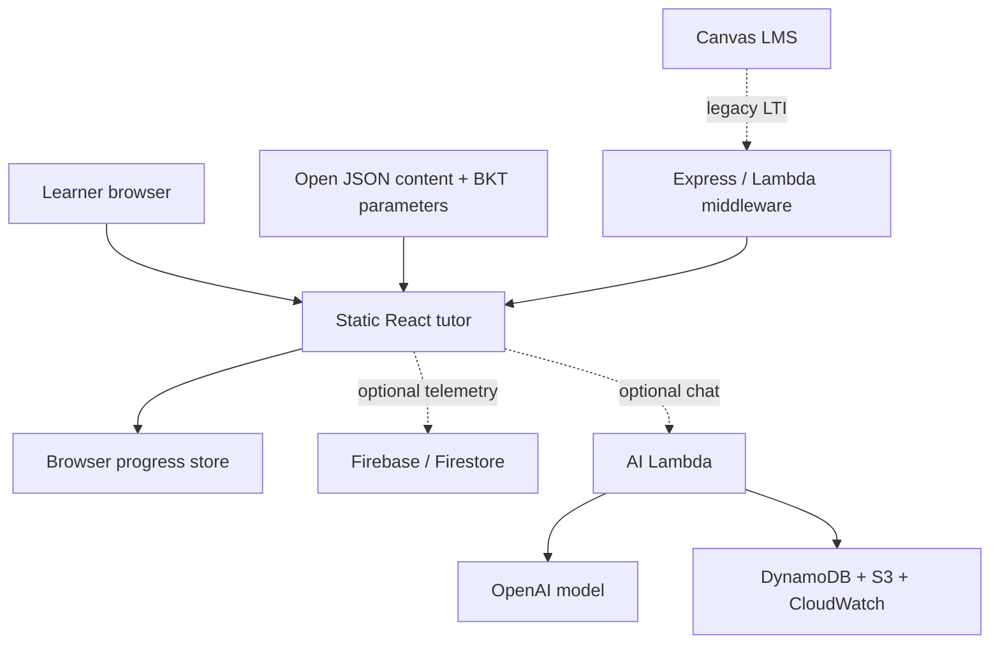
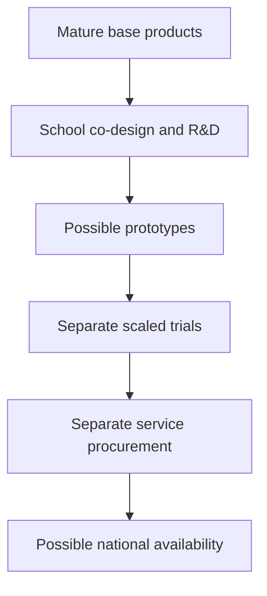

# Comparative research and evidence

**Purpose:** conserve the useful comparative knowledge needed to design, examine and improve additive public AI-enabled tuition in OCE: what different systems make learners and educators do, what evidence supports those mechanisms, which dependencies and institutional choices matter, and what remains uncertain.

**Standing:** a reconstruction on 6 September 2026 of the supplied research snapshots, chiefly dated 3–4 September. Product availability, procurement, law, financial commitments, repository state and study publication claims below are historical source assertions at their stated cut-offs. This work did not repeat the original external searches, product sessions, repository probes or experiments. “Current” inside a retained case means current at the source's cut-off. It is not a present-day assurance, purchasing recommendation, security clearance or fresh verification. Consequential decisions require the relevant narrow primary-source check.

This document is the narrative home for comparative interpretation, study details, named dossiers and source conflicts. [The research workbook](assets/research-landscape.xlsx) owns the complete discovery inventory and its project–source associations. [Educational knowledge](02-education-and-teaching-knowledge.md) owns the education framework; [POC requirements and evaluation](04-poc-requirements-and-evaluation.md) owns the proposed local study; [State, rights and context](06-state-rights-and-context.md) owns permissible learner-state design; [Capabilities, bridges and proof](07-capabilities-bridges-and-proof.md) and [Engineering findings](08-oce-audit-and-engineering-findings.md) own OCE engineering; [Public value, standards and commons](09-public-value-standards-and-commons.md) owns institutional and standards proposals; [Evidence publication and decisions](11-evidence-publication-and-decisions.md) owns approval and evidence governance. Comparative ideas remain available without becoming POC requirements.

## Reading routes

- **Interpret an outcome claim:** begin with “Evidence units and denominators”, then the study table and the named case. Check version, population, comparator, human contribution, dose, outcome timing and independence together.
- **Find reusable mechanisms:** use “Instructional and research cases”, especially ASSISTments, OATutor, Tutor CoPilot, Khanmigo and the curriculum programmes. Inspect the open-code qualifications in the workbook before treating a repository as a deployable service.
- **Understand England's Pioneers:** use the programme dossier, eight award dossiers, objection matrix and proof obligations. They distinguish common commissioning from existing products, post-award setup and demonstrated results.
- **Discover suppliers and alternatives:** use the product catalogue and market control-point cases. A tutor, solver, educator assistant, national programme and public standard serve different purposes.
- **Understand global infrastructure choices:** use the sovereign-capability cases, then doc09 for their public-service implications.
- **Resume the research:** use “Source contradictions and maintenance” and the source-family register. No source archive or private chat is needed to use the substantive material here.

## Evidence units and denominators

### What an observation can support

The unit of educational evidence is a specified intervention in a specified setting. A base model, interface, retrieval corpus, task sequence, human tutor, teacher training package, school timetable and assessment each contribute differently. An effect for their bundle cannot be assigned to one component unless the design isolates it. An accurate response is evidence of response quality; product conformance requires the deployed system; implementation evidence concerns actual use and institutional conditions; learner outcomes concern change attributable to the intervention. Success at one level does not establish the others.

A self-contained evidence claim therefore carries: task and curriculum; age and prior attainment; recruitment and analytic denominators; allocation unit and comparator; duration and use; teacher/human intervention; version and change history; assessment independence, delay and unaided transfer; effect and uncertainty; attrition and missingness; clustering and multiplicity; subgroup evidence; author/funder/product relationships; workload and cost; and the exact claim the study can support. “No public evidence located” remains bounded by the source search, language and date. It does not mean no benefit, no internal study or a failed product.

Educational rigour and institutional legitimacy are separate judgements. Specific instruction and strong causal evaluation can exist inside commercial governance. Public or nonprofit purpose can coexist with weak outcome evidence and concentrated supplier dependencies. Do not infer private motives from organisational form or grant scale. Examine actual incentives, publication of weak results, ownership, operating rights, accountability and the ability to change components. Public tuition is judged against its mandate and learner needs; a hypothetical commercial alternative is not its default justification test.

### The historical discovery set and repaired workbook

The first pass deliberately stopped at 100 diverse, named, sourceable initiatives. It was a purposive, broad and shallow scan, not a systematic review or world census. It used three discovery lanes—AI in education, education standards/infrastructure, and their explicit open intersection—then merged families and investigated licence, evidence, reversal and geographic gaps. The targeted 4 September successor retained P001–P100 and added P101 (England Pioneers/benchmark/testbeds) and P102 (i.AI petri-edu), using pre-cut-off evidence found later. The successor explicitly had not integrated the deeper OATutor and product reports because those artifacts were unavailable in that earlier context. They are integrated in this casebook; the inventory's original observation dates remain intact.

| Measure | Original 3 September inventory | Reconstructed successor inventory | Interpretation |
|---|---:|---:|---|
| Named records | 100 | 102 | Discovery records, including standards, programmes and watchlist cases; not 102 active tutoring products |
| AI × education | 29 | 30 | One assigned discovery lens per row |
| AI × education × open | 35 | 36 | Broad intersection, not a count of production-ready openly licensed tutor stacks |
| Education × open standards | 36 | 36 | This set's standards/infrastructure records; separate from the 78-family standards count used elsewhere |
| Project–source associations | 184 | 191 | One URL may support multiple records; associations are not independent studies |
| Distinct source URLs | 179 | 186 | Exact URL distinctness, not evidence independence |
| Single-source records | 16 | 16 | Breadth-first search limitation |
| Exactly coded “Causal learner outcomes” | 5 | 5 | Original coding; not five validated current generative tutors |
| Broad code class Yes or Partial / unresolved | 46 | 47 | Component/licence qualifications remain decisive |

The coded regions in the 102-row successor are Global 26, Europe 21, Asia 11, Africa 5, Latin America 3, MENA 3, North America 29 and Oceania 4. These are mutually exclusive discovery codes, not country allocation or representative market shares. Documentation-rich English-accessible systems are overrepresented; indigenous/minority languages, informal education, disability-specific use, low-connectivity implementations and less visible local procurement remain underrepresented.

The workbook preserves every original 27-field record: ID, initiative, lens, layer, steward, region, geography, status/timeframe, users/purpose, outputs/AI role, standards/interfaces, open specification, open code, open assets, access, licence/openness, evidence band, evidence/adoption account, governance, public-good/equity account, privacy/safety, main caveat, discovery signal, confidence, two source URLs and checked date. All 102 detailed Markdown records and 191 source associations survive. Dates are usable spreadsheet dates.

Fifty of the first 100 records differ between the original spreadsheet and Markdown in exactly one field: **Open code**. The spreadsheet broad classes are retained in Landscape M; the richer wording is in AB. This preserves qualifications such as demo-only, promised release, partial stack, public repository with unresolved legal openness, and restricted components. AC holds first-seen date, AD the reconciliation note, AE the linked association count. Sources K retains original source-type labels while D records corrected classification. Sources J is a formula helper identifying first occurrences of URLs.

The AI + Open and Standards map sheets contain formula-linked views of the relevant Landscape rows. Their membership is the dated snapshot; changing a category or appending a record requires regenerating/refiltering membership as well as extending table and formula ranges. They are not silently claimed to be dynamic filters. Coverage and Overview use complete fixed ranges through row 107; the old workbook had relative range drift. Independent recounts show its old displayed totals happened to agree, so this repair does not imply a discovered historical total error. The new formula totals were compared with separate record counts, and the sheets were rendered and inspected. Four filterable tables and eight sheets support continued use.

### Interpret openness at the component boundary

An open specification, open code, open content/data/model assets, public access and public governance are separate properties. Free access is not a reusable licence. A public repository without a licence is not demonstrated open source. An Apache demo does not make its production service open; a research-only dataset licence does not permit production reuse. Content-level provenance and licence compatibility matter even when the repository has a permissive root licence. Sensitive learner data should not be made openly reusable merely to improve an openness score.

The common pattern is an education stack: authoritative curriculum and content; tasks and assessment; activity/state; identity/rosters and service integration; AI assistance; evidence and assurance; institutions and stewardship. Standards often enable data exchange around AI without specifying educational quality, model behaviour, consent, safeguarding or the semantic meaning of a learner-state assertion. Exact versions, profiles, conformance and migration tests matter. A JSON endpoint or “OpenAI compatible” label is insufficient proof of substitutability.

The cases below preserve the positive value of low-bandwidth Rori, offline Kolibri, multilingual BHASHINI, AI/OER localisation in STEPS, local-language EduAI Hub, Oak and Grep public curriculum infrastructure. Their inclusion aims remain distinct from measured reach, equitable participation or outcomes. South Korea's policy reversal, discontinued products, stale releases and missing maintenance evidence are useful discovery records rather than entries to remove from a success-only list.

## Comparative learning evidence

The following detailed study comparisons retain positive, null and adverse findings. They should be read before the shorter catalogue labels later in the document. Non-significance is not equivalence; immediate near transfer is not delayed generalisation; a provider-led technical report is not independent replication.

### Educational evidence: effects depend on the exact system and implementation

“AI tutoring” covers unlike systems. A defensible causal ladder is:

> **interaction quality → engagement and use → assisted performance → immediate unaided attainment → delayed retention → transfer → independence after withdrawal**

Evidence at one step does not establish the next. A pupil may enjoy a system, complete more problems or score better with help while learning no more—or less—once the help is removed.

| Evidence record | Result | What it establishes | Transfer limit for Pioneers |
|---|---|---|---|
| [Kulik & Fletcher 2016 meta-analysis](https://doi.org/10.3102/0034654315581420), 50 controlled legacy intelligent-tutoring evaluations | Median effect about **+0.66 SD** against conventional instruction. | Purpose-built ITS can sometimes improve measured learning. | Heterogeneous, pre-GenAI systems and mostly proximal/short outcomes; cannot validate any LLM tutor. |
| [Ma et al. 2014 meta-analysis](https://doi.org/10.1037/a0037123), 107 effects/14,321 learners | Overall **g≈.41**; stronger against non-ITS computer instruction and teacher-led large groups, but no clear advantage over small-group or individual human instruction; high heterogeneity. | Comparator and delivery model drive the estimate; generic superiority to human tutoring is not supported. | Mixed ages/systems and legacy technology. |
| [Steenbergen-Hu & Cooper 2013 K–12 maths meta-analysis](https://doi.org/10.1037/a0032447) | Effects against regular classroom instruction were small; adjusted estimate about **g=.01**, non-significant. Proximal measures were larger than standardised ones. | Broad positive ITS headlines can collapse in the closest K–12 subject/comparator slice. | Legacy maths; still a strong warning against tutor-authored outcome measures. |
| [ASSISTments school RCT](https://doi.org/10.1177/2332858416673968), 43 schools/~2,850 US seventh-graders | Year-long homework system plus immediate feedback, teacher reports, training/coaching: **+0.18 SD** on end-of-year standardised maths. | A mature human–technology implementation bundle can improve attainment. | Does not isolate software; no delayed withdrawal outcome. The staffing/training package is part of the treatment. |
| [Cognitive Tutor Algebra I scale trial](https://www.rand.org/pubs/research_briefs/RB9746.html), 147 schools/~18,700 pupils | No detected high-school impact in year one; about **+0.20 SD** in year two. | Maturity and implementation time can determine impact. | Mature US legacy curriculum, not GenAI or England. |
| [Bastani et al. 2025 PNAS](https://doi.org/10.1073/pnas.2422633122), ~1,000 Turkish Grades 9–11 pupils/~50 classrooms in one school | Relative changes in normalised grades: unguarded GPT raised supported practice **48%** but reduced the immediately following closed-book exam **17%**; progressive-hint GPT raised practice **127%** but its exam contrast with control was not statistically distinguishable. | Classroom-clustered causal evidence that assisted performance can conceal short-term removal harm; guardrails avoided the detected decrement but did not establish benefit or equivalence. | Four maths sessions, 2023 model; exam problems were conceptually very similar. This is neither delayed retention/far transfer nor a Pioneer result. |
| [World Bank Nigeria experiment](https://documents1.worldbank.org/curated/en/099548105192529324/txt/IDU-c09f40d8-9ff8-42dc-b315-591157499be7.txt), 1,328 randomised across nine schools | Six-week after-school Copilot bundle, used in pairs with trained active teachers and AI-literacy instruction: **+.26 to +.31 SD** overall. There were 759 endline completers and roughly 636–654 observations in outcome models. The +.139 SD digital-skills estimate was significant only at 10% and not robust to attrition adjustment. | A heavily mediated GenAI programme produced positive immediate overall/English/AI-knowledge estimates. | Sharp differential attrition, motivated applicants, extra time/devices and no delayed outcome; larger gains for higher prior attainment/SES temper equity transfer. |
| [Eedi/LearnLM exploratory RCT](https://arxiv.org/html/2512.23633v1), 165 UK Years 9–10 pupils/five schools | Every draft was human-reviewed and approved, edited or replaced. Model-estimated same-session first-next-unit success was 66.2% vs 60.7%: +5.5 points, 95% CrI −1.4 to +12.4. Contributor audit identified five factual errors; every draft had contemporaneous screening. | Feasibility of a fully pre-moderated drafting system in short maths tutoring. | Google/Eedi preprint, repeated session-level assignments, no reported pupil/school clustering in primary regressions, no independent safety audit or delayed outcome. |
| [Kreijkes et al. 2026](https://doi.org/10.1016/j.compedu.2025.105514), 405 recruited/344 analysed English pupils aged 14–15 | Notes beat LLM support on unaided three-day history retention/comprehension. In the direct comparison, 42.0% preferred LLM and 26.9% notes, while LLM users reported less effort; heavy copying was measured only in the combined LLM+notes condition. | Perceived ease or preference may diverge from delayed learning and effort. | Reading support, not a tutor; no reading-only control, limited FSM representation and short follow-up. |
| [Robinson et al. 2026, “Access is Not Enough”](https://doi.org/10.26300/pz7p-p388), 355 US Grades 1–5 pupils | The randomised contrast added human engagement support to AI access. At very low achieved dose, it slightly raised use but produced no statistically detectable reading effect; estimates were imprecise. Lower use among special-education pupils was descriptive within access-only users, not a randomised subgroup effect. | Access/accounts do not imply use, dose or impact; human engagement is part of scale. | Younger US pupils, unnamed product, low exposure/limited power; does not estimate AI access versus no AI or prove inefficacy at adequate dose. |
| [Tutor CoPilot preprint](https://arxiv.org/abs/2410.03017), 900 tutors/1,800 K–12 pupils | Real-time suggestions increased lesson-topic mastery four points, nine for lower-rated tutors; more guiding questions. | Teacher/tutor-facing augmentation is a distinct and potentially useful category. | Proximal platform outcome, short period, occasional grade-inappropriate suggestions; not autonomous pupil tutoring. |
| [NFER/EEF teacher-planning RCT](https://www.nfer.ac.uk/publications/chatgpt-in-lesson-preparation-a-teacher-choices-trial/), 68 English schools/259 science teachers | ChatGPT plus guidance reduced self-reported weekly planning time by 25.3 minutes (31%); blinded review found no detected resource-quality difference. | AI can reduce one bounded workload component. | Says nothing about pupil-facing supervision, alerts, incidents, troubleshooting, wellbeing or attainment. |
| [2025 K–12 ITS systematic review](https://doi.org/10.1038/s41539-025-00320-7), 28 studies | Generally positive against traditional teaching, inconsistent against other digital systems; small, short and too heterogeneous for a sound pooled conclusion. | The current K–12 literature remains promising but fragmented and method-sensitive. | Includes broader ITS, not only LLMs; publication and reporting bias remain plausible. |

Human tutoring is an important opportunity-cost comparator. The [EEF one-to-one tuition evidence summary](https://educationendowmentfoundation.org.uk/education-evidence/teaching-learning-toolkit/one-to-one-tuition) estimates about five months' additional progress on average with moderate evidence, especially where short, regular sessions connect to classroom teaching. This is evidence about human tuition, not a benefit an AI system inherits. It defines a credible alternative against which cost, reach, relationship and outcomes may need comparison.

### Cross-study conclusions

1. **Design is causal, not cosmetic.** Progressive hints, required attempts, diagnostic questioning and limits on answer completion can change learning outcomes.
2. **The human loop must be specified.** Content authoring, per-output pre-approval, live classroom supervision, retrospective dashboard review and safeguarding escalation are different treatments and have different cost/safety implications.
3. **Comparator choice matters.** Beating unassisted business-as-usual, a weak digital worksheet or no extra time is not equivalent to beating good small-group/human tuition.
4. **Outcome distance matters.** Tutor-authored or same-day questions can overstate benefit relative to standardised, delayed or far-transfer measures.
5. **Implementation is part of the evaluand.** Training, devices, timetable, teacher reports, support, dosage and maturity cannot be stripped away when claiming impact or scale.
6. **Equity and inclusion remain under-powered.** Some systems help lower prior attainers more; others favour higher prior-attainment/SES pupils; special-education use can be lower. No robust public record establishes durable benefit and prespecified non-inferiority for disadvantaged, SEND or disabled pupils, or relevant inclusion/effectiveness for pupils with English as an additional language (EAL), across a current autonomous school GenAI tutor. EAL is not itself SEND or a protected characteristic, and schools must distinguish language acquisition from SEN.
7. **Version validity is short.** A model, prompt, retrieval corpus, moderation rule, UI or hosting change can invalidate efficacy and assurance evidence.

### Additional evidence and corrections across the research families

| Case | Exact signal carried forward | Interpretation and source conflict |
|---|---|---|
| ASSISTments | Maine cluster RCT: 43 schools, 2,850 grade-7 pupils; approximately 0.18–0.22 SD. North Carolina replication: 63 schools, baseline 9,073; 5,991 in the grade-8 analysis; g≈0.10, p=.01 one year later. | The product landscape attached “63 schools” to a +0.22 grade-7 result. Preserve the two study lineages separately. Core-platform evidence cannot validate AIDA. [Original RCT](https://doi.org/10.1177/2332858416673968), [WestEd replication report](https://wested2024.s3.us-west-1.amazonaws.com/wp-content/uploads/2024/10/30160708/V07_ASSISTments-tech-report_FINAL-ADA-1.pdf). |
| Cognitive Tutor / MATHia lineage | Source reports agree on 147 schools and a null first-year result followed by roughly 0.20–0.21 SD in high-school algebra in year two, with higher costs. | Pupil denominators disagree: over 25,000 in the big-AI review, over 18,000 in the rigour review, approximately 18,700 in the Pioneers synthesis. Those numbers may refer to different enrolled/analysed scopes, but that has not been established. Do not average or silently choose them. Evidence concerns legacy Cognitive Tutor, not every current MATHia or GenAI feature. [RAND](https://www.rand.org/pubs/research_briefs/RB9746.html). |
| Eedi / LearnLM | 165 Year 9–10 pupils in five UK schools over seven weeks; all 3,617 model drafts checked by 17 expert tutors. Next-unit same-day accuracy 66.2% versus 60.7%; +5.5 percentage points, credible interval −1.4 to 12.4; reported probability of a positive effect 93.6%. | Promising exploratory result with interval crossing zero. It is neither established superiority nor equivalence, and does not validate autonomous deployment. Session allocation/repeated learners and incomplete clustering treatment constrain precision. Detailed dossier below. [Paper](https://arxiv.org/html/2512.23633v1). |
| OATutor screened GPT hints | 394 recruited, 274 completed; control 90, authored hints 86, GPT hints 98. GPT versus control significant; GPT versus human p=.416. | “Comparable” in the product table must mean no detected difference in this bounded study, not proven equivalence/non-inferiority. Hints were screened, outcomes were immediate, the same three pre/post questions recurred, and the current live chatbot was not tested. Detailed version, exclusions and corpus findings below. |
| OpenAI Study Mode | Provider account of 300+ higher-education students: microeconomics roughly 15% higher short-session score, neuroscience no distinguishable primary effect. | Full paper/protocol/data were not located in the supplied review. The roughly 20,000-student Estonia validation was prospective. Neither establishes K–12 autonomous tutoring or a neutral public evaluation standard. [Provider research account](https://openai.com/index/understanding-ai-and-learning-outcomes/). |
| Guided Learning, Sierra Leone | Preregistered classroom RCT: 1,763 grade 7–8 pupils, 48 classrooms, 12 schools, eight weeks; ITT +0.258 SD, 95% CI .027–.488. | Google/Fab report; one district, teacher-led objectives, paired devices, trained teachers and class consolidation; models changed from 2.5 Pro to 3 Pro. Blinded MeasurEd assessment strengthens measurement. Larger estimated gains at higher baseline do not by themselves prove widened gaps. [Technical report](https://storage.googleapis.com/deepmind-media/LearnLM/learnLM_sierraleone_may26.pdf). |
| Rori | Ghana experiment, about 1,000 pupils in 11 schools for eight months, approximately .36–.37 SD. | Low-bandwidth WhatsApp and curriculum alignment are important design contributions. Project-associated authorship, context and proprietary dependencies remain; no global-effect inference. |
| ALEKS | 2026 classroom RCT reported approximately .29–.31 SD in six months. | Classic adaptive engine, not evidence of current generative conversation; tested configuration and fidelity matter. |
| Amira | Large matched early-reading studies were positive; an independent RCT was announced in 2026. | Matching does not remove all selection bias; announced independent evaluation is not a completed result. |

**Performance, preference and learning:** Bastani's unguarded maths assistant improved assisted practice while worsening the immediate unaided test; guardrails removed detected harm without establishing benefit or equivalence. Kreijkes' English history study found that students could prefer the easier LLM experience while notes produced better three-day unaided retention. Low-dose access experiments show that availability, participation support, use and learning must be separated. These are mechanism warnings for the local evaluation, not proof that all AI tuition harms learning.

**Meta-analyses require their comparator:** Ma et al. combined 107 effects and 14,321 participants, with an effect around .41 varying by comparator; ITS was not superior to one-to-one or small-group human tuition. Kulik and Fletcher's 50 studies had a median around .66. Steenbergen-Hu and Cooper's K–12 mathematics analysis gave an adjusted estimate around .01, non-significant, and distinguished proximal from standardised measures. The 2025 K–12 review's 28 heterogeneous studies did not justify a single pooled GenAI estimate. These syntheses concern different dates, systems and estimands, not a range from which to pick a promotional number.

## Instructional and research cases

These cases are grouped by what can be learned from their mechanism and evidence, rather than by ownership or market size. The source authors’ favourable rankings are retained as reasoned comparative judgements, not adopted supplier decisions. The all-subject/lifelong public-tuition direction and existing Oak assets do not depend on selecting any named product below.

### ASSISTments is the clearest first choice

ASSISTments earns the strongest verdict because its research culture, pedagogical mechanism and organisational incentives reinforce one another. The system gives pupils immediate feedback and scaffolded support, then turns errors into information teachers use in subsequent instruction. A school-randomised Maine study with 2,850 grade-7 pupils reported a positive mathematics effect; different publications report the standardised estimate at roughly \(0.18\)–\(0.22\). A North Carolina replication/follow-up across 63 schools and 5,991 pupils found a statistically significant effect of \(g=0.10\) on a state test one year after grade-7 use. The later effect is smaller, but replication and persistence are more valuable than a single spectacular number. [AERA Open study](https://doi.org/10.1177/2332858416673968); [WestEd technical report](https://wested2024.s3.us-west-1.amazonaws.com/wp-content/uploads/2024/10/30160708/V07_ASSISTments-tech-report_FINAL-ADA-1.pdf)

The incentive evidence is also unusually strong: ASSISTments is a free 501(c)(3) connected to WPI and operates E-TRIALS as a research instrument. An IES account records that its founders rejected acquisition offers to keep it free and preserve research access. That is observable conduct consistent with impact priority, although it does not make the platform openly governed. [IES account](https://ies.ed.gov/learn/blog/assistments-research-practice-scale-education); [ASSISTments research programme](https://www.assistments.org/research)

The boundary is important: AIDA's first public brief covers a beta with 246 teachers and 888 generated insights. It reports teacher behaviour, not a randomised pupil-learning effect. **The evidence belongs to core ASSISTments, not automatically to AIDA.** [AIDA learning brief](https://www.assistments.org/learning-briefs/aida-learning-brief)

### Oak is strongest where the claim is curriculum and public infrastructure

Oak's work is not just bulk ingestion. Its curriculum was co-designed with schools, teachers, subject experts and education organisations; it provides sequenced programmes, lessons, quizzes and resources across Key Stages 1–4. OCE then exposes this bounded corpus through APIs, an ontology, search, graph views and MCP tooling. Aila keeps teachers in the loop at every stage and grounds suggestions in Oak content. [Oak curriculum account](https://www.thenational.academy/blog/a-new-chapter-oak-s-fully-updated-classroom-curriculum-is-now-live-free-for-every-school-and); [Aila transparency record](https://www.gov.uk/algorithmic-transparency-records/oak-national-academy-aila-oaks-ai-lesson-assistant); [OCE repository](https://github.com/oaknational/oak-open-curriculum-ecosystem)

That justifies **curriculum integrity and public-goods** claims. It does not justify a pupil-impact claim. Aila's internal auto-evaluation reviewed 4,985 generated lessons, but agreement with expert teachers remained modest even after improvement (quadratic-weighted kappa rose from 0.17 to 0.32). An independent NFER/EEF trial was studying planning time and expert-panel resource quality, not pupil attainment, and its report was still pending at the cut-off. [Aila quality study](https://www.thenational.academy/blog/how-do-we-ensure-our-ai-generated-resources-are-high-quality); [NFER/EEF trial](https://educationendowmentfoundation.org.uk/projects-and-evaluation/projects/aila-teacher-choices-trial)

Public funding, OGL curriculum and MIT code make profit extraction a weak direct incentive. The control risks are different: state influence over a de facto curriculum reference, dependence on frontier-model providers, and open publication without shared maintainership—the OCE repository is forkable but currently does not accept external pull requests. These are manageable governance issues, not evidence of improper motive.

The separate Aila distractor-evaluator experiment compared agreement with teacher ratings, not learner outcomes: 311 items and 20 teachers, 61 training/185 development/65 held out; original MSE 4.11, manually revised 2.72, DSPy 1.40 on GPT-4o-2024-08-06. Exact agreement remained 27.7% for original and optimised prompts; within-one agreement rose from 52.3% to 80.0%. Transfer to GPT-4o-2024-11-20 gave MSE 1.62; reoptimisation 2.06 was worse than simple transfer. One rating per item and the held-out sample limit inference. The exact archived experiment, models, exclusions and source URLs are in [Engineering findings, Appendix F](08-oce-audit-and-engineering-findings.md).

### Tutor CoPilot has a real effect—and a revealing limit

Tutor CoPilot was built from expert tutoring strategies rather than a generic chatbot. In the revised working paper's analysed sample (783 tutors, 1,013 pupils and 4,136 sessions), access increased topic mastery from about 62% to 66%, with a larger estimate for lower-rated tutors. Tutors used more guiding questions and were less likely to give away answers. But there was no statistically significant end-of-year NWEA mathematics effect, the intervention lasted about two months, and the creators evaluated their own system. [Revised working paper](https://edworkingpapers.com/sites/default/files/ai24_1054_v2.pdf)

The production dependency also matters. Only demonstration code is public; delivery relied on OpenAI and FEV Tutor. FEV ceased operations in 2025 because of financial difficulty. That does not invalidate the trial, but it shows why social mission and low unit cost are insufficient without operational continuity, portable artefacts and multiple delivery routes.

### Khan Academy / Khanmigo case study

#### Product

[Khanmigo](https://www.khanmigo.ai/learners) is integrated directly into Khan Academy exercises, videos and articles. It supports mathematics, science, coding, history, humanities, writing and debate, and uses speech as well as text. Its central design promise is to make the learner reason rather than simply disclose an answer. Consumer access is currently limited geographically and by billing requirements; under-18 access is mediated by a parent or a participating school/district. Khanmigo for Teachers and district offerings are separate from consumer learner access.

#### First-party product experiments

Between October 2025 and April 2026, Khan Academy reports roughly 20 substantive A/B tests covering more than 15 million tutoring threads. Adding a structured summary of recent learner work improved next-item correctness by 3.4%; offering prerequisite review improved it by 2.7%; Khan Academy reports a combined 6.1% relative improvement. Supplying a better-formatted recent conversation history improved its automated cognitive-engagement measure by 5.09%. Some tested interventions had no measurable effect. These are useful product-development results, not evidence of long-term attainment. [Khan Academy’s May 2026 methods and results summary](https://blog.khanacademy.org/how-khan-academy-is-building-a-better-ai-tutor-our-most-recent-learnings/).

#### Independent school experiment

An August 2026 working paper reports a two-year cluster-randomized experiment in 18 Tennessee middle schools during existing daily remedial mathematics sessions. Assignment to Khan Academy with Khanmigo raised mathematics achievement by 1.3 national percentile ranks per term, approximately 0.06–0.08 standard deviations over a school year; the implied effect for a full year of active participation was 0.14 SD. However, the gains resembled earlier Khan Academy practice without AI assistance, so the study does **not** identify Khanmigo’s incremental contribution. Use was also shallow: although 96% tried it, the median pupil messaged it on only one-third of practice days and in 17% of exercise sessions where an error occurred. Most messages were bare answers or clicks on suggested prompts. [Oreopoulos and Low, “One Click Away,” EdWorkingPaper 26-1551](https://edworkingpapers.com/ai26-1551).

#### Bottom line on Khanmigo

Khanmigo has a comparatively well-defined set of tuition functions: it combines a curriculum/content graph, practice context, learner history, guided dialogue, teacher/district workflows and unusually transparent product experimentation. The evidence supports a cautious conclusion: the broader Khan Academy-plus-Khanmigo intervention can produce small gains, but learner engagement is a binding constraint and the marginal effect of the generative tutor remains unresolved.

#### Khan: organisational and licence boundary

Khan Academy is a US 501(c)(3) nonprofit. Its service layer includes content, practice, rostering, dashboards, implementation and professional learning. The private-competitor review reported first-party figures for 2024–25 of nearly 1.5 million licensed US district learners across 795 districts, 2 million people with Khanmigo access worldwide, 770,000 pupils with access in US district partnerships and 4.1 million learners in international district/KhanX programmes. Those are unlike access/reach denominators, not comparable active use or outcomes. The organisation's candid reporting of weaker-than-hoped early Khanmigo effects is a positive research practice, not a substitute for isolating the AI contribution.

Model diversity reduces some single-model exposure while leaving private dependencies: original OpenAI models, Azure support and Microsoft funding for teacher access, plus Google's 2026 Writing Coach/planned Reading Coach and interactive/targeted-practice collaboration. The tutoring-accuracy dataset is downloadable under a bespoke licence permitting narrow internal non-commercial evaluation and restricting redistribution, training and production. It is not open public infrastructure by downloadability alone. [Annual report](https://annualreport.khanacademy.org/), [Google partnership](https://blog.google/products-and-platforms/products/education/khan-academy-partnership/), [dataset licence](https://github.com/Khan/tutoring-accuracy-dataset/blob/main/LICENSE).

### Curriculum rigour without demonstrated learner effects

These projects should be considered if the task is to define or teach AI literacy. They should not be presented as evidence that an AI tutor improves attainment.

| Project | Why the curriculum work is credible | Evidence limit | Incentive finding |
|---|---|---|---|
| **AI4K12 Five Big Ideas** | Practising teachers and AI specialists; concepts and grade-band progressions; links to CSTA, Common Core and NGSS; research publication | Progressions remain labelled draft; no programme-level learner-effect study is expected or available | NSF/AAAI/CSTA public-disciplinary origin; CC BY-NC-SA, with later funder/tool dependencies to disclose |
| **Experience AI** | Explicit learning graph, six-lesson sequence, formative/summative assessment, teacher development, conceptual-language scaffolding and anti-anthropomorphism design | Evaluation suffered severe post-test attrition and mostly supports feasibility/perception, not causal knowledge gain | Raspberry Pi Foundation charitable lead, but deep Google DeepMind/Google.org co-development and funding dependence |
| **Day of AI** | Newly complete PreK–12 grade-by-grade progression, assessments, professional development, ethics, privacy and agency | 2025 evaluation was mainly retrospective teacher self-report; the August 2026 progression was too new to have outcome evidence | Independent nonprofit; free CC BY-NC-SA curriculum; corporate partner influence and funding amounts remain incompletely visible |

AI4K12 is the strongest **framework** candidate, Experience AI the strongest documented **instructional-design** candidate, and Day of AI the most promising newly matured **full progression**. Their lack of RCTs is not proof of poor curriculum; it is a boundary on the claims that can be made. [AI4K12 research](https://doi.org/10.1609/aimag.v40i4.5289); [Experience AI design paper](https://assets.ctfassets.net/oshmmv7kdjgm/3yDmdY8jZAvi23eengffao/86aa7a188d9e295e9967e31e83b416ae/Experience_AI_lesson_design_paper__ISSEP_authors_copy.pdf); [Day of AI 2026 curriculum](https://dayofai.org/news/day-of-ai-launches-nations-first-free-grade-by-grade-prek-12-ai-literacy-curriculum)

### Commercially governed, but genuinely research-serious

Commercial ownership is not evidence of pedagogical shallowness. These cases have stronger outcome evidence than many public programmes; they simply do not resolve the user's second question in favour of education **rather than** profit or control.

| Project | Strongest result | Why it is educationally serious | Why the motive/control verdict stays mixed |
|---|---|---|---|
| **Google Gemini Guided Learning, Sierra Leone** | Preregistered cluster RCT: 1,763 pupils, 48 classrooms/12 schools, eight weeks; ITT \(+0.258\) SD | Equal teacher training across arms, teacher-designed curriculum-aligned lessons, paired pupil work, class consolidation and blinded IRT-scaled assessment by Oxford MeasurEd | Google/Fab-authored technical report, one district, model changed mid-trial, stronger benefits for initially higher-performing pupils; Gemini/Workspace distribution and bundling create platform incentives |
| **Google LearnLM with Eedi, UK** | Exploratory RCT, 165 pupils/five schools; supervised LearnLM was at least comparable with human tutors; estimated +5.5 percentage points on transfer, with a 95% credible interval crossing zero | Pedagogical fine-tuning, expert tutors reviewing every message, Socratic dialogue and direct learning measures | Small, short, developer/partner-run and human-supervised; model and delivery platform are proprietary |
| **Mindspark** | Lottery RCT with 619 Delhi pupils over 4.5 months: \(+0.37\) SD mathematics, \(+0.23\) SD Hindi | Diagnoses actual learning level and adapts instruction, explanations and feedback; independently evaluated | Proprietary commercial system; trial combined 45 minutes of software with 45 minutes of small-group instruction and predates current product versions |
| **Letrus** | 178 public schools, about 12,000 treated pupils; AI-only and AI-plus-human variants each improved ENEM scores by about \(0.09\) SD | Immediate, curriculum-specific writing feedback, more practice and more teacher discussion; state required evaluation before scale | Proprietary vendor selling to state systems and using evidence in expansion; one exam/context and long-run outcomes still pending |
| **Rori** | About 1,000 pupils in 11 Ghanaian schools; reported \(+0.37\) SD after eight months | Low-bandwidth WhatsApp delivery, Global Proficiency Framework alignment and metacognitive feedback | Proprietary, single-context, some implementer-affiliated authors, and dependent on WhatsApp/Meta and model providers |
| **Carnegie Cognitive Tutor lineage** | Large study across 147 schools and 18,000+ pupils: first-year null; second-year high-school effect about \(+0.21\) SD | Decades of cognitive-science and intelligent-tutoring research embedded in a blended curriculum | Evidence concerns an older Cognitive Tutor implementation, not necessarily current MATHia/GenAI products; current owner is a private-equity-backed growth platform |

Google's Sierra Leone result is the strongest new GenAI result in this group. It should be described accurately: the treatment was a **teacher-led socio-technical intervention**, not Gemini acting alone. Teachers set objectives and prompts, pupils worked in pairs, and teachers consolidated the lesson. The report itself stresses that teacher design and relational practice were essential. It also found larger benefits for pupils with stronger baseline mathematics, raising an equity concern. [Sierra Leone technical report](https://storage.googleapis.com/deepmind-media/LearnLM/learnLM_sierraleone_may26.pdf)

Mindspark and Letrus are particularly important counterexamples to a simplistic nonprofit-versus-company story. Independent causal evaluation preceded or informed scaling. [Mindspark J-PAL record](https://www.povertyactionlab.org/evaluation/disrupting-education-evidence-technology-aided-instruction-india); [Letrus J-PAL case](https://www.povertyactionlab.org/case-study/artificial-intelligence-strengthen-high-school-students-writing-skills)

Supporting evidence for the other entries is available in the [Google/Eedi LearnLM trial](https://storage.googleapis.com/deepmind-media/LearnLM/learnLM_nov25.pdf), the [Rori Ghana study](https://arxiv.org/abs/2402.09809) and the [Cognitive Tutor at-scale study](https://journals.sagepub.com/doi/10.3102/0162373713507480).

### Learning Commons: valuable infrastructure, not demonstrated pedagogy

Learning Commons does more than indiscriminate ingestion. It records provenance and licences, uses expert-built rubrics, and publishes MIT code plus substantial CC BY/CC0 data. Its graph connects state standards, curricula, learning components and progressions; its evaluators attempt to reproduce expert judgements. Those are credible infrastructure contributions. [Knowledge Graph licence](https://github.com/learning-commons-org/knowledge-graph/blob/main/LICENSE.md); [Evaluators](https://learningcommons.org/evaluators/)

But its own description is explicit: it transforms fragmented standards, curriculum frameworks and research into centralised, machine-readable datasets. That is a data and evaluation layer. No independent classroom-effect study was located, and no public validation yet establishes that its automated evaluators reliably measure all the educational constructs their labels imply. [Knowledge Graph description](https://learningcommons.org/knowledge-graph/)

Its public-good intention is credible, but governance is not plural or public. Learning Commons Inc. is a 501(c)(3) private foundation; CZI LLC provides strategic, funding and operational support, and the initiative is identified with Mark Zuckerberg and Priscilla Chan. Open artefacts reduce control risk, but they do not transfer strategic decision rights to educators or the public. [Learning Commons FAQ](https://learningcommons.org/faq/)

**Verdict:** retain it as promising open enabling infrastructure; do not cite it as a proven pedagogical intervention or as publicly governed commons infrastructure.

### OATutor: inspectable mechanisms and research limits

OATutor is valuable because authored domain content, help sequences, BKT and source code make the instructional mechanism inspectable. It is a research substrate with bounded component evidence. That judgement coexists with calibration, build, licensing, accessibility, privacy and optional-service problems. Neither the favourable “open route” label nor the existence of code justifies school deployment, a mandatory POC fork or claims about the current chatbot.

The 4 September source records the user's explicit boundary: OATutor work is research-only; the project is not adopting or fixing it. This reconstruction preserves its useful mechanisms, defects and research questions without changing that boundary. Reuse or repair recommendations inside the dated dossier remain its author's conditional proposals, not approved implementation work.

The detailed case that follows carries the original 4 September audit's observations and limits. **It is not an audit run during this reconstruction.** Its application pin is `6de5ada333f02ac18752aac48e38b9462a7882bd` (28 August 2026), content pin `ddcdeef819fef407bfb8019f093b559675ac060d` (27 August 2026). The source reported Node 24.19.0 and npm 11.9.0. Conditional security findings are not evidence that a live production service was exploited. The account preserves what was inspected and the operational questions without reproducing secrets or executing code.

### What OATutor is—and is not

OATutor is a React single-page tutoring application with course and problem content compiled from a large JSON hierarchy. In the core flow, learners work through multiple-choice or text-entry steps, receive immediate correctness feedback, optionally open hints or scaffolded substeps, and progress under a client-side BKT model. A default heuristic favours eligible problems associated with the lowest current product of knowledge-component mastery estimates. The configured mastery threshold is 0.85. The core can serve as static assets, preserve progress in browser storage, and run without a central application server.

Optional services expand that footprint substantially:

- Firebase/Firestore records problem submissions, identities and contextual telemetry.
- Canvas-oriented LTI middleware launches users, carries LMS identities and posts scores.
- AWS Lambdas support text-to-speech and the newer conversational tutor.
- The AI path sends prompts to OpenAI, uses DynamoDB for 24-hour conversational memory, retrieves lesson-authorized documents from S3, emits application logs normally routed to CloudWatch, and can persist complete chat turns to Firebase.
- Google Sheets and separate tooling repositories support content authoring and conversion into OATutor JSON.

The public site calls the current interface version 2.0, while the latest tagged release is [v1.7](https://github.com/CAHLR/OATutor/releases/tag/v1.7) and the root package remains `0.1.0`. The June 2026 [“Open Adaptive Tutor 2.0” workshop paper](https://doi.org/10.1007/978-3-032-29794-5_23) presents chatbot integration and future directions, but there is no public `v2` release tag. The evidence therefore supports commit-pinned identification; the displayed version and package metadata are not sufficient to identify a reproducible release.

The AI feature is better described as a **prompt-and-retrieval tutoring chatbot** than an autonomous agent. It does not visibly operate tools or plan multi-step external actions. Its newer document pipeline contains several thoughtful containment choices—server-authorized lesson bindings, manifest/path validation, retrieval caps and regression tests—but its API boundary and educational safeguards remain immature.

#### Architecture and data flow

This split explains both OATutor's promise and its risk profile. A genuinely low-dependency static mode is possible, which is good for inspectability, offline-ish resilience and institutional control. But README-level claims about “optional Firebase” understate that the current source imports an ignored Firebase configuration file unconditionally and enables Firebase and data logging by default in [`config.js`](https://github.com/CAHLR/OATutor/blob/6de5ada333f02ac18752aac48e38b9462a7882bd/src/config/config.js). The full feature set is therefore a multi-provider cloud system, not a sovereign stack out of the box.

#### Live-interface observation

The [public deployment](https://cahlr.github.io/OATutor/#/) opened without login and presented 21 course cards. A sampled OpenStax Elementary Algebra course exposed 71 lessons; a lesson problem combined a mastery indicator, radio-button response, staged help, explicit CC BY attribution and an “Open AI Tutor” control. The core interaction was understandable and made content provenance more visible than many commercial tutors. The same bounded walk-through found repeated generic “Select” controls, progress indicators with weak accessible naming, a typographical error in a sampled prompt and no visible privacy/model-limitation notice when the chat was opened. These observations are useful interface signals, not a usability, performance or accessibility study; no personal data or chat content was submitted.

### Repository health, engineering quality and reproducibility

#### Activity and project shape

The project is active. The reviewed branch contained 1,003 commits since December 2019; 250 landed in the preceding year and 113 in the preceding 90 days. GitHub showed 249 stars, 153 forks, six open issues and 21 open pull requests on the cutoff date. Four release tags were visible: `0.1`/beta (2020), v1.5 (2023), v1.6 (2024) and v1.7 (2026). The [v1.6 release](https://github.com/CAHLR/OATutor/releases/tag/v1.6) fixed a longstanding multi-skill BKT selection defect; [v1.7](https://github.com/CAHLR/OATutor/releases/tag/v1.7) added higher-education content, Swedish support, AWS/LTI work and dynamic AI hints.

Activity is concentrated, however. Contributor and pull-request history is dominated by the lab and close collaborators. There is no Discussions forum, and the median age of open PRs was about 290 days; nine exceeded one year. External users have opened issues, but public contribution guidance and response expectations are sparse. That pattern is consistent with an actively stewarded research codebase, not yet a mature multi-stakeholder open-source project.

#### Reproduced build and test results

Checks were run on 4 September 2026 with Node 24.19.0 and npm 11.9.x:

| Check | Result | Interpretation |
|---|---|---|
| Root `npm ci` | Passed with many deprecation/engine warnings | Lockfile installs, but dependency/runtime compatibility is fragile. |
| Root production build with `CI=true` | Failed: `src/config/firebaseConfig.js` absent | A fresh checkout is not self-contained; deployment CI synthesizes the ignored file from a secret. |
| Root test command | Failed before tests in the reproduced Node/npm environment: Jest could not parse ESM `react-markdown` | Zero tests ran. The only root test is a nine-line render smoke test. Other runtimes were not specified or exhaustively tested. |
| AI subpackage regression scripts | Two passed; document-context test failed because compiled bindings/documents were absent | New AI work shows improving discipline, but the clean test contract remains incomplete. |
| LTI and legacy-hint package tests | Placeholder scripts intentionally exit with failure | No meaningful package tests. |

The build failure is not merely a missing setup note. The README presents Firebase as optional, while [`App.js`](https://github.com/CAHLR/OATutor/blob/6de5ada333f02ac18752aac48e38b9462a7882bd/src/App.js#L42-L53) imports its configuration unconditionally. The production [deployment workflow](https://github.com/CAHLR/OATutor/blob/6de5ada333f02ac18752aac48e38b9462a7882bd/.github/workflows/deploy-production.yml#L50-L71) creates the file and sets `CI: false`, allowing warnings to be bypassed. No workflow was found that runs unit tests, lint, accessibility checks, JSON-schema validation, software-composition analysis or security scanning.

The stack is also ageing: React 16.14, Material UI 4, Create React App/react-scripts 5, Firebase 9 and AWS SDK v2 are direct dependencies in [`package.json`](https://github.com/CAHLR/OATutor/blob/6de5ada333f02ac18752aac48e38b9462a7882bd/package.json). There is no Node runtime pin or `engines` declaration. Long-open [issue #38](https://github.com/CAHLR/OATutor/issues/38) requests a Node version specification; [issue #72](https://github.com/CAHLR/OATutor/issues/72) describes installation conflicts.

#### Dependency and supply-chain exposure

Lockfile-only `npm audit --omit=dev` scans returned:

| Package area | Low | Moderate | High | Critical |
|---|---:|---:|---:|---:|
| Root app | 14 | 17 | 32 | 3 |
| AI agent | 1 | 22 | 8 | 2 |
| Current LTI middleware | 3 | 8 | 10 | 1 |
| Legacy hint Lambda | 3 | 21 | 8 | 4 |
| Old LTI middleware | 4 | 10 | 13 | 2 |

These counts overlap across lockfiles and must not be summed. An advisory is not proof that a vulnerable code path is reachable. The results nevertheless show a substantial, untriaged maintenance burden—especially when combined with no automated composition scanning, vendored dependencies, old frameworks and Internet-facing middleware.

Repository hygiene magnifies that burden. Of 8,328 tracked application-repository paths, 8,027 are under a vendored `node_modules` tree; deployment ZIP archives are also committed. One July **2024** commit added roughly 5,800 AWS LTI files and more than one million inserted lines. The largest application modules exceed 1,000–2,000 lines. This impedes human review, licence inventory, secret detection and incremental testing. Content-update workflows also clone the live tooling repository without a commit pin, install current requirements, generate content and commit results; GitHub Actions are referenced by tags rather than immutable SHAs.

#### Engineering conclusion

OATutor is evidently maintainable by its current expert team, and parts of the new AI document compiler are notably more disciplined. The public repository does not, however, define a reproducible release contract: runtime and tooling are unpinned, cloud adapters are entangled with the default build, vendored dependencies and deployment artifacts dominate the tracked tree, and tests/schema/security checks do not gate releases. These characteristics place it closer to actively developed research software than to a conventionally packaged and independently reproducible product.

### Pedagogical model and adaptivity

#### What is implemented

The pedagogical core is coherent and inspectable:

- manually authored problem steps map to one or more knowledge components (KCs);
- a conventional BKT posterior-plus-learning-transition update estimates mastery after the first graded attempt;
- hints and scaffolded substeps provide progressively stronger help;
- help penalties are lesson-configurable: authored hints default to `OnOpen`, while AI chat defaults to `Never`; when a help penalty applies, the next graded attempt is treated as incorrect for mastery updating even if the visible answer is correct;
- the default next-problem heuristic selects from unresolved, eligible items using the lowest product of relevant KC masteries, with random tie-breaking;
- lesson mastery is normalized against learning objectives, ordinarily at the configured 0.85 threshold.

The BKT equations in [`BKT-brain.js`](https://github.com/CAHLR/OATutor/blob/6de5ada333f02ac18752aac48e38b9462a7882bd/src/models/BKT/BKT-brain.js) are recognizably conventional. BKT itself has a substantial research history beginning with Corbett and Anderson's [knowledge-tracing model](https://doi.org/10.1007/BF01099821). That supports the **plausibility of the model family**, not the validity of OATutor's mappings, parameters, threshold, help penalty or sequencing heuristic.

The policy has interpretable advantages: authors and researchers can see why an item was selected, reproduce the update, replace the heuristic and manipulate experimental conditions. It also has limitations. Multiplying mastery across KCs makes an item's score fall rapidly as KC count grows; random tie-breaking reduces determinism; a global threshold ignores skill and population differences; and “help implies incorrect” mixes performance with help-seeking behaviour. Each may be a reasonable experimental choice, but each needs calibration and sensitivity analysis before high-stakes use.

There is also documentation drift: the [README describes lowest **average** KC mastery](https://github.com/CAHLR/OATutor/blob/6de5ada333f02ac18752aac48e38b9462a7882bd/README.md#L301-L304), while the [current heuristic multiplies KC masteries](https://github.com/CAHLR/OATutor/blob/6de5ada333f02ac18752aac48e38b9462a7882bd/src/models/BKT/problem-select-heuristics/defaultHeuristic.js#L3-L17). That distinction matters because a product systematically favours problems with more mapped KCs, all else equal. Fairness evaluation is not an optional refinement: [published work on equity and BKT-derived curricula](https://doi.org/10.48550/arXiv.2205.02333) shows that a standard model family can still allocate practice inequitably.

#### Public parameters are not calibrated by skill

The pinned default and experimental parameter files are byte-identical. Each contains 1,238 KCs and gives every KC the same tuple: prior mastery, transition, slip and guess are all 0.1. [PR #118](https://github.com/CAHLR/OATutor/pull/118) confirms that the experimental file was duplicated from the default and proposes supplying fitted parameters.

This conflicts with a broad reading of the originating CHI paper's statement that parameters were trained on pilot data. The defensible conclusion is narrower:

- OATutor **implements algorithmic adaptivity**.
- The current public default **does not differentiate KCs using fitted parameters**.
- Private or experimental deployments may use fitted values, but no current public provenance, estimation procedure, validation split, calibration plot or fairness analysis was located.

#### Current multi-KC mastery defect

The current [`Problem.js`](https://github.com/CAHLR/OATutor/blob/6de5ada333f02ac18752aac48e38b9462a7882bd/src/components/problem-layout/Problem.js#L712-L739) sets the “first attempt” flag inside the loop over a step's KCs. As a result, only the first KC is updated when a single step maps to multiple KCs. Open [PR #125](https://github.com/CAHLR/OATutor/pull/125) identifies the same defect and reports that it can prevent some lessons from completing.

The corpus makes this material rather than theoretical: 665 of 17,761 step mappings (3.74%) are multi-KC—312 map to two KCs, 246 to three, and 107 to four. The bug affects a minority of mappings but can systematically distort mastery and progression in those lessons. It also creates an unresolved validity question for historical analyses that relied on mastery updates from affected lessons.

#### Pedagogical reach and limits

OATutor's content model works best for decomposable domains with short, well-specified answers and authorable hint pathways. Independent [TutorGym](https://doi.org/10.1007/978-3-031-98420-4_26) researchers integrated 188 OATutor domains/5,161 instances but judged the format weaker than richer tutor representations for unordered actions, contextual control flow, multiple solution strategies and open-ended input. They also found much of the pool relatively simple or one-step. This aligns with the implementation: OATutor is a strong open practice-and-scaffolding substrate, not a general model-tracing environment.

### Content corpus: scale, quality and provenance

The pinned content repository is one of OATutor's strongest assets. `coursePlans.json` defines 21 courses and 645 lessons: 20 English-language courses and one Swedish course. The content spans elementary through college algebra, precalculus, calculus, statistics, physics, chemistry, trigonometry and data science.

A structural audit of the content pool found:

| Item | Count / result |
|---|---:|
| JSON files parsed in content pool | 48,809; all syntactically valid |
| Top-level problem files | 13,287 |
| Step files | 17,761 |
| Hint/scaffold pathway files | 17,761 |
| Text-entry steps | 9,996 |
| Multiple-choice steps | 7,765 |
| Arithmetic answer checks | 9,161 |
| String answer checks | 8,600 |
| Help items | 67,674 |
| Hints / scaffolds | 45,783 / 21,891 |
| Step-to-KC mappings | 17,761 |
| Unique KCs | 1,238 |

The largest problem collections include OpenStax Precalculus (2,054 problem files), Elementary Algebra (2,032), Intermediate Algebra (1,814), College Algebra (1,547), Introductory Statistics (867) and Calculus Volume 1 (795). This is meaningful reusable infrastructure, not a demo dataset.

#### Structural quality findings

- No invalid JSON was found.
- No step lacked an answer array, and no problem lacked an ID.
- Forty-nine problem titles were missing or blank.
- 4,385 problem bodies were blank; this is not necessarily defective because some prompts are carried at the step layer.
- 1,043 of 67,674 help items had blank text (1.54%).
- Fifty-nine duplicate IDs appeared within 50 pathway files, producing 60 duplicate occurrences globally.

The existing [`preprocessProblemPool.js`](https://github.com/CAHLR/OATutor/blob/6de5ada333f02ac18752aac48e38b9462a7882bd/src/tools/preprocessProblemPool.js#L80-L159) checks expected paths and non-empty steps and warns on absent hints, but it does not enforce a comprehensive schema. The newer AI learning-object pipeline does have schema-oriented validation, showing a viable direction for the core corpus.

#### Licensing and provenance findings

The [content README](https://github.com/CAHLR/OATutor-Content/blob/ddcdeef819fef407bfb8019f093b559675ac060d/README.md) declares CC BY 4.0 and says attribution appears within each JSON file. The main code repository carries an [MIT licence](https://github.com/CAHLR/OATutor/blob/6de5ada333f02ac18752aac48e38b9462a7882bd/LICENSE). This code/content separation is sensible.

Item metadata is less consistent than the blanket declaration suggests:

- 2,643 of 13,287 problem files (19.9%) have a missing or blank `license` field.
- All 13,287 top-level problem files have a nonblank `oer` field, a positive provenance signal.
- 25,757 of 67,674 help items (38.1%) have a missing or blank `license` field.
- 12,614 help items (18.6%) have a missing or blank `oer` field.
- One course, “Pre-Calculus Essentials (UC Berkeley Math 1B),” records numeric `0.0` for its course licence; three Solid Foundations courses use `0.0` for the course OER field.
- The content repository has no separate tracked `LICENSE` or `COPYING` file; the README is the repository-level declaration.
- AWS subpackage manifests use ISC while the root uses MIT, creating avoidable scope ambiguity.

These are machine-readable provenance gaps, not a legal finding that the material is unlicensed. Repository- or course-level terms may cover items with blank fields. The absence of a formal content schema, normalized licence identifiers, explicit original/adapted/linked distinctions and export-level attribution manifests limits deterministic provenance analysis and automated reuse.

### Learning evidence: what the studies do and do not establish

#### Evidence map

| Study | Sample and intervention | Main result | What it supports | What it does not support |
|---|---|---|---|---|
| [OATutor CHI 2023](https://doi.org/10.1145/3544548.3581574) | Four pilots/seven offerings, one community-college teacher, about 150 identified learners; author survey n=15 | Deployment, usage, feedback and authoring experience | Feasibility and research-through-design | Comparative learning efficacy |
| [GPT vs human hints, PLOS ONE 2024](https://doi.org/10.1371/journal.pone.0304013) | 394 recruited MTurk adults; 274 completers; one screened GPT worked solution versus multi-stage undergraduate-authored pathways | GPT-control gain difference significant; GPT-human difference nonsignificant | Short-term value of curated static help | Equivalence, live AI safety, adaptive-product efficacy |
| [Precursor hint study 2023](https://doi.org/10.48550/arXiv.2302.06871) | 77 participants | Human hints outperformed GPT hints | Early disconfirming evidence and value of screening | Stable comparative conclusion |
| [PromptHive CHI 2025](https://doi.org/10.1145/3706598.3714051) | 10 experts; 358 learners recruited, 225 unique learners contributed retained data across 549 lessons | High author usability; no detected gain difference from human hints, p=.688 | Curated prompt-assisted authoring | Autonomous generation, equivalence or product efficacy |
| [Erroneous-feedback study, L@S 2025](https://doi.org/10.1145/3698205.3729555) | Preregistered Prolific study, n=252; altered tutor flow | Higher gains for 0%- and 100%-error feedback than no feedback; no detected difference among feedback arms; 100% was slower/more confusing | Hallucination-risk research | Evidence that errors help or that normal OATutor works |
| [Authoring UI study, LAK 2024](https://doi.org/10.1145/3636555.3636919) | 32 instructors, GUI vs spreadsheet | No time advantage; spreadsheets more accurate | Authoring-friction evidence | Student outcomes |
| [TutorGym, AIED 2025](https://doi.org/10.1007/978-3-031-98420-4_26) | Independent integration of 188 domains/5,161 instances | Successful reuse plus representational limitations | Technical portability | Learning efficacy; OATutor excluded for lack of public learner data |
| [Swedish localisation, L@S 2025](https://doi.org/10.1145/3698205.3729549) | Translation/alignment to KTH calculus | Demonstrates substantive localisation | Cross-context portability | Effect size or independent outcome replication |
| [Brazilian authoring extension, EduComp 2026](https://doi.org/10.5753/educomp.2026.18719) | Independent Streamlit/LLM extension | Feasible extension; original workflow seen as technical/error-prone | Extensibility and authoring critique | Classroom or user-study benefit |

#### Foundational deployment paper

The 2023 CHI paper is strong documentation for origin, architecture and formative field experience. It reports four pilots across seven course offerings, around 150 unique students and more than 70,000 submissions overall, of which about 5,000 were identified as pilot-course submissions. Only about ten learners were estimated to have completed an entire course through predicted mastery. A teacher described motivated-student self-selection, waning voluntary use, early content bugs and mathematical-input frustration. Twenty-five authors contributed content; 15 answered the retrospective survey, reporting about 2.27 training hours and an average 11.03 minutes per problem.

This is valuable design and feasibility evidence. It is not a controlled learning-outcome evaluation, and its user counts should not be transformed into a scale claim.

#### The main GPT-hint experiment

The 2024 PLOS ONE study recruited 394 Mechanical Turk adults and analysed 274 completers: 90 control, 86 human-hint and 98 GPT-hint participants—a 30% complete-case attrition rate. Participants answered three pretest questions, five acquisition questions and the **same three questions** immediately afterward. Control learners still received correctness feedback and a bottom-out answer. The “human tutor” comparator was not live or professional tutoring: UC Berkeley undergraduates screened for prior mathematics-tutoring experience authored static multi-hint/scaffold pathways, which an editor checked. The GPT arm received one static worked solution per item.

Mean scores changed from 43.51% to 60.52% in the GPT group, 53.46% to 65.09% in the human-hint group, and 55.15% to 57.01% in control. The condition effect was reported at p=.0071; GPT versus control was p=.011, human versus control p=.087, and GPT versus human p=.416.

The paper's title says GPT help produced gains “equivalent” to human-authored help. The analysis did not specify an equivalence or non-inferiority margin, and a nonsignificant superiority test does not establish equivalence. No preregistration was located; reported post-hoc power assumed a medium effect (d=0.5), which cannot establish equivalence; and within-arm pre/post significance used Kruskal–Wallis despite repeated observations. Aggregate baselines differed by about ten points between GPT and human-hint groups, although the paper reports no significant baseline difference within each subject. The [open peer-review history](https://journals.plos.org/plosone/article/peerReview?id=10.1371/journal.pone.0304013) records concerns about attrition, baseline imbalance, crowdworker ecology and statistical framing.

Most importantly for product interpretation, six undergraduate raters' mean disqualification judgement across 75 initially generated ChatGPT 3.5 responses was 32%; the second author made the actual inclusion decision for the learner study, and only screened single responses were shown. A **separate offline analysis**, not the learner intervention, generated ten answers and used modal-answer consistency; residual estimated error was 0–2% in algebra but 13% in statistics. The experiment therefore supports **pre-generated, manually screened worked solutions**, not unsupervised live chat or a self-consistency production pipeline. The released [participant data](https://doi.org/10.6084/m9.figshare.23935269) and open reviews are positive transparency signals.

#### Subsequent component studies

PromptHive provides moderate evidence that a structured, highly curated generation workflow can help expert authors. Ten subject-matter experts reported a System Usability Scale score of 89 and lower workload. The thirtyfold authoring-speed claim is a project-level estimate, not a controlled matched-time result. Its learner study recruited 358 people, but only 225 unique participants contributed retained complete-lesson data (549 lesson observations); it had no no-hint control and reused immediate questions. The workflow generated 30 candidates per problem and selected a centroid for representativeness—not correctness—followed by hours of manual compatibility formatting. Learner gains of 8.13% versus 7.47% produced no detected difference (p=.688), which is not proof of equivalence or preserved quality.

The preregistered hallucination study is valuable precisely because it resists a simplistic success narrative. With 252 adults and intentionally altered OATutor behaviour, the 100%-error arm took longer and caused more confusion, while perceived accuracy and usefulness declined; lower-prior-knowledge learners were worse at detecting errors. Gains were higher for 0%-error versus no feedback (p=.028) and 100%-error versus no feedback (p=.039), but no pairwise difference was detected **among the three feedback arms**. “100% error” meant that each feedback instance contained at least one error, not that every statement was false. The study demonstrates a safety problem and the need for calibrated uncertainty, not that erroneous feedback is educationally harmless.

The authoring-interface study also supplies useful negative evidence: in a 32-instructor comparison, the GUI was not faster than spreadsheets, spreadsheet outputs were more accurate, and both experiences received mediocre usability results. Claims that OATutor makes authoring easy should therefore be scoped to particular trained users and newer workflows.

#### Overall evidence grade

| Proposition | Grade |
|---|---|
| Functional, open, research-oriented tutoring infrastructure | Strong |
| Sustained pilot and authoring experience | Moderate–strong |
| Screened worked hints can improve immediate performance | Moderate, narrow |
| Prompt-assisted content authoring can reduce expert effort | Moderate, highly curated |
| Current public BKT parameters are empirically calibrated by skill | Unsupported |
| Adaptive sequencing improves learning | Not demonstrated |
| Whole-product classroom efficacy | Not demonstrated |
| Delayed retention, transfer, persistence or grade effects | No evidence located |
| Fairness of mastery decisions and differential error | No OATutor-specific evidence located |
| Independent learning-outcome replication | None located |

General ITS meta-analyses make the design plausible but cannot substitute for product-specific evaluation. Ma et al. synthesized 107 effect sizes/14,321 participants and found advantages over large-group and non-ITS computer instruction, but not one-to-one human tutoring ([2014](https://doi.org/10.1037/a0037123)). Kulik and Fletcher reported a median 0.66 SD benefit across 50 controlled evaluations, with outcomes highly dependent on design and implementation ([2016](https://doi.org/10.3102/0034654315581420)). A large Cognitive Tutor Algebra I evaluation found no first-year effect and an approximately 0.2 SD high-school effect only in year two ([Pane et al.](https://doi.org/10.3102/0162373713507480)). The lesson is that architecture alone does not guarantee impact.

### AI tutor: useful containment work, weak production boundary

The newest code includes better engineering than the legacy integrations in several respects. [`document-context.mjs`](https://github.com/CAHLR/OATutor/blob/6de5ada333f02ac18752aac48e38b9462a7882bd/aws/aiAgentGeneration/document-context.mjs#L641-L680) authorizes retrieval from server-side lesson bindings rather than client-declared authority and validates manifest IDs and paths; retrieval is capped at five objects and 12,000 characters; and exact-token-overlap retrieval is deterministic. Model output is rendered through [`react-markdown` without raw HTML](https://github.com/CAHLR/OATutor/blob/6de5ada333f02ac18752aac48e38b9462a7882bd/src/components/problem-layout/MessageRenderer.js#L72-L132), reducing direct model-output XSS.

The trade-off is that exact lexical overlap will have limited semantic recall, and the external boundary remains undercontrolled:

- the [Lambda handler](https://github.com/CAHLR/OATutor/blob/6de5ada333f02ac18752aac48e38b9462a7882bd/aws/aiAgentGeneration/index.mjs#L41-L105) accepts arbitrary JSON, returns `Access-Control-Allow-Origin: *`, and exposes no handler-level authentication, rate limit or explicit request-size control;
- the [browser request](https://github.com/CAHLR/OATutor/blob/6de5ada333f02ac18752aac48e38b9462a7882bd/src/components/problem-layout/AgentHelper.js#L121-L217) visibly sends no authorization header;
- [client-generated session IDs](https://github.com/CAHLR/OATutor/blob/6de5ada333f02ac18752aac48e38b9462a7882bd/src/components/problem-layout/AgentHelper.js#L30-L35) are timestamp/`Math.random` strings and are not visibly bound to a verified principal;
- the [prompt filename allowlist](https://github.com/CAHLR/OATutor/blob/6de5ada333f02ac18752aac48e38b9462a7882bd/aws/aiAgentGeneration/agent-logic.mjs#L11-L34) is commented out with a “before production” note;
- [correct answers and learner state](https://github.com/CAHLR/OATutor/blob/6de5ada333f02ac18752aac48e38b9462a7882bd/aws/aiAgentGeneration/agent-logic.mjs#L184-L199) are inserted into the system prompt;
- when a lesson selects `chat_penalty_mode="AnswerReveal"`, an [answer-reveal classifier](https://github.com/CAHLR/OATutor/blob/6de5ada333f02ac18752aac48e38b9462a7882bd/src/components/problem-layout/AgentChatbox.js#L472-L502) runs **after** generation and imposes a mastery/help penalty rather than blocking or redacting disclosure; classifier failure skips the penalty; the current default mode is `Never`;
- the [Lambda emits structured console logs](https://github.com/CAHLR/OATutor/blob/6de5ada333f02ac18752aac48e38b9462a7882bd/aws/aiAgentGeneration/index.mjs#L332-L474), normally routed to CloudWatch, containing message previews, help context and full assistant responses; an environment flag can enable complete prompt/history logging, while actual routing, retention and access controls were not verified;
- [Firebase chat logging](https://github.com/CAHLR/OATutor/blob/6de5ada333f02ac18752aac48e38b9462a7882bd/src/components/Firebase.js#L431-L503) can receive full user and assistant turns plus browser/LMS metadata;
- the live UI did display a mode-dependent mastery badge—for example, that chat would not affect mastery—but no visible privacy/data-use notice, model-limitation explanation, escalation route or age/safeguarding boundary was observed; the badge does not explain classifier limitations, failure handling or appeal when answer-reveal mode is enabled.

API Gateway, WAF, IAM or deployment policies may add controls outside the repository. Their absence from source is not proof of absence in production, but it means that the public source does not make those controls reproducible or auditable.

A separate legacy endpoint, [`aws/aiHintGeneration/index.mjs`](https://github.com/CAHLR/OATutor/blob/6de5ada333f02ac18752aac48e38b9462a7882bd/aws/aiHintGeneration/index.mjs), has a still weaker visible boundary: it logs the raw event/message, forwards a client message to a hard-coded model identifier, and exposes no handler-level authentication, rate limit, substantive validation or meaningful test suite. As above, gateway controls may exist outside the repository; the reference source does not make them reproducible.

Against established assurance frameworks, the relevant risk surface spans educational purpose, data, model, interface and operations—not merely prompt tuning. [NIST's AI Risk Management Framework resources](https://airc.nist.gov/) provide governance and measurement scaffolding; [UNESCO's guidance on generative AI in education](https://www.unesco.org/en/articles/guidance-generative-ai-education-and-research) emphasizes human agency, age appropriateness and data protection; and [OWASP's prompt-injection guidance](https://genai.owasp.org/llmrisk/llm01-prompt-injection/) explains why system prompts and retrieval constraints alone cannot be treated as security boundaries.

### Security and privacy assessment

#### Critical conditional LTI finding

Review of the pinned LTI middleware found a critical conditional authentication defect with the potential to undermine trust in LMS launch data. The same component emits sensitive request/token-bearing information to application logs and builds an LMS report from user-derived fields without visible HTML escaping. Practical impact depends on deployed-code parity, log routing and downstream LMS sanitization. Detailed mechanics and line-level pointers are intentionally withheld until maintainers acknowledge and remediate the issue.

Two repository findings compound the authentication risk:

1. middleware source contains hard-coded values labelled as main, legacy and demo consumer credentials; their present validity is unknown; and
2. central-directory filename/size metadata for two tracked deployment archives is consistent with an embedded Firebase admin service-account JSON artifact; the embedded file was not extracted or inspected.

No credential value is reproduced, used or tested. Even if every value is already inactive, the combination of committed credential-like material and an authentication defect materially lowers confidence in the middleware at the reviewed revision. Precise mechanics are reserved for private disclosure.

#### Data collected and governance gap

The visible telemetry surface is broad. [Firestore metadata and submission records](https://github.com/CAHLR/OATutor/blob/6de5ada333f02ac18752aac48e38b9462a7882bd/src/components/Firebase.js#L205-L365) can include a browser identifier, LMS user/course/outcome identifiers, entered and correct answers, correctness, hints, KCs/mastery and biographical information; focus events and full AI conversations are also supported. [AI chat history in DynamoDB](https://github.com/CAHLR/OATutor/blob/6de5ada333f02ac18752aac48e38b9462a7882bd/aws/aiAgentGeneration/index.mjs#L504-L548) has a 24-hour TTL, but no Firestore retention period was located. The [LTI cartridge](https://github.com/CAHLR/OATutor/blob/6de5ada333f02ac18752aac48e38b9462a7882bd/public/lti-consumer-config.xml#L17-L23) declares Canvas privacy level `name_only`, while runtime tokens and logs contain persistent course/outcome identifiers as well as a name; the declaration is at least incomplete as a system-level data description.

No public OATutor-specific privacy notice, consent/notice flow, retention and deletion schedule, data-processing agreement, FERPA/GDPR/COPPA mapping, data-residency guide, subject-rights process, breach procedure or production Firestore rules was located. Individual institutions may provide these outside the project; the absence claim is limited to public project materials.

The README's Firestore setup directs a deployer to start in test mode. Google's own [Firestore quickstart](https://firebase.google.com/docs/firestore/quickstart) warns that test mode permits broad access, and its [insecure-rules guidance](https://firebase.google.com/docs/firestore/security/insecure-rules) explains the associated risk. This reduces initial setup friction but is incompatible with ordinary production-security assumptions.

#### Security-readiness conclusion

No `SECURITY.md`, coordinated-disclosure channel, Dependabot configuration, CODEOWNERS file, Content Security Policy declaration or automated security workflow was found. These are public-repository absence findings, not evidence about private processes. Together with the concrete defects, they support a low security-assurance rating for the reviewed source revision; they do not establish whether any production deployment was exposed or exploited.

### Accessibility, language and inclusion

OATutor publishes a 14-page [Accessibility Conformance Report/VPAT](https://cahlr.github.io/OATutor/static/documents/OATutor_Sec508_WCAG.pdf), which is better than having no assessment. It is dated 17 January 2022, covers product v1.3.0, uses WCAG 2.0 A/AA and Revised Section 508, and describes automated tools plus manual NVDA review of sampled pages. It records “Partially Supports” for focus order, error prevention and parts of support documentation. It is project-published, identifies no independent assessor and warns that it may become outdated.

The current README's categorical “Section 508 accessibility compliant” wording therefore overstates the evidence. The assessment predates the AI chat, text-to-speech changes, Swedish/localized content, current course surfaces and [WCAG 2.2](https://www.w3.org/TR/WCAG22/).

Code and bounded live observations identify specific retest priorities:

- [the chat input and controls](https://github.com/CAHLR/OATutor/blob/6de5ada333f02ac18752aac48e38b9462a7882bd/src/components/problem-layout/AgentChatbox.js#L1410-L1535) lack a clear explicit input label, the send control labels a nested SVG rather than the button, and the resize handle is a mouse-oriented `div`;
- no visible dialog/`aria-modal` or live-region semantics were located for the chat window;
- some course pages expose repeated generic “Select” buttons, making link purpose hard to distinguish;
- sampled progress bars did not expose an obvious accessible name/value in the browser tree;
- [image alt text](https://github.com/CAHLR/OATutor/blob/6de5ada333f02ac18752aac48e38b9462a7882bd/src/components/RenderMedia.js#L22-L37) is generic/problem-ID based rather than content-descriptive;
- the root document always declares `lang="en"`;
- [Swedish is configured as `se`](https://github.com/CAHLR/OATutor/blob/6de5ada333f02ac18752aac48e38b9462a7882bd/src/config/config.js#L17-L23), whereas ISO 639-1 uses `sv` for Swedish and `se` for Northern Sami;
- newer AI and meta-lesson UI includes hard-coded English strings despite locale files having a complete common set of 29 older keys.

Positive features include text-to-speech, forced captions and privacy-enhanced YouTube embeds. The available evidence does not establish current WCAG 2.2 AA conformance across representative courses, keyboard-only use, screen readers, zoom/reflow, mathematical speech, errors, the AI panel or localized content. The content layer is independently significant: syntactically accessible controls cannot compensate for unclear problems, image-dependent prompts or incoherent hint sequences.

### Standards, portability and sovereignty

#### Interoperability

The public LMS path is Canvas-oriented Basic LTI 1.0 XML and OAuth 1/HMAC-SHA1-era shared-secret middleware. [1EdTech ended support for LTI 1.0/1.1/1.2/2.0](https://www.1edtech.org/lti-security-announcement-and-deprecation-schedule) in June 2022 and recommends current [LTI](https://www.1edtech.org/standards/lti) implementations. No OATutor record was located in the 1EdTech certified-product directory.

No public implementation or mapping was located for:

- LTI 1.3/OIDC and Assignment and Grade Services;
- QTI item import/export;
- CASE competency/learning-objective identifiers;
- Common Cartridge packaging;
- OneRoster roster/course exchange;
- xAPI or Caliper event profiles.

OATutor's JSON and spreadsheet formats are open to inspection and transformation, but “open format” and “open standard” are different properties. The current format is convention-driven, weakly schema-validated and closely coupled to the application. The absence of lossless QTI/CASE mappings and LTI 1.3 conformance limits interchange beyond the OATutor codebase even though the underlying files are readable.

#### Operational sovereignty

The static core, MIT code and CC BY corpus support meaningful institutional control. An organisation can fork, audit, serve and modify the tutor without a per-seat platform dependency. That is a stronger sovereignty position than a closed SaaS product.

Full-feature operation currently depends on replaceable but non-sovereign components: Google Firebase/Firestore, AWS Lambda/API Gateway/S3/DynamoDB/CloudWatch, Canvas-specific flows and OpenAI-hosted models. OATutor supplies source for important adapters, but not a documented provider-neutral deployment, infrastructure-as-code, offline inference path, data-egress map or tested migration procedure. Sovereignty is therefore **architecturally possible, operationally conditional**.

The user-supplied sovereign-AI/open-standards corpus makes a useful distinction that this audit independently supports: open code is not the same as an open system; standards support is not conformance; operational deployment is not evidence of effectiveness; and privacy, portability, governance and exit rights must be assessed separately.

### External use, ecosystem and sustainability

#### What can be verified

- The originating paper documents four pilots across seven offerings, about 150 identified learners and one community-college algebra teacher.
- An [intelligent-textbooks workshop paper](https://intextbooks.science.uu.nl/workshop2023/files/itb23_s2p2.pdf) says nine offerings over five semesters; the [official teacher page](https://www.oatutor.io/teachers) says seven Algebra classrooms over six terms. These counts may use different windows or units, but are unreconciled and must not be added.
- [KTH](https://www.kth.se/en/om/nyheter/centrala-nyheter/kth-student-fyller-tekniskt-basar-med-utbildning-1.1357133) reports a Swedish mathematics adaptation, and the 2025 localisation paper documents translation and curricular alignment. This is the clearest externally situated reuse, though the OATutor lead is a coauthor and no effect estimate was located.
- The University of Duisburg-Essen's [COLAPS project](https://colaps.team/courses/wintersemester-202526/) uses OATutor as a base for a Python tutor. It is a student development project, not evidence of production deployment.
- Meaningful forks include KTH's Swedish work, COLAPS, WazaTutor and a chatbot modification. Many visible forks are CAHLR deployment/content workstreams; GitHub's 153 forks should not be interpreted as 153 adopters.
- California Education Learning Lab awarded [US$200,000](https://calearninglab.org/2024/11/13/ai-fast-award-announcements/) for Berkeley/Mission College/San José State University work. The [project page](https://calearninglab.org/project/cost-effective-bespoke-adaptive-tutoring-using-open-source-tools-and-genai/) projects 2,134 students and 150 staff; those are targets, not achieved reach.
- OATutor-GenAI was a [2024 Tools Competition winner](https://tools-competition.org/winner/oatutor-genai/), and Berkeley reports related microgrant support.

No public adopter registry, deduplicated institution count, active-user time series, completion denominator, service uptime, independent teacher-review corpus or independently audited reach data was located.

#### Distribution and support

OATutor remains source-centric. The [npm registry endpoint](https://registry.npmjs.org/oatutor) for `oatutor` returned 404 on the cutoff date. No official container or infrastructure-as-code was present on `main`; [Docker PR #62](https://github.com/CAHLR/OATutor/pull/62) has remained open since 2024. One [third-party Docker Hub image](https://hub.docker.com/r/lcharles060/oatutor-docker/tags) existed, but registry pulls are not adoption evidence.

Support appears to rely on the lab, project site and deployment contacts. A 2024 MIT Solve application self-reported roughly three full-time-equivalent contributors plus university support; later grants strengthen the near-term position. No separate foundation, published technical steering model, multi-institution maintainer agreement, service-level offer, deprecation policy or long-term financial plan was found.

The sustainability risk is not abandonment; it is **concentration**. The same small research network is simultaneously maintaining software, content, deployments, studies and grant deliverables. The project's continuity therefore appears materially coupled to that network and its grant cycle rather than to a distributed maintainer or governance base.

### Comparative positioning

OATutor's “first fully open-source adaptive tutoring system” claim is definition-dependent and historically contestable. Its own CHI paper lists earlier open-source tutors and narrows the claim through a selected definition of “full-featured.” The U.S. Army-backed [GIFT](https://www.gifttutoring.org/projects/gift/wiki/Overview) framework predates OATutor and has long described itself as freely available/open source, although its current public licensing and friction differ from OATutor's clear MIT core. The narrower formulation supported by the evidence is:

> OATutor is an unusually complete, permissively licensed web tutoring project combining open course content, transparent BKT, experimental assignment and LMS integration.

#### Comparator table

| Comparator | Stronger than OATutor | Weaker / different from OATutor | Analytical contrast |
|---|---|---|---|
| [ASSISTments](https://www.assistments.org/) | Supported service, privacy/trust materials, research testbed, much larger reach and independent RCT evidence | Not as straightforwardly forkable/self-hostable as the MIT OATutor core | Benchmark for evidence, operations and school-facing trust |
| [CTAT](https://www.cmu.edu/simon/open-simon/toolkit/tools/learning-tools/ctat.html) | Richer authoring/model tracing and multiple problem-solving strategies | [Licence](https://github.com/CMUCTAT/CTAT/blob/master/LICENSE.md) is proprietary/noncommercial and restricts modification/distribution | Shows OATutor's meaningful licensing advantage |
| [GIFT](https://www.gifttutoring.org/projects/gift/wiki/Overview) | Longer-lived, modular service architecture, formal public sponsorship and extensive documentation | Heavier platform; modern OSI licence status is not clear from the public overview | Challenges the unqualified historical-first claim |

ASSISTments supplies the most instructive evidence contrast. An independent cluster RCT randomized 63 North Carolina public schools, with a baseline cohort of 9,073 students and roughly 5,991 contributing the grade-eight outcome analysis. It found an approximately 0.10 SD mathematics effect one year later (p=.01) ([WestEd technical report](https://wested2024.s3.us-west-1.amazonaws.com/wp-content/uploads/2024/10/30160708/V07_ASSISTments-tech-report_FINAL-ADA-1.pdf); [Arnold Ventures evidence summary](https://www.arnoldventures.org/stories/a-replication-randomized-controlled-trial-rct-of-assistments-an-online-study-tool-to-improve-student-math-outcomes-in-seventh-grade)). OATutor is more inspectable as a self-hostable code/content base; ASSISTments is far more mature as an evidence-backed educational service.

### Why OATutor matters

OATutor's significance is not reducible to whether it is the best available tutor. It makes several layers that are ordinarily hidden inside educational products inspectable at once: item content, hint pathways, KC mappings, learner-model parameters, mastery updates, experimental assignment and application code. This enables the **instructional theory embodied in the software** to be examined rather than inferred from marketing language.

Three contributions stand out.

First, OATutor treats the tutor itself as a research instrument. A/B treatment selection, manipulable BKT parameters, event logging and source-level control allow instructional hypotheses to be encoded in the same system learners encounter. The CHI, LAK, L@S and PLOS publication trail demonstrates that this affordance has actually been used, even though most resulting evidence concerns components rather than the whole system.

Second, the content corpus may be at least as important as the application. Thirteen thousand problem files, nearly eighteen thousand graded steps, more than sixty-seven thousand help items and explicit KC mappings constitute a large inspectable representation of worked instructional practice. Its metadata defects matter, but they do not erase the fact that few academic tutoring projects expose comparable content and scaffolding at this scale.

Third, OATutor offers a useful counterexample to the idea that contemporary “AI tutoring” necessarily means an LLM-first product. Its original adaptive mechanism is a small, legible probabilistic learner model combined with authored pedagogy. Generative AI arrived later, initially as a content-authoring and hint-generation subject of study, then as a live conversational layer. This chronology makes OATutor unusually useful for distinguishing classical adaptivity, authored scaffolding, generated static content and live generative interaction—categories often collapsed in current discourse.

Its open status also has analytical importance. Curriculum, sequencing policy and learner-state calculations can be inspected, localized and challenged independently of the originating team. That does not make the whole operational system provider-independent: Firebase, AWS, Canvas conventions and OpenAI services remain part of the full-feature architecture. OATutor is therefore best understood as an open **research commons and implementation substrate**, rather than simply as either an open-source code release or a complete public service.

### Project trajectory and central tensions

The development trajectory has three broad phases:

1. **2019–2023: core tutor and research substrate.** The project established its React application, authored hint/scaffold model, BKT progression, content repository, classroom pilots and experimental framing.
2. **2023–2025: expansion and component research.** Content breadth, authoring studies, generated-hint experiments, LMS work and Swedish localization extended both the platform and its publication programme.
3. **2025–2026: conversational AI and cloud expansion.** The newer chat/RAG path, AWS services, document-context pipeline, deployment forks and “OATutor 2.0” framing broadened the system beyond its original static/browser-centred shape.

The pattern is one of **expansion faster than consolidation**. Recent AI document-context work shows more validation discipline than older modules, yet the root application remains on an ageing stack, the release identifiers disagree, the clean build and root tests fail, legacy middleware is vendored into the tree, and production-oriented integrations lack corresponding public assurance material. The project is active, but activity and maturity are not the same variable.

| Central tension | Evidence | Interpretation |
|---|---|---|
| Openness vs reproducibility | MIT code and CC BY declaration; clean build needs an omitted config file; runtime unpinned | Source access is strong, but reconstruction of a defined release is weaker. |
| Adaptivity vs calibration | Transparent BKT and selection logic; uniform 0.1 public parameters; global 0.85 threshold | The system is genuinely adaptive in an algorithmic sense, without public evidence that its default learner model is empirically differentiated. |
| Intended model vs current behaviour | Multi-KC first-attempt bug affects 665 mappings; README says average mastery while code uses a product | Inspectability exposes material divergence between description, intention and execution. |
| Content scale vs formal structure | Large valid JSON corpus; uneven licence/OER fields, duplicate IDs and no core schema | The collection is substantial but not yet a standardized, self-describing exchange corpus. |
| Research productivity vs product efficacy | Numerous publications and open artifacts; no controlled trial of the full adaptive pathway | OATutor has generated knowledge without yet establishing the complete product's learning effect. |
| Classroom presence vs demonstrated reach | Multiple pilots, KTH localization and forks; inconsistent offering counts and few complete-course users in the founding study | Real-world contact is established, while adoption scale and sustained use remain uncertain. |
| Simple intelligibility vs representational power | Short, readable BKT core and conventional content hierarchy; TutorGym identifies limits around multiple strategies and open-ended action | OATutor gains legibility and portability partly by representing a narrower class of tutoring interactions. |
| Feature growth vs assurance | AI/LTI/cloud capabilities have expanded; testing, security, privacy and accessibility evidence lag | The software's functional frontier has moved faster than its public assurance boundary. |
| Stewardship vs community governance | Active commits and fast merging for accepted work; contributor concentration and old open PRs | It is an active lab-led project, not yet a broadly governed commons. |

The security findings are the most acute expression of the feature-growth/assurance tension, but they are not the report's organising thesis. They reveal something about how the project has evolved: legacy integration code and deployment artifacts entered a research repository without the controls expected around identity-bearing middleware. Conversely, the newer document-retrieval code demonstrates that engineering discipline is not absent; it is unevenly distributed across generations of the codebase.

### Evidence gaps that bound interpretation

The following are epistemic boundaries on claims about OATutor, not a proposed work programme.

| Question | Public evidence located | Boundary on interpretation |
|---|---|---|
| Does the complete OATutor pathway improve learning? | Formative pilots and component studies; no controlled evaluation of the unmodified adaptive product | Product-level efficacy is unknown. |
| Does BKT-driven sequencing add value over the same content in another order? | No direct adaptive-vs-nonadaptive comparison located | The effect of adaptivity cannot be separated from content, feedback and practice. |
| Are public mastery estimates calibrated? | Uniform default/experimental parameter files; no current fit or calibration artifacts located | Mastery values are algorithm outputs, not validated probability estimates on the available evidence. |
| Are effects retained or transferred? | Immediate repeated-question post-tests dominate the learning studies | Delayed retention, far transfer and course attainment are unknown. |
| Does the live AI chat help learners? | Evidence concerns static screened hints or deliberately manipulated feedback; live chat differs technically and pedagogically | Static-hint findings cannot be transferred to the live chatbot. |
| Does it work for enrolled students under ordinary course conditions? | Small pilots; main comparative studies use MTurk or Prolific adults | Ecological validity for ordinary classrooms remains limited. |
| Are mastery and help policies equitable? | No OATutor-specific calibration or differential-error analysis located | Aggregate results do not establish fairness across learner groups. |
| How widely is it independently used? | KTH localization, COLAPS and several forks; conflicting first-party offering counts | External reuse is real but cannot be converted into a reliable institution or active-user count. |
| What operational controls protect live data? | Source-level data flows and some retention code; no access to infrastructure configuration or institutional agreements | Repository findings identify possible exposure but cannot describe every deployment's actual controls. |
| Is the current interface accessible? | Project-published 2022 VPAT for v1.3 plus bounded code/live observations | Current WCAG 2.2 conformance is unestablished. |

The full-product learning claim would require evidence in which the adaptive policy actually runs, the parameter version and implementation are known, content and feedback are controlled, outcomes are independently measured, attrition and clustering are handled, and retention and subgroup effects are visible. That statement specifies what the present evidence cannot tell us; it is not an assumption that the project must pursue any particular development path.

Similarly, evaluating the live chatbot would require evidence about mathematical correctness, uncertainty, pedagogy, answer leakage, prompt-injection resistance, accessibility, subgroup performance, privacy, latency and cost. None of those properties can be inferred from the static screened-hint experiment alone.

### Limitations and unresolved questions

- Production configurations, edge controls, credential status, private policies and unpublished results were unavailable. Security impact is therefore conditional even where the source defect is confirmed.
- `npm audit` counts are time-sensitive and do not establish exploitability; a reachability-aware review is needed.
- The content audit was structural, not a mathematical, pedagogical or legal review of every item. Missing fields may inherit repository/course terms.
- Live accessibility observations were bounded and are not a conformance test.
- Deployment counts could not be reconciled across project sources, and projected grant reach was not treated as achieved use.
- Citation and web searches cannot prove universal absence. “No evidence located” is scoped to public repositories, project pages, scholarly indexes, institutional sources and major registries checked by the cutoff.
- The public site's deployed revision was not cryptographically matched to repository HEAD.
- The user-supplied research corpus contains valuable prior synthesis but is internally related material. It was used as a discovery aid rather than counted as multiple independent sources.

Important questions that the public record cannot answer include:

1. Which source revision, if any, corresponds to each public or institutional endpoint?
2. What is the present status of the values labelled as credentials, and did any deployed service use the affected middleware revision?
3. Which deployments use fitted BKT parameters, and do fitting and validation artifacts exist outside the public repository?
4. What Firestore rules, retention schedules and institutional agreements apply to live deployments?
5. Which classroom uses have complete denominators, comparison groups and outcome data?
6. Does an LTI 1.3 implementation or independent conformance evidence exist outside the reviewed sources?
7. How are release, security and governance authority distributed beyond the currently visible contributor network?

### Annotated source register

This is a selected register of the sources carrying material weight in the assessment; inline links above identify additional code paths and issues.

#### Primary project and code sources

- [CAHLR/OATutor repository](https://github.com/CAHLR/OATutor) and pinned [application commit](https://github.com/CAHLR/OATutor/commit/6de5ada333f02ac18752aac48e38b9462a7882bd): code, history, workflows, issues and releases.
- [CAHLR/OATutor-Content](https://github.com/CAHLR/OATutor-Content) and pinned [content commit](https://github.com/CAHLR/OATutor-Content/commit/ddcdeef819fef407bfb8019f093b559675ac060d): course plans, problems, help paths, KC mappings and BKT parameters.
- [OATutor project site](https://www.oatutor.io/), [researcher page](https://www.oatutor.io/researchers), [teacher page](https://www.oatutor.io/teachers) and [LMS guide](https://www.oatutor.io/guides/setting-up-lms-integration): first-party positioning, cases and deployment instructions.
- [Public OATutor deployment](https://cahlr.github.io/OATutor/#/): bounded live-interface observations; no learner data was submitted.
- [v1.7 release](https://github.com/CAHLR/OATutor/releases/tag/v1.7): latest tagged product changes as of the cutoff.

#### OATutor scholarship and released evidence

- Pardos et al., [“OATutor: An Open-source Adaptive Tutoring System…”](https://doi.org/10.1145/3544548.3581574), CHI 2023: founding design/deployment account.
- Pardos and Bhandari, [“ChatGPT-generated help…”](https://doi.org/10.1371/journal.pone.0304013), PLOS ONE 2024; [peer reviews](https://journals.plos.org/plosone/article/peerReview?id=10.1371/journal.pone.0304013); [data](https://doi.org/10.6084/m9.figshare.23935269): principal learning experiment and transparency artifacts.
- Pardos and Bhandari, [“Learning gain differences…”](https://doi.org/10.48550/arXiv.2302.06871), 2023: smaller precursor with a less favourable GPT result.
- Reza et al., [“PromptHive”](https://doi.org/10.1145/3706598.3714051), CHI 2025; [preprint](https://arxiv.org/abs/2410.16547): expert authoring and learner component study.
- Steinbach et al., [“When LLMs Hallucinate”](https://doi.org/10.1145/3698205.3729555), L@S 2025; [preregistration](https://doi.org/10.17605/OSF.IO/DSJW2): erroneous-feedback risk study.
- Sheel et al., [authoring interface comparison](https://doi.org/10.1145/3636555.3636919), LAK 2024: GUI/spreadsheet evidence.
- Kwak et al., [Swedish localisation](https://doi.org/10.1145/3698205.3729549), L@S 2025: cross-language/curriculum reuse.
- Kwak et al., [Open Adaptive Tutor 2.0](https://doi.org/10.1007/978-3-032-29794-5_23), AIED workshop 2026: chatbot/community direction, not a tagged release evaluation.

#### Independent technical, institutional and critical sources

- Weitekamp, Siddiqui and MacLellan, [TutorGym](https://doi.org/10.1007/978-3-031-98420-4_26), AIED 2025; [preprint](https://arxiv.org/abs/2505.01563): independent integration and comparative representational critique.
- Pigozzo and Pinheiro, [Brazilian OATutor authoring extension](https://doi.org/10.5753/educomp.2026.18719), EduComp 2026: independent extensibility and friction evidence.
- [KTH localisation report](https://www.kth.se/en/om/nyheter/centrala-nyheter/kth-student-fyller-tekniskt-basar-med-utbildning-1.1357133) and [University of Duisburg-Essen/COLAPS project](https://colaps.team/courses/wintersemester-202526/): externally situated reuse.
- Jill Barshay, [“Researchers Combat AI Hallucinations in Math”](https://www.kqed.org/mindshift/64532/researchers-combat-ai-hallucinations-in-math), Hechinger Report/KQED, 2024: independent critical reporting on the main hint study.
- [California Education Learning Lab award](https://calearninglab.org/2024/11/13/ai-fast-award-announcements/) and [project profile](https://calearninglab.org/project/cost-effective-bespoke-adaptive-tutoring-using-open-source-tools-and-genai/): funding and explicitly projected reach.

#### Standards, assurance and contextual evidence

- [1EdTech LTI standard](https://www.1edtech.org/standards/lti) and [legacy-version deprecation notice](https://www.1edtech.org/lti-security-announcement-and-deprecation-schedule): interoperability baseline.
- [W3C WCAG 2.2](https://www.w3.org/TR/WCAG22/): current accessibility baseline used to interpret the 2022 VPAT.
- [Google Firestore quickstart](https://firebase.google.com/docs/firestore/quickstart) and [insecure-rules guidance](https://firebase.google.com/docs/firestore/security/insecure-rules): authoritative interpretation of test-mode configuration.
- [NIST AI RMF resources](https://airc.nist.gov/), [UNESCO generative-AI education guidance](https://www.unesco.org/en/articles/guidance-generative-ai-education-and-research) and [OWASP prompt-injection guidance](https://genai.owasp.org/llmrisk/llm01-prompt-injection/): governance and AI-security frames.
- Corbett and Anderson, [Knowledge Tracing](https://doi.org/10.1007/BF01099821); Ma et al., [ITS meta-analysis](https://doi.org/10.1037/a0037123); Kulik and Fletcher, [ITS effectiveness review](https://doi.org/10.3102/0034654315581420); Pane et al., [large Cognitive Tutor evaluation](https://doi.org/10.3102/0162373713507480): theory and external outcome context.
- [ASSISTments](https://www.assistments.org/) and its independent [WestEd replication report](https://wested2024.s3.us-west-1.amazonaws.com/wp-content/uploads/2024/10/30160708/V07_ASSISTments-tech-report_FINAL-ADA-1.pdf), [CTAT](https://www.cmu.edu/simon/open-simon/toolkit/tools/learning-tools/ctat.html) and [GIFT](https://www.gifttutoring.org/projects/gift/wiki/Overview): comparator evidence.

## England AI Tutoring Pioneers: commissioning, eight dossiers and proof

This is the home for the complete useful programme comparison reconstructed from the deep research report and its final research brief. Its observation boundary is 4 September 2026. The brief asked what was commissioned, what was publicly demonstrated, how objections and official responses should be judged, and what would warrant excellence or superiority; it did not nominate a product that must be proved superior. School, teacher, pupil and parent authority are substantive design questions. The programme is an external comparator and possible source of shared evidence, not the mandate or detailed architecture for this public tuition service.

The common contract is R&D. Existing product capability, intended co-design, programme-specific setup, implemented activity and measured outcome are separate columns of evidence. The following dossier material retains legal identities, procurement locators, partner roles, data-policy distinctions, observed work and bounded negative findings so future readers can reopen a precise question instead of restarting discovery.

### Programme, procurement and chronology

#### Public problem and theory of change

Government framed the problem as unequal access to one-to-one support, especially for pupils eligible for free school meals, combined with a market in which AI tutoring products were limited in scope and public evidence. The January announcement described a possible future reach of up to 450,000 disadvantaged pupils; the April competition narrowed the development focus to Years 9 and 10 in English, mathematics, science and modern foreign languages. The intended mechanism was to combine suppliers' mature base products with school/teacher/pupil/parent co-design, a forthcoming digital curriculum, shared data and government benchmarks, then identify prototypes promising enough for separate scaled trials. [P4: 26 January announcement](https://www.gov.uk/government/news/450000-disadvantaged-pupils-could-benefit-from-ai-tutoring-tools); [P5: 16 April invitation](https://www.gov.uk/government/news/edtech-and-ai-companies-invited-to-help-build-safe-ai-tutoring-tools-for-disadvantaged-pupils).

This theory contains several transitions that are not yet demonstrated:

The public record supports the commissioning of B and the possibility of C. It does not yet establish C as delivered, D or E as commissioned, or F as available. “Up to 450,000” is a potential reach estimate, not an observed cohort, entitlement or funded service volume.

#### Authority, delivery bodies and decision rights

DSIT is the contracting authority. i.AI, within the Government Digital Service, is the named programme delivery capability working with DfE, which supplies education policy, standards, curriculum/data infrastructure and school-system links. Schools and suppliers are intended co-design participants. Public material does not fully allocate approval rights for curriculum sign-off, safety acceptance, model/version change, milestone passage, evaluator appointment, trial progression, publication or a school/union veto. The absence of these public decision rules is a governance gap, not proof that none exist internally.

#### Route, value, dates and terms

| Element | Documentary finding | Evidence-state judgement |
|---|---|---|
| Legal/procurement route | The notices invoke the Procurement Act 2023 s.3(6) and Schedule 2, Part 2, paragraph 22(2)(b),(c) R&D subject-matter exemption. DSIT describes an informal competitive flexible procedure with a participation stage and two award-criteria stages; technical quality was weighted 100%. | Official-record claim. The historical review did not independently adjudicate the exemption. [P1](https://www.find-tender.service.gov.uk/Notice/062797-2026), [P6](https://www.find-tender.service.gov.uk/Notice/039400-2026). |
| Value | £2.4m ex VAT / £2.88m incl VAT total; £300,000 ex VAT / £360,000 incl VAT per award. | Official record. |
| Dates/status | The primary UK7/OCDS record reports all eight signed and active on 29 June 2026, ending 31 March 2027. A mirror rendering still calls dates estimated; the earlier tender anticipated 1 June. | Official administrative execution/status is supported; full signed text and supplier schedules are not public. |
| Output | Research/co-design of an all-encompassing high-quality standard; knowledge transfer; possible prototype development; future scalability/commercialisation. **No provision of tutoring tools under these contracts.** | Official record; prototype is conditional. |
| Common/public IP | DSIT/i.AI to own the co-designed common standard and programme information shared by participants; intended dissemination through a Reading Room in the DfE Content Store. | Contracting commitment; publication/completeness not yet evidenced. |
| Prototype IP | Supplier owns foreground IP in any possible prototype; it will not be widely shared. | Official record. Creates a deliberate public-standard/private-product split. |
| Progression | Programme-wide prototype-promise KPI can support consideration for scaled school trials through separate procurement. Later tool provision also requires separate sourcing. | No automatic route to scale, purchase or national availability. |
| Payment/result | Milestones depend on participation in required activities, not successful product development; not all contractors are expected to meet the prototype threshold. | Critical correction: award/payment does not certify product success. |

#### School and product eligibility

The April notice required each bidder or consortium to bring three to four partner state-funded schools in England, at least 500 pupils across Years 9 and 10 in total, and at least three schools above the stated national average of 25.7% free-school-meal eligibility. It also imposed Ofsted/leadership, safeguarding/compliance and academy-trust conditions, allowed at most one selective school, and anticipated possible additional schools from September 2026 in higher-deprivation or lower-technology-maturity contexts. Bidders had to bring a relevant base product already deployed with secondary-age pupils in a school or tutoring context—not merely a laboratory system. [P6: UK4 tender notice, 17 April 2026](https://www.find-tender.service.gov.uk/Notice/039400-2026).

These rules create both strength and a transfer limit. They were designed to secure initial access to real schools and disadvantaged pupils, but selecting relatively stable schools without unresolved safeguarding/compliance problems may underrepresent the implementation burden in the most operationally constrained settings. Eligibility does not prove that each school ultimately participated. Additional-school work was prospective, and no public school roster or representativeness analysis was located.

#### Common KPIs

The final notice repeats four common KPIs across the awards:

1. **School engagement and participation:** contractor-managed participation, including disadvantaged pupils and wider target groups.
2. **Speed of response and learning dissemination:** timely knowledge-transfer material and briefings to i.AI/DfE.
3. **Incorporation of school, student, parent and government feedback:** possible prototypes should demonstrate integration of research feedback.
4. **Prototype quality and progression:** the programme—not every contractor—should produce prototypes sufficiently promising for consideration in separately procured scaled trials.

These are principally activity and progression measures. They do not by themselves specify causal learning outcomes, delayed retention, subgroup non-inferiority, accessibility success, privacy performance, safety error rates or cost-effectiveness. A programme could satisfy the first three and still not justify deployment; conversely, a supplier may be paid for proper participation without producing a successful prototype. [P1](https://www.find-tender.service.gov.uk/Notice/062797-2026).

#### Chronology

| Date | Event | Correct interpretation |
|---|---|---|
| 26 Jan 2026 | DfE announced the ambition to develop AI tutoring that might ultimately support up to 450,000 disadvantaged pupils. [P4](https://www.gov.uk/government/news/450000-disadvantaged-pupils-could-benefit-from-ai-tutoring-tools) | Policy announcement and possible future scale, not service launch. |
| 5–16 Feb 2026 | NEU State of Education fieldwork. [O1](https://committees.parliament.uk/writtenevidence/167444/html/) | Attitudes to the announced proposal before tender design and cohort selection. |
| 13, 18 and 19 Feb 2026 | Preliminary market-engagement releases bracketed an 18 February virtual event; the 19 February update replaced an RFI link. [P3](https://www.find-tender.service.gov.uk/Notice/015370-2026) | Discovery/market-shaping stage. Its £1.5m ex-VAT, 15 Jun 2026–14 May 2028 indicative plan (possible extension to May 2029) was superseded. |
| 16–17 Apr 2026 | Government invitation published 16 April; R&D UK4 tender followed 17 April. [P5](https://www.gov.uk/government/news/edtech-and-ai-companies-invited-to-help-build-safe-ai-tutoring-tools-for-disadvantaged-pupils), [P6](https://www.find-tender.service.gov.uk/Notice/039400-2026) | Scope, prequalification, school criteria, IP and public-benefit terms became concrete. |
| 29 Apr–6 May 2026 | Technical/accessibility problems prompted updates: expression-of-interest deadlines moved from 1 to 5 and then 7 May. One amendment's prose mistyped “2025,” while its structured field said 2026. [P7a](https://www.sell2wales.gov.wales/search/show/search_view.aspx?ID=APR613355&catID=), [P7b](https://www.find-tender.service.gov.uk/Notice/041484-2026) | Administrative corrections; no evidence that a bidder was excluded or the awards invalid. |
| 15–16 Jun 2026 | Award decision recorded 15 June; initial UK6 notice published 16 June and listed eight, including Google UK. [P11](https://www.find-tender.service.gov.uk/Notice/056738-2026) | Superseded cohort record. |
| 29 Jun 2026 | UK7/OCDS later records all final contracts signed/active from this date. [P1](https://www.find-tender.service.gov.uk/Notice/062797-2026) | R&D contract start, not completion or outcome. |
| 2 Jul 2026 | UK12 says Google's contract was not agreed; an updated UK6 awards contract eight to next-ranked PA. [P2a](https://www.find-tender.service.gov.uk/Notice/062109-2026), [P2b](https://www.find-tender.service.gov.uk/Notice/062117-2026) | Final-cohort correction; no reason or work transfer disclosed. The record retains a 29 June PA signing date, an administrative chronology requiring clarification. |
| 3 Jul 2026 | UK7 contract-details notice records the final eight active contracts and common terms. [P1](https://www.find-tender.service.gov.uk/Notice/062797-2026) | Controlling public contract record at cut-off. |
| Jul–Sep 2026 | Programme/supplier social announcements reported selection and collaborative start; no inspectable project result located. | Self-reported mobilisation, not verified delivery or outcome. |
| 4 Sep 2026 | This review's cut-off. | R&D remains scheduled until 31 Mar 2027. |

#### Google-to-PA change and record anomalies

The correction changes the eighth prime and consortium, not the number or nominal value of awards. It also makes any page still listing Google stale for cohort analysis. The public notice provides no reason beyond “contract not agreed”; speculation about capability, negotiation or policy would be unsupported.

The corrected record expressly lists **Anthropic Ireland Limited** as a Pearson subcontractor and, separately, describes PA Consulting Group as lead, **Anthropic PBC** as a consortium member and Developing Experts as a subcontractor. In the PA block, Anthropic Ireland's procurement identifier is presented alongside Anthropic PBC as a connected organisation. The exact legal mapping and two workshares are not public; the entries should not be collapsed or treated as an error without contract evidence. A conflict-of-interest document field in the notice is marked “not published,” so it cannot provide public assurance about related roles. [P2](https://www.find-tender.service.gov.uk/Notice/062117-2026), [P1](https://www.find-tender.service.gov.uk/Notice/062797-2026).

#### What the programme has and has not demonstrated

**Documented:** a defined R&D problem; procurement route; final cohort; common monetary/timetable terms; school eligibility; intended co-design; public-standard/private-prototype IP model; activity KPIs; conditional path to later trials.

**Planned or asserted:** teacher-led co-design, pupil/parent feedback, national benchmarks, safe/curriculum-aligned prototypes, public Reading Room learning, later independent or scaled testing, possible availability from 2027.

**Not publicly demonstrated by the cut-off:** participation by named schools or sample composition; an accepted common standard; any project's Pioneer product/version; completion of a milestone; curriculum or misconception audit; affected-user accessibility result; a project/deployment DPIA where high-risk processing makes one mandatory, a prudent child-rights impact assessment, or a complete data-flow audit; safety test denominators and error rates; independent learning outcome; teacher workload result; cost-effectiveness; progression decision; scaled-trial procurement; or national service availability.

This is the correct evidential baseline for the eight dossiers.

---

### Eight award dossiers and work-so-far comparison

#### Common contract and comparison rule

Every dossier inherits the same nominal award: £300,000 excluding VAT, recorded signed/active for 29 June 2026–31 March 2027, for participation in common R&D and possible prototype work under the shared KPIs in the programme dossier above. An “active” administrative contract status or attendance at the July cohort gathering does not establish a delivered product or passed outcome milestone. The official record of the gathering says that co-design and testing would occur “over the coming months”; it supports mobilisation only. [P10: i.AI cohort gathering, 10 July 2026](https://www.linkedin.com/posts/i-dot-ai_aiineducation-edtech-aitutors-activity-7481353670832472064-BLoH).

The table uses three evidence fields:

- **Relevant capability/disclosure outside Pioneer-specific completion:** pre-award products and research, or later generic documentation not tied to a Pioneer configuration; no automatic transfer.
- **Pioneer-specific completion:** a dated artefact or activity explicitly tied to the programme.
- **Outcome status:** whether an identified Pioneer product/version has been independently evaluated.

#### Portfolio comparison

| Award and disclosed team | Relevant non-Pioneer-specific capability/disclosure | Pioneer-specific work publicly evidenced by cut-off | Outcome/evaluation status and narrow conclusion |
|---|---|---|---|
| **1. Medly AI** — Medly AI Limited | Multi-subject exam tutor; teacher assignment/review tools; observational GCSE analysis; staff-authored marking benchmark and small public dataset. | Supplier programme plan naming four unnamed schools; common kickoff. No programme-specific prototype/test artefact. | **Not evaluated publicly.** Mature exam-oriented base product and inspectable marking work exist, but no Pioneer delivery or learning/assurance outcome is established. |
| **2. Zero Gravity Tech Ltd** | Existing GCSE/A-level/IB tutoring functions; a detailed 3 August generic school privacy/governance disclosure whose Pioneer applicability is unknown. | Common kickoff only; no supplier-specific Pioneer artefact located. | **Not evaluated publicly.** Existing product and governance claims do not identify the Pioneer configuration or demonstrate outcomes. |
| **3. Learn Anything Education Ltd** with MEI and NetMind AI | Exam marking/feedback platform; supplier safety self-assessment; MEI curriculum expertise and NetMind model-routing capability. | Programme landing pages showed a naming/domain change from Sigma Maths to Tangent; post-award teacher demo. | **Not evaluated publicly.** A demo establishes product activity, not pupil exposure, safe operation or learning. |
| **4. Flint** / Flint, Inc. | Mature teacher-configured multi-subject platform and public changelog. | Programme-specific joint-controller privacy notice and detailed subprocessor/tenant configuration. | **Not evaluated publicly.** Strongest technical-setup evidence among awards 1–4; no classroom use, curriculum validation or outcome result. |
| **5. Pearson Education Ltd** with Anthropic Ireland Limited listed as subcontractor | Higher-education conversational study tools grounded in Pearson content. | Common kickoff only; no Pearson-specific Pioneer artefact located. | **Not evaluated publicly.** Higher-education product evidence does not identify or validate a Years 9–10 Pioneer system. |
| **6. ElevenLabs** | Voice/agent platform; algebra-tutor demonstration; generic education and enterprise security/privacy features. | Common kickoff only; no disclosed Pioneer subject, partner, configuration or artefact. | **Not evaluated publicly.** Voice capability may support access but is neither a full tutor nor proof of accessibility, safety or learning. |
| **7. Eedi Ltd** with Behavioural Insights Limited | Maths misconception diagnostics; a 2025 UK human-gated LearnLM exploratory RCT; a separate 2026 RCT announced. | Common kickoff only; no award-specific public prototype, protocol or result. | **Not evaluated publicly as a Pioneer.** The most directly relevant earlier school study cannot transfer beyond its fully human-reviewed, same-day, maths evaluand. |
| **8. PA Consulting Services Ltd** — PA lead, Anthropic PBC consortium member, Developing Experts subcontractor | PA delivery capability; Developing Experts' curriculum-mapped science content; Anthropic model capability. | PA programme announcement and a 26 August KS4 teacher-needs survey launch. | **Not evaluated publicly.** Early consultation is documented; no prototype, pupil exposure, model configuration or result. |

The differences above measure **public evidence density**, not project quality. All eight remain at the same outcome state: no independent public Pioneer result.

#### Award 1 — Medly AI

**Entity and award.** The award label is Medly AI; the linked legal entity is **Medly AI Limited** (Companies House 15110302). The common contract terms apply. [Companies House record](https://find-and-update.company-information.service.gov.uk/company/15110302); [P1](https://www.find-tender.service.gov.uk/Notice/062797-2026).

**Pre-existing evaluand.** Medly describes a GCSE/A-level/IB platform covering major UK exam boards, with a knowledge graph, adaptive practice, exam questions, explanations, essay marking, mock exams and teacher dashboards. Teachers can assign work and review or override AI marks. These are current supplier descriptions; exam-board coverage is not endorsement. [Medly Exams](https://www.medlyai.com/uk/exams); [Medly for Teachers](https://www.medlyai.com/uk/teachers).

Two pieces of earlier evidence are inspectable but limited. A 2025 supplier results-day analysis relied on a voluntary survey and self-reported mock/actual grades without random assignment or a credible counterfactual; it cannot establish causal learning impact. A June 2026 staff-authored marking preprint analysed double-marked answers and released a 480-response, 20-question CC-BY subset. That can support bounded work on marking agreement, not learning, full-curriculum coverage, subgroup fairness or a Pioneer milestone. [Medly GCSE analysis](https://www.medlyai.com/uk/blog/gcse_results_day_2025); [marking preprint](https://arxiv.org/pdf/2606.24973); [public benchmark](https://github.com/medlyai/medly-marking-benchmark).

**Privacy/safety disclosures.** Medly's April privacy notice names OpenAI, Anthropic and Google among processors or model providers, identifies possible international transfers, and gives retention periods for profiles, AI inputs/outputs and dashboard data. Its safety page describes automated detection of distress/abuse and adult signposting, while acknowledging that minimised identity data can prevent emergency referral and indirect disclosures may be missed. There is also a scope-sensitive tension between language allowing some AI input/output use for product/model development under legitimate interests and [product messaging](https://www.medlyai.com/uk/exams) that user data is not currently used to train models. That needs a configuration-specific data map and legal account; it is not evidence of wrongdoing. [Medly privacy notice](https://www.medlyai.com/uk/privacy); [Medly safety notice](https://www.medlyai.com/uk/safety).

**Pioneer work and finding.** Medly's 2 July announcement says it would work with four unnamed schools to refine its existing tutor, co-design the common standard and test under teacher supervision. This is a plan. Beyond the award, announcement and cohort kickoff, no dated Pioneer prototype, school/pupil activity, evaluation protocol, accessibility audit or outcome was located. [Medly Pioneer announcement](https://www.medlyai.com/uk/blog/ai_tutoring_pioneer_programme).

> **Activity state:** commissioned/planned. **Evidence basis:** official award plus supplier plan. **Narrow conclusion:** relevant mature capability exists; Pioneer delivery, assurance and impact are not publicly demonstrated.

#### Award 2 — Zero Gravity Tech Ltd

**Entity and award.** **Zero Gravity Tech Ltd** (Companies House 12091675; PPON PDQC-5738-ZDWX) is the prime. [Companies House record](https://find-and-update.company-information.service.gov.uk/company/12091675); [P1](https://www.find-tender.service.gov.uk/Notice/062797-2026).

**Pre-existing evaluand.** Zero Gravity markets an exam-board-specific GCSE/A-level/IB tutor in mathematics and sciences, with photo input, question-led hints, generated practice, memory of weaknesses and a school dashboard. Claims such as 99.9% accuracy were not accompanied by a public sampling method, denominator, test set or independent result. Outcomes attributed to Zero Gravity's broader mentoring/community platform cannot be transferred to its AI tutor. [Zero Gravity AI Tutor](https://www.zerogravity.co.uk/tutor).

**Current generic governance disclosure.** Its post-award 3 August school privacy policy describes the school as controller and Zero Gravity as processor; the school workflow can include profile, curriculum, transcript, image, learning and safeguarding data. Disclosed dependencies include Anthropic, OpenAI and Google model services in the US; Mathpix OCR in the US; Heroku/AWS primary UK/EU hosting with US backups; and school dashboard/DSL safeguarding alerts. It gives retention rules and says general-purpose model providers are contractually prevented from training on user data. This is unusually useful current documentation, but it is not an audit, does not prove every described feature existed before award, and does not confirm that the same configuration is used for Pioneers. [Zero Gravity privacy policy](https://www.zerogravity.co.uk/privacy-policy); [security hub](https://security.zerogravity.co.uk/).

**Pioneer work and finding.** No supplier-specific Pioneer technical plan, named school, product/version, test, repository, outcome or incident was publicly located. The common kickoff is the only completed programme activity identified.

> **Activity state:** commissioned; common mobilisation delivered. **Evidence basis:** official award and existing supplier documentation. **Narrow conclusion:** a relevant tutor and detailed governance claims exist; the Pioneer object and its performance are not publicly evidenced.

#### Award 3 — Learn Anything Education Ltd, MEI and NetMind AI

**Entity and team.** **Learn Anything Education Ltd** (Companies House 15859402) is prime. The procurement record names Mathematics in Education and Industry (MEI; registered charity 1058911) and NetMind AI Ltd (Companies House 13588608) as consortium partners. Exact workshare is not public. [Learn Anything Companies House](https://find-and-update.company-information.service.gov.uk/company/15859402); [MEI Charity Commission](https://register-of-charities.charitycommission.gov.uk/en/charity-search/-/charity-details/1058911); [NetMind Companies House](https://find-and-update.company-information.service.gov.uk/company/13588608); [initial award record](https://www.find-tender.service.gov.uk/Notice/056738-2026).

**Pre-existing evaluand and dependencies.** Learn Anything markets whole-school exam marking and feedback aligned to mark schemes. A November 2025 supplier self-assessment describes moderation, off-task redirection, staff notification, teacher visibility/override, answer-withholding during live assessments, no learner data sent for external-model training, and UK/EU servers. It is a useful declaration, not independent conformance evidence. Current standard terms say users must be over 18 despite pupil-facing product messaging; school-specific terms may resolve this, but they were not public. The separate DPA names OpenAI/ChatGPT processing of “anonymised” data in the US. Those descriptions may be reconcilable if scopes differ and anonymisation is effective, but the public documents do not show the bridge. MEI supplies plausible mathematics/curriculum expertise; NetMind markets a gateway across many models. Neither fact establishes the Pioneer model, host, data route or pedagogy. [Learn Anything](https://www.learnanything.com/); [terms](https://www.learnanything.com/terms.html); [supplier safety information](https://www.learnanything.com/pdf/Learn_Anything_Generative_AI_in_Education_Information.pdf); [DPA](https://www.learnanything.com/dpa.html); [NetMind](https://www.netmind.ai/).

**Pioneer work and finding.** A programme landing page described the team's maths work. Earlier indexed/public material used **Sigma Maths** while current domains/pages present **Tangent**—an observed naming/domain change consistent with a rebrand, although no explicit rebrand notice or reason was located. A public teacher demo appearing after award shows upload of typed, handwritten or photographed work, batch marking and a teacher workflow. This is a dated product artefact; it does not show pupil use, safe operation, learning or programme acceptance. [Tangent](https://www.tangentmaths.com/); [Sigma/Tangent programme page](https://sigmamaths.net/); [teacher demo](https://www.youtube.com/watch?v=4OMzd75wvfs).

> **Activity state:** commissioned; programme page and demo delivered. **Evidence basis:** official award plus supplier artefacts. **Narrow conclusion:** programme-specific product activity is visible, but no school exposure, independent assurance or outcome is public.

#### Award 4 — Flint

**Entity and award.** The award identifies **Flint** (PPON PJML-9351-XCXP) at 300 W 30th Street, New York; a procurement mirror gives “Flint K12,” New York DOS ID 7607801. Current legal documents identify **Flint, Inc.** at a different New York address under Delaware governing law. Address change may be ordinary, but the incorporation/contracting relationship is not fully resolved publicly, so this report preserves the award name and PPON. [Flint terms](https://flintk12.com/terms-and-conditions); [P1](https://www.find-tender.service.gov.uk/Notice/062797-2026).

**Pre-existing evaluand.** Flint markets a teacher-configurable multi-subject school platform: teachers can upload curriculum and rubrics, set goals/guardrails and inspect interactions, while pupils use a tutor called Sparky. Its changelog establishes a substantive product before the award. Security pages describe teacher control, retrieval grounding, safety flags and no-direct-answer defaults, but a general “no sharing” formulation is not fully aligned with the more precise subprocessor page showing prompts or media sent to model services. The likely distinction is no training rather than no processing; a precise, versioned data map is needed. [Flint product](https://flintk12.com/); [changelog](https://flintk12.com/whats-new); [security](https://flintk12.com/security).

**Pioneer-specific completion.** Flint's 3 August privacy notice explicitly names Flint and DfE as joint controllers for Pioneer research, development and evaluation. It gives a programme period beginning 22 June, seven days before the official 29 June signed/start date; that may reflect setup or a documentation error and cannot establish an earlier contractual start. A 28 July subprocessor page documents a Pioneer-specific technical configuration: London primary database hosting, several UK/EU services, Anthropic reasoning, OpenAI media functions, and model-routing options still under review. This supports a bounded finding that a programme-specific tenant/data flow was being configured. It does **not** establish pupil use. The disclosure of potentially sensitive roster fields and mixed transfer routes makes a public DPIA/necessity account especially decision-relevant, not evidence of misuse. [Flint privacy policy](https://flintk12.com/privacy-policy); [Flint subprocessors](https://flintk12.com/subprocessors).

> **Activity state:** commissioned; governance/technical setup delivered. **Evidence basis:** supplier legal and technical artefacts. **Narrow conclusion:** programme implementation work is documented, but curriculum, accessibility, live safety and learning outcomes are not.

#### Award 5 — Pearson Education Ltd and Anthropic Ireland Limited

**Entity and team.** The procurement prime is **Pearson Education Ltd** (PPON PBHP-6465-TLVW), linked to Pearson Education Limited (Companies House 00872828). The corrected notice lists **Anthropic Ireland Limited** as a subcontractor. Its role and workshare are not public. This is in addition to Anthropic PBC's separately listed role in the PA consortium and should not be collapsed into one relationship. [Companies House record](https://find-and-update.company-information.service.gov.uk/company/00872828); [P2](https://www.find-tender.service.gov.uk/Notice/062117-2026).

**Pre-existing evaluand.** Pearson offers conversational study tools grounded in Pearson-authored higher-education content, with explanation and practice functions. Its UK FAQ references GPT and other tested models/providers, including Azure OpenAI. That is a different population, content base and product, and it does not establish that Azure OpenAI—or any identified architecture—is used for this award. [Pearson AI study tool](https://www.pearson.com/en-us/higher-education/products-services/aistudytool.html); [Pearson UK AI FAQ](https://www.pearson.com/en-gb/higher-education/products-services/mastering/aistudytool/ai-frequently-asked-questions.html).

**Pioneer work and finding.** Beyond the award and common kickoff, no Pearson-specific subject, school, workflow, model/version, hosting arrangement, data map, accessibility/safety case, prototype, protocol or result was publicly located.

> **Activity state:** commissioned; common mobilisation delivered. **Evidence basis:** official award plus non-equivalent first-party product material. **Narrow conclusion:** relevant content and GenAI capacity exist; the school-age Pioneer system and its performance remain unidentified.

#### Award 6 — ElevenLabs

**Entity ambiguity.** The award names **ElevenLabs** (PPON PVLB-4782-WLTQ). Updated procurement data identifies a connected UK entity, Eleven Labs Ltd (Companies House 13826669), while notices contain inconsistent UK/US address fields and the final record gives a Delaware address. Public material does not unambiguously identify the contracting group legal person; the safest reference is the award name plus PPON. [Companies House record](https://find-and-update.company-information.service.gov.uk/company/13826669); [OCDS release package](https://www.find-tender.service.gov.uk/api/1.0/ocdsReleasePackages/ocds-h6vhtk-069256).

**Pre-existing evaluand.** ElevenLabs has demonstrated a voice-based algebra tutor generated from presentation content and reports educational use for narration, accessibility and conversational tutors. Its generic agent infrastructure can use multiple third-party language models; optional enterprise zero-retention and contractual configurations mean the public consumer policy cannot be assumed to describe a Pioneer tenant. Conversely, the applicable generic UK/EEA terms' under-18 restriction does not prove the school-embedded product is ineligible; a supplemental enterprise/OEM contract may differ. [education webinar recap](https://elevenlabs.io/blog/webinar-recap-how-ai-is-revolutionizing-learning); [classroom article](https://elevenlabs.io/blog/bringing-voice-ai-into-the-classroom-with-elevenlabs); [privacy](https://elevenlabs.io/privacy-policy); [UK/EEA terms](https://elevenlabs.io/terms-of-use-eu); [zero-retention documentation](https://elevenlabs.io/docs/eleven-api/resources/zero-retention-mode).

**Pioneer work and finding.** No partner, subject, model, host, child-account arrangement, school activity, prototype or evaluation was disclosed. “Voice tutor” is a plausible capability hypothesis, not confirmed award scope. Voice may improve some access journeys while creating new privacy, recognition, accent/language, sensory and safeguarding failure modes; only affected-user testing could resolve the balance.

> **Activity state:** commissioned; common mobilisation delivered. **Evidence basis:** official award and generic supplier material. **Narrow conclusion:** voice/agent capability exists, but neither a complete Pioneer tutor nor accessibility/safety/learning performance is public.

#### Award 7 — Eedi Ltd and Behavioural Insights Limited

**Entity and team.** **Eedi Ltd** (Companies House 09592720; PPON PLHZ-4239-NBPX) is prime. The procurement notice labels the subcontractor “Behavioural Insights Limited”; Companies House records **Behavioural Insights Ltd** (08567792). The label-to-entity mapping and current workshare should be confirmed from the contract. [Eedi Companies House](https://find-and-update.company-information.service.gov.uk/company/09592720); [Behavioural Insights Companies House](https://find-and-update.company-information.service.gov.uk/company/08567792); [P2](https://www.find-tender.service.gov.uk/Notice/062117-2026).

**Pre-existing evaluand and research bridge.** Eedi's existing maths platform uses diagnostic/hinge questions to identify misconceptions and lets teachers set and review work. Its privacy documentation describes school-processor relationships, optional disadvantage fields, answer/chat data, EU Azure SQL hosting and retention. These are legacy-platform disclosures, not necessarily the award architecture. [Eedi terms](https://www.eedi.com/legals/terms-of-service); [Eedi privacy](https://www.eedi.com/legals/privacy-policy).

The most relevant earlier evidence is a Google-and-Eedi-authored exploratory preprint involving 165 Years 9–10 pupils in five UK schools over seven weeks in 2025. Tutoring source was randomised session by session across repeated occasions within pupils. A LearnLM system based on Gemini 2.0 Flash drafted replies, but one of 17 human tutors reviewed **every draft** and approved, edited or replaced it before the pupil saw it. Model-estimated success on the first item of the next sequential unit, within the same-day continuous session, was 66.2% versus 60.7% for human-only tutoring: +5.5 percentage points, 95% credible interval −1.4 to +12.4, posterior probability of a positive effect 93.6%. This is not equivalence, durable retention or far transfer. The primary regressions do not report pupil- or school-level hierarchical clustering beyond baseline pupil random effects, so repeated dependence may narrow effective precision.

The tutor/contributor audit identified five factual errors while coding modified drafts and divided that count by all 3,617 drafts; every draft had contemporaneous human screening, but this was not an independent exhaustive adversarial audit. The study reported no harmful/risky delivered messages. Its prompt made the model present as a named human tutor, including “you are speaking to a real person,” which conflicts with DfE's later 2026 expectation against implied personhood. That is a limitation of the past configuration, not evidence about Pioneers. Ethics review was by Google DeepMind's committee, not an independent effectiveness evaluator. The valid evaluand is a fully human-gated drafting system in short maths interactions—not an autonomous tutor, delayed learning or the Pioneer product. [Eedi/LearnLM preprint](https://arxiv.org/html/2512.23633v1).

Eedi separately announced a Google DeepMind collaboration targeting 1,525 Years 8–10 pupils in ten UK secondary schools, 12 weeks and four arms, with Renaissance STAR Maths outcomes and human review/edit/rejection of every AI message. Results were promised for summer 2026 but were not located by the cut-off; the study was not identified as Pioneer work. [Eedi second-RCT announcement](https://www.eedi.com/news/just-launched---our-second-ai-tutor-rct).

**Pioneer work and finding.** Beyond the award and common kickoff, no award-specific prototype, school list, model/host, protocol or result was public.

> **Activity state:** commissioned; common mobilisation delivered. **Evidence basis:** official award plus relevant but non-equivalent earlier research. **Narrow conclusion:** Eedi has the cohort's clearest directly relevant prior school study, but that study neither proves Pioneer delivery nor establishes durable learning or autonomous safety.

#### Award 8 — PA Consulting Services Ltd, Anthropic and Developing Experts

**Entity and team.** **PA Consulting Services Limited** (Companies House 00414220; PPON PNTG-1767-GXBV) is the prime. The notice describes PA Consulting Group as lead, Anthropic PBC as consortium member, and Developing Experts Limited as subcontractor. The exact allocation of curriculum content, model supply, system integration, evaluation and data responsibilities is not public. [PA Companies House](https://find-and-update.company-information.service.gov.uk/company/00414220); [Developing Experts Companies House](https://find-and-update.company-information.service.gov.uk/company/09824688); [P2](https://www.find-tender.service.gov.uk/Notice/062117-2026).

**Pre-existing evaluand.** Developing Experts markets curriculum-mapped science lessons, assessment/tracking, multimedia and AI lesson-building for ages through KS4. These are first-party feature claims, not independent evidence of tutoring impact or accessibility. Anthropic's general model capability is likewise not evidence about a particular Claude version, host, prompt/retrieval layer or child-safety stack. [Developing Experts schools](https://www.developingexperts.com/teacher-and-schools); [science curriculum](https://www.developingexperts.com/subjects/science).

**Pioneer-specific activity.** PA's 31 July announcement says the consortium will design, build and evaluate capabilities with schools, teachers, pupils and parents; this is intended work. Developing Experts launched a KS4 teacher-needs survey on 26 August, saying the proposed tools would cover English, maths, science and modern foreign languages and that responses would shape them. That subject scope is supplier-reported and may restate the programme-wide remit. The survey launch is a completed early consultation artefact, but no response count, analysis, design change or participant profile was public. [PA announcement](https://www.linkedin.com/posts/pa-consulting_alongside-our-partner-developing-experts-activity-7488911473667211265-Vj4b); [teacher-needs survey post](https://www.linkedin.com/posts/developing-experts_ks4-ai-tutor-research-activity-7498284992373018624-tIUd).

> **Activity state:** commissioned; early needs-solicitation delivered. **Evidence basis:** official award and consortium self-report. **Narrow conclusion:** early discovery is visible; no prototype, pupil interaction, Claude configuration, evaluation or outcome is public.

#### Cross-award gaps and anomalies

No named school roster was public for any award, despite the entry requirement. No evidence was located of withdrawal, missed milestones or reportable incidents for the final eight; this is not evidence that none occurred. No common standard version, benchmark result, shared protocol, statistical analysis plan, independent evaluator, milestone acceptance record or payment record was public. The initial award OCDS also copied Medly's Companies House company/control entry (15110302) into connected-organisation/person fields for other suppliers, including Zero Gravity, Learn Anything and Flint. Those fields cannot be used to resolve identity. Legal claims in the dossiers therefore use PPONs, registries and later records rather than a single anomalous field.

The evidence-density order—Flint configuration documents, Learn Anything demo, PA survey, Medly plan/earlier benchmark, Eedi earlier study, and thinner Pioneer-specific records elsewhere—is **not a league table**. It measures what can be inspected now.

---

### NEU and wider objection–response–disposition analysis

#### What the NEU evidence can and cannot establish

The [NEU submission AIE0220](https://committees.parliament.uk/writtenevidence/167444/html/) is authoritative evidence of the union's institutional position. It combines several methods whose reach should not be merged:

| Component | Date/sample | What it supports | Main limit |
|---|---|---|---|
| **State of Education online survey** | 5–16 Feb 2026. The submission analyses 9,408 teachers in English state schools on four AI questions and says results were reweighted by personal/professional characteristics to the latest School Workforce Census. | Weighted member attitudes and reported practices at that moment. | No response rate, probability-sampling frame, item-level denominators or missing-data analysis was located. The associated [press release](https://neu.org.uk/latest/press-releases/state-education-2026-ai) reports larger overall fieldwork totals—10,311 teachers and 2,996 support staff—so those totals must not be used as the AI-item denominator. |
| **AI-tutor attitude item** | Same Feb fieldwork: 49% disagreed (25% strongly), 36% uncertain/no settled view; about 14% agreed after rounding, with 4% strongly agreeing reported in the press release. | Immediate reaction to the government's newly announced proposal. | The complete item wording and response-option display were not available in accessible text; the public chart is summarised as “Do you agree with AI tutors?” It predates tender and awards, so it is not product evaluation. |
| **NEU Views survey** | 7,959 members, 13–14 Nov 2025; four AI-experience questions, reweighted. | Earlier workforce experience/context. | Different instrument and date; cannot be pooled with the February item. |
| **In-person workshop** | 50 members, 13 Feb 2026. | Concrete professional experiences, use cases and concerns. | Deliberative/qualitative, not prevalence. |
| **Expert/practitioner roundtable** | 28 Jan 2026, facilitated with Demos. | Mechanisms and policy propositions. | Not a representative survey or product test. |
| **External literature and quotations** | Sources cited by the submission. | Evidence according to each underlying method. | Repetition in the submission does not create independent corroboration; some evidence concerns social media or generic AI rather than Pioneer tools. |

The temporal correction matters. The January announcement preceded survey fieldwork by days; the tender followed in April; suppliers were selected in June/July. The fairest statement is: **the survey shows substantial concern and uncertainty among responding NEU teachers about the announced direction before the R&D design and products were known**. It does not show that 49% of teachers rejected the final eight projects, or that the projects are ineffective.

The NEU also acknowledges potential learning, language and accessibility benefits, while judging the evidence thin and small-scale. Its strongest programme-relevant requests are not based solely on the attitude percentage: they are demands for independent real-world testing, educator authority, human relationships, equity, training/capacity, safety audits, DPIAs/child-rights assessment, transparency and evidence before wider rollout.

#### Wider perspectives and government response

The [TUC statement signed by ten education unions](https://www.tuc.org.uk/urgent-call-educator-voice-ai-and-edtech-10-unions) strengthens the proposition that educator decision rights are an organised-sector governance demand, not an isolated NEU preference. It accepts that AI may complement education but asks for voice across policy, design, procurement, deployment and evaluation, local pause/rejection capacity, jointly developed safeguards, and measures covering relationships, equity, inclusion, workload and wellbeing.

Government's own [Education Select Committee evidence AIE0205](https://committees.parliament.uk/writtenevidence/165930/html/) is unusually important contrary-and-supporting evidence. DfE acknowledges that impact and implementation evidence is under-developed and scarce and that AI-tutor research is short-term and concentrated in STEM. It recognises cognitive offloading, emotional attachment, displacement, hyper-personalisation/curriculum fragmentation, privacy/surveillance, bias and accountability risks. Its response includes teacher/union engagement through Improving Education Together, teacher-led co-creation, student participation, safety standards, intended independent certification, an EdTech Evidence Board pilot, national benchmarks and a four-year Testbed programme. These are materially responsive, but mostly plans and system-building commitments.

DfE also reports that more than 1,000 students across 23 settings participated in “Have Your Say” work in November–December 2025, including a message that AI should not replace or undermine teacher relationships. That establishes a prior child-voice process; it does not establish project-level co-design, representation or decision power.

The current [DfE generative-AI product safety standards](https://www.gov.uk/government/publications/generative-ai-product-safety-standards/generative-ai-product-safety-standards) are a serious design baseline: purpose limitation; age/SEND-aware filtering; prompt/output monitoring; progressive hints and offloading controls; security and version testing; child-centred testing; data roles and DPIAs; non-anthropomorphic design; time limits; mental-health escalation; and restrictions on manipulation, sycophancy and engagement prolongation. They are **non-statutory expectations**, not a product approval or certificate. Government's plan for independent certification confirms that publication of a standard is not the same as demonstrated conformance.

Three other evidence sources sharpen rather than decide the Pioneer case:

- [Educate Ventures/Rose Luckin evidence AIE0181](https://committees.parliament.uk/writtenevidence/165185/html/) distinguishes tools that improve assisted performance, tools that avoid post-removal harm, and tools that produce durable benefit. It argues that commercial “AI tutor” labels often obscure that distinction.
- The [Digital Futures for Children/5Rights audit](https://www.digital-futures-for-children.net/our-work/genai-edtech) found child-rights, evidence, privacy, safety and participation problems in five UK GenAI/EdTech case studies. None was a Pioneer product. Its findings support plausible mechanisms and evidence requests, not allegations against the eight.
- The [ICO's 2026 EdTech audit statement](https://ico.org.uk/about-the-ico/media-centre/news-and-blogs/2026/06/ico-statement-on-edtech-examined-report/) reports recurring controller/processor and secondary-use problems across 28 EdTech audits and 596 recommendations, 98% accepted or implemented. This supports sector-level risk plausibility; it is not a Pioneer audit result.

Supportive school voices in government's April announcement emphasise the potential of evidence-informed co-design, curriculum alignment, access and SEND support if implementation is sound. The disagreement is therefore less “technology versus no technology” than **what object, for whom, under whose authority, with what evidence and before which decision**.

#### Objection–response–disposition matrix

The classifications below apply the brief's reasonableness test. “Material” means the issue could change a trial, procurement, deployment or assurance decision; it does not mean harm has been observed.

| Objection or request; type/object | Strongest fair formulation and support | Government/programme/supplier response | Evidential status of response | Disposition at cut-off |
|---|---|---|---|---|
| **“A national rollout is being imposed before evidence.”** Empirical/governance; programme state. | January/April rhetoric projected wide 2027 availability, creating a reasonable concern about premature commitment. NEU fieldwork responded to that prospect. | Final notice defines R&D only; provision and scaled trials require separate procurement; not all prototypes need succeed. | **Documented contract design.** | **Refined.** Incorrect if directed at the current contracts as an operating service; material when directed at a future scale/procurement decision and political timetable. |
| **Independent real-world evidence before scale.** Empirical; each product and future service. | DfE itself says evidence is scarce; current research is short, heterogeneous and often STEM/mediated. | School co-design/testing, end-of-pilot supplier reports, benchmarks, Evidence Board and Testbed are promised. | **Commitment/planned process.** No Pioneer protocol, independent evaluator or result public. | **Material empirical question.** Necessary and proportionate. |
| **Durable learning, not assisted completion.** Empirical; tutoring function. | Generative AI can raise practice scores while leaving no gain or causing post-removal harm; preference and task completion can mislead. | DfE standards call for genuine attempts, progressive hints and offloading monitoring. | **Design expectation, not outcome.** | **Material.** Requires unaided delayed retention/transfer; unresolved for all eight. |
| **AI must supplement, not replace, teachers and relationships.** Professional/public value; operating model. | Tutoring involves motivation, interpretation, safeguarding and relationship; substitution risk is distributional if disadvantaged pupils receive AI while affluent pupils receive humans. | Government repeatedly says tools support—not replace—teachers and requires supervision/actionable teacher insights. | **Stated intent and procurement design.** Future staffing, dose and authority model absent. | **Partly addressed commitment; residual value choice.** Must be contractually verifiable at deployment. |
| **Educators/unions need decision rights, not consultation alone.** Governance/professional. | Co-design can gather views without granting control, dissent, pause or veto rights. Ten unions make this demand. | Improving Education Together and teacher-led co-creation promised; school/teacher feedback is a KPI. | **Engagement commitment.** No public governance charter, representation or change log. | **Material verifiable commitment.** Consultation is not yet proof of authority. |
| **Pupil/parent participation and child-rights assessment.** Rights/governance. | Children are data subjects and users; meaningful participation should affect design, not merely validate it. CRIA requested. | Prior “Have Your Say” activity; pupil/parent feedback is a KPI; child-centred testing in safety standards. | **Prior process + planned project process.** No project participant profile, CRIA or design-change record. | **Partly addressed, still material.** |
| **Mandatory safety scrutiny/certification before procurement.** Safety/governance. | Schools cannot independently verify model/version safety; credible low-frequency harms require adversarial tests and incident learning. | DfE standards, national benchmarks and future independent certification. | **Published non-statutory guidance + future system.** No public Pioneer conformance result. | **Material non-compensatory floor at deployment.** Exact statutory remedy is a policy choice; rigorous assurance need is supported. |
| **DPIA, lawful/minimised processing and no opaque secondary use.** Legal/rights; data lifecycle. | Child dialogue and inferred learning/safeguarding data can be sensitive; logging for safety can conflict with minimisation. ICO finds sector-wide role/purpose problems. | Programme says identifiable pupil data will not be public and work will not train models without parental permission; standards require lifecycle DPIAs and role clarity. Some suppliers publish policies. | **Commitment/documentation, uneven and non-specific.** No public project DPIA or tested rights/deletion result. | **Binding/applicable legal floor plus material assurance gap.** Consent is not a universal answer to school processing. |
| **Accessibility and SEND/equality.** Legal/empirical; core journeys and outcomes. | Generic personalisation may exclude pupils through interface, language, voice, cognition, device or support requirements. Current subgroup evidence is weak. | Accessibility/inclusion is a programme requirement; product standards call for diverse testing. | **Requirement/claim.** No affected-user test or prespecified non-inferiority result is public. | **Material; reasonable adjustment/equality floors cannot be traded off.** |
| **Digital divide and actual use.** Empirical/public value; disadvantaged target. | Licences or nominal access may not create take-up, sustained dose or supported use; low-capacity schools may bear higher implementation cost. | High-FSM partner criteria; possible later work in higher-deprivation/lower-tech-maturity schools. | **Selection rule and plan.** No reach/use/dropout or device/support data. | **Material empirical and distributional question.** |
| **Teacher workload, training and agency.** Empirical/professional. | Verification, dashboard review, alerts, incidents and troubleshooting can shift/intensify work even if content generation saves time. | Teacher supervision/insights, co-design and wider CPD commitments. | **Intent.** No full-workflow time-motion or role-specific workload result. | **Material.** “Teacher in the loop” must specify which loop, coverage and workload. |
| **Curriculum standardisation and loss of judgement.** Professional/public value; common standard/digital curriculum. | A government-owned standard or privileged content source could narrow contestable curriculum and pedagogy or create de facto endorsement. | Common standard intended for wider-market access; teacher co-design/override and curriculum alignment emphasised. | **Governance design incomplete.** No standard, version policy, provenance, dissent/change process or validation public. | **Legitimate public-value concern.** Evidence can test accuracy/breadth; pluralism and authority require accountable governance. |
| **Misinformation, bias and uneven error exposure.** Empirical/safety/curriculum. | Fluent errors may be differentially detected by pupils; average accuracy obscures topic/language/SEND failures. | Government benchmarks, filters, monitoring and teacher oversight promised. | **Planned controls.** No benchmark set, results, denominators or false-negative rates public. | **Material empirical burden.** |
| **Emotional dependence, manipulation and wellbeing.** Safety/rights; sustained child interaction. | Anthropomorphic or engagement-maximising behaviour may cultivate attachment, secrecy, sycophancy or distress; absence in short supervised sessions is weak evidence. | DfE standards prohibit personhood cues, relationship cultivation, manipulation and engagement prolongation; require limits/escalation. | **Strong design requirements, no live result.** | **Material safety floor.** Needs sustained, multi-turn, child-centred testing and incident metrics. |
| **Product transparency and comparable information.** Governance/public value. | Schools need inspectable product/version evidence and cannot infer approval from selection. | Reading Room, supplier reports, benchmarks and Evidence Board promised; public standard owned by DSIT/i.AI. | **Publication architecture planned.** Content Store exposed no post-award Pioneer assets at cut-off. | **Material and unresolved.** |
| **Commercial influence, IP and conflicts.** Governance/public value. | Public investment may create private prototype value; shared model/content/evaluator roles can bias criteria or comparison. | Common standard/shared learning public-owned; supplier foreground prototype IP retained; competitive process. | **Documented split.** Conflict-of-interest document not published; roles/workshares incomplete. | **Legitimate governance question.** Requires disclosure, recusals, independent criteria/evidence control and public-value accounting. |
| **Initial-school external validity.** Empirical; setting/scale. | Eligibility favours schools with adequate inspection/leadership and no unresolved DfE safeguarding issues, possibly understating support burden in hardest settings. | DfE anticipated additional higher-deprivation/lower-tech-maturity contexts from September. | **Planned extension.** No school roster or comparative implementation evidence. | **Material transfer question.** Refine, do not reject, the initial safeguards. |
| **2027 national availability claim.** Programme/public value. | R&D end in March 2027 leaves little visible time for independent evaluation, separate procurement, adoption support and remediation before broad availability. | Government frames 2027 as conditional/possible and requires separate sourcing. | **Ambition, not delivery plan.** | **Unresolved feasibility and governance question.** Do not report 2027 as committed availability. |

#### What criticism does not establish

Fair scrutiny also constrains negative inference:

- Survey opposition does not establish product harm or ineffectiveness.
- Risks found in other GenAI products do not establish the same failure in a Pioneer configuration.
- A public-evidence gap does not establish private non-performance or breach.
- A non-statutory standard is not legally equivalent to certification, but neither is it irrelevant; it can define verifiable requirements.
- Use of a commercial model, private foreground IP or international subprocessor is not inherently disqualifying; the question is lawful, secure, necessary, governable and evidence-supported use.
- The absence of a named school may protect participants during R&D, though aggregate methods and results can still be published without identification.

The resulting critical position is demanding but not prejudicial: proponents carry the burden for affirmative claims, while critics must keep transfers and product allegations bounded.

---

### Objection-to-demonstration framework

Each row is declarative: **proposition → current public evidence → sufficiency condition/falsifier → conclusion presently unavailable**. “All eight” means the dossier search found no qualifying Pioneer evidence; it does not erase supplier-specific preliminary artefacts.

| Proposition and burden | Current public evidence | Evidence sufficient to support it; strongest falsifier | Present conclusion unavailable |
|---|---|---|---|
| **The exact Pioneer tutor is defined and reproducible.** Verifiable commitment. | No award publishes the full named product/material version, model, system prompt class, retrieval/content corpus, moderation stack, tutor function, subject/task and teacher loop. Flint exposes part of a tenant/data architecture; other disclosures are less specific. | Versioned system card/configuration, component bill, change log, intended-use/contraindication statement and reproducible test harness. Falsifier: material untracked changes or ambiguous evaluand. | No product-level result can yet be confidently attached to a stable Pioneer object. |
| **It is used by the intended pupils in the intended setting.** Empirical. | School eligibility and co-design are commissioned; schools are unnamed; no award publishes exposure counts, dose, dropout or classroom role. | Dated participant flow, school/context description, consent/legal basis, exposure logs, implementation fidelity and missingness by disadvantage/SEND/EAL. Falsifier: nominal accounts with low or selective use. | Reach, take-up, representativeness and routine feasibility. |
| **Curriculum claims are accurate, coherent and broad.** Non-compensatory educational floor. | Programme requires alignment; some base products claim exam-board/curriculum mapping. No Pioneer item-level audit, source provenance or standard is public. | Independent subject-expert sampling across topics/difficulty, versioned source map, error/sequencing/misconception protocol, teacher visibility and regression tests. Falsifier: systematic topic gaps, confidently wrong or decontextualised output. | Curriculum adequacy or excellence for any award. |
| **The tutor causes durable unaided learning.** Empirical burden. | No Pioneer outcome. Wider evidence includes positive mediated studies and performance/learning divergence; Eedi's earlier result is same-day and fully human-gated. | Preregistered causal comparison, valid independent outcome, removal of tool, delayed retention and transfer, adequate power/attrition bounds, version fidelity and implementation report. Falsifier: assisted gains vanish/reverse after withdrawal. | Educational effectiveness, durability or benefit over alternatives. |
| **It preserves cognitive agency.** Pedagogical/safety floor. | DfE standard demands attempts/hints; supplier pages often say “Socratic” or no direct answers. No logged behavioural test is public. | Adversarial dialogue audit showing diagnosis before help, genuine-attempt friction, calibrated/fading hints, restrained answer disclosure, copying/offloading and metacognition outcomes. Falsifier: easy answer extraction or dependence after sustained use. | Whether stated pedagogy occurs in real interactions. |
| **It benefits, and does not unfairly burden, disadvantaged, protected and inclusion groups.** Empirical/equality burden. | Targeting and school criteria are documented; no Pioneer subgroup participation, use, learning, error or harm result is public. | Powered interactions plus absolute outcomes and non-inferiority margins for relevant groups, separately specified: disadvantage, prior attainment, disability/SEND and protected characteristics, with EAL/language need analysed as an inclusion and effectiveness dimension; affected-user interpretation; device/support costs. Falsifier: access, error, safety or outcome disparity hidden by average benefit. | Gap-closing, inclusion or equitable-impact claim. |
| **Core journeys are accessible and dignified.** Legal/rights floor plus empirical burden. | Programme claim; generic supplier features; no Pioneer WCAG conformance evaluation or affected-user task result. | WCAG 2.2 AA where applicable plus manual/assistive-tech testing of every core journey; SEND, cognitive, sensory, language/communication and low-bandwidth users; equivalent alternative; prespecified non-inferiority margins with uncertainty for learning and safety. Falsifier: blocked task, degraded pedagogy or unsafe failure with an accommodation. | Accessibility compliance in context or excellence. |
| **Processing is lawful, necessary, transparent and minimised.** Legal/rights floor. | Public supplier policies vary; Flint defines joint control and some data flows. No project-specific public DPIA, child-rights assessment, complete role map or tested deletion/rights result. | Product and deployment DPIAs before use/material change wherever processing is likely high risk; purposes/lawful bases/roles/subprocessors/transfers/retention/training-use map; child notices; necessity/less-intrusive comparison; access/deletion/security tests and remedy. Add a child-rights impact assessment as a prudent programme assurance requirement unless made mandatory by programme rules; distinguish it from the statutory DPIA test. Falsifier: undisclosed reuse, excessive retention, ineffective rights or ambiguous responsibility. | Privacy conformance/performance or “privacy-first” claim. |
| **It is safe under realistic child use.** Non-compensatory safety/safeguarding floor. | DfE requirements and supplier policies; no independent Pioneer multi-turn red-team or monitored exposure result. | Independent, version-specific child-centred testing across content, jailbreak, bias, mental health, manipulation, dependence and multimodal paths; severity/exposure denominators; false-negative/positive rates; live incident/recurrence evidence and re-test after change. Falsifier: plausible severe miss, unreliable escalation or hidden incidence. | “Safe,” “highest safety” or acceptable residual-risk claim. |
| **Safeguarding reaches an accountable human in time.** School statutory-guidance/deployment obligation plus non-statutory product expectation. | DfE standards and some supplier DSL-alert descriptions. No Pioneer alert-coverage/latency/workload data or end-to-end exercise. | Named school/DSL responsibility, secure records, tested alert generation/routing/acknowledgement/escalation, false-negative/positive analysis, out-of-hours/failure mode and pupil remedy. Falsifier: missed disclosure, alert overload or responsibility gap. | Operational safeguarding adequacy. |
| **The teacher retains meaningful authority.** Professional/governance commitment. | Supervision, dashboards and feedback integration are promised; no decision-rights or override-effect record. | Role model defining when teachers approve, inspect, override, pause and contest; coverage/latency and logged exercise; no penalty for non-use; pupil recourse. Falsifier: nominal dashboard with impossible review load or automated consequential action. | Human-control or “teacher-led” claim. |
| **The implementation reduces rather than redistributes workload.** Empirical burden. | No Pioneer workload result; external evidence covers lesson preparation only. | Prospective full-workflow time-motion: setup, verification, differentiation, monitoring, alerts, safeguarding, parent contact, support, outage and training; distribution by role and school capacity; wellbeing. Falsifier: saved planning time offset by oversight/incident burden. | Net workload, capacity or scalability claim. |
| **Co-design materially changes the product.** Verifiable commitment/governance. | Co-design commissioned; Medly identifies four unnamed schools; PA launched a survey; no project participation or decision trace public. | Representative educator/pupil/parent involvement with methods, accessibility, dissent, decision rights and change log mapping input to accepted/rejected design choices. Falsifier: consultation after key architecture fixed or feedback without response. | “Co-designed,” “teacher-led” or participatory legitimacy beyond activity. |
| **The public receives the promised common learning.** Public-value commitment. | DSIT/i.AI ownership and Reading Room are documented; no standard/version, asset package or governance record surfaced publicly by cut-off. | Timely OGL-compatible artefacts: standard, definitions, evidence templates, benchmarks/test methods/results, contribution/provenance/conflict record, version/governance/change process and accessible access. Falsifier: only marketing summaries or private access that prevents scrutiny/reuse. | Delivery of the public-benefit knowledge output. |
| **The prototype is worth progressing.** Decision burden. | Programme-wide KPI exists; no acceptance method, result or independent comparison. | Predetermined non-compensatory gates; benefit/harms/implementation/cost evidence; independent panel and conflict controls; recorded reasons; uncertainty and remediation; separate procurement. Falsifier: selection based on engagement, documentation volume or supplier-specific metrics. | Trial progression, procurement or national availability. |

### Evidence design principles that prevent metric gaming

- **Pre-register claims and the decision rule.** A supplier should not select whichever outcome, subgroup or timepoint improved.
- **Keep floors separate.** A learning gain cannot compensate for unlawful processing, inaccessibility or an unacceptable safeguarding failure.
- **Use exposure denominators.** Counts of flags, errors or incidents without conversations, pupils, duration and opportunity to fail are uninterpretable.
- **Measure misses, not only catches.** Detection claims require seeded/adjudicated ground truth, false negatives, false positives and subgroup coverage.
- **Audit the real interface.** Model benchmarks alone omit retrieval, prompt, speech, image, moderation, identity, dashboard and escalation failures.
- **Publish nulls, exclusions and changes.** Otherwise a weak cohort or silent version change can generate spurious “winner” claims.
- **Include the human and infrastructure bundle in cost.** Teacher review, DSL triage, devices, bandwidth, training and vendor support are not free externalities.
- **Retest after material change.** Model/provider, prompt, corpus, policy, feature and interface updates should have declared revalidation triggers.

---

## Five-domain evidence matrix and superiority analysis

### Candidate-independent criteria register

The five domains are a constrained vector, not a weighted score. The applicable legal, equality and safeguarding floor must be met in each relevant deployment; educational excellence must then be demonstrated beyond documentary compliance. Where public authorities do not supply a defensible numerical threshold, this report specifies the construct and evidence rule but does not invent a pass mark.

| Domain | Authority/status and applicability | Minimum floor | What independent excellence would mean | Non-compensatory failure and evidence rule |
|---|---|---|---|---|
| **Curriculum** | [National curriculum framework](https://www.gov.uk/government/publications/national-curriculum-in-england-framework-for-key-stages-1-to-4/the-national-curriculum-in-england-framework-for-key-stages-1-to-4)—statutory for maintained schools; academies/free schools generally operate through funding agreements and a broad-and-balanced-curriculum duty—plus the applicable school curriculum/exam specification. DfE product standards are non-statutory expectations. | Exact age/key stage, subject, task and intended use; item-level mapping to the applicable curriculum; accurate sources; prerequisite and misconception logic; teacher visibility/override; regression after content/model change. | Independently replicated accuracy and coherent sequencing across the claimed breadth, difficulty and pupil groups; inspectable provenance; authentic disciplinary tasks; contestable/low-confidence handling; no narrowing of curriculum opportunity; durable learning/transfer. | Confident systematic error, material topic exclusion, discriminatory curriculum access or hidden change cannot be offset. Supplier “aligned” labels and retrieval from curriculum content are claims, not validation. |
| **Pedagogy** | DfE product standards; directly relevant learning research in the comparative evidence section above; professional judgement remains necessary because no statute defines one universal tutoring pedagogy. | Diagnose before assisting; require genuine attempt; progressive hints rather than default completion; age-appropriate explanation and feedback; declared teacher role/dose; separate assisted, immediate unaided, delayed and transfer outcomes; monitor offloading. | Credible causal benefit for the exact UK population and implementation, sustained after withdrawal and on transfer; calibrated metacognition and fading support; no material dependency against a prespecified adverse-effect margin over a defined exposure/withdrawal period; powered subgroup benefit/non-inferiority; full costs and fidelity. | Assisted performance that vanishes or reverses after withdrawal, easy answer extraction or loss of agency fails the claim. Engagement and session accuracy cannot substitute for learning. |
| **Accessibility** | [Equality Act 2010 ss.20, 85 and 149](https://www.legislation.gov.uk/ukpga/2010/15/contents), [Children and Families Act 2014 s.66](https://www.legislation.gov.uk/ukpga/2014/6/section/66) and the [SEND Code](https://www.gov.uk/government/publications/send-code-of-practice-0-to-25) bind relevant schools/public actors in context; suppliers must enable lawful deployment and may have service-provider duties. [WCAG 2.2](https://www.w3.org/TR/WCAG22/) AA is a strong programme/procurement baseline, not automatically a legal requirement for every tutor surface: the 2018 public-sector regulations concern websites/public-facing mobile apps and include school and defined-student-group app exclusions. WCAG also cannot cover every cognitive/learning need. | Reasonable adjustments and non-discrimination; keyboard, screen-reader, voice/caption, magnification and cognitive-access paths; relevant SEND testing; no device/bandwidth/account exclusion; an equivalent human/offline fallback when needed. EAL belongs in the wider inclusion/effectiveness analysis, not the statutory SEND floor. | Co-design and task testing with affected pupils/families/specialists; dignified completion of every core journey; no loss of pedagogical challenge or privacy; prespecified non-inferiority margins with uncertainty for error, safety and learning across assistive technologies, languages and communication modes. | A blocked core task, materially inferior learning/safety, or denial of reasonable adjustment is not offset by average benefit. Automated WCAG scans or a voice feature alone are insufficient. |
| **Privacy** | UK GDPR/Data Protection Act 2018 as amended; [ICO Children's Code](https://ico.org.uk/for-organisations/uk-gdpr-guidance-and-resources/childrens-information/childrens-code-guidance-and-resources/age-appropriate-design-a-code-of-practice-for-online-services/) where the service is in scope; [Data (Use and Access) Act 2025 change guidance](https://www.gov.uk/guidance/data-use-and-access-act-2025-data-protection-and-privacy-changes). Binding duties depend on role/purpose; the Code is a statutory code considered by the ICO/courts, not a separate Act. | Complete controller/processor/joint-controller account; specified purposes/lawful bases; minimisation; high-privacy defaults; child-readable notice and rights; DPIA for likely high risk before use/change; purpose-separated training/reuse controls; retention/deletion; security; transfers/subprocessors. For decisions based solely on automated processing with legal or similarly significant effects, provide information, representations/challenge and human intervention under the amended regime. | Public/redacted DPIA summary and data map (publication beyond the statutory duty); independently audited access, deletion and security; privacy-preserving analytics; necessity and less-intrusive-design comparison; short justified retention; strict purpose isolation; prompt model/subprocessor change notice; broader human review of consequential tutoring analytics; working complaints/remedy. | Unlawful/opaque secondary use, ineffective rights, avoidable excessive data or insecure processing cannot be traded for learning. A privacy policy or “no training” promise is documentary, not operational proof. |
| **Safety and safeguarding** | [KCSIE 2026](https://assets.publishing.service.gov.uk/media/6a9081309a177a1decf97b00/Keeping_children_safe_in_education_2026.pdf) is statutory guidance that schools/proprietors must have regard to; [DfE product safety standards](https://www.gov.uk/government/publications/generative-ai-product-safety-standards/generative-ai-product-safety-standards) and [GenAI in education guidance](https://www.gov.uk/government/publications/generative-artificial-intelligence-in-education/generative-artificial-intelligence-ai-in-education) are authoritative but non-statutory product/deployment guidance. Online Safety Act duties apply only where service functionality is in scope. | Whole-school ownership and DSL route; embedded age/SEND/language/multimodal safeguards; security/jailbreak/version testing; necessary, proportionate, data-minimised and school-configured logging/alerts; crisis/distress protocol; no simulated personhood/relationship, secrecy, manipulation, sycophancy or engagement prolongation; breaks/time limits; complaint/remedy and human takeover. | Independent child-centred multi-turn red-team plus monitored deployment, with coverage denominators, severity, false-negative/positive rates, representative subgroup/language tests, alert latency/burden, incident resolution/recurrence and re-certification after each material version. | A plausible severe unmitigated failure, unreliable escalation, manipulative design or safeguarding responsibility gap cannot be offset. No reported incident in small supervised use is not a safety test; monitoring does not displace data minimisation/purpose limitation. |

The phrase “highest possible” privacy or safety is not operationalisable as an absolute. The defensible decision standard is **the strongest demonstrably achievable child-centred protection at the decision date, tested against feasible safer and less intrusive designs**, with residual risk and uncertainty made explicit.

### Award-by-domain public-evidence matrix

Status vocabulary:

- **Documentary only:** public evidence supports a bounded policy, configuration or feature claim, not tested performance.
- **Prior/non-equivalent:** evidence concerns an earlier/different product, version, population or human loop.
- **Insufficient:** no public evidence capable of establishing the domain claim for the Pioneer evaluand.
- **Direct testing required:** the claim cannot be resolved by documents alone and needs affected-user, adversarial or outcome evidence.

| Award | Curriculum | Pedagogy | Accessibility | Privacy | Safety/safeguarding | Overall excellence finding |
|---|---|---|---|---|---|---|
| **Medly AI** | Product/exam-board mapping and marking artefact are **prior/documentary**; no Pioneer breadth, sequencing or error audit. | Adaptive/teacher-review claims and observational results are non-causal; **insufficient** for durable learning. | Generic product availability only; **direct affected-user testing required**. | Policy/data-provider/retention claims are **documentary only**; programme data map/DPIA and scope tensions unresolved. | Supplier safety mechanism and limitations are **documentary only**; no independent/live error rates. | **Not established.** No domain has independent Pioneer excellence evidence. |
| **Zero Gravity** | Exam-board/subject claims; no independent Pioneer mapping/audit: **insufficient**. | Hint/practice/memory functions; no outcome: **insufficient**. | No Pioneer task testing; **direct affected-user testing required**. | Detailed school processing/alert policy is **documentary only** and may not be the Pioneer tenant. | DSL-alert and security claims are **documentary only**; no test denominators/incident evidence. | **Not established.** Richer policy disclosure does not establish performance. |
| **Learn Anything / MEI / NetMind** | MEI and maths/mark-scheme alignment support plausible expertise; demo is **documentary/prior**, no audit. | Teacher marking workflow demonstrated; no pupil learning/offloading result: **insufficient**. | No affected-user test; over-18 standard terms create a contract-layer question: **direct evidence required**. | DPA/safety information is **documentary only**; Pioneer model/host/DPIA unresolved. | Supplier self-assessment lists controls; no independent test or live result: **insufficient**. | **Not established.** Demo establishes functionality only. |
| **Flint** | Teacher-provided curricula and multi-subject features are **documentary/prior**; no UK Pioneer audit. | Teacher-configured goals/guardrails are **documentary**; no learning result. | Multimodal features do not prove accessible core journeys: **direct testing required**. | Pioneer joint-control and subprocessor architecture are the clearest programme-specific **documentary** evidence; DPIA, necessity, rights/deletion test not public. | Guardrail/flag claims and architecture are **documentary**; no independent child red-team/live rates. | **Not established.** Technical transparency is valuable but cannot substitute for domain results. |
| **Pearson** | Proprietary content grounding is **prior/higher-education**; no school-age Pioneer mapping. | Study-tool functions are non-equivalent; **insufficient**. | No Pioneer affected-user evidence: **required**. | No award-specific data map/DPIA/configuration: **insufficient**. | No Pioneer safety case/test: **insufficient**. | **Not established.** The Pioneer object itself is unidentified. |
| **ElevenLabs** | Algebra/education demos do not establish curriculum breadth or accuracy: **insufficient**. | Spoken adaptive demo is functional, not a learning result: **insufficient**. | Voice is a possible adjustment and a possible barrier; **direct multimodal affected-user testing required**. | Generic consumer/enterprise policies and optional zero retention are non-specific: **insufficient**. | No child account, dialogue, model, moderation or escalation test for Pioneers: **insufficient**. | **Not established.** A modality feature is not accessibility excellence. |
| **Eedi / Behavioural Insights** | Maths misconception platform is relevant **prior evidence**; no Pioneer version mapping/audit. | Earlier human-gated short study is **prior/non-equivalent** and does not show durable gain; Pioneer outcome **insufficient**. | No Pioneer affected-user task or prespecified accessibility non-inferiority evidence: **required**. | Legacy platform policy is **documentary only**; Pioneer architecture/DPIA not public. | Earlier “no harmful output” result occurred behind 100% pre-delivery human review, with drafts approved, edited or replaced, and lacks independent adversarial testing; **non-equivalent**. | **Not established.** Strongest prior research bridge, still not a Pioneer excellence result. |
| **PA / Anthropic / Developing Experts** | Science content/curriculum claims are **prior/documentary**; programme may span four subjects but no validated object. | Needs survey and intended design/evaluation are **planned/early activity**; no outcome. | Multimedia/differentiation claims are not affected-user proof: **required**. | No disclosed Pioneer model/host/data flow/DPIA: **insufficient**. | No Claude version, system safeguards or test result: **insufficient**. | **Not established.** Consultation activity does not establish any domain. |

No cell is labelled “contradicted” for a Pioneer excellence claim because the stable Pioneer objects and tests are not public. Some legacy-document tensions are noted in dossiers, but they do not prove failure of an award configuration. No domain is “inapplicable”: all five are relevant to a pupil-facing tutor in English state schools.

### Superiority: generic proof obligation

No candidate or sponsor was explicitly identified. The report therefore neither infers affiliation nor privileges a project. If a future candidate is one of the eight, the comparator universe is the other seven; if external, it is all eight. The claim must identify the exact candidate product/version and sponsor before testing.

A valid full claim—“candidate X is clearly and measurably superior to the awarded projects”—requires all of the following:

1. **Absolute qualification first:** every applicable legal, rights, accessibility and safeguarding floor, plus independent excellence in each of the five domains. Rank within the cohort cannot cure an absolute failure.
2. **Affiliation disclosure:** ownership/control, funding, staff, governance, IP, data, model, content, standard/benchmark authorship, evaluator roles and privileged access for candidate and comparators.
3. **Independent claim control:** criteria, primary outcome, evidence custody, analysis and publication controlled independently of parties with a stake, with pre-registration and a public protocol.
4. **Aligned comparison cells:** same population, subject/difficulty, tutoring function, setting, teacher mediation, dose, support, version period, outcome, delay and cost. Where a cell cannot align, it is incomparable rather than a loss for the missing project.
5. **A common valid instrument and margin:** a decision-relevant primary outcome, a prospectively meaningful superiority margin—not merely statistical significance—confidence/credible intervals and sensitivity to attrition/implementation.
6. **Multiplicity and selection control:** family-wise or false-discovery protections as appropriate, public outcome hierarchy, all eight projects accounted for, nulls and exclusions published, and no post-hoc winner selection.
7. **Constrained-vector decision:** no material inferiority in any domain or relevant protected subgroup; no averaging of safety/privacy/accessibility loss against attainment gain.
8. **Version and durability:** comparison on released/materially identical versions, followed long enough to test retention, transfer, dependency and operational safety; required revalidation after material changes.
9. **Implementation and cost parity:** include teacher/DSL time, training, devices, integration, support, model inference, moderation and incident response—not software licence alone.
10. **Comparator honesty:** cohort superiority is separate from superiority to high-quality human or small-group tuition, non-AI EdTech, additional teacher time and the public-value counterfactual.

### Current superiority finding

| Claim component | Current evidence | Finding |
|---|---|---|
| Candidate and sponsor identified | None specified. | **Not assessable.** |
| Absolute five-domain excellence | No project has qualifying public evidence in all five; none has an independently supported Pioneer excellence result in any complete domain. | **Not supported.** |
| Common head-to-head cells/instrument | No public common protocol, outcome instrument or comparative result. | **Unavailable.** |
| Independence/conflict control | No public evaluator appointment or full conflict register; procurement conflict document not published. | **Insufficient.** |
| Full-cohort coverage | Eight awards known; product/version/evidence cells incomplete. | **Incomparable at present.** |
| Superiority margin/uncertainty | None specified or estimated. | **Unavailable.** |
| No domain/subgroup inferiority | No powered comparative domain/subgroup record. | **Unavailable.** |

Thus **no component capable of carrying a clear measurable superiority conclusion is presently supported**, apart from identifying the award universe. Separate supplier metrics, feature lists, earlier studies, model benchmark scores, documentation volume or a later “highest average” score would not satisfy the claim.

---

### Material gaps in decision order

The gaps below are ordered by their ability to change a progression, procurement or deployment decision.

1. **Decision object:** named product, material version, model/provider/host, retrieval/content, tutor functions, subject/task, teacher loop and intended/contraindicated use for each award.
2. **Gate and authority:** who sets the common criteria, validates curriculum/safety, controls versions, appoints the evaluator, accepts milestones, hears dissent and decides whether a project progresses; with conflict disclosures and reasons.
3. **Protocol before results:** common theory of change, participant flow, outcome hierarchy, comparator, power, subgroup and missing-data plan, delay/transfer schedule, safety/privacy/accessibility protocols and publication commitment.
4. **School and exposure evidence:** de-identified school/context profile, pupil inclusion, deprivation/SEND/EAL composition, teacher/support model, devices/connectivity, dose, take-up, dropout and implementation fidelity.
5. **Curriculum evidence:** versioned provenance/mapping and independent results for accuracy, breadth, sequencing, prerequisites, misconceptions, disciplinary authenticity and regression.
6. **Learning evidence:** unaided, independently scored, standardised/proximal-separated outcomes; delayed retention and transfer; cognitive offloading/dependence; comparison with credible human/non-AI alternatives; cost and implementation sensitivity.
7. **Accessibility/equity evidence:** functional affected-user tests across every core journey, accommodations and alternatives, plus prespecified subgroup non-inferiority margins for use, outcomes and safety with uncertainty.
8. **Privacy and child-rights evidence:** project and deployment DPIAs wherever processing is likely high risk (publication is not itself the statutory duty), plus publishable/redacted summaries where lawful; separately, a prudent child-rights impact assessment unless programme rules make it mandatory; full role/data/subprocessor maps, necessity and less-intrusive alternatives, model-training/reuse controls, retention/deletion/rights/security tests and remedy.
9. **Safety/safeguarding evidence:** independent multi-turn and multimodal child red-team, denominators and severity, false-negative/positive rates, DSL routing/latency/workload, live incidents and recurrence, and version-triggered reassessment.
10. **Workforce/public-value evidence:** teacher decision rights and net workload; pupil/parent participation and change trace; public standard/benchmark assets; opportunity cost, procurement route and service support model.

### Unresolved factual and governance questions

- Do the signed contract texts and schedules match the public award record, and what are the supplier-specific statements of work, acceptance terms and milestones?
- What explains the Google non-agreement and the notice chronology that records PA's start before the public substitution? No inference is currently justified.
- What are the distinct roles, workshares, data flows and conflict controls for the Anthropic-related entities in the Pearson and PA arrangements?
- Which legal group entity signed for ElevenLabs?
- Which schools and pupil groups are participating, and did September higher-deprivation/lower-tech-maturity expansion occur?
- What are the versioned common standard, validation method, licensing/access terms, governance and change policy? When will Reading Room assets be public?
- Is there a common independent evaluator and statistical analysis plan? Who owns raw evidence and publication decisions?
- What does “teacher supervision” mean in each system—every-output approval, live presence, dashboard review or exception escalation?
- Which prototypes, if any, have reached supervised pupil interaction, repeated use, feasibility evaluation or a progression threshold?
- What separate scaled-trial or service procurement, funding, liability, support and exit plan would make 2027 availability feasible?

### Evidence gates for future claims

| Prospective public claim | Minimum gate before the wording is warranted |
|---|---|
| “Co-designed with teachers/pupils” | Methods, representation, decision rights and a trace from input to product change. |
| “Tested in schools” | Named test type, stable version, settings/population, exposure/dose, teacher loop, protocol and results—not a preview or demo. |
| “Curriculum aligned” | Versioned mapping plus independent accuracy, breadth, sequencing and misconception evidence. |
| “Safe and privacy-first” | Applicable legal floors; DPIAs wherever processing is likely high risk; a separately identified child-rights assessment; independent version-specific tests; live monitoring denominators; false negatives/positives; incidents/remedy; and less-intrusive comparison. |
| “Accessible and inclusive” | Affected-user completion plus prespecified learning and safety non-inferiority margins with uncertainty across relevant core journeys and accommodations. |
| “Improves attainment” | Preregistered causal evidence on independent unaided outcomes with uncertainty, implementation, attrition and subgroup results. |
| “Closes the disadvantage gap” | Absolute and differential reach, dose, outcome and harm evidence against a relevant comparator, including cost/support distribution. |
| “Reduces teacher workload” | Full-workflow time-motion and wellbeing by role, including monitoring, safeguarding and support. |
| “Ready to scale” | Repeated-use effectiveness, assurance, capacity/support, cost-effectiveness, version governance, incident readiness and external-validity evidence. |
| “Best” or “superior” | All five absolute floors/excellence tests plus aligned independent head-to-head comparison of the full award universe under the generic superiority proof obligation above. |

### How these proof obligations apply to the OCE tuition work

A candidate-independent comparison asks whether each non-compensatory domain—curriculum, pedagogy, inclusion/accessibility, privacy and safety—meets a justified floor. A high average cannot cancel a safeguarding or accessibility failure. Superiority is a separate, more demanding claim: aligned population and task, dose and human support, stable versions, comparable follow-up and full cost, independent assessment, pre-specified practically meaningful margins, uncertainty and multiplicity handling, and explicit subgroup protections. If the candidate is one Pioneer there are seven other awards; if outside there are eight. Incomparability is a legitimate result, not evidence that the unfamiliar product loses.

Those broad commissioning questions remain useful. They do not make a first local POC responsible for defeating every supplier or reproducing an entire national assurance regime. The proportional evaluation and release decisions are owned by [POC requirements and evaluation](04-poc-requirements-and-evaluation.md) and [Evidence publication and decisions](11-evidence-publication-and-decisions.md). The research brief's multiple analytical perspectives—government/service owner, supplier, teacher and union, pupil/parent, curriculum expert, evaluator, rights/accessibility, institutional competition—are challenge lenses, not independent empirical validations.

The bounded search underlying “not located” covered procurement and programme materials, Content Store/Reading Room surfaces, exact supplier and partner names, school disclosures, registries, repositories and research literature. It did not expose complete signed schedules, named school rosters, versioned delivered prototypes, programme protocols, common-standard releases, independent Pioneer outcomes, milestone records or incident data. Around ten weeks of early R&D had elapsed. This warrants an evidence-gap finding, not a conclusion that private work did not exist or that all eight failed.

### Appendix A — Compact claim-to-source ledger

The ledger identifies the direct source and the claim it can carry. Dates are publication/update dates where available; live pages were checked by the 4 September 2026 cut-off. Multiple report files in the supplied corpus often share these upstream sources and are not counted as independent corroboration.

#### Programme, procurement and stakeholder record

| ID | Direct source | Claim carried; principal limit |
|---|---|---|
| **P1** | DSIT, [UK7 contract-details notice 062797-2026](https://www.find-tender.service.gov.uk/Notice/062797-2026), 3 Jul 2026; [OCDS package](https://www.find-tender.service.gov.uk/api/1.0/ocdsReleasePackages/062797-2026) | Final eight, £300k each, signed/active 29 Jun–31 Mar, R&D/no provision, IP, Reading Room, common KPIs. Full signed text/schedules absent; a mirror labels dates estimated. |
| **P2** | DSIT, [UK12 termination 062109-2026](https://www.find-tender.service.gov.uk/Notice/062109-2026) and [updated UK6 062117-2026](https://www.find-tender.service.gov.uk/Notice/062117-2026), 2 Jul 2026 | Google contract not agreed; PA next-ranked; disclosed partners/subcontractors. No reason/workshare; PA's recorded 29 Jun signing predates public substitution. |
| **P3** | DfE, [preliminary market engagement](https://www.find-tender.service.gov.uk/Notice/015370-2026), 19 Feb 2026 | Early questions and £1.5m/longer indicative plan. Superseded by final £2.4m/March-2027 design. |
| **P4** | DfE, [January policy announcement](https://www.gov.uk/government/news/450000-disadvantaged-pupils-could-benefit-from-ai-tutoring-tools), 26 Jan 2026 | Up-to-450,000 ambition and public problem. Not observed reach or service procurement. |
| **P5** | DfE/DSIT, [supplier invitation](https://www.gov.uk/government/news/edtech-and-ai-companies-invited-to-help-build-safe-ai-tutoring-tools-for-disadvantaged-pupils), 16 Apr 2026 | Years 9–10, four subject families, supervision, accessibility/safety/data promises, future tests/reports. Prospective. |
| **P6** | DSIT, [original UK4 tender 039400-2026](https://www.find-tender.service.gov.uk/Notice/039400-2026), 17 Apr 2026 | R&D exemption, 100% technical quality, base-product and school criteria, £2.4m, IP. Entry requirement ≠ final delivery. |
| **P7** | DSIT, [29/30 Apr correction mirror](https://www.sell2wales.gov.wales/search/show/search_view.aspx?ID=APR613355&catID=); [replacement UK4 041484-2026](https://www.find-tender.service.gov.uk/Notice/041484-2026), 6 May | Technical/accessibility corrections and deadline changes 1→5→7 May. No evidence of substantive invalidity or bidder exclusion. |
| **P8** | DfE, [AI Content Store](https://aicontentstore.education.gov.uk/), checked 4 Sep 2026 | Public service/Reading Room surface; bounded search did not expose post-award Pioneer assets. Client rendering limits inspection. |
| **P9** | i.AI, [programme page](https://ai.gov.uk/our-work/education/), checked 4 Sep 2026 | Current programme framing and cohort. High-level only. |
| **P10** | i.AI, [cohort kickoff post](https://www.linkedin.com/posts/i-dot-ai_aiineducation-edtech-aitutors-activity-7481353670832472064-BLoH), 10 Jul 2026 | First gathering occurred; future co-design/testing. Social first-party evidence, not result. |
| **P11** | DSIT, [initial UK6 award notice 056738-2026](https://www.find-tender.service.gov.uk/Notice/056738-2026), 16 Jun 2026 | Award decision recorded 15 Jun; superseded cohort included Google. Use only for chronology, not final supplier list. |
| **O1** | NEU, [written evidence AIE0220](https://committees.parliament.uk/writtenevidence/167444/html/), Apr/Jun 2026 | Institutional position, recommendations, 9,408-teacher AI analysis, dates/weighting, 49% disagreement/36% uncertainty. Full item wording/response rate absent. |
| **O2** | NEU, [State of Education AI press release](https://neu.org.uk/latest/press-releases/state-education-2026-ai), 2026 | Overall survey totals and response-category detail. Release totals are not the item denominator. |
| **O3** | TUC/ten unions, [urgent call for educator voice](https://www.tuc.org.uk/urgent-call-educator-voice-ai-and-edtech-10-unions), 2026 | Organised educator governance and safeguard requests. Position, not product outcome. |
| **O4** | DfE, [written evidence AIE0205](https://committees.parliament.uk/writtenevidence/165930/html/), 2026 | Government acknowledgement of scarce evidence/risks and response programmes, standards, child voice. Mostly commitment, not completed result. |
| **O5** | Educate Ventures/Rose Luckin, [written evidence AIE0181](https://committees.parliament.uk/writtenevidence/165185/html/), 2026 | Performance-vs-learning classification and evidence recommendations. Expert submission. |
| **O6** | Digital Futures for Children/5Rights, [five-product child-rights audit](https://www.digital-futures-for-children.net/our-work/genai-edtech), 2025 | Plausible privacy/safety/participation mechanisms. Products are not Pioneers. |
| **O7** | ICO, [EdTech audit statement](https://ico.org.uk/about-the-ico/media-centre/news-and-blogs/2026/06/ico-statement-on-edtech-examined-report/), Jun 2026 | Sector controller/processor/product-development issues across 28 audits. Not a Pioneer audit. |

#### Award-specific public record

| ID | Direct source family | Claim carried; principal limit |
|---|---|---|
| **S1** | Medly [Pioneer announcement](https://www.medlyai.com/uk/blog/ai_tutoring_pioneer_programme), [product](https://www.medlyai.com/uk/exams), [teacher page](https://www.medlyai.com/uk/teachers), [privacy](https://www.medlyai.com/uk/privacy), [safety](https://www.medlyai.com/uk/safety), [marking artefact](https://github.com/medlyai/medly-marking-benchmark) | Four-school plan, base features, supplier controls/data and earlier benchmark. Mostly first-party; no Pioneer outcome. |
| **S2** | Zero Gravity [tutor](https://www.zerogravity.co.uk/tutor), [privacy policy](https://www.zerogravity.co.uk/privacy-policy), [security hub](https://security.zerogravity.co.uk/) | Existing tutor and school governance/security claims. Exact Pioneer configuration and results absent. |
| **S3** | Learn Anything [product](https://www.learnanything.com/), [terms](https://www.learnanything.com/terms.html), [DPA](https://www.learnanything.com/dpa.html), [safety statement](https://www.learnanything.com/pdf/Learn_Anything_Generative_AI_in_Education_Information.pdf), [Tangent](https://www.tangentmaths.com/), [demo](https://www.youtube.com/watch?v=4OMzd75wvfs); [NetMind](https://www.netmind.ai/) | Existing marking, declared controls, programme concept and post-award demo, partner capability. No pupil/evaluation result. |
| **S4** | Flint [product](https://flintk12.com/), [privacy](https://flintk12.com/privacy-policy), [subprocessors](https://flintk12.com/subprocessors), [security](https://flintk12.com/security), [changelog](https://flintk12.com/whats-new) | Existing platform and programme-specific joint-control/technical setup. Supplier documentation, no live performance. |
| **S5** | Pearson [AI study tool](https://www.pearson.com/en-us/higher-education/products-services/aistudytool.html), [UK FAQ](https://www.pearson.com/en-gb/higher-education/products-services/mastering/aistudytool/ai-frequently-asked-questions.html), current pages checked 4 Sep 2026 | Higher-education content-grounded AI capability. Non-equivalent population/product. |
| **S6** | ElevenLabs [education webinar recap](https://elevenlabs.io/blog/webinar-recap-how-ai-is-revolutionizing-learning), 12 Mar 2026; [classroom article](https://elevenlabs.io/blog/bringing-voice-ai-into-the-classroom-with-elevenlabs), 19 May, updated 31 Aug 2026; [privacy](https://elevenlabs.io/privacy-policy), 20 May 2026; [UK/EEA terms](https://elevenlabs.io/terms-of-use-eu), 31 Mar 2026; [zero retention](https://elevenlabs.io/docs/eleven-api/resources/zero-retention-mode), current page checked 4 Sep 2026 | Voice/agent capability and configurable generic governance. No Pioneer configuration/outcome. |
| **S7** | Eedi [platform privacy](https://www.eedi.com/legals/privacy-policy), Oct 2024; [LearnLM study](https://arxiv.org/html/2512.23633v1), 29 Dec 2025; [second-RCT announcement](https://www.eedi.com/news/just-launched---our-second-ai-tutor-rct), Apr 2026 | Existing platform, fully human-gated 2025 exploratory study, separate trial plan. Not a Pioneer result. |
| **S8** | PA [announcement](https://www.linkedin.com/posts/pa-consulting_alongside-our-partner-developing-experts-activity-7488911473667211265-Vj4b), 31 Jul 2026; Developing Experts [school product](https://www.developingexperts.com/teacher-and-schools), current page checked 4 Sep 2026; [teacher-needs post](https://www.linkedin.com/posts/developing-experts_ks4-ai-tutor-research-activity-7498284992373018624-tIUd), 26 Aug 2026 | Consortium intent, partner baseline and survey launch. No responses, product or outcome. |

#### Educational evidence and applicable authority

| ID | Direct source | Claim carried; principal limit |
|---|---|---|
| **E1** | [Kulik & Fletcher 2016](https://doi.org/10.3102/0034654315581420); [Ma et al. 2014](https://doi.org/10.1037/a0037123); [Steenbergen-Hu & Cooper 2013](https://doi.org/10.1037/a0032447) | Legacy ITS effects vary by population, subject, comparator and outcome. Not transferable to a current LLM product. |
| **E2** | [ASSISTments RCT](https://doi.org/10.1177/2332858416673968); [Cognitive Tutor scale trial](https://www.rand.org/pubs/research_briefs/RB9746.html) | Implementation bundle/maturity matter. US legacy systems. |
| **E3** | [Bastani et al. PNAS](https://doi.org/10.1073/pnas.2422633122) | Assisted performance can conceal post-removal harm; guardrails matter. Short, single-site 2023-model maths study. |
| **E4** | World Bank, [Nigeria experiment](https://documents1.worldbank.org/curated/en/099548105192529324/txt/IDU-c09f40d8-9ff8-42dc-b315-591157499be7.txt) | Positive immediate effects for a heavily mediated bundle. No delayed outcome; non-UK implementation. |
| **E5** | [Kreijkes et al.](https://doi.org/10.1016/j.compedu.2025.105514) | Preference/ease can coexist with worse three-day unaided learning. LLM reading support, not tutor. |
| **E6** | [Robinson et al.](https://doi.org/10.26300/pz7p-p388) | Access does not ensure use/dose/impact. Younger US sample and underpowered outcomes. |
| **E7** | [Tutor CoPilot](https://arxiv.org/abs/2410.03017); [NFER/EEF planning RCT](https://www.nfer.ac.uk/publications/chatgpt-in-lesson-preparation-a-teacher-choices-trial/) | Teacher-facing augmentation and bounded planning-time benefit. Proximal/role-specific; no autonomous-tutor inference. |
| **E8** | [2025 K–12 ITS systematic review](https://doi.org/10.1038/s41539-025-00320-7); [EEF one-to-one tuition](https://educationendowmentfoundation.org.uk/education-evidence/teaching-learning-toolkit/one-to-one-tuition) | Heterogeneous K–12 evidence and human-tutoring comparator. Neither establishes Pioneer effects. |
| **A1** | [National curriculum framework](https://www.gov.uk/government/publications/national-curriculum-in-england-framework-for-key-stages-1-to-4/the-national-curriculum-in-england-framework-for-key-stages-1-to-4) | Curriculum authority, interpreted for school type/subject. Does not define AI excellence. |
| **A2** | [DfE GenAI product safety standards](https://www.gov.uk/government/publications/generative-ai-product-safety-standards/generative-ai-product-safety-standards), updated 19 Jan 2026 | Current product-design/testing expectations. Non-statutory and not certification. |
| **A3** | [Equality Act 2010](https://www.legislation.gov.uk/ukpga/2010/15/contents), [Children and Families Act 2014 s.66](https://www.legislation.gov.uk/ukpga/2014/6/section/66), [SEND Code](https://www.gov.uk/government/publications/send-code-of-practice-0-to-25) | Equality, reasonable-adjustment and SEND duties in context. Application depends on actor/decision. |
| **A4** | [WCAG 2.2](https://www.w3.org/TR/WCAG22/); [UK public-sector accessibility guidance](https://www.gov.uk/guidance/accessibility-requirements-for-public-sector-websites-and-apps) | Testable web accessibility baseline where applicable. Cannot cover every cognitive/learning need or prove outcomes. |
| **A5** | [ICO Children's Code](https://ico.org.uk/for-organisations/uk-gdpr-guidance-and-resources/childrens-information/childrens-code-guidance-and-resources/age-appropriate-design-a-code-of-practice-for-online-services/); [DUAA change guidance](https://www.gov.uk/guidance/data-use-and-access-act-2025-data-protection-and-privacy-changes) | Child-centred data design and current data-law context. Scope/role analysis still required. |
| **A6** | [KCSIE 2026](https://assets.publishing.service.gov.uk/media/6a9081309a177a1decf97b00/Keeping_children_safe_in_education_2026.pdf); [DfE GenAI education guidance](https://www.gov.uk/government/publications/generative-artificial-intelligence-in-education/generative-artificial-intelligence-ai-in-education) | School safeguarding/governance baseline. Product evidence must test the actual end-to-end deployment. |

## Product and service catalogue

The catalogue retains the source review’s breadth across school, adult, higher-education, language, literacy, writing, coding and public programmes. It describes named learner-facing functions and access paths, not a quality ranking. Consumer homework solvers, study-material generators, general assistants with study modes, teacher-facing tools and complete tutoring interventions should not be treated as equivalents. Evidence labels are shorthand; the detailed evidence and corrections above control their interpretation. Features, access terms, prices and names are historical 4 September observations, not rechecked recommendations.

For the exact 102-row discovery records, rights qualifications and source associations use [the workbook](assets/research-landscape.xlsx). This complementary catalogue preserves the deeper product review’s named offerings, including products not in that earlier inventory.

### How to read the inventory

#### Inclusion boundary

A product is included when it has a learner-facing feature that claims to do at least one of the following: diagnose understanding, give contingent hints or feedback, ask the learner to reason, adapt the next activity, support deliberate practice, or coach a skill. Teacher-only generators and generic chatbots without an explicit learning mode are excluded. Answer engines are retained in a clearly labelled adjacent category because vendors and learners often call them tutors.

#### Evidence signals

| Signal | Meaning |
|---|---|
| **Causal** | A randomized or otherwise credible controlled study reports a learner outcome for the product or a very close implementation. |
| **Bounded** | Controlled, quasi-experimental or product-level evidence exists, but is small, creator-affiliated, context-specific or tied to an earlier product lineage. |
| **Descriptive** | Evidence concerns use, implementation, transcript quality, satisfaction or vendor telemetry rather than attainment. |
| **No robust outcome study located** | The search found no credible product-level learner-outcome study. This is an evidence gap, not proof that the product is ineffective. |

Access and prices change quickly. The tables therefore describe the access model rather than reproducing most prices.

### School and curriculum-linked tutoring systems

| Product or service | Learners and tutoring model | Access and evidence signal |
|---|---|---|
| **[Khanmigo — Khan Academy](https://www.khanmigo.ai/)** | Elementary through college; math, science, coding, humanities and social studies. Khan-content-grounded dialogue is designed to guide with questions and hints instead of immediately revealing answers; also includes writing, debate and coding support. | US family subscription and school/district deployments; minors generally need parent or institutional access. **Causal but bundled**, plus large first-party A/B tests. See the dedicated case study below. |
| **[CK-12 Flexi](https://www.ck12.org/flexi/)** | Free conversational math and science support, including typed, photographed or drawn problems and step explanations. | Direct learner access. **No robust outcome study located.** |
| **[SchoolAI — Dot and Spaces](https://schoolai.com/)** | Teachers configure bounded conversational “Spaces”; Dot personalizes explanations and activities while Mission Control exposes learner work and difficulties to the teacher. | Free teacher entry and district plans. A 2026 vendor study analyzes conversation quality, not attainment; **descriptive**. |
| **[MagicStudent](https://www.magicschool.ai/magicstudent)** | Teacher-controlled rooms containing an AI tutor and other student tools, with monitoring and configurable restrictions. | School-mediated access. **No robust independent outcome study located.** |
| **[Flint](https://flintk12.com/students)** | School platform for teacher- or student-created tutors across subjects, with voice, whiteboard, rubrics, conversation review and guardrails. | Free entry plus institutional plans. **No robust independent outcome study located.** |
| **[Medly](https://www.medlyai.com/)** | Conversational study partner aligned to qualifications including GCSE, A level, IB, AP and SAT; combines explanations, exam practice and marking. | Consumer subscription and institutional work. Selected for the UK AI Tutoring Pioneers programme. **No robust independent outcome study located.** |
| **[Zero Gravity Tutor](https://www.zerogravity.co.uk/tutor)** | UK curriculum and examination tutor for GCSE, IGCSE, A level, IB and SQA, principally mathematics and sciences; uses diagnostic questions, hints and progress memory. | Consumer access; access terms were changing at the cutoff. UK AI Tutoring Pioneer. **No robust outcome study located.** |
| **[Learn Anything](https://www.learnanything.com/)** | UK examination support emphasizing AI marking, feedback and curriculum-aligned practice. | Consumer/school product; UK AI Tutoring Pioneer with MEI and NetMind. **No robust outcome study located.** |
| **[Eedi AI Tutor](https://www.eedi.com/news/just-launched---our-second-ai-tutor-rct)** | Secondary mathematics dialogue is triggered by a diagnosed misconception and offers targeted tutoring; the reported deployment included human review. | School product and active research programme. A five-school exploratory RCT with 165 pupils reported higher transfer than human-only tutoring; a larger 2026 RCT involves 1,525 pupils. **Bounded causal evidence.** |
| **[Edia](https://edia.app/math)** | US K–12 math platform combining diagnostics, standards-aligned practice, interventions and an AI tutor. | District/school procurement. Public impact claims are principally vendor evidence; **descriptive**. |
| **[Synthesis Tutor](https://www.synthesis.com/tutor)** | Structured adaptive mathematics for roughly ages 5–11/K–5, using authored lessons, frequent assessment and mastery progression alongside AI. | Family subscription, international availability. **No robust independent outcome study located.** |
| **[Skye — Third Space Learning](https://thirdspacelearning.com/)** | Spoken one-to-one AI mathematics tutor for UK KS2 and GCSE learners, using audio, a shared workspace and diagnostic lesson paths. | School licence. Early commissioned evaluation is not a randomized comparison; **descriptive/bounded**. |
| **[Carnegie Learning MATHia](https://www.carnegielearning.com/solutions/math/mathia)** | Grades 6–12 cognitive tutor that models steps, supplies individualized hints and updates a learner model. It is a classic ITS, not primarily an LLM chatbot. | Proprietary school licence. Strong study lineage, including a large trial with a positive second-year high-school effect, but current standalone/new-feature equivalence is uncertain; **bounded lineage evidence**. |
| **[ALEKS](https://www.mheducation.com/highered/digital-products/aleks.html)** | Knowledge-space adaptive system for K–12 and higher-education mathematics, science and related subjects; diagnoses knowledge and selects personalized learning paths. | Institutional and consumer access. A 2026 World Bank classroom RCT reported about 0.29–0.31 SD over six months in the studied implementation; **causal evidence for the classic adaptive system**. |
| **[Mindspark](https://mindspark.in/)** | Adaptive mathematics, language and science instruction keyed to the learner’s demonstrated level; established in India and used in programmes elsewhere. | Commercial/programme-funded. A lottery RCT found +0.37 SD in math and +0.23 SD in Hindi over about 4.5 months; **strong causal evidence**, but for an older after-school implementation. |
| **[ASSISTments](https://www.assistments.org/)** | Free nonprofit, teacher-paced mathematics practice with immediate feedback, hints, reporting and experimentation infrastructure. Newer AI features sit on top of a mature platform. | Free to schools. The 43-school Maine trial reported approximately +0.18–0.22 in grade 7; a separate 63-school North Carolina follow-up reported g=.10 one year later; **causal evidence for the core platform**, not automatically for newer generative features. |
| **[CENTURY Tech](https://www.century.tech/)** | Machine-learning personalization across primary, secondary, post-16 and adult learning, mainly English, mathematics and science. | Institutional and home plans. Evidence is mainly vendor analysis and small implementation cases; **descriptive/bounded**. |
| **[Sparx Maths](https://sparxmaths.com/)** | Personalized, mastery-oriented online mathematics homework for ages 11–16; adaptive but not conversational. | School subscription. Propensity-matched research associates active use with GCSE outcomes but cannot establish random assignment; **bounded observational evidence**. |
| **[Squirrel AI](https://squirrelai.com/)** | Adaptive system that decomposes curricula into fine-grained knowledge points; delivered through centres and home/tablet products. | Proprietary. Positive research is substantially provider-associated and context-specific; **bounded/descriptive**. |
| **[Alef Platform](https://www.alefeducation.com/products/artificial-intelligence)** | Adaptive assessment, pathways, content, remediation and teacher analytics; used at national scale in the UAE and in other markets. | Government procurement/commercial. Strong adoption evidence but little independent causal evidence located; **descriptive**. |

### General assistants with explicit tutoring or study modes

| Product or service | Learner-facing behavior | Evidence and boundary |
|---|---|---|
| **[ChatGPT Study Mode](https://openai.com/index/chatgpt-study-mode/)** | Socratic questions, staged hints, scaffolded explanations, knowledge checks and personalization across subjects; can use uploaded material. | Active for logged-in users. An OpenAI-run randomized study of more than 300 college students reported roughly 15% higher microeconomics exam scores versus a no-AI control, but no distinguishable neuroscience result; short-duration and not independent. **Bounded causal evidence.** |
| **[Gemini Guided Learning](https://blog.google/products-and-platforms/products/education/guided-learning/)** | Probing/open questions, step-by-step explanations, multimodal material and interactive quizzes, informed by LearnLM work. | Active in Gemini. A preregistered, Google/Fab-authored classroom RCT in Sierra Leone reported +0.258 SD ITT in math; it tested a structured teacher-led, paired-device intervention. **Promising bounded causal evidence.** |
| **[Gemini Study Notebooks](https://blog.google/innovation-and-ai/products/gemini-app/gemini-study-notebooks/)** | Generates goal-oriented lessons from diagnostics and follow-up quiz performance, tracks progress and integrates learner sources. | Rolling out globally in 2026. **No robust outcome study located.** |
| **[Microsoft Copilot Study and Learn Agent](https://support.microsoft.com/en-us/education/copilot/using-study-learn-agent)** | Starts from prior knowledge, teaches in steps, asks the learner to think, offers progressive hints, grounds on uploaded files, and adds writing coaching, flashcards, quizzes and remediation. | Available within Copilot contexts described by Microsoft. **No robust outcome study located.** |
| **[Claude Learning Mode](https://www.anthropic.com/news/introducing-claude-for-education)** | Within Claude for Education Projects, it emphasizes Socratic dialogue, core concepts and independent reasoning over immediate answers. | Live as a higher-education institutional feature; it is not a general K–12 learner product. **No learner-outcome study located.** |
| **[Gemini Notebook, formerly NotebookLM](https://blog.google/innovation-and-ai/models-and-research/google-labs/notebooklm-student-features/)** | Source-grounded “Learning Guide,” flashcards, quizzes and explanations over material supplied by the learner. | General study companion rather than a persistent curriculum tutor. **No robust outcome study located.** |
| **[CS50 Duck / CS50.ai](https://cs50.ai/)** | Course-specific programming assistant designed to guide Harvard CS50 learners through debugging and conceptual questions. | Course service with public-facing access paths. **Implementation/research evidence exists, but no broad causal outcome claim is made here.** |

The advantage of these general assistants is reach, breadth and multimodality. The disadvantage is that most lack a canonical curriculum graph, validated item bank, persistent skill model, teacher workflow and enforceable separation between “tutor me” and “give me the answer.”

### Higher-education, publisher and enterprise learning assistants

| Product or service | Grounding and role | Evidence signal |
|---|---|---|
| **[Pearson AI Study Tool](https://www.pearson.com/en-us/higher-education/products-services/aistudytool.html)** | Embedded in participating Pearson eText, MyLab, Mastering and Revel content; explains, summarizes, generates practice and provides feedback. | Large first-party usage analyses are observational; **descriptive**. |
| **[McGraw Hill AI Reader](https://www.mheducation.com/highered/digital-products/ai.html)** | Embedded in Connect eBook/SmartBook; explains, simplifies and generates questions from licensed course content. | **No independent causal outcome study located.** Do not conflate with the older ALEKS evidence base. |
| **[Cengage Student Assistant](https://www.cengage.com/ai/student-assistant/)** | Course- and textbook-grounded guidance in MindTap and other Cengage products; designed to guide without revealing assessed answers. | Vendor deployment/feedback evidence; **descriptive**. |
| **[Coursera Coach](https://blog.coursera.org/coursera-coach-leveraging-genai-to-empower-learners/)** | Conversational explanation, summaries and practice grounded in the course a learner is taking. | Platform feature; **no robust independent outcome study located.** |
| **[edX Xpert Learning Assistant](https://help.partners.edx.org/partner/s/article/Xpert-Learning-Assistant)** | Course-grounded explanation and learning assistance within participating edX experiences. | Platform feature; **no robust independent outcome study located.** |
| **[Udemy AI Assistant](https://support.udemy.com/hc/en-us/articles/27554582323863-Udemy-AI-Assistant-Frequently-Asked-Questions)** | Course Q&A, concept explanations and recommendations grounded in participating Udemy content. | Platform feature; **no robust independent outcome study located.** |
| **[StudyFetch / Sparky](https://www.studyfetch.com/features/sparky)** | Dialogue, “Tutor Me,” quizzes, notes, lecture capture and study plans grounded in uploaded course material. | Vendor survey and self-report evidence; **descriptive**. The product page contains unusually aggressive search-optimization assertions, so unsupported claims warrant low weight. |
| **[AskSia](https://www.asksia.ai/)** | University-focused assistant grounded in course material, with explanations, problem help and study generation. | Consumer/institutional access. **No robust outcome study located.** |
| **[MathGPT.ai](https://www.mathgpt.ai/)** | Instructor-led higher-education mathematics environment with guided dialogue, assignments and LMS-oriented delivery. | Vendor describes Socratic and “cheat-proof” behavior; **no robust independent outcome study located.** |
| **[Jill Watson — Georgia Tech](https://dilab.gatech.edu/projects/jill-watson/)** | Course-grounded virtual teaching assistant that answers questions using course materials; newer versions use LLMs. | Studies report grounding and perceived teaching presence; grade evidence is correlational. **Bounded/descriptive.** |
| **[Blackboard AI Conversation](https://help.anthology.com/blackboard/instructor/en/course-and-content-management/add-content/ai-conversation.html)** | Instructor-configured Socratic or role-play activity inside Blackboard. | A bounded learning activity, not an end-to-end tutor. **No robust outcome study located.** |
| **[RiPPLE](https://itali.uq.edu.au/digital-learning/learning-analytics/ripple)** | University platform where learners author/rate questions and an AI recommender selects personalized practice; supports LMS/LTI integration. | Positive propensity-matched single-cohort study; **bounded observational evidence**. |
| **[Sana Tutor Mode](https://help.sana.ai/en/articles/376861-sana-s-tutor-mode-in-search)** | Enterprise, content-grounded tutoring paths, Q&A, practice and recommendations. | Workplace learning product; **no robust outcome study located.** |
| **[Docebo Harmony Tutor](https://www.docebo.com/whatsnew/2026-april/)** | Explanations, summaries and guidance from organizational/course content, alongside role-play practice. | Workplace learning product; **no robust outcome study located.** |

These products reduce hallucination risk by grounding dialogue in licensed or instructor-supplied material. Most are better described as **course assistants** than as complete tutors: they often do not diagnose prerequisite skills, manage a long-term mastery model or decide the next instructional action.

### Consumer homework support and answer engines

#### Guided-learning and hybrid services

| Product or service | What it does | Boundary and evidence |
|---|---|---|
| **[Brainly Learning Companion](https://brainly.com/learning-companion)** | AI tutoring/worksheets and test preparation combined with verified Q&A and escalation to live human experts. | Hybrid tutoring and answer platform. Vendor guarantees/testimonials are not causal evidence; **descriptive**. |
| **[StudyFetch / Sparky](https://www.studyfetch.com/features/sparky)** | Uploaded-material-grounded Socratic mode, voice dialogue, “Tutor Me,” quiz feedback and study generation. | Substantively tutor-like, but evidence is self-report/vendor data; **descriptive**. |
| **[Penseum](https://www.penseum.com/)** | Voice conversation, screen/work-canvas observation, error detection, retry prompts and mastery tracking across subjects. | Tutor-like consumer product. **No robust outcome study located.** |
| **[Numerade Ace](https://www.numerade.com/acechat/)** | Conversational STEM help using text, audio/video and uploaded notes, alongside camera-solving functions and a video library. | Hybrid tutor/solver. Public evidence concerns retention/usage rather than learning; **descriptive**. |
| **[Answer.AI](https://answerai.pro/)** | Screenshot and voice homework help, step explanations, study groups, AP support and broader counseling features. | Hybrid solver/companion; counseling claims create an additional safeguarding boundary. **No robust outcome study located.** |

#### Primarily solvers, even when marketed as tutors

| Product or service | What it does | Why it is not equivalent to tutoring |
|---|---|---|
| **[QANDA](https://qanda.ai/en)** | High-scale photo problem solver with customized solutions, related problems, video and human support. | Optimized principally for obtaining solutions; answer-accuracy benchmarks do not measure learning. |
| **[Photomath](https://photomath.com/)** | Camera-based math recognition, final answers, multiple solution methods and worked steps. | Useful for checking/explanation, but not dialogic and readily completes the problem. |
| **[Gauth](https://www.gauthmath.com/)** | Multi-subject photo/text answers, step explanations and 24/7 human tutors. | Fast-solution path dominates; satisfaction and expert-count claims are vendor metrics. |
| **[Chegg Study](https://www.chegg.com/study)** | College-focused solution library, photo/text questions, practice, proofreading and AI-generated breakdowns. | Explanations may help, but the core service exposes solutions; no public causal product study was located. |
| **[Course Hero AI Homework Help](https://www.coursehero.com/ai-homework-help/)** | AI solutions plus a user-contributed document library and expert support. | Quality, provenance, copyright and academic-integrity risks accompany the direct-answer workflow. |
| **[StudyX](https://studyx.ai/)** | Photo/PDF answers, steps, notes, quizzes, writing tools and an adjacent AI tutor. | Main flow is answer/study generation; “humanizer” features increase the misuse surface. |
| **[Question.AI](https://www.questionai.com/)** | Photo solving, broad-subject Q&A, document chat and summarization. | Direct answers and copy-ready outputs are central; no robust outcome or public assurance evidence was located. |

Related study generators such as **[Knowt](https://knowt.com/)** and **[Turbo AI](https://www.turbo.ai/)** create notes, flashcards, quizzes or audio from supplied material. They are useful study tools, but are not necessarily contingent tutors. **[Caktus AI](https://caktus.ai/)** is primarily an assignment-production/writing suite and falls outside the tutoring boundary.

### Language, literacy, writing and coding tutors

| Product or service | Skill and modality | Evidence signal |
|---|---|---|
| **[Duolingo Max / Roleplay / Video Call](https://blog.duolingo.com/duolingo-max/)** | Generative text and simulated video conversation layered on Duolingo’s adaptive language courses. | Evidence exists for parts of the core app, but does not isolate Max’s generative conversation; **descriptive/bounded**. |
| **[Speak](https://www.speak.com/)** | Structured language curriculum with speech recognition, conversational role-play and feedback. | Consumer subscription. **No robust independent outcome study located for the current AI tutor.** |
| **[ELSA Speak](https://elsaspeak.com/en/ai)** | English pronunciation, fluency feedback, role-play and avatar conversation using speech recognition. | Internal and small classroom studies; **bounded/descriptive**. Transfer to real conversation remains a key gap. |
| **[Praktika](https://praktika.ai/)** | Avatar-based spoken-language practice and personalized conversational lessons. | Consumer subscription. **No robust independent outcome study located.** |
| **[Loora](https://www.loora.com/)** | Spoken English conversation and immediate feedback. | Consumer subscription. **No robust independent outcome study located.** |
| **[TalkPal](https://talkpal.ai/)** | Voice/chat role-play across many languages. | Consumer access. **No robust independent outcome study located.** |
| **[Langua](https://languatalk.com/ai-language-tutor)** | Conversational language tutor with voice, corrections and personalized practice. | Consumer access. **No robust independent outcome study located.** |
| **[Memrise](https://www.memrise.com/blog/introducing-membot)** | Adaptive language courses plus AI conversation/“buddy” experiences. | Consumer access. Evidence for current conversational features is **descriptive**. |
| **[Amira Learning](https://amiralearning.com/amira-tutor)** | PreK–8 English/Spanish oral-reading tutor that listens to a child, diagnoses reading and intervenes in real time. | Mainly school/district procurement. Large matched studies are positive but quasi-experimental; an independent RCT was announced in 2026. **Bounded evidence.** |
| **[Ello](https://www.ello.com/)** | Early reading and mathematics for roughly ages 4–9; listens, adapts activities and generates personalized stories. | Family app. **No robust independent outcome study located.** |
| **[LUCA](https://luca.ai/)** | Reading support for struggling learners, including phoneme-level speech analysis and individualized practice. | School/family product. **No robust independent outcome study located.** |
| **[Microsoft Reading Coach](https://coach.microsoft.com/)** | AI-generated leveled stories, oral-reading practice and feedback. | Individual and education access. **No robust product-level causal outcome study located.** |
| **[Letrus](https://letrus.com/)** | Automated writing diagnosis and feedback, sometimes combined with human feedback, especially for Brazilian secondary learners and ENEM-style writing. | Commercial/public deployments. An RCT across 178 schools and about 12,000 pupils reported writing/ENEM improvements; **causal evidence for the tested programme**. |
| **[Packback](https://packback.co/)** | Formative feedback on discussion and writing while explicitly avoiding generation of the learner’s submission. | Institutional product. Within-semester improvement studies are non-randomized; **bounded observational evidence**. |
| **[Codecademy AI Learning Assistant](https://www.codecademy.com/resources/blog/behind-the-build-ai-learning-assistant)** | Course-contextual programming explanations, hints and debugging support intended to avoid simply writing the answer. | Subscription/course feature. **No robust independent outcome study located.** |

### Public, national and programme-funded services

| Service or programme | Current position | Evidence and caveat |
|---|---|---|
| **[Singapore Student Learning Space / Adaptive Learning System](https://www.moe.gov.sg/education-in-sg/student-learning-space)** | National public-school platform with adaptive recommendations and automated support in selected subjects. | Strong deployment evidence; no independent causal attainment evidence located for the AI layer. |
| **[Cool English / CoolE Bot — Taiwan](https://www.coolenglish.edu.tw/event/aboutus/index.php?lang=en)** | Free national English-learning platform with speech scoring, conversational practice and automated writing feedback. | Scaled service; newer AI functions lack independent causal evaluation. |
| **[Rori](https://rori.ai/)** | WhatsApp-based conversational mathematics tutor for upper-primary/junior-secondary learners in Ghana and other African settings; low-bandwidth and programme-funded. | An 11-school experiment reported about +0.36–0.37 SD after eight months. **Promising bounded causal evidence**; authorship and single-context generalizability matter. |
| **[Siraj — Jordan](https://petra.gov.jo/en/news/266000-students%C2%A0joined-siraj-learning-platform-education-ministry%C2%A0)** | National, textbook-grounded Q&A, explanation and review assistant, rapidly scaled from late 2025. | Government adoption evidence, but no learner-outcome study located; very rapid prototype-to-scale assurance deserves scrutiny. |
| **[EdChat — South Australia](https://www.education.sa.gov.au/parents-and-families/curriculum-and-learning/ai/edchat)** | Departmental chatbot for secondary pupils and staff, with local controls and a statewide rollout. | Structured implementation/safety evaluation; no randomized attainment evidence located. |
| **[NSWEduChat — New South Wales](https://education.nsw.gov.au/teaching-and-learning/education-for-a-changing-world/nsweduchat)** | Department-owned study and work assistant for public-school pupils and staff, designed to promote reasoning and safe access. | Implementation and user-feedback evidence, not causal attainment evidence. |
| **[South Korea AI Digital Textbooks](https://english.moe.go.kr/boardCnts/viewRenewal.do?boardID=265&boardSeq=102075&lev=0&m=0201&opType=N&page=1&s=english)** | Adaptive publisher products launched nationally in 2025, later reclassified as optional/supplementary after controversy. | A cautionary rollout/partial-reversal case; adoption and investment preceded strong outcome evidence. |

#### UK AI Tutoring Pioneers is R&D, not yet a national tutoring service

The UK programme selected eight supplier teams in July 2026: Medly AI; Zero Gravity Tech; Learn Anything Education with MEI and NetMind; Flint; Pearson; ElevenLabs; Eedi with Behavioural Insights; and PA Consulting with Anthropic and Developing Experts. Each contract is £300,000 excluding VAT through 31 March 2027. The focus is Years 9–10 in English, mathematics, science and modern foreign languages, with testing intended in schools during 2026. The final [Find a Tender record](https://www.find-tender.service.gov.uk/procurement/ocds-h6vhtk-069256) supersedes an earlier list that included Google UK.

This is shared R&D and common-standard co-design. It is **not** evidence that eight successful products exist, that a national tutoring service has been purchased, or that pupil outcomes have improved. i.AI/DSIT is intended to own the common standard and shared research while suppliers retain foreground IP in prototypes; any later tutoring purchase requires separate procurement. No public trial protocol, statistical analysis plan or final standard was located in the supplied corpus by the cutoff.

### Open-source and research implementations

| Project | What is actually open | Maturity and evidence |
|---|---|---|
| **[OATutor](https://github.com/CAHLR/OATutor)** | MIT-licensed adaptive tutoring code, CC BY problem content, Bayesian Knowledge Tracing, hinting, A/B testing and optional LTI integration. | The clearest live open tutoring stack located. A controlled 274-person study found screened ChatGPT hints comparable to authored hints in a bounded setting; it does not establish curriculum-scale effectiveness. |
| **[Tutor CoPilot](https://edunlp.stanford.edu/projects/tutor-copilot)** | Apache-licensed demonstration/tutorial code for AI suggestions to a human mathematics tutor; the full production stack and data are not open. | A randomized field experiment reported +4 percentage points mastery overall and +9 points for learners of lower-rated tutors. It augments a human tutor rather than tutoring autonomously. |
| **[Open TutorAI Community Edition](https://github.com/OpenTutorAI/OpenTutorAI)** | Self-hostable community code for retrieval-grounded, voice/video/avatar tutoring functions. | Experimental implementation; no robust learner-outcome study located. Component licences and model/service dependencies still require audit. |

Open access is not the same as open source. Khan Academy content remains broadly free, ASSISTments is free to schools, and several public services are free at the point of use, but their production tutoring code, models, learner data and interfaces are not thereby open.

### Closures, renames and classification traps

- **Quizlet Q-Chat is not current.** Quizlet’s launch page now states that Q-Chat was discontinued in June 2025. Current [Quizlet AI study tools](https://quizlet.com/features/ai-study-tools) include practice tests, guides, flashcards and homework support, but are not a direct Q-Chat replacement.
- **Google Socratic appears to be a legacy/withdrawn standalone app.** Google’s [2019 launch page](https://blog.google/products-and-platforms/products/education/socratic-by-google/) and help centre remain, but no current standalone store listing or clear official sunset notice was located.
- **Sizzle became CampusLearn** in current app listings; **TurboLearn became [Turbo AI](https://www.turbo.ai/)**. Old product names should not be counted as separate current tutors.
- **Canvas/Instructure IgniteAI Agent is not counted as a general learner tutor.** Current public documentation centers instructor and administrator workflows; experimental conversational assignments do not establish a broadly released tutoring service.
- **Evaluate the contribution to learning.** Examine how a service elicits and responds to learner thinking, preserves productive effort and checks independent application. An explanation is one possible contribution within that process.

### Selected evaluation and programme sources

- [Khanmigo learner product and access](https://www.khanmigo.ai/learners)
- [Khan Academy’s 2025–26 product experiments](https://blog.khanacademy.org/how-khan-academy-is-building-a-better-ai-tutor-our-most-recent-learnings/)
- [Khan Academy + Khanmigo cluster-randomized working paper](https://edworkingpapers.com/ai26-1551)
- [Mindspark evaluation — J-PAL](https://www.povertyactionlab.org/evaluation/disrupting-education-evidence-technology-aided-instruction-india)
- [ASSISTments evaluation — IES](https://ies.ed.gov/use-work/awards/evaluating-effectiveness-assistments-improving-math-achievement)
- [ALEKS 2026 classroom RCT — World Bank](https://documents1.worldbank.org/curated/en/099902106292633899/pdf/IDU-8de7bc9d-8bba-40a5-96eb-3f85f197d2c1.pdf)
- [Rori trial](https://arxiv.org/abs/2402.09809)
- [Eedi exploratory RCT](https://arxiv.org/html/2512.23633v1)
- [Tutor CoPilot project and study](https://edunlp.stanford.edu/projects/tutor-copilot)
- [OATutor controlled study](https://journals.plos.org/plosone/article?id=10.1371%2Fjournal.pone.0304013)
- [Letrus evaluation — J-PAL](https://www.povertyactionlab.org/case-study/artificial-intelligence-strengthen-high-school-students-writing-skills)
- [UK AI Tutoring Pioneers — final procurement record](https://www.find-tender.service.gov.uk/procurement/ocds-h6vhtk-069256)
- [ChatGPT Study Mode](https://openai.com/index/chatgpt-study-mode/)
- [ChatGPT Study Mode randomized-study summary](https://openai.com/index/understanding-ai-and-learning-outcomes/)
- [Gemini Guided Learning](https://blog.google/products-and-platforms/products/education/guided-learning/)
- [Gemini Guided Learning Sierra Leone technical report](https://storage.googleapis.com/deepmind-media/LearnLM/learnLM_sierraleone_may26.pdf)
- [Microsoft Copilot Study and Learn Agent](https://support.microsoft.com/en-us/education/copilot/using-study-learn-agent)

## Large-platform education: educational specification and incentives

The big-AI source deliberately corrected a leading question. The fair inquiry permits large-company initiatives to be weaker, equivalent, stronger or insufficiently evidenced. Resources can support rigorous work; fluent assistance, scale and content abundance do not by themselves specify worthwhile education. Public, nonprofit and commercial projects face the same demand for explicit purpose, disciplinary progression, productive effort, assessment, inclusion, implementation and defensible governance. The project and tested mechanism are the evaluand, not the moral character of its parent company.

A general assistant can be useful for accessibility, explanation, planning or administration without being a coherent course or autonomous tutor. These legitimate outcomes deserve their own measures. Curriculum is the deliberate choice and sequence of knowledge and tasks; a corpus, standards tags or user-uploaded file collection does not establish that choice. Pedagogical content knowledge includes representations, methods, prerequisites, misconceptions and diagnostic tasks. [Emma McCrea’s practitioner synthesis](https://emmamccrea.com/2021/10/05/subject-knowledge-for-teaching/) informs that diagnostic but is not a causal verdict on AI.

### What the research base permits us to say

The field is young and the evidence-to-deployment ratio is poor. Stanford’s 2026 K–12 review examined more than 800 papers in its repository but identified only 20 high-quality causal studies. It found no high-quality causal study of student AI use in a US K–12 classroom at its cut-off, strong concentration in mathematics, little long-term research, and very limited evidence on equity, wellbeing or social development. The early pattern was conditional: AI often improved performance while present, but unaided results were mixed; pedagogically guarded systems were more promising than answer-giving general chatbots. [Stanford SCALE, *The Evidence Base on AI in K–12*](https://scale.stanford.edu/research-in-action/understanding-evidence-base-ai-k12-education)

The OECD’s 2026 synthesis reaches the same distinction. General-purpose GenAI can raise the quality of a task product without producing learning, and an advantage can disappear or reverse when assistance is removed. Clear pedagogical intent, teacher co-design and protection of cognitive effort change the result. [OECD, *Digital Education Outlook 2026*](https://www.oecd.org/en/publications/oecd-digital-education-outlook-2026_062a7394-en.html)

This is not merely a conceptual warning. In a field experiment with nearly 1,000 Turkish secondary mathematics pupils, access to a GPT-4-like general interface greatly improved supported practice performance, but pupils later performed about 17% worse than the no-AI group when the tool was removed. A tutor version with learning safeguards largely mitigated the harm. The study tests particular interfaces, tasks and pupils—not every chatbot—but it directly establishes that assisted performance can conceal weaker learning and that design matters. [Bastani et al., “Generative AI without guardrails can harm learning,” *PNAS*, 2025](https://doi.org/10.1073/pnas.2422633122)

At the same time, a carefully engineered AI tutor can work. In a two-lesson crossover trial with 194 Harvard physics students, a custom tutor produced much larger immediate post-test gains than an established active-learning class, in less median time. But the system was not “GPT plus a course PDF.” Instructors supplied learning objectives, a fixed sequence, high-quality activities, comprehensive step-by-step solutions and tested prompts; the platform constrained progression because a system prompt alone was unreliable. The study was short, developer-led, immediate and unreplicated. It is strong evidence of possibility, but the effect belongs to the **engineered package**: the design cannot isolate the contributions of the model, sequence, solutions, prompts or interface. [Kestin et al., *Scientific Reports*, 2025](https://www.nature.com/articles/s41598-025-97652-6)

### Portfolio audit

The entries below are deliberately not collapsed into a single score. They also belong to different classes: institutional platforms, student-facing modes, teacher tools, research/measurement programmes, bounded classroom interventions and infrastructure initiatives. Learning-effect evidence is required when learning is claimed; an infrastructure grant is instead judged on the accuracy of its impact claims and what it enables. A project can be excellent on privacy and weak on curriculum, or causally promising and institutionally dependent. “Curriculum” means more than the ability to ingest a syllabus. “Evidence” applies to the named project, not to a base model or predecessor.

| Project | Educational substrate | Direct evidence for the claimed learning effect | Main unresolved issue | Defensible judgement |
|---|---|---|---|---|
| **ChatGPT Edu** *(institutional platform)* | General assistant, institution-built GPTs and local materials; enterprise administration | No whole-product, curriculum-wide learner-effect study located; an independent trial found a bounded teacher-planning use saved time without detected material-quality loss | Campuses receive capability and controls, but must supply purposes, curriculum, assessment and implementation | A capable institutional platform with useful teacher-workflow evidence, not a validated institution-wide learning intervention |
| **ChatGPT Study Mode** *(student-facing mode)* | Learning-science system instructions: hints, questions, checks and reflection | OpenAI reports a >300-student randomised study: neuroscience primary effect not distinguishable from conventional online study; roughly 15% higher microeconomics score; longer analysis under way | Prompt-based, optional and acknowledged as inconsistent; no delayed/replicated result yet | Serious design improvement; promising, not established |
| **OpenAI Learning Outcomes Measurement Suite** *(research programme)* | Interaction classifiers, pedagogical graders and third-party cognitive/metacognitive measures | Validation under way, including nearly 20,000 Estonian students | Not yet a public validated standard; provider is developing model and measurement layer | One of the strongest acknowledgements of the evidence problem; still prospective |
| **Claude for Education / Learning Mode** *(institutional platform and mode)* | General campus assistant with a more Socratic mode | No direct product-effect study located; a contextual study analysed 574,740 ordinary Claude.ai education conversations but did not measure learning | Contextual use data cannot establish how the education product or Learning Mode affects thinking | Unusually candid descriptive research; causal product value unknown |
| **Claude for Teachers (2026)** *(teacher tool)* | Learning Commons components and progressions, state standards, OpenSciEd, Illustrative Mathematics, open teaching skills and tool connectors | Evaluation of educator practice/wellbeing planned; no direct pupil-effect study located | Generated materials still need expert verification; US-only launch and privately governed dependencies | The strongest curriculum-connected Big-AI teacher design in this sample; outcomes pending |
| **Gemini for Education** *(institutional platform)* | Broad assistant, user files, standards prompts and LearnLM-tuned behaviour | No whole-product learner-effect study located | “Leading model for learning” is supported mainly by model/expert-preference evidence, not durable learner outcomes | Good access, privacy and capability; education claim outruns product-level evidence |
| **Gemini Guided Learning, Sierra Leone** *(bounded classroom intervention)* | Local objectives, teacher-created lessons, paired work, scaffolding, class consolidation and trained teachers | Pre-registered cluster RCT: 1,763 pupils, 48 classrooms, eight weeks; +0.258 SD mathematics ITT | One district, company/partner-authored report, two model versions, no delayed or independent replication; larger gains for higher-baseline pupils | A genuine positive counterexample with important distributional and generalisation questions |
| **LearnLM on Eedi** *(bounded classroom intervention)* | Existing curriculum sequence, misconception diagnostics and expert tutor supervision of every AI message | Exploratory RCT: 165 pupils in five English schools; at least comparable to human tutoring on measured outcomes; estimated next-topic advantage +5.5 percentage points but 95% credible interval crossed zero | Google/Eedi-authored, small and short; only 17 expert tutors; the AI was never autonomous | Promising evidence for tightly bounded, human-supervised augmentation—not for unsupervised Gemini |
| **Microsoft Study and Learn / Copilot Notebooks** *(student-facing mode)* | Scaffolded questions, practice formats, feedback and grounding in users’ own materials | No direct learner-outcome trial located | Uploaded sources do not ensure a curriculum; non-US-English scaffolding limitations; agent becomes default after K–12 Copilot is enabled | Plausible supported design deployed ahead of outcome evidence |
| **Shiksha Copilot** *(teacher tool)* | Karnataka curriculum, expert curators, 5E lesson plans, Kannada/English localisation and teacher adaptation | Large mixed-method study of 1,043 teachers found workflow, stress and reported-practice effects; no pupil-outcome evaluation | Weak Kannada depth, level mismatch, missing visuals, continuing systemic workload; no causal learner claim | Research-serious teacher augmentation; cannot yet claim improved learning |
| **Meta for Education** *(hardware/content platform; sales ended)* | Quest devices, managed services and third-party immersive applications | Institution pilots and testimonials; no rigorous product-level learning evidence located | Commercial education SKUs and new managed-service sales ended in February 2026; support for existing customers is time-limited | Under-evidenced transformation claims plus a concrete continuity and exit risk |
| **AWS Education Equity Initiative** *(infrastructure initiative)* | Cloud credits, AI services and technical advice to implementing organisations | Reach, spending commitments and customer stories, not a common intervention or learner effect | AWS supplies infrastructure; grantees supply educational theory, curriculum, delivery and evaluation | Potentially valuable philanthropic infrastructure, but not itself a pedagogy or impact finding |

#### Broad assistant platforms: capability precedes educational specification

[ChatGPT Edu](https://openai.com/index/introducing-chatgpt-edu/) was introduced as an affordable, institution-wide way to provide advanced models, analysis, browsing, custom GPTs, higher limits, security and administration. Its launch examples included tutoring, grading, research and operations, and the product explicitly targeted campus deployment “at scale.” These are coherent platform claims. They are not a theory of what should be learned, how a course should progress, or how a learner’s unaided capability should be assessed. Institutions can build those layers; the product does not supply or validate them.

California State University provides a rare view of what this gap looks like after procurement. The system’s $17 million, 18-month ChatGPT contract aimed to make the tool available across 22 campuses. A 2026 survey of more than 94,000 students and employees produced mixed perceptions: 64% overall described a positive effect on their learning experience, while 52% of faculty described a negative effect on teaching and 67% of students said professors did not teach them to use AI effectively. By April 2026, reported completion of voluntary training was 0.7% among students and 16% among faculty. These are not causal learning outcomes and should not be read as a referendum on ChatGPT. They are implementation evidence: procurement achieved access far faster than shared rules, professional learning and curricular settlement. [CalMatters’ reporting and linked CSU survey](https://calmatters.org/education/2026/05/california-state-university-open-ai-chatgpt-contract/)

[Gemini for Education](https://edu.google.com/intl/ALL_uk/ai/gemini-for-education/) follows the same broad architecture. It is available at no cost to qualifying institutions and is included in Workspace for Education, with a paid Pro tier; it can create lessons, assessments, research reports, audio summaries and interactive artefacts, and administrators can manage access and inspect usage. Google also provides material privacy protections: education data is not human-reviewed or used to train its models. Yet the page moves quickly from these capabilities to teaching and learning claims. A model that experts prefer for tutoring responses is not therefore a curriculum, and a generated quiz is not therefore a valid assessment. Google’s own technical report appropriately cautions that expert ratings of tutoring responses may not translate into learning outcomes; product marketing should preserve that boundary. [Google, *Improving Gemini for education*](https://services.google.com/fh/files/misc/improving-gemini-for-education_v7.pdf)

Microsoft’s [Study and Learn](https://www.microsoft.com/en-us/education/blog/2026/06/ai-in-education-is-changing-fast-new-microsoft-365-education-experiences-put-learning-first/) goes further pedagogically: scaffolded questions, flashcards, quizzes, matching and immediate feedback are designed to preserve independent thinking. Copilot Notebooks restrict assistance to materials supplied by the learner. These are worthwhile design choices. But “grounded in my files” answers *where the text came from*, not whether the selected texts constitute a coherent, representative and well-sequenced curriculum. Once an administrator enables Copilot Chat for K–12 pupils, Study and Learn is supplied by default; this illustrates how platform distribution can run ahead of project-specific outcome evidence.

Anthropic’s 2025 [education usage report](https://www.anthropic.com/news/anthropic-education-report-how-university-students-use-claude) is more informative than a normal adoption case study, but it analysed ordinary higher-education conversations on Claude.ai—not Claude for Education or Learning Mode as products. It found roughly equal shares of four direct/collaborative problem-solving/output-creation modes, with about 47% of conversations classed as direct. Claude itself most often performed “creating” and “analysing” operations. Anthropic correctly warns that this may represent either legitimate assistance or cognitive offloading and that the study did not measure outcomes. That honesty is valuable. It also demonstrates why a campus licence plus a Socratic option does not yet answer the educational question.

#### Learning modes: better behaviour, still a thin educational layer

The major model providers have recognised that default assistant behaviour is not good tutoring. OpenAI’s [Study Mode](https://openai.com/index/chatgpt-study-mode/) asks guiding questions, provides hints, organises information, checks knowledge and prompts reflection. OpenAI states plainly that it is currently implemented with custom system instructions, can be inconsistent or mistaken across conversations, and may later be trained into the model. That limitation matters: the learning policy is a toggleable prompt layer on a product still optimised to be broadly helpful.

OpenAI’s March 2026 [learning-outcomes work](https://openai.com/index/understanding-ai-and-learning-outcomes/) is a material advance in seriousness. It reports a randomised study with more than 300 university students: the neuroscience primary intention-to-treat difference was directionally positive but not distinguishable from conventional online resources, while microeconomics scores were roughly 15% higher. Rather than hide the uneven result, the company uses it to argue for longitudinal measures of persistence, motivation, recall and metacognition. Its proposed measurement suite is being validated at greater scale, including nearly 20,000 Estonian 16–18-year-olds. The correct classification is **promising provider-led research**, not proof that Study Mode works durably or that the measurement suite is already a neutral public standard.

Google’s LearnLM/Guided Learning and Microsoft’s Study and Learn make related moves. These modes can lower answer-giving and increase questioning, but a generic “Socratic” rule remains crude. Sometimes a novice needs a direct explanation, a worked example or corrective feedback; sometimes an expert learner needs the system to withdraw. Ai2’s [TutorMoments](https://allenai.org/blog/tutormoments) replay benchmark makes the problem concrete: when told simply to tutor well, frontier models tended to over-help and rarely push for deeper reasoning. Explicit evaluation-aware prompts improved them substantially, but the models still differed, used a narrower strategy repertoire than humans, and were tested against simulated rather than real learner outcomes. Effective tutoring is a situated judgement, not a prohibition on giving answers.

#### The most credible projects add curriculum and human expertise

Anthropic’s [Claude for Teachers](https://www.anthropic.com/news/claude-for-teachers) is important precisely because it does **not** rely only on the base model’s corpus. It connects to Learning Commons’ standards, component skills and progressions and to established materials from OpenSciEd and Illustrative Mathematics. Its teaching skills were co-developed, evaluated for pedagogical alignment and released openly; teachers revise the outputs, and the product is teacher-only. It also has stronger K–12 privacy terms and does not train on teacher conversations. This is a substantive response to the curriculum and professional-agency critique.

But standards alignment is still not a pupil outcome. The announced Detroit work will examine educator practice and wellbeing; direct learning effects remain to be established. Learning Commons is privately philanthropic infrastructure, Claude remains a proprietary service, and generated differentiation or assessment materials still require subject-expert scrutiny. The fair verdict is “strong supported design with evaluation pending,” not either “mere capture” or “evidence-based transformation.”

[Shiksha Copilot](https://arxiv.org/html/2507.00456v3), developed through Microsoft Research, Cornell and Sikshana Foundation, offers an even clearer lesson. Twenty-three curators co-created curriculum-aligned English and Kannada plans; 1,043 government-school teachers across Karnataka adapted them following training and mentor support. The study found lower reported planning time and stress and a shift towards activity-based practice. It also records exactly where model scale failed: AI-generated learning objectives could be superficial; assessment choices needed correction; supposedly beginner materials could exceed pupils’ actual competence; visuals were missing; and teachers insisted that only sustained classroom knowledge revealed what their pupils needed. The language asymmetry is stark: curators edited only 4.1% of English content blocks but 94.4% of blocks in the 26 Kannada plans studied, nearly all for substantive linguistic reasons. The authors did not measure pupil learning.

This is not a failed project. It is a research-serious project whose own evidence refutes the idea that generic model knowledge is pedagogical knowledge. Curators, teachers, local curriculum, mentoring and community practice are not friction around the product. They are the educational capability.

#### The strongest learner result is a socio-technical intervention, not “Gemini” in isolation

Google and Fab AI’s [Sierra Leone technical report](https://storage.googleapis.com/deepmind-media/LearnLM/learnLM_sierraleone_may26.pdf) is the most consequential favourable large-company case in this audit. The pre-registered cluster trial involved 1,763 grade 7–8 pupils in 48 classrooms across 12 schools. Teachers in both conditions received the same training; treatment teachers specified objectives and starter prompts, pupils worked in pairs, and teachers consolidated and summarised the learning. After eight weeks, the estimated intention-to-treat mathematics effect was +0.258 standard deviations, with a 95% confidence interval of 0.027 to 0.488.

The result deserves to be taken seriously. It should also be named accurately. The report itself says the intervention was an integrated socio-technical design, not a technological fix. Its limitations include one district, a short period, provider and partner authorship, no delayed follow-up, and a model upgrade from Gemini 2.5 Pro to 3.0 Pro during the trial. Oxford MeasurEd constructed and scored the curriculum-aligned assessments blind to assignment, which is a strength. The estimated benefits were larger among pupils with stronger baseline mathematics. That does not by itself prove that gaps widened, and the report does not turn the interaction into such a claim. It does mean this trial has not established gap-closing and that distributional effects need explicit monitoring. Independent replication across subjects, countries and implementers is still needed.

The valid inference is not “Gemini adds 0.258 SD.” It is: **this trained-teacher, paired-pupil, curriculum-aligned, scaffolded Guided Learning programme improved short-term mathematics progress in this setting**.

#### Hardware and cloud-credit initiatives illustrate the input–outcome gap

[Meta for Education](https://about.fb.com/news/2025/02/new-meta-education-offering-generally-available/) packaged Quest headsets with managed services and a catalogue of third-party immersive experiences. Meta said it could make inaccessible experiences available and transform learning across science, history and language arts. Immersion may be useful where spatial practice, simulation, embodiment or otherwise inaccessible environments serve a specified objective. But “more immersive,” “more engaging” and “more memorable” are not general educational mechanisms. The public portfolio was not accompanied by a common curriculum model or a rigorous product-level programme of comparative, delayed learning studies.

The case now also demonstrates lifecycle risk. Meta stopped sales of Horizon managed services and commercial Quest SKUs on 20 February 2026; existing customers can use the managed service without licence charge, with support stated through 4 January 2030. Consumer Quest hardware remains available, so this is not the end of educational VR. It is evidence that a supplier can change the institutional management and procurement layer on which deployments were designed. Educational evaluation and procurement must therefore include continuity and exit, not only whether an application works while the platform is offered. [Meta, “An Update on Meta for Work”](https://www.meta.com/blog/an-update-on-meta-for-work/)

The [AWS Education Equity Initiative](https://aws.amazon.com/about-aws/our-impact/education-equity-initiative/) makes the distinction even clearer. It commits up to $100 million in cloud credits and technical resources to organisations serving underserved learners. More than 300 organisations in over 40 countries reportedly received support in its first year. Lowering compute and infrastructure barriers may generate genuine public benefit. But dollar value, credits issued, organisations reached and the proportion using AI are **inputs and adoption**, not learning effects. AWS explicitly supplies services and advice rather than building recipients’ interventions. Educational quality therefore lives in grantee selection, local theory, curriculum, implementation and evaluation. The programme is not evidence that cloud scale improves learning—and it need not pretend to be.

### Recurring gaps and risks across the reviewed initiatives

#### Assistance is treated as education

A powerful assistant can retrieve, rephrase, translate, summarise, demonstrate and generate at extraordinary breadth. Education requires the learner, not the system, to acquire organised knowledge and progressively independent judgement. When success is measured in task completion, response preference or output polish, a system can look better precisely because it did more of the learner’s work.

This is the central reason the Bastani result matters, and why the OECD and Stanford reviews insist on unaided assessment. The proper unit is not the impressive conversation. It is the change in the learner after the conversation.

#### Content access is treated as curriculum

Ingesting a national repository, syllabus, textbook collection or university file store improves retrieval and provenance. It does not by itself decide:

- what every learner is entitled to encounter;
- which ideas have greatest explanatory power;
- what must precede what;
- which representations reveal structure;
- which misconceptions are likely and diagnostic;
- how knowledge should recur with increasing sophistication;
- what deserves omission when time is finite; or
- whether the whole is balanced, accurate and representative.

Curriculum is a reasoned sequence of opportunities to learn, not a lake from which relevant chunks are fetched. Shiksha needed expert curators to repair objectives and assessments. The Harvard tutor needed instructor-authored sequences and solutions. Claude for Teachers adds progressions beneath standards. These are not marginal enhancements to retrieval; they are evidence of the missing layer.

#### Generic helpfulness can conflict with productive learning

Consumer assistants are rewarded for resolving the user’s request quickly. A teacher may need to withhold a step, diagnose an error, ask for justification, give a worked example, change representation, reduce a task, increase challenge or stop intervening. A fixed “never tell” Socratic persona is no more rigorous than instant answer-giving.

OpenAI’s acknowledged Study Mode inconsistency, Kestin’s finding that prompts alone could not enforce the lesson sequence, TutorMoments’ over-helping result and the guarded-versus-unguarded contrast in Bastani all point in the same direction. Good instructional judgement has to be designed, tested and made responsive to domain and learner state.

#### Personalisation claims often exceed the adaptation rule

Many products personalise pace, tone, examples, difficulty labels, modality or document selection. Those can aid access. Deep educational adaptation requires reliable evidence about prerequisite knowledge and misconception, a model of progression, an appropriate next task and a plan for withdrawing support. Shiksha’s teachers found that generic proficiency bands did not match actual pupils. Google’s Sierra Leone trial found larger benefits for those who began stronger. “Personalised” should therefore be treated as a hypothesis about an adaptation rule, not an intrinsic property of conversation.

#### Generation is treated as formative assessment

Creating a quiz, rubric, feedback paragraph or dashboard is not formative assessment. The construct must be clear; the task must elicit interpretable evidence; the response must be accurate and fair; someone must decide what follows; the learner must act; and learning must be checked again. LLM-generated items can contain inaccurate distractors or overfit source wording. Shiksha’s curators exercised particular caution because assessment items reached pupils directly.

At scale, a generated assessment can multiply invalid inference as efficiently as it multiplies good practice. High-stakes uses require much more than model confidence or broad benchmark performance.

#### Platform speed outruns evaluation speed

The broad products were available across institutions before direct evidence of their curriculum-wide or long-term effects. That order is commercially and technically understandable: model versions, integrations and competitors move quickly, while educational trials take months or years. It nonetheless places teachers and institutions inside a continuing experiment whose treatment changes.

Google’s Sierra Leone trial itself crossed a model upgrade; ChatGPT Study Mode began as an iterated prompt layer; Microsoft embedded Study and Learn in an existing licence environment. Research must therefore report product/version, exposure and implementation, and providers should support stable evaluation modes. Otherwise each positive study risks becoming evidence about a product that no longer exists.

The CSU experience shows the institutional version of the same mismatch: a system can buy universal entitlement in months while common policy, assessment redesign and professional learning remain local and optional. Microsoft Research’s own 2025 evidence review makes the intellectual problem explicit: productivity is not learning, desirable difficulty matters, and premature assistance may impair comprehension and recall. The shortfall is therefore not simply that researchers inside technology companies do not know the standard. It is that product distribution, procurement and evidence operate on different clocks. [Microsoft Research, *Generative AI in Real-World Classrooms*](https://www.microsoft.com/en-us/research/wp-content/uploads/2025/10/GenAILearningOutcomes-Report-published-10-07-2025.pdf)

#### The teacher and institution are under-specified

Teacher-facing tools can save time and broaden access to examples. But “human in the loop” can conceal a transfer of quality assurance to already overloaded teachers. Rigorous augmentation names the expertise required, gives users authority to reject or alter outputs, supplies professional learning, records uncertainty, and funds the time needed for review.

Shiksha’s curators and mentors, Claude for Teachers’ curriculum connections, the Sierra Leone training protocol and Tutor CoPilot’s real-time human decision-maker are stronger because they specify this social system. A general licence plus optional training does not do the same work.

#### Access is treated as equity

Free or subsidised access can be valuable, and enterprise privacy protections are materially better than leaving young people to unmanaged consumer tools. Yet equal access to a model does not imply equal benefit. Devices, connectivity, language quality, reading fluency, confidence, disability access, home support and teacher capacity shape use. Effects must be disaggregated; the pupils with the lowest prior attainment cannot be assumed to benefit most.

The Sierra Leone heterogeneity result is a direct warning. Shiksha’s weaker Kannada materials show how a nominally multilingual system can still depend on English-first knowledge production. AWS credits lower one barrier while leaving institutional capability, recurring costs and pedagogical design to grantees. Equity claims need distributional outcomes and total-cost analysis, not reach alone.

#### Evidence claims frequently exceed evidence type

The most common substitutions are:

| Evidence offered | What it can support | What it cannot establish |
|---|---|---|
| Model or tutor benchmark | Behaviour on selected expert-scored prompts | Learning by real pupils |
| Expert preference | Which response experts prefer | Retention, transfer or classroom feasibility |
| Usage analytics | Who used what and how often | Causal benefit or harm |
| Testimonial / case story | Feasibility and hypotheses | Average effect or generality |
| Time saved | Workflow efficiency | Quality of enacted teaching or pupil learning |
| Immediate supported score | Performance with the tool | Independent capability after removal |
| Immediate unaided post-test | Short-term learning on sampled material | Durable retention, far transfer or whole-course effect |
| Adoption / licences / credits | Reach and distribution | Educational effectiveness |

The 2023 UNESCO GEM report found this problem across EdTech well before the current GenAI wave: only 7% of UK EdTech companies in the cited review had conducted randomised trials, and education software was often unused or poorly implemented. It argues that the first question should be the educational problem, with technology judged for relevance, equity, scalability and sustainability. [UNESCO, *Technology in education: A tool on whose terms?*](https://gem-report-2023.unesco.org/technology-in-education/)

A concrete Microsoft example shows why the underlying report, not the headline, must be audited. A commissioned quasi-experimental study of Reading Progress found positive overall associations after matching, but only 9% of eligible pupils used the product and most use fell below the study’s fidelity threshold. The full report says English learners who used it did **not** have significantly higher end-of-year achievement than matched non-users; Microsoft’s promotional page nevertheless said English learners’ higher score was significant and described the study as showing “impact.” This does not invalidate every finding, nor does it concern Study and Learn. It demonstrates how favourable subgroup language can become more certain as evidence moves from report to marketing. [Full LearnPlatform report](https://cdn-dynmedia-1.microsoft.com/is/content/microsoftcorp/microsoft/final/en-us/microsoft-product-and-services/microsoft-education/downloadables/Reading-Progress-ESSA-Level-II-Final-Report.pdf); [Microsoft promotional account](https://www.microsoft.com/en-us/education/blog/2024/08/new-study-shows-improved-reading-scores-by-using-reading-progress/)

#### Platform success can become educational governance

Current education editions from OpenAI, Google and Anthropic include important commitments not to train on institutional conversations, and administrators receive better control. It would be inaccurate to transfer every historical surveillance critique to these products.

Control is broader than training data, however. Defaults, account identity, model upgrades, integrations, conversation retention, analytics, pricing, proprietary evaluation layers and the ability to move workflows elsewhere can shape institutional action. A free bundled assistant can reduce inequality of access and strengthen the provider’s position at the same time.

Nichols and Dixon-Román’s peer-reviewed framework describes platforms as intermediaries that increasingly influence administration, instruction, content, assessment and communication. Their paper is conceptual evidence about a governance mechanism, not proof that every named firm intends capture. It justifies asking who can change the rules, what becomes difficult to see, and whether education systems can refuse or leave without losing their curriculum, records or operating capacity. [Nichols & Dixon-Román, “Platform Governance and Education Policy,” 2024](https://journals.sagepub.com/doi/10.3102/01623737231202469)

### Where the critique would be unfair

#### Large resources can enable public value

The same capacities being criticised can fund expensive trials, provide secure institution-wide access, support languages and modalities, subsidise underserved settings and make frequent individual feedback possible. Google’s Sierra Leone trial would have been difficult without devices, models, implementation partners and research funding. AWS credits can let mission-led organisations test ideas they could not otherwise afford. Free teacher editions can reduce unequal access to premium tools.

The right objection is therefore not “resources are bad.” It is **input–impact substitution**: reporting resources committed or people reached as though educational impact had already occurred.

#### Several firms are learning in public

OpenAI reports a null/indistinguishable primary result in one subject and is building longer-term measures. Anthropic explicitly states that its large conversation study did not measure learning and publishes its concern about higher-order offloading. Google’s Sierra Leone report describes its integrated human design and achievement-gap problem. Shiksha’s paper documents language, calibration and system constraints. These are signs of research maturity that should be rewarded, while conflicts and replication needs remain visible.

#### A commercial project can be educationally rigorous

Governance form affects incentives and accountability; it does not mechanically determine instructional quality. Commercial, public, nonprofit and open projects all require evidence appropriate to their claims, and evidence for an established platform or curriculum cannot simply be inherited by a newly added generative component.

Nor is current foundation-model research the first time a commercial system has met a serious bar. RAND’s large randomised evaluation of Carnegie Learning’s Cognitive Tutor Algebra I covered 147 schools and more than 25,000 pupils. It found no significant first-year effect, then about a 0.20-standard-deviation high-school effect in year two, alongside substantially higher per-pupil cost. The null, delayed benefit and cost comparison are exactly the evidential discipline a mature market should normalise. [RAND, Cognitive Tutor Algebra I evaluation](https://www.rand.org/pubs/research_briefs/RB9746.html)

There is also independent positive evidence for a narrow use of a general chatbot. In an EEF Teacher Choices trial, 259 Key Stage 3 science teachers in 68 English schools used ChatGPT with an external planning guide. They reported 56.2 rather than 81.5 minutes of weekly lesson/resource preparation—a 31% reduction—and a blinded expert panel detected no loss in the quality of submitted materials. The study did not observe lessons or measure pupils, and teachers mostly used the system for one or two activities. Its warranted claim is nonetheless useful: supported, bounded ChatGPT use can save planning time without detected degradation of the artefact. [EEF and NFER trial summary](https://educationendowmentfoundation.org.uk/projects-and-evaluation/projects/choices-in-edtech-using-generative-ai-chatgpt-for-ks3-science-lesson-preparation-2024-teacher-choices-trial)

The audit should therefore keep two questions separate:

1. **Does the intervention improve worthwhile education?**
2. **Are its ownership, dependencies and returns acceptable for a public system?**

A project can pass either, both or neither.

### How to evaluate claims about profit, control and impact

Private motivation is not observable from public documents, so a defensible audit uses indicators rather than moral mind-reading.

| Question | Evidence of stronger educational alignment | Warning sign |
|---|---|---|
| **Purpose** | Problem and valued learner outcome specified before product | Adoption or AI use itself is the success metric |
| **Authority** | Curriculum bodies, teachers, learners and communities can determine goals and constraints | Provider taxonomy or model behaviour silently becomes policy |
| **Evidence** | Independent/preregistered study, adverse and null results, stable version, delayed outcomes | Testimonials, benchmarks and usage presented as impact |
| **Commercial boundary** | Transparent total cost, no punitive exit, procurement tied to outcomes | Free entry followed by proprietary workflow, unclear future price or high switching cost |
| **Data** | Minimisation, purpose limitation, retention controls, auditability, no training by default | Broad reuse rights, opaque telemetry or secondary purposes |
| **Curriculum and content** | Authoritative provenance, open/exportable mappings, contestable selection | Provider’s corpus or marketplace becomes the de facto curriculum |
| **Portability** | Exportable records/prompts/evaluations; alternative models and tested exit | Core workflows, histories or evaluation exist only inside one platform |
| **Public return** | Open findings, reusable protocols/assets, local capacity and public ownership where funded publicly | Learning and data flow outward while capability remains private |
| **Teacher profession** | Time, training, discretion, collective knowledge-building and role redesign | Workload savings assumed; verification and accountability shifted to individuals |

Free access, philanthropy or an “AI for good” label can score well or badly against these tests. Paid products can also score well. The important issue is whether the arrangement makes educational institutions more capable and autonomous over time or more dependent on a supplier’s changing model and platform.

### A minimum evidence bar before system-wide adoption

For a student-facing AI system making learning claims, a proportionate public standard would require:

1. **A published theory of change** linking features to specific cognitive, motivational and social mechanisms.
2. **A curriculum specification** covering sources, progression, representations, misconceptions, assessment alignment and local authority—not only content retrieval.
3. **Versioned behaviour evaluation** with teacher-defined failure cases and evidence that the model knows when to explain, prompt, challenge, withdraw or refuse.
4. **At least one credible comparative field study** of the complete intervention, with independent outcome measurement and enough implementation detail to reproduce it.
5. **Unaided measurement**, ideally after delay, and transfer tasks that are not replicas of training prompts.
6. **Distributional analysis** by prior attainment, language, disability, socioeconomic circumstance, gender and access conditions where sample size permits.
7. **Process and implementation evidence**: actual dosage, teacher workload, training, adaptations, non-use and opportunity cost.
8. **Safety and relational evidence**, including dependency, wellbeing, bias, inappropriate content, academic integrity and effects on teacher–pupil and peer interaction.
9. **Total-cost and sustainability analysis**, including devices, connectivity, staff time, model/API changes, licences and transition costs.
10. **Governance and exit tests**: data minimisation, provenance, audit access, portability, model/provider substitution and continuity if the vendor withdraws.
11. **Independent replication** before compulsory national or multi-year scale, with a staged roll-out that can stop or change.
12. **Claim discipline**: capability, supported performance, learning, implementation and system transformation must be reported as different outcomes.

Teacher-facing tools with no direct learner claim may begin with a lighter burden, but they still need verified output quality, workflow studies, workload accounting and evidence that saved time becomes educational value rather than additional labour.

### Selected sources

#### Evidence syntheses and independent research

- [Stanford SCALE, *The Evidence Base on AI in K–12: A 2026 Review*](https://scale.stanford.edu/research-in-action/understanding-evidence-base-ai-k12-education)
- [OECD, *Digital Education Outlook 2026*](https://www.oecd.org/en/publications/oecd-digital-education-outlook-2026_062a7394-en.html)
- [UNESCO GEM, *Technology in education: A tool on whose terms?*](https://gem-report-2023.unesco.org/technology-in-education/)
- [Bastani et al., “Generative AI without guardrails can harm learning,” *PNAS* (2025)](https://doi.org/10.1073/pnas.2422633122)
- [Kestin et al., “AI tutoring outperforms in-class active learning,” *Scientific Reports* (2025)](https://www.nature.com/articles/s41598-025-97652-6)
- [Oreopoulos & Low, “One Click Away: AI Tutoring with Khanmigo in a Two-Year School Experiment” (2026)](https://edworkingpapers.com/sites/default/files/ai26-1551.pdf)
- [Wang et al., “Tutor CoPilot: A Human-AI Approach for Scaling Real-Time Expertise” (revised 2025)](https://edworkingpapers.com/sites/default/files/ai24_1054_v2.pdf)
- [Ai2, TutorMoments (2026)](https://allenai.org/blog/tutormoments)
- [Nichols & Dixon-Román, “Platform Governance and Education Policy” (2024)](https://journals.sagepub.com/doi/10.3102/01623737231202469)
- [EEF and NFER, ChatGPT teacher-planning Teacher Choices trial](https://educationendowmentfoundation.org.uk/projects-and-evaluation/projects/choices-in-edtech-using-generative-ai-chatgpt-for-ks3-science-lesson-preparation-2024-teacher-choices-trial)
- [RAND, Cognitive Tutor Algebra I effectiveness trial](https://www.rand.org/pubs/research_briefs/RB9746.html)

#### Projects and provider research

- [OpenAI, ChatGPT Study Mode](https://openai.com/index/chatgpt-study-mode/)
- [OpenAI, Learning Outcomes Measurement Suite and early randomised study](https://openai.com/index/understanding-ai-and-learning-outcomes/)
- [OpenAI, ChatGPT Edu](https://openai.com/index/introducing-chatgpt-edu/)
- [CalMatters, CSU ChatGPT Edu implementation and linked system survey](https://calmatters.org/education/2026/05/california-state-university-open-ai-chatgpt-contract/)
- [Anthropic, education usage report](https://www.anthropic.com/news/anthropic-education-report-how-university-students-use-claude)
- [Anthropic, Claude for Teachers](https://www.anthropic.com/news/claude-for-teachers)
- [Google DeepMind & Fab AI, Sierra Leone Guided Learning technical report](https://storage.googleapis.com/deepmind-media/LearnLM/learnLM_sierraleone_may26.pdf)
- [Google & Eedi, LearnLM exploratory classroom RCT](https://arxiv.org/html/2512.23633v1)
- [Google, Gemini for Education](https://edu.google.com/intl/ALL_uk/ai/gemini-for-education/)
- [Microsoft, Study and Learn and Copilot education experiences](https://www.microsoft.com/en-us/education/blog/2026/06/ai-in-education-is-changing-fast-new-microsoft-365-education-experiences-put-learning-first/)
- [Microsoft Research, *Generative AI in Real-World Classrooms* evidence review](https://www.microsoft.com/en-us/research/wp-content/uploads/2025/10/GenAILearningOutcomes-Report-published-10-07-2025.pdf)
- [LearnPlatform, Reading Progress full report](https://cdn-dynmedia-1.microsoft.com/is/content/microsoftcorp/microsoft/final/en-us/microsoft-product-and-services/microsoft-education/downloadables/Reading-Progress-ESSA-Level-II-Final-Report.pdf)
- [Dennison et al., Shiksha Copilot](https://arxiv.org/html/2507.00456v3)
- [Meta for Education](https://about.fb.com/news/2025/02/new-meta-education-offering-generally-available/)
- [Meta, “An Update on Meta for Work”](https://www.meta.com/blog/an-update-on-meta-for-work/)
- [AWS Education Equity Initiative](https://aws.amazon.com/about-aws/our-impact/education-equity-initiative/)

#### Curriculum and teacher expertise

- [Emma McCrea, “Subject Knowledge for Teaching”](https://emmamccrea.com/2021/10/05/subject-knowledge-for-teaching/)
- [Emma McCrea, *Curriculum Thinking*](https://emmamccrea.substack.com/)
- [Fukaya et al., pedagogical-content-knowledge meta-analysis (2024)](https://www.frontiersin.org/journals/education/articles/10.3389/feduc.2024.1435758/full)

### Motive and control: the defensible classification

| Classification | Projects | What the evidence supports |
|---|---|---|
| **Strong observable impact alignment; relatively low direct profit pressure** | ASSISTments core; OATutor; Oak/OCE; AI4K12; Day of AI | Mission, design, licensing and conduct are substantially consistent with public or educational purpose. Each still has a control, sustainability or evidence gap |
| **Credible impact orientation, but concentrated or vendor-dependent control** | Learning Commons; Khan Academy/Khanmigo; Tutor CoPilot; Shiksha Copilot; Experience AI | Educational purpose is credible. Donor, platform, maintainer, cloud/model or partner dependence prevents treating the capability as a plural public commons |
| **Research-serious commercial hybrids** | Google Guided Learning/LearnLM; Mindspark; Letrus; Rori; Carnegie Learning | Pedagogical and causal evidence is real at the project/version/context tested. Profit, expansion and proprietary-control incentives remain material |
| **Distribution/platform evidence currently stronger than independent efficacy evidence** | OpenAI's broad education deployments; Anthropic's broad education deployments; mainstream Microsoft Copilot education; Alef | Do not infer poor intent. Require product-specific independent learning evidence and credible exit/governance protections before calling these impact-first |

This classification deliberately treats **profit pressure** and **control concentration** as separate. Learning Commons has little evident shareholder-profit pressure but concentrated donor control. Oak has little direct profit pressure but material state influence. Khan Academy has no shareholders but still sells licences and operates a closed, provider-dependent AI service. A commercial project can publish an honest RCT; an open or charitable project can still set de facto defaults.

The rigour review proposed drawing separately on ASSISTments evidence culture, OATutor experimentability and Oak curriculum/public interfaces, with independent evaluation and replaceable suppliers. This is a reusable comparison of functions, not a selected implementation stack. Its funding questions concern the exact mechanism and population, curriculum authority/version, claim type, component attribution, publication of nulls/harms, ownership of prompts/rubrics/telemetry/derived state, migration and continuity after free access or funding ends, and meaningful educator/learner decision rights.

## Competitive control points and public complements

This comparison treats the intended England public infrastructure as three related functions: tutoring R&D/provision, curriculum-specific benchmark/evidence, and curriculum/pupil-journey interoperability. It distinguishes substitution, control of a required interface or record, bundling, and rule-setting. A private firm need not replace the whole public institution to make one public component subordinate to its distribution or data model. Pressure labels below are the dated source author’s strategic assessment, not company quality, valuation or measured English market share.

No identified private firm carries the whole intended public role of statutory curriculum meaning, neutral market-wide governance, non-discriminatory access and legitimate data/evaluation rules. That limited observation does not establish absence of serious application and infrastructure competition. Khan Academy remains a nonprofit delivery analogue and competitor for some functions; public and open systems are complements or comparators rather than private rivals. Public tuition can exist for its own mandate while managing dependencies and contested interfaces.

### Priority global competitor map

| Actor or formation | Main footprint | Public layers overlapped | Current posture | Pressure on the intended venture |
|---|---|---|---|---|
| **Google for Education / Google Cloud** | Global K–12 and higher education | AI learning, classroom workflow, assessment, identity, data, cloud, devices, developer distribution | System competitor; supplier; alliance partner to Pearson and Khan Academy | **Very high** |
| **Microsoft Education / Azure** | Global institutional education | AI assistance, Teams/365 workflow, identity, roster/data normalisation, analytics, agents, cloud | System/control-plane competitor; supplier; partner to Khan Academy and Pearson | **Very high** |
| **OpenAI** | Consumer scale, US districts, universities and national-government partnerships | Tutor/assistant, teacher workspace, localised national tools, training, APIs, evaluation and learning-outcome research | Direct system and interface competitor; possible model/evaluation supplier | **Very high and rising** |
| **Anthropic** | US K–12, higher education, global educator networks and country pilots | Teacher workspace, curriculum grounding, connected tools, agents, training, model/evaluation public goods | Hybrid competitor/complement; England Pioneer coopetitor | **High and rising** |
| **Pearson** | Global education and assessment | Curriculum/qualification content, assessment, AI study, school relationships and data insights | Education-native vertical competitor; England Pioneer coopetitor | **High** |
| **Instructure / Canvas** | Global K–12, higher education and workforce learning | LMS workflow, assessment, credentials, integrations, AI orchestration | Education control-plane competitor; integration partner | **High globally; medium in English schools today** |
| **PowerSchool** | Predominantly North American K–12 | SIS record, LMS, assessment, analytics, family interaction and contextual AI | Integrated K–12 data/workflow competitor | **High as an architectural archetype; lower immediate England pressure** |
| **Wonde** | England data flows plus international schools/apps | Cross-MIS extraction, permissions, roster/identity sync, API and app distribution | Direct data-spine competitor; incumbent public supplier; possible adapter | **High in England** |
| **Arbor, ESS SIMS, Bromcom, VenturEd/Groupcall** | England school/MAT/local-authority data estates | MIS source records, IDs, permissions, analytics and integration routes | Record/interface competitors and necessary implementation partners | **High at their layers in England** |
| **Alef Education** | UAE public schools; international B2G/B2B expansion | Localised curriculum, adaptive instruction, assessment, analytics and teacher support | National-platform competitor / public–private infrastructure partner | **High as a transferable government-market model** |
| **MagicSchool / SchoolAI** | Primarily US districts; expanding internationally, including UK offers | District context, AI policy/guardrails, teacher tools, pupil agents, class insight and integrations | AI-native interface/control-plane challengers | **Medium–high and rising** |
| **Khan Academy / Khanmigo** | Global nonprofit platform; US and international district/government programmes | Content, practice, AI tutor, teacher assistant, rostering, dashboards, implementation and research | Nonprofit application competitor, delivery analogue and potential complement | **High market-shaping force; not private sector** |
| **Squirrel AI, Mindspark, Letrus and scaled national/subject platforms** | China/Asia, India/Africa, Brazil/Latin America and other regional markets | Adaptive pathways, tutoring, assessment, content, learner models and public-school provision | Vertical product and provision competitors | **Medium for infrastructure; high for delivery** |
| **Scale AI TutorBench and commercial evaluation services** | Global AI development/research | Tutor-response tasks, rubrics, model scoring and evaluation services | Research analogue or supplier; possible rule-setting competitor | **Medium at the benchmark-method layer; not a whole-stack rival** |

### The biggest 2026 change: frontier labs have moved up the stack

#### OpenAI: from dependency to government-facing system competitor

The earlier view of OpenAI as principally a foundation-model supplier is no longer adequate.

OpenAI’s January 2026 [Education for Countries](https://openai.com/index/edu-for-countries/) programme and its [May update](https://openai.com/index/the-next-phase-of-education-for-countries/) package three capabilities for governments: research-driven deployments using a Learning Outcomes Measurement Suite; system-wide access to localised ChatGPT, Codex and APIs; and teacher training/certification. OpenAI named Estonia, Greece, Italy’s university consortium, Slovakia, Trinidad and Tobago, Kazakhstan, the UAE and Jordan as the first cohort, with Singapore joining in May. It reported deployment and activity figures across Estonia, Jordan, Kazakhstan and Slovakia; these are useful adoption signals, not independently verified learning outcomes.

This is the clearest current commercial alternative to a government assembling its own coordination layer. OpenAI is offering not only a model, but an implementation doctrine, educator community, localised applications, evidence vocabulary and government relationship.

Its [Learning Outcomes Measurement Suite and Learning Lab](https://openai.com/index/understanding-ai-and-learning-outcomes/) materially overlap the Sovereign Education Benchmark. The suite combines model-behaviour instructions, classifiers of learner–model interactions, learning-quality graders, longitudinal graders and third-party cognitive/metacognitive measures. Validation includes a study with nearly 20,000 16–18-year-olds in Estonia. OpenAI says it intends to release the suite as a public resource, but by the cut-off it was not an independently governed, licensed public standard. It measures learning interactions and longitudinal outcomes; it does not replace England-specific product conformance across curriculum, pedagogy, safeguarding, accessibility and inclusion. A model provider defining the evaluation framework also creates an obvious conflict-of-interest question.

At the distribution layer, OpenAI reported in August that [ChatGPT for Teachers had reached more than 100 US K–12 organisations and 300,000 educators and staff](https://openai.com/index/bringing-chatgpt-for-teachers-to-more-us-school-districts/), accompanied by a common data-privacy agreement spanning 16 states. Its managed teacher workspace is free through June 2028. The agreement reduces procurement friction even though it does not create neutral pupil-data interoperability. Role-specific education plugins, teacher training, Study Mode, the August [ChatGPT for Teens](https://openai.com/index/chatgpt-for-teens/) experience and globally available [interactive visual explanations](https://openai.com/index/new-ways-to-learn-math-and-science-in-chatgpt/) extend the same private interface across staff and learners.

**Classification:** very high system, interface and evidence-layer competitor; possible model and research supplier. It remains a weak substitute for public curriculum authority, vendor-neutral governance and portable cross-provider pupil records.

#### Anthropic: an education workflow and standards-grounding challenger

Anthropic’s July 2026 [Claude for Teachers](https://www.anthropic.com/news/claude-for-teachers) release is more than a generic chatbot offer. It connects Claude to Learning Commons’ standards and learning progressions, OpenSciEd and Illustrative Mathematics; connects classroom tools including ASSISTments, Brisk, Canva, Eedi, MagicSchool and others; and adds agentic workflows that can analyse de-identified class materials and schedule recurring tasks. Anthropic later added a school and district offer. The product is presently US-focused and educator-only under Claude’s 18+ policy, but the architecture is transferable.

This creates direct pressure on the machine-readable-curriculum and teacher-workflow layers. If a teacher’s standards, resources, tools and recurring processes are orchestrated inside Claude, the public curriculum can become a grounding source rather than the governing interface.

Anthropic is also unusually important as a complement. It published K–12 teaching skills and evaluation materials in an [Apache-licensed repository](https://github.com/anthropics/k12-teacher-skills), and released model-agnostic teacher training under Creative Commons. Its [$200 million four-year partnership with the Gates Foundation](https://www.anthropic.com/news/gates-foundation-partnership) includes promised public benchmarks, datasets and knowledge graphs for areas including maths tutoring, advising and curriculum design. These are significant investment signals; most promised education artifacts were not yet delivered and should not be counted as operational infrastructure.

Distribution is becoming global. The [Teach For All partnership](https://www.anthropic.com/news/anthropic-teach-for-all) offers AI training and co-design opportunities to more than 100,000 teachers and alumni across a 63-country network. Country work includes an Iceland teacher pilot and Rwanda programmes. These announcements require scale discipline: Iceland’s “national” pilot was voluntary and involved hundreds of teachers, not a universal or exclusive deployment.

Anthropic is already inside the England venture through the PA Consulting/Anthropic/Developing Experts Pioneer consortium. That makes it a **coopetitor**: a current contributor to shared R&D and a potential future model, interface or delivery rival.

**Classification:** high teacher-interface and ecosystem competitor; medium–high evaluation/infrastructure challenger; valuable open-R&D complement if England preserves public authority and model substitutability.

### Global operating environments and control planes

#### Google and Microsoft: the highest strategic pressure

Google and Microsoft remain the strongest whole-ecosystem competitors because they need not win a national tutoring contract to shape the market. They already sit across identity, productivity, classroom workflow, devices, cloud, developer tooling and AI. Both can consume public curriculum and benchmark assets while retaining the user interface, activity data and switching costs.

[Gemini for Education](https://edu.google.com/intl/ALL_us/ai/gemini-for-education/) combines managed access for educators and pupils with Classroom, Workspace, Assignments, admin controls, notebooks, devices and Google Cloud. Google’s 2026 Khan Academy work adds education-native product learning: Gemini powers Writing Coach and new interactive/targeted-practice features, while Google engineers have worked inside Khan Academy through a fellowship. This is strategically different from selling a generic model API. It joins a global school operating environment to a trusted curriculum-and-practice layer.

[Microsoft for Education](https://www.microsoft.com/en-gb/education) similarly joins Microsoft 365, Teams, Copilot, agents, Azure, Fabric and identity. [School Data Sync](https://learn.microsoft.com/en-us/schooldatasync/) ingests SIS/MIS roster data using CSV or OneRoster, provisions classes and groups into Microsoft Entra ID and Microsoft 365, and exposes education data through Microsoft Graph. Microsoft can therefore compete for the normalised identity and data plane around which school applications integrate, as well as for the teacher and pupil interface.

Their strategic weakness as substitutes is institutional rather than technical. Neither firm can confer statutory meaning on a national curriculum, neutrally govern a market-wide benchmark, or legitimately set public-interest data rules for all competitors. The public venture should support both as conforming consumers without making either the reference implementation.

#### Instructure: the strongest non-hyperscaler orchestration layer

Instructure is the clearest global education control-plane competitor outside the hyperscalers. Canvas owns teaching workflow; Mastery adds assessment; Parchment adds credentials; and an ecosystem of more than 1,100 partners extends the platform. In 2026, Instructure launched [IgniteAI](https://www.instructure.com/press-release/instructure-delivers-its-agentic-ai-promise-launch-igniteai-agent), including an agent intended to use institutional context and integrations, and positioned its [AI integration layer](https://www.instructure.com/press-release/instructure-launches-igniteai-simplify-and-seamlessly-transform-ai-integration) around open connection mechanisms such as LTI and MCP.

This matters because a national public curriculum graph, benchmark result or learner record could be useful yet subordinate if the LMS decides which agents, assessments and credentials the institution sees. Instructure’s immediate penetration of English schools is weaker than its global higher-education and US K–12 position, but its architecture is a credible destination for international procurement and a transferable competitive pattern.

#### PowerSchool: the integrated K–12 system-of-record archetype

PowerSchool brings together SIS records, Schoology learning workflow, assessment, analytics, family engagement and [PowerBuddy contextual AI](https://www.powerschool.com/solutions/powerschool-ai/powerbuddy/). Its centre of gravity is North American K–12, so it is not an immediate England-wide incumbent. It is nevertheless the clearest private example of how a record system can expand upward into a full school data and AI environment.

PowerSchool also illustrates the concentration risk. A major 2024 breach led to 2025 extortion attempts affecting school districts, according to [Reuters](https://www.reuters.com/world/us/us-school-districts-facing-extortion-attempt-after-hack-software-provider-says-2025-05-07/). The point is not that public systems are inherently safer; it is that bundling identity, records, analytics and AI in one proprietary control plane magnifies operational dependency and exit risk.

### Education-native and government-market platforms

#### Pearson: the strongest global curriculum-and-assessment vertical

Pearson combines qualification content, curriculum-aligned courseware, assessment, school relationships and AI study support. Its position is amplified by partnerships: the [Pearson–Google agreement](https://plc.pearson.com/en-GB/news-and-insights/news/pearson-and-google-announce-strategic-partnership-accelerate-development) links Pearson’s K–12 content and assessments with Vertex AI, Gemini, LearnLM, BigQuery and joint go-to-market activity; its [Microsoft partnership](https://plc.pearson.com/en-GB/news-and-insights/news/pearson-and-microsoft-announce-multi-year-partnership-transform-future) adds Azure, copilots and agents, albeit with a stronger enterprise and workforce-skilling emphasis.

This makes Pearson the leading education-native competitor where content, assessment, feedback and institutional distribution are bundled. It is also an England Pioneer, so it is a coopetitor rather than a purely external rival. Pearson can help create shared R&D and later compete for provision. It cannot credibly be the neutral judge of a market in which its own products compete.

#### Alef Education: the closest mature for-profit national-platform analogue

Alef Education deserves a higher ranking in a global assessment than in an England-only screen. It combines localised curriculum, adaptive instruction, assessment, analytics and teacher support, and sells to governments as well as schools. Its [investor materials](https://www.alefeducation.com/investor-relations-overview) explicitly position the company as a mission-critical infrastructure partner; its [global-presence page](https://www.alefeducation.com/global-presence) describes operations beyond the UAE, including Indonesia and Morocco. The UAE relationship, including public-school deployment and a long-term ADEK mandate, shows how a private adaptive-learning platform can become embedded in a national system.

Alef is therefore the nearest commercial analogue to a government-facing learning platform, but not an equivalent to the i.AI target. Its scale and outcomes are largely company-reported, its revenues remain highly concentrated in the UAE, and the evidence available does not show provider-neutral standards, independently governed evaluation or portable market-wide pupil records. The transferable risk is the **contractual model**: a state can obtain rapid national functionality while making one supplier’s product architecture the infrastructure.

#### Other regional and vertical formations

| Actor | Why it belongs in the global competitor set | Main limitation as a public-infrastructure substitute |
|---|---|---|
| **Classera** | Ministry-facing “learning super platform” spanning LMS, content, assessment, analytics and implementation; announced a [country-scale Libyan partnership](https://www.classera.com/en/company/news_details/strategic-partnership-between-classera-the-libyan-ministry-of-education-and-alecso-to-implement-smart-e-learning-in-libya/). | The announcement does not verify full implementation, adoption or outcomes; private product governance remains. |
| **iFLYTEK Education** | China/Asia formation combining education-specific models, speech, devices, classroom systems and learning analytics; its [education-model releases](https://www.iflytek.com/en/news-events/news/301.html) show a vertically integrated language-and-hardware route. | Evidence is predominantly first-party; transfer is constrained by language, market structure, procurement and data-governance context. |
| **Arco Educação** | Large Brazilian K–12 content and school-services platform; its [OpenAI partnership](https://openai.com/index/arco-education/) illustrates how a regional education incumbent can add frontier AI across teacher and learner workflows. | Primarily a private-school/education-system vertical, not a neutral national public layer; results and reach claims require independent confirmation. |
| **HMH + NWEA** | Proprietary loop across curriculum, instruction, adaptive assessment and growth data, marketed as [integrated solutions](https://www.nwea.org/integrated-solutions/). | Strong product substitution, but neither open national semantics nor neutral evaluation of rivals. |
| **Renaissance** | Global assessment, practice and analytics footprint creates a learner-measurement and recommendation loop. | A proprietary product ecosystem; weaker overlap with public curriculum authority and cross-provider interoperability. |
| **Clever, ClassLink and similar identity brokers** | Rostering, SSO and application distribution can become the practical gateway to school software, analogous to the Wonde control point in other markets. | They solve access and integration, not curriculum semantics, independent evaluation or public governance. |

These organisations matter less because England is likely to buy the same product tomorrow than because they reveal repeatable private strategies: bundle content with assessment; expand the SIS or LMS into an AI control plane; or secure a government partnership that turns a product into de facto infrastructure.

### AI-native school-interface challengers

[MagicSchool](https://www.magicschool.ai/) describes itself as an “AI operating system for schools.” It packages teacher and pupil tools, district controls, shared context and integrations with Google, Microsoft, Canvas, Clever, ClassLink and Schoology. [SchoolAI](https://schoolai.com/) similarly combines teacher-created pupil “Spaces,” dashboards and administrative controls; its [2026–27 release](https://schoolai.com/blog/new-features-2026-2027) adds district configuration and a more persistent personal-tutor experience.

Neither is yet a national system of record or public curriculum authority. Their competitive threat is at the orchestration layer: schools may prefer one approved interface that routes many models, content sources and classroom tools. If that interface stores institutional context, policies, prompts, conversation history and usage telemetry, it can become the actual governance layer even while standards and curriculum data remain nominally public.

The frontier-lab ecosystem strengthens this pattern. Claude for Teachers connects to MagicSchool, Eedi and other education products, while Google and Microsoft can distribute third-party agents through their existing environments. The likely commercial formation is therefore not one vertically integrated tutor but a **private school AI gateway** that coordinates models and apps. Public infrastructure should require exportable institutional context, model substitutability and auditable policy enforcement before such a gateway becomes difficult to dislodge.

### Global tutoring and adaptive-learning competitors

The application layer is crowded internationally, but product reach and evidence quality vary sharply.

| Organisation or programme | Competitive capability | Evidence and classification |
|---|---|---|
| [**Squirrel AI**](https://time.com/collection/time100-most-influential-companies/2026/squirrel-ai-learning/) | Large China-origin adaptive-learning network combining diagnosis, learner models, content and tutoring centres; expanding internationally. | High delivery relevance and a potentially rich proprietary learning-data loop. Scale and outcome evidence is substantially supplier/media-reported; weak substitute for neutral infrastructure governance. |
| **Educational Initiatives / Mindspark** | Adaptive maths and language learning, diagnostic assessment and government/NGO implementations in India and other markets. | An independent [Delhi evaluation](https://www.povertyactionlab.org/evaluation/technology-aided-instruction-india) found sizeable maths and Hindi gains in an after-school setting. Strong causal evidence for that intervention, but pre-generative-AI and context-specific. |
| **Letrus** | AI-assisted writing feedback used in Brazilian schools and public programmes. | A large [randomised evaluation](https://www.povertyactionlab.org/case-study/artificial-intelligence-strengthen-high-school-students-writing-skills) found improvements in writing and exam outcomes. Strong provision competitor in its domain, not a whole infrastructure layer. |
| **Khan Academy / Khanmigo** | Global content, practice, tutoring, teacher tools, district implementation and research. | The strongest nonprofit delivery analogue; current evidence supports the integrated service more than an isolated AI-tutor effect. Not private sector. |
| **Alef Education** | Curriculum-wide adaptive platform embedded in public-school delivery. | High government-market relevance; limited independent outcome and interoperability evidence. |
| **CENTURY, Sparx, Seneca** | England-facing curriculum practice, assessment, feedback and teacher analytics. | High delivery competition; product-specific data and evidence do not create neutral infrastructure. |
| **Medly, Eedi, Third Space/Skye and other specialist tutors** | Conversational or diagnostic tutoring, marking and feedback in particular subjects/stages. | Direct candidates for future provision and trials; generally narrower scale and still-limited independent causal evidence. |

Mindspark and Letrus are important counterexamples to an overly frontier-model-centred view. The most decision-useful learning evidence can come from specialised, tightly integrated systems rather than general assistants. Equally, the evidence should not be overgeneralised: a Delhi after-school programme or Brazilian writing intervention does not establish that an English curriculum-wide generative tutor will work.

The same distinction applies to Squirrel AI, TAL, Yuanfudao and other large commercial tutoring ecosystems. They can compete strongly for instruction, learner modelling and data, but they do not currently offer the legitimate, provider-neutral curriculum, interoperability and evaluation institutions envisaged by the public venture.

### England’s immediate data and distribution gatekeepers

Global discovery changes the strategic ranking, but England-specific operating reality still matters. The most immediate infrastructure contest is over the route between school management systems, public bodies and applications.

#### Wonde: the clearest existing private infrastructure control point

DfE’s [daily attendance guidance](https://www.gov.uk/guidance/share-your-daily-school-attendance-data) tells schools that the easiest submission method is Wonde: once authorised, Wonde connects to the school MIS and transfers data to DfE daily. Continued compliance through that route depends on Wonde retaining permission to access the information. This is an operating private gateway in a statutory national flow, not a hypothetical market position.

Wonde’s [API documentation](https://docs.wonde.com/docs/api/sync/) supports scoped access to school data. The company [reports](https://www.wonde.com/contact/) more than 30,000 schools and 700 integrated apps globally; those figures are supplier claims rather than audited England market shares. The public attendance role alone is sufficient to make Wonde a high-priority competitor or partner for the proposed pupil-data layer.

Wonde could act as:

- a **competitor**, if its canonical model, identifiers, permissions or marketplace become the de facto national spine;
- a **supplier/adapter**, if procured to connect heterogeneous MIS estates behind public contracts and conformance rules; or
- a **complement**, if it implements portable permissions and stable public schemas without controlling the standard.

#### MIS incumbents: source-of-record power

DfE’s [MIS Core Principles](https://www.gov.uk/government/publications/choosing-a-school-management-information-system-mis/how-to-use-the-mis-core-principles) define the MIS as the system holding census, pupil, relationship, admissions, attendance, SEND and looked-after-child data. The principles’ attention to contract exit, export, processing location and secondary commercial use is evidence that the commercial MIS boundary is strategically important.

- **Arbor / The Key Group** combines a large English school and trust estate with partner integrations, analytics and [Arbor AI](https://arbor-education.com/arbor-ai/), allowing the MIS to move from record-keeping into insight and workflow.
- **ESS SIMS** retains a major installed record estate and partner interfaces, making it unavoidable in a federated architecture even as market share changes.
- **Bromcom** combines cloud MIS, partner APIs, analytics and embedded AI. A national rollout in Northern Ireland demonstrates scale potential but must not be mistaken for English adoption.
- **VenturEd / Groupcall Xporter** offers cross-MIS extraction, identity and analytics, providing another broker pattern alongside Wonde.

These firms do not need to be displaced. The public goal should be to make them conforming, replaceable adapters rather than owners of the canonical schema or sole arbiters of data access.

#### England-specific content and workflow channels

[Twinkl](https://www.twinkl.co.uk/ai-tools) combines proprietary curriculum-aligned resources, planning and teacher-facing AI in an established teacher channel. CENTURY, Sparx, Seneca and the Pioneer suppliers occupy curriculum practice, homework, assessment and feedback workflows. These firms are strategically relevant because they already have users while the i.AI workstreams remain in discovery. They are plausible consumers of public infrastructure as well as competitors: a public curriculum graph, evaluation service and data contract could lower their integration and assurance costs if access is genuinely non-discriminatory.

The final July 2026 Pioneer cohort is Medly AI; Zero Gravity Tech; Learn Anything Education with MEI and NetMind; Flint; Pearson Education; ElevenLabs; Eedi with Behavioural Insights; and PA Consulting with Anthropic and Developing Experts. The final [procurement record](https://www.find-tender.service.gov.uk/procurement/ocds-h6vhtk-069256) should be preferred over earlier announcements: Google’s early award did not become a final contract. Pioneer participation is shared R&D, not a guarantee of national provision. Product-capable Pioneers are therefore **coopetitors** for possible later delivery.

### The benchmark and evidence-layer contest

#### OpenAI is now the strongest private rule-setting challenger

OpenAI’s measurement work changes the benchmark landscape. Its suite addresses tutor instructions, interaction classification, learning quality, longitudinal behaviour and cognitive/metacognitive measurement. Those components could become a widely reused evaluation vocabulary, especially when bundled with Education for Countries and OpenAI’s model distribution.

It remains only a partial substitute for the proposed Sovereign Education Benchmark. The public benchmark is intended to test deployed education products against a particular curriculum and classroom context, including safeguarding, accessibility and inclusion, with teacher-authored criteria and public legitimacy. OpenAI’s suite has not yet demonstrated independent governance, provider-neutral conformance or a complete product-assurance regime. Its public-resource promise is valuable but should be judged when artefacts, licence, versioning and governance are actually published.

#### Scale AI and commercial evaluators are narrower competitors or suppliers

Scale AI’s [TutorBench](https://labs.scale.com/papers/tutorbench) is the closest private technical research analogue found. It contains 1,490 expert-curated prompts across six US high-school/AP STEM areas and 15,220 rubric criteria covering adaptive explanation, feedback/assessment and active-learning support. It is useful design evidence, but does not provide England’s curriculum authority, safeguarding/accessibility/inclusion regime, evaluation of deployed tools or public governance.

Commercial research and assurance organisations can also compete for the methods and services layer. In England, [WhatWorked Education](https://interventions.whatworked.education/edtech) and [EDUCATE Ventures Research](https://www.educateventures.com/) can evaluate products; globally, model-evaluation vendors and consultancies can supply tasks, graders, red-teaming and studies. They become rule-setting competitors only if their proprietary constructs or scoring systems determine market access. Otherwise they are suppliers to a public regime.

#### A crucial separation of evidence types

The venture should keep four things distinct:

1. **Model-response quality** — whether a model gives a pedagogically appropriate answer to a test scenario.
2. **Product conformance** — whether a deployed application satisfies curriculum, safety, accessibility, privacy and workflow requirements.
3. **Implementation quality** — whether teachers and pupils use the service as intended and institutions can support it.
4. **Learner outcomes** — whether use causes improved learning, participation or equity.

TutorBench primarily addresses the first. The proposed sovereign benchmark spans the first two. Khan’s Tennessee trial, Mindspark and Letrus mainly inform the third and fourth for particular interventions. None should be presented as proof of all four.

No private actor identified currently matches the full intended role of an independently governed, curriculum-specific national benchmark. That is the area where the public venture has the clearest defensible advantage.

### Public and open comparators that change the competitive strategy

Not every functional alternative is a private competitor. Several international public, nonprofit and open infrastructures show what England can reuse or federate rather than rebuild.

| Comparator or standard family | Relevant public-infrastructure lesson |
|---|---|
| **DIKSHA / Sunbird (India)** | [DIKSHA](https://diksha.gov.in/about/) demonstrates national-scale public digital education built on the open-source [Sunbird](https://sunbird.org/) building blocks. It is the strongest public-platform analogue for federated content, credentials and services. |
| **Kolibri / Learning Equality** | [Kolibri](https://learningequality.org/kolibri/about-kolibri/) provides open-source, offline-first learning infrastructure for low-connectivity settings; accessibility and resilience can be architectural, not add-ons. |
| **Singapore Student Learning Space** | A scaled national public learning platform shows that the state can operate a common learning environment, though its institutional context and closed implementation are not directly transferable. |
| **Finland KOSKI/ePerusteet, Norway Grep, Netherlands OOAPI/Edu-V** | Publicly governed curricula, records and exchange specifications illustrate how state authority can sit in identifiers and semantics without prescribing every application. |
| **Learning Commons, CASE, CTDL, LRMI and CEDS** | Existing standards and knowledge-graph work reduce the case for inventing isolated curriculum/competency schemas. Compatibility must be tested semantically, not inferred from use of an API. |
| **LTI, OneRoster, Edu-API, Ed-Fi, SIF, xAPI/cmi5 and Caliper** | Operational and learning-event standards provide components of interoperability, but no one standard supplies curriculum meaning, consent, identity, portability and governance together. |
| **OATutor, Moodle AI and other open R&D** | Open tutoring and LMS components can lower dependency and supply test fixtures, but maturity and operating responsibility must be assessed separately from code availability. |

The supplied global landscape also identifies emerging public and public–private work such as Estonia’s AI Leap, Jordan’s Siraj, Australia’s EdChat, France’s sovereign consortia, Shiksha Copilot and the US K–12 AI Infrastructure programme. These are comparators, possible collaborators or policy signals; they should not be relabelled as private-sector competitors merely because commercial models or vendors participate.

International experience also warns against equating national procurement with durable infrastructure. South Korea’s AI Digital Textbook programme was scaled back and [reclassified as optional educational material](https://www.koreaherald.com/article/10546695) after controversy. The transferable lesson is to preserve staged adoption, evidence, teacher agency, procurement reversibility and the distinction between a vendor product and a public standard.

### Decisions suggested by the control-point comparison

The strongest reusable insight is to examine the governed boundary, not to choose a single winner. For user interfaces, ask whether necessary institutional context and permitted history can be exported and policies inspected. For identity/MIS/LMS, ask who owns identifiers, permissions, mapping and read/write rules. For content and assessment, ask who controls canonical curriculum meaning and derivative data. For benchmarks, ask who defines constructs and can correct or appeal scoring. An external supplier can be a partner now and a competitor for later provision; common assets and unpublished evaluation advantages must be managed symmetrically.

The source proposed testable model/cloud/MIS/identity switching, public versioned curriculum mappings, independent benchmark governance, explicit foreground/shared IP, and measures of integration cost and provider concentration. Those are useful options for doc09 and doc13, not a requirement to create a large persistent learner profile. Learner-state necessity, minimisation, permitted use and the harm of sensitive inference must be justified separately in doc06. The source's suggestion that portable learner histories are a market differentiator cannot supply that justification.

Important open questions are the public reference architecture, benchmark tasks/governance/results, actual active school use, commercial API and exit terms, independent long-term outcomes of national partnerships, the relationship between a public pupil-data service and existing brokers, and whether a promised public measurement suite has actually become licensed and independently governed. Reach totals—eligible people, licences, institutions, active users, national population—must remain labelled and unranked.

## Global sovereign-capability cases

These wider cases preserve research that may inform OCE and public services beyond the initial tuition proof. The source was explicitly selective and shallow, with an evidence cut-off of 3 September 2026 and a targeted 4 September revision admitting earlier evidence found late. Budgets were left in original currencies; GPU counts, FLOPS, AI exaFLOPS and national headcounts were not treated as comparable units. Official metrics and programme descriptions are mostly first-party claims. The regional detail below is a dated source account, not a fresh geopolitical, legal or investment assessment.

Sovereignty concerns a profile of decision and operating options: mission, data, compute, models, software/distribution, delivery, evaluation, substitutability and legitimate rights. It is not a binary badge or a league table. State control and public benefit are distinct: a state may control a system tightly while providing poor pluralism or individual redress. Physical location is only one part of ownership, jurisdiction, skills, export controls, capacity allocation and replacement feasibility.

Use the maturity terms precisely: announced; funded/procured; pilot/public beta; operational; evaluated; outcome-proven. A system may be operational on existing hardware while its advertised expansion is not yet installed. A release, request count or grant is not durable public value. No jurisdiction in the source controlled every semiconductor, energy, talent, model and cloud dependency. Pooling or governed external supply can create useful capability without autarky.

### The structural reality: concentrated capability, distributed ambition

National strategies are proliferating while frontier capability remains concentrated. The [Stanford AI Index 2026](https://hai.stanford.edu/ai-index/2026-ai-index-report) reports that industry produced more than 90% of notable frontier models in 2025; under its methodology the United States produced 59 notable models, China 35, South Korea eight and Europe two. It also records a sharp narrowing of the US–China model-performance gap, while US private AI investment substantially exceeded other countries’ measured private investment. These counts favour publicly visible model releases and do not capture government spending consistently, but the directional conclusion is robust: model development is much more concentrated than national AI ambition.

Compute is similarly concentrated and difficult to measure. Epoch AI estimated that, among publicly documented GPU clusters as of May 2025, the United States held roughly 75% of aggregate performance and China around 15%. Its [dataset explicitly covers only an estimated 10–20% of global aggregate performance](https://epoch.ai/data-insights/ai-supercomputers-performance-share-by-country), with uneven disclosure across countries. It is useful evidence of concentration, not a complete census.

The stack is also mutually dependent. The United States hosts a large share of data centres and leading model firms, but advanced-chip fabrication remains heavily concentrated at TSMC; Europe has globally important semiconductor equipment and growing public supercomputing capacity but depends on non-European accelerators and much commercial cloud software; China has large-scale compute, models, platforms and an expanding domestic chip stack, but remains affected by leading-edge equipment and accelerator constraints. This review therefore infers that **no state controls the whole chain**, even where it has strong leverage at several layers.

Energy and grid access are becoming part of sovereignty rather than a background input. The [International Energy Agency](https://www.iea.org/reports/energy-and-ai/executive-summary) estimated that data centres used about 415 TWh globally in 2024 and projected demand around 945 TWh by 2030. It placed roughly 45% of 2024 consumption in the United States, 25% in China and 15% in Europe. National capacity plans that omit generation, transmission, water, land and community consent are incomplete.

Concentration also exists above the model layer. On 2 September 2026, NVIDIA entered into a definitive agreement to acquire Hugging Face, announced publicly on 3 September. Hugging Face is a major platform for developing, sharing and deploying models, datasets and applications. The transaction had not closed at the cut-off, so ownership and operational control had not transferred. If completed, however, a leading accelerator supplier would also control an important cross-vendor distribution and collaboration layer. This does not make open weights closed, but it makes clear that registries, metadata, discovery and hosted deployment paths belong in a sovereign-dependency map. [NVIDIA’s SEC filing](https://www.sec.gov/Archives/edgar/data/1045810/000104581026000078/nvda-20260902.htm) records both commitments to continued openness and the risk that government restrictions could alter which models or datasets the platform can make available.

### Five operating models

| Operating model | Leading examples | Main strength | Characteristic weakness |
|---|---|---|---|
| **Hyperscale ecosystem power** | United States, China | Deep model, cloud, platform, capital and research ecosystems | Private concentration, supply-chain interdependence and limited public control over key assets |
| **Pooled regional sovereignty** | EU/EuroHPC; LUMI consortium; Latam-GPT; emerging African cooperation | Shares scarce cost, language assets, standards and bargaining power | Complex governance; control and benefits may be uneven; external infrastructure remains common |
| **Targeted capability sovereignty** | Canada, India, Japan, South Korea, UK, Australia | Concentrates public support on compute access, domestic models, research or mission sectors | Often leaves gaps between layers and relies on foreign accelerators/clouds |
| **Capital-and-energy-led buildout** | UAE, Saudi Arabia, Qatar | Can assemble compute, data centres, platforms and partnerships quickly | High dependence on imported hardware, expertise and technology partners; public accountability varies |
| **Public/open AI infrastructure** | France’s Albert, Switzerland’s Apertus, Spain’s ALIA, Singapore’s government platforms, Estonia’s Bürokratt | Reusable public layers, language coverage, inspectability and delivery learning | Usually below the frontier; outcomes and long-term maintenance remain thinly evidenced |

These are not exclusive clubs. The EU combines pooling, industrial policy and public infrastructure; India combines subsidised private capacity with public digital infrastructure; China and the United States both export technology stacks as well as building domestic capacity.

### Global landscape at a glance

The table is deliberately selective. “Strongest visible layer” means the most evidenced part of the programme, not an overall score.

| Jurisdiction or coalition | Strongest visible effort | Maturity at cut-off | Principal dependency or evidence gap |
|---|---|---|---|
| United States | Private hyperscale ecosystem plus public research/science access | Operational ecosystem; NAIRR operational; Genesis scaling; NVIDIA–Hugging Face acquisition agreed but not closed | Public access relies heavily on private partners; proposed vertical concentration could extend to a major open-model distribution layer; outcomes and durable governance still developing |
| China | National compute network, domestic models/platforms and economy-wide deployment | Operational at scale; continued policy expansion | Official metrics hard to verify; leading-edge semiconductor constraints; rights and contestability concerns |
| European Union | Federated EuroHPC compute, access services, law and data-market rules | Operational core systems; many AI factories deploying; gigafactories tendered | Non-European chips and software; uneven access/adoption; frontier expansion mostly future |
| France | State multi-model gateway and public-service adoption | Albert operational; exascale system deploying | Foreign proprietary models remain in catalogue; no independent service-outcome evaluation |
| Germany | JUPITER plus factory services and industrial agenda | Compute operational; factory expansion deploying | Government itself identifies non-European chip, cloud and software dependence |
| Switzerland | Fully documented public open-model and compute stack | Apertus released; academic API operational; early adoption | NVIDIA hardware; independent uptake and quality evidence limited |
| Spain | Public multilingual models plus EuroHPC compute | Models and base compute operational; sector uses pilot | Limited independent benchmark and pilot-outcome evidence |
| United Kingdom | Public research compute, market-shaping investment, procured education-tutoring/testbed work and emerging public assurance tooling | AIRR operational; major expansion funded/planned; tutoring R&D procured and entering trials; education benchmark in discovery; education-oriented auditing code experimental | Foreign model, cloud and chip dependencies; benchmark tasks and results unpublished; no independent tutoring outcomes; educator legitimacy contested; limited evidence of supplier-level substitutability and failover |
| India | Subsidised shared compute, mission model programme and public digital/data infrastructure | Compute marketplace operational and expanding; models/projects developing | Capacity delivered through provider market; quality, utilisation and outcome evidence mostly first-party |
| Japan | GENIAC compute support for domestic model developers | Repeated funded development cycles | Not one governed public model or service layer; foreign hardware dependence |
| South Korea | Competitive domestic foundation-model programme and procurement incentives | Models released/testing; programme selection ongoing | Government benchmark claims first-party; imported accelerators; final portfolio unresolved |
| Singapore | Secure government assistants, multilingual regional models and assurance tools | Public-service layer operational; models/tools released | Foundation-model and cloud dependence; sovereignty is selective rather than full-stack |
| Canada | Sovereign compute strategy plus trusted-partner alliances | Programmes funded/awarded; public system partly future | Domestic buildout not complete; US technology and market gravity |
| UAE | State research models and hyperscale infrastructure partnerships | Falcon models operational; major campuses phased/developing | Foreign accelerators, clouds and partners; announcements exceed delivered capacity |
| Saudi Arabia | PIF-owned full-stack company and data-centre/model partnerships | Company operational; infrastructure/model portfolio developing | Heavy imported technology dependence; limited independent adoption/outcome evidence |
| Brazil | Multi-year national AI plan covering compute, models, public services and skills | Funded plan entering implementation | Planned multi-source envelope is not expenditure; delivery evidence remains early |
| Latam-GPT coalition | Shared open regional language model and data collaboration | Model launched; institutional ecosystem developing | AWS and other external infrastructure; long-term governance/funding not yet proven |
| African Union | Continental strategy and capacity partnerships | Strategy endorsed; implementation beginning | Not a pooled operational compute system; national readiness and financing vary greatly |
| Kenya | Infrastructure/data/innovation strategy and implementation roadmap | Strategy/roadmap | Limited evidence of national public compute or delivery at scale |
| Nigeria | Local-language model and national AI institutions | Model/research capability emerging | Licences, deployment scale, compute access and independent evaluation unclear |
| Russia | Domestic models, state direction and “sovereign AI” regulation/export ambition | Models operational; state programme intensifying | Sanctions-constrained hardware; growing Chinese-chip dependence; sovereignty centred on state control |

### Regional review

#### North America: ecosystem power and governed access

The United States is unusual because sovereign capability is distributed across globally dominant private firms, federal science agencies, national laboratories, universities and the defence system rather than organised under one domestic-sovereignty label. The July 2025 [America’s AI Action Plan](https://www.whitehouse.gov/releases/2025/07/white-house-unveils-americas-ai-action-plan/) emphasises innovation, infrastructure and international leadership. An accompanying [executive order on full-stack exports](https://www.whitehouse.gov/presidential-actions/2025/07/promoting-the-export-of-the-american-ai-technology-stack/) explicitly promotes packages of US hardware, models, software, applications and standards abroad. This exposes an important relational feature: supplier states seek foreign adoption of their stacks while customer states seek bargaining power and reduced dependence.

The proposed NVIDIA–Hugging Face transaction extends that concentration question into the open-model ecosystem. NVIDIA [announced on 3 September 2026](https://blogs.nvidia.com/blog/nvidia-to-acquire-hugging-face/) that it had agreed to acquire Hugging Face for $12.9303 billion. The more precise [Form 8-K](https://www.sec.gov/Archives/edgar/data/1045810/000104581026000078/nvda-20260902.htm) describes approximately $11.9 billion payable to stockholders plus an employee retention programme of up to approximately $1.0 billion; closing is expected in the first half of 2027, subject to regulatory approvals and other conditions. **This is a signed transaction, not a completed transfer of control.** NVIDIA has committed to keep the platform open to user-selected models and datasets and to other silicon vendors, and says NVIDIA compute will not be required. Those commitments are material, but they are forward-looking rather than evidence of post-closing behaviour. Hugging Face was already US-based, so the agreement does not create US-jurisdiction exposure; it could intensify it by joining a widely used registry and deployment layer to the dominant accelerator supplier. [Reuters](https://www.reuters.com/business/nvidia-buy-hugging-face-nearly-13-billion-big-bet-open-ai-models-2026-09-03/) independently corroborated the agreement and its strategic significance.

Public-access programmes are more directly comparable with other sovereign efforts. The National AI Research Resource pilot has connected researchers with compute, data, models and tools supplied by public and private partners. On 1 September 2026 the National Science Foundation [established an operations centre](https://www.nsf.gov/cise/updates/nsf-establishes-operations-center-national-artificial) and reported that the pilot had supported more than 800 research projects. The [Genesis Mission](https://www.whitehouse.gov/presidential-actions/2025/11/launching-the-genesis-mission/) is building an integrated platform across federal scientific datasets, supercomputers, models, agents and laboratories; the White House reported in July 2026 that more than 15 agencies were participating and more than $5 billion had been mobilised. Both are operational public-interest capacity, but neither removes reliance on private technology partners.

Canada’s model is more explicit: government is using the [Canadian Sovereign AI Compute Strategy](https://ised-isde.canada.ca/site/ised/en/canadian-sovereign-ai-compute-strategy) to support a public supercomputer, Canadian data-centre capacity and a compute-access fund. The broader commitment originated as C$2 billion over five years, while individual streams have moved at different speeds from design to awards. Canada also illustrates **trusted-partner sovereignty**: its February 2026 [Sovereign Technology Alliance with Germany](https://www.canada.ca/en/innovation-science-economic-development/news/2026/02/canada-and-germany-sign-ai-joint-declaration-and-launch-sovereign-technology-alliance.html) covers secure compute, research, commercialisation and talent. This is a more realistic formulation than technological autarky, but most new capacity and its allocation outcomes remain to be demonstrated.

#### Europe: pooling infrastructure, differentiating control

Europe’s clearest delivered strength is federated public compute. The EU reports [19 AI Factories and 13 antennas](https://digital-strategy.ec.europa.eu/en/policies/ai-factories), pairing existing or new EuroHPC supercomputers with data, skills and support for research, start-ups and SMEs. Core systems are real: in June 2026 [JUPITER remained among the world’s five fastest public supercomputers](https://www.eurohpc-ju.europa.eu/two-new-eurohpc-systems-join-top500-jupiter-remains-among-worlds-fastest-supercomputers-2026-06-23_en), while LUMI, Leonardo and MareNostrum 5 were also in the global top 20. Yet “19 factories” should not be read as 19 fully operational new systems: some services run on existing machines, while dedicated upgrades are contracted, installing or selected.

The next frontier layer remains prospective. A July 2026 [call seeks up to seven AI Gigafactories](https://www.eurohpc-ju.europa.eu/eurohpc-joint-undertaking-launches-ai-gigafactories-call-2026-07-30_en); selection is expected in 2027. The EUROPA consortium has been [selected to develop an open model of more than 400 billion parameters covering all 24 official EU languages](https://digital-strategy.ec.europa.eu/en/news/commission-selects-europa-consortium-winner-frontier-ai-grand-challenge-project-build-european-open), but the model, licence and performance are not yet delivered outcomes. The proposed [Cloud and AI Development Act](https://digital-strategy.ec.europa.eu/en/policies/cloud-and-ai-development-act) is notable for defining graded sovereignty assurance—from EU location to increasingly strong ownership, supply-chain transparency and resistance to third-country interference—and for connecting procurement, open source and interoperability. At the cut-off it is a proposal, not enacted law.

Europe’s national cases reveal different sovereign boundaries:

- **France:** the [Albert API](https://ia.numerique.gouv.fr/outils-ia/albert-api/) is a government-run, OpenAI-compatible gateway that can route among open-weight and proprietary models and different hosts, with RAG, OCR and other shared services. DINUM reports more than 70 public projects and over 100,000 weekly requests. The service is operational and creates model-level substitutability, although it still uses non-French models and its impact metrics are not independently evaluated.
- **Germany:** JUPITER is operational and HammerHAI services have begun, while new factory hardware is deploying. The [High-Tech Agenda](https://hightech-agenda-deutschland.de/en/) candidly states that Germany lacks an independent commercial compute offer and a major foundation-model developer and depends on non-European chips, cloud and software. That honesty is analytically useful: domestic operation and full-stack independence are different claims.
- **Spain:** ALIA’s first public Spanish and co-official-language models were [released in January 2025](https://www.lamoncloa.gob.es/lang/en/presidente/news/paginas/2025/20250120-hispania-event.aspx), alongside pilots in taxation and primary care. MareNostrum 5 is operational and its AI upgrade is contracted. The models are tangible public assets, but pilots are not yet outcome-proven services.
- **Switzerland:** ETH Zurich, EPFL and CSCS released [Apertus](https://ethz.ch/en/news-and-events/eth-news/news/2025/09/press-release-apertus-a-fully-open-transparent-multilingual-language-model.html) with architecture, weights, data process and training documentation. [Apertus 1.5](https://www.cscs.ch/science/computer-science-hpc/2026/apertus-15-building-the-next-generation-of-open-ai-infrastructure) added multimodal and reasoning capability under Apache 2.0 in July 2026 and is available through an academic API. It is among the strongest public open-model cases, while still using NVIDIA accelerators and showing only early adoption.
- **Netherlands:** TNO, SURF and NFI are [building GPT-NL](https://www.tno.nl/en/digital/artificial-intelligence/gpt-nl/) with public funding, a curated lawful dataset and rightsholder revenue sharing. Source code is open but weights are controlled; first-customer tests are more mature than a concept, less mature than a public release. Its dedicated AI-factory capacity is expected in 2027.
- **Nordic and Baltic states:** Finland’s LUMI consortium pools capacity across six countries; Sweden’s MIMER reports supporting more than 200 companies; Denmark’s foundation-led Gefion is operational; Estonia’s open-source [Bürokratt](https://www.ria.ee/en/state-information-system/artificial-intelligence/burokratt) is used by several public institutions. These demonstrate real services and pooling, but not regional frontier independence.
- **Italy, Portugal and Poland:** Italy’s IT4LIA services operate on Leonardo while an upgrade deploys; Portugal released the AMALIA language model and an early public-administration portal in July 2026; Poland’s PLLuM is released while government-assistant integration remains a pilot. Across all three, delivery and independent impact evidence lag assets and strategies.
- **Ukraine:** Diia.AI is a revealing hybrid. It delivered government information and documents to real users while running Gemini 2.0 Flash on Vertex AI; the government states that personal data is not sent to Gemini. The domestic Siaivo model remained in development at the cut-off. Nationally controlled data and service boundaries can exist without a domestic foundation model, although switching power is weaker than in a multi-model gateway.
- **United Kingdom:** the [AI Research Resource](https://www.gov.uk/government/publications/ai-research-resource) provides operational public compute through Isambard-AI and Dawn. The [UK Compute Roadmap](https://www.gov.uk/government/publications/uk-compute-roadmap/uk-compute-roadmap) commits up to £2 billion to 2030, including a proposed twentyfold AIRR expansion and an Edinburgh national supercomputer service planned for 2027; the [Sovereign AI Unit](https://www.gov.uk/government/news/ai-firms-pioneering-drug-discovery-cheaper-supercomputing-and-more-get-first-backing-through-uks-sovereign-ai) began investments and compute allocations in 2026. The operational base is material, but much scale is future capacity and public services remain heavily exposed to foreign models, clouds and chips. The national public-capability interpretation is developed in [Public value, standards and commons](09-public-value-standards-and-commons.md).

**Late-discovered UK education evidence—first identified on 4 September 2026, but all published before the 3 September evidence cut-off:**

- **Workforce legitimacy and assurance:** [NEU parliamentary evidence](https://committees.parliament.uk/writtenevidence/167444/html/) reports that 49% of 9,408 surveyed teachers disagreed with the government’s AI-tutoring proposal and 36% were uncertain. It calls for independent real-world trials before national rollout, pre-procurement safety, child-rights and data-protection assessment, and educator involvement throughout design, procurement and evaluation. This is consequential affected-practitioner evidence, but the reweighted, self-selected union-member survey measures perceptions rather than product performance or pupil outcomes.
- **Standard-setting through experimentation:** a [peer-reviewed policy analysis](https://doi.org/10.1080/14767724.2026.2720476) interprets the tutoring programme and EdTech Testbeds as live experiments that may also shape a future industry standard, and warns that selected commercial participants could acquire disproportionate influence over pedagogy, procurement and market access. This is an evidence-grounded academic interpretation, not proof of capture, impact or a completed standard. The author’s [associated programme synthesis](https://codeactsineducation.wordpress.com/2026/08/27/prototype-testing-scaling-and-standardizing-ai-tutors-in-schools/) contains stale cohort details: the [final procurement record](https://www.find-tender.service.gov.uk/procurement/ocds-h6vhtk-069256) records eight contracts; the final cohort includes PA Consulting, with Anthropic and Developing Experts, and excludes Google. The final record alone does not establish the full replacement chronology.
- **Education-oriented auditing code:** i.AI’s public [`petri-edu`](https://github.com/i-dot-ai/petri-edu) fork and [`edu-release` branch](https://github.com/i-dot-ai/petri-edu/tree/jearly/edu-release) provide first-party evidence of education-focused model-behaviour auditing experimentation. No public education-specific scenarios, benchmark dataset, results, governance documentation or verified relationship to the Sovereign Education Benchmark was identified.

These findings sharpen the programme’s assurance, standard-setting and legitimacy questions. They do not change its maturity: tutoring remains funded/procured and entering discovery or pilot work, the education benchmark remains in discovery, and `petri-edu` remains experimental public code rather than evaluated assurance infrastructure.

The EU’s regulatory and data stack adds another kind of leverage. Most AI Act provisions became applicable in August 2026, while the Data Act includes interoperability and third-country safeguards. But law does not itself create technical exit capacity. The [European Court of Auditors’ 2024 review](https://www.eca.europa.eu/en/publications?ref=SR-2024-08) found weak governance, outdated targets and monitoring gaps in the preceding EU AI programme; it is a baseline warning, not an evaluation of the newer factory package.

#### Asia-Pacific: language, shared compute and government delivery

China and India are the region’s largest state-capacity projects, but they pursue different institutional models. China’s system joins state direction to large domestic platforms, model developers, data infrastructure, standards and a national compute network. The August 2025 [“AI Plus” guideline](https://english.www.gov.cn/policies/latestreleases/202508/27/content_WS68ae7976c6d0868f4e8f51a0.html) makes base models, intelligent compute, data supply, open source, standards, talent and economy-wide adoption implementation priorities through 2030. A national data-infrastructure blueprint targets fuller integration by 2029, while generative-AI service rules and mandatory synthetic-content labelling are already enforceable. Official sources report large model and adoption numbers, but public, comparable audits of compute availability and outcomes are not available. The [Stanford AI Index](https://hai.stanford.edu/ai-index/2026-ai-index-report) provides stronger external support for the direction—China is a frontier model power and has narrowed performance gaps—while export controls and fabrication-tool dependencies remain important constraints.

India is building a governed marketplace rather than one state-owned machine. The [IndiaAI Compute Portal and AIKosha repository](https://www.pib.gov.in/PressReleasePage.aspx?PRID=2108961) launched in March 2025; by February 2026 the government reported [more than 38,000 GPUs onboarded](https://www.pib.gov.in/PressReleasePage.aspx?PRID=2227612&lang=2&reg=3) through service providers, rising to more than 45,000 in later official reporting. Compute access, AIKosha and the Bhashini language layer are operational; domestic foundation-model teams are funded and beginning to release outputs; a safety institute and governance guidance are emerging. This is significant orchestration capacity, but the accelerators are imported, provider access is not the same as public ownership, model intellectual property remains with applicants and licences vary. The strongest next evidence would be utilisation, queue time, model evaluations and measurable public-service results.

Across other Asia-Pacific cases:

- **Singapore** has one of the most composable operational stacks. AI Singapore releases the [SEA-LION](https://aisingapore.org/aiproducts/sea-lion/) family for Southeast Asian languages and contexts; national research compute is available through NSCC; GovTech’s secure Pair and AIBots environments are used across government; and [AI Verify](https://aiverifyfoundation.sg/what-is-ai-verify/) plus Project Moonshot provide open assurance tools. Official user counts demonstrate access and adoption, not productivity or citizen outcomes. Commercial foundation-model and imported-chip dependencies remain explicit.
- **Japan** operates ABCI 3.0 with 6,128 NVIDIA H200 GPUs and uses [GENIAC](https://www.meti.go.jp/english/policy/mono_info_service/geniac/) to supply compute and data support to domestic model developers. Its fourth cycle [selected 16 projects in June 2026](https://www.meti.go.jp/english/press/2026/0604_001.html). A secure government-wide generative-AI environment entered a May 2026–March 2027 pilot intended for roughly 180,000 employees. Public compute is operational; industrial projects are funded; government adoption remains a large pilot rather than an evaluated service.
- **South Korea** is running a competitive sovereign-foundation-model programme. Five teams were initially selected, four had released models as open source by August 2026, and successive evaluation stages include benchmarks, experts and public usability. The government also announced access to more than 260,000 NVIDIA GPUs, including roughly 50,000 for the public sector, while its National AI Computing Center is under construction for 2028. The [AI Basic Act](https://www.msit.go.kr/eng/bbs/view.do%3Bjsessionid%3DZT0iXB7mAiF9kdAY5Ak7c74gZdsb4OTVG2h47Huj.AP_msit_1?bbsSeqNo=42&mId=4&mPid=2&nttSeqNo=1214&sCode=eng) took effect in January 2026 with a transitional enforcement period. Model releases are real; the flagship centre and free national agent remain future capacity.
- **Taiwan** uses the publicly backed [TAIDE](https://www.ocac.gov.tw/OCAC/Pages/Detail.aspx?nodeid=329&pid=83306881) programme and Taiwan AI RAP research platform to develop and demonstrate models trained on local corpora. Its Ten AI Initiatives connect sovereign AI, compute/cloud capacity and implementation, and an AI Basic Act was promulgated in January 2026. Taiwan’s semiconductor base is strategic leverage, but fabrication strength is not the same as autonomy in accelerator design, software, energy or model operation; model licence, scale and sustained public use remain only partly visible.
- **Australia** frames sovereignty around trusted infrastructure and government control rather than a national foundation model. The December 2025 [National AI Plan](https://www.industry.gov.au/publications/national-ai-plan) bundles domestic capability, adoption, skills, safety and investment. GovAI Chat opened an alpha in April 2026, bringing commercial systems into a government-managed environment; a safety institute and public-service assurance framework add institutional capacity. This can improve data and access control, but it remains supplier-dependent and pilot-stage.
- **Indonesia** is an emerging public-private case. GoTo and Indosat released the Sahabat-AI model family for local languages, with government endorsement, while the national AI roadmap was still being prepared. An August 2026 partnership among Indosat, Ooredoo, Nokia and NVIDIA proposed a much larger regional full-stack platform. Local operation and language coverage are gains; core assets remain privately controlled and internationally dependent, and flagship compute was not yet delivered.

The regional pattern is clear: national-language assets and governed compute access are achievable medium-power goals; independent frontier stacks are not. A shared API, dataset or assurance layer can create practical state capacity even when the underlying model is imported—provided procurement protects data, observability and the ability to switch.

#### Latin America: national plans and a pooled language layer

Brazil’s [Brazilian AI Plan](https://www.gov.br/mcti/pt-br/acompanhe-o-mcti/transformacaodigital/plano-brasileiro-de-inteligencia-artificial) proposes roughly R$23 billion through 2028 across infrastructure, Portuguese-language models, public services, regulation and skills. This is a multi-source planned envelope, not money already spent. Delivery evidence is now emerging: in August 2026 the national laboratory LNCC [began procurement for an AI-focused public supercomputer](https://www.gov.br/lncc/pt-br/assuntos/noticias/ultimas-noticias-1/lncc-conduz-implantacao-de-supercomputador-de-inteligencia-artificial-que-ampliara-a-capacidade-computacional-do-brasil) with training and technology-transfer requirements, while the federal government’s AI inventory reports operational applications. The computer is procured, not installed; Portuguese foundation models are funded/developing; application counts do not establish quality or public value.

Latam-GPT is the clearest regional pooling experiment. Chile and CENIA [launched the open model in February 2026](https://www.minciencia.gob.cl/noticias/presidente-de-la-republica-gabriel-boric-font-en-lanzamiento-de-latam-gpt-estamos-posicionando-a-la-region-como-un-actor-activo-y-soberano-en-la-economia-del-futuro/) with participation from governments, universities and other partners across Latin America. It targets Spanish, Portuguese and regional cultural contexts; Copuchat collects regionally generated training conversations; Chile also funded two specialised AI supercomputing centres. Shared data and open architecture improve regional option value, but development used AWS support and, according to [independent AP reporting](https://apnews.com/article/a2d914ff6c06b230decf930760ccb44f), Llama technology. The model is released; durable governance, uptake, funding and public-service outcomes remain open questions.

Mexico announced Coatlicue as a publicly owned, 314-petaflop system with about 14,480 GPUs and a two-year construction period beginning in 2026. The [November 2025 announcement](https://www.gob.mx/presidencia/prensa/presidenta-claudia-sheinbaum-presenta-coatlicue-la-supercomputadora-del-pueblo-de-mexico-y-la-mas-poderosa-de-america-latina) positions it as an anchor for public research and a national supercomputing cluster. At the cut-off, planning had progressed but evidence of completed procurement, installed hardware or operating capacity was not found. It is a significant announced public-compute project, not yet an operational sovereign stack.

Latin America’s pooled model is strategically interesting because language and data collaboration can reach useful scale sooner than multiple national frontier models. Its credibility will depend on transparent licences, representative and consensual data governance, durable regional institutions, compute access not tied to a single external provider and public evidence that services improve.

#### Middle East: partnership sovereignty at speed

The Gulf states are assembling unusually large AI programmes through state capital, energy resources, national champions and agreements with US technology suppliers. Their pattern is best described as **partnership sovereignty**: national authorities can set missions, finance assets, locate operations and develop Arabic models, but the live and planned stacks remain deeply dependent on imported accelerators, commercial clouds, specialist talent and export approvals.

- **UAE:** the state-linked Technology Innovation Institute has released downloadable Falcon models, while MBZUAI’s Institute of Foundation Models has published K2 models with weights, code, data information, checkpoints and evaluation assets. The [K2 release](https://mbzuai.ac.ae/news/k2-an-open-source-model-that-delivers-frontier-capabilities/) and Falcon programme provide stronger reproducibility evidence than many nationally branded model efforts. At the infrastructure layer, Microsoft’s [US$1.5 billion investment in G42](https://news.microsoft.com/source/2024/04/16/microsoft-invests-1-5-billion-in-abu-dhabis-g42-to-accelerate-ai-development-and-global-expansion/) places services on Azure under US–UAE security arrangements. The model layer is operational; the infrastructure strategy is powerful but explicitly partnered.
- **Saudi Arabia:** PIF launched [HUMAIN](https://www.pif.gov.sa/en/news-and-insights/press-releases/2025/hrh-crown-prince-launches-humain-as-global-ai-powerhouse/) in May 2025 as a state-owned company spanning data centres, cloud, models and applications. ALLaM supplies a visible Arabic/English model asset. The scale headlines are mainly forward-looking: the NVIDIA partnership envisages up to 500 MW and hundreds of thousands of GPUs over five years, beginning with 18,000 GB300 systems; the [PIF–Google Cloud hub](https://www.pif.gov.sa/en/news-and-insights/press-releases/2024/pif-and-google-cloud-to-create-advanced-ai-hub-in-saudi-arabia/) would use TPUs, GPUs, Vertex AI and Arabic Gemini. State capital and a national champion are real; the proposed scale is not yet delivered and supplier dependence is high.
- **Qatar:** the public QCRI/HBKU [Fanar platform](https://qcai.qcri.org/research/ai-foundations-systems/fanar-genai-platform) includes an Arabic model trained from scratch and another continued from Google Gemma 2. Ooredoo put locally hosted NVIDIA Hopper capacity into service in July 2025. This is demonstrated local model engineering and hosting at undisclosed or modest scale; a later US$20 billion investment partnership is a commitment, not installed capacity.
- **Türkiye:** the public ARF-ACC supercomputer is operational and was expanded with 192 NVIDIA H200s. The [AI Vision and Action Plan 2026–2030](https://www.invest.gov.tr/en/news/news-from-turkey/pages/turkiye-unveils-ai-action-plan-artificial-intelligence-summit.aspx) sets data-centre, dataset and investment targets; the BİLGE programme reports Turkish models trained or adapted domestically but not yet generally available. Compute is operational, national-scale targets are planned, and model evidence remains pre-public.
- **Israel:** an industry/academia shared supercomputer selected in 2025 [opened access in January 2026](https://innovationisrael.org.il/en/press_release/supercomputer-access-2026/) with 1,000 NVIDIA B200 accelerators, allocated 70% to industry and 30% to academia. This is concrete governed access and complements a mature domestic research ecosystem. Claims of operating without foreign infrastructure should be read as local access and control, not domestic chips or a self-sufficient stack.

These programmes demonstrate that reliance on external technology is not necessarily policy failure. The material questions are whether partnerships transfer skills, preserve data and decision rights, support multiple suppliers, create credible supplier-switching and workload-continuity routes, and leave durable public capability rather than only localised consumption of an external stack.

#### Africa: collective and developmental sovereignty

The African Union’s [Continental AI Strategy](https://au.int/en/documents/20240809/continental-artificial-intelligence-strategy), adopted in July 2024, is unusually direct about the continent’s infrastructure, compute, data and skills gaps. A five-year implementation plan and a 2026 [sovereign-AI and digital-capacity partnership with Google](https://au.int/en/pressreleases/20260217/auc-google-sign-partnership-advance-africas-sovereign-ai-digital-capacity) create coordination and technical assistance, not a continental compute operator. External partnership can expand access while also deepening platform dependence.

Selected national cases illustrate the delivery gap:

- **South Africa** has established institutional foundations in the Centre for High Performance Computing, the AI Institute hubs and its 2024 policy framework. But the government withdrew a later national policy draft in 2026 after references were found to be fictitious or unverifiable; [the withdrawal and redrafting](https://www.sanews.gov.za/south-africa/minister-announces-withdrawal-draft-ai-policy) is an important reminder that sovereign capability includes policy competence and source integrity, not just compute.
- **Rwanda** has had a national policy since 2023 and useful digital-government foundations. UNESCO’s readiness work found early pilots but a large gap between the policy’s estimated financing requirement and funds mobilised, alongside limited advanced GPU, data-centre, labelled-data and skills capacity. This is credible ambition at early implementation stage.
- **Kenya** launched a 2025–30 strategy and an [implementation roadmap](https://ict.go.ke/node/897) around infrastructure, data and research. A US$1 billion geothermal data-centre and Azure-region project announced by Microsoft and G42 was [reported delayed in 2026](https://www.reuters.com/world/africa/microsofts-african-data-center-falters-payment-demands-bloomberg-news-reports-2026-05-10/) while negotiations continued. It should be described as uncertain, not failed.
- **Nigeria** has a national AI institution and an N-ATLaS language model covering Hausa, Igbo, Yoruba and Nigerian English. Yet the public infrastructure pilot is modest, and N-ATLaS is an 8B Llama 3 derivative with a gated/custom licence and external translation/model tooling. It demonstrates localisation and institutional learning—not a frontier, fully open national foundation stack.

Africa’s most plausible near-term route is not a copy of Gulf gigawatt buildout. It is regional bargaining, shared research infrastructure, reliable connectivity and power, language and public-sector data commons, skills, procurement rules and portable services. The [World Bank’s AI Foundations framework](https://www.worldbank.org/en/publication/dptr2025-ai-foundations)—connectivity, compute, context and competency—is especially useful here because it prevents hardware from crowding out the complementary capacities that make it usable.

#### Russia: strong state control under hard external constraints

Russia frames AI explicitly in terms of technological, security and “value” sovereignty. Domestic platforms and models from Sberbank and Yandex are operational, and a [2026 federal law](https://en.kremlin.ru/catalog/keywords/66/events/80377) creates a regime for large foundation models and state-supported national or sovereign systems. The state also promotes Russian systems abroad. Yet the same programme exposes the difference between political control and technical independence: sanctions restrict advanced hardware access, Russia is pursuing cooperation with China, and Sberbank has [sought Chinese chips for GigaChat](https://www.reuters.com/business/finance/sberbank-seeks-chinese-chips-power-russias-gigachat-ai-model-2026-05-20/). Russia therefore combines real domestic software and state direction with a constrained and shifting hardware dependency.

The case also sharpens the public-interest distinction. National control over models, information constraints and sensitive uses can increase state sovereignty while weakening openness, pluralism and individual contestability. That is why this report does not treat “more sovereign” as automatically “more democratic” or socially beneficial.

### What to carry into public-service decisions

Five patterns recur: hyperscale ecosystems, pooled regional resources, targeted national capability, capital/energy-led partnerships, and public/open delivery layers. The regional cases show that a stable, accountable service boundary such as Albert's multi-model gateway can be valuable even with foreign models; an open national-language model can build local skill and representation without becoming a frontier stack; and an installed computer becomes useful public capability only through access rules, allocation, support, security and sustained operations.

The source did not locate a sufficiently documented routine test demonstrating continuity after withdrawal or replacement of a critical model, cloud, registry or hardware supplier. This is a bounded public-evidence gap across the reviewed programmes, not a universal claim that no institution has performed a test. “OpenAI-compatible” APIs can reduce integration work while leaving differences in tool use, safety, context, tokenisation and structured outputs. Open artefacts also depend on registries, licence/provenance metadata, revision history, deployment packaging and distribution. Critical dependencies require recoverable copies and exercised alternatives proportionate to their role.

The NVIDIA–Hugging Face account is a supplied dated assertion: agreement signed 2 September and announced 3 September 2026, not closed at the cut-off; the source cited an SEC filing, announcement and Reuters, and distinguished the approximately $11.9bn stockholder consideration and up-to-$1bn retention programme from a $12.9303bn announcement headline. It reported expected first-half-2027 closing and cross-vendor openness commitments. This reconstruction has not verified those external assertions and claims no current transaction status, discrimination, loss of access or ownership transfer. The useful general hypothesis survives independently: permissive artefacts can remain portable while discovery, metadata and hosted operation concentrate.

Compute comparison should ask about eligibility, price/subsidy, utilisation, queue time, completion, small-institution access, data preparation and engineering help, security/export rules, allocation authority, portability and public return. Pooled sovereignty additionally needs contribution/voting/allocation rules, sensitive-workload boundaries, incident response, liability, benefits for lower-capacity members, procurement transparency, compatible licences and withdrawal rights. Public capability needs funded operating teams and refresh cycles, not just capital allocation. Grid, water, land, carbon and community constraints belong in lifecycle evidence.

Useful watchpoints are real commissioning and access rather than restated targets; release of weights/licences/data process/checkpoints/evaluations rather than national branding; published service outcomes, costs, errors, incidents and subgroup experience rather than request counts; executed supplier changes rather than “model agnostic” claims; enforceable governance and rights rather than slogans; and documented education participation, protocols and independent results. These support future work in [Public value, standards and commons](09-public-value-standards-and-commons.md) and [OCE work programme](13-oce-work-programme-and-integration.md). They are not a requirement for the tuition POC to own every infrastructure layer.

### Selected source register

#### Cross-cutting evidence

- [Stanford AI Index 2026](https://hai.stanford.edu/ai-index/2026-ai-index-report)
- [Epoch AI: GPU-cluster performance by country](https://epoch.ai/data-insights/ai-supercomputers-performance-share-by-country)
- [IEA: Energy and AI](https://www.iea.org/reports/energy-and-ai/executive-summary)
- [OECD: Competition in artificial intelligence infrastructure](https://www.oecd.org/en/publications/competition-in-artificial-intelligence-infrastructure_623d1874-en/full-report/component-6.html)
- [OECD: Blueprint for building national compute capacity for AI](https://one.oecd.org/document/DSTI/CDEP/AIGO%282022%292/FINAL/en/pdf)
- [World Bank: AI Foundations](https://www.worldbank.org/en/publication/dptr2025-ai-foundations)
- [UNCTAD Technology and Innovation Report 2025](https://unctad.org/publication/technology-and-innovation-report-2025)
- [NVIDIA Form 8-K — proposed acquisition of Hugging Face](https://www.sec.gov/Archives/edgar/data/1045810/000104581026000078/nvda-20260902.htm)
- [NVIDIA — acquisition announcement and openness commitments](https://blogs.nvidia.com/blog/nvidia-to-acquire-hugging-face/)
- [Reuters — NVIDIA to buy Hugging Face](https://www.reuters.com/business/nvidia-buy-hugging-face-nearly-13-billion-big-bet-open-ai-models-2026-09-03/)

#### UK education evidence added on 4 September 2026

These sources were first identified for this project on 4 September but were published before the report’s 3 September evidence cut-off.

- [UK Parliament — NEU written evidence AIE0220](https://committees.parliament.uk/writtenevidence/167444/html/)
- [Williamson et al. — peer-reviewed analysis of experimental AI policy in education](https://doi.org/10.1080/14767724.2026.2720476)
- [Williamson — programme-specific author synthesis](https://codeactsineducation.wordpress.com/2026/08/27/prototype-testing-scaling-and-standardizing-ai-tutors-in-schools/)
- [Find a Tender — final AI Tutoring Tools procurement record](https://www.find-tender.service.gov.uk/procurement/ocds-h6vhtk-069256)
- [i.AI — `petri-edu` repository](https://github.com/i-dot-ai/petri-edu)
- [i.AI — `petri-edu` education-release branch](https://github.com/i-dot-ai/petri-edu/tree/jearly/edu-release)

#### Official programme anchors

- [EU AI Factories](https://digital-strategy.ec.europa.eu/en/policies/ai-factories)
- [EU AI Gigafactories call](https://www.eurohpc-ju.europa.eu/eurohpc-joint-undertaking-launches-ai-gigafactories-call-2026-07-30_en)
- [US National AI Research Resource](https://www.nsf.gov/focus-areas/ai/nairr)
- [Canadian Sovereign AI Compute Strategy](https://ised-isde.canada.ca/site/ised/en/canadian-sovereign-ai-compute-strategy)
- [China “AI Plus” guideline](https://english.www.gov.cn/policies/latestreleases/202508/27/content_WS68ae7976c6d0868f4e8f51a0.html)
- [IndiaAI Compute Portal and AIKosha launch](https://www.pib.gov.in/PressReleasePage.aspx?PRID=2108961)
- [Japan GENIAC](https://www.meti.go.jp/english/policy/mono_info_service/geniac/)
- [Singapore National AI Strategy](https://www.smartnation.gov.sg/initiatives/national-ai-strategy/)
- [Australia National AI Plan](https://www.industry.gov.au/publications/national-ai-plan)
- [Brazilian AI Plan](https://www.gov.br/mcti/pt-br/acompanhe-o-mcti/transformacaodigital/plano-brasileiro-de-inteligencia-artificial)
- [African Union Continental AI Strategy](https://au.int/en/documents/20240809/continental-artificial-intelligence-strategy)
- [UAE Falcon models](https://falconllm.tii.ae/)
- [Saudi HUMAIN launch](https://www.pif.gov.sa/en/news-and-insights/press-releases/2025/hrh-crown-prince-launches-humain-as-global-ai-powerhouse/)

## Source contradictions and maintenance

### Conflicts retained rather than silently resolved

| Issue | Preserved positions | Working treatment and reopening evidence |
|---|---|---|
| Pearson and Anthropic in P101 | The late inventory characterises an Anthropic/Pearson association as incorrect. The detailed Pioneers dossier identifies Pearson Education with Anthropic Ireland and, separately, PA with Anthropic PBC and Developing Experts. | Do not erase one affiliation or collapse the two Anthropic entities. Prefer exact final notices for the specific award; reconcile entity/role/workshare with original schedules. Inventory wording remains visible with a note. |
| Publication and legal force | Discovery entries sometimes make broad publication/assessment statements; detailed institutional work distinguishes statutory duties, non-statutory guidance, procurement commitments, prudent practice and project proposals. | Identify actor, instrument, trigger, scope, date and evidence of fulfilment. “DPIA likely needed” does not imply all assessments must be public. The canonical current decision rule is doc11. |
| Source kind P011/P012/P019 | J-PAL Mindspark/Letrus pages and Korea Herald were labelled project/steward in original source data; the 4 September ledger corrected only Korea Herald. | Sources D now marks the J-PAL pages research/evaluation synthesis and Korea Herald independent media; K preserves original labels. A J-PAL summary is not itself a new independent trial, and Parliament hosting does not make NEU authorship governmental. |
| ASSISTments schools/effects | Product summary combines the 63-school count with an earlier .22 effect. | Keep the Maine and North Carolina trials separate, with baseline and analysis populations as above. Do not upgrade AIDA using predecessor evidence. |
| Cognitive Tutor denominators | 147 schools, but source accounts say >25,000, >18,000 or ≈18,700 pupils. | Leave the enrolment/analysis/cohort relationship unresolved pending exact trial flow diagram; common direction and timing are separately supported. |
| Tutor CoPilot denominators | Early report discusses approximately 900 tutors/1,800 pupils; revised analysis 783 tutors/1,013 pupils/4,136 sessions. | Version the report and its analysis population. Do not combine incompatible denominators or call session mastery long-term attainment. |
| Eedi transfer / review | Short label says +5.5 points transfer; detailed design concerns same-day next-unit questions behind 100% expert review, with uncertainty spanning zero. | Preserve the positive estimate and its limit. Neither autonomous safety nor superiority/equivalence is demonstrated. |
| OATutor “comparable” hints | Non-significant GPT-versus-human contrast; metadata/UI version differs from tags; BKT README says average while code uses product; current multi-KC update defect and uncalibrated parameters. | Detailed commit-pinned dossier controls mechanism and evidential interpretation. Do not transfer old bounded hint findings to live conversation, unreviewed hints or later content. |
| Reading Progress subgroup claim | Promotional account described English-learner significance; full matched-study report did not. | Retain full-report uncertainty. Reading Progress is also distinct from Reading Coach; teacher-facing quasi-evidence is not product-wide causal evidence. |
| NEU survey totals | 9,408 teachers in AI questions; broader press totals 10,311 teachers plus 2,996 support staff; earlier 7,959-teacher poll is different. | Use the item/topic denominator, field dates and reweighting. Do not use school/general survey totals or treat union-member perceptions as pupil outcomes. |
| Pioneers dates/cohort | Early Google award; termination and PA replacement; recorded PA signing precedes public substitution; mirrors call dates estimated. | Final eight-award primary record governs administrative status; reason for Google's non-agreement, private schedules and exact partner workshare remain unknown. |
| Historic versus successor inventory | 100/184/179 becomes 102/191/186; original 35-way open intersection becomes 36. | Targeted late discovery, not world growth or a full refreshed scan. Both versions' counts and scope remain explicit. |
| Five exact labels versus an earlier six-family narrative | The 3 September provenance/conflict register CF-026 describes a broader workbook count of six that apparently included established ASSISTments evidence behind P053; five records were labelled exactly `Causal learner outcomes`. | The rebuilt workbook counts the five exact current-component labels. The earlier six-family account is a historical interpretation/coding conflict, not a sixth causal evaluation of a newer AI component. This reconstruction does not independently establish why that earlier account said six. |

### What a next research pass should actually do

A maintenance pass should update the existing records and claim boundaries rather than repeatedly discover the same organisations. Preserve an ID across rebrands, record successor/predecessor relationships and avoid double-counting discontinued or renamed products. Retain exact version, licence and access dates. Review announced projects for commissioning, cancelled/reversed programmes for reasons, and old open repositories for meaningful maintenance or migration. Reopen an evidence classification when a full study, preregistration, independent replication, versioned release, conformance result or material withdrawal changes it—not when another marketing page repeats the same claim.

For the workbook, append records with a provenance date and source associations; retain exact support descriptions; separate publisher, evidence owner, date and independence where a deeper pass can justify it. Extend bounded formulas/tables and regenerate the two selection views together. Compare row IDs, field coverage, association counts and unique URLs independently of displayed formula cells. Examine geographic and modality gaps rather than set a new arbitrary record target. The source proposed monthly review; that is a maintenance option, not an automation created by this reconstruction.

High-value unresolved discovery leads include European Student Identifier/MyAcademicID, current UNICEF Kindly maintenance, Open edX AI extensions, CTDL/global learning-and-skills data work, and local deployments of OpenEMIS, DHIS2, Kolibri and Sunbird. Rights and language evidence needs people and implementation detail: EAL is not SEND, low connectivity is not equivalent to offline usability, WCAG conformance does not establish learning accessibility, and national programme access does not establish sustained participation. Broadening discovery should preserve the cases that challenge a preferred theory.

For decisions about named candidates, collect the specific missing artifact: trial flow diagram and analytic denominator; delivered product version; actual school roster/use; data-flow/processor schedule; content-level licence; independent accessibility testing with intended users; curriculum/misconception mapping; outcome measure and delay; human review cost; operating cost and exit exercise. Where the evidence requires supplier disclosure, product access or a new study, another generic literature query cannot close the gap. Source-based review by multiple AI agents remains correlated challenge, not independent educational assurance.

## Source-family register and preservation boundary

The table identifies the supplied research texts and format witnesses from which this casebook and workbook were reconstructed. The direct bibliography URLs are retained with the relevant cases and source ledgers above; the original files are provenance identities, not required dependencies. Exact duplicates are a shared reading lineage rather than corroboration.

| Source family and date | Original identities | Substance and successor home |
|---|---|---|
| Global AI/education/open-standards landscape, 3 and 4 September 2026 | `global-ai-education-open-standards-landscape-2026-09-03.md` and copy (SRC-0001/0002); targeted 4 September successor (EXT-SRC-0179) | Discovery method, three lenses, stack, openness/evidence/privacy/public-purpose distinctions, gaps, reversals and maintenance; Evidence units, case interpretation and maintenance above. |
| Detailed project inventory, 3 and 4 September | `global-ai-education-open-standards-project-inventory-2026-09-03.md` and copy (SRC-0003/0004); 4 September successor (EXT-SRC-0180) | Every field for original 100 and later P101/P102 in workbook Landscape; source-wording conflicts remain visible. |
| Project–source ledger, 3 and 4 September | `global-ai-education-open-standards-source-ledger-2026-09-03.md` and copy (SRC-0005/0006); 4 September successor (EXT-SRC-0181) | Original 184 plus seven added associations; all support descriptions, URLs, checked dates and record confidences in workbook Sources; corrected source kinds with original labels. |
| Original spreadsheet and Markdown ZIP, 3 September | `global-ai-education-open-standards-landscape-2026-09-03(1).xlsx` (EXT-SRC-0077); `ai-education-open-standards-research-markdown-2026-09-03.zip` (EXT-SRC-0080) | Original workbook 27 fields, taxonomy and selected views reconciled into workbook; ZIP members match separately held source payloads, so packaging is unnecessary. Its UK public-capability member is integrated by doc09. |
| Global sovereign landscape, 3 and 4 September | `global-sovereign-ai-landscape-2026-09-03.md` and two exact copies (SRC-0007/0008/0009); 4 September successor (EXT-SRC-0182) | Regional cases, capacity numbers, maturity, supplier and distribution dependencies, chronology distinctions and bounded evidence gaps; Global sovereign-capability cases. |
| Pedagogical rigour and incentives, 4 September | `ai-education-pedagogical-rigour-and-incentive-alignment-2026-09-04.md` (SRC-0038 / F10) | ASSISTments, open research, human augmentation, Khan, curriculum literacy, commercial counterexamples, Learning Commons and the separation of purpose/control/effect. |
| Products/services landscape, 4 September | `ai-tutoring-products-and-services-landscape-2026-09-04.md` (SRC-0039 / F04) | Detailed product categories, modes, access, evidence, Khan product/experiments and closure/rebrand boundaries; Product catalogue and named cases. |
| Big AI education audit, 4 September | `big-ai-education-against-the-standard-2026-09-04.md` (SRC-0041 / F09) | Bias-corrected question, medium-independent quality standard, platform portfolios, mechanisms, null/adverse findings, implementation and incentives; Large-platform education and evidence sections. |
| OATutor deep review, 4 September | `oatutor-deep-review-2026-09-04.md` (SRC-0046 / F11) | Detailed architecture, corpus/provenance, BKT, audit metrics and probes, studies, current AI/service boundaries, accessibility, portability, adoption and sustainability; OATutor dossier. |
| Pioneers deep report and final research brief, 4 September | `ai-tutoring-pioneers-deep-research-report-2026-09-04.md` (EXT-SRC-0081); `ai-tutoring-pioneers-final-deep-research-session-brief-2026-09-04.md`, version 5 (EXT-SRC-0082) | Common contract, eight full award dossiers, stakeholders/objections, exact study caveats, five-domain assessment and generic superiority obligations; Pioneers case and comparative evidence. The research commission is methodology, not a mandate to choose or beat a supplier. |
| Global private-sector competitors, 4 September | `private-sector-competitors-uk-education-ai-public-infrastructure-2026-09-04.md` (EXT-SRC-0097) | Global discovery, control/substitution/bundling/rule-setting tests, layered actor comparison, nonprofit/public exceptions, MIS and platform dependencies, national partnership and evaluation competition; Competitive control points. |

Reconstruction combines full substantive source-section reading, comparison of old/new versions and exact-duplicate reuse, complete programmatic preservation of structured inventory/source fields, and focused semantic reconciliation. It does not certify every original external assertion. The historic source collection remains unchanged. The useful original distinctions and detailed cases are retained here while repeated summaries, obsolete package navigation and redundant archive copies are removed. Unadopted ideas are available for wider OCE work, with current authority and priorities in [Decisions, insights and open questions](12-decisions-insights-and-open-questions.md).
