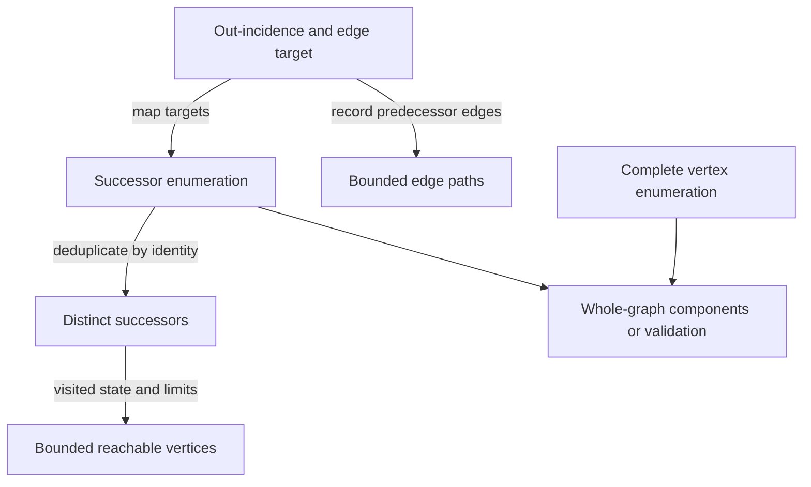

# Low-level graph foundations for TypeScript and Engraph OCE

**Decision report · 7 September 2026 · version 1.0**  
**Basis:** the commissioned research brief v1.0 and *Typescript Graphs: concept map and shared reference* v1.1.  
**Scope:** general graph foundations, shared TypeScript concerns, and a proposed OCE target architecture.  
**Authority:** Research and recommendations only. Repository inclusion does not approve implementation, dependency, policy or ADR changes.

## 1. Executive answer

**The best long-term approach is a composition of model-specific foundations and operation-specific capabilities, with selective ownership. Neither a universal graph object nor an OCE-written graph engine should be compulsory.** A knowledge query, an evidence-bearing edge path, an implicit state-space traversal and a bulk numerical graph algorithm have different useful minima. Unifying them at the wrong boundary loses information or imposes unnecessary structure.

OCE should own **the semantic policies and contracts that preserve its meaning and make composition reliable**: identity scope, validated graph profiles, bounded operation results, snapshot/completeness rules, and evidence-preserving projections. It should adopt standards-based knowledge-data interfaces and substantial computational mechanisms where they supply the best semantics, assurance and lifecycle economics. Ownership here can mean adopted interfaces, validators, configuration and domain result guarantees; it does not automatically mean a new public OCE API. Direct internal use of a suitable external library is legitimate; an OCE wrapper must add a real promise rather than rename every vendor method.

The recommended target has three usable entry routes:

| Question | Preferred foundation | What OCE owns |
|---|---|---|
| What is asserted, by which sources, in which scope/revision, and what follows from a declared query? | RDF/JS knowledge-data contracts and an appropriate dataset/query implementation; relational/query operations can run directly. | RDF legality/profile, domain vocabularies and identity, provenance, access/temporal selection, domain query results. |
| Which structural results are needed across repeated or broad materialised-graph analysis? | An explicit model and a coherent computational engine are strong candidates; standalone algorithms, direct queries and specialist kernels remain eligible. Effect 4 leads the inspected typed-payload/edge-handle/mutation profile; Graphology offers a distinct ecosystem. | Projection semantics, engine-key mapping, operation-level guarantees, result-to-evidence reconstruction, conformance at the seam. |
| What can be explored from these roots without a complete graph object? | Small capabilities such as successor access or edge incidence, with identity and traversal control. | Reusable bounded operations where their minimal input contract creates value; providers may be native, external, generated or remote. |

These routes compose without forcing every query through a structural graph API or every structural graph through RDF. A shared capability interface is useful at a real substitution point; it need not become the only public centre of the system.

**Implementation recommendations are role-specific.** Prefer an externally maintained coherent engine for broad explicit-graph algorithm needs, subject to the selected model/profile. Effect **4.0.0-rc.112** leads the inspected profile of typed payloads, multiedge handles, protected mutation and evidence-capable path results. This is a feature/profile judgement, not established long-term superiority across all materialised workloads. Its release-candidate status and uncovered adoption checks remain material. Graphology **0.26.0** is valuable when mixed graphs, its ecosystem or visualisation integration matter, with explicit key encoding and conformance limits. Native indexes are a serious specialised representation, not the default answer to ownership; measured local speed does not establish the best long-term foundation. Persistent structures, matrix kernels and query-backed views remain first-class alternatives for the lifecycles they serve.

For knowledge data, replace the assumption that local “RDF/JS-aligned” types are a sufficient interoperability boundary. OCE’s current surface fails authoritative type/runtime contracts in specific ways; established implementations already support relevant RDF 1.2 constructs. Adopt or compose an RDF/JS implementation under an exact supported profile, while retaining OCE’s independent legality and information-preservation tests. N3, a dedicated data factory and Oxigraph serve different roles and have different interface/edition limits; none receives blanket clearance from its name.

The report separates architecture from exact-version readiness. Reproduced library bugs veto affected uses until resolved; they do not prove that new OCE code would be safer. The current OCE implementation and corpus provide verification cases and impact evidence. They carry **no preservation requirement or migration-convenience preference** in the target selection.

## 2. The design question and competing approaches

“Best” is evaluated against semantic adequacy, useful composability, correctness assurance, TypeScript usability, whole-lifecycle cost, and sustainable ownership/exit. These criteria are not collapsed into a weighted score. Semantic loss or violated invariants cannot be compensated by speed. Present package boundaries, familiarity and ease of fitting existing code have zero selection weight.

The useful outcome is a foundation that can support several classes of TypeScript graph consumer, then serve OCE’s knowledge and computational purposes precisely. It is not proof of an optimum over every imaginable future workload. Where models or consequences are incomparable, the report chooses a boundary or conditional implementation class rather than inventing a universal winner.

### 2.1 Architecture alternatives at comparable resolution

| Approach | Strongest case | Where it wins | What prevents universal use | Verdict |
|---|---|---|---|---|
| **Coherent external graph engine** | Storage, invariants, incidence and substantial algorithms evolve together; avoid owning a second general-purpose engine. | Explicit graphs needing several algorithms, mutation/snapshots and reusable analytical state. | Concrete model/identity assumptions; generic implicit graphs and knowledge queries need another route; dependency assurance and exit are real work. | Preferred for broad materialised structural computation when its profile fits. Evaluate Effect 4 and Graphology as serious competing foundations, not mere adapters around current code. |
| **Small capability contracts with generic operations** | Algorithms state only what they require; representation independence and implicit providers become possible. | Local exploration, custom providers, portable operation semantics, independent knowledge/computation seams. | A small interface does not magically make concrete vendor algorithms generic. Too many wrappers duplicate APIs and inhibit specialised optimisation. | Own the smallest contract or operation where provider/representation independence supplies enduring value, including implicit and remote exploration; direct engine/query use remains equally valid. |
| **Knowledge/query-first foundation** | Keep assertions, evidence, selection and joins together; compute domain answers without unnecessary graph conversion. | Provenance-rich knowledge, named strata, joins, access/temporal queries, rule/query processing. | Query engines do not solve arbitrary implicit state spaces or every structural algorithm economically. Query compatibility does not establish RDF legality or complete knowledge. | A primary route for knowledge consumers, with structural materialisation only where useful. |
| **Relational, construction-algebra or numerical kernel foundation** | A smaller algebra can provide laws, compositional construction, query optimisation or efficient bulk computation. | Repeated joins, lawful graph construction, dense/large numerical analytics and semiring algorithms. | Ordinary relations/matrix entries aggregate edges; provenance and independent edge identity require explicit encodings. A kernel is not automatically a friendly TS domain API. | Retain as genuine foundations on their axes; use by operation/profile, not as a universal data model. |
| **Consumer-local direct implementation/use** | Avoid a shared abstraction when one complete domain operation is clearer as direct queries, collections or vendor calls. | Fixed joins, one-off analysis, specialised models with little reusable contract. | Repeated identity/projection/ownership logic can diverge; independent replacement becomes expensive when vendor details escape everywhere. | Valid outcome. Extract only the stable shared promise, not every local mechanism. |
| **Universal RDF or universal property-graph object** | One model and toolchain appears to simplify the estate. | A bounded homogeneous estate can benefit if all uses genuinely share the profile. | RDF statement sets, independent multiedges, mixed incidence, temporal assertions and implicit states do not share all the same contracts. Encoding is possible but its costs and changed semantics must be justified. | Reject as a mandatory centre for this broader brief. |
| **New OCE general-purpose engine** | Full control over types, invariants, algorithms and evolution. | Could win if existing engines cannot satisfy a valuable coherent model/profile and ownership is sustainable. | Rebuilding a broad assurance/maintenance surface is a substantive cost; small probes do not establish superiority. | Not supported as the general target by this evidence. New bounded implementations remain eligible on their own merits. |

A multi-route architecture is not an instruction to maintain redundant copies. Each domain dataset has one declared authority; projections and indexes have revisions and explicit invalidation. Each operation chooses a route that preserves its meaning. Reuse occurs in domain identity, seam contracts, conformance and suitable shared computation—not through a requirement to materialise every conceivable model.

### 2.2 Alternative meanings of “smallest”

| Axis | A genuinely small foundation | What it does not establish |
|---|---|---|
| Mathematical structure | `V,E,s,t` for a directed multigraph; a binary relation for simple adjacency. | Efficient access, complete enumeration, domain semantics. |
| Program capability | Successor function; outgoing incidence; independent vertex membership. | Storage or ownership strategy. |
| Construction language | Empty/vertex/overlay/connect algebra with laws. | Independent edge/assertion identity or efficient execution of every query. |
| Query/computation algebra | Relations and joins; sparse vectors/matrices with generalised operations. | A universal domain graph model or a native TS implementation choice. |
| Mechanism | Map/set, arrays, queue, heap, interning, sparse storage. | Public graph contract or package boundary. |
| Dependency | A small owned contract may delegate a lower mechanism; direct dependency use may be smaller still. | That fewer dependencies means less total code, risk or maintenance. |

Mokhov’s algebraic-graphs work supplies a serious alternative to assembling vertex/edge records: lawful total constructors exclude dangling-edge constructions in the model and support equational reasoning. The original simple directed-graph algebra collapses duplicate relations; later work extends labels through richer algebra. This is valuable construction and transformation evidence, not a reason to erase multiedge/assertion distinctions. [Mokhov, *Algebraic Graphs with Class* (2017)](https://eprints.ncl.ac.uk/file_store/production/239461/EF82F5FE-66E3-4F64-A1AC-A366D1961738.pdf), [Mokhov, *United Monoids* (2022)](https://arxiv.org/pdf/2202.09230).

GraphBLAS instead defines low-level computational building blocks through sparse linear algebra with configurable operations. A matrix-vector frontier operation can implement traversal, and different operator choices support different computations. This makes “one successor iterator” only one possible computational minimum. Matrix aggregation, identity mapping, numerical semantics and binding/transfer costs still require a contract. No production-ready TypeScript GraphBLAS binding or OCE-scale superiority was established here. [GraphBLAS Forum](https://graphblas.org/), [C API specification 2.1.0](https://graphblas.org/docs/GraphBLAS_API_C_v2.1.0.pdf).

## 3. Definitions, scope and models

The report uses **G** for general findings under stated assumptions, **T** for shared TypeScript/JavaScript findings, **O** for OCE-specific evidence/proposals, and **H** for hypotheses or prospective consumers. Evidence classes are **specification**, **project claim**, **inspected source**, **executed observation**, and **inference/proposal**. Source agreement, agent agreement and runtime agreement are different kinds of support.

| Term | Precise use |
|---|---|
| Graph | Qualify mathematical model, knowledge-data model, computational view, implementation or visualisation. |
| Core / primitive | Smallest useful contract on a named axis; no universal hierarchy or automatic package entitlement. |
| Incidence / adjacency | Incidence relates edges to vertices; adjacency relates vertices. Adjacency can forget which and how many edges support a connection. |
| Identity / equality / equivalence | Identity determines what is the same within a scope; equality implements a comparison; equivalence names the relation under which structures or results are considered preserved. |
| View / projection / index | Access perspective / selected or transformed model / access accelerator. Each needs ownership, scope and revision rules. |
| Snapshot / persistent / durable | Consistent state / prior versions remain usable after updates / survives process or session loss. Independent promises. |
| Complete | Complete for a declared source selection, revision, access scope and requested operation. Truncation is a separate execution outcome. |
| Order | Distinguish domain sequence, insertion, traversal, tie-breaking, presentation and canonical byte order. |

### 3.1 Structural models

For an explicit finite directed multigraph, the proposed basis is sound:

\[
V,\quad E,\quad s:E\to V,\quad t:E\to V.
\]

It preserves isolates through `V`, parallel edges through distinct members of `E`, and loops where `s(e)=t(e)`. It does not require labels, properties, edge weights, provenance, an ordering, acyclicity or a storage representation. Finiteness and enumeration are additional program contracts, not consequences of writing set notation.

This model is **too strong** for a reachability provider that can generate successors but cannot enumerate all states; **too weak** for unordered incidence, mixed directions, hyperedge roles or assertion semantics without further structure. Independent edge identity should therefore be **optional at the capability level**, mandatory in an explicit multigraph or evidence-path view. A relation `R ⊆ V×V` is enough when multiple connections are intentionally collapsed.

| Model | Exact distinction | Contract consequence |
|---|---|---|
| Directed simple graph / multigraph | One relation per ordered pair versus independently distinguishable edges. | A set of successors can implement both for vertex reachability; it cannot reconstruct multiedge paths. |
| Undirected graph | Unordered endpoints; loop convention must be explicit. | Incident edge enumeration usually returns a loop once; degree counts it twice. A two-arc encoding needs original-edge identity to avoid false cycle/path interpretations. |
| Mixed graph | Edge-specific directed or undirected kind. | Use a tagged incidence model or an explicit projection. A global directed boolean cannot express mixed semantics. |
| Labelled/typed/attributed/weighted | Independent functions from vertices/edges to chosen values. | Keep accessors independent of structure. A confidence score is not automatically an additive distance. |
| DAG / rooted tree / forest | Constraints on direction, cycles, parent cardinality, roots and connectedness. | Validate construction or updates; a TS tag alone proves nothing. A forest preserves isolated singleton trees. |
| Hypergraph / incidence system | One relation may involve several participants, possibly with roles/order. | Reify relation vertices or expose hyperincidence when a real n-ary assertion requires it. Clique expansion changes path lengths and evidence; no current OCE hypergraph algorithm consumer established. |
| Property graph | Explicit vertex/edge objects with a chosen label/property value model. | Must specify edge identity, duplicate property keys and value types; “PG compatible” is underspecified. |
| RDF graph / dataset | Set of triples; default graph plus named graphs; RDF term equality and scoped blank nodes. | Duplicate equal quads do not preserve repeated assertions or source occurrences. Dataset inventory can include empty named graphs that a quad set alone cannot represent. |
| Implicit / remote graph | Neighbours are generated or fetched; universe may be unknown or unbounded. | Local traversal needs termination/resource assumptions; a completed fetch is not proof of global completeness. |

The architectural precedent is concept-oriented composition: Boost separates incidence, adjacency and vertex/edge-list capabilities, and its `breadth_first_visit` can work without the complete vertex list when traversal state is supplied. Rust petgraph likewise separates visit traits and traversal state, although its concrete APIs and lifetimes should not be copied into TypeScript. [Boost graph concepts](https://www.boost.org/doc/libs/1_89_0/libs/graph/doc/graph_concepts.html), [Boost breadth_first_visit](https://www.boost.org/doc/libs/1_37_0/libs/graph/doc/breadth_first_visit.html), [petgraph visit traits](https://docs.rs/petgraph/0.8.3/petgraph/visit/index.html).

### 3.2 Identity contract

| Identity | Scope and preservation rule |
|---|---|
| Domain entity | Branded IRI/string or another deliberate key; scope may include tenant/corpus. Equal display labels never establish identity. |
| Structural vertex/edge | Unique within one graph or revision unless explicitly stable across them. Endpoint pairs identify simple relations, not arbitrary multiedges. |
| Assertion | An attributable record of making a claim. Several assertion IDs may support one equal RDF statement or adjacency. |
| Occurrence | A particular source appearance/location; many can support one assertion or proposition. |
| Artefact/revision | A document, release or immutable content revision. A content hash identifies bytes under a scheme, not semantic truth or automatically the same enduring artefact. |
| Blank node | Scoped RDF identity; independently parsed datasets require standardising apart before union unless shared scope is intentionally established. |
| Implementation handle | Interned integer, string encoding or object reference. Preserve a bijection over the selected live domain; do not expose accidental allocator behaviour as persistent domain identity. |

Native `Map`/`Set` use SameValueZero for primitive values and reference identity for objects: `1` differs from `"1"`, but two equal-looking objects remain distinct; `NaN` keys compare equal. The language specifies average **sublinear** access, not a universal constant-time implementation guarantee. Custom equality requires a consistent hash/key mechanism or explicit scans. Mutable keys can invalidate value-hashed structures; symbols and references need an exchange mapping before serialisation. [ECMAScript keyed collections](https://tc39.es/ecma262/multipage/keyed-collections.html).

Choose deliberate scoped domain identity where interoperability or durable reference requires it, and brand distinct public ID domains where useful. Strings, integer handles, references and backing collections remain choices of the selected model and lifecycle. An interner must be injective over the declared scope, preserve reverse lookup and reject dangling endpoints during construction. If strings must be encoded for a backend, use a versioned injective encoding with round-trip tests; prefixing only a few known bad names is not a general encoding contract.


## 4. Capability lattice and TypeScript surface

The arrows below mean “can supply the lower-level promise with the stated derivation,” not mandatory package dependencies. Enumeration does not imply efficient incidence, and incidence does not imply complete enumeration.



### 4.1 Minimum semantics and cost profiles

Let `n=|V|`, `m=|E|`, `d` be relevant incident-edge count, `u` distinct neighbours, `r` visited vertices, `i` examined incidences and `k` output edges. Bounds below assume constant-cost key comparison/access where explicitly indexed. They are **implementation profiles**, not promises forced on every provider.

All read capabilities below operate against one stable revision or explicitly declared live source. Returned iterables must document single-pass/repeatable behaviour and borrowing. For a shared materialised read profile, repeatable read-only snapshot access is a useful guarantee; payload immutability is separate. Remote streams and direct engine/query APIs retain their own documented consistency and consumption contracts. Unknown-handle calls are precondition failures at internal accessors; shared bounded OCE operations should validate roots and return a typed error. A direct engine/query route needs result adaptation only when it supplies an OCE-level promise. An empty neighbour sequence must not be used to infer membership.

| Capability | Minimum semantics, duplicates and order | Indexed profile / fallback | Complete universe needed? |
|---|---|---|---|
| Membership | `hasVertex(v)` answers membership in this view, not existence elsewhere. | Map membership / scan `O(n)` | No; exact local membership may be available without enumeration. |
| Vertex enumeration | Each member exactly once, including isolates; order unspecified unless refined. | `O(n)` output | Yes for claimed whole-scope enumeration. |
| Edge enumeration | Each edge identity once; endpoint integrity; no deduplication by labels. | `O(m)` output | Yes for whole-scope edge set; does not enumerate isolates. |
| Endpoints | Source/target for directed edge; unordered endpoints plus orientation for undirected/mixed. | Handle lookup / search `O(m)` | No. |
| Out/in incidence | Each incident edge once in that direction; loop convention explicit. | `O(d)` with matching index / `O(m)` scan | No. |
| Successors/predecessors | Enumerate reachable adjacent vertices under declared direction; duplicates allowed unless named `distinct`. | `O(d)` plus target lookup | No; each expansion must terminate or be cancellable. |
| Distinct neighbours | One vertex per identity, even across parallel edges; direction declared. | `O(d)` dedup, `O(u)` space unless pre-indexed | No. |
| Pair lookup / existence | All matching edge identities or a boolean; empty for no edge, with membership separate. | Indexed pair lookup + output / source-row or full scan | No. |
| Degree | In/out/undirected/total; count incidences, multiplicity and loops by declared convention. | `O(1)` cached or `O(d)` derive | No. Distinct-neighbour count is a different measure. |
| Property / weight access | Typed accessor over vertex/edge handle; missing/error policy explicit; no mutation through read view. | Depends on backing data; local map often sublinear | No. |
| Filter / subgraph / projection | Name node-induced, edge-selected, traversal-tree or domain projection; retain selection metadata. | Lazy access or materialise `O(n+m)`; indexed output-sensitive alternatives | Only if claiming complete global selection. |
| Builder / mutation | Add versus upsert versus merge distinct; endpoint validation; cascading delete; batch atomicity. | Native indexes expected local updates; persistent/copying costs separate | No, unless whole-state validation or publication requires it. |
| Snapshot / revision | One consistent topology; payload ownership; revision changes on relevant updates. | May share, copy `O(n+m)`, or use store transaction | No; can snapshot a declared partial view. |
| Traversal control | Roots, direction, limits, early stop, visitor/accumulator; no hidden global state. | Work `O(r+i)` with indexed adjacency, output/storage extra | No for local traversal. |
| Async source / stream | Explicit page/batch continuation, errors, cancellation, duplicate and revision policy. | Include network/query costs; no synchronous big-O pretence | No. Completeness is response metadata, not inferred from EOF alone. |

Incoming incidence is warranted where reverse queries are repeated; it need not be stored for every graph. Do not add degree caches, pair indexes, global edge lists or async abstractions merely because they can be named. Membership, outgoing reachability, selected edge materialisation, property access and stable snapshots have current OCE consumers. Complete enumeration, global analysis, mutable builders and remote providers are independently justified capability classes; their implementation requirements must be established for the selected consumer rather than inferred from current use.

### 4.2 Type sketches and proven limits

These are research sketches, not committed APIs:

```ts
interface Successors<V> {
  readonly successors: (vertex: V) => Iterable<V>;
}
interface VertexMembership<V> {
  readonly hasVertex: (vertex: V) => boolean;
}
interface VertexList<V> {
  readonly vertices: () => Iterable<V>;
}
interface OutIncidence<V, E> {
  readonly outEdges: (vertex: V) => Iterable<E>;
  readonly target: (edge: E) => V;
}
interface EdgeProperty<E, A> {
  readonly get: (edge: E) => A;
}
type EdgeStep<V, E> = Readonly<{
  from: V; edge: E; to: V;
  direction: "forward" | "reverse";
}>;
```

Function-valued properties matter: strict TypeScript checking treats their input positions more safely than method syntax. An executed probe preserved branded unit IDs and narrowed edge kinds at a real `createGraphView` import, but also demonstrated that its method-shaped generic interface can be widened to accept a root ID outside the original domain. The proposed function-property capability rejected the corresponding widening. This is a specific assignability risk, not a claim that structural typing is unusable. [TypeScript compatibility](https://www.typescriptlang.org/docs/handbook/type-compatibility.html), [OCE GraphView interface](https://github.com/EngraphCode/open-curriculum-ecosystem/blob/dfe92492711f8d7c6ac8233735994c8fada45e0e/packages/core/graph-core/src/graph-view/interface.ts).

Brands distinguish compile-time domains; constructors still validate strings from JSON. `ReadonlyMap` hides mutators through that reference but does not prevent a retained mutable alias changing the map. `readonly` payload fields do not deeply freeze objects. “DAG” branded output should be produced by validation and invalidated by unconstrained mutation. Separate vertex and edge handles; plain numeric aliases do not provide this distinction.

For shared OCE operations, prefer a small discriminated operation result such as success, unknown-root, invalid-limit, cancelled or resource-limit. Include snapshot revision and selection scope at the query boundary. A useful completeness shape separates `source: complete | selected | unknown` from `execution: complete | limited | cancelled`, with the relevant scope/reason. Avoid making every low-level iterator carry an RDF provenance object.

Depth must be a finite nonnegative integer; public operations also need maximum visited vertices/edges or a deadline. Depth one over a high-degree vertex can still be expensive. A synchronous loop can check a deadline or pre-aborted signal, but an abort event cannot interrupt a blocked event loop until execution yields; larger jobs need cooperative batches or a worker. Visitors must not mutate the traversed snapshot, and early stopping must distinguish “found a witness” from “enumerated all matches.”

Compiler evidence is deliberately small: strict TS 6.0.3, NodeNext/ES2022, `noUncheckedIndexedAccess`, `exactOptionalPropertyTypes`, `skipLibCheck:false`; 70 files, approximately 0.71 s checking and 114 MB compiler memory on this host. It demonstrates type behaviour, not monorepo compile-time scalability. Effect/Rimbu/thi.ng and RDF probes used TS 5.9.3 separately. ESM/CJS export checks and declaration results are reported per candidate; no browser bundle-size claim is inferred from package size.


## 5. Representations, ownership and time

| Representation | Construction/read cost under ordinary assumptions | Update, copy and memory consequences | Appropriate role |
|---|---|---|---|
| Edge list | `O(m)` construction; incidence scan `O(m)` each expansion. | Append cheap; deletion/search linear; `O(n+m)` explicit graph storage. Serialises naturally. | Small/one-shot scans, canonical interchange, bulk algorithm input. |
| Outgoing map of arrays/sets/multimaps | `O(n+m)` build; row traversal `O(d)`; set neighbours collapse multiplicity. | Arrays retain order/multiplicity; sets enforce chosen equality; deletion row-dependent. Map/object overhead can dominate many small graphs. | Read-oriented explicit graphs; choose edge rows when explanations need edges. |
| Bidirectional/pair indexes | Same asymptotic build; fast reverse/pair queries. | More memory and atomic update obligations; edge identity must connect all rows to one authoritative record. | Repeated incoming queries or mutable workloads demonstrated by consumers. |
| Incidence records / matrix | Explicit edge-to-participant structure; incidence list `O(n+m)` for binary graphs. | Dense vertex-by-edge matrix costs `O(nm)` cells; sparse form scales with incidences. | Hyperedge roles, independently addressed relationships; avoid matrix materialisation without a numerical operation. |
| Dense/bit adjacency matrix | Pair lookup `O(1)`; neighbours scan `O(n)` or words. | `O(n²)` cells/bits; one relation per pair unless values aggregate multiplicity. Fixed domain/capacity and loop conventions matter. | Dense graphs, bitwise intersections/closure when measured; unsuitable as automatic sparse-corpus default. |
| CSR / CSC with typed arrays | Counting/scatter build `O(n+m)` for interned input; rows `O(d)`; sorted pair search optional. | Compact contiguous storage; arbitrary insertion shifts/rebuilds arrays. Need domain↔integer maps and edge ordinals; index width/overflow checks. CSC adds reverse access. | Static large numeric workloads or repeated whole-graph algorithms. Conversion cost must amortise. |
| Object-reference graph | Links follow directly; identity is reference identity. | Retained closures/objects affect GC; serialisation needs IDs; shared payload mutation and cycles need explicit handling. | Local object model with deliberate ownership, not an implicit persistence format. |
| Persistent maps/sets | Structural sharing can preserve prior values efficiently. | Costs depend on hashing, collisions and path copying; graph builders may materialise across all rows. More abstraction does not guarantee cheaper updates. | Many retained versions or concurrent readers when measured. |
| Immutable snapshot from mutable builder | Build indexes once; coherent reads. | Freeze topology or transfer exclusive ownership; full rebuild/copy may be `O(n+m)`. Nested payloads need a distinct promise. | Release-built or transactional read views; publish only validated snapshots. |
| RDF/database/query-backed view | Can push down selective joins and filters. | Indexes, transactions, network latency and term conversion matter; reads may be partial/access-filtered. | Knowledge queries where store facilities serve the question. Avoid pulling the entire dataset merely to satisfy a library interface. |
| Lazy/remote successors | No global build needed; pay per expansion/page. | Cache by revision/access scope; retries/dedup/cancellation; local finiteness or limits needed. | State spaces and bounded remote exploration. |
| WASM/native backend | Compact internal representation may reduce JS overhead. | Initialisation, marshalling, copies, worker transfer and native memory are part of cost. | Oxigraph query/storage or specialised numeric analysis when justified; no measured WASM structural winner here. |
| Specialised DAG/tree or many-small representation | Parent arrays, ordered child lists, online topological state can avoid general-graph overhead. | Stronger invariants and update constraints; graph count magnifies object/factory cost. | Domain-local forest or incremental dependency operation with proven need. |

CSR row efficiency and expensive sparsity changes are representation properties reflected in mature sparse-matrix APIs; a JS implementation still needs separate measurement. [SciPy CSR reference](https://docs.scipy.org/doc/scipy/reference/generated/scipy.sparse.csr_matrix.html).

**State authority is a contract, not a preferred representation.** A source dataset/store or explicit graph is authoritative for a declared scope; each derived projection identifies its source revision and selection policy. Immutable publication may build and validate a new index set before swapping one reference. A mutable engine may use atomic batches or transactions. Both must prevent divergent edge records, incidence indexes and caches. Events alone are not transactions, and retained input aliases cannot silently mutate a published snapshot.

A builder’s duplicate-add should fail or explicitly report an existing identity; upsert replaces a specified value; merge requires a domain-defined operation. Missing-delete can return false consistently. Vertex deletion must declare cascading incident-edge removal. A live iterator must specify whether mutation invalidates it, is fail-fast, or is observed; snapshot iterators should be repeatable. Incremental indexes and incremental algorithms are distinct investments: an updated adjacency does not automatically update SCCs or topological order.

Release revision, valid time and recording time belong in knowledge/query selection when relevant. Structural traversal operates over the selected state; it should not invent temporal truth. Worker transfer should send a declared snapshot/encoding and its revision; transferring a typed-array buffer changes ownership, and shared memory requires a separate synchronisation protocol. No current consumer evidence requires concurrent graph writers.


## 6. Algorithm contracts and implementation choices

Operation contracts belong above their implementation. Library algorithms may consume concrete storage directly; generic algorithms may consume capabilities; query engines may implement equivalent relations. The appropriate route depends on the result’s meaning and lifecycle, not on which representation is already present.

| Operation | Minimum input and preconditions | Result and cost contract | Preferred ownership boundary |
|---|---|---|---|
| BFS/DFS; bounded reachable vertices | Roots, successors, identity/visited state; finite explored region or limits. | Indexed `O(r+i)` work; BFS hop distances, DFS different order; visited state handles cycles/multiplicity. Iterative implementation avoids deep recursion limits. | Small generic operation where implicit/provider independence matters; otherwise use the engine’s traversal directly. |
| Bounded neighbourhood with edges | Reachability plus incidence/endpoints; specify node-induced, edge-selected or traversal-tree result. | `O(r+i+k)` before ordering if suitable indexes exist; full edge scan adds `O(m)`. | Shared operation contract; engine-native or indexed materialiser. |
| Existence / explanatory path | Successors for yes/witness; edge incidence and identity for edge-bearing reconstruction. | Steps include edge ID and traversal direction. First witness, shortest witness and all witnesses differ. | OCE owns evidence/result meaning; adopt suitable traversal/path mechanism. |
| Directed cycle / topological order | Complete vertices and directed incidence for a global result; DAG for an order. | Order or useful cycle witness; Kahn/iterative DFS `O(n+m)` with appropriate indexes. Self-loop invalidates DAG; deterministic ready-set ordering can cost more. | Coherent engine or independently assured algorithm; avoid a new implementation merely because its loop looks short. |
| Weak components | Complete vertices plus direction-forgetting adjacency, or full edge list and union-find. | Partition includes isolates; linear traversal or near-linear union-find under its assumptions. | Adopt; a one-off edge-list method need not retain a reverse index. |
| Strong components | Complete vertices and directed adjacency; reverse access required by some algorithms. | Partition/condensation DAG; standard linear algorithms with suitable representation. A partial view cannot certify whole-source SCCs. | Prefer an independently assured engine or standalone implementation; expose domain scope separately. |
| Unweighted shortest paths | Locally finite adjacency; BFS for hop distance. | One/all paths, tie order and parallel-edge choice explicit; all-path output may explode. | Adopt or extend bounded generic traversal where its input minimality is useful. |
| Weighted paths | Weight accessor; finite nonnegative weights for Dijkstra; A* heuristic assumptions; alternative algorithms for negative weights. | Distance plus selected edges; invalid weights/negative cycles explicit. Heap Dijkstra has an appropriate logarithmic bound; an array-scanning implementation does not inherit it from its name. | Adopt/compose an independently assured algorithm or engine, including generated weighted-successor providers; domain defines meaningful additive cost. |
| Projection/filter/subgraph | Explicit model, predicate, inclusion and identity policy. | Preserve declared information; materialised/lazy ownership and revision specified. | Domain owns semantic selection, engine/query provider owns execution where appropriate. |
| Closure / reduction | Defined reachability relation; DAG for unique simple directed transitive reduction. | Closure can have quadratic output. Reduction preserves reachability, not path counts, weights or asserted-edge identity. | Adopt operation when its meaning serves the question; preserve original assertions separately. |
| Incremental dependency analysis | Update/retraction model, maintained invariant and revision discipline. | Name whether order, reachability or components are maintained; updated adjacency alone proves none of these. | Evaluate online graph algorithms or incremental query systems as distinct foundations. |
| Ranking / community / matching / flow / layout | Algorithm-specific model, aggregation, weights and domain question. | Output meaning and evaluation criterion must be defined; no generic score substitutes for this. | Specialist ecosystem or kernel; keep domain interpretation outside it. |

The algorithm families beyond bounded traversal are included because the brief asks for reusable foundations and credible future consumers, not because current OCE calls prove their immediate use. Current and prospective uses are distinguished in §10. [NetworkX’s reduction contract](https://networkx.org/documentation/stable/reference/algorithms/generated/networkx.algorithms.dag.transitive_reduction.html) explicitly requires a DAG and separately handles copying attributes.

**Query operations are an equally serious computational route.** Fixed relation joins, recursively defined reachability and evidence filters need not first become an in-memory graph object. PostgreSQL 18 documents recursive queries, duplicate handling and cycle facilities; this establishes feasibility, not an OCE deployment recommendation. Differential dataflow demonstrates that updates and nested iteration, including graph computations, can share an incremental relational foundation; its research result does not establish a current TS package choice. [PostgreSQL recursive queries](https://www.postgresql.org/docs/18/queries-with.html), [McSherry et al., *Differential Dataflow* (2013)](https://www.microsoft.com/en-us/research/publication/differential-dataflow/).

SPARQL property paths can express connectivity without automatically returning the explanatory sequence of source assertions; query solutions have multiset semantics, which must not be confused with independent evidence occurrences. Datalog-style rules additionally need a declared treatment of negation, termination, retraction and explanation. RDF, SQL, Datalog and incremental dataflow are alternatives with different contracts, not one hypothetical engine possessing all their strengths. [SPARQL 1.2 Query draft, 27 August 2026](https://www.w3.org/TR/2026/WD-sparql12-query-20260827/).

**Determinism:** distances and reachable sets can be invariant under input permutation while traversal trees and witness paths change. Sorting is an explicit policy and cost, not a hidden property of “a graph.” For a reproducible witness, order by a declared total key and retain original edge identities. For domain sequence, store sequence semantics independently. These obligations apply equally to adopted and owned algorithms.

## 7. Knowledge-data and conversion contracts

### 7.1 Standards editions are separate contracts

| Source/edition inspected | Status and role | What it does not promise |
|---|---|---|
| RDF 1.2 Concepts, 7 April 2026 | W3C Candidate Recommendation Snapshot; triple terms in object position and directional language strings. | Not a completed Recommendation; RDF remains atemporal, and a triple term does not itself assert its proposition. |
| RDF/JS data-model specification; `@rdfjs/types` 2.0.1 | Community specification and authoritative released TS interface package for terms/factories. | Not a W3C Recommendation or a complete RDF legality validator. Living prose, released typings and implementations can differ. |
| RDF/JS DatasetCore | Unordered mutable set of quads with equality-based membership; `match` returns a separate dataset. | No transaction, provenance, temporal, access or performance guarantee. Extended Dataset/Factory facilities are experimental. |
| JSON-LD 1.1, 16 July 2020 | W3C Recommendation for linked-data representation/processing. | Not a structural graph API or automatic encoding of all RDF 1.2 constructs. New working-group activity is not completed 1.2 interoperability. |
| RDFC-1.0, 21 May 2024 | W3C Recommendation for RDF dataset canonicalisation in its defined scope. | No silent extension to all RDF 1.2 constructs; no assertion truth, entity reconciliation or semantic equivalence proof. |
| SPARQL 1.2, 27 August 2026; SHACL 1.2 Core, 28 August 2026 | Working Draft query/validation specifications. | Product support claims must identify implemented edition/features; earlier Recommendations remain separate. |
| ISO/IEC 39075:2024 GQL; 2026 corrigendum | International property-graph query-language standard; catalogue verified. | Not a TS storage interface. Full paid standard text was not inspected, so no detailed GQL conformance conclusion is made. |

Primary editions: [RDF 1.2](https://www.w3.org/TR/2026/CR-rdf12-concepts-20260407/), [RDF/JS data model](https://rdf.js.org/data-model-spec/), [Dataset specification](https://rdf.js.org/dataset-spec/), [JSON-LD 1.1](https://www.w3.org/TR/2020/REC-json-ld11-20200716/), [RDFC-1.0](https://www.w3.org/TR/2024/REC-rdf-canon-20240521/), [SHACL 1.2 draft](https://www.w3.org/TR/2026/WD-shacl12-core-20260828/), [GQL catalogue](https://www.iso.org/standard/76120.html), [corrigendum catalogue](https://www.iso.org/standard/93701.html).

OCE’s custom `TripleTerm` expresses a useful legality distinction, but this is not evidence that OCE should own a nonstandard interchange term representation. The inspected RDF/JS prose and `@rdfjs/types` 2.0.1 do not perfectly agree on nested-quad positions, and the types allow more than RDF 1.2’s object-position legality. The stronger design is **a declared RDF 1.2/profile validator over a compatible interchange model**, or a private domain representation with an explicit tested conversion. Do not claim interface conformance by structural resemblance.

### 7.2 What the current RDF probes establish

Executed against unchanged pinned OCE source, `@rdfjs/types` 2.0.1, N3 2.7.12, `@rdfjs/data-model` 2.1.2 and Oxigraph 0.5.11:

| Observation | Meaning and limit |
|---|---|
| OCE terms lack `.equals`; its quad lacks required `value: ''`; local `TripleTerm` differs from RDF/JS nested `Quad`. | Compile-time and runtime incompatibility with inspected RDF/JS contracts. Local pure equality functions do not satisfy a method-bearing interface. |
| OCE literal factory preserves uppercase language input and produces `rdf:langString` with an empty language on the tested route. | Profile correctness requires explicit construction/normalisation checks. The dedicated RDF/JS factory also preserved uppercase in a tested case; external ownership is not automatic correctness. |
| N3, the dedicated factory and Oxigraph construct directional language literals. N3 and Oxigraph parse the tested RDF 1.2 triple-term/direction syntax and reject triple-term subjects. | Relevant semantics already exist externally. This is a small feature profile, not full conformance. |
| N3 `DataFactory.fromTerm` loses direction when converting the tested external directional literal; N3 Store accepts/preserves that external term on the tested route. | Compatibility is path-specific. Avoid that conversion or repair/validate it; do not generalise the defect to all N3 direction support. |
| `@types/n3` 1.26.3 rejects the tested directional factory argument supported at runtime. | Exact declarations/runtime editions need reconciliation without unsafe broad casts. |
| N3 Store has the tested DatasetCore-like add/match/iterator shape. Oxigraph Store returns void from add, arrays from match, and is not iterable. | Oxigraph’s store API is not RDF/JS DatasetCore, even though its RDF terms and parser can interoperate. Use a real adapter or its native query API. |
| OCE match has independent membership but shares unfrozen terms/quads. | Dataset independence does not imply deep payload ownership. |

The recommendation is to adopt **conformance as an executable profile**, not to replace one unverified “aligned” label with another. The profile should cover legal term positions, direction/language/datatype rules, structural equality, scoped blank nodes, nested terms, dataset set semantics, conversion routes and supported wire formats. [Authoritative types at the inspected revision](https://github.com/rdfjs/types/tree/1b1208dcc9389415b62717092c40d6b6954f4872), [N3 source](https://github.com/rdfjs/N3.js/tree/fa82a61fcc476cb3293a9a439ba30795d6959b2c), [OCE term definitions](https://github.com/EngraphCode/open-curriculum-ecosystem/blob/dfe92492711f8d7c6ac8233735994c8fada45e0e/packages/core/graph-core/src/term/index.ts), [OCE factory](https://github.com/EngraphCode/open-curriculum-ecosystem/blob/dfe92492711f8d7c6ac8233735994c8fada45e0e/packages/core/graph-core/src/data-factory/index.ts).

### 7.3 Seam contracts and precise equivalence

| Seam | Preservation and deliberate loss | Ownership, error and cost | Equivalence / consumer |
|---|---|---|---|
| Independent RDF inputs → dataset union | Preserve distinct blank-node scopes by standardising apart; equal propositions can deduplicate. Repeated source occurrences require separate records. | Ingest owns scope mapping; reject unresolved identity collisions. Term traversal/interner cost scales with statement/term size. | Quad-set equality after a bijective blank-node renaming within intended scopes; not assertion-occurrence equality. |
| RDF dataset → knowledge query | Preserve selected graphs, terms and inference/access/temporal policy. Query rows may aggregate/project information. | Store/query engine owns evaluation; OCE owns admissibility and result contract; record source/query revisions and failures. | Query-answer equivalence under the named dataset, inference regime and scope. |
| RDF → property graph | Declare which terms become vertices, edges, labels/properties; named graphs, statement identity and triple terms require explicit encoding. | Projection may reject unsupported input or return a loss report. Materialisation normally `O(q)` plus equality/index costs. | Only the named supported RDF subset is reconstructable; not arbitrary RDF or arbitrary PG equivalence. |
| RDF/PG → structural view | Select relationship kinds, direction, time/access scope; map entities and separately identify edges when needed. Literals may remain properties or become explicit nodes by policy. | Source retains knowledge authority; derived view is revisioned. Fail on unsupported/dangling mapping rather than silently fabricating structure. | Vertex/edge incidence equality on selected structure; domain meanings are supplied by projection. |
| Many assertions → one adjacency | Deduplicate connectivity while keeping `adjacencyKey → assertionIds[]` and source occurrences separately. | Sidecar and topology published atomically for the same revision. Aggregation/retraction must maintain support counts/sets. | Reachability preserved; assertion multiplicity and weighted paths are not preserved in the adjacency alone. |
| Domain IDs → engine handles | Injective forward/reverse mapping over declared live IDs; distinguish vertex/edge handles and graph scope. | Mapping cost `O(n+m)` for bulk conversion under ordinary map assumptions; reject coercion collisions. | Active-structure identity, not necessarily allocator history or serialised object identity. |
| Mutable source → cached view | Preserve one coherent revision; payload and topology ownership separately specified. | Transaction/version check or snapshot rebuild; invalidate on relevant source/query/access-policy change. | Snapshot equality at revision R; live eventual consistency requires a different contract. |
| Structural result → explanation | Recover actual selected edge assertions and traversal direction. A vertex-only path cannot uniquely recover parallel edges. | Domain layer binds evidence, uncertainty and source scope; dangling evidence mapping is an error. | Explanation-preserving result, not merely equal vertex sequence. |
| Graph → exchange/canonical bytes | Export IDs, edge identities, graph kind, values and required metadata; preserve isolates and multiplicity explicitly. | Version format and validators; symbol/object/worker representations need mappings. Canonicalisation has its own scope/resource cost. | State exact relation: active graph structure, quad set modulo blank-node renaming, domain sequence, or byte equality. |

The current OCE RDF→PG→RDF probe preserved three quads in its declared default-graph subset, including an explicit directional literal payload. A richer five-quad case returned three, omitting named-graph and triple-term statements. An arbitrary PG round trip changed **3 nodes/2 parallel edges/1 edge-property set** into **2 nodes/1 edge/no edge properties**. An independent blank-node-scope example merged two single-quad inputs into one without standardising apart. These are concrete boundaries, not a claim that every declared restricted projection fails. [OCE forward projection](https://github.com/EngraphCode/open-curriculum-ecosystem/blob/dfe92492711f8d7c6ac8233735994c8fada45e0e/packages/libs/graph-project/src/projection/to-property-graph.ts), [inverse projection](https://github.com/EngraphCode/open-curriculum-ecosystem/blob/dfe92492711f8d7c6ac8233735994c8fada45e0e/packages/libs/graph-project/src/projection/from-property-graph.ts).

A complete quad set still cannot encode an empty named-graph inventory without another convention. RDF set semantics do not record repeated assertions. Graph names do not automatically mean provenance. A triple term denotes a proposition without asserting it. Temporal validity and uncertainty need domain modelling. The RDF 1.2 interoperability note distinguishes information preservation from semantic equivalence; it is a nonnormative draft, not a universal conversion guarantee. [RDF 1.2 interoperability note, 23 July 2026](https://www.w3.org/TR/2026/DNOTE-rdf12-interop-20260723/).

OCE’s source map currently holds one location per quad key. To preserve several source appearances of the same statement, use occurrence records or a multimap with declared identity, rather than overloading a unique edge key. JSON-LD and Turtle source-location precision differs by path; this report does not treat a root pointer or fallback line as exact source evidence. The intended explanation should expose the precision actually available.

## 8. Candidate dossiers: designs and exact-version readiness

Discovery covered native collections, existing OCE, the named candidates and further role-distinct approaches. No download/popularity score is used. Candidate evaluation distinguishes mathematical model, implementation and ecosystem; a failure in one release is not a verdict on its whole architecture. All package observations below are as of 7 September 2026. Source/registry pins and reproduction manifests are included in the companions.

### 8.1 Explicit structural engines

| Candidate and pin | Semantics and API | Consequential evidence | Fitness and exit |
|---|---|---|---|
| **Effect 4.0.0-rc.112**, `2600f62f4532026928454dcea8d1c48557b3f942`, published 25 Aug 2026 | Directed/undirected multigraph; loops, isolates; independent numeric node/edge handles; typed payloads; concrete engine algorithms; scoped mutation and snapshots. | Executed terminal mutation handles, distinct neighbours versus incidence multiplicity, correct tested loop degree, edge-bearing path/cycle results. Source uses lazy CSR caches and typed-array heaps. Beginning mutation copies structure `O(n+m)`; payloads remain shared. | Leading candidate for the inspected typed-payload/edge-handle/structural-ownership profile. Whole-lifecycle and release assurance remain separate. No mixed graph kind; numeric aliases do not brand node versus edge or graph instance. Snapshots preserve active IDs but not allocator history. Use domain mapping/export and profile tests. RC is not stable-release clearance. |
| **Effect 3.22.1**, `417e0faa80e471d77fc4a67452e68b09ae0ee861`, 30 Jul 2026 | Stable release with graph facilities and immutable-style APIs. | Public Maps remain mutable through declarations; retained mutation handle can change adjacency shared with the finalised graph. Documented Dijkstra heap bound is unsupported by array scan/splice implementation. | Do not use this stable version as evidence against the repaired RC. It fails the tested immutable structural promise; adopting stable solely for its tag would be a poor substitution. |
| **Graphology 0.26.0**, `feb3e5c37e791d75f3dab185a56cb25d32c17de7`, 8 Feb 2025; types 0.24.8 | Directed/undirected/mixed, simple/multi, loops, independent string edge keys; mutable graph with events; generic attributes, keys coerced to string. | Numeric `1` and string `"1"` merge by design. The tested `__proto__` endpoint produced a false duplicate-edge rejection. Stable unchanged-topology iteration is documented, but insertion order is not guaranteed. Broad ecosystem algorithms expect a concrete mutable-shaped graph. | Strong mixed-graph/ecosystem candidate with injectively encoded keys and selected-package conformance. Conversion can amortise across many operations. A tiny read interface is not automatically ecosystem-compatible. |
| **@dagrejs/graphlib 4.0.5**, `d3a0cf36f55ebd75f28b6acf7a436a54e1b990dc`, 3 Aug 2026 | Directed/undirected, simple/multi, compound graphs; string node IDs, endpoint/name edge descriptors; upsert/autocreate semantics. | Empty graph reports inherited object names present; empty edge name is omitted from returned descriptor; separator-containing endpoint tuples collide. Declarations omit some possible undefined results. Topological implementation recursive; depth risk not exhaustively executed. | Compound/Dagre-style role can matter, but unrestricted identity contract fails at this release. Encode/validate or remediate; do not silently use as arbitrary-ID foundation. |
| **ngraph.graph 20.1.2**, `c082b7ce8489bdc823db44ef4985ba7408f1d61b`, 14 Feb 2026 | Map-backed string/number vertex keys; links with optional multigraph behaviour; orientation selected in traversal, not mixed per-edge semantics. | Adding links `1→2` and `"1"→"2"` created 4 vertices but 1 link: derived link keys collide. `getLinks` exposes live sets; missing and isolated cases require separate membership. | Compact focused ecosystem, but link identity must be repaired/mapped for general typed keys. `ngraph.path` node paths do not by themselves preserve assertion edges. |

Primary implementations: [Effect 4 Graph](https://github.com/Effect-TS/effect/blob/2600f62f4532026928454dcea8d1c48557b3f942/packages/effect/src/Graph.ts), [Effect 4 storage](https://github.com/Effect-TS/effect/blob/2600f62f4532026928454dcea8d1c48557b3f942/packages/effect/src/internal/graph.ts), [Effect CSR](https://github.com/Effect-TS/effect/blob/2600f62f4532026928454dcea8d1c48557b3f942/packages/effect/src/internal/graphCsr.ts), [Effect 3 source](https://github.com/Effect-TS/effect/blob/417e0faa80e471d77fc4a67452e68b09ae0ee861/packages/effect/src/Graph.ts), [Graphology source](https://github.com/graphology/graphology/blob/feb3e5c37e791d75f3dab185a56cb25d32c17de7/src/graphology/src/graph.js), [Graphlib source](https://github.com/dagrejs/graphlib/blob/d3a0cf36f55ebd75f28b6acf7a436a54e1b990dc/lib/graph.ts), [ngraph source](https://github.com/anvaka/ngraph.graph/blob/c082b7ce8489bdc823db44ef4985ba7408f1d61b/index.js).

**Graphology has four separately valuable surfaces.** Its project specification defines a broad graph contract; the reference implementation realises it; a shipped test suite can check alternative implementations; standard-library packages supply separate algorithms. This is a genuine contract/ecosystem replacement strategy. The suite’s advertised package path was not directly importable under the tested Node export map (`ERR_PACKAGE_PATH_NOT_EXPORTED`), so source availability is not the same as turnkey packaged conformance. Some runtime graph recognisers require mutator methods; inventing no-op mutators to qualify a read provider would violate that contract. [Implementing Graphology](https://graphology.github.io/implementing-graphology.html), [design choices](https://graphology.github.io/design-choices.html), [standard library](https://graphology.github.io/standard-library/).

Graphology algorithm packages require their own model/precondition review. For example, reconstructing a multi-edge path from a vertex path by choosing the first outbound edge cannot recover the actual edge chosen by a weighted algorithm. DAG helpers that assume an existing DAG must not receive arbitrary cyclic input without validation. These are operation-level concerns; the ecosystem’s size alone establishes neither failure nor conformance. [Shortest-path utility source](https://github.com/graphology/graphology/blob/feb3e5c37e791d75f3dab185a56cb25d32c17de7/src/shortest-path/utils.js), [DAG documentation](https://graphology.github.io/standard-library/dag.html).

Effect 4’s breadth includes traversal, neighbourhoods, components, cycle/order, weighted paths, graph composition and additional matching/flow/connectivity algorithms. Presence was inspected; correctness of the entire surface was not established. Many guards throw synchronous `GraphError`, despite the enclosing Effect ecosystem; searches may return `Option`. Its public immutable API is an enforcement boundary, not a runtime security membrane. A September 5 main-branch graph fix postdates the inspected RC, so release tracking matters. [Effect Graph maintenance PR 7327](https://github.com/Effect-TS/effect/pull/7327), [guard/cache fixes PR 7328](https://github.com/Effect-TS/effect/pull/7328), [later main commit](https://github.com/Effect-TS/effect/commit/e2ae72481e755a454f28ce45e90f43b857b7c6e5).

### 8.2 Persistent and representation-oriented candidates

| Candidate and pin | Valuable design | Executed/source limits | Recommendation |
|---|---|---|---|
| **@rimbu/graph 2.0.11**, `deba9bad7177bd4a47378465ae645b9bcc0cf938`, 20 Jan 2026 | Persistent directed/undirected simple relations, valued/unvalued and hashed/sorted contexts; configurable equality; branded IDs retained in normal APIs. | Equal-looking objects merge under default value equality; `1`/`"1"` differ. Removal left connection count 2 with no enumerated edges. Tested builder update was lost; repeated consumption of a BFS stream became empty. Incoming queries scan nodes; builder lifecycle can materialise across rows. | Persistence/equality architecture is valuable independently of these bugs. Require repaired graph invariants before generic adoption; underlying collection research remains relevant. It does not directly preserve parallel assertion edges. |
| **@thi.ng/adjacency 3.0.92**, `49f8f312fa00c4cb6c864b5c434eb34e774a168e`, 1 Sep 2026 | Numeric adjacency list, bit matrix and CSR matrix behind related interfaces. | Matrix capacity versus membership disagree for isolates by design. Undirected loop produced edge count 0.5 in one representation and missing edge enumeration in another. Floyd–Warshall on a single undirected edge returned asymmetric distance. List inversion dropped an isolate. | Useful representation designs, but qualify the exact representation/algorithm pair; shared interface name does not establish substitutability. |
| **@thi.ng/dgraph 2.1.213**, same revision/date | Mutable DAG, value equality, insertion-time cycle checks. | Removal left incident/reverse references in tested case; mutable dependency sets exposed. Numeric adjacency traversal assumptions do not generalise to arbitrary IDs. | Specialised dependency model requires explicit removal/equality contract; not an unrestricted shared graph engine. |
| **@haragei/dag 1.1.0**, 24 Jul 2024 | Online cycle detection and maintained topological order: a different update-oriented design. | Discovery/documentation lead only; no source/runtime/conformance dossier. | Investigate for an actual incremental DAG profile; not ranked with fully probed candidates. |

Sources: [Rimbu model](https://rimbu.org/docs/collections/graph), [Rimbu graph source](https://github.com/rimbu-org/rimbu/tree/deba9bad7177bd4a47378465ae645b9bcc0cf938/packages/graph/src), [thi.ng adjacency pinned canonical repository](https://codeberg.org/thi.ng/umbrella/src/commit/49f8f312fa00c4cb6c864b5c434eb34e774a168e/packages/adjacency), [thi.ng dgraph](https://codeberg.org/thi.ng/umbrella/src/commit/49f8f312fa00c4cb6c864b5c434eb34e774a168e/packages/dgraph), [Haragei registry pin](https://registry.npmjs.org/@haragei%2fdag/1.1.0).

Native maps/arrays provide flexible identity and index composition, with no external graph API to escape. They also supply **none** of the graph invariants, algorithm catalogue, snapshot rules or documentation automatically. The native benchmark prototype is not a candidate general-purpose engine and is not compared as though it had those guarantees. OCE’s current source is another inspected implementation, with its concrete limitations in §10; being locally owned is not a positive assurance result.

### 8.3 RDF/JS and query candidates

| Exact release / revision | Role and evidence | Decision-relevant qualification |
|---|---|---|
| **@rdfjs/types 2.0.1**, `1b1208dcc9389415b62717092c40d6b6954f4872`, 14 Jan 2025 | Authoritative released TypeScript interfaces; no runtime dependencies. | Pin released declarations rather than unreleased master; type assignability and RDF legality are separate. |
| **@rdfjs/data-model 2.1.2**, `db8c50b882be724912750c3c5d9db8d90c471cae`, 30 Jun 2026 | Focused ESM data factory; no runtime dependencies; directional construction executed. | No built-in declaration package in inspected manifest; tested language-case behaviour needs profile treatment. |
| **N3 2.7.12**, `fa82a61fcc476cb3293a9a439ba30795d6959b2c`, 6 Sep 2026; **@types/n3 1.26.3** | Parser/writer/factory/indexed store; tested RDF 1.2 features and external term/store paths. | External-direction `fromTerm` loss and declaration lag are concrete adoption issues, not reasons to reimplement all RDF mechanics. |
| **rdf-ext 2.6.0**, `2b894e0b6220f71494f97eff2594652f6cab6821`, 31 Aug 2025 | Modular developer toolkit collecting RDF/JS components. | 19 direct dependencies; broader convenience layer rather than minimum term/store contract. Experimental facilities have different stability promises. Not executed here. |
| **Oxigraph 0.5.11**, `df37a5c98e2497135cdd4cfce01a049b78ca6740`, 2 Sep 2026 | Rust/WASM RDF parsing, storage and SPARQL; selected JS behaviours executed. | JS store is in-memory, not the durable RocksDB deployment model; not DatasetCore. WASM/native memory and initialisation matter. |
| **@comunica/query-sparql 5.3.0**, `8a9d8e4a706d64268e1e222b4c561caa47798f72`, 10 Jul 2026 | Query engine across sources with actor-based composition. | 260 direct package dependencies in inspected metadata; this is a query system, not a primitive store. Feature claims predate later draft revisions; no runtime benchmark here. |

Sources: [types package](https://registry.npmjs.org/@rdfjs%2ftypes/2.0.1), [data-model package](https://registry.npmjs.org/@rdfjs%2fdata-model/2.1.2), [N3 package](https://registry.npmjs.org/n3/2.7.12), [rdf-ext package](https://registry.npmjs.org/rdf-ext/2.6.0), [Oxigraph package](https://registry.npmjs.org/oxigraph/0.5.11), [Comunica package](https://registry.npmjs.org/@comunica%2fquery-sparql/5.3.0), [Comunica supported specifications](https://comunica.dev/docs/query/advanced/specifications/).

### 8.4 Packaging, maintenance and assurance

| Family | Inspected licence / packaging | Maintenance evidence and limit |
|---|---|---|
| Graphology | MIT; CJS/ESM/browser builds; `events` runtime dependency and types peer. | Core release older than ongoing ecosystem work; recent metrics and issue fixes show activity. Formal support, full advisory history and arbitrary-key remediation remain unresolved. |
| Graphlib | MIT; CJS/ESM conditional exports, declarations, no runtime dependencies. | Recent August release and module fix; zero dependencies does not remove reproduced implementation defects. |
| ngraph | BSD-3-Clause; ESM/CJS; `ngraph.events` dependency; side-effects flag. | Maintainer-led ecosystem and companion updates; sampled long-open issues do not establish either abandonment or service guarantees. |
| Effect 3 / 4 | MIT; 3 CJS/ESM, 4 ESM; declarations and side-effects metadata. 4 direct dependencies include fast-check and msgpackr. | Coordinated algorithm/storage fixes and provenance metadata; no verified Graph-specific support commitment. RC declarations required `ESNext.Disposable` ambient types in the strict ES2022-target probe. |
| Rimbu | MIT; CJS/ESM with corresponding declarations; multiple Rimbu collection/stream dependencies. | January graph release work and registry provenance; sampled dependency PR activity is not a graph correctness/support assessment. |
| thi.ng | Apache-2.0; ESM, declarations, Node ≥18, sideEffects false. Adjacency 7 direct thi.ng dependencies; dgraph 5. | Canonical repo is Codeberg; frequent umbrella publishing and a private-reporting security policy. One registry maintainer and release frequency do not establish review depth. |
| RDF/JS factory/types, N3, rdf-ext, Comunica | MIT in inspected manifests; N3 Node ≥12, external typings; Comunica a broad engine. | N3 has a security reporting/support policy; Comunica association governance and public budget provide organisational evidence. Neither is a conformance or response-SLA proof. |
| Oxigraph | MIT or Apache-2.0; typed JS/WASM package, Node ≥18; no npm runtime dependencies. | Active Rust/JS releases and support avenues; zero npm dependencies does not mean zero native supply chain or memory cost. |

Manifest/source checks establish these package facts; **no full licence-compliance audit, vulnerability scan, browser bundle verification, complete conformance suite or maintainer SLA assessment was performed**. Tree-shaking flags and unpacked package sizes are not measured application bundles. Replacing a dependency is credible only with tested domain exchange and operation results; maintaining a fork is ongoing ownership, not cost-free adoption. [N3 security policy](https://github.com/rdfjs/N3.js/blob/v2.7.12/SECURITY.md), [thi.ng security policy](https://codeberg.org/thi.ng/umbrella/src/branch/develop/SECURITY.md), [Comunica Association](https://comunica.dev/association/).

## 9. Executed evidence and its validity domain

The [reproduction guide](typescript-graph-foundations-reproduction-2026-09-07.md), [source bundle](typescript-graph-foundations-probes-2026-09-07.json) and [recorded results](typescript-graph-foundations-evidence-2026-09-07.json) contain exact manifests/locks, scripts, environment, source hashes, raw trials and expected observations. Tests that reproduce a defect are labelled as observations, not conformance passes.

### 9.1 Correctness and type evidence

| Probe family | Executed coverage | What it establishes / does not establish |
|---|---|---|
| Exhaustive bounded reachability | All 512 directed three-vertex simple graphs including loops × 3 roots × 4 depths = **6,144 cases**; independent repeated relation-composition oracle compared with generic traversal and current OCE GraphView. | Correct reachable membership on these finite cases. Does not prove all graph sizes, ordering, edge output or all algorithms. |
| Implicit graph | Successor-generated natural-number chain, bounded at four hops; no global vertex/edge list. | Global enumeration is unnecessary for this operation. Unbounded/infinitely branching traversal still needs limits and fairness assumptions. |
| Identity/multiplicity/mutation | Graphology, Graphlib, ngraph; 21 functional/numeric observations; OCE input mutation and depth-domain cases. | Concrete behaviours at exact pins; semantic restrictions and defects are separated in §8. |
| Assertions and permutation | Two parallel assertion edges projected to one adjacency support set; Effect 4 unique cheapest edge recovered by edge→assertion mapping under reversed insertion order. Reachable set unchanged while traversal order changed. | A tested route back to evidence and a determinism counterexample. No equal-cost tie-policy or full provenance-engine claim. |
| RDF seams | 16 observations covering factory/term shape, direction, parsers, DatasetCore shape, restricted/richer round trips, blank scope and shared payloads. | Specific interoperability and preservation boundaries; no full RDF/JS or RDF 1.2 conformance certificate. |
| Strict type probes | OCE branded/narrowed ID/edge-kind inference and method variance; 5 functional/numeric diagnostic expectations; RDF assignment/runtime-typing mismatches. | Exact compiler behaviours. RDF assignment probe used `skipLibCheck:true` to isolate assignment diagnostics; root and applicable functional profile checks used `false`. |
| Equal-result lifecycle | Full node/edge payload/order equality against independent edge-list oracle, before/after 100 additions; prior snapshots re-queried. | Selected adapter semantics and snapshot publication hold on the corpus case. No claim about every native/vendor operation. |

The proposed native snapshots are research implementations: they do not include the full validated public API, all mutation operations, generic error surface, resource controls or algorithm catalogue required of a production engine. Their assurance burden must not be hidden when comparing ownership.

### 9.2 Same-result lifecycle comparison

Environment: **Node 24.19.0, V8 13.6.233.17-node.51, Linux x64, AMD EPYC 9V74**, shared host. Exact OCE commit and corpus hash are recorded below/in the results. Five rotating-order repetitions after warmup. Inputs: full corpus topology, node IDs and original read-only edge payloads; **23 unit roots**, depth **2**; BFS node order and every member-induced edge occurrence in source-ordinal order. All candidates include ID mapping/conversion in build time. JSON parsing/freezing is outside this comparison and measured separately.

Numbers are **median [minimum–maximum] milliseconds**, not confidence intervals.

| Operation | Native indexed snapshot | Effect 4 RC | Graphology 0.26.0 |
|---|---:|---:|---:|
| Build including conversion | 34.04 [32.34–54.48] | 89.20 [62.27–132.64] | 217.20 [206.46–257.23] |
| Reused 23-query batch | 0.54 [0.47–0.90] | 1.30 [1.08–2.51] | 2.31 [1.57–3.33] |
| Publish 100 additions, preserve old snapshot | 31.85 [25.18–48.54] | 25.84 [23.06–28.44] | 271.25 [254.04–297.12] |
| Publication plus updated query batch | 33.11 [26.53–50.34] | 30.42 [26.20–33.22] | 309.32 [259.37–346.83] |

Publication means **full native rebuild**, **Effect structural clone/add/finalise**, and **Graphology copy/add/private publication**, respectively. These are honest ways to meet the same retained-snapshot requirement, not claims that every update needs copying. The adapters share query orchestration, so this is not a benchmark of each ecosystem’s native algorithm catalogue. No same-run memory estimate is implied.

The result supports a lifecycle trade-off: native construction/query is cheap in this profile, while Effect’s median update publication is lower here. The uncertainty ranges overlap for some lifecycle comparisons. **Neither result decides long-term ownership**, algorithm reuse value, maintenance effort or unmeasured query-heavy/mutation-heavy futures.

### 9.3 Representation sensitivity and conversion cost

An earlier seven-repeat experiment rotated scan, native map, CSR, Graphology and current OCE implementations over the actual corpus, a 10,000-node path, a 10,000-node star and disconnected 100-node blocks; it also built 500 twenty-node graphs. **Scan/map/CSR/Graphology returned vertex membership, while OCE also assembled induced edges**, so these are mechanism probes, not equal-output rankings.

| Shape / operation | Representative median observation | Interpretation |
|---|---|---|
| Full corpus, build / 24 root queries | Map 14.89 / 0.12 ms; CSR 24.98 / 0.19; Graphology 195.96 / 0.20; scan 0.02 / 61.40. | Conversion/build and query count matter; very cheap scan setup pays on expansion. These stripped payloads and outputs differ from the later common contract. |
| 10k star, 24 queries | Scan 784.64 ms [749.87–825.13]; map 2.87 [1.90–4.41]; CSR 3.95 [3.35–5.58]. | Depth bounds alone do not prevent resource amplification; scanning all edges for each visited leaf is expensive. |
| 10k path / disconnected blocks | Map query batches 0.060 / 0.066 ms; scan 5.91 / 6.30. | Degree distribution and reachable region change costs; full raw distributions retained. |
| 500 × 20 nodes, build / 500 queries | Map 0.91 / 0.35 ms; CSR 1.45 / 1.17; Graphology 8.30 / 0.77. | Graph count/factory overhead is an independent scale axis. |
| Full corpus JSON, 7 trials | Parse 67.95 ms [42.32–146.56]; serialise 119.01 [85.90–357.97], 20,082,275 bytes. | End-to-end data movement can exceed the selected structural query time. Vendor-specific export cost was not measured here. |

Forced-GC retained-allocation signals for the stripped full-corpus probe were approximately **5.0 MB map**, **2.1 MB CSR JS heap plus 0.69 MB typed buffers**, **33.8 MB Graphology**, and **6.2 MB current OCE**. These are noisy deltas from one process, **not peak RSS, total application footprint, deep payload size or a reliable universal memory ranking**. A negative scan delta exposes GC noise. Retained snapshot multiplicity and native/WASM memory need dedicated measurement for an adoption workload.

A separate same-result current-OCE comparison returned an aggregate 1,006 nodes and 1,221 edges across 23 depth-two unit-root queries. Current GraphView query median was **27.23 ms [25.43–44.57]** versus a shallow-copied indexed materialiser **1.96 [1.70–2.51]**. This diagnoses a full-edge-scan opportunity in that implementation. It does not privilege preserving its API or selecting the prototype as the target.

For the local OCE dataset, 1k/2k/4k distinct-quad construction medians were **59/167/650 ms**; all-match medians **50/181/669 ms**. Inspected source performs linear equality checks on insertion and constructs a new deduplicated dataset after matching, explaining quadratic terms. No N3/Oxigraph comparative dataset-performance claim follows from this probe.

### 9.4 Remaining empirical gaps

No production request distribution, latency SLO, sustained update trace, full browser/worker bundle, complete algorithm suite, security audit or long-term maintenance-cost measurement was available. Weighted paths, SCCs and query engines were not all benchmarked end to end under one common profile. This report therefore makes **architectural and role-specific recommendations**, with exact-version adoption conditions; it does not manufacture a single fully proven backend winner.

## 10. OCE evidence and target consequences

### 10.1 Repository and PR state

The inspected `engraph` commit is **`dfe92492711f8d7c6ac8233735994c8fada45e0e`**. PR 70 was an **open draft**, titled *docs(research): survey non-graph data structures and algorithms*, at head **`c5972c61d96f0c2687db5af024936ac83e7b680c`**, with that base. Its narrowed diff contains the non-graph research note and research index only. Description, discussion, resolved review threads and CI were inspected. The exact-head CI run completed successfully at **09:43:39 UTC, 7 September**; earlier “running” wording in the PR body was stale. [PR 70](https://github.com/EngraphCode/open-curriculum-ecosystem/pull/70), [successful CI](https://github.com/EngraphCode/open-curriculum-ecosystem/actions/runs/34106272157).

Current code and accepted ADRs are evidence of reasoning and affected surfaces, not constraints on replacement. Import searches covered packages, apps and agent tools. Negative findings are scoped to this snapshot and do not prove absence of unpublished or external consumers.

### 10.2 Consumer inventory

| Consumer and status | Decision enabled; meaning of structure | Required operations and guarantees | Lifecycle, size and unresolved constraints |
|---|---|---|---|
| Curriculum prior-knowledge view — live | Provides bounded related unit context to downstream tooling. Direction is explicitly transformed for the selected relationship. | Directed bounded reachability; selected node and edge payloads; valid roots; source/release context. A traversal is not a new domain truth claim. | Module-load index, repeated synchronous reads; 1,834 units and 3,027 selected prerequisite relationships in the current corpus. Default depth 2, ceiling 3. Production query frequency/SLO unknown. |
| EEF strand lookup/headline context — live | Supplies educational evidence and related-strand context. Evidence binding remains a domain operation. | Bounded neighbourhood, including depth-zero root sets; distinguish complete lookup from selected context; preserve evidence IDs/provenance. | 30 graph nodes, 37 raw directed related links; module-load construction; graph view ceiling 1. Small size makes API meaning more consequential than adjacency speed. |
| Misconception view — live | Finds misconceptions through thread → unit → lesson → misconception relations. | Fixed typed joins, deduplication, stable output; not an arbitrary graph traversal requirement. | Maps assembled at module load; full corpus contributes 11,017 misconception nodes/links. |
| Keyword view — live | Produces keyword context/frequency through unit/lesson membership. | Typed adjacency joins and counting/ranking; tie policy independent of graph storage order. | 12,250 keyword nodes, 38,655 keyword edges. Build/read split; no observed high-frequency graph mutation. |
| Thread progressions — live | Exposes a curricular sequence. | Explicit sequence data and ordering rules; adjacency alone does not determine the intended order. | Sequence collection separate from edges; year then ID sorting where defined. Preserve this distinction. |
| Graph-derived MCP and application surfaces — live | Makes the above operations available to agents and HTTP consumers. | Typed errors, bounded output, source metadata, stable explanation; prevent request amplification. | SDK handlers feed app transport. Current implementations are synchronous local reads; network traffic and event-loop budget not measured. |
| RDF term/dataset, JSON-LD, canonicalisation and ingest — implemented foundations | Constructs and transforms knowledge data; supports future graph estate use. | RDF legality/equality, format profile, source mapping, explicit conversion failure and dataset scope. | `graph-ingest` includes working RDF/JSON-LD paths and placeholder subpaths. Broad production corpus ingestion through all these surfaces was not found. |
| Property-graph projection and adjacency — implemented, limited consumption | Provides a restricted RDF projection and local PG operations. | Explicit accepted RDF subset, endpoint equality, neighbours/incidence. | Direct non-test use of adjacency outside its own package was not found. It is evidence of a mechanism, not evidence of a large consumer workload. |
| Engineering-practice/estate knowledge — accepted architecture, proposed implementation | Links authoritative engineering artefacts and assertions across named strata. | Stable minted identities, named-graph scope, asserted-only store, provenance and later query/validation. | ADR-221 accepted; proposed graph-knowledge/practice consumers. No live `agent-graphs` implementation found at this pin. Scale/update rates unknown. |
| Search augmentation, validation and visualisation — prospective or supporting | May enrich retrieval, validate selected knowledge, or explore a graph visually. | Question-specific projection, SHACL/profile or analysis/layout backend when justified. | Existing plans and architecture motivate seams; no measured centrality, matching, community or weighted routing consumer established. |

Call-site evidence: [prior-knowledge implementation](https://github.com/EngraphCode/open-curriculum-ecosystem/blob/dfe92492711f8d7c6ac8233735994c8fada45e0e/packages/sdks/graph-corpus-sdk/src/curriculum/prior-knowledge-view.ts), [EEF graph](https://github.com/EngraphCode/open-curriculum-ecosystem/blob/dfe92492711f8d7c6ac8233735994c8fada45e0e/packages/sdks/graph-corpus-sdk/src/eef-strands/eef-graph.ts), [strand lookup](https://github.com/EngraphCode/open-curriculum-ecosystem/blob/dfe92492711f8d7c6ac8233735994c8fada45e0e/packages/sdks/graph-corpus-sdk/src/eef-strands/strand-lookup.ts), [misconception projection](https://github.com/EngraphCode/open-curriculum-ecosystem/blob/dfe92492711f8d7c6ac8233735994c8fada45e0e/packages/sdks/graph-corpus-sdk/src/curriculum/misconception-projection.ts), [keyword projection](https://github.com/EngraphCode/open-curriculum-ecosystem/blob/dfe92492711f8d7c6ac8233735994c8fada45e0e/packages/sdks/graph-corpus-sdk/src/curriculum/keyword-projection.ts), [progression projection](https://github.com/EngraphCode/open-curriculum-ecosystem/blob/dfe92492711f8d7c6ac8233735994c8fada45e0e/packages/sdks/graph-corpus-sdk/src/curriculum/thread-progressions-projection.ts), [ADR-179](https://github.com/EngraphCode/open-curriculum-ecosystem/blob/dfe92492711f8d7c6ac8233735994c8fada45e0e/docs/architecture/architectural-decisions/179-transport-agnostic-graph-substrate.md), [ADR-221](https://github.com/EngraphCode/open-curriculum-ecosystem/blob/dfe92492711f8d7c6ac8233735994c8fada45e0e/docs/architecture/architectural-decisions/221-estate-knowledge-graph.md).

Import searches covered packages, apps and agent tools. “No consumer found” is scoped to this repository snapshot, not proof that an unpublished or external application does not exist. OCE’s known prerequisite interpretation issue is not reopened here; its implementation serves as one observed workload.

### 10.3 Corpus shape and plausible growth

The generated corpus is version **1.4.0**, generated **2026-07-27T11:38:19.806Z** from source version **2026-07-27T07:48:39.755Z**. It contains **36,283 nodes and 67,923 edges**: units 1,834; threads 160; lessons 11,022; misconceptions 11,017; keywords 12,250. Edge kinds are prerequisiteFor 3,027; containsUnit 3,971; containsLesson 11,253; addressesMisconception 11,017; containsKeyword 38,655. Executed profiling found **3 isolates, 243 loops**, and outgoing degree p50 **0**, p90 **6**, p99 **12**, maximum **162**. These are full-corpus measurements, not claims about each selected relation or whether a self-link is semantically valid. [Pinned corpus](https://github.com/EngraphCode/open-curriculum-ecosystem/blob/dfe92492711f8d7c6ac8233735994c8fada45e0e/packages/sdks/oak-sdk-codegen/src/generated/vocab/graph-corpus/data.json).

The corpus is sparse, heterogeneous and strongly affected by edge selection. Sampling 24 roots evenly across all node kinds mostly reaches small neighbourhoods; the separate 23-unit-root probe better exercises current consumer-style expansion. The report does not infer component counts from isolate counts. Complete weak/strong component profiling and query telemetry remain useful if global analysis becomes a product requirement.

**Plausible scenarios, not requirements:** additional releases retained simultaneously; multiple subject or user-selected views; more statement/evidence records per relationship; worker-local analytical copies; periodic estate updates. These motivate measuring graph **count**, payload volume and rebuild frequency as well as vertex/edge count. A ten-thousand-node star and 500 small graphs are sensitivity probes, not forecasts of OCE scale. There is no present basis for a billion-edge engine or a distributed graph store.

The CV repository and personal knowledge graph were not supplied or independently inspected. They serve only as contrasting design tests: a CV relationship may need attributable episodes and time intervals; a personal graph may need private, incomplete and reconciled identities. Neither example establishes an implementation requirement for those projects.


### 10.4 Live mechanisms and the responsibilities they should become

| Current surface | Evidence at the pin | Target consequence and improvement |
|---|---|---|
| `graph-core/graph-view` | Validates duplicate nodes/dangling endpoints; builds outgoing index; retains caller arrays/payload aliases; scans all edges to materialise results. NaN/fractional depth accepted in tested cases. | Replace its mixed construction/query/ownership contract with an explicit bounded-operation profile and a suitable provider/engine. Preserve useful type narrowing only after variance/limit/ownership correction. The implementation may be replaced completely. |
| `graph-project/adjacency` | Incoming/outgoing operations filter all edges; distinct-neighbour dedup can add quadratic degree work; unknown and isolated both yield empty adjacency. | Use an appropriate incidence/index/query mechanism under a declared profile. Retire duplicate shared mechanisms where they express the same operation; do not force specialised joins into generic traversal. |
| `graph-core/term`, factory, dataset | Custom RDF types; array-based equality/dedup; selected RDF/JS and literal failures. | Adopt/combine conforming term/store interfaces and implementations; retain independent OCE legality/profile checks. Do not preserve bespoke interchange merely because it exists. |
| `graph-core/jsonld`, canon, vocab | Processing/canonicalisation/vocabulary responsibilities share package with structural traversal. Canonical hash path uses Node crypto. | Separate semantic processing from structural computation and environment-specific mechanisms. Preserve explicit wire/canonicalisation profiles. Verify browser support per export, not by package label. |
| `graph-project` projection | Restricted default-graph RDF→PG mapping; silent unsupported omissions; inverse cannot preserve arbitrary PG isolates/multiedges/properties. | Replace with named projection profiles, explicit loss/error outcomes, stable edge/assertion mapping and tested equivalence. Keep direct RDF queries available. |
| `graph-ingest` | RDF/JSON-LD parsing plus placeholder subpaths; source mapping has one location per quad key. | Ingest owns parsing, source/blank scope, validation and occurrence mapping, delegating mechanisms. Remove ambiguous “all formats ready” impressions; do not expand placeholders without a supported input contract. |
| `graph-corpus-sdk` and generated corpus | Current bounded views plus fixed joins and independent sequence data; domain metadata/evidence outside structural kernel. | Retain domain explanations and query contracts where sound; choose query, engine or capability route per operation. Generated type/schema changes follow deliberate model decisions, not backend handle types. |

Sources: [GraphView construction](https://github.com/EngraphCode/open-curriculum-ecosystem/blob/dfe92492711f8d7c6ac8233735994c8fada45e0e/packages/core/graph-core/src/graph-view/create-graph-view.ts), [PG adjacency](https://github.com/EngraphCode/open-curriculum-ecosystem/blob/dfe92492711f8d7c6ac8233735994c8fada45e0e/packages/libs/graph-project/src/adjacency/index.ts), [dataset implementation](https://github.com/EngraphCode/open-curriculum-ecosystem/blob/dfe92492711f8d7c6ac8233735994c8fada45e0e/packages/core/graph-core/src/dataset/index.ts), [canonicalisation runtime](https://github.com/EngraphCode/open-curriculum-ecosystem/blob/dfe92492711f8d7c6ac8233735994c8fada45e0e/packages/core/graph-core/src/canon/runtime.ts), [ingest source](https://github.com/EngraphCode/open-curriculum-ecosystem/blob/dfe92492711f8d7c6ac8233735994c8fada45e0e/packages/libs/graph-ingest/src), [core manifest](https://github.com/EngraphCode/open-curriculum-ecosystem/blob/dfe92492711f8d7c6ac8233735994c8fada45e0e/packages/core/graph-core/package.json), [project manifest](https://github.com/EngraphCode/open-curriculum-ecosystem/blob/dfe92492711f8d7c6ac8233735994c8fada45e0e/packages/libs/graph-project/package.json).

## 11. Recommended OCE responsibilities and dependency direction

The target is chosen from the competing approaches in §2, then applied to OCE. **Own policy and useful reusable contracts; delegate mechanisms at the boundary where their guarantees are valuable.** The physical package split should follow runtime/dependency and change boundaries, not turn every table row into a package.

| Responsibility | Own / adopt / compose | Boundary and recommended module family |
|---|---|---|
| Structural model and shared operation contracts | Own only the profiles that provide durable substitution value: implicit/provider traversal, evidence-bearing edge results, validated finite graph exchange. | A small structural-contract family, independent of RDF and concrete graph engines. Types plus validators/conformance fixtures where needed. Direct engine use can remain internal without a new façade. |
| General explicit graph computation | Prefer adopted coherent engine for broad shared analysis; standalone adopted algorithms remain valid. | A computational integration family can use Effect/Graphology/specialists directly and expose stronger domain/operation results where necessary. Backend-specific algorithms stay together with their required storage. |
| Specialised representation/provider | Own or adopt after equal-semantics lifecycle comparison. | Native indexes, CSR, persistent collections, generated successors and remote sources are eligible. No compulsory default representation. |
| RDF interchange and legal profile | Adopt RDF/JS interfaces and an implementation; own selected RDF legality/edition assurances. | Knowledge-data family independent of structural computation; factory/store/query mechanisms replaceable. Custom private domain types require explicit conversion rather than a false conformance claim. |
| Knowledge querying/validation | Adopt query/validation engines when their contracts fit; own vocabularies, inference/selection policy and domain questions. | Query directly over RDF/relations when appropriate. Structural projection is optional, not a required intermediate. |
| Projection and evidence | Own semantics; compose execution mechanisms. | Explicit source→target profile, identity mapping, loss report, sidecars, revision and explanation; depends on the two model contracts it connects. |
| Transport and consumer experience | Own domain results and bounded service behaviour. | SDK/application/MCP layers depend on domain operations. Core computation does not depend on a transport. |

A concrete packaging proposal is to separate **structural contracts**, **computational integrations**, **knowledge data/processing**, and **domain projections/queries**. Several may share a workspace initially if they share release/runtime needs; public export maps should still prevent RDF/JSON-LD/Node-crypto dependencies from becoming prerequisites for a pure structural capability import. Conversely, substantial external algorithm storage should not be fragmented into OCE wrappers that prevent its own internal optimisations.

### 11.1 Decisions and plans to reconsider

| Record and actual status | What should be retained or reconsidered | Reason |
|---|---|---|
| **ADR-173**, accepted; May 2026, updated July | Reconsider fixed graph-stack topology, the placement of structural traversal inside RDF-oriented core, and custom RDF interchange as a necessary foundation. Retain plural graph purposes and explicit semantics. | Mathematical/API minima and RDF profile evidence do not require the present package/dependency arrangement. |
| **ADR-179**, accepted | Retain transport independence; refine substrate boundaries to permit direct query, engine and capability routes. | Transport neutrality is orthogonal to a universal graph representation. |
| **ADR-221**, accepted July 2026 | Preserve enduring minted artefact identity, declared named strata and asserted-only knowledge policy where desired; replace any incompatible projection assumptions. | Dropping named graphs before estate queries would lose a chosen scope distinction. RDF/JS/query-first architecture can serve it without mandatory PG conversion. |
| Reliable-atoms programme — **sketch**, last August 2026 | Apply strict contracts, accountable dependency choice and measured performance where required; re-evaluate exact ownership under this report. | Dependency budget direction is not a prohibition on adopting a better lower mechanism. User’s long-term ownership direction governs this research. |
| Graph-stack/estate plans in July backlog and frozen archive | Reclassify references by actual location/status; carry useful rationale into a newly chosen target. | An old “active/current” directory name inside a backlog/archive is not proof of a live delivery commitment. |
| June curriculum graph-estate synthesis — historical report | Retain cross-estate distinctions as evidence; refresh implementation conclusions against this pin/target. | Historical synthesis is neither live code nor a preservation constraint. |

Sources: [ADR-173](https://github.com/EngraphCode/open-curriculum-ecosystem/blob/dfe92492711f8d7c6ac8233735994c8fada45e0e/docs/architecture/architectural-decisions/173-graph-stack-topology.md), [ADR-179](https://github.com/EngraphCode/open-curriculum-ecosystem/blob/dfe92492711f8d7c6ac8233735994c8fada45e0e/docs/architecture/architectural-decisions/179-transport-agnostic-graph-substrate.md), [ADR-221](https://github.com/EngraphCode/open-curriculum-ecosystem/blob/dfe92492711f8d7c6ac8233735994c8fada45e0e/docs/architecture/architectural-decisions/221-estate-knowledge-graph.md), [reliable-atoms sketch](https://github.com/EngraphCode/open-curriculum-ecosystem/blob/dfe92492711f8d7c6ac8233735994c8fada45e0e/.agent/plans/strategic/reliable-atoms-programme.plan.md), [backlog graph-stack plan](https://github.com/EngraphCode/open-curriculum-ecosystem/blob/dfe92492711f8d7c6ac8233735994c8fada45e0e/.agent/plans-backlog-2026-07/connecting-oak-resources/knowledge-graph-integration/active/graph-stack.plan.md), [historical synthesis](https://github.com/EngraphCode/open-curriculum-ecosystem/blob/dfe92492711f8d7c6ac8233735994c8fada45e0e/.agent/reports/curriculum-graph-estate-synthesis-2026-06-22.md).

**Credible implementation sequence, not migration optimisation:** ratify the target model/operation profiles; establish shared conformance and evidence round trips; compare a complete external-engine route, direct knowledge-query route and provider route on their intended questions; choose physical packages from those responsibilities; replace affected source/API consumers and generated schemas; update ADRs/tests/docs to describe the selected target. Existing API compatibility is optional, not a design objective. Release/transport behaviour and user-visible evidence must be verified at the resulting end-to-end boundary.

## 12. Precise non-graph handoff, reconciled with PR 70

[PR 70](https://github.com/EngraphCode/open-curriculum-ecosystem/pull/70) carries the [companion research into general data structures and algorithms](https://github.com/EngraphCode/open-curriculum-ecosystem/blob/c5972c61d96f0c2687db5af024936ac83e7b680c/.agent/research/typescript-data-structures-and-algorithms-2026-09-07.md). It investigates useful atoms and foundational building blocks for graph and non-graph consumers. The handoff below contributes graph-specific contracts and investigation questions to that broader inquiry; findings about general foundations in turn inform graph design and dependency choices. PR 70's survey leads remain untested adoption proposals. The research efforts inform each other while package boundaries and implementation choices remain open. The document link preserves the inspected survey snapshot; the PR carries subsequent updates.

| Adjacent primitive | Graph contract it must support | Native baseline and dedicated investigation question |
|---|---|---|
| Equality/hash/key interning | Distinct domains, value/reference equality, collision-free round trip, stable scoped IDs; blank-node standardisation. | Map/Set serve canonical primitive keys. When do custom strategies earn their cost, and how are mutable keys, hash collisions and persisted IDs handled? |
| Multimap / multi-index table | Edge incidence, parallel assertion support, reverse indexes; atomic add/delete/cascade across indexes. | Maps of arrays/sets are viable. Which ownership/update API prevents divergent indexes, and what are clone/batch/delete costs? |
| Queue/deque/worklist | BFS frontier and streamed work; efficient dequeue, bounded growth, no recursion dependence. | Array plus head index is adequate for finite batches. When do compaction, retention, cancellation or long-lived queues justify a reusable deque? |
| Priority queue / heap | Dijkstra/A*, tie ordering, stale entries or decrease-key, selected edge predecessor. | No native heap. Require exact comparison/NaN rules, stable ties where requested, complexity supported by code and lifecycle measurements. |
| Ordered collections / sorting | Reproducible ready sets, presentation ties, range/ordered access. | Sort arrays for static data. Distinguish locale presentation from total/canonical order; compare repeated mutation/query costs before choosing a tree. |
| Persistent map/set / builders | Multiple usable snapshots, equality, structural sharing, bulk materialisation. | Copying is a baseline, not persistent sharing. Measure graph-level transient entry/build costs and retained versions; Rimbu graph defects do not decide underlying collection fitness. |
| Bitset / sparse arrays / integer dictionaries | Visited state, compact CSR/CSC, mask operations, large numeric kernels. | Typed arrays and arrays suffice for a baseline. Investigate index width, resizing, overflow, transfer/detachment and sparse/dense break-even with conversion included. |
| Union-find | Weak components/connectivity over edge streams; isolated membership; rank/path-compression semantics. | A small implementation is possible. Determine whether rollback/persistence/deletions or explanation witnesses are required; ordinary union-find does not supply them. |
| Cache/LRU/version map | Revision/access/query-profile aware derived views; no reuse across incompatible scopes. | Plain map for bounded caches. Define invalidation, key composition and memory limits before eviction policy; eviction is not semantic invalidation. |
| Async stream/query composition | Cancellation, page continuation, backpressure, retries, duplication, revision/completeness. | AsyncIterable is a surface, not all these guarantees. Compare query/stream libraries under a declared source contract. |
| Incremental relation maintenance | Retractions, support multiplicity, recursive derived relations and consistent publication. | Full recomputation is a reference oracle. Investigate incremental algorithms/dataflow separately from adjacency updates, with explanation and revision preservation. |

Mnemonist, js-sdsl, data-structure-typed and Immutable.js remain PR 70 discovery leads, not newly selected graph dependencies. A graph package should not copy a generally reusable queue, heap or interner merely to avoid deciding its proper ownership. Equally, a two-line local use of a native collection does not automatically warrant a new shared package. [PR 70 research note at head](https://github.com/EngraphCode/open-curriculum-ecosystem/blob/c5972c61d96f0c2687db5af024936ac83e7b680c/.agent/research/typescript-data-structures-and-algorithms-2026-09-07.md).

## 13. Decision register and conditions that change the answer

| ID / scope / status | Decision or finding | Warrant | Defeater / reconsideration condition |
|---|---|---|---|
| U1 / O / inherited user decision | Current OCE structures, APIs, packages and ADRs are fully open to change; optimise long-term quality. | Explicit commission and steering. | Only a later user decision changes this authority; it is not an empirical hypothesis. |
| U2 / T,O / inherited | No library selected; low-level ownership, delegation and direct use remain open; PR 70 is input only. | Explicit commission. | Later authorised implementation/selection decision. |
| D1 / G,T / finding | Several graph minima exist; incidence, adjacency and complete enumeration are independent promises. | Formal models, concept-oriented interfaces and implicit/exhaustive probes. | A narrower consumer universe may justify one concrete model, without making it universal. |
| D2 / O / proposal | Use query, explicit-engine and capability-provider routes; no compulsory universal graph gateway. | Distinct computational questions and preservation obligations; protected counterframes. | If a specified homogeneous domain demonstrably benefits from one route without semantic/operational loss, consolidate that domain’s boundary. |
| D3 / T,O / proposal | Prefer adopting substantial assured algorithms/engines; own shared contracts or small operations when their independent promise earns its cost. | Coherent external reuse and genuine implicit/provider substitution; avoids unearned duplication. | A valuable unmet profile plus sustainable implementation/assurance plan may justify a new owned engine; direct vendor use may make a proposed façade redundant. |
| D4 / T / profile judgement | Effect 4 RC leads the inspected typed-payload, edge-handle, mutation-protection and edge-result profile; Graphology leads a distinct mixed/ecosystem option. | Pinned feature/source/probe evidence. | Stable release changes, model mismatch, lifecycle cost, algorithm defects or support evidence can reverse a particular adoption choice. No universal backend is committed. |
| D5 / O / proposal | Adopt RDF/JS interoperability under an independently validated RDF/profile boundary; replace unjustified local interchange mechanics. | Exact type/runtime incompatibilities plus external feature support. | A required semantic construct cannot be faithfully represented or supported externally; then use an explicit private model/conversion, not an inaccurate conformance label. |
| D6 / G,O / finding/proposal | Preserve edge→assertion→occurrence mappings and declare projection equivalence. | RDF set semantics, multiedge ambiguity and executed conversion/path probes. | A consumer explicitly needs only an aggregate relation; then loss is intentional, recorded and not misrepresented. |
| D7 / T / rejected inference | Native benchmark speed establishes best architecture or ownership. | Mechanism/output/lifecycle measurements do not measure long-term assurance or algorithm reuse. | A complete architecture comparison could support a specific native choice; that evidence is presently narrower. |
| D8 / T / rejected inference | Dependency defects establish custom code superiority. | Asymmetric inspection, repairability and counterevidence from Effect 4 fixes. | Apply the same conformance/ownership/lifecycle requirements to all alternatives, including proposed new code. |
| D9 / O / proposal | Reorganise graph/RDF/query responsibilities and revise affected ADRs rather than preserve today’s topology. | Current package dependencies mix independent responsibilities; multi-route target supplies a clearer direction. | Physical grouping may differ if runtime, versioning and public API evidence justify it; conceptual separation remains. |
| D10 / H / open | Choose persistent, CSR/GraphBLAS, incremental relational or remote engines where those lifecycles dominate. | Distinct design merits and established foundations; limited TS-specific end-to-end evidence here. | Profile-specific conformance plus complete conversion/update/query/memory evidence determines concrete adoption. |

### 13.1 Adversarial synthesis and evidence gaps

| Challenge | Resolution / remaining uncertainty |
|---|---|
| Different graph model | Mixed/undirected/hyperincidence cannot be silently interpreted through directed simple adjacency. Model-specific profiles and explicit projections survive the challenge. |
| Implicit graph | Complete enumeration and a concrete engine are not prerequisites for bounded reachability. Capability route remains independently useful. |
| Provenance-rich knowledge | Query-first can be the primary computation; materialising a structural graph is optional. Edge identities alone do not preserve assertions. |
| Mutation and retained snapshots | Native rebuild, Effect scoped copy and Graphology copy meet the tested publication contract with different costs. Persistent or transactional alternatives may win under another update profile. |
| Deterministic reproduction | Equal structure need not imply equal traversal order or allocator behaviour. Result equivalence and tie policy must be explicit. |
| Second consumer | EEF evidence context, fixed curricular joins and proposed estate assertions expose different operations; CV/personal examples remain design tests, not invented requirements. |
| Dependency failure/abandonment | Domain IDs, versioned exchange and operation-level conformance give a practical exit. They do not eliminate the cost of replacing algorithms or maintaining a fork. |
| Shared analyst/source dependence | Agent reports shared brief, models, sources and tools; protected framing does not make them independent empirical evidence. Parent re-execution corroborates observations, not future outcomes. |

The epistemic profile is **strong on model distinctions and reproduced local behaviours**, **moderate on role-specific architecture**, and **limited on production economics, complete algorithm assurance and long-term support**. No confidence average or weighted ranking hides those differences.

### 13.2 Return-to-implementation contract

The report’s status is **provisional**: it supports architecture selection and focused implementation work, not an unqualified production adoption claim. The decision owner is Jim; proposed implementation and review owners are the relevant OCE maintainers, not assignments made by this report.

Before a chosen implementation is released, its receiving team should verify the declared profile on actual end-to-end questions. The meaningful observations are: zero identity/evidence/round-trip violations on the supported profile; complete and correctly labelled results at the intended revision/scope; no stale prior snapshots; predictable handling of invalid limits and cancellation; and conversion/update/query/memory within **consumer-agreed** budgets. No invented numeric SLO is imposed here.

Review those observations when an implementation/profile is chosen, when a relevant dependency is upgraded, and when the workload or knowledge/access model materially changes. A semantic counterexample, unbounded request amplification, loss of evidence, unsupported standards construct, or unacceptable lifecycle cost reopens the affected decision. Replace the implementation or projection under the preserved domain contract; do not silently weaken the contract to retain it. Full engine adoption and custom implementation are both subject to these conditions.

## 14. Research method, evidence ledger and reference maintenance

### 14.1 Inquiry and synthesis record

Inquiry `ts-graph-foundations-2026-09-07`, revision **2**, used the Deep Research workflow and the explicitly requested **metacognition, free play, concept exploration and parallax** guidance from the pinned OCE skill sources. Standard-depth Parallax was proportionate: materially different architecture frames were protected, then compared with explicit scope/translation checks. Sibling workflows were applied in the coordinator’s context (`emulated-reduced`); the separate agent counterframes shared prior sources/anchors and are not an independent audit.

The question was framed at architecture/ownership scale before relating it to current OCE implementation scale. Concept exploration distinguished a minimal algorithm input from a justified shared public centre, and semantic policy ownership from necessarily publishing new APIs. The free-play pass produced associations about changing the unit of identity, different forms of absence, and structure versus traversal story; those remained seeds, never evidence. Two forced associations were discarded. Only independently warranted distinctions entered the report.

Material bridges and crosswalks are explicit throughout: **local timing → lifecycle/ownership** is limited in §9; **RDF/PG/structural/query meanings** are mapped in §7; **current consumers → future architecture** is a scope-limited design inference in §§10–13. The result was challenged against implicit graphs, query-first knowledge, coherent external engines, mutation, determinism and dependency exit. The final premise review removed implementation-preservation arguments and checked for an opposite unearned requirement to use an external engine everywhere.

Broad discovery stopped after covering role-distinct candidates and foundations. Targeted probes then addressed semantic failures, type behaviour and fair output/lifecycle comparison. No additional broad search is needed to establish the principal decomposition. Remaining gaps are named adoption/profile questions, not concealed omissions or reasons to preserve current code.

### 14.2 Evidence ledger

All sources were accessed on **7 September 2026**. Exact package revisions are in §8 and machine-readable manifests; OCE links are commit-pinned. “Executed” means this investigation’s observations, not upstream certification.

| ID | Source title / author or body | Date / version | Claims supported | Class and limits |
|---|---|---|---|---|
| L1 | Supplied research brief / Jim; supplied concept-map reference / project synthesis | 7 Sep 2026; v1.0 / v1.1 | Scope, governing direction, vocabulary, required deliverables. | Direct user authority / revisable project synthesis; no implementation selection inherited. |
| L2 | [Boost graph concepts](https://www.boost.org/doc/libs/1_89_0/libs/graph/doc/graph_concepts.html) / Boost.Graph authors | Boost 1.89.0 | Independent incidence/adjacency/list concepts. | Official API concepts; C++ design evidence, not a TS API prescription. |
| L3 | [breadth_first_visit](https://www.boost.org/doc/libs/1_37_0/libs/graph/doc/breadth_first_visit.html) / Boost.Graph authors | Boost 1.37.0 | Traversal without complete vertex list using external state. | Official historical API; foundational mechanism, not current package readiness. |
| L4 | [petgraph visit](https://docs.rs/petgraph/0.8.3/petgraph/visit/index.html) / petgraph contributors | 0.8.3 | Trait and traversal-state separation. | Official crate docs; Rust lifetime/type design not directly transferable. |
| L5 | [Algebraic Graphs with Class](https://eprints.ncl.ac.uk/file_store/production/239461/EF82F5FE-66E3-4F64-A1AC-A366D1961738.pdf) / Andrey Mokhov | 2017 | Lawful graph construction as another minimum. | Research paper; original model’s identity/label scope matters. |
| L6 | [United Monoids](https://arxiv.org/pdf/2202.09230) / Andrey Mokhov | 2022 | Labelled/generalised algebraic construction. | Research; not a verified TS library adoption. |
| L7 | [GraphBLAS C API](https://graphblas.org/docs/GraphBLAS_API_C_v2.1.0.pdf) / GraphBLAS Forum | 2.1.0, Dec 2023 | Sparse algebraic graph computation primitives. | Specification; no TS binding/performance claim. |
| L8 | [ECMAScript keyed collections](https://tc39.es/ecma262/multipage/keyed-collections.html) / TC39 | Living draft, accessed 2026 | SameValueZero, object identity, insertion order, sublinear requirement. | Language specification; no universal `O(1)` implementation bound. |
| L9 | [Type compatibility](https://www.typescriptlang.org/docs/handbook/type-compatibility.html) / TypeScript team | Living handbook | Structural typing and variance caveats. | Official explanation plus local compiler probes; not proof of all API safety. |
| L10 | [CSR matrix reference](https://docs.scipy.org/doc/scipy/reference/generated/scipy.sparse.csr_matrix.html) / SciPy | Current reference, accessed 2026 | Row efficiency and sparsity-change trade-offs. | Representation evidence; Python implementation not benchmarked as TS. |
| L11 | [PostgreSQL WITH queries](https://www.postgresql.org/docs/18/queries-with.html) / PostgreSQL project | Version 18 | Recursive relational computations/cycle handling. | Official docs; no OCE deployment or performance recommendation. |
| L12 | [Differential Dataflow](https://www.microsoft.com/en-us/research/publication/differential-dataflow/) / McSherry et al. | CIDR 2013 | Incremental computation with nested iteration. | Research demonstration; no current TS package assessment. |
| L13 | [RDF 1.2 Concepts](https://www.w3.org/TR/2026/CR-rdf12-concepts-20260407/) / W3C RDF-star WG | CR Snapshot, 7 Apr 2026 | RDF model, terms, proposition/assertion distinctions. | Standards-track draft; not final Recommendation. |
| L14 | [RDF/JS data model](https://rdf.js.org/data-model-spec/), [dataset](https://rdf.js.org/dataset-spec/) / RDF/JS CG | Living specifications | Interface/equality/set contracts. | Community specifications; exact types and implementations additionally checked. |
| L15 | [JSON-LD 1.1](https://www.w3.org/TR/2020/REC-json-ld11-20200716/) / W3C | Recommendation, 16 Jul 2020 | Wire/processing scope. | Does not cover every RDF 1.2 construct automatically. |
| L16 | [RDFC-1.0](https://www.w3.org/TR/2024/REC-rdf-canon-20240521/) / W3C | Recommendation, 21 May 2024 | Canonicalisation scope and purpose. | Does not establish truth or unqualified RDF 1.2 support. |
| L17 | [SPARQL 1.2](https://www.w3.org/TR/2026/WD-sparql12-query-20260827/), [SHACL 1.2](https://www.w3.org/TR/2026/WD-shacl12-core-20260828/) / W3C | Working Drafts, Aug 2026 | Query/validation edition status and contract distinctions. | Product claims need feature/edition qualification. |
| L18 | [RDF 1.2 interoperability](https://www.w3.org/TR/2026/DNOTE-rdf12-interop-20260723/) / W3C | Draft Note, 23 Jul 2026 | Information preservation versus equivalence. | Nonnormative; not a universal converter guarantee. |
| L19 | [GQL](https://www.iso.org/standard/76120.html), [corrigendum](https://www.iso.org/standard/93701.html) / ISO/IEC | 2024 / 2026 | Standard existence/scope and current corrigendum. | Public catalogue only; paid normative text not inspected. |
| L20 | [Graphology source tree](https://github.com/graphology/graphology/tree/feb3e5c37e791d75f3dab185a56cb25d32c17de7), docs linked §8 / contributors | 0.26.0, exact revision §8 | Model, keys, implementation, specs/ecosystem distinction. | Source/docs + executed subset; package-wide conformance not established. |
| L21 | [Graphlib source](https://github.com/dagrejs/graphlib/tree/d3a0cf36f55ebd75f28b6acf7a436a54e1b990dc) / Dagre contributors | 4.0.5, 3 Aug 2026 | Identity/upsert/algorithm/declaration behaviour. | Source + executed adversarial cases; model-specific vetoes. |
| L22 | [ngraph source](https://github.com/anvaka/ngraph.graph/tree/c082b7ce8489bdc823db44ef4985ba7408f1d61b) / Andrei Kashcha and contributors | 20.1.2, 14 Feb 2026 | Link identity, mutation, traversal model. | Source + execution; companion ecosystem not fully verified. |
| L23 | [Effect 3](https://github.com/Effect-TS/effect/tree/417e0faa80e471d77fc4a67452e68b09ae0ee861), [Effect 4](https://github.com/Effect-TS/effect/tree/2600f62f4532026928454dcea8d1c48557b3f942) / Effect contributors | 3.22.1 / 4.0.0-rc.112 | Ownership, algorithms, storage, packaging. | Source, declarations, executed subset and lifecycle probe; releases must remain separate. |
| L24 | [Rimbu source](https://github.com/rimbu-org/rimbu/tree/deba9bad7177bd4a47378465ae645b9bcc0cf938) / Rimbu contributors | 2.0.11, Jan 2026 | Equality/persistence/builders/traversal. | Source + executed cases; underlying collections not generally condemned. |
| L25 | [thi.ng source](https://codeberg.org/thi.ng/umbrella/src/commit/49f8f312fa00c4cb6c864b5c434eb34e774a168e) / Karsten Schmidt and contributors | adjacency 3.0.92 / dgraph 2.1.213 | Representation/model/algorithm contracts. | Source + execution; shared interfaces insufficient for substitutability. |
| L26 | RDF package registry/source links in §8.3 / RDF/JS, N3, rdf-ext, Oxigraph, Comunica maintainers | Exact six package versions/revisions/dates in §8.3 | Licences, packaging, interfaces, supported roles. | Registry/source + executed factory/N3/Oxigraph subset; rdf-ext/Comunica unexecuted. |
| L27 | [OCE commit](https://github.com/EngraphCode/open-curriculum-ecosystem/tree/dfe92492711f8d7c6ac8233735994c8fada45e0e) and code links §§7,10 / Engraph contributors | `dfe9249…`, inspected 7 Sep 2026 | Actual consumers, defects, manifests and data shape. | Read-only source/call-site inspection and source execution; no production telemetry. |
| L28 | [ADR-173](https://github.com/EngraphCode/open-curriculum-ecosystem/blob/dfe92492711f8d7c6ac8233735994c8fada45e0e/docs/architecture/architectural-decisions/173-graph-stack-topology.md), [ADR-179](https://github.com/EngraphCode/open-curriculum-ecosystem/blob/dfe92492711f8d7c6ac8233735994c8fada45e0e/docs/architecture/architectural-decisions/179-transport-agnostic-graph-substrate.md), [ADR-221](https://github.com/EngraphCode/open-curriculum-ecosystem/blob/dfe92492711f8d7c6ac8233735994c8fada45e0e/docs/architecture/architectural-decisions/221-estate-knowledge-graph.md) / Engraph | Accepted records at pinned commit | Rationale and impact, not preservation constraints. | Architecture decisions; implementation status separately verified. |
| L29 | [PR 70](https://github.com/EngraphCode/open-curriculum-ecosystem/pull/70), [CI](https://github.com/EngraphCode/open-curriculum-ecosystem/actions/runs/34106272157) / Engraph and GitHub Actions | Head `c5972c6…`; 7 Sep 2026 | Non-graph coordination, exact-head draft/CI state. | Live API/discussion/diff evidence; may change after cutoff. |
| L30 | [Probe source bundle](typescript-graph-foundations-probes-2026-09-07.json), [evidence](typescript-graph-foundations-evidence-2026-09-07.json) / this investigation | 7 Sep 2026; exact environments/locks | Behaviour, types, oracle checks, corpus shape and timing distributions. | Executed research observations; one shared host and bounded coverage. |

### 14.3 Recommended maintenance of the shared reference

Do not turn the reference into a volatile package leaderboard. Update its durable concepts after review:

1. Add **several composable minima**, including query algebra, lawful construction and numerical kernels alongside algorithm-facing capabilities. A minimal interface is not automatically a universal public centre.
2. Add optional **edge identity** and **complete enumeration** as independent capabilities, with the explicit directed-multigraph model’s validity domain.
3. Strengthen identity scope, active-handle versus allocator-history equivalence, and assertion/occurrence support mappings.
4. Split source completeness, selected scope and execution truncation; distinguish known isolate from unknown/inaccessible entity.
5. Define snapshot topology ownership, shared payloads, persistent updates and durable storage separately; add transaction/index invalidation obligations.
6. Add conversion profiles with named equivalence: quad set modulo scoped blank renaming, active graph structure, reachability, evidence-bearing path and canonical bytes.
7. Update standards status by edition, separating RDF/JS community interfaces, RDF 1.2 semantics, JSON-LD wire formats, RDFC, SPARQL/SHACL drafts and GQL.
8. Add **ownership of policy versus ownership of mechanism/API**; direct query/engine use and useful small owned contracts can coexist.
9. Record the method distinction that implementation measurements constrain a specific implementation choice, while architecture/ownership requires additional semantic and lifecycle warrant.

The supplied reference remains unchanged. These are proposed integrations into its existing vocabulary and seam sections, with this report as dated evidence rather than a replacement foundation.
