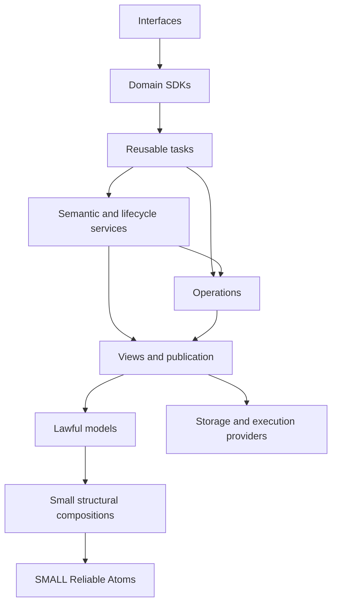

# Comprehensive graph library: working definition and architecture

8 September 2026 · Working definition 1.2 · Inquiry `graph-library-envelope-2026-09-08`, revision 5

**Status:** this is the working requirements and architecture baseline requested by Jim. Its requirements govern the proposed library. It is not an implementation, dependency adoption, OCE repository ratification or production-readiness claim. Implementation acceptance remains unexecuted. Jim’s subsequent clarification on minimising both atom-internal and ensemble entropy is incorporated in §3.2.

A comprehensive graph library must let consumers construct, inspect, compute over, change, reference and exchange a broad family of graphs and related structures while preserving each operation’s declared meaning. It must be built from **SMALL Reliable Atoms**, with several genuine composition layers between those atoms and complete developer or domain capabilities.

The [governing development policy](algorithms-and-data-structures-governance-2026-09-08.md) selects our own authored graph and non-graph algorithms, data structures and compositions, informed by openly licensed references.

The architectural unit is a **bounded contract with an accountable owner and evidence**, composed with other such contracts. The library has a common vocabulary and interoperable capabilities. It has several lawful models and execution profiles, each able to use an appropriate representation.

Jim’s knowledge that OCE needs broad graph support establishes that requirement. Demonstrated workloads will guide implementation choices and sequencing. They do not determine whether this scope is legitimate. **RDF and addressable relationships and statements about relationships are mandatory.** Relationship identity, statement content and assertion identity remain distinct throughout.

The domain-independent [Reliable Atoms and composition architecture](reliable-atoms-and-composition-architecture-2026-09-08.md) defines the general atom, composition, comprehensive testing/mutation-testing/documentation and complexity requirements. This graph architecture applies those principles to its specific model and capability envelope.

The companion [capability contracts](graph-library-capability-contracts-2026-09-08.md) define the required model and operation envelope. The [challenge and delivery record](graph-library-review-and-delivery-2026-09-08.md) records evidence, alternatives, expert findings, dispositions and implementation proof work. This document owns the architecture; the catalogue owns capability coverage; the review record owns inquiry history. The [graph worked examples](graph-library-worked-examples-2026-09-08.md) now provide concrete construction, rejection, identity and disclosure traces. The [general worked examples](reliable-atoms-worked-examples-2026-09-08.md) cover atom laws and composition before mutation. These two example documents own their illustrative profiles; the catalogue remains authoritative for comprehensive coverage. The catalogue, requirements register, delivery record and shared vocabulary form part of this coordinated baseline.

## 1. Binding design rules

“MUST” states a requirement. “Working choice” fixes the baseline for subsequent design work while identifying what evidence could change it. “Candidate” identifies an unqualified implementation possibility. A missing implementation is recorded as missing; it never changes a MUST into an optional ambition.

| ID  | Binding rule                                                                                                      | Consequence for design                                                                                                                                                                                 |
| --- | ----------------------------------------------------------------------------------------------------------------- | ------------------------------------------------------------------------------------------------------------------------------------------------------------------------------------------------------ |
| G01 | Preserve the distinctions required by the selected model and consumer operation.                                  | No implicit collapse of identities, roles, time, scope, multiplicity or epistemic status.                                                                                                              |
| G02 | Apply strict Practice values at every layer and seam.                                                             | No type erasure, silent fallback, hidden partial success, weakened gate or unrecorded semantic repair to make an implementation fit.                                                                   |
| G03 | Minimise atom responsibility and incidental complexity jointly with ensemble complexity, within strict contracts. | Split only when internal simplification is not outweighed by duplicated obligations, coordination and composition cost. A coherent multi-index store remains a composition, regardless of facade size. |
| G04 | Assign every invariant to one authoritative contract; compose the evidence needed across boundaries.              | Atom correctness does not establish store consistency, algorithm correctness or domain validity.                                                                                                       |
| G05 | Require narrow capabilities according to an operation’s actual premises.                                          | Successor access need not imply whole-graph enumeration, mutation, RDF or presentation.                                                                                                                |
| G06 | Preserve alternative lawful representations and specialised model contracts.                                      | No universal physical graph object, universal equality, or mandatory canonical store.                                                                                                                  |
| G07 | Make support and limitations inspectable by model × operation × execution profile.                                | An unavailable operation produces an explicit unsupported outcome before work where possible. Unimplemented required coverage remains a tracked gap.                                                   |
| G08 | Make composition usable without private engine access or loss of required information.                            | Reusable tasks expose meaningful operations, typed outcomes and inspectable explanations.                                                                                                              |
| G09 | Protect long-term change through public boundaries, explicit dependencies and versioned contracts.                | No speculative package explosion; no compatibility shim that preserves an obsolete design.                                                                                                             |
| G10 | Distinguish specification, proof, measurement and adoption.                                                       | A declaration, brand, source inspection or passing example cannot stand in for broader assurance.                                                                                                      |

These rules are side constraints on design and delivery. Schedule pressure and existing package convenience do not relax them. Scope can be sequenced into smaller complete increments; the quality threshold stays constant.

## 2. What a capability contract contains

Every public capability MUST specify the following, at a level proportionate to its responsibility:

- Its accountable contract owner (a stable team/role), separate from invariant-owning software and write authority; explicit, versioned ownership transfer preserves evidence attribution.
- Its objects, identity/equality model, legal inputs and laws.
- The operations it promises, their premises, useful outputs and all material failure or incomplete outcomes.
- Ownership, mutation and lifetime. Stateful capabilities include consistency and revision behaviour.
- Required lower capabilities, their assumptions and the invariant this composition owns.
- Relevant resource bounds, order/determinism and supported runtime profiles.
- The evidence needed to qualify the exact implementation and its public API.

A graph model additionally declares arity, orientation, multiplicity, membership, properties, legal references and applicable constraints. An algorithm declares its model and algebraic premises. A conversion declares what it preserves. An external service declares what it can know about completion and commit outcomes.

These are contracts, not a universal metadata object attached to every return value. A pure equality atom can return a boolean. A partial remote query needs richer outcomes because its caller must distinguish incomplete execution from a complete negative answer.

The catalogue’s §1 is the single route to the canonical **support-entry schema and coverage register**. Architecture and implementations reference that contract; they do not redefine its fields. Support binds a capability to its exact model, operation and execution premises, so a parent capability label alone cannot establish completion.

## 3. The composition architecture

There are six reusable composition levels above the lowest atoms before domain and interface composition. The levels describe dependency responsibilities, not a required number of packages, teams or runtime hops.

| Level                                           | Responsibility and examples                                                                                                                                   | Invariant owned here                                                                                                                             |
| ----------------------------------------------- | ------------------------------------------------------------------------------------------------------------------------------------------------------------- | ------------------------------------------------------------------------------------------------------------------------------------------------ |
| L0 — SMALL Reliable Atoms                       | One checked value, one equality/encoding contract, one bounded collection or algorithmic mechanism.                                                           | The atom’s exact local laws and failure contract.                                                                                                |
| L1 — Small structural compositions              | Scoped registries, occurrence collections, forward/reverse association indexes, dictionaries, property tables.                                                | Consistency within one structure and its identity/equality domain.                                                                               |
| L2 — Lawful base model compositions             | Binary graphs, incidence models, RDF graphs/datasets, ports and complexes; basic builders and structural change validation.                                   | Legal membership/incidence and the base model’s structural invariants. Stronger refinements are issued by the composition that establishes them. |
| L3 — Access, views and publication compositions | Immutable snapshots, local stores, external readers, selectors, projection views, indexes and coherent publication.                                           | The observable view, its ownership, revision, coverage and consistency guarantees.                                                               |
| L4 — Operation compositions                     | Traversal, paths, components, matching, query operators, transformations, numerical operators, validation, constrained-model refinements and rewrite kernels. | Operation correctness under the exact supplied capabilities and premises; stronger validated properties where this composition establishes them. |
| L5 — Semantic and lifecycle compositions        | Assertion/evidence services, query planning, rule evaluation, temporal history, incremental materialisation, durable execution and exchange pipelines.        | Cross-operation semantics: support, time, recovery, provenance, coherence and explanation.                                                       |
| L6 — Reusable developer capabilities            | Explained exploration, dependency/impact analysis, knowledge ingestion, historical comparison, analytics and graph editing.                                   | A complete reusable task with meaningful results and diagnostic outcomes.                                                                        |
| L7 — Domain compositions                        | OCE curriculum/estate SDKs; CV and personal knowledge SDKs; other consumers.                                                                                  | Domain meaning, authority, policy and the validity of domain conclusions.                                                                        |
| L8 — Interface compositions                     | MCP, HTTP, CLI, search, visual editors and accessible exports.                                                                                                | Transport/presentation fidelity, interaction and disclosure.                                                                                     |

Dependency arrows point toward supplied lower capabilities. Same-level composition is allowed when the dependency remains acyclic and responsibility is clear. A level may use any lower level; trivial wrappers are unnecessary. Record/value schemas for assertions can live at L1/L2 while support-aware assertion services live at L5. Transactional storage providers implement lower declared ports; their physical implementation does not reverse the logical dependency direction.

The diagram shows selected dependencies. Providers are implementations of ports defined by the consuming contracts. This is a dependency architecture, not a mandatory sequence in which all data must be copied through every level.

**Working choice:** lawful model values and narrow computational capabilities form the stable centre. Incidence is shared mathematical vocabulary; it does not require universal incidence storage. This combines rich native models with representation-independent operation contracts. [Boost graph concepts](https://www.boost.org/doc/libs/latest/libs/graph/doc/html/graph/concepts/graph_concepts.html) provide an established example of algorithms expressing distinct access requirements.

### 3.1 Concrete atom boundaries

The following are candidate boundaries to qualify, not an assertion that implementations already meet Reliable Atom standards. Each row is substantially smaller than a graph store.

| Candidate atom                                                 | One responsibility                                                                              | Decisive law or failure observation                                                                                  |
| -------------------------------------------------------------- | ----------------------------------------------------------------------------------------------- | -------------------------------------------------------------------------------------------------------------------- |
| Scoped-reference equality                                      | Compare references under one exact kind/scope/key/generation scheme.                            | Distinct kinds, scopes or generations never compare equal; equality is an equivalence relation.                      |
| Scoped-reference codec                                         | Encode/decode that scheme without ambiguity.                                                    | Decode(encode(x)) = x; malformed inputs fail; delimiter collisions cannot alias references.                          |
| Bounded nonnegative integer                                    | Construct a numeric value in a declared range.                                                  | Reject negative, fractional, non-finite and out-of-range values without coercion.                                    |
| Checked cost addition                                          | Add values in one declared numeric cost domain.                                                 | Overflow and forbidden values return defined failure; no silent infinity or precision claim.                         |
| Half-open interval intersection                                | Intersect two validated intervals of one time/order domain.                                     | Touching endpoints yield an empty intersection; open/unbounded domains use separate contracts.                       |
| Revision comparison                                            | Compare tokens within one revision scheme.                                                      | A foreign lineage or incomparable revision cannot become an ordinary earlier/later answer.                           |
| FIFO queue                                                     | Maintain insertion order under a bounded API and ownership contract.                            | Global enqueue/dequeue sequence law, explicit empty outcome and release of removed references.                       |
| [Stable priority queue](oce-queue-reliable-atom-2026-09-08.md) | Retain occurrences in numeric priority order, preserving arrival order within equal priorities. | A later lower-priority-number occurrence precedes an earlier higher-number occurrence; equal priorities remain FIFO. |
| Collision-safe finite map                                      | Maintain a key/value association under one equality/hash contract.                              | Hash collision never equates unequal keys; replacement does not change membership count.                             |
| Single association operation                                   | Apply one checked association change to a declared small relation value.                        | Duplicate/removal/missing semantics are fixed; no unrelated model policy.                                            |
| One statement-term equality                                    | Compare immutable finite terms under one defined syntactic model.                               | Equality preserves lexical/type/scope distinctions; it makes no claim of logical equivalence.                        |

The collection candidates still require a small API, explicit laws and bounded implementation/assurance surface. Their inclusion does not license a “collections atom” containing every data structure. An atom can use other qualified mechanisms under its declared dependency budget. A line-count target alone does not establish a sound boundary.

A heap, disjoint-set structure, sparse vector operator or particular algorithm can qualify as another bounded atom. A complete sparse matrix engine, term store, graph registry or rules engine must be decomposed and qualified at its real responsibilities. Stdlib and third-party implementations have explicit trust/evidence boundaries; wrapping them does not transmute them into owned Reliable Atoms.

### 3.2 Granularity applied to graph construction

The [general architecture §5](reliable-atoms-and-composition-architecture-2026-09-08.md#5-complexity-at-every-scale) owns the two-scale complexity and feedback contract, including the meaning and limits of “entropy”. Apply it to complete graph journeys, preserving required models, semantic distinctions and assurance. There is no graph-specific scalar complexity score or fixed atom size.

| Graph boundary                                       | Internal simplification to examine                                             | Ensemble obligation that must remain owned                                                                                         |
| ---------------------------------------------------- | ------------------------------------------------------------------------------ | ---------------------------------------------------------------------------------------------------------------------------------- |
| Vertex/relationship registries and adjacency indexes | Keep each underlying association mechanism narrow.                             | One publication composition preserves membership and forward/reverse consistency; callers do not sequence and repair indexes.      |
| Equality, encoding and identity                      | Give each equality/capture domain an exact law.                                | Conversions preserve kind, scope, occurrence and lifetime; fewer key types must not merge different identities.                    |
| Constraint checking and model refinement             | Reuse one lower checker with sufficient input premises.                        | A higher invariant owner issues the exact-candidate witness and coordinates publication; validation does not reverse dependencies. |
| Assertions, topology and history                     | Keep stored content and independently governed assertion occurrences separate. | One lifecycle composition owns support/retraction propagation and revision-coherent projections.                                   |
| Snapshot access and disclosure                       | Keep immutable data independent of a particular caller.                        | The access composition owns policy evaluation and custody at every managed disclosure, including derived results.                  |

For each material boundary change, use the general feedback contract on a named graph journey. The graph examples give concrete before/after obligations: invalid candidate edits cannot publish, repeated assertions cannot collapse into one occurrence, and revocation changes managed disclosure without rewriting immutable historical data. These are expected design outcomes; measuring implementation/change cost remains part of qualification and subsequent maintenance.

### 3.3 Worked construction chains

**Identified binary graph:** scoped reference equality and a finite map → vertex/relationship registries and endpoint associations → a binary model constructor validating V, E, source and target → a snapshot/store composition coordinating membership and adjacency indexes → edge-bearing traversal and SCC operations → dependency/impact analysis → a domain SDK’s interpretation of dependencies.

The L2 constructor establishes that every required endpoint is a member. L3 owns atomic publication of topology and indexes. L4 owns traversal and SCC correctness for the supplied snapshot. L7 decides whether a structural dependency is authoritative and what action it permits. No one of those guarantees follows from the others automatically.

**Constrained update:** construct a lawful binary candidate first; run a checker on that candidate under its lower access premises; issue an acyclicity refinement bound to the candidate; publish through a lower revision-checking publication capability owned by the constrained-update composition. The checker must not require a DAG witness before it can determine whether the candidate is a DAG. The validating composition sits above its checker and publication dependencies. A bounded checker can occupy a lower level where its actual responsibility qualifies it; a larger checker remains a composition. Neither an L2 constructor calling L4 traversal nor a second duplicate checker is required. See [GEX01](graph-library-worked-examples-2026-09-08.md#gex01--a-constrained-graph-update) for the worked transaction and cycle witness.

**Addressable statements:** scoped references, term equality and occurrence collections → typed relationship/content/assertion registries → legal reference and membership model → revision-coherent reference resolution and reverse-reference views → target-aware matching and traversal → assertion/retraction/evidence service → an explained knowledge query → OCE or another domain’s evidence policy.

The same immutable content can be referenced by several assertions and by an unasserted description. Identity is preserved at every intermediate composition. Assertions about assertions follow the same reference contract; they do not require a universal recursively nested object tree.

**Conjunctive dependencies:** role/position values and occurrence collections → incidence indexes → a directed hypergraph profile → active-tail and enabled-head access → conjunctive reachability → multi-input dependency analysis. A binary projection is usable only for an operation whose semantics the projection preserves.

### 3.4 Type and runtime discipline

Known identities, schemas, discriminants and literal distinctions MUST survive public APIs and composition. Do not erase them into untyped bags and reconstruct them downstream. Use authoritative model schemas once; generate/import equivalents where a source of truth exists. OCE API generation rules apply to OCE API data, not as an invented OpenAPI authority for mathematical objects.

Every reference form has a checked trust transition. Serialised references are decoded with kind, scope, codec/model version and lifetime validation, then resolved against the intended authority. In-process handles use issuer/scope identity or checked membership; a same-shaped foreign handle is insufficient. Only the responsible constructor/resolver issues trusted references and validated views.

A coherent read-view factory supplies compatible access capabilities under one model, equality domain, selection scope and revision/consistency contract. Independently lawful accessors cannot be arbitrarily mixed and then labelled a snapshot. Dynamic refinements use either a checking operation that returns its outcome/witness, or an owner-issued validated view bound to the exact revision. A consumer-declared structural interface cannot manufacture the refinement.

Compile-time contracts reject category mistakes available to the type system. Checked construction validates foreign or dynamic values and establishes runtime premises. An opaque brand cannot establish acyclicity, referential integrity, snapshot validity, authorisation or a caller-supplied comparator’s laws. A validation witness MUST name the object revision and premises it covers; mutation invalidates it unless the update preserves those premises by construction.

Arbitrary caller code is an explicit trust boundary. Equality, hash, ordering, algebra, property readers and source callbacks can violate laws, mutate, throw or fail to terminate. Offer qualified built-in contracts where possible. Custom extensions declare their obligations and evidence; tests give bounded evidence, not proof of every possible callback. Exceptions from extension code have a declared boundary outcome, including the validity of retained state. Normalising a throw does not restore an in-place engine. The owning composition establishes the callback premises, contains and discards unpublished work, proves restoration, or enforces explicit invalidation before any further ordinary use. External effects outside its custody are not implicitly rolled back. Internal defects remain distinguishable from ordinary domain failures. The general failure-validity contract applies; the numeric stable priority queue itself exposes no comparator callback.

Readonly TypeScript annotations alone do not establish payload immutability. Each model chooses immutable values, validated copies, explicit shared ownership or controlled mutation. Mutation relevant to assured behaviour must pass through the owning update contract; input aliases, returned payloads and iterator references cannot bypass validation, revision advancement or invalidation. Borrowed mutable data without this control is outside the immutable-snapshot profile. A retained snapshot’s promise includes the payload properties its operations actually observe.

Every fallible owned public boundary uses a stable discriminated outcome contract, using the adopting Practice’s canonical `Result<T, E>` implementation, preserving relevant causes. For an OCE TypeScript implementation this is `Result<T, E>` from `@oaknational/result`, as required by the [Result rule](https://github.com/EngraphCode/open-curriculum-ecosystem/blob/270b8ec6fb82dc6881c10ca101cb8d3c7a242d6e/.agent/rules/use-result-pattern.md) and [ADR-088](https://github.com/EngraphCode/open-curriculum-ecosystem/blob/270b8ec6fb82dc6881c10ca101cb8d3c7a242d6e/docs/architecture/architectural-decisions/088-result-pattern-for-error-handling.md). Reuse that type rather than inventing a duplicate result union. Language or protocol boundaries map it explicitly. Each operation admits only meaningful failure variants: malformed/precondition/unsupported, conflict, resource/cancellation, dependency/source failure and indeterminate commit where applicable. Imported synchronous throws, promise rejections and mid-iteration failures are normalised at their owning boundary. Lazy/async streams expose an explicit terminal outcome and prefix-validity rules. Unexpected defects remain identifiable as defects; they are never converted into plausible successful domain values.

## 4. Identity, addressability and assertion semantics

The following requirements are part of every relevant model, view and conversion contract.

| ID  | Required distinction and behaviour                                                                                                                                                                                                                                                                                                                                     |
| --- | ---------------------------------------------------------------------------------------------------------------------------------------------------------------------------------------------------------------------------------------------------------------------------------------------------------------------------------------------------------------------- |
| I01 | Entity, relation type, relationship instance, statement content, assertion record/act, source occurrence, graph/context membership and derived artefact have explicitly separate identity domains. Their mappings may be many-to-many.                                                                                                                                 |
| I02 | A reference identifies its legal target kind and scope, and defines revision/generation/lifetime semantics. Durable logical IDs and ephemeral engine handles have a checked mapping.                                                                                                                                                                                   |
| I03 | A relationship, content or assertion can be the target of further statements. Construct, resolve, inspect, query and traverse those references, including statements about such statements. Scalar annotations without reference semantics are insufficient.                                                                                                           |
| I04 | Quoting, referring to, describing, denying or disputing content does not assert it. Assertion/derivation status and the meaning of support/challenge are explicit.                                                                                                                                                                                                     |
| I05 | Equal content can have distinct assertions, including repeated assertions from one source. Equal-endpoint relationships remain distinct where the model permits parallel relationships. Occurrence identity cannot be reconstructed from deduplicated content alone.                                                                                                   |
| I06 | Content used for identity is immutable under its equality contract. Corrections create new content or a new explicitly addressed revision. Relationship endpoint changes follow a declared update/new-generation rule. Existing references never silently target a different object or meaning.                                                                        |
| I07 | Reference resolution distinguishes resolved, unresolved/unknown, unavailable and known-retired targets where the caller is entitled to that distinction. It does not disclose a hidden target’s existence. Incoming-reference queries state their scope and completeness.                                                                                              |
| I08 | Structural content equality, graph isomorphism, canonical byte equality, entity identity and logical equivalence are different contracts. Content hashes require a named canonicalisation/equality domain and collision handling.                                                                                                                                      |
| I09 | Native edge references, reified nodes and structured references are representation alternatives only where the selected mapping preserves required identities, targets, assertion status, scope and operations.                                                                                                                                                        |
| I10 | Domain topology and descriptive/provenance topology have deliberate views. A representation node must not silently alter a domain path’s distance or meaning.                                                                                                                                                                                                          |
| I11 | Evidence items, evidence/source occurrences and evidential assessments/support assertions have explicit identities and mappings. Assertion count, occurrence count, evidence-item count and a domain-assessed independence count are distinct queries. No generic graph rule infers independence from multiplicity or makes an ungrounded support cycle into evidence. |
| I12 | Alignment assertions, derived equivalence classes, directional supersession and destructive identity merge are separate operations. Preserve persistent IDs and support so retraction can split a derived alignment. Representative selection and reference following are revision-scoped; supersession profiles requiring an order reject cycles with a witness.      |

**Working choice:** use finite immutable term structures for content profiles that define syntactic term equality. Use addressed reference graphs for potentially cyclic statements-about-statements. Nested RDF triple terms follow their selected standard’s term grammar; arbitrary cyclic object nesting is not smuggled into that grammar. Reference traversal, equality/canonicalisation and recursive query evaluation each have their own resource and termination contracts.

Retraction changes an assertion’s status under the lifecycle contract. It does not erase content, delete unrelated assertions, establish falsity, or demonstrate independent evidence. A source occurrence can mention several assertions; several occurrences can document one assertion. Any narrower mapping is a declared source convention.

Required journey **J02** in the catalogue exercises three assertions of equal content, a statement targeting exactly one, unasserted description, retraction, historical reference resolution and representation round trips.

## 5. Views, operations and transformation seams

A view MUST identify its source, selection, identity mapping, observable membership, traversal interpretation and consistency scope. A graph’s mathematical model and the capabilities available through a view are separate: a finite source may expose only local successors; a complete local materialisation may cover only a selected region.

Algorithms depend on capabilities such as vertex enumeration, membership, outgoing/incoming incidence, endpoint access, role/position access, property readers and weight operations. These capabilities MUST carry or require the premises the algorithm needs. A boolean named `isDag` is insufficient without validated scope and revision.

Useful algorithm results include witnesses appropriate to their contract: edge-bearing paths, cycle witnesses, cut partitions, matching pairs, violated constraints, source assertion mappings or derivation steps. A witness is independently checkable under stated premises when practical. It is not automatically a proof of optimality, source completeness or domain truth.

| ID  | Seam contract                                                                                                                                                                                                                                                                 |
| --- | ----------------------------------------------------------------------------------------------------------------------------------------------------------------------------------------------------------------------------------------------------------------------------- |
| X01 | Each conversion names source/target model versions, preconditions, identity mapping, preserved distinctions, intentional interpretation/loss, update behaviour and cost.                                                                                                      |
| X02 | A round trip states its equivalence: exact identity, incidence, isomorphism, dataset equality, occurrence preservation or selected query-answer preservation. An inverse is a separate promise.                                                                               |
| X03 | Lossy projections are explicit typed operations. A consumer requiring a lost distinction cannot accept that projection. General “conversion succeeded” is insufficient.                                                                                                       |
| X04 | Chained transformations compose mappings, dependencies and cumulative loss. A later step cannot restore an earlier lost distinction without additional authoritative information.                                                                                             |
| X05 | Updating a derived view yields the same declared result as rebuilding it from the same source revisions and policies. If that cannot be maintained, invalidate visibly and rebuild.                                                                                           |
| X06 | Edits through a projection require a specified partial inverse/update mapping and conflict rules. Aggregated, quotient or inferred views are not generically writable.                                                                                                        |
| X07 | Model validation and global invariants run at their owning boundary after composition. Two locally valid fragments can form an invalid whole.                                                                                                                                 |
| X08 | A conversion used for computation declares operation-specific soundness/completeness directions and witness projection/lifting. A reconstructable encoding alone does not justify transporting algorithm results. Check lifted witnesses in the source model where practical. |
| X09 | Generated structural relationships and derived facts have explicit identities, derivation status and support dependencies. Closure, inferred faces or inferred links do not become source assertions; any promotion is a separate attributable act.                           |

A structural mapping between directed multigraphs has vertex and edge maps that preserve source and target. Additional contracts distinguish a homomorphism, injection, quotient and isomorphism. For richer incidence models the mapping preserves the participant, relationship, role, order and multiplicity promised by its profile.

A traversal tree records selected discovery relationships; an induced subgraph retains every admitted relationship among the selected vertices. Query contracts identify which object they return. Incremental materialisation is checked against a complete rebuild from the same source and semantic configuration; related indexes and coverage evidence publish as one coherent generation.

The catalogue’s seam witnesses include hyperarc conjunction versus pairwise reachability; triangle boundary versus filled simplex; historical contacts versus a temporal journey; reification versus domain distance; parallel edges versus a matrix aggregate; filtered absence versus source absence; and set union versus non-monotone query/constraint results.

RDF is a required peer model with substantive construction, dataset, query, validation, exchange and addressability support. A quad’s graph position denotes context membership; it does not automatically identify an assertion. A quad set does not retain repeated equal source occurrences or a complete inventory of empty named graphs. [RDF 1.1 Concepts](https://www.w3.org/TR/rdf11-concepts/), [RDF/JS Dataset specification](https://rdf.js.org/dataset-spec/).

The selected RDF 1.2 baseline is the **7 April 2026 Candidate Recommendation Snapshot**, not a claim of final Recommendation status. Its triple terms and directional language strings require end-to-end qualification through term construction, storage, query and exchange. Triple-term occurrence alone does not assert its content. [Pinned RDF 1.2 Concepts](https://www.w3.org/TR/2026/CR-rdf12-concepts-20260407/).

## 6. State, time and execution

| ID  | Required lifecycle contract                                                                                                                                                                                                                                                                      |
| --- | ------------------------------------------------------------------------------------------------------------------------------------------------------------------------------------------------------------------------------------------------------------------------------------------------ |
| L01 | State exactly who owns topology, payloads and indexes; the lifetime of readers/iterators; and the semantics of mutation during access.                                                                                                                                                           |
| L02 | A local atomic change validates against a stated source revision and publishes one coherent new state, including authoritative indexes, or leaves the old visible state intact. The invariant owner controls publication; constituent mutators and mutable aliases are unavailable to bypass it. |
| L03 | Durable/remote execution distinguishes committed, rejected/not committed and indeterminate outcomes when the backend cannot know which occurred. Recovery uses an operation identity and reconciliation policy; retry alone does not promise exactly-once effects.                               |
| L04 | Snapshots and results name a single revision or an explicit composite/consistency token. Multiple independently changing sources cannot masquerade as one atomic snapshot.                                                                                                                       |
| L05 | Valid time, recorded time, revision order, freshness and execution deadlines are separate domains. Temporal operations state duration, waiting, boundary and correction semantics.                                                                                                               |
| L06 | Incremental indexes, inferences, aggregates and caches track every material dependency: topology, properties, schema/rules, equality/algebra, projection, source revisions and relevant access policy.                                                                                           |
| L07 | Cancellation, deadlines, resource limits, paging, backpressure and partial-source failures have defined outcomes and release owned resources. Streaming results state when they are provisional and whether later records can retract them.                                                      |
| L08 | Execution completion, source coverage, view scope, approximation and freshness remain separately observable where material. Exhausting a page or finishing a selected query does not establish global completeness.                                                                              |
| L09 | A complete negative answer requires the operation’s closed-world/coverage premises. Otherwise return unknown or a bounded negative statement whose scope is explicit.                                                                                                                            |
| L10 | Access applies to source reads, computation, derived values, caches and explanations. Redaction does not license leaking hidden entities through witnesses, counts or stale cached results.                                                                                                      |
| L11 | Retention, historical interpretability and deletion/erasure are explicit compatible policies. When retained source information becomes unavailable, report that limitation without retargeting historical references.                                                                            |
| L12 | Diagnostics and observability preserve operation/model/source/revision identity, boundary failures and materialisation cost while respecting the same disclosure contract.                                                                                                                       |
| L13 | Each bounded context has one explicit authority/write-ownership contract naming authoritative and derived state, accepted mutations, propagation, publication and reconstruction. Distributed authority requires its own coherence protocol.                                                     |

In the basic assertion composition, the assertion ledger owns assertion identity/status and accepts retraction. A derived domain-topology view owns its projection/index state and reports the ledger revision it reflects. Queries join topology and support only at their declared coherent cut. An edit through that view translates to the ledger’s authoritative operation or is rejected. RDF-authoritative and other domain-authoritative arrangements remain available through separately qualified ownership contracts; simultaneous unconstrained writers are not implied.

Retraction, supersession, logical deletion, payload redaction and physical purge are distinct operations. Current disclosure policy applies to library-controlled retained snapshots, caches, explanations and diagnostics according to the declared history policy. A disclosed payload copy outside the library's control is not a revocable handle. Preserve minimal retired identity/history only where retention permits it. When policy requires removing that information too, report the authorised unavailable outcome; never fabricate historical interpretability or retarget an identifier.

For an access-controlled snapshot profile, name the immutable **data revision**, applicable **policy revision**, actor/scope and **custody boundary** separately. A managed read handle retains data identity while the access composition mediates each subsequent disclosure under the specified policy. Cached results and witnesses remain behind that same boundary. Operations declare their disclosure/authorisation linearisation point: a policy change ordered before disclosure must be observed, or the operation cannot claim this profile. An in-flight stream defines that point for every released chunk and its terminal result. This is an ordering contract enforced by the chosen owner/provider protocol, never an assumption that revocation races are unlikely.

Already disclosed values retain their value semantics; future managed access may be denied. The profile must neither claim to revoke independent consumer copies nor leak hidden existence through a special denial, count or witness. Pure local snapshots without an access-control responsibility need no ambient policy service. [GEX03](graph-library-worked-examples-2026-09-08.md#gex03--immutable-data-current-policy-and-custody) works the managed-history case with distinct data/policy revisions and a retained consumer copy.

The basic local profile uses coherent immutable snapshots and checked transactional publication. Controlled mutable builders may assemble a new value privately. External profiles expose their actual capabilities and consistency limits; they cannot claim the local profile by matching method names.

A semantic bound such as “depth ≤ 3” can define a fully completed query over that scope. An interrupted attempt to compute the depth-3 result is incomplete. Approximation is another axis: a completed approximate algorithm has completed its specified computation while its result carries the stated approximation guarantee.

Performance contracts account for vertices, edges, incidence occurrences, degree skew, payload size, retained history, joins/output cardinality and access costs. Time and space claims include equality/comparator cost where nonconstant. Remote latency, transfer, construction and invalidation costs must be measured separately from a local algorithm’s asymptotic bound.

## 7. Reference-informed implementation, packages and evolution

**Working choice:** organise modules around invariant ownership and change cohesion. Package admission also considers runtime/platform requirements, dependency budget, release cadence, replacement responsibility and consumer use. Atom modules default to zero runtime dependencies, with any nonzero budget explicit and justified as allowed by the Reliable Atoms programme. Promote independent packages when a small public contract, dependency budget and release responsibility justify them. One atom per package and one package per numbered level are both unjustified defaults. Importing a small atom must not eagerly load unrelated RDF, rendering, numerical or platform engines. Packed-form import/type-resolution checks cover every public export and claimed runtime.

Consumers use the narrowest useful public boundary. Domain SDKs supply domain meanings; transport adapters depend on them. Reusable graph operations do not import OCE curriculum schemas, application policy, process environment or rendering state. Execution providers and extension functions enter through declared dependencies. Model-specific functionality remains available through its own module rather than being erased to a least-common-denominator facade.

Our graph algorithms, data structures and reusable compositions are authored against their exact contracts. Openly licensed implementations, documentation and tests provide reference knowledge about mechanisms, representations, boundaries and failure cases. Each reference has an explicit applicability and provenance record. Platform and effect providers remain separately declared capabilities under their own qualified contracts; the implementing boundary makes the owned algorithmic responsibility visible.

The existing package research supplies dated reference evidence. Mechanism, representation, storage and module choices are resolved through the required semantics and discriminating execution evidence. Their evaluation counts research, implementation, integration, conversions, assurance, diagnosis and long-term change cost. The [source review](foundations-source-review-2026-09-08.md) identifies the useful material and its evidence limits.

An extension publishes a stable namespaced profile identity/version, legal-object constructors/validators, equality domain, capabilities and operation premises, lifecycle/ownership, transformation records and conformance suite. New models must coexist without editing foundational atoms or a closed universal union of every graph type. Same-shaped interfaces do not establish semantic compatibility; composition checks profile identity and necessary witnesses. Incompatible versions or semantics produce explicit incompatibility, including conjunctive versus pairwise hypergraph access.

Versioning covers semantic contracts, formats, schemas, algebra, rule profiles and public APIs. A changed equality or projection rule can change answers even if TypeScript signatures remain identical. Release gates must catch that distinction. Replacement uses explicit migration with preservation evidence and a clean destination contract; it does not preserve obsolete semantics through compatibility layers.

## 8. Assurance and implementation acceptance

| ID  | Acceptance obligation                                                                                                                                                                                                                                                            |
| --- | -------------------------------------------------------------------------------------------------------------------------------------------------------------------------------------------------------------------------------------------------------------------------------- |
| A01 | Each atom has an exact public contract, positive/negative examples, misuse analysis, type/API evidence, meaningful law tests and the relevant runtime/package checks.                                                                                                            |
| A02 | Each composition proves its new obligations: ownership, invariant preservation, failure atomicity, post-failure validity, revision coherence, custody and interpretation of lower outcomes.                                                                                      |
| A03 | Algorithms use decisive counterexamples, bounded independent oracles and appropriate property/metamorphic checks. Test an invariant rather than echoing implementation steps.                                                                                                    |
| A04 | Model/format implementations qualify complete paths and legal-position rules against named standards/profile versions. Parser success alone is insufficient.                                                                                                                     |
| A05 | Named end-to-end journeys in the catalogue pass on the exact composition, including failure/retraction/history cases, before that capability is claimed supported.                                                                                                               |
| A06 | Published resource/complexity claims have the evidence and workload dimensions they require. No unmeasured latency, scalability or work-saving claims.                                                                                                                           |
| A07 | An independent consumer uses the packaged public surface for each reusable task without private imports, casts or duplicated invariant logic. This tests the API boundary; it does not revalidate owner-known demand.                                                            |
| A08 | Dependency architecture, public API changes, documentation accuracy and all applicable Practice gates are enforced for every delivery increment. Boundary changes include the two-scale complexity argument in §3.2. All material expert findings receive a visible disposition. |

For OCE delivery, the [Practice Index](https://github.com/EngraphCode/open-curriculum-ecosystem/blob/270b8ec6fb82dc6881c10ca101cb8d3c7a242d6e/.agent/practice-index.md) at the pinned source revision routes to authoritative directives, rules and gates. Actual implementation must re-ground the current adopted revision and record exact applicable commands/results; this report does not freeze an old rule set against later owner direction.

The implementation programme begins with discriminating vertical journeys, using them to qualify the smallest necessary atom and intermediate contracts. The worked examples add explicit future checks for cycle rejection, stale-witness/publication conflict, pre-mutation scoring failure, assertion-specific retraction and policy change before disclosure. It also carries the entire capability catalogue as required scope. A successful binary journey cannot close RDF, hypergraph, temporal, numerical or specialised-model requirements.

Implementations may support subsets during construction. Every delivered subset must be truthful and complete for its declared contract. **The comprehensive-library completion claim requires coverage of the catalogue’s required minimums and the applicable cross-cutting contracts.** Unsupported reporting is honest progress reporting, not completion.

The [delivery record](graph-library-review-and-delivery-2026-09-08.md) specifies acceptance work and reopening conditions. This session establishes and critiques the working definition. It does not report these implementation gates as passed.

The current baseline coordinates the governing implementation policy, graph catalogue, requirement register, shared vocabulary and worked examples. Dated source observations and broader cross-domain findings are recorded in the source review. The acceptance obligations above govern every new authored implementation and composition.
