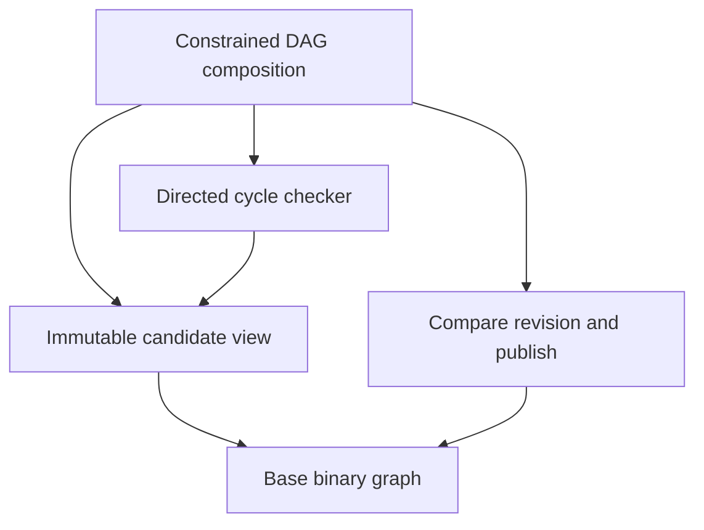

# Graph library: worked composition examples

8 September 2026 · revision 2 · design examples · status: provisional

The [governing development policy](algorithms-and-data-structures-governance-2026-09-08.md) governs reference-informed authorship and independent qualification for these examples. These examples make invariant ownership, composition and failure observable. The governing requirements remain in the [graph architecture](comprehensive-graph-library-capability-architecture-2026-09-08.md) and the [general Reliable Atoms architecture](reliable-atoms-and-composition-architecture-2026-09-08.md). The [queue specification](oce-queue-reliable-atom-2026-09-08.md) owns its particular ordering mechanism; this document does not enlarge that atom with graph policy.

Names below describe proposed operations and typed outcomes, not implemented APIs. In OCE, their eventual spelling must use the canonical Result contract. Traces are design deductions under explicit assumptions. No runtime test, mutation campaign, benchmark, packaged-consumer check or complete standards-conformance suite was executed. Each example states the evidence still needed.

## GEX01 — A constrained graph update

**Assumptions and owned invariant.** This local profile has finite, directed, identified binary graphs, immutable owned endpoints, a complete candidate read view and one publication authority. Parallel edges are admitted; self-loops count as cycles. `D40` identifies one immutable committed graph in lineage `G`. Its vertices are `{A,B,C}` and its edges are `eAB: A→B` and `eBC: B→C`. A qualified prior validation establishes acyclicity at `D40`; the example does not assume that every legal binary graph is a DAG.

The constrained graph composition owns: every state it publishes is acyclic. Base L2 construction owns legal membership and incidence. It can therefore construct a cyclic candidate without violating its contract. The higher constrained composition owns validation, issuance of a revision-bound DAG view, and exclusive access to its publication authority.

Arrows mean dependency on a public contract. For this decomposition, the base model is L2, read/publication facilities are L3, the checker is an L4 operation and the constrained owner is higher. A narrower checking mechanism could qualify lower if its actual dependencies and contract justify that placement. Responsibility determines the node's placement; the word “model” does not force every constrained model into L2. Neither the L2 base nor the publication facility calls an upper general traversal service. There is no L2→L4→L2 dependency cycle.

**The checking seam.** `checkDirectedCycle(candidateView)` accepts any finite lawful directed candidate with complete vertex/outgoing-incidence access under one equality domain and immutable candidate token. It does **not** require an already-issued DAG witness. It returns either an edge-bearing cycle, or an acyclic finding naming the exact candidate and coverage premises; interruption or failed access returns an incomplete/failure outcome. Exhaustion of a partial successor source cannot establish acyclicity.

This is one cycle-checking responsibility. It can privately use visited-state and a worklist under their contracts; that does not create a second public general traversal library below L4. A general exploration operation elsewhere composes appropriate mechanisms for its broader result contract. Checker evidence remains read-only; callers cannot attach an arbitrary “acyclic” boolean or mutate the examined value.

**Candidate and publication trace.** Candidate tokens are private immutable version identities, distinct from committed revision numbers.

| Step | Operation and candidate                                                                                                      | Observable result and committed state                                                                                                                                |
| ---- | ---------------------------------------------------------------------------------------------------------------------------- | -------------------------------------------------------------------------------------------------------------------------------------------------------------------- |
| 1    | Prepare `Cbad = D40 + eCA: C→A`.                                                                                             | Base incidence validation succeeds. `D40` remains current.                                                                                                           |
| 2    | Check `Cbad`.                                                                                                                | Reject with cycle `A —eAB→ B —eBC→ C —eCA→ A`, bound to `Cbad`. No DAG view is issued and no publication is attempted.                                               |
| 3    | Prepare and check `Cgood = D40 + eAC: A→C`.                                                                                  | Complete checking finds no directed cycle. The constrained owner records evidence for `Cgood` and its premises. Current is still `D40`.                              |
| 4    | Owner submits the validated immutable value/index bundle through `compareRevisionAndPublish(expected=D40, candidate=Cgood)`. | If current equals `D40`, publish one coherent `D41` and return committed. No partially updated adjacency index is visible.                                           |
| 5    | Issue `DagReadView(D41)`.                                                                                                    | The owner binds the existing finding to `D41` through the publication receipt identifying `Cgood` as the exact published value. Readers have no constituent mutator. |

The accepted graph contains both the two-edge route `A→B→C` and direct edge `A→C`. Adding that direct edge changes shortest distance but does not close a directed cycle. The rejection witness contains actual edge identities, so it remains meaningful with parallel edges. Reversing every edge preserves cycle existence, so a boolean-only check would not expose that fault. Checking the returned witness against each source edge's actual endpoints rejects a witness traversed in the wrong direction.

**Stale revision.** Another client previously prepared and validated `Cstale = D40 − eBC`. After step 4 it attempts publication with expected `D40`. The publication composition returns `conflict(expected=D40, actual=D41)` and leaves `D41` intact. The candidate's acyclicity finding can still be true, but does not authorise overwriting a newer state. The caller may request a new removal candidate against `D41`; the owner reconstructs and validates that candidate before a fresh compare-and-publish attempt. A silent rebase is outside this profile.

The publication facility owns revision comparison, coherent installation and local failure atomicity. It does not infer DAG policy. The constrained composition controls who can invoke its write port and which candidate reaches it. A public alias to the unconstrained mutator would break invariant ownership even if every normal editor called the validator. Internal errors or rejected publication leave the old visible state intact; a remote provider would require its own indeterminate-commit contract.

**Qualification and complexity.** Still required: independent bounded cycle oracles, self-loop and parallel-edge cases, incomplete-access rejection, failure-state observations, forged/stale evidence misuse checks, publication races and packaged consumption without private mutators. Mutation/fault evidence must catch omitted checking, wrong edge orientation, evidence reused for another candidate, omitted revision comparison and partial index publication. General architecture R02–R10/C01–C08 and graph X07/L02/A02 govern the full obligations.

For a complete adjacency representation, a conventional cycle checker has a candidate analytical bound of `O(V+E)` work and `O(V)` auxiliary state; construction, evidence retention and publication costs remain separately specified. The composition adds revision/evidence coordination once and removes it from every editor. Reopen this boundary if consumers must coordinate that protocol themselves, or if measured candidate rebuilding makes a separately proved incremental algorithm worthwhile. No latency saving is claimed.

## GEX02 — Equal content, distinct assertions and one exact target

**Assumptions and owned invariant.** Ledger `L10` is authoritative for assertion identity and lifecycle. Content uses immutable syntactic equality in profile `terms-v1`; an assertion is an attributable act with its own stable scoped ID. Retained historical ledger revisions are available to this authorised reader. Here one current domain edge is projected per content with at least one active asserting record; that aggregation is this view's declared policy, not a universal graph rule.

Let `c1 = (Alice, teaches, Biology)`. Three different assertion records point to that same content:

| Assertion | Content | Documented occurrence         | Evidence mapping | Status at L10 |
| --------- | ------- | ----------------------------- | ---------------- | ------------- |
| `a1`      | `c1`    | `o1`, source report R         | `evidence-R`     | Active        |
| `a2`      | `c1`    | `o2`, repeated statement in R | `evidence-R`     | Active        |
| `a3`      | `c1`    | `o3`, source report S         | `evidence-S`     | Active        |

Create `c2 = (ref(assertion,a2), disputedBy, Reviewer)` and assert it with record `a4`. Its subject reference targets **exactly `a2`**. It does not target `c1`, all assertions of `c1`, source R or the projected teaching edge. Separately register description `d1` whose target is `ref(content,c1)` and whose display text is “Proposed teaching assignment”; it has no assertion act. Referring to this content does not add support or imply truth.

The assertion service owns lifecycle, targeting and support interpretation. Registries own checked reference kinds and uniqueness; coherent views join status, content and source mappings at one ledger revision. A query cannot join a current status table with historical content membership and describe the mixture as `L10`.

**Operations and transitions.** At `L10`, `activeAssertions(c1)` returns `{a1,a2,a3}`. `incomingReferences(ref(assertion,a2))` includes the reference in `c2`, with its declared description/assertion scope. An analogous query for `a1` does not include it. Resolving `d1` returns a description of `c1`, not a fourth active assertion.

| Transition or query                        | Required observation                                                                                                                   |
| ------------------------------------------ | -------------------------------------------------------------------------------------------------------------------------------------- |
| `retract(a2, expected=L10)` commits `L11`. | Only `a2` becomes retracted. `c1`, `a1`, `a3`, `a4` and `d1` retain their identities.                                                  |
| Current `activeAssertions(c1)` at `L11`.   | `{a1,a3}`; active count is 2. The projected teaching edge remains present.                                                             |
| Current resolve of `ref(assertion,a2)`.    | Resolve the retained record with retracted status. The reference never retargets `a1`.                                                 |
| Historical resolve at `L10`.               | The same `a2` was active at that revision. Its later retraction is not rewritten into the historical answer.                           |
| Inspect `a4` at `L11`.                     | Its content still targets `a2`. The meaning or relevance of disputing a retracted act is domain policy, not implicit cascade deletion. |

If `a1` and `a3` are also retracted, a later current projection removes the teaching edge because its active support set becomes empty. Retained `c1` and historical edge interpretation remain available under retention policy. Zero active assertions means no current support under this ledger/view rule. It neither proves `c1` false nor erases its earlier assertion. Denial would require a separately defined content and assertion act.

**Counts and evidence.** At `L10`, `c1` has three active assertions, three specified source occurrences, and two linked evidence-item identities. The ledger also contains `a4`, which asserts different content. An independence count for `c1` is unknown until a domain assessment examines dependence: report S might merely quote R. A service must not return independent support = 3 or 2 from these counts alone. A cycle of assessments supporting one another likewise creates no independent originating evidence. These are distinct queries with distinct warrant, as required by graph I11.

**Representation crosswalk.** Let projected domain relationship `rTeach` have durable logical identity within projection profile `teaching-v1`. The mapping preserves this identity even if the chosen storage uses a native edge, a structured reference or a reification node. Where an edge disappears from the current projection, its retained historical identity does not become another relationship.

| Logical target        | Native/structured representation                | Reified representation                                | Preservation obligation                                    |
| --------------------- | ----------------------------------------------- | ----------------------------------------------------- | ---------------------------------------------------------- |
| Relationship `rTeach` | Addressed edge plus checked relation reference. | Node `repr:rTeach` with explicit endpoint/type links. | Same domain relationship and endpoints after decoding.     |
| Content `c1`          | Immutable term record.                          | Content node with the same term fields.               | Same syntactic content; assertion status remains separate. |
| Assertion `a2`        | Assertion record/reference.                     | Assertion node linked to content and status.          | Same act, lifecycle and incoming reference from `c2`.      |

A domain path from Alice to Biology traverses `rTeach` as one edge in each qualified representation. A raw walk through `Alice→repr:rTeach→Biology` has two representation hops and is a different operation. The domain view contracts this encoding with an edge-bearing mapping; provenance traversal may deliberately expose the representation node. Round-trip reconstruction alone does not prove path-distance preservation. If an export drops `a2` identity, it cannot faithfully round-trip `a4`'s exact target.

For an RDF export, three records may map their asserted content to the same quad. That quad's identity describes content/context membership; it does not become the identity of `a1`, `a2` or `a3`. This assertion profile therefore needs explicit addressed records and lifecycle/provenance mappings alongside the RDF content. A description or quoted term must retain its nonasserting status. This is a profile design requirement under graph I01–I11/X01–X08, not an assertion that an arbitrary RDF serializer implements it.

**Qualification and complexity.** Required evidence includes exact-target round trips in each supported representation, legal reference-kind rejection, repeated equal occurrences, current/historical retraction traces, preservation of unasserted descriptions, and one-edge domain distance after reification. Mutants must expose content-based assertion deduplication, quad-as-assertion identity, cascade retraction, leaked active support and raw-hop substitution. Standards-specific construction/query/exchange requires separate complete-path qualification.

The ledger/view boundary centralises support updates and identity mappings. It adds an explicit mapping/index cost while preventing consumers from reconstructing occurrence identity from deduplicated content. Whether eager support indexes outperform revision-scoped derivation is an implementation question. Reopen the design if source conventions require many occurrences per assertion or mixed evidence mappings that the eventual API cannot express.

## GEX03 — Immutable data, current policy and custody

**Assumptions and owned invariant.** Snapshot `D70` contains fixed owned data, including visible entities `A`,`C` and restricted entity `B`, with edges `A→B→C`. Policy revisions are separate: `P8` permits principal U to read all three; `P9` removes U's access to B and anything derived from that restricted route. Policy authorities and release checks are trusted components of this local managed-service profile. “CURRENT” means the policy current at each observable release, not the policy that was current when a query began.

The service retains custody of `D70`, iterator state and cached intermediate values. `openRead(D70,U,CURRENT)` returns managed handle `H`, not a detached object containing every snapshot value. Data immutability promises stable stored meaning; the managed handle does not promise permanent permission to observe that meaning. The disclosure composition owns every release through this handle, including reads, cache hits, witnesses, diagnostics and stream termination. The interface/transport must honour the same release boundary.

**Read and revocation trace.**

| Event                                                                         | Required result and state                                                                                                                                                                |
| ----------------------------------------------------------------------------- | ---------------------------------------------------------------------------------------------------------------------------------------------------------------------------------------- |
| Open H while P8 is current.                                                   | H fixes data revision `D70`, principal U and policy mode CURRENT. Its opening receipt can record P8; it does not pin future permission to P8.                                            |
| Read a permitted record.                                                      | Release gate checks P8 and returns a value tagged with `D70` and the exact governing policy revision `P8` where disclosure permits.                                                      |
| Start an iterator and compute route `A→B→C`; cache it inside service custody. | Unreleased cache/iterator state remains subject to the next release check. Computation does not itself authorise output.                                                                 |
| Policy changes to P9 before the next release.                                 | D70 is unchanged. Further reads of B fail with the authorised unavailable/denied outcome without leaking whether a hidden target exists.                                                 |
| Request cached route or next iterator item.                                   | Deny or suppress the restricted content; invalidate or quarantine the cached value and release owned iterator resources as specified. P8 authorisation is insufficient.                  |
| A terminal “route found” summary is ready after P9.                           | Suppress that summary if it discloses a newly denied fact, even if no further data rows remain. Return only an allowed terminal outcome; do not announce successful complete disclosure. |

The gate linearises policy validation and delivery as one governed release decision; otherwise a revocation between a check and sending the result would escape the promised semantics. For network delivery, the precise release point, in-flight response treatment and enforcement boundary need a separately qualified transport contract. This example does not promise deletion from arbitrary downstream devices.

Anything already released at P8 may exist in caller memory, logs or copies beyond service custody. Changing to P9 cannot retrospectively revoke those copies. If a product requires preventing such release, it must choose a stricter earlier disclosure rule. Calling a detached value a revocable snapshot cannot supply that guarantee.

**Coherent results under changing policy.** Cache identity includes data revision, policy dependencies, principal/authority context, query and view profile. A cache hit still passes CURRENT authorisation before release. If P9 changes during a buffered computation, this profile discards or recomputes the unreleased result under one new permitted view, then checks at release. It cannot label mixed-P8/P9 membership as a single coherent P9 snapshot. A streaming prefix already released under P8 retains its release provenance; the terminal record reports only the authorised completion/status information and does not imply one coherent policy cut for the whole stream.

**Filtered absence and scope leakage.** At P9, U's permitted induced domain view can contain `{A,C}` and no connecting edges. Complete traversal can truthfully report: “No path in the permitted induced view of D70 under P9.” It cannot report “No path in D70”: the full graph has a path through B. If policy forbids even disclosing exclusions, return an allowed view-scoped negative without counts of omitted nodes, hidden-edge identifiers or an explanation naming B.

The relevant distinctions are execution completion, authorised view coverage and whole-source coverage. If successor access may silently omit further permitted records, the algorithm lacks even a complete view-negative premise; its answer is unknown/incomplete under that source contract. Finishing an iterator is not independent proof of source completeness. The scope descriptor itself is filtered if necessary, and a receipt/token must not reveal restricted policy details.

**Qualification and complexity.** Graph L04/L06–L12 require tests for revocation between computation and release, cached reads, mid-iteration policy changes, empty-looking denied queries, terminal-summary leakage and coherent policy labeling. The threat model must name trusted custodians and side channels in scope; no broad noninterference proof follows from these examples. Mutation/fault evidence must catch skipped cache gates, opening-policy reuse, revision omissions and conversion of unavailable to global absence.

Keeping enforcement at every managed release avoids duplicated caller policy checks while preserving data immutability. The extra handle lifecycle, policy dependency tracking and release synchronisation have explicit costs. Measure them separately from graph traversal. Reopen the profile if a provider cannot synchronise its release decision with current policy, if an API exposes detached protected data while promising revocation, or if retention policy makes historical data unavailable.

## GEX04 — Conjunctive hyperarcs and a misleading binary path

**Assumptions and invariant.** Directed hypergraph profile `AND-v1` has one hyperarc `h1: {A,B}→{C}`. Both tail members are required; tails are nonempty sets, with no multiplicity or order in this profile. An operation computes the least forward closure of an initial active set. The hypergraph operation owns conjunction: C becomes reachable through h1 only when A **and** B are active.

| Input active set | Conjunctive result                               | Pairwise projection result                                                 |
| ---------------- | ------------------------------------------------ | -------------------------------------------------------------------------- |
| `{A}`            | `{A}`; B is missing, so h1 cannot fire.          | Projection edges `A→C`,`B→C` make C reachable from A.                      |
| `{A,B}`          | `{A,B,C}`, with derivation h1 and both premises. | C is reachable, but an ordinary binary path does not record both premises. |

Adding B to the first active set is the state transition that enables h1. Removing B again requires recomputation or a dependency-aware incremental retraction contract; an old reachability flag cannot remain valid merely because the pairwise edge exists.

The projection is useful for an explicitly weaker potential-influence query. It gives an over-approximation for membership reachability in this stated finite monotone AND profile: true hypergraph reachability is included in binary reachability, while a binary positive can be spurious. The `{A}` case refutes two-way reachability equivalence. A binary witness `A→C` cannot lift to a valid conjunctive derivation without additional evidence that B is active.

A reconstructable incidence encoding can preserve h1 and all its tails, yet a generic shortest-path algorithm over its representation nodes still does not acquire AND semantics. Source-model derivation checking must validate every tail premise and dependency. Graph X03/X08 govern this operation-specific boundary.

**Qualification and complexity.** Required cases include the two traces, empty-tail rejection, multiple tail members, alternative hyperarcs, retraction and false witness lifting. Fault evidence must detect “any tail” substituted for “all tails”. The dedicated enabling composition adds counters or equivalent state once and removes repeated conjunction logic from consumers; pairwise projection can reduce representation cost only for consumers accepting its weaker meaning. Reopen if empty-tail axioms or temporal, ordered or resource-consuming participation is required: the current projection or closure assumptions would need revision.

## Bounded method and remaining warrant

Initial authoring used queue revision 1, general definition 1.0 and graph inquiry revision 3. The integrated pass checked this document against the revised queue revision 3, general definition 1.2 and graph inquiry revision 5. Cognitive grounding uses the supplied metacognition/directive, reason, proportionality, Parallax framing/synthesis/audit and method-reference snapshots from OCE revision `270b8ec6fb82dc6881c10ca101cb8d3c7a242d6e`. No wider project source corpus or repository implementation workflow was applied.

Inquiry `graph-worked-examples-2026-09-08`, revision 1, asks whether the proposed boundaries carry their guarantees through real caller journeys. The question types are formal and design; the domain profile is graph capability architecture. The method pass is a bounded trace/counterexample construction plus shared-source conceptual scrutiny. The competing bases are representation preservation, operational correctness and lifecycle/disclosure authority. They expose different errors; agent count does not create independent evidence.

| Claim or crosswalk                                                                                              | Scope and disposition                                                                                           | What would reopen it                                                       |
| --------------------------------------------------------------------------------------------------------------- | --------------------------------------------------------------------------------------------------------------- | -------------------------------------------------------------------------- |
| GEX01 bridge: local legality plus owner validation and coherent publication preserves a committed DAG.          | Conditional formal/design argument at candidate, store and editor scales. Local legality alone is insufficient. | Bypassable writer, mixed-revision evidence or a publication race.          |
| GEX02 crosswalk: edge/reference/reification representations preserve the named identity and query observations. | Exact only for the stated mapped operations; raw representation paths are excluded.                             | A target collapse, lifecycle loss or changed domain distance.              |
| GEX03 bridge: immutable custody plus CURRENT release enforcement governs later observation.                     | Scoped to managed releases; no retrospective control of released copies.                                        | Unchecked release, mixed policy cut or unavailable provider guarantee.     |
| GEX04 crosswalk: pairwise projection over-approximates the stated conjunctive reachability.                     | Asymmetric; binary positives cannot generally be lifted.                                                        | A changed hypergraph profile or unsupported direction of result transport. |

The strongest challenges were candidate validation circularity, counting dependent assertions as evidence, confusing stable data with irrevocable access, and inferring algorithm preservation from reconstructability. These examples resolve those conceptual conflicts by explicit ownership or narrowed scope. A bounded review by `/root/graph_examples/graph_example_check` also identified ambiguous assertion-count scope and the need to exclude empty-tail axioms from the simple projection claim; both are resolved above. The integrated pass additionally corrected an overclaim about detecting reversed edges: the discriminating observation is witness orientation, since total reversal preserves cycle existence. This is shared-source conceptual scrutiny, not independent assurance. Overall synthesis status remains **provisional** and scrutiny disposition **qualified**; implementation evidence is still missing.

The implementation contract owner should carry these named adverse cases into the first applicable vertical qualification journey and review outcomes before claiming support. Reopen on any failing observation in the table; broader performance and maintenance predictions remain unmeasured. The reusable learning signal is that preserved structure, valid local components and immutable values each require an additional warranted bridge before promising operational, ensemble or disclosure guarantees. This signal is recorded here for the adopting Practice. These examples do not themselves amend OCE skills or repository policy; the governing direction is integrated separately.
