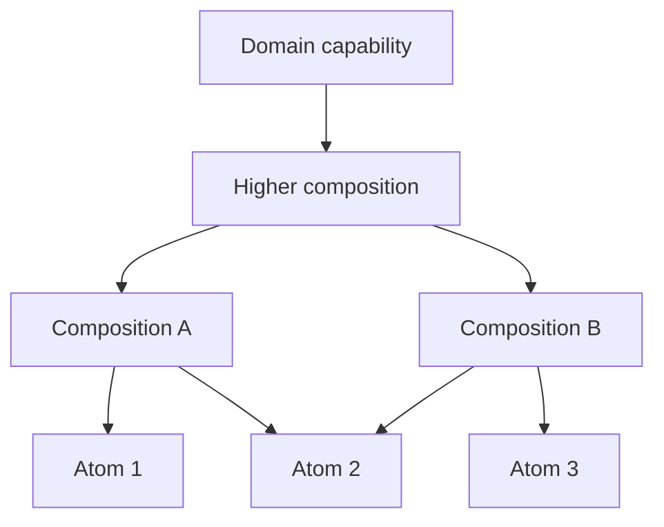

# Reliable Atoms and composition architecture

8 September 2026 · Working definition 1.2 · Domain-independent architecture and qualification requirements

**Purpose:** define Reliable Atoms, their composition into successively richer capabilities, and the constraints that keep the entire architecture understandable, dependable and economical to change. This definition applies to data structures, algorithms, values, codecs, validation, numerical operations, execution mechanisms and other capabilities. Graphs are one application.

**Status:** these are requirements for design and qualification, established by Jim’s directions. This document does not qualify an implementation, report executed atom tests or mutation campaigns, or amend an adopting repository’s governance. Repository-specific bindings supplement these requirements and must preserve their intent.

**Governing principle:** build from the smallest coherent, self-contained responsibilities that can be utterly defined and comprehensively assured; compose them through meaningful boundaries that minimise complexity within and between atoms, within and between compositions, and across atom–composition boundaries. Correctness, required capability and strict engineering standards constrain every design choice.

The [governing development policy](algorithms-and-data-structures-governance-2026-09-08.md) owns the current implementation-origin and reference-research policy for graph and non-graph foundations. This document owns the common normative requirements. The [graph architecture](comprehensive-graph-library-capability-architecture-2026-09-08.md) owns their graph-specific application; the [stable priority queue specification](oce-queue-reliable-atom-2026-09-08.md) owns that atom's concrete contract. The [general worked examples](reliable-atoms-worked-examples-2026-09-08.md) and [graph worked examples](graph-library-worked-examples-2026-09-08.md) own their named example profiles and expected traces. Examples reference the requirements they exercise; they do not silently amend them.

## 1. The architectural vocabulary

| Concept           | Definition                                                                                                                                                                                  | What determines its boundary                                                                                                     |
| ----------------- | ------------------------------------------------------------------------------------------------------------------------------------------------------------------------------------------- | -------------------------------------------------------------------------------------------------------------------------------- |
| Reliable Atom     | A small, self-contained capability with one coherent responsibility, a minimal complete public contract, and comprehensive tests, mutation tests and documentation for its supported scope. | Its responsibility, laws, ownership, useful operations and assurance surface.                                                    |
| Candidate atom    | A proposed atom whose contract or required evidence is incomplete.                                                                                                                          | Its declared intended responsibility and visible remaining work; it has not attained Reliable Atom status.                       |
| Composition       | A capability assembled from atoms and/or other compositions, owning a coherent additional responsibility and the guarantees created by their interaction.                                   | The coordination, interpretation, policy or invariant it makes explicit and owns.                                                |
| Composition layer | A useful grouping or relative level of composition responsibilities in a dependency structure.                                                                                              | Actual abstraction and dependency relationships; its membership is a design decision.                                            |
| Ensemble          | The interacting atoms, compositions, shared vocabulary, consumers and relevant assurance/delivery mechanisms considered together.                                                           | The scope of the capability and change being assessed.                                                                           |
| Collection        | A discoverable family of capabilities.                                                                                                                                                      | Shared purpose or organisation; collection membership does not require runtime coupling.                                         |
| Module / package  | Implementation and distribution units.                                                                                                                                                      | Encapsulation, dependency/platform budgets, consumption and release responsibility. They need not coincide with atoms or layers. |
| Provider          | An implementation of a declared capability or effect boundary.                                                                                                                              | Its public contract, qualification scope and substitution conditions; it may itself be a substantial composition.                |
| Seam              | A boundary where data, outcomes, ownership or responsibility pass.                                                                                                                          | The assumptions and obligations that must agree on both sides.                                                                   |

An atom can contain several functions or private helpers when they jointly implement one responsibility. A function is not automatically an atom. A small facade around a large mechanism does not make the underlying responsibility small. A composition can also have one coherent purpose; what distinguishes it is its responsibility for meaningful coordination among independently specified capabilities.

Atomicity here is an architectural judgement about a useful responsibility. It is separate from transactional atomicity. An atom need not be indivisible into instructions, pure, stateless, generic over every input type or independently published.

## 2. The common quality contract and atom smallness

R02–R10 apply to **every atom and every composition**. R01 additionally defines the atom’s particular smallness obligation. Composition adds C01–C08; it does not relax the common quality floor. Evidence addresses the actual contract, so a genuinely type-only capability has the explicit runtime-mutation treatment in §6, and a stateless capability has no invented transaction lifecycle. Hidden dependencies, unspecified public behaviour or missing assurance cannot be declared inapplicable merely because a component sits at a higher layer.

| ID  | Requirement                            | What must be explicit or demonstrated                                                                                                                                                                                            |
| --- | -------------------------------------- | -------------------------------------------------------------------------------------------------------------------------------------------------------------------------------------------------------------------------------- |
| R01 | Small and coherent                     | One intelligible responsibility; only the public operations necessary to discharge it; a justified boundary rather than a line-count target.                                                                                     |
| R02 | Self-contained                         | Its invariants, mechanism and lifecycle are encapsulated and understandable with its declared dependencies. Correct use requires no hidden application state, implicit initialisation or consumer repair of internal invariants. |
| R03 | Utterly defined                        | Admitted inputs, outputs, equality/order where relevant, preconditions, laws, state transitions, ownership, normal absence, failures and bounds have determinate meaning.                                                        |
| R04 | Strict public surface                  | Preserve known types and semantic distinctions; validate dynamic inputs at the owning boundary; make preventable misuse structurally difficult or impossible.                                                                    |
| R05 | Explicit dependencies and effects      | Declare imports, runtime assumptions, effect capabilities and callback obligations. No ambient service locator, undeclared singleton, clock, randomness or application bootstrap dependency.                                     |
| R06 | Comprehensively tested                 | Every declared behaviour, invariant and meaningful misuse class has appropriate executable evidence, including interactions and sequences where the contract is stateful.                                                        |
| R07 | Comprehensively mutation tested        | The complete runtime implementation scope is examined for meaningful faults, including private helpers and all in-scope production code; all mutant dispositions and tool gaps are resolved as specified in §6.                  |
| R08 | Comprehensively documented             | Users and maintainers can establish every guarantee, constraint, failure, cost, responsibility and assurance method without reverse-engineering the implementation.                                                              |
| R09 | Complexity minimised across boundaries | The atom’s internal simplification does not transfer greater unexplained complexity or repeated obligations into the ensemble.                                                                                                   |
| R10 | Qualified consumption and evolution    | The actual public consumed form, dependency budget, supported environments and API changes are checked; qualification is tied to exact code, contract and evidence revisions.                                                    |

“Utterly defined” means no unspecified supported behaviour. It does not promise useful execution on every possible input or make arbitrary caller code trustworthy. Every assumption must identify who establishes it. An arbitrary comparator’s transitivity, for example, cannot be established by sampling a few comparisons. A public extension point is itself a responsibility with laws, lifetime and cost assumptions; omit it when an owned policy fully serves the selected atom contract. Define any transformation into owned input representation together with the semantics it must preserve. Provide qualified built-in policies where useful; custom policies declare their obligations and the consequences of violating them. Do not promise recovery after a callback failure unless state restoration or invalidation is part of the proved contract.

Self-containment permits explicitly declared standard facilities and suitably bounded dependencies. Choose the smallest justified, qualified dependency closure that minimises internal and ensemble complexity. Prefer no additional runtime package when standard facilities already discharge the contract; every runtime dependency still needs an explicit reason, budget and qualification boundary. OCE’s inspected programme binds this principle to a zero-runtime-dependency default with declared nonzero budgets. That is an adopting-repository policy, not a universal definition of self-containment. Sharing a canonical result type or assurance harness can reduce ensemble complexity. Copying it into every atom to claim isolation increases duplication. A type-only dependency is distinguished from a runtime import.

No essential implementation may hide in an undeclared sibling or consumer. No consumer should have to maintain private ordering, index consistency or rollback rules. Isolation means the atom can be understood, consumed and tested without booting an unrelated application. It does not require reimplementing the language runtime, one file per atom or one package per helper.

## 3. Repeated composition and dependency direction

Composition is recursive. Small atoms form modest structural or operational capabilities; those form richer capabilities; richer capabilities support complete developer tasks and domain behaviour. There can be several useful intermediate layers. Their number and names follow the system’s responsibilities, rather than a prescribed universal stack.

| Relative role                   | What it contributes                                                    | Examples across domains                                                                          |
| ------------------------------- | ---------------------------------------------------------------------- | ------------------------------------------------------------------------------------------------ |
| Atoms                           | Bounded values, laws and mechanisms.                                   | A checked scalar, interval operation, queue, exact key codec or one bounded numerical operation. |
| Small compositions              | A coherent structure or short protocol assembled from those contracts. | A bounded buffer, expiry index, typed record decoder or window accumulator.                      |
| Further compositions            | Coordination across several structures/protocols.                      | A batch processor, selection service, streaming estimator or validated ingestion stage.          |
| Capability compositions         | A complete reusable task.                                              | Scheduled execution, document ingestion, time-series analysis or explained dependency analysis.  |
| Domain / interface compositions | Domain interpretation, authority and user/transport behaviour.         | Application policy, an SDK, an API operation or a user interaction.                              |

These examples are boundary hypotheses, not automatically qualified atoms or mandatory package placements. A decoder or algorithm may be an atom or a composition depending on its actual responsibility and dependencies.

Arrows mean “depends on the public contract of.” Shared atoms do not acquire knowledge of their consumers. An upper composition may use any suitable lower capability directly. Empty forwarding layers, forced adjacent-layer hops and a universal root package add no architectural value merely by existing.

The intended logical dependency structure is acyclic. Runtime feedback, recursive domain structures and repeated execution can exist without circular module dependencies; they require explicit control/state contracts. Callback injection supplies a declared capability without granting an atom knowledge of the upper application. A callback that must obey hidden application sequencing still represents coupling, despite the absence of an import.

An invariant's definition and the mechanism that establishes it need not occupy the same relative layer. Place the validating composition above every capability it consumes; a lower contract must not import a higher operation merely because its output is a validated value. Its checker consumes an unrefined candidate under sufficient lower premises, and its constructor issues a witness only after those premises and the new invariant are established. A witness cannot be required to run the very check that issues it. Shared checking mechanisms have one implementation owner; higher workflows add coordination instead of duplicating that check. The graph examples apply this to acyclicity and coherent publication.

Pure mechanisms generally make small contracts easier to assure. An effectful capability can still be narrow and explicit. Time, randomness, I/O and platform services enter through declared boundaries with appropriate failure and resource semantics; a general remote service does not become an atom by accepting injected dependencies.

## 4. What every composition must own

| ID  | Composition obligation       | Required boundary behaviour                                                                                                                                                                                                                       |
| --- | ---------------------------- | ------------------------------------------------------------------------------------------------------------------------------------------------------------------------------------------------------------------------------------------------- |
| C01 | Added responsibility         | Name the useful coordination, interpretation or invariant introduced and the repeated consumer reasoning it removes.                                                                                                                              |
| C02 | Compatible premises          | Connect outputs to admitted inputs with matching units, equality, ordering, identity, ownership and execution assumptions where relevant. Similar types or method names do not establish compatibility.                                           |
| C03 | Invariant ownership          | Assign each new invariant to an authoritative boundary. Constituent mutators or aliases cannot bypass it. Shared invariants have an explicit protocol and responsible owner.                                                                      |
| C04 | Outcome composition          | Preserve material failure distinctions, causes, cancellation, partial results, uncertainty and post-failure validity. Translating a failure never establishes recovery. Normal emptiness remains distinct from failure.                           |
| C05 | State and resource coherence | Define publication, lifetime, cleanup, mutation, consistency and custody when relevant. Distinguish retained controlled access from already disclosed values. An operation that can have an indeterminate remote outcome must expose it honestly. |
| C06 | Semantic preservation        | State what mappings preserve, transform or discard; verify any transported result under the assumptions that justify it.                                                                                                                          |
| C07 | New assurance                | Comprehensively test, mutation test and document the new runtime logic and interaction obligations; qualified dependencies do not establish these automatically.                                                                                  |
| C08 | Complexity reduction         | Evaluate complexity inside the composition and at all boundaries it creates or removes, including its effect on the atoms beneath it.                                                                                                             |

A composition’s guarantee is conditional on its dependencies’ guarantees and its own orchestration proof. A composition cannot promise an unconditional guarantee while silently passing an unestablished dependency precondition to its callers. Conversely, lower assumptions need not be exposed to every caller when the composition establishes them itself.

State, transactions, asynchronous execution, access control and history are applicable contract dimensions, not features every atom or composition must implement. A pure interval intersection need not return a revision envelope. A multi-source ingestion service may require one to state what its result means.

Owned fallible public boundaries use explicit typed outcomes and stable error distinctions. Use the adopting Practice’s canonical result abstraction instead of parallel home-grown versions. Language, protocol or unavoidable third-party boundaries may require explicit mappings; preserve cause and scope. In OCE TypeScript, the binding is `Result<T, E>` from `@oaknational/result` under its Result rule.

### Failure validity and execution assumptions

For every material failure, specify both its outcome and the state that remains usable. A returned error can mean rejection with unchanged valid state, an indeterminate remote effect, or a detected failure that invalidates an owned operation or capability. Those states are distinct contracts; consumers must not infer one from the presence of `Result` alone.

A composition should establish fallible input or policy results before mutating shared state where its responsibility permits. If extension code can fail after mutation begins, the invariant owner must provide proved restoration, contain and discard unpublished state, or enforce explicit invalidation. It must preserve the cause and prevent subsequent ordinary use of state whose validity is unknown. It cannot promise to roll back external effects that it does not control. The general worked examples demonstrate scoring before queue insertion.

Declared capacity and arithmetic rejection are distinct from failure of the execution platform. State the runtime assumptions under which the contract holds, including relevant allocation and termination assumptions. No declaration of a legal maximum size guarantees the process can allocate it. Do not claim typed recovery from fatal allocation failure, termination or corrupted runtime state without a mechanism and evidence that support it. Likewise, a timeout claim needs enforceable execution control; catching exceptions cannot interrupt a nonterminating synchronous callback.

For retained data, distinguish its immutable content/revision from the authority to disclose it. A controlled handle may mediate future reads under current policy; values already delivered outside that control have crossed the custody boundary. A retention, withdrawal or erasure guarantee states which owned stores, handles, caches, logs and derivatives it can actually govern. Access rules and immutable value semantics must agree within the declared profile.

## 5. Complexity at every scale

The target covers six connected surfaces, plus their behaviour over time:

| Surface                         | Reduce                                                                                         | Warning sign                                                                      |
| ------------------------------- | ---------------------------------------------------------------------------------------------- | --------------------------------------------------------------------------------- |
| Within each atom                | State, branching, ambiguity, independent responsibilities and unnecessary public concepts.     | One change requires understanding several unrelated policies.                     |
| Between atoms                   | Conversions, duplicated knowledge, implicit sequencing and incompatible assumptions.           | Every consumer must coordinate the same private invariant.                        |
| Within each composition         | Repeated orchestration, scattered policy and redundant state.                                  | The layer relocates conditional logic without owning it coherently.               |
| Between compositions and layers | Translation chains, dependency cycles, duplicated authorities and unclear failure propagation. | The same decision or state is reinterpreted at every hop.                         |
| Between compositions and atoms  | Policy leakage downward and mechanism leakage upward.                                          | An atom knows application policy, or upper code reaches into its private storage. |
| Across the ensemble             | Total reasoning, integration, assurance, packaging, documentation and change cost.             | Local simplification multiplies work elsewhere.                                   |

These objectives can compete. Compare only designs that preserve required capability, correctness, strictness and assurance. Those constraints cannot be traded for a smaller complexity score.

Splitting is warranted when distinct responsibilities or laws become clearer and the resulting composition remains simpler overall. Combining is warranted when apparent separation repeatedly exposes one inseparable obligation. Adding an intermediate composition is warranted when it can own recurring coordination without expanding the atoms’ responsibilities. Removing a layer is warranted when it adds neither a useful contract nor meaningful isolation or coordination. Changing an upstream contract or shared tooling may resolve both local and ensemble costs.

Repeated syntax differs from repeated knowledge. Three similar imports need not create a new abstraction. Three implementations of the same rollback or cutoff policy warrant examining ownership. A generic untyped adapter that saves lines while erasing meaning fails the objective.

“Entropy” is a working name for unwanted complexity, ambiguity, duplication and change propagation. No calibrated scalar measure, globally optimal atom size or mathematically established phase space is assumed. Locally attractive decompositions can conceal better changes across several boundaries. The feedback system consists of actual observations informing later boundary decisions; stability and convergence must be examined rather than promised.

For each material boundary change, record the responsibility and affected consumer journey; the internal simplification; coordination, assurance and delivery costs introduced or removed; preserved guarantees; expected observation; and what would reopen the decision. Observe both scales over the same journey and later relevant changes. Correct strictness defects immediately. Avoid repeated split/merge oscillation driven by alternating local metrics without new evidence.

## 6. Comprehensive assurance, including mutation testing

Comprehensive assurance is a property of the defined contract and its implementation scope. It requires coverage of every declared obligation and identified meaningful fault class. It does not mean every possible execution has been enumerated, nor that a percentage proves defect absence.

**Contract testing.** Trace public behaviour and invariants to deterministic examples, boundaries, invalid inputs, adversarial sequences and regression cases. Use bounded exhaustive traces, generated properties, independent reference models or metamorphic laws where they discriminate real failures. Record their actual scope. A reference model must not simply share the production mechanism and repeat its defect. Prove failure-state and resource behaviour where promised. Type-level obligations require positive and negative compile-time examples.

**Mutation testing is mandatory for runtime implementations at both atom and composition levels.** The qualifying campaign must:

1. Start from a reproducibly passing unchanged implementation and record its exact revision, contract, tool/configuration, operators and file scope.
2. Cover all production runtime code implementing the qualified responsibility, including private helpers, generated implementation code and copied/adapted source. A wrapper’s tests do not establish mutation adequacy for the mechanism it conceals.
3. Run the complete declared scope for qualification. Incremental campaigns are development feedback; they do not replace the required full campaign for that qualifying implementation scope.
4. Detect every reachable, non-equivalent mutant in the campaign. Resolve every survivor and uncovered mutant. A meaningful surviving fault is an assurance gap, not an accepted quality discount. Unreachable code prompts a scope and necessity check: remove dead implementation, or establish the distinct supported condition/platform that makes it necessary and test that condition. Unreachability is not a blanket exclusion.
5. Inspect equivalent, invalid, ignored, timed-out and infrastructure-failed outcomes with evidence. Equivalence needs an argument about the supported contract. Infrastructure failure is not fault detection. Mutant-induced nontermination counts only when reproducibly attributable and observed by the appropriate termination test.
6. Address identified defect classes that automatic operators cannot express with appropriate manually seeded faults or another effective method, demonstrating that the tests detect the error.
7. Report raw populations, dispositions, excluded material with reasons, and any score. Do not narrow the population, weaken assertions or relabel survivors merely to reach a percentage.

Composition campaigns cover their own orchestration and seams: omitted or duplicated calls, wrong order, unit/identity conversion, stale state, incorrect aggregation, lost cause, premature publication, cancellation and resource leaks where applicable. Representative dependency-failure injection tests the composition’s response. It complements mutation of owned implementation code; it does not replace the atom’s campaign or certify a provider.

Composition qualification covers every admitted branch of constituent outcomes and every feature promised by the complete journey. Compare accepted values, transformed results, failures and retained meaning, not only matching TypeScript shapes. An index or incremental result must agree with a straightforward reference or complete rebuild under a declared semantic equivalence; compare coherent revisions and normalize only irrelevant representational differences.

Runtime mutation cannot assess an erased type-only contract. Such an atom has no runtime mutant population; record that fact and supply comprehensive type/misuse proof. If any runtime implementation exists, the runtime obligation applies to it. Likewise, a declarative configuration needs its validation and characteristic fault tests; absence of generated mutants is not evidence that its semantics were tested.

External dependencies have an explicit assurance boundary. An adopting team must identify what implementation is being qualified and what is a separately qualified or assumed platform/provider contract. Delegating a mechanism to an opaque provider does not exempt that mechanism while retaining an unqualified claim of comprehensive atom assurance. Qualify the required scope, establish the necessary inspectability, author a suitably inspectable implementation or keep the candidate unqualified. Standard runtime assumptions remain explicit; the definition does not demand mutation of the language VM or operating system. Do not classify an ordinary dependency as a platform assumption merely to exclude its implementation from the promised assurance scope.

**Reuse assurance without duplicating it.** Reuse valid evidence for unchanged qualified dependencies. Each composition adds the tests and mutation/fault evidence for its new obligations and interactions. Shared example extraction, mutation runners, public-API reports and consumption checks should be common infrastructure. Every atom owning a different bespoke harness would add ensemble complexity without improving the quality requirement.

**Performance and consumption.** Qualify the real public consumed form and supported runtime/platform profiles. If a complexity, precision, throughput or resource bound is promised, provide the relevant analytical and measured evidence with its cost model. Count input size, comparator/arithmetic cost, allocation, conversion and retained state where material. Pure wrapper overhead does not justify an unrelated benchmark project.

## 7. Comprehensive documentation with one source for each fact

Documentation is part of the capability. It must explain purpose, supported use, legal inputs, useful outputs, laws, ownership, preconditions, failures, bounds, dependencies and examples. Document internal invariants and design rationale for maintenance without exposing representation as public API.

Positive and negative examples must be verified: compile type examples and execute behavioural ones. Cover real misuse classes rather than a fixed quota per exported symbol. Vocabulary constants and type arms need accurate definitions, not invented runtime failure examples. Document any misuse that cannot be structurally prevented and why.

Keep authoritative API documentation with the contract; generate or check reference views against it. Supporting documentation owns placement, composition rationale, mechanisms, provenance, qualification instructions and replacement/removal conditions. Shared indexes point to these sources. Public API reports and documentation drift checks make semantic/API changes visible. Do not maintain several independently edited copies of the same rule.

A composition documents the meaning it adds and what it requires from lower capabilities. It links to their contracts instead of reproducing them. An architecture document explains responsibility and dependency structure; it need not duplicate every atom’s examples or a full test report.

## 8. Non-graph examples that test the definition

| Example                          | Atom boundary                                                                                                                                                                                                       | Compositions and their additional obligations                                                                                                                                                                                                      |
| -------------------------------- | ------------------------------------------------------------------------------------------------------------------------------------------------------------------------------------------------------------------- | -------------------------------------------------------------------------------------------------------------------------------------------------------------------------------------------------------------------------------------------------- |
| Selection and scheduling         | The [stable priority queue](oce-queue-reliable-atom-2026-09-08.md) owns numeric priority ordering and occurrence preservation; FIFO applies within equal priorities. A FIFO queue is a different ordering contract. | A bounded selection composition owns admission, eviction and cutoff ties. A scheduler owns task lifecycle, concurrency, cancellation and clocks. Domain policy assigns priority. Queue FIFO ties alone do not prove the selection’s cutoff policy. |
| Data ingestion                   | A bounded decoder or exact key codec owns one admitted representation and failure contract.                                                                                                                         | A record composition coordinates field validation and error locations. A batch stage owns partial acceptance, publication and provenance. A domain stage interprets validated records. Parsing does not establish domain validity.                 |
| Numerical/time-series processing | A checked numerical operation or fixed-domain accumulator owns its arithmetic, precision and state laws.                                                                                                            | A window composition owns membership/expiry and reset. An estimator owns inference, quality and uncertainty. A feedback capability owns response policy. Correct arithmetic alone does not establish measurement accuracy.                         |
| Resource handling                | A narrowly defined acquisition/release mechanism owns its resource state transition.                                                                                                                                | A pooled or concurrent composition owns capacity, fairness, cancellation and cleanup across operations. A request workflow owns the larger success/failure boundary. A valid resource handle does not establish a whole workflow’s atomicity.      |

The examples illustrate reusable boundaries. They do not prescribe one library, algorithm, package, deployment platform or fixed stack of layers. A legitimate domain-specific primitive can still be an atom; being an atom does not require universal applicability.

## 9. Qualification and evolution

A capability has an accountable contract owner and an invariant-owning implementation boundary. These are separate from a package name or the authority permitted to change runtime state.

Contract closure, implementation origin and qualification are separate states. The governing policy selects our own authored algorithms and data structures informed by openly licensed references. A closed contract and selected origin can coexist with outstanding implementation and execution evidence. A working design choice is identified as such and has a concrete reopening condition; it is not attributed to the owner as a new mandate. A candidate attains Reliable Atom status only when R01–R10 are satisfied for its exact scope. A composition qualifies only when its own contract, all common requirements R02–R10, C01–C08 and its interaction evidence are satisfied. Missing requirements remain visible; an aspiration, wrapper, source review or automated score does not establish qualification.

Maintain a compact discoverable record of contract identity/version, owner, public consumption, dependencies/assumptions, source provenance, assurance references and outstanding gaps. Evidence is tied to immutable implementation and contract revisions. An ownership or contract change preserves prior attribution; relevant changed code, dependencies, assumptions, tooling or environment reopen qualification. Recompute status from applicable evidence rather than leaving an enduring “reliable” label after its premises change.

For algorithms and data structures in this programme, reference research informs our authored mechanisms and composition designs. Its record explains source lineage, inspected material, learned semantics and the independent evidence needed to qualify the result. The governing policy owns that research process and its stopping condition. AI assistance receives the same provenance and assurance discipline; shared-source examples remain correlated evidence.

Module/package boundaries follow cohesion, explicit dependencies, platform needs, release responsibility and useful consumption. Importing one atom must not load unrelated engines. Capability need can be owner-established before several consumers exist; evidence about consumer use helps test the boundary and sequence implementation, not invalidate legitimate innovation.

Evolve towards the correct current architecture. Explicit migrations preserve required value and semantics; compatibility layers must not perpetuate obsolete contracts or conceal defective mechanisms. Changes to units, equality, ordering, ownership or failure semantics are contract changes even if function signatures stay the same.

## 10. Basis and relationship to other work

This definition consolidates Jim’s explicit requirements and the general architectural conclusions from the graph work. It is self-contained; the following documents provide context and concrete applications rather than prerequisites:

- [Comprehensive graph library: working definition and architecture](comprehensive-graph-library-capability-architecture-2026-09-08.md) applies the principles to a broad graph capability family. Its model and operation requirements remain in their own documents.
- `oce-queue-reliable-atom-2026-09-08.md`, 8 September 2026, revision 3, is the dedicated stable-priority-queue design and qualification example; identity `libfile_fc950bcada4881919eed3c37839135e9`. It was read in full for this definition. Its implementation details remain its own responsibility.
- The OCE Reliable Atoms programme (the strategic plan node the owner ratified on 2026-09-08; its decision is recorded in [ADR-230](../architectural-decisions/230-own-built-algorithm-and-data-structure-foundations.md)) supplies the inspected Practice baseline for strict APIs, misuse/type evidence, mutation testing, documentation, dependency budgets and shared assurance instruments. [ADR-088](https://github.com/EngraphCode/open-curriculum-ecosystem/blob/270b8ec6fb82dc6881c10ca101cb8d3c7a242d6e/docs/architecture/architectural-decisions/088-result-pattern-for-error-handling.md) supplies OCE’s Result binding. The programme and Result sources were refreshed at Engraph `engraph` revision `270b8ec6fb82dc6881c10ca101cb8d3c7a242d6e` for this revision; this is bounded source inspection, not repository-wide conformance or implementation qualification.

Initial-definition method: OCE metacognition, reason, proportionality and the established Parallax framing/synthesis/audit disciplines were applied to separate universal obligations from graph-specific mechanisms. Bounded expert challenge covered assurance, self-containment, granularity, documentation and generalisation. Reviews are conceptual and share sources; they do not constitute independent empirical verification. No atom implementation, mutation campaign or performance result is claimed by this document.

The bounded reviews were `atoms_types_review` (architecture/type/assurance lenses) and `definition_acceptance_review` (documentation/test/generalisation lenses), both gpt-5.6-sol, reviewing the author’s working-definition draft. Their findings were checked and integrated as follows; final narrow wording repairs were verified by the author.

| Review concern                             | Disposition in this definition                                                                                                                                                                                 |
| ------------------------------------------ | -------------------------------------------------------------------------------------------------------------------------------------------------------------------------------------------------------------- |
| Fragmentation and local complexity         | §5 assesses both scales and change costs; possible local minima remain a hypothesis, not an established result.                                                                                                |
| Self-containment and dependency closure    | §2 requires explicit qualified closure; it avoids both hidden dependencies and duplicated canonical facilities.                                                                                                |
| Mutation adequacy and survivor handling    | §6 covers full runtime scope, type-only treatment, meaningful survivors and operator gaps. Unreachable code is examined for necessity and supported-platform scope before removal.                             |
| Noncircular composition assurance          | §4 assigns the added guarantees; §6 tests interactions and faults independently of the production mechanism. Atomic publication is required where promised, rather than imposed on every effectful capability. |
| Recursive layers and facade size           | §§1/3 preserve meaningful repeated composition without a universal layer count or relabelling a large provider as a small atom.                                                                                |
| Ambiguous higher-layer quality inheritance | R02–R10 now explicitly apply to all compositions; C01–C08 add obligations. Higher layers cannot opt out of self-containment, strictness or assurance.                                                          |
| Host-specific zero-dependency policy       | The general rule is the smallest justified closure; OCE’s zero default is explicitly identified as its repository binding.                                                                                     |

The current definition includes failure-state validity, validation direction, disclosure custody, complete composition outcomes and reference-independent qualification. The [source review](foundations-source-review-2026-09-08.md) records the broader research basis and the current policy decision. Implementation qualification remains governed by the evidence contract above.
