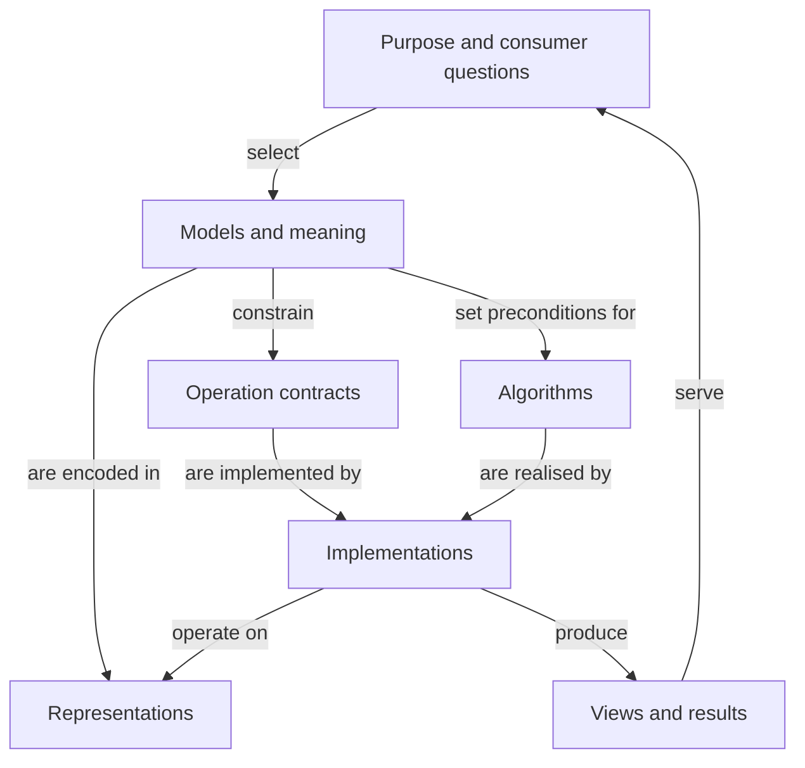

# Typescript Graphs: concept map and shared reference

**Version:** 1.6 · **Date:** 8 September 2026

**Role:** foundational project source; shared vocabulary and inquiry frame.

**Status:** current shared vocabulary and inquiry frame under the [algorithms and data structures governance](algorithms-and-data-structures-governance-2026-09-08.md). We build our own algorithms and data structures as SMALL Reliable Atoms and composition layers, using openly licensed examples as inspiration. Dated package research supplies reference evidence. The capability catalogue owns the comprehensive graph target.

## 1. Purpose and scope

This project explores graphs across mathematical structure, knowledge representation and software engineering. It develops language and evidence that can improve several independent applications, including OCE, Jim's CV repository and the personal knowledge graph project. TypeScript and JavaScript provide the principal implementation context; relevant theory and designs from other ecosystems belong in the inquiry.

The useful outcome is the ability to ask precise questions, identify appropriate contracts, compare genuinely different approaches and carry justified findings into each consumer. The current implementation policy gives those findings a concrete destination: our own small, qualified mechanisms and compositions, with modelling, algorithm, interface, interoperability, storage and user-experience decisions made at their appropriate responsibilities.

The map describes relationships among concerns and supports comparisons of different models, representations and compositions. A boundary may be useful for reasoning before it warrants a module or independently released package.

**Purpose:** develop useful graph capabilities across several levels, altitudes, dimensions and seams. OCE needs fundamental graph structures and operations as an innovation investment, and RDF support is required for some cases. Evaluate established needs, anticipated capabilities and useful future options. **Required breadth:** the [capability catalogue](graph-library-capability-contracts-2026-09-08.md) and its [requirements register](graph-library-requirements-register-2026-09-08.json) govern the comprehensive graph target. **Open design questions:** representation, coherent contracts, capability boundaries, implementation sequence and the profile-specific evidence needed for qualification.

Study useful atoms and larger libraries for what they teach about mechanisms, representations, laws, contracts and composition. Translate the findings into explained choices for our implementation. Count survey, specification, implementation, assurance, documentation, integration and change costs across complete journeys. Native runtime facilities remain explicit foundations; existing OCE code is evidence about domain value and seams, not a mandatory implementation shape.

## 2. How to navigate the map

These are working project definitions. Their purpose is to make a question more precise, and they may overlap.

| Organising term | Meaning                                                                                | Example                                                                                                 |
| --------------- | -------------------------------------------------------------------------------------- | ------------------------------------------------------------------------------------------------------- |
| Concern         | A question or responsibility requiring attention.                                      | Provenance, traversal, identity or persistence.                                                         |
| Level           | Position in a particular abstraction or dependency relationship.                       | A scheduling capability uses ordering operations supported by data structures.                          |
| Altitude        | Resolution and standpoint of an explanation.                                           | Discuss reachability as a user need, mathematical property, API promise, algorithm or memory operation. |
| Dimension       | A variable or distinction that crosses multiple concerns.                              | Scale, time, mutation, trust or distribution.                                                           |
| Seam            | A boundary across which data, operations or responsibility pass.                       | An RDF dataset is projected into an adjacency representation for computation.                           |
| Contract        | Promised meaning and behaviour, including invariants, preconditions and failure cases. | Return a valid ordering or an explicit cycle outcome for a declared graph model.                        |

**Levels describe relationships; altitude describes how we examine them.** A performance question may concern an entire application at a low implementation altitude, while a mathematical question may concern one small operation at a high conceptual altitude. Name the axis instead of assuming that “low level” has one meaning.

The diagram shows selected relationships, not mandatory processing order. “Model” includes the selected structural and domain assumptions; the tables below distinguish them further.

### 2.1 Concerns and their relationships

| Concern                         | What belongs here                                                                                               | Questions that change a design                                                        |
| ------------------------------- | --------------------------------------------------------------------------------------------------------------- | ------------------------------------------------------------------------------------- |
| Purpose and domain capabilities | Questions, decisions, interactions and outcomes for people or software.                                         | What does a path, match, ordering or explanation mean to this consumer?               |
| Mathematical structure          | Vertices, incidence, edges, direction, multiplicity, paths, cycles, connectivity and hyperedges.                | Which structures are legal? Which properties does an algorithm require?               |
| Data model                      | Entity and relationship identity, attributes, values, graph membership and constraints.                         | Can two relationships share endpoints? Can an entity exist without relationships?     |
| Knowledge and meaning           | Vocabularies, propositions, assertions, evidence, uncertainty, validation and inference.                        | What is claimed, by whom, about which entities, under which interpretation?           |
| Operations and computation      | Traversal, reachability, ordering, paths, ranking, matching, joins, inference and incremental maintenance.      | Is the result correct, complete, deterministic and meaningful for the declared scope? |
| Representations and primitives  | Adjacency structures, incidence structures, matrices, term dictionaries, maps, sets, queues, heaps and indexes. | What are construction, lookup, update, copying and memory costs?                      |
| APIs and composition            | TypeScript types, capabilities, factories, iterators, streams, ownership, errors and cancellation.              | Which promises can callers rely on across implementations?                            |
| State, storage and exchange     | Snapshots, changes, transactions, persistence, formats, protocols, query engines and distributed sources.       | How are revisions, consistency, partial results and round trips handled?              |
| Presentation and interaction    | Selected views, layouts, search, filtering, editing, explanation and accessible alternatives.                   | What becomes visible, what is omitted, and what conclusions might the display invite? |
| Ownership and evolution         | Modules, packages, governance, releases, compatibility, dependency cost and migration.                          | What changes together? Who owns the contract and what makes replacement practical?    |

These have many-to-many relationships. One API can expose multiple representations. One representation can serve several algorithms. A knowledge model can produce different computational or visual graphs. A single package can span concerns, while one concern may require multiple packages.

### 2.2 Dimensions crossing the map

| Dimension                    | Distinctions to make when relevant                                                                                                |
| ---------------------------- | --------------------------------------------------------------------------------------------------------------------------------- |
| Identity and comparison      | Entity, edge, assertion, occurrence and artefact identities; scope; equality versus structural or semantic equivalence.           |
| Shape and scale              | Sparse/dense, degree skew, disconnected regions, cycles, depth, graph count, data volume and query selectivity.                   |
| State and ownership          | Mutable store, immutable values, persistent data structures, snapshots, live views, shared references and index invalidation.     |
| Time                         | Time when something held, time it was recorded, revision order, observation time, freshness and execution deadline.               |
| Knowledge and completeness   | Observed, asserted, derived, disputed or unknown; complete for a declared scope, deliberately selected, or interrupted/truncated. |
| Trust and access             | Source authority, evidence, provenance, permitted use, disclosure, access filtering and consequences for derived results.         |
| Execution                    | Synchronous/asynchronous, incremental/batch, in-memory/external, streaming, workers, cancellation and failure recovery.           |
| Distribution and consistency | Local identity versus shared identifiers, independent updates, transactions, reconciliation and reproducible reads.               |
| Order and determinism        | Domain sequence, insertion order, traversal order, tie-breaking, topological order, display order and canonical byte order.       |
| Assurance and cost           | Mathematical laws, runtime validation, type guarantees, resource bounds, ergonomics, maintenance and conversion costs.            |

Use only the dimensions that matter to the current question. Their presence here is a discovery aid, not a checklist gate.

## 3. Shared language

### 3.1 Structure, models and operations

| Term                                      | Working meaning and distinction                                                                                                                                                                                                                                                                            |
| ----------------------------------------- | ---------------------------------------------------------------------------------------------------------------------------------------------------------------------------------------------------------------------------------------------------------------------------------------------------------- |
| Graph                                     | Qualify whether this means a mathematical object, data model, dataset, in-memory object, query source or visualisation.                                                                                                                                                                                    |
| Vertex / node                             | An element of the selected structure. “Node” may also mean a resource term, domain entity or visual mark; name the mapping.                                                                                                                                                                                |
| Edge / relationship                       | An edge is a structural connection; a domain relationship has an interpretation. Direction depends on the model. An identified edge instance may share endpoints and a relation type with other edges. Edge identity, statement content and assertion identity follow separate contracts.                  |
| Relation type / relationship instance     | A relation type describes the kind of relationship, such as `dependsOn`; an instance is a particular relationship. Describing the type’s laws is schema modelling. Describe relationship content through a content reference; identify a particular instance explicitly when instance distinctions matter. |
| Multigraph / hypergraph                   | A multigraph permits distinct edges with the same endpoints. A hypergraph permits edges incident to more than two vertices; binary expansion needs a stated mapping.                                                                                                                                       |
| DAG / tree                                | Structures with additional constraints. A directed acyclic graph excludes directed cycles. “Tree” needs a convention for direction, root and connectivity.                                                                                                                                                 |
| Property graph                            | A model with vertices and edges carrying properties, often labels and independent edge identities; precise value and multiplicity rules belong to the selected specification. [S1]                                                                                                                         |
| RDF triple / graph                        | A triple is a subject–predicate–object tuple. An RDF graph is a set of triples, so identical triples have no multiplicity within it. Repetition in a document or stream needs explicit occurrence records if it matters. [S2]                                                                              |
| RDF dataset / named graph / default graph | A dataset has one unnamed default graph and zero or more named graphs, each pairing a graph name with a graph. The default graph is not automatically their union. Graph names do not inherently establish provenance or assertion identity. [S2]                                                          |
| RDF quad / graph membership               | A quad records subject, predicate, object and the containing graph. The same triple in two named graphs yields different quads. RDF/JS uses a `DefaultGraph` marker for the default graph. Quad equality does not preserve repeated assertion acts. [S3, S20]                                              |
| Knowledge graph                           | A graph-based representation used to organise meaningful entities and relationships. The label alone specifies neither storage model, truth conditions nor inference capabilities.                                                                                                                         |
| Query / traversal / algorithm             | A query specifies information sought; traversal visits structural elements; an algorithm implements an operation. A query engine may combine several algorithms and indexes.                                                                                                                               |
| Graph API                                 | A programmatic interface. GraphQL is an API query language and should be evaluated separately from the representation of an underlying graph. [S12]                                                                                                                                                        |

### 3.2 Identity, knowledge and evidence

| Term                                     | Working meaning and distinction                                                                                                                                                                                                                                                                                                   |
| ---------------------------------------- | --------------------------------------------------------------------------------------------------------------------------------------------------------------------------------------------------------------------------------------------------------------------------------------------------------------------------------- |
| Identifier / identity                    | An identifier is a token used within a stated scope. Identity concerns which entity, edge, assertion or artefact it denotes. Shared labels do not establish shared identity.                                                                                                                                                      |
| Equality / equivalence                   | Equality follows a specified comparison rule; equivalence follows a stated relation. JavaScript object identity, RDF term equality and graph isomorphism answer different questions.                                                                                                                                              |
| Canonicalisation / reconciliation        | Canonicalisation chooses a consistent representative under specified rules. Reconciliation decides which references denote the same domain entity. A digest does not establish truth.                                                                                                                                             |
| Proposition / statement content          | A proposition is what is claimed; statement content is an expression of it, such as an RDF triple. Syntactic or term equality and semantic equivalence are different comparisons. Distinct expressions may have equivalent meaning.                                                                                               |
| Assertion / occurrence                   | An assertion is an attributable act or record of making a claim; an occurrence is a particular appearance in source material. Multiple assertions or occurrences can share content. Recording them does not itself establish independent evidence.                                                                                |
| Reification / addressable relationship   | Reification gives a relationship or statement an explicit representation that further relationships can reference, often a node. Declare whether that representation denotes content, an edge instance, an assertion or another entity. Describing content does not automatically assert it.                                      |
| Native edge reference / edge as endpoint | A native reference addresses an edge directly in the model/API. Permitting that edge as an endpoint is a further capability; IDs or property values alone do not provide it. An ordinary directed multigraph has vertex endpoints; relationships to edges require a richer model or explicit node encoding.                       |
| Triple term / reifier                    | In the RDF 1.2 Concepts snapshot of 7 April 2026, a triple term can occupy only the object position of another triple. A reifier is the subject of an `rdf:reifies` triple pointing to such content. It may denote an assertion, belief, situation or other related entity; its meaning is broader than assertion identity. [S18] |
| Meta-graph / schema graph                | A graph describing graph elements or their types. State its subjects and interpretation. A separate graph is an organisational choice; reification can be represented within one graph.                                                                                                                                           |
| Provenance / lineage                     | Provenance records origins and responsibility; transformation lineage records derivation steps. Neither alone proves a claim correct.                                                                                                                                                                                             |
| Confidence / evidence / truth            | Confidence needs an interpretation or calibration; evidence supports or challenges a claim; truth is not created by storing a score or citation.                                                                                                                                                                                  |
| Vocabulary / taxonomy / ontology         | A vocabulary identifies terms; a taxonomy organises categories; an ontology specifies concepts and relationships with some formal commitments. Exact meaning varies by community.                                                                                                                                                 |
| Schema / validation / inference          | A schema expresses structure or constraints; validation checks conformance; inference derives consequences under declared rules. One does not automatically provide the others. [S8]                                                                                                                                              |
| Open / closed world                      | An open-world interpretation allows unrecorded facts to remain unknown. A closed-world operation may treat absence as false within a declared complete scope. State the assumption for the operation.                                                                                                                             |

### 3.3 Engineering and temporal language

| Term                                   | Working meaning and distinction                                                                                                                                                          |
| -------------------------------------- | ---------------------------------------------------------------------------------------------------------------------------------------------------------------------------------------- |
| Representation / serialization         | A representation encodes a model for use; serialization encodes data for storage or exchange. Format compliance does not establish preservation of every domain distinction.             |
| Adapter / projection / view            | An adapter reconciles interfaces or representations; a projection selects or transforms data; a view exposes a chosen perspective and can be virtual or materialised.                    |
| Materialisation / index                | Materialisation stores a derived result. An index accelerates operations over data. Their freshness and invalidation rules must be explicit.                                             |
| Immutable / persistent                 | Immutable values are treated as unchangeable. A persistent data structure retains usable prior versions through updates. Database persistence means durability, a different concern.     |
| Snapshot / version / event             | A snapshot captures a state under stated consistency rules; a version identifies a revision; an event records a change or occurrence. One does not automatically reconstruct the others. |
| Valid time / recording time            | Valid time is when a fact or relationship applies in the domain; recording time is when the system records it. A correction may change their relationship.                               |
| Typed                                  | Qualify static TypeScript types, runtime validation, edge categories, literal datatypes or semantic classes. Assignability is not full standards or domain conformance.                  |
| Standard / specification / conformance | A specification states rules; standard status depends on a named process and edition; conformance is against identified requirements. A reference implementation is one implementation.  |
| Core / primitive / atom                | Relative scope terms, not universal package categories. State the contract and what depends on it before using these labels to justify ownership.                                        |

### 3.4 Addressable relationships and statements about relationships

This capability under exploration lets relationships or statement content participate in further relationships. Its contract distinguishes relation types, edge instances, content, assertions, occurrences and graph membership. The [short session report](addressable-relationships-rdf-quads-and-identity-2026-09-08.md) contains the worked example and source-backed comparison.

Reified nodes and native edge references are candidate representations of the declared contract. Compare their preservation of identity and meaning, endpoint rules, traversal behaviour and lifecycle costs. Ordinary edge attributes can hold bounded annotations; scalar properties alone do not establish traversable relationships. A change in encoding may change path lengths or introduce metadata paths, so algorithms need an explicit view of the domain topology.

A UUID-bearing graph IRI can provide practical global uniqueness when generated appropriately. Its role follows the declared assertion or grouping convention: one graph may represent one assertion or many, and one assertion may concern multiple triples. Triple count alone does not determine that role. Specify cardinality, identifier reuse, revision and mutation rules. UUIDs do not guarantee distinct content, evidence independence or historical stability. [S21]

For a selected capability profile, define:

- Addressable subjects and endpoints, comparison rules, identifier scope and duplicate behaviour.
- Description versus assertion, including disputed or unasserted content and references to further statements.
- Provenance and occurrence ownership, graph membership, updates, retractions and missing-reference behaviour.
- Traversal scope and conversion guarantees under a named equivalence relation; preserve required assertion distinctions even when computation projects them to one edge.

One discriminating example is the same proposition asserted twice by one source and once by another. Preserve three assertion records where required, independently of how many graphs or computational edges are used. Neither equal triples nor equal quads can encode that multiplicity alone.

## 4. Seams and information preservation

A seam can connect different levels or different models at the same level. Assess it as a behaviour with costs and meaning, rather than assuming that an adapter is semantically neutral.

| Seam                                          | Questions to resolve                                                                                                                                                                                      |
| --------------------------------------------- | --------------------------------------------------------------------------------------------------------------------------------------------------------------------------------------------------------- |
| Source document → statements                  | Which source version and locations support each statement? Can repeated occurrences and parsing uncertainty survive?                                                                                      |
| Domain identities → storage keys              | Is mapping injective where required? How are collisions, aliases, scopes and reconciliation handled?                                                                                                      |
| RDF dataset → computational or property graph | What happens to named graphs, literals, blank nodes, relationship identity, repeated claims and unsupported terms?                                                                                        |
| Reified statements ↔ native edge references   | Which content, edge, assertion and occurrence identities survive? Are unasserted statements preserved? How do metadata edges, path lengths, updates and missing references affect the computational view? |
| Graph model → algorithm                       | Do direction, multiplicity, weights and cycles satisfy its preconditions? What does the answer mean in the original domain?                                                                               |
| Mutable source → index or cached view         | Who owns invalidation? Can a result mix revisions? How is stale data exposed?                                                                                                                             |
| Full knowledge → disclosed or visual view     | What is hidden or aggregated? Does filtering alter reachability, ranking or the interpretation of missing results?                                                                                        |
| Library API → consumer contract               | Which guarantees are retained, strengthened or weakened? What conversion and maintenance costs are introduced?                                                                                            |

For a consequential seam, record a short contract:

1. Source and target models, versions, direction and intended consumer.
2. Preconditions, identity mapping, ownership and allowed effects.
3. Preserved information and explicit omissions, approximations or unsupported cases.
4. Errors, completeness, cancellation and consistency behaviour where relevant.
5. Construction, conversion, update and resource costs.
6. One discriminating example or counterexample; the equivalence relation for any round-trip claim.

“Lossless” is always relative to specified distinctions. Preserving endpoints can still lose assertion identity. Preserving triples can still lose their source occurrences. Producing deterministic bytes can still omit information needed by a consumer.

**Worked example:** two documents assert the same experience-to-skill relationship. A conceptual knowledge model may retain one proposition, two assertion records and two source occurrences. A computational projection may deliberately use one unweighted edge. Its reachability result applies to that selected topology; it does not establish two independent confirmations, calibrated confidence or professional competence. Returning the result with assertion references can preserve a route back to the evidence without forcing the algorithm to model every provenance detail.

## 5. Contrasting consumer questions

The examples below describe possible consumer questions. OCE’s need for fundamental graph capabilities is owner-established; the 8 September investigation inspected selected OCE source at `3864af2253a1a00feb4850a7594bee18dc4072d0`. That inspection provides selective integration evidence for the proposed capability investment. CV and personal-knowledge-graph implementations and detailed requirements remain uninspected.

| Consumer                             | Illustrative question                                                                                                 | Distinctions exposed                                                                       |
| ------------------------------------ | --------------------------------------------------------------------------------------------------------------------- | ------------------------------------------------------------------------------------------ |
| OCE                                  | Which relationships belong in a selected curriculum or knowledge view, and what does a traversal or ordering justify? | Domain semantics, source fidelity, projections, operation contracts and reuse.             |
| CV repository                        | How can experiences, contributions, skills and evidence support several accurate presentations over time?             | Entity versus claim, temporal intervals, evidence links, ranking and presentation choices. |
| Personal knowledge graph             | How can imported sources disagree, be corrected and disclose different subsets while remaining traceable?             | Reconciliation, attribution, uncertainty, time, access and portability.                    |
| Software dependency or workflow tool | How should scheduling react to a cycle or an incremental change?                                                      | Structural invariants, algorithms, mutation, invalidation and execution.                   |

A finding can be universal under mathematical assumptions, shared across some consumers, or specific to one domain. State which. Generality is demonstrated by preservation of the relevant contract across contrasting cases, rather than by the number of applications named.

Ownership of these algorithms and data structures follows the current governing policy. Evaluate decomposition and representation against capability, quality and lifecycle goals. The right atom boundary can change when a complete journey exposes repeated invariant maintenance, conversions or coupled changes; the surrounding composition must own that coordination.

## 6. Technology and standards: orientation and current research

The orientation table locates approaches in the map. Section 6.1 identifies reference roles from dated research; section 9 points to the full evidence. Each claim applies to its stated release and profile. A successful bounded probe is not complete conformance or production qualification.

| Approach                                     | Position in the map                                                              | Initial finding / question                                                                                                                                                     |
| -------------------------------------------- | -------------------------------------------------------------------------------- | ------------------------------------------------------------------------------------------------------------------------------------------------------------------------------ |
| Native JavaScript structures                 | Underlying representation and primitives.                                        | Useful atoms for identity and auxiliary indexes, and a comparator whose local algorithm, assurance and maintenance costs must also be counted.                                 |
| RDF/JS                                       | RDF data interfaces and library interoperability.                                | Terms/quads have explicit equality and are treated as immutable; DatasetCore exposes a mutable unordered quad set. Storage representation is open. [S3–S4]                     |
| N3.js, RDF-Ext, Comunica                     | Implementations and composable capabilities around RDF.                          | Examples of parsing/storage, developer tooling and querying, respectively; assess each required interface and extension. [S9–S11]                                              |
| RDF, SPARQL, JSON-LD, SHACL, SKOS and PROV-O | Data model, querying, exchange, validation, concept organisation and provenance. | These solve different problems. The capability catalogue identifies required profiles; shared syntax still requires vocabulary and interpretation agreement. [S2, S8, S13–S16] |
| GQL                                          | Property-graph data structures, operations and a data-management language.       | ISO/IEC 39075:2024 has a different scope from an in-memory TypeScript object API. [S1]                                                                                         |
| Other structural and functional libraries    | Alternative APIs, representations, algorithms and ownership models.              | The 8 September report evaluates concrete APIs, representations and ownership models. Apply each finding to its exact version, module and capability profile.                  |

**RDF/JS qualifications, checked 7 September 2026:** `@rdfjs/types` contains the authoritative TypeScript interfaces, with runtime implementations supplied separately. DatasetCore and the richer Dataset API should be assessed separately: the dataset specification labels Dataset, DatasetFactory and iteratee interfaces experimental. RDF/JS is W3C Community Group work; that status is distinct from a W3C Recommendation. [S4, S7, S17]

**Edition and interoperability evidence, recorded 7–8 September 2026:** RDF 1.1 provides a stable baseline. RDF 1.2 Concepts was published as a Candidate Recommendation Snapshot on 7 April 2026. RDF/JS prose, typings and implementations must be checked separately for newer constructs: the inspected Quad prose and typings differed on permitted nested-quad positions. A claim of RDF-star support is insufficient evidence of RDF 1.2 conformance. These are reasons for precise capability checks, not technology selection conclusions. [S3, S18–S19]

**Maintenance assessment:** assess documentation revision, core and companion releases, issue handling, governance, resourcing and support commitments separately. Research origins can explain workload priorities; they do not establish engineering quality or fitness. Preserve dated findings in focused investigations rather than treating them as permanent project facts.

### 6.1 Reference roles from the 7–8 September research

The following are starting points for focused surveys, derived from dated research. They are neither a closed shortlist nor a current ranking of the best references. Assess relevant openly licensed examples at the exact responsibility under design, including other languages, standards and classic mechanisms. Refresh a reference's source and licence when relying on it. The [source review](foundations-source-review-2026-09-08.md) identifies the historical reports, their evidence and their current role.

| Reference family in the prior investigation         | What can inform our design                                                                                 | Qualification question to preserve                                                                          |
| --------------------------------------------------- | ---------------------------------------------------------------------------------------------------------- | ----------------------------------------------------------------------------------------------------------- |
| Effect Graph and Cytoscape.js                       | Typed incidence access, coherent graph operations, publication and developer-facing analysis compositions. | Are identity, payload ownership, mutation and path witnesses lawful for our exact profile?                  |
| heap-js and other queue/heap designs                | Ordering mechanisms, storage choices, stable ties, bounds and small queue contracts.                       | Do priority capture, emptiness, capacity and lifetime semantics match our queue specification?              |
| Immutable.js, sorted-btree and native collections   | Structural sharing, ordered indexes, equality and retained versions.                                       | Are payloads shared; what defines replacement; can mutation bypass retained-state guarantees?               |
| lru-cache and other bounded-cache designs           | Eviction, access order, resource lifetime and composition with expiry.                                     | Can reads change iteration or lifetime; who owns clocks, cancellation and disposal?                         |
| N3, RDF/JS, Comunica and Oxigraph                   | Term equality, indexed matching, query algebra, streaming, exchange and semantic composition.              | Does a complete profile preserve positions, multiplicity, scope, literal distinctions and terminal failure? |
| Boost Graph, GraphBLAS and model-specific libraries | Capability-based algorithm premises, sparse algebra and characteristic higher-model operations.            | Which result-preservation claims have explicit mathematical warrants and independently checkable witnesses? |

Reference implementation, test suite, documentation and issue history may share assumptions. Derive our contract laws independently and preserve counterexamples from historical defects without treating an old defect as a current diagnosis or a complete regression inventory. Conventional mechanisms need no artificial redesign to establish ownership.

### 6.2 Durable modelling and assurance findings

- **RDF authority and computational access are separate decisions.** A bounded context may use RDF-authoritative data or domain data with explicit RDF mappings. Each operation may use direct query, a virtual provider or a materialised projection. Select the arrangement by its semantic guarantees, useful operations and lifecycle cost.
- **Equal quads do not preserve repeated occurrences.** Source occurrences, assertion/edge identities, named-graph and blank-node scope, lexical distinctions and source revisions need explicit treatment. A vertex-only path cannot identify a chosen parallel relationship. Retained topology and deep payload immutability are different promises.
- **Standards and implementation profiles remain separate.** The historical RDF 1.1 checks supply bounded examples. Our required RDF 1.1 and RDF 1.2 profiles still need their own complete qualification. Evaluate each path against the required end-to-end preservation and conformance guarantees, including external conversion. Consult current standards-focused work for the profile under implementation.
- **Care, continuity and reference utility are different evidence.** Dated module changes support care at the observed revision; downloads are neither users nor graph-module adoption. Those dated observations inform the confidence and refresh effort appropriate to a reference. A stable classic algorithm and an actively evolving module can contribute different forms of useful knowledge.
- **A historically reproduced defect is useful evidence.** The earlier investigation recorded six reconstructed entrypoints with 49 expected case outcomes, including adverse observations. Those records are read as dated evidence here; no probes were rerun. They establish no current implementation qualification, performance ranking or measured effort saving.

The next implementation unit is a coherent journey whose atom and composition contracts can be qualified together. Use focused reference surveys to resolve its live mechanism and contract questions; implement our selected responsibilities; verify the new interactions as well as atom-local laws. Carry the entire capability ledger while sequencing these journeys.

## 7. Inquiry and decision method

For substantial questions, develop the strongest account from several relevant perspectives: meaning and information preservation; mathematical laws; execution and resources; APIs and ownership; consumer journeys; and reference-informed ownership over the full lifecycle. Reconcile their disagreements using evidence that can distinguish alternatives. Shared models or source material make multiple reviews correlated evidence.

Use a lightweight sequence: question and scope → relevant concepts and assumptions → alternatives → primary evidence → smallest decisive probe → scoped conclusion. Explanations and preliminary mapping can stop earlier when they already answer the question.

For API evaluation, include usability and static type safety alongside runtime guarantees. Study native language facilities, existing modules, openly licensed packages and contrasting implementations for their contract and mechanism lessons. Infer package boundaries from responsibility, cohesion, patterns of change, established or explicitly proposed capability goals and consumer evidence. A specification, its reference implementation and its surrounding ecosystem need separate evaluation.

For reference claims, inspect primary documentation and identify exact releases or repository revisions and licensing. Record the particular insight, alternatives, assumptions and independent evidence associated with a design choice. Keep documented guarantees, vendor claims, inspected code and executed observations separate. Research and commercial origins both provide context for workload assumptions; neither is a quality verdict. Distinguish standards-body status, conformance claims and actual implementation support. The maintenance dimensions in section 6 should also be assessed separately.

Choose the smallest example, counterexample, type check, conformance check, benchmark or independent review that can resolve a material uncertainty. Include conversion, construction, update and memory costs when relevant. Use independent review when it can expose a consequential blind spot, while recognising shared-source dependence. A useful answer need not await a full survey or test programme.

| Probe                                            | What it can discriminate                                                              |
| ------------------------------------------------ | ------------------------------------------------------------------------------------- |
| Same label, distinct identities                  | Key coercion and accidental entity merging.                                           |
| Same proposition, different source assertions    | Deduplication versus preservation of evidence and occurrence identity.                |
| Equivalent input in different orders             | Unstated insertion dependence, tie-breaking and canonicalisation assumptions.         |
| Cyclic input to a DAG operation                  | Preconditions, validation and useful failure contracts.                               |
| Mutation after index construction                | Ownership, consistency and invalidation correctness.                                  |
| Correction followed by a historical query        | Valid time, recording time and snapshot semantics.                                    |
| Projection followed by reconstruction            | Precisely which information and equivalence are preserved.                            |
| Access-filtered or resource-limited query        | Completeness declarations and whether downstream interpretation remains justified.    |
| Representative sparse, skewed and growing inputs | Scaling and end-to-end costs, including conversion, construction, updates and memory. |

A durable conclusion should record the claim, relevant model and scope, source/version or executed evidence, alternatives and counterevidence, consequences, status and condition for reconsideration. Use “unknown” when evidence is missing. Distinguish observed facts, documented guarantees, hypotheses, assistant design choices, explicit user decisions and implementation qualification.

Priority open questions are: which identities must survive each consumer journey; how required operations and model variants should be sequenced and implemented; where shared interfaces add value; which transformations need explicit loss records; how state and time compose; and which boundaries reduce total ownership. Proposed innovative capabilities are legitimate inputs. Contract design and implementation sequencing can precede complete production workloads; uncertainty affects qualification scope and the next discriminating observation.

## 8. Use and maintenance of this project foundation

Paste the companion `typescript-graphs-project-instructions.md` into the project's instruction field. Attach this reference as the initial source document. The reference contains the conceptual substance needed to start a fresh session; the instructions govern how to use and extend it.

Keep the complete instructions below 4,000 characters, including headings and whitespace; use this reference for supporting definitions, rationale, examples and detailed methods.

Keep one current reference with dated revisions. Put substantial library evaluations, benchmarks and consumer investigations in separate documents, and add selective links when they change the shared map. Updating a stored document and updating its attached project-source copy are distinct operations unless synchronisation has been verified.

The decomposition is provisional. Refine it when a new consumer, counterexample or source exposes a material distinction; avoid turning vocabulary into mandatory architecture. Findings sent to another project should include their scope, evidence and unresolved choices, then be reconciled with that project's current decisions and implementation.

Before recommending or making repository changes, verify the receiving repository’s current state and applicable instructions. Keep the current reference focused on the intended design, vocabulary and working method. Put substantial evaluations in their research documents and explanations of changes in dated history records. Preserve useful facts, evidence and unresolved alternatives in their appropriate homes.

### Source basis

The project scope follows Jim’s directions of 7–8 September 2026. The definitions below draw on the named primary sources; the dated research in section 9 supplies exact-version implementation findings and their evidence. OCE inspection is selective. CV and personal-knowledge-graph requirements remain questions for their respective consumer investigations.

### Primary reference directory

Links support the identified definitions and technical observations. Specifications and mutable documentation should be rechecked when a decision depends on their current contents. Initial sources accessed on 7 September 2026; the addressable-relationships report records the 8 September checks for RDF identity, quads, reification and UUIDs.

| ID  | Primary source                                                                          | Role                                                                                         |
| --- | --------------------------------------------------------------------------------------- | -------------------------------------------------------------------------------------------- |
| S1  | [ISO/IEC 39075:2024 — GQL](https://www.iso.org/standard/76120.html)                     | Property-graph language and model scope.                                                     |
| S2  | [RDF 1.1 Concepts and Abstract Syntax](https://www.w3.org/TR/rdf11-concepts/)           | Triples, graphs, terms, datasets and equivalence.                                            |
| S3  | [RDF/JS data model](https://rdf.js.org/data-model-spec/)                                | Terms, quads, factories, equality and representation independence.                           |
| S4  | [RDF/JS dataset specification](https://rdf.js.org/dataset-spec/)                        | DatasetCore semantics and experimental extensions.                                           |
| S7  | [RDF/JS authoritative types](https://github.com/rdfjs/types)                            | TypeScript package role and migration from older typings.                                    |
| S8  | [SHACL](https://www.w3.org/TR/shacl/)                                                   | RDF validation against constraints.                                                          |
| S9  | [N3.js](https://github.com/rdfjs/N3.js)                                                 | RDF implementations and supported interfaces.                                                |
| S10 | [RDF-Ext](https://rdf-ext.org/)                                                         | Modular RDF developer toolkit.                                                               |
| S11 | [Comunica RDF/JS integration](https://comunica.dev/docs/query/advanced/rdfjs/)          | Queries over interoperable sources.                                                          |
| S12 | [GraphQL specification](https://spec.graphql.org/September2025/)                        | API query language and execution model.                                                      |
| S13 | [SPARQL 1.1 overview](https://www.w3.org/TR/sparql11-overview/)                         | RDF query/update languages, protocols and related specifications.                            |
| S14 | [JSON-LD 1.1](https://www.w3.org/TR/json-ld11/)                                         | JSON-based linked data representation.                                                       |
| S15 | [SKOS reference](https://www.w3.org/TR/skos-reference/)                                 | Concepts, labels, schemes and mappings.                                                      |
| S16 | [PROV-O](https://www.w3.org/TR/prov-o/)                                                 | Provenance vocabulary.                                                                       |
| S17 | [RDF JavaScript Libraries Community Group](https://www.w3.org/groups/cg/rdfjs/)         | RDF/JS governance status.                                                                    |
| S18 | [RDF 1.2 Concepts and Abstract Data Model](https://www.w3.org/TR/rdf12-concepts/)       | Current formal model work and edition-specific constructs.                                   |
| S19 | [RDF/JS data-model typings](https://github.com/rdfjs/types/blob/master/data-model.d.ts) | Actual type surface, to be pinned by release for implementation.                             |
| S20 | [RDF 1.1 N-Quads](https://www.w3.org/TR/n-quads/)                                       | Graph membership, default-graph serialization and inability to serialize empty named graphs. |
| S21 | [RFC 9562 — UUIDs, §6.8](https://www.rfc-editor.org/rfc/rfc9562.html#section-6.8)       | Practical uniqueness and generation assumptions.                                             |

## 9. Research and operating guidance

- [Governing implementation policy](algorithms-and-data-structures-governance-2026-09-08.md) — own implementation, reference surveys, provenance, independent qualification and effort assessment.
- [Bundle index](foundations-bundle-index-2026-09-08.md) — current reading order and document ownership across graph and non-graph foundations.
- [Source review](foundations-source-review-2026-09-08.md) — inspected library sources, historical evidence boundaries and how their value is carried into the current bundle.
- [General atom and composition architecture](reliable-atoms-and-composition-architecture-2026-09-08.md) — the common requirements for smallness, assurance, dependency discipline and complexity.
- [Graph architecture](comprehensive-graph-library-capability-architecture-2026-09-08.md), [capability contracts](graph-library-capability-contracts-2026-09-08.md) and [requirements register](graph-library-requirements-register-2026-09-08.json) — current graph responsibilities and complete required scope.
- [Addressable relationships](addressable-relationships-rdf-quads-and-identity-2026-09-08.md) and [graph worked examples](graph-library-worked-examples-2026-09-08.md) — identity vocabulary and concrete semantic counterexamples.
- [OCE receiving guide](oce-graph-research-handoff-and-index-2026-09-08.md) — graph-specific routes through this bundle and the implementation evidence still needed.
- [Project instructions](typescript-graphs-project-instructions.md) — concise direction for the source project.

Historical research remains available by the exact source filenames and durable identities in the source review. In particular, `typescript-graph-rdf-primitives-decision-2026-09-08.md` (identity `libfile_871d1ed3da5c8191885e14fc5526c0b2`) carries the previous scoped comparison and `typescript-graph-rdf-primitives-evidence-2026-09-08.zip` (identity `libfile_5bea2f94947c8191bbd29d0d2480bdab`) carries its declared evidence pack. This shared reference does not claim that the ZIP’s contents were reinspected or that its probes were reexecuted in this revision. Historical acquisition preferences retain their dated evidential role; the governing document states current implementation policy.
