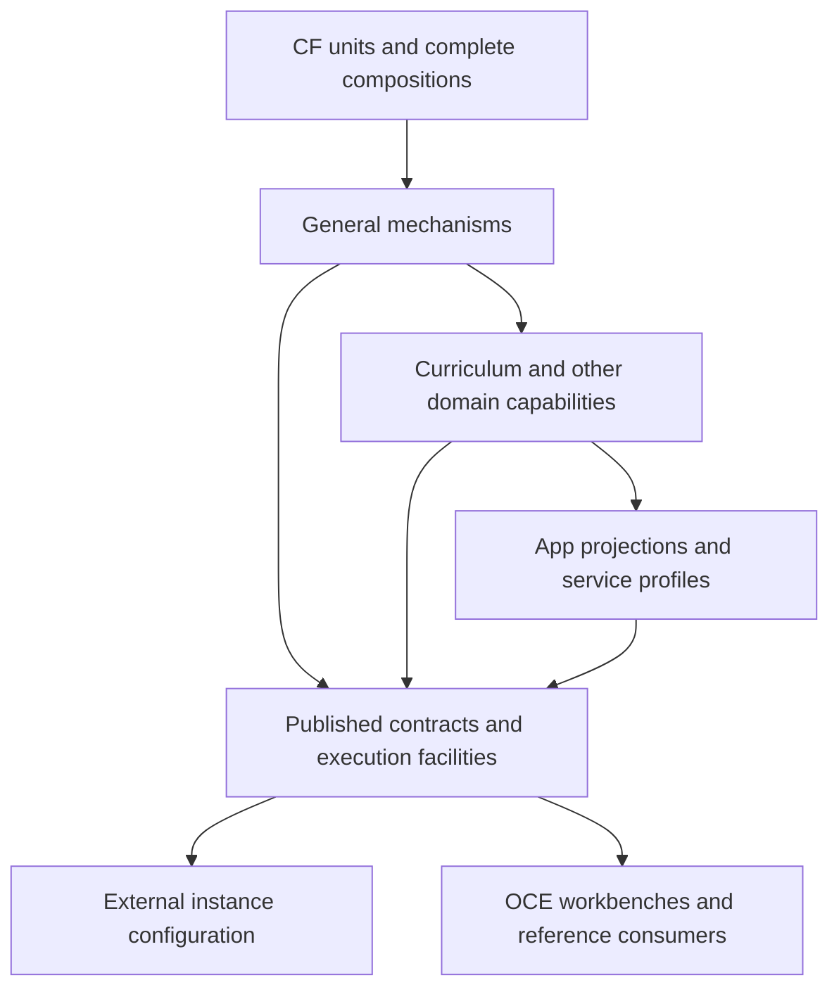

# OCE architecture: one framework, configurable instances

**Edition 1, 10 October 2026.** [ADR-233](architectural-decisions/233-retained-framework-and-configurable-instances.md)
owns the settled direction. This document owns the proposed implementation
architecture and its open invariant register. It is sufficient to understand the
programme without private chat or research-library access. It describes a target,
not a completed reorganisation.

OCE is the retained capability innovation framework: the place to construct,
compose, investigate, qualify and maintain reusable capabilities and services.
Published packages expose supported portions of that framework. External apps
select instance behaviour; OCE supplies the mechanisms that make those selections
work. Neither a catalogue of packages nor the current MCP application bounds OCE.

## The distinct architectural dimensions

| Dimension                  | Governing question                                              | Consequence                                                                                                                                               |
| -------------------------- | --------------------------------------------------------------- | --------------------------------------------------------------------------------------------------------------------------------------------------------- |
| Capability responsibility  | What complete guarantee does a consumer receive?                | Define it before choosing a package. One package can deliver several cohesive units; one service can compose many packages.                               |
| CF grade and assurance     | What does a unit rely on, and what evidence justifies reliance? | Primitive independence, Component/Subsystem composition and qualification are separate from publication.                                                  |
| Context and semantic layer | Which meanings and policies does the capability own?            | General foundations support domain capabilities; specialised domains and projections preserve their own semantics. No global number of layers is imposed. |
| Source custody             | Where are mechanisms authored and maintained?                   | OCE retains all reusable mechanisms. A domain-specific mechanism can still be reusable.                                                                   |
| Distribution               | What immutable supported artefact does a consumer install?      | Public exports, licences, dependency closure and compatibility are deliberate contracts.                                                                  |
| Runtime and instance       | Where and under whose authority is it executed?                 | Several configured services, stores or indexes may consume the same mechanisms. Source co-location does not mandate co-deployment.                        |
| Product authority          | Who chooses purposes and permitted behaviour?                   | A configuration selects within delegated powers; it cannot enlarge them. Dait and Clef remain distinct consumers and programmes.                          |

The former `core` directory is a current physical arrangement, not the target
architecture. Its ten workspaces have [explicit reconstruction dispositions](foundations/oce-cf-reconstruction.md).
The two-family toolkit/Oak distinction remains useful for dependency direction
and identity separation; it is not a requirement to force every capability into a
predetermined new directory count. Choose responsibility and public contract,
then a supported physical location, then move consumers and retire the old home.

## Logical responsibility map

Arrows show allowed construction or consumption, not a mandatory synchronous
request chain. All boxes above external instance configuration are maintained in
OCE. An external app references the published runner; it does not reimplement
that runner. Provider integrations supply effects behind owned interfaces. A
public API, SDK and MCP surface can share domain capabilities without forcing
every internal call through a network API. Generated distribution is a view of
an identified source, not another editing authority.

The package closure for an MCP instance includes its actual host/authentication,
tools/resources, curriculum access, search/graph clients, presentation, telemetry,
configuration and build/release needs. It is discovered from imports and supported
behaviour, not from today's folder boundaries. Provider credentials are acquired
at explicit execution boundaries. No package may discover a monorepo root or read
ambient deployment configuration on import.

## Open invariant register

**A** means explicit owner direction, **H** an inherited accepted obligation,
and **D** a derived proposed obligation of this design. A D row is not a fabricated
owner ratification. Evidence below is required future software/design evidence;
none is claimed delivered by writing this register. Discovery remains open.

| ID / status | Invariant, scope and rationale                                                                                                                                                        | Design consequence and falsifier                                                                                                                                                                                                                                                           |
| ----------- | ------------------------------------------------------------------------------------------------------------------------------------------------------------------------------------- | ------------------------------------------------------------------------------------------------------------------------------------------------------------------------------------------------------------------------------------------------------------------------------------------ |
| I01 A       | Full innovation framework retained; all mechanisms and potentially reusable material stay in OCE.                                                                                     | The per-source disposition covers host, tooling, operations and experimentation as well as libraries. A useful mechanism stranded in an external app falsifies the cut.                                                                                                                    |
| I02 A       | Ordinary variation uses instance configuration over already published packages, with zero OCE changes in most cases.                                                                  | The configuration scenarios cover policy, composition, diagnosis, recovery and updates. A supported ordinary change needing an OCE release exposes a design gap.                                                                                                                           |
| I03 A/H     | External consumption is through supported published contracts with complete dependency closure.                                                                                       | Fresh-store install/build/run and export checks reject hidden checkout, deep-import and ambient-root assumptions. A tarball alone is insufficient evidence.                                                                                                                                |
| I04 A/H     | Complete CF responsibilities and compositions retain their qualification obligations.                                                                                                 | Public relied-on guarantees, owned invariants, independence/grade and production correspondence remain visible. A package release cannot relabel an unqualified component.                                                                                                                 |
| I05 A       | Central curriculum, specialised domain and app-projection responsibilities may differ while required meaning remains intact.                                                          | Mapping contracts state intentional omissions, retained distinctions and reconstruction limits. One universal schema is not assumed.                                                                                                                                                       |
| I06 A/H     | Every consequential source-to-consumer transition preserves required identity, meaning, provenance and applicable authority.                                                          | The integrity matrix names both sides, checks and failure. Schema-valid meaning loss is a failure.                                                                                                                                                                                         |
| I07 H/D     | Each authoritative contract has one writer; generated/distributed views retain source and profile identity.                                                                           | Types, validators and adapters derive from their declared authority. API-origin shapes still derive from the API schema; bulk and new domain profiles need their own explicit authority.                                                                                                   |
| I08 H       | Dependency direction is enforced across source, types, emitted declarations, package manifests and public exports.                                                                    | No general-to-domain back edge, lower unit secretly importing a consumer, or undeclared emitted dependency. Reachability matters beyond direct imports.                                                                                                                                    |
| I09 D       | Configuration cannot add executable mechanisms or escalate authority.                                                                                                                 | Closed domain-specific data contracts select registered OCE mechanisms. Inline callbacks, arbitrary code imports, unbounded expressions and unrestricted provider objects are rejected.                                                                                                    |
| I10 D       | A composed release records the versions that were assessed together, including config, schemas, data projection and policy.                                                           | Individually valid versions must also satisfy their connection contract. Unsupported skew fails before activation; restoring one package alone is not presumed rollback.                                                                                                                   |
| I11 D       | Source change, deletion and correction reach every dependent representation under an owned lifecycle.                                                                                 | Source identity and transformation lineage support rebuild, invalidation, tombstones and correction. A removed source record surviving as an untraceable derived result falsifies integrity.                                                                                               |
| I12 D       | Activation is a recoverable transition with a coherent previous state or an explicit forward-only decision.                                                                           | Validate a candidate before making it active; avoid mixed schema/index/package states. Durable writes require a separate data recovery contract.                                                                                                                                           |
| I13 A/D     | Shared mechanisms permit independent instances without accidental data, credential or resource interference.                                                                          | Instance identifiers resolve all resource names; no fixed global alias or shared metadata index silently joins two instances. Shared runtime is an explicit choice.                                                                                                                        |
| I14 D       | Information and delegated powers are minimised for the justified purpose.                                                                                                             | Configuration carries references rather than secrets; diagnostics redact content and sensitive configuration. A source right or API access does not imply learner-data or safeguarding authority.                                                                                          |
| I15 H/D     | Publicly consumable artefacts preserve provenance and licence boundaries.                                                                                                             | Code, content, identity assets and generated output have explicit attribution and redistribution conditions. Public custody of mechanisms does not publish restricted input data.                                                                                                          |
| I16 D       | Evidence follows the exact artefact and supported claim.                                                                                                                              | Proof, tests, evaluation and operational observation have separate scopes. Tool success, agent agreement and source co-location cannot establish service safety or educational benefit.                                                                                                    |
| I17 D       | Every intermediate migration state has one defined authority for each execution and state responsibility.                                                                             | Assessed blue/green coexistence is permitted with explicit routing and state ownership. Compatibility wrappers may translate a supported old contract but cannot keep a disproven mechanism as a fallback. Consumers and retirement conditions are enumerated before removing old exports. |
| I18 H/D     | Portable mechanism does not depend on a particular organisation or repository identity.                                                                                               | Derive deployment/release identity through explicit bindings; retain named identity only in declared packs/provenance. A fork must not publish from an accidentally inherited upstream branch.                                                                                             |
| I19 D       | Every material outcome has an accountable role and a receiving interface, including failure and correction.                                                                           | Roles are programme responsibilities, not assumed staffing commitments. Unassigned operation blocks that operation, not unrelated design or CF construction.                                                                                                                               |
| I20 D       | Long-lived capability evolution remains possible without leaking implementation into consumers.                                                                                       | Supported extensions are published mechanisms with versioned contracts; retirement includes compatibility and consumer update paths. A permanent app-side patch is a failed boundary.                                                                                                      |
| I21 A       | Classroom systems teach under teacher authority toward mastery, with Bayesian modelling foundational to uncertainty. Exact estimators and educational policies remain design choices. | [Wider capability contracts](oce-wider-capabilities.md) preserve this adopted direction and distinguish activity, help, hypothesis and judgement. Infrastructure does not itself establish teaching effectiveness or justify collecting learner data.                                      |

I07–I20 refine obligations that the initial baseline did not fully express. In
particular, version composition, correction/deletion propagation, activation
coherence, privacy of diagnostics and execution authority during migration emerge
from following complete paths rather than checking isolated package boundaries.

## Interactions that determine the design

**Expressiveness and authority (I02/I09/I14).** A tiny environment-variable set
cannot describe ordinary product variation. An unrestricted programming language
would move mechanisms into apps. The proposed middle is a family of typed
declarative contracts: registered capability selections, bounded composition,
policy profiles and constrained parameters. OCE owns validation, execution and
diagnostics. A new operation adds a reviewed OCE capability; changing its approved
parameters does not. This is a design choice to test against the adverse scenarios.

**Layered models and integrity (I05/I06/I07).** A projection can omit irrelevant
information while preserving every distinction its consumers require. Record its
purpose, source revisions and permitted loss; do not assert reversibility where
none exists. Source corrections must still be traceable across the projection.
The existing API generator is not automatically the authority for newly authored
curriculum-domain or learner models.

**CF first and independent delivery (I03/I04/I20).** Lead with the established
geometry-to-heap route and affected reusable foundations. Contract design and
publishing can advance alongside it. An external app needs its supported package
closure, not every eventual CF unit. An interim supported package retains an
explicit reconstruction home and an honest assurance status; sequencing cannot
lower the promised guarantee.

**Retained source and independent release (I01/I10/I13/I18).** The monorepo is the
coherent authoring home. Packages, config versions, source snapshots and instances
can evolve on different clocks. Assess supported combinations and carry their
identities together; do not invent a global release transaction. Initial package
publication retains the existing one-repository-version policy.

**Preservation and retirement (I01/I17).** Preserve useful material, rationale and
behaviour, not duplicate active implementations. A source/disposition record maps
every moved mechanism to its maintained home, fixtures and replacement contract.
Git history preserves historical source; active consumers use one maintained path.

**Castr and CF independence.** Castr's current proposed destination preserves its
ability to stand alone. Integrating its source into OCE does not itself authorise
imports from arbitrary OCE units. The [Castr contract](oce-integrity-and-castr.md)
names the exact decision before a shared-foundation dependency is introduced.

## Full-framework responsibilities and present provision

These are architecture coverage obligations, not a commission to deliver the full
capability catalogue in one migration. A responsibility can be supported by several
existing components, require reconstruction, or need a separate consumer design.

| Responsibility                                              | Present evidence and gap                                                                                                                          | Architectural home / receiving role                                                                |
| ----------------------------------------------------------- | ------------------------------------------------------------------------------------------------------------------------------------------------- | -------------------------------------------------------------------------------------------------- |
| Foundation construction and qualification                   | Existing CF policy, adoption profile and proposed geometry-to-heap delivery; complete qualification not demonstrated                              | CF units/compositions; CF construction maintainer                                                  |
| Curriculum source, transforms, storage and public contracts | API/bulk SDK and graph/search derivations exist; coherent new curriculum-domain authority and source-to-serving integrity need explicit contracts | Domain/data capabilities; curriculum data contract owner                                           |
| Host, transport, authentication and policy                  | Substantial MCP mechanisms currently live in apps                                                                                                 | Published host/service capabilities; platform contract maintainer                                  |
| Search ingestion, retrieval, evaluation and operation       | Existing CLI/SDK mechanisms; independent instance names and automated full lifecycle are incomplete                                               | Search mechanism packages and domain packs; search delivery/operating role                         |
| App views and model projections                             | Presentation and data access exist in current app workspaces; ordinary variation is not yet a complete public contract                            | Reusable projections and experience mechanisms in OCE; instance owner selects policy               |
| Experimentation, fixtures and evaluation                    | Innovation Kit and existing evaluations supply useful partial facilities                                                                          | Workbenches, reusable test/evaluation harnesses, dataset/version lineage; evidence owner           |
| New service composition                                     | Innovation Kit definition preserves broader capability families; a complete supported composition surface is not established                      | OCE service profiles and composition executor; capability/service author                           |
| Development, diagnosis, release and recovery                | Practice, build/release and diagnostics exist; independent installed forms remain work                                                            | Published tooling and supported procedures; release and developer-experience owners                |
| Plugins, skills and guidance                                | Existing authored sources and distribution artefacts; promotion/canonical-custody questions remain                                                | Versioned generated distribution; editorial/distribution owner, with Practice owning its own layer |
| Future learning, teaching and tuition                       | Relevant consumer requirements are distinct from today's curriculum/API work; no full tutor is claimed                                            | Domain-specific future compositions; educational authority and service owner                       |

Dait's current needs and Clef's wider requirements are not interchangeable.
This public architecture incorporates the generic owner-authorised obligations:
the retained innovation framework, layered curriculum capabilities and end-to-end
integrity. Restricted programme briefings, people and schedules are not replicated.
Any product-specific obligation needed to execute a future slice must be expressed
in an approved contract before that slice relies on it; it is never guessed from
another programme's technology choices.

## Detailed contracts and unresolved decisions

Use [configuration contracts](oce-configuration-contracts.md) for supported
variation and desk scenarios, [integrity and Castr](oce-integrity-and-castr.md) for
source-to-consumer obligations, [CF reconstruction](foundations/oce-cf-reconstruction.md)
for construction/qualification, and [instance development](../development/oce-instance-development.md)
for consumption and handover. The native planning index routes their delivery.

Open decisions have bounded homes in those specifications and the programme design
report: configuration representation and composition limits; actual public package
closure; new domain/source contract authority; Castr profile and model strategy;
compatible release combinations; runtime/index sharing; distribution promotion;
and specific adoption of the later CF architecture proposals. A missing decision
blocks only its dependent implementation. None reopens the settled retained-OCE
boundary or justifies another programme-wide inventory.

The [wider capability account](oce-wider-capabilities.md) preserves the B01–B16
build map and four worked domain records beyond the first public instances.
It gives authoring/publication, tuition, research, interoperability, evaluation,
evidence and accepted remedy their own authority and finite contract homes.

## Alternatives and conditions for reopening

The serious alternative within the settled direction is a smaller family of
product-specific configuration contracts over shared packages, rather than a
generic composition language. Prefer that smaller shape until a concrete scenario
requires cross-capability composition. Conversely, an environment-only shell
fails the required policy/composition scenarios and must be expanded.

An extraction-first sequence can deliver earlier ownership only after its package
closure is supported and published. With no handover deadline supplied, it does
not displace CF-first. Waiting for all CF would delay unrelated usable contracts
without establishing an actual dependency. Reopen that ordering on a documented
handover constraint or a demonstrated foundational dependency, not a speculative
estimate of team speed.

One shared search service can be useful where consumers deliberately share data,
authority and operating requirements. The architecture also supports separate
instances; possible future consumers alone do not choose between them. Source
custody, capability conformance and eventual educational benefit remain distinct
claims throughout.
