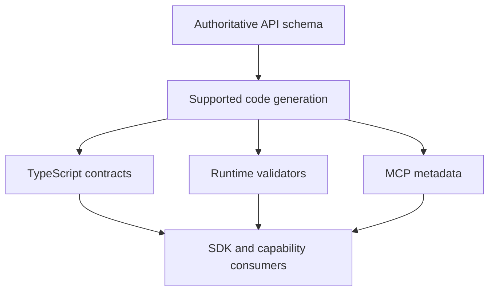

# The OpenAPI-First Pipeline

**Last Updated**: 2026-10-10

**Status**: Active architecture reference

## Consumer data boundary (this monorepo)

API-derived contracts must follow their authoritative API schema and authorised
consumer boundary; no hand-authored duplicate API shape is introduced. This does
not make one API the authority for every bulk, graph, search or new domain model.
Distinct sources and layers require explicit rights, definitions, transformations
and runtime integrity checks under the
[OCE integrity architecture](oce-integrity-and-castr.md). This design does not
authorise a new connection to Oak internal systems. Search access uses the owned
search contract, not an accidental bypass of source authority.

## Problem Statement

Traditional API integration requires:

- Manual type definitions that duplicate API schema knowledge
- Hand-written validators that drift from the actual API
- Separate tool definitions for MCP servers
- Manual updates when APIs change
- Runtime type assertions and unsafe casts

**Result**: Type safety degrades over time, schemas drift, maintenance burden grows, and errors only appear at runtime.

## Our Solution

**Generate API-derived representations from the authoritative API schema.**

This repository implements a pattern where an authoritative OpenAPI specification drives its supported API-derived types, validators, and metadata through automated code generation.

### The Pipeline



### The Key Principle

**Schema changes regenerate the supported API-derived artifacts; consumers and semantic compatibility still require verification.**

The SDK regenerates types and validators. Consumer changes can still be required; independently checked examples must establish semantics and runtime behaviour, including failures and unsupported constructs.

## Key Benefits

### 1. Single Source of Truth

For an API-derived contract, the API schema is its definition authority. The following representations derive from it:

- TypeScript declarations describe the supported source/profile revision
- Zod validators enforce the supported runtime constraints
- MCP metadata describes the approved generated surface
- Generated documentation identifies its contract revision

Generation reduces duplicated definitions. Independent semantic checks and runtime validation must establish the promised agreement; source refresh and compatibility still require evidence.

### 2. Automatic Updates

When the API changes:

```bash
pnpm sdk-codegen  # Fetch schema, regenerate everything
pnpm build        # Type errors show what broke
```

TypeScript compilation failures immediately show what needs updating in consuming code. Runtime validation and explicit failure remain necessary for actual values, source drift and domain obligations.

### 3. Complete Type Safety

- **No `any` types**: Everything is fully typed from the schema
- **No type assertions**: No `as` casts needed
- **Compile-time and runtime checks**: generated types catch supported static incompatibilities; boundary validation still rejects invalid actual values
- **Editor support**: emitted declarations expose the supported static contract

### 4. Reduce duplicated definitions

Traditional approach:

```typescript
// API schema says: { slug: string, title?: string }
// But someone wrote:
interface KeyStageInfo {
  slug: string;
  title: string; // Forgot the optional!
}
```

Our approach:

```typescript
// Generated from the supported schema profile
import type { components } from '@oaknational/curriculum-sdk';
type KeyStageData = components['schemas']['KeyStageData'];
// Static types describe the contract; runtime validation checks actual returns
```

This extends to runtime self-description data, not just types. The
`get-curriculum-model` orientation ontology derives its drift-prone lists (the
subject list, the key-stage list, and the KS4 examSubject variants) from the
generated SDK sources rather than hand-maintaining them. They describe that
generated revision, not an automatically current live API. Display names and
other non-enumerable metadata stay authored (ADR-029, ADR-030); source refresh
and independent comparison remain necessary.

### 5. Pattern Reusability

The pattern is reusable across APIs within an explicitly supported schema and target profile:

- Different API providers
- Multiple versions simultaneously
- Private and public APIs
- Other API surfaces with an authorised, supported OpenAPI contract

## Implementation: Oak Open Curriculum

The primary implementation uses the Oak National Academy Curriculum API:

- **OpenAPI Schema** (codegen in this monorepo uses the swagger URL): `https://open-api.thenational.academy/api/v0/swagger.json` (see `packages/sdks/oak-sdk-codegen/code-generation/codegen.ts`); a sibling `openapi.json` may also exist upstream.
- **Generated SDK**: `@oaknational/curriculum-sdk`
- **MCP Servers**:
  - `apps/oak-curriculum-mcp-streamable-http` (canonical MCP server workspace)
- **Applications**:
  - `apps/oak-search-cli` (hybrid search)
  - Admin tools, status pages, telemetry

### Generalisability

The pipeline is designed to be generic enough that it could
serve additional OpenAPI-described APIs within supported profiles. The planned SDK workspace decomposition (ADR-108)
formalises this by separating generic pipeline concerns from
Oak-specific configuration.

That generality is part of the repository goal. The OpenAPI-to-MCP server
pipeline is both an Oak implementation path and a reusable primitive for the
wider education and technology sectors: a way to turn openly licenced,
well-specified education APIs into typed SDKs, MCP tools, and MCP Apps without
hand-maintained schemas or host-specific wrappers.

## How It Works

### Type Generation Flow

1. **Fetch OpenAPI Schema**: `code-generation/codegen.ts` fetches the remote schema
2. **Generate TypeScript Types**: Using `openapi-typescript`
3. **Generate Zod Schemas**: Using `openapi-zod-client`
4. **Generate MCP Tools**: Custom script `code-generation/mcp-toolgen.ts` creates tool metadata
5. **Generate URL Helpers**: Custom script creates canonical URL generators
6. **Commit Artifacts**: Generated code is committed for review and CI

### Runtime Consumption

MCP servers import generated tools:

```typescript
import { MCP_TOOLS, executeToolCall } from '@oaknational/curriculum-sdk';

// Tools are already defined - no manual work
for (const tool of MCP_TOOLS) {
  server.tool(tool.name, tool.inputSchema, async (args) => {
    return executeToolCall(client, tool.name, args);
  });
}
```

Applications import generated types:

```typescript
import type { components } from '@oaknational/curriculum-sdk';
import { parseWithCurriculumSchema } from '@oaknational/curriculum-sdk';

type KeyStageData = components['schemas']['KeyStageData'];

// Types and validators already exist — generated from the OpenAPI schema
const result = parseWithCurriculumSchema(response, 'KeyStageData');
// result is fully typed, no assertions needed
```

## Extending to New APIs

To add a new OpenAPI-based API:

1. **Create SDK Package**: `packages/sdks/your-api-sdk/`
2. **Configure Type Generation**:
   - Add `code-generation/codegen.ts` to fetch the OpenAPI schema
   - Configure generation scripts for your API's structure
3. **Run Generation**: `pnpm sdk-codegen` to create artifacts
4. **Create MCP Server**: Import generated tools from your SDK
5. **Build Applications**: Import generated types from your SDK

### Example Structure

```text
packages/sdks/your-api-sdk/
├── code-generation/
│   ├── codegen.ts           # Fetch OpenAPI schema
│   ├── mcp-toolgen.ts       # Generate MCP tools
│   └── url-helpers.ts       # Generate canonical URLs
├── src/
│   ├── types/generated/     # Generated types and tools (DO NOT EDIT)
│   └── client/              # Runtime client (hand-written)
└── package.json
```

## Architectural Decision Records

This pattern is formalized in several ADRs:

- **[ADR-029](./architectural-decisions/029-no-manual-api-data.md)**: No manual API data structures - everything from OpenAPI
- **[ADR-030](./architectural-decisions/030-sdk-single-source-truth.md)**: SDK as the single source of truth for API contracts
- **[ADR-031](./architectural-decisions/031-generation-time-extraction.md)**: All transformations happen at build/generation time
- **[ADR-048](./architectural-decisions/048-shared-parse-schema-helper.md)**: Shared parsing helpers pattern for validation

## Related Documentation

- [Programmatic Tool Generation](./programmatic-tool-generation.md) - Details on MCP tool generation
- [SDK Documentation](../../packages/sdks/oak-curriculum-sdk/README.md) - Runtime usage of the generated SDK
- [Root README Quick Start](../../README.md#quick-start) - Getting started guide

## Execution Model: Schema-First Tool Invocation

The OpenAPI pipeline doesn't stop at type generation - it extends to **runtime execution**. Every MCP tool call follows a schema-driven execution path:

### The Execution Layers

```text
1. Contract
   ↓ ToolDescriptor<TName, TClient, TArgs, TResult>

2. Definitions (GENERATED)
   ↓ MCP_TOOL_DESCRIPTORS literal map

3. Type Aliases (GENERATED)
   ↓ ToolArgsForName, ToolResultForName

4. Runtime Helpers (GENERATED)
   ↓ callTool(), callToolWithValidation()

5. Façade (AUTHORED)
   ↓ Thin wrapper, repository-specific error mapping only
```

### Key Constraints

From [Schema-First Execution Directive](../../.agent/directives/schema-first-execution.md):

- **No manual tool registration** - All tools come from `MCP_TOOL_DESCRIPTORS`
- **No unvalidated consumer result** - Internal transport/dispatch values may be `unknown`; generated validation establishes the promised consumer type without widening a validated union
- **No duplicate API-shape validators** - Generated helpers own API-shape validation; domain, authority and additional application obligations still require their own checks
- **No overrides or fallbacks** - Missing descriptors are generator bugs, fail fast

### Why This Matters

This execution model separates these responsibilities:

1. **Runtime contracts** - Generated validators check supported values; domain meaning and effects need additional evidence
2. **Catalogue and exposure** - Source changes regenerate candidate descriptors under declared exclusions; served-surface classification and approval determine exposure
3. **Generated mapping** - Shared descriptor generation reduces duplicate SDK-to-MCP mappings
4. **Transformation ownership** - The generator is the maintained transformation mechanism; the schema and domain source retain definition authority

### Generator-First Mindset

When behavior needs to change:

1. ✅ Update generator templates in `code-generation/typegen/mcp-tools/`
2. ✅ Run `pnpm sdk-codegen` to regenerate
3. ❌ Never edit generated files manually
4. ❌ Never add runtime workarounds for "missing" descriptors

See [Schema-First Execution Directive](../../.agent/directives/schema-first-execution.md) for complete implementation requirements.

## Known Constraints and Limitations

### Zod v3-to-v4 Transformation Edge Cases

The current pipeline uses `openapi-zod-client` to generate Zod schemas, then
transforms them from v3 to v4 via an adapter
(`packages/core/openapi-zod-client-adapter`). Two edge cases are known:

- **`.strict().and(.strict())` intersection failure**: When `strictObjects: true`
  is enabled, `openapi-zod-client` generates `.strict().and(.strict())` for
  OpenAPI `allOf` schemas. Each `.strict()` rejects the other side's properties,
  making intersections impossible to validate. This is fixed via a two-pass regex
  in `zod-v3-to-v4-transform.ts`.
- **Regex replacement gotcha**: The `.and($1$2)` replacement capture groups can
  produce double parentheses if `$2` captures the closing `)`. Test assertions
  must be scoped carefully to avoid false positives.

### Adapter Rebuild Requirement

The adapter package must be built (`pnpm build`) before `pnpm sdk-codegen` picks
up changes. The SDK consumes the adapter's built output, not its source. If you
modify the adapter and run `pnpm sdk-codegen` without rebuilding first, the old
transformation logic will be used. Turbo's dependency graph handles this when
using `pnpm make`, but manual `pnpm sdk-codegen` invocations may miss it.

### CI and Offline Mode

CI sdk-codegen requires a cached SDK schema. If the cached schema is missing, the
pipeline throws an error directing you to run `pnpm sdk-codegen` locally first to
populate the cache. This constraint exists because CI environments may not have
network access to the upstream OpenAPI endpoint.

### Declared Path Exclusions

The generators do not consume every path in the upstream document.
`packages/sdks/oak-sdk-codegen/code-generation/excluded-paths.ts` declares the paths held
out, and each constant's TSDoc states which generators honour it and whether the exclusion
is permanent or a deferral with a named ticket to lift it. The committed schema cache and
the emitted `api-schema-original.json` always carry the full upstream document; exclusions
apply from `api-schema-sdk.json` onwards, so the types, Zod schemas, and MCP tools derived
from it are a declared subset of the schema rather than a complete projection of it.

A cut may narrow the input (a whole family absent from every generated layer, as the
deferral does) or the outermost layer (tool emission only, as the permanent skips do) —
never the middle. Skipping a path in one intermediate generator but not its siblings would
leave generated layers disagreeing with each other, which is the one invariant the
generated estate must keep.

### Parameter Generation Edge Cases

If an API parameter has no concrete enum values, no constant or type guard is
emitted — open-ended parameters are handled as open sets. This means some
parameters will not have compile-time-validated values and must be validated
at the application layer.

### Runtime Type Inference Limitation

Tool descriptor resolution is dynamic at runtime, so TypeScript cannot
statically infer the output type from a descriptor name. Generated tool
files use per-tool `STATUS_DISCRIMINANTS` const maps and return `unknown`
from `invoke`, with `validateOutput` providing the type-narrowing boundary.
No type assertions are used in generated code.

### Schema Validation Requirements

The canonical URL decoration requires `components.schemas` to be an object in
the OpenAPI specification. Not all minimal OpenAPI 3 structures meet this
requirement. If the upstream schema changes structure significantly, the
`schema-validator.ts` checks will surface this early.

### ADR-Documented Negative Consequences

The architectural decisions that define this pipeline have documented trade-offs:

- SDK dependency creates a build bottleneck — all workspaces depend on the SDK
  build completing first
  ([ADR-029](./architectural-decisions/029-no-manual-api-data.md))
- Single source of truth creates coupling — changes to the SDK ripple through
  all consumers
  ([ADR-030](./architectural-decisions/030-sdk-single-source-truth.md))
- Generation-time extraction increases build complexity and output file size
  ([ADR-031](./architectural-decisions/031-generation-time-extraction.md))

### Planned Migration: Castr

The intended Castr replacement covers `openapi-zod-client`, its adapter and
`openapi-typescript` once every consumed output and supported profile is
qualified. `openapi-fetch` remains. Castr's destination specification is still
a draft awaiting source-owned ratification; integration is not implemented.
The [current integrity and Castr specification](oce-integrity-and-castr.md)
owns the complete boundary, including approval/readiness, model construction,
independent semantic fixtures, profile mismatches, output coverage and
retirement evidence. Side-by-side agreement alone cannot establish fidelity.
[ADR-055](./architectural-decisions/055-zod-version-boundaries.md) and
[ADR-108](./architectural-decisions/108-sdk-workspace-decomposition.md) retain
their historical context.

## Key Takeaway

**Generate API-derived contract representations from their authoritative schema under a supported profile.**

When you see generated files marked "DO NOT EDIT", that's not a suggestion - it's the core principle. Manual edits would be overwritten on the next `pnpm sdk-codegen` run, and would break the single-source-of-truth contract.

This discipline reduces duplicated contract definitions. Independent semantic evidence, runtime validation, explicit exposure and compatibility checks remain necessary.
